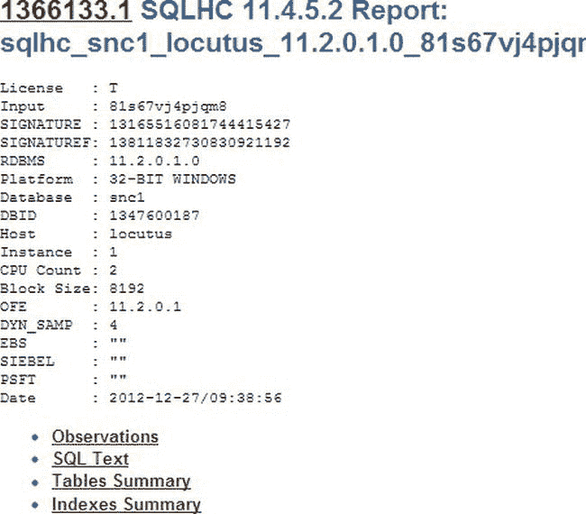

# 执行 SQL 脚本与分析报告

```sql
select /*+ parallel (s, 2) */
  country_name,
  sum(AMOUNT_SOLD)
from
  sh.sales s,
  sh.customers c,
  sh.countries co
where
  s.cust_id=c.cust_id
  and co.country_id= c.country_id
  and country_name in (     'Ireland','Denmark','Poland',
  'United Kingdom',
  'Germany','France','Spain','The Netherlands','Italy')
  group by country_name order by sum(AMOUNT_SOLD);
```

现在我们有了想要研究的 SQL 的 SQL ID，只需要运行 `sqlhc.sql` 脚本。系统将提示我们输入数据库的许可级别（在我的情况下输入 “T”）和 SQL ID。就这么简单。这比 SQLT 简单得多。

```
SQL> @sqlhc.sql
Parameter 1:
Oracle Pack License (Tuning, Diagnostics or None) [T|D|N] (required)

Enter value for 1: T
PL/SQL procedure successfully completed.
Parameter 2:
SQL_ID of the SQL to be analyzed (required)
Enter value for 2: 81s67vj4pjqm8
```

然后 SQL 脚本运行并生成一个输出文件。输出的最后一页如下所示：

```
  adding: sql_shared_cursor_cur_81s67vj4pjqm8.sql (164 bytes security) (deflated 18%)
test of sqlhc_snc1_locutus_11.2.0.1.0_81s67vj4pjqm8_20121227_093856_9_log.zip OK

zip warning: name not matched: sqlhc_snc1_locutus_11.2.0.1.0_81s67vj4pjqm8_20121227_093856_tkprof_from_tool_exec.txt
test of sqlhc_snc1_locutus_11.2.0.1.0_81s67vj4pjqm8_20121227_093856_9_log.zip OK

adding: sqlhc_snc1_locutus_11.2.0.1.0_81s67vj4pjqm8_20121227_093856_5_sql_monitor.sql (164 bytes security) (deflated 71%)
test of sqlhc_snc1_locutus_11.2.0.1.0_81s67vj4pjqm8_20121227_093856_9_log.zip OK

adding: sqlhc_snc1_locutus_11.2.0.1.0_81s67vj4pjqm8_20121227_093856_9_log.zip (164 bytes security) (stored 0%)
test of sqlhc_snc1_locutus_11.2.0.1.0_81s67vj4pjqm8_20121227_093856.zip OK

adding: sqlhc_snc1_locutus_11.2.0.1.0_81s67vj4pjqm8_16777216_3572724195_1_20121227_093856_5_sql_monitor.html (164 bytes security) (deflate 86%)
  adding: sqlhc_snc1_locutus_11.2.0.1.0_81s67vj4pjqm8_16777217_3572724195_1_20121227_093856_5_sql_monitor.html (164 bytes security) (deflate 87%)
test of sqlhc_snc1_locutus_11.2.0.1.0_81s67vj4pjqm8_20121227_093856_5_sql_monitor.zip OK

adding: sqlhc_snc1_locutus_11.2.0.1.0_81s67vj4pjqm8_20121227_093856_5_sql_monitor.zip (164 bytes security) (stored 0%)
test of sqlhc_snc1_locutus_11.2.0.1.0_81s67vj4pjqm8_20121227_093856.zip OK

Ignore CP or COPY error below
'cp' is not recognized as an internal or external command,
operable program or batch file.
f:\app\stelios\diag\rdbms\snc1\snc1\trace\snc1_ora_4012_DBMS_SQLDIAG_10053_20121227_093815.trc
        1 file(s) copied.
  adding: sqlhc_snc1_locutus_11.2.0.1.0_81s67vj4pjqm8_20121227_093856_6_10053_trace_from_cursor.trc (164 bytes security) (deflated 82%)
test of sqlhc_snc1_locutus_11.2.0.1.0_81s67vj4pjqm8_20121227_093856.zip OK

SQLHC files have been created.
```

和往常一样，我们会看到一些关于无法在我的 Windows 系统上运行的 Linux 命令的消息，但它们不会造成问题。本地目录的列表显示生成了一个 zip 文件。

```
sqlhc_snc1_locutus_11.2.0.1.0_81s67vj4pjqm8_20121227_093856.zip
```

现在，我把这个 zip 文件放到一个我创建的单独目录中并解压它。

```
>mkdir sqlhc
>copy sqlhc_snc1_locutus_11.2.0.1.0_81s67vj4pjqm8_20121227_093856.zip sqlhc\
        1 file(s) copied.
>cd sqlhc
>unzip sqlhc_snc1_locutus_11.2.0.1.0_81s67vj4pjqm8_20121227_093856.zip
Archive:  sqlhc_snc1_locutus_11.2.0.1.0_81s67vj4pjqm8_20121227_093856.zip
  inflating: sqlhc_snc1_locutus_11.2.0.1.0_81s67vj4pjqm8_20121227_093856_1_health_check.html
  inflating: sqlhc_snc1_locutus_11.2.0.1.0_81s67vj4pjqm8_20121227_093856_2_diagnostics.html
  inflating: sqlhc_snc1_locutus_11.2.0.1.0_81s67vj4pjqm8_20121227_093856_3_execution_plans.html
  inflating: sqlhc_snc1_locutus_11.2.0.1.0_81s67vj4pjqm8_20121227_093856_4_sql_detail.html
 extracting: sqlhc_snc1_locutus_11.2.0.1.0_81s67vj4pjqm8_20121227_093856_9_log.zip
 extracting: sqlhc_snc1_locutus_11.2.0.1.0_81s67vj4pjqm8_20121227_093856_5_sql_monitor.zip
  inflating: sqlhc_snc1_locutus_11.2.0.1.0_81s67vj4pjqm8_20121227_093856_6_10053_trace_from_cursor.trc
```

运行健康检查脚本就是这些。现在我们只需要查看各个单独的文件。

## 主要健康检查报告

第一个 HTML 文件包含主报告，涵盖了观察结果、SQL 文本（以便我们确认正在查看正确的页面）以及表和索引的摘要信息。图 14-1 显示了第一页的顶部部分。



图 14-1 . 第一个 SQLHC HTML 文件的顶部

报告中的每个部分都可以通过上图中所示部分的超链接访问。在接下来的章节中，我将查看此报告四个部分中的三个，省略不言自明的 SQL 文本部分。

