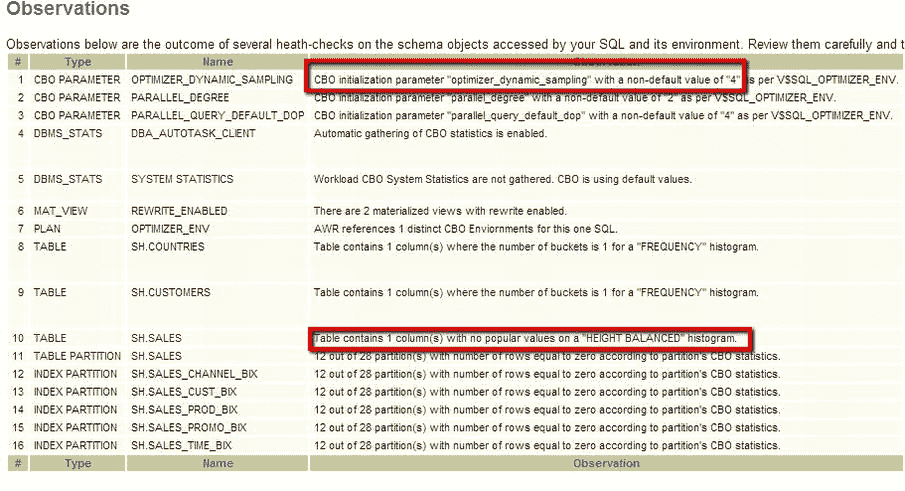
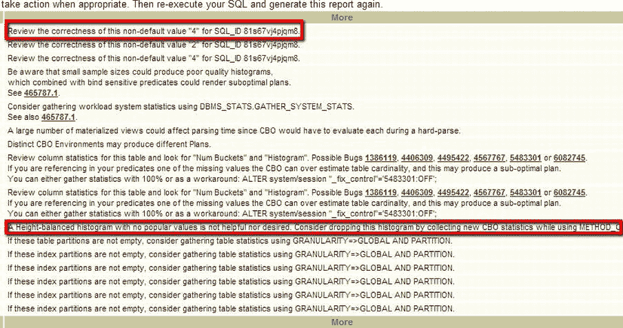
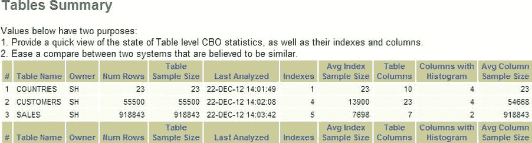
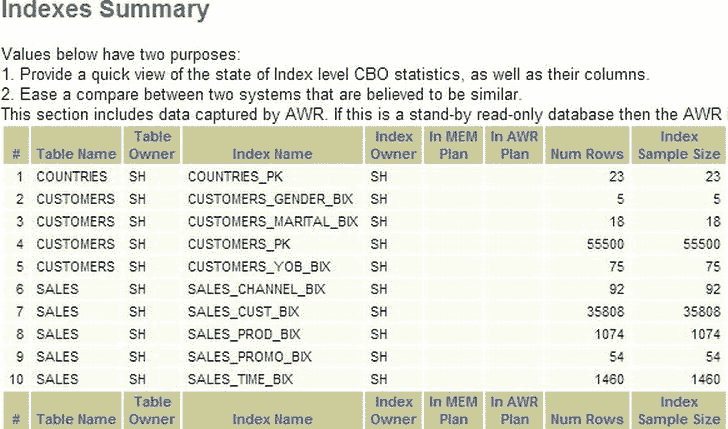

# 观察结果部分

最有趣的是“观察结果”部分，它列出了其认为值得关注的观察项。通常这些是关于非标准设置或不符合最佳实践的架构项目的提示。让我们看一个示例的“观察结果”部分，如 图 14-2 所示。

图 14-2 . 健康检查的观察结果部分

观察结果部分包含许多关于如何改进 SQL 的有趣建议。我只显示了屏幕的左侧。在 图 14-3 中，我展示了对应的右侧屏幕，它告诉我们需要做什么来补救或调查这些观察结果。我在 图 14-2 中重点标记了两个可能值得调查的观察结果。第一个与参数 `optimizer_dynamic_sampling` 的值有关，它有一个非默认值 4（默认值是 2）。第二个与一个没有流行值的 height-balanced 直方图有关。让我们看看显示的右侧（图 14-3）中标签为 “More”（在后续版本的 SQLT 中改为 “Details”）的列。

图 14-3 . 观察结果部分的右侧

“More” 列实际上应该称为“建议”列。例如，对于非默认的 `optimizer_dynamic_sampling` 参数，建议是“Review the correctness of this non-default value “4” for SQL_ID 81s67vj4pjqm8.”。这意味着发现了值 4，并“建议”我们在坚持当前值 4 之前要深思熟虑。建议的值是 2。如果这是一个即将投入生产的 SQL，DBA 和开发人员之间必须讨论为什么将值设置为 4 以及 2 是否更好。

## 解读 SQLHC 观察结果与报告

以 `SH.SALES` 的直方图为例，其建议是：“一个没有热门值的高度平衡直方图既无用处也非所期望。请考虑通过收集新的 CBO 统计信息来删除此直方图，同时使用带 `SIZE 1` 的 `METHOD_OPT`。” 这个建议是在说该列上的直方图没有用处，应该删除。它只会浪费时间。甚至为您提供了统计信息收集的选项。再次强调，如果这出现在预生产测试中，就必须就这个直方图及其是否有用进行一些讨论。

我仅提及了两个观察结果作为示例。即使对于我简单的 SQL，也存在许多建议，并且由于我没有触发导致其出现的规则，还有许多其他可能的观察结果并未出现。当您看到针对您 SQL 的建议时，应仔细审阅它们。有时它们很重要（例如，上面提到的两个会被认为是重要的），在这种情况下，您应该要么（在仔细测试后）更改系统，要么有充分的理由说明为何可以忽略这些建议。在大多数情况下，运行 `SQLHC` 时不会生成观察结果，因为您没有通过做（或不做）触发规则的事情来触发它。这意味着，如果您的观察结果列表很短，那么您做得很好。如果观察结果列表很长，您可能做得不好。

在这个例子中，我会认为“自动收集 CBO 统计信息已启用。”是一个相对不重要的观察结果（在此情况下），因为我知道自己正在以那种方式收集统计信息，并且我知道如果需要，我会收集特定的统计信息来覆盖某些对象。该警告是关于在某些情况下，较小的样本大小可能导致非最优的执行计划。区分重要和不重要的观察结果并不总是容易的。一个观察结果的重要性在一定程度上取决于您的具体情况。请记住，`SQLHC` 只是在遵循规则，它并不“了解”您的环境。您必须判断一个观察结果是否重要。通过实践和对您环境的深入了解，您可以培养出快速去芜存菁的技能。四个 HTML 报告中的每一个都列出了 SQL 文本，但 SQL 文本本身没什么可说的，它就是您 SQL 的文本。如果您已经使用许多不同的参数或提示运行了该 SQL 多次，可能值得快速浏览一下，以确保您正在查看正确的报告。

## “表格摘要”部分

“表格摘要”部分是您应该从 `SQLT XTRACT` 或 `XECUTE` 报告中熟悉的信息集合。请参见图 14-4。

图 14-4 .  SQLHC 报告首页的“表格摘要”部分

在此报告中，我们看到了查询中涉及的表以及统计信息收集的时间。我们还看到一些关于索引和列数量的信息，但请注意，没有超链接来引导我们快速浏览报告。

## “索引摘要”部分

索引显示在图 14-5 中，可通过点击页面顶部的“索引摘要”来访问。与 `SQLT` 报告不同，这里没有从表格部分指向的复杂链接。这是因为 `SQLHC` 脚本要简单得多，无法轻易实现这种链接。

图 14-5 .  来自 SQLHC 的索引报告

为查询中涉及的索引提供了类似的页面。因此，`SQLHC` 的第一个 HTML 报告是关于 SQL 表和索引及其相关观察结果的相当简单的数据集合。下一个 `SQLHC` HTML 报告包含更多部分，其中一些是历史信息。

## 诊断报告

