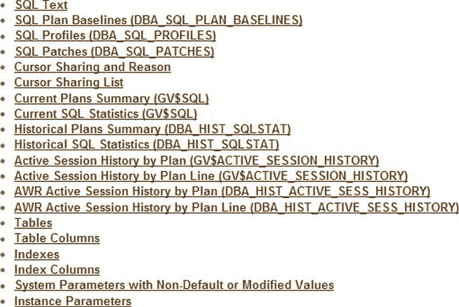
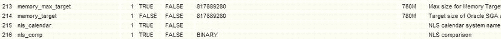
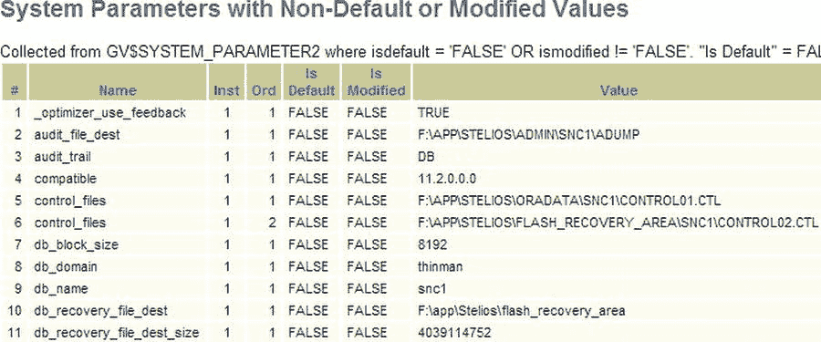
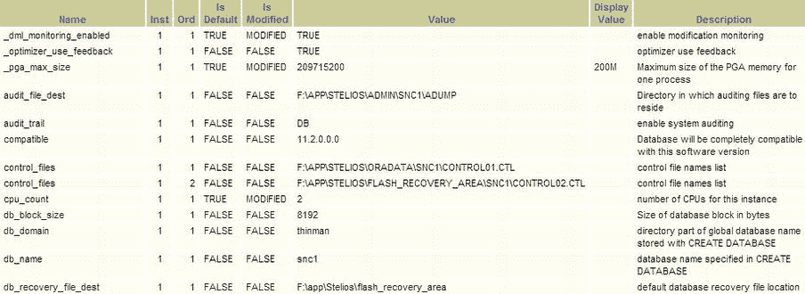
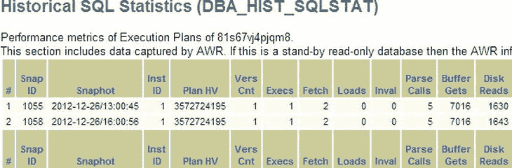
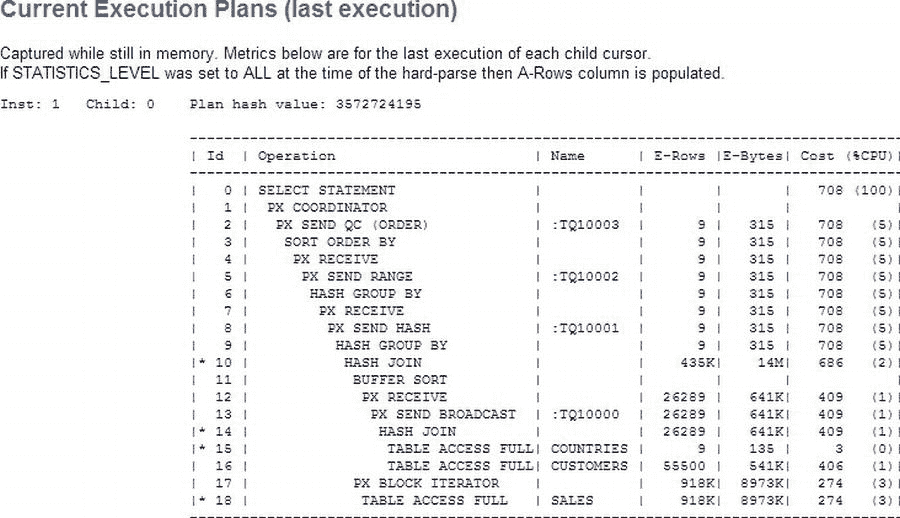

# SQLHC 报告的第二页

SQLHC 报告的第二页可能包含许多信息片段：例如实例参数。某些部分可能不包含信息：例如，在我的案例中，没有正在使用的配置文件。实际上，如果你转到报告中的该部分，你会看到如下文本：

```
Available in 10g or higher. If this section is empty that means there are no profiles for this SQL.
```

（我们在第 6 章中更详细地介绍了配置文件。）图 14-6 展示了 HTML 报告的标题部分。



图 14-6 . 我们在此看到 SQLHC 报告第 2 页的标题部分

通过标题，你可以通过超链接链接到所有提到的部分。这份报告中包含更详细的统计信息。例如，我们拥有所有系统参数（不仅仅是默认参数）以及参数的描述。DBA 应该扫描此部分，以确保对系统的理解与此处看到的内容一致。例如，我看到 `memory_target` 被设置为 780M（见图 14-7）。



图 14-7 . 报告实例参数部分的一个片段

这符合我的预期吗？在我的案例中，是的。这是为了根据你对实例的期望来检查实例设置。另一个例子可能是 `optimizer_mode` 被设置为 ALL_ROWS。幸运的是，我知道这是默认值，也是我期望的值。对于系统上的每个参数，你都应该很好地理解它为何被如此设置。在图 14-8 中，我们看到了非默认参数。你应该更加关注这些参数，因为 SQLHC 告诉你这些设置是不同寻常的。



图 14-8 . 报告的非默认系统参数部分

我们在图中看到，参数的默认值被高亮显示，以及它们当前被手动设置的值。例如，`_optimizer_use_feedback` 被设置为 `TRUE`（这是默认值，但它的值是在 `spfile` 中设置的）。如果我们查看此页面（见图 14-10），我们可以看到参数的描述。



图 14-9 . 初始化参数的描述

最后，我们可以查看 SQHC 能够提供的历史信息。所有常用信息都在那里：磁盘读取、缓冲区获取等。就像在 SQLT 中一样，我们可以利用这些信息将历史与执行计划的任何变更关联起来。



图 14-10 . 我们示例 SQL 的历史信息。（仅显示了报告的左侧部分）

如你所见，SQLHC 报告的第二份报告非常有用，因为它显示了与统计执行相关的指标，并报告了非默认参数以及 SQL 执行的历史视图。历史信息结合计划哈希值（特定执行计划的唯一标识符，简称[PHV]）以及系统初始化参数，对于分析你的 SQL 出了什么问题非常有用。

## 执行计划报告

下一份报告展示了所有捕获到的 SQL 的执行计划。参见图 14-11，该图显示了最近一次执行的执行计划。



图 14-11 . 显示上次执行计划的报告左侧部分

我仅展示了报告的左侧部分，但执行计划的所有常用列都存在。该执行计划显示了一个并行执行，其中 SALES 表与 COUNTRIES 和 CUSTOMERS 的哈希连接进行哈希连接。就像你处理 XTRACT 报告一样，查看各个步骤并判断它们是否合适，本章稍后我们还会看到一份 SQL 监控报告，该报告展示了执行期间时间花费在何处。查看预期的行数，查看每行的成本，看看是否符合你的预期。此外，你还可以看到同一 SQL 的历史执行计划。请记住，所有这些信息都可以从一个**未安装** SQLT 的系统中获得。

