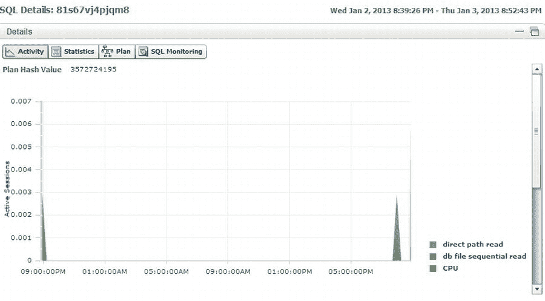
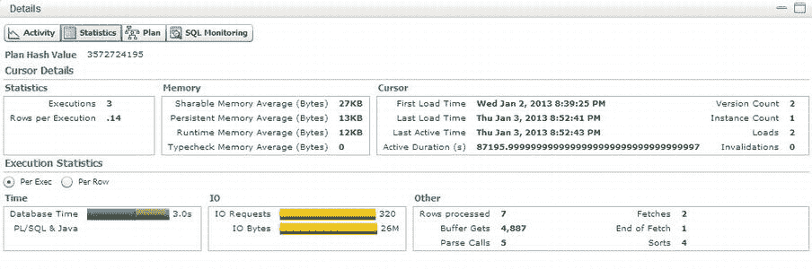
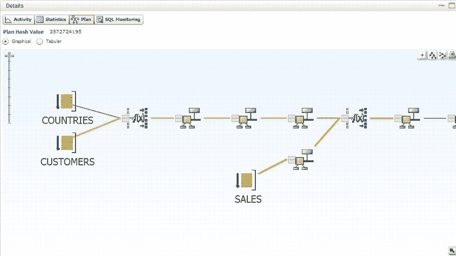
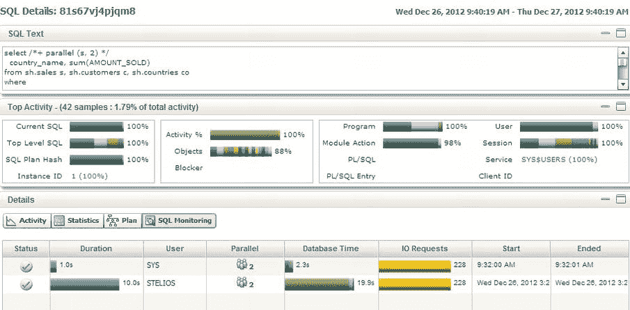

# 监控报告

有两种类型的监控报告。第一种是前面提到的 HTML 文件，它提供了所有被监控 SQL 活动的摘要。第二种监控报告由执行计划的详细信息组成。一个 ZIP 文件包含每个执行计划的单独详细报告。

## SQL 监控摘要报告

第一份报告的目的是将正在调查的 SQL 置于某种上下文之中。毕竟，如果你在调整一条 SQL 语句，你希望确保它对系统有显著影响。换句话说，如果一条 SQL 语句只运行一次，并且只占用 1%的系统资源，而另一条语句却占用 50%的系统资源，那么将第一条语句调整为只需一半时间是没有意义的。

此摘要视图有三个窗格：“SQL 文本”、“顶级活动”和“详细信息”。你可以通过点击窗格右侧的最小化图标来展开或最小化这些部分。“详细信息”窗格有四个图标，分别覆盖“活动”、“统计信息”、“计划”和“SQL 监控”。

*   **活动**：以图形方式显示活动会话及其正在执行的操作。例如，在图 14-12 中，我们看到“详细信息”部分中的“活动”按钮，它显示了在采样间隔接近结束时，“直接路径读取”和“数据库文件顺序读取”出现了一个尖峰。

图 14-12 . 详细信息部分的活动图表

*   **统计信息**：显示游标详细信息，包括执行次数、内存使用情况、游标加载时间、游标版本数、数据库时间以及 I/O 请求等许多其他详细信息，如图 14-13 所示。

图 14-13 . 显示报告“详细信息”部分中的一个统计信息页面示例

*   **计划**：以图形形式显示执行计划。图 14-14 展示了此示例，以从左到右的样式显示计划。

图 14-14 . 显示“详细信息”选项卡中的计划部分

*   **SQL 监控**：显示持续时间、用户、串行/并行状态以及与 SQL ID 相关的其他统计信息。图 14-15 展示了此示例。

图 14-15 . “详细信息”页面上的 SQL 监控选项卡

此报告显示，对于当前的 SQL 文本，几乎 100%的数据库活动都是该 SQL。我们在报告的下半部分看到，我的 SQL 运行了 10 秒，并且是并行运行的。结果是它使用了近 20 秒的 CPU 时间。

## SQL 监控详细报告

