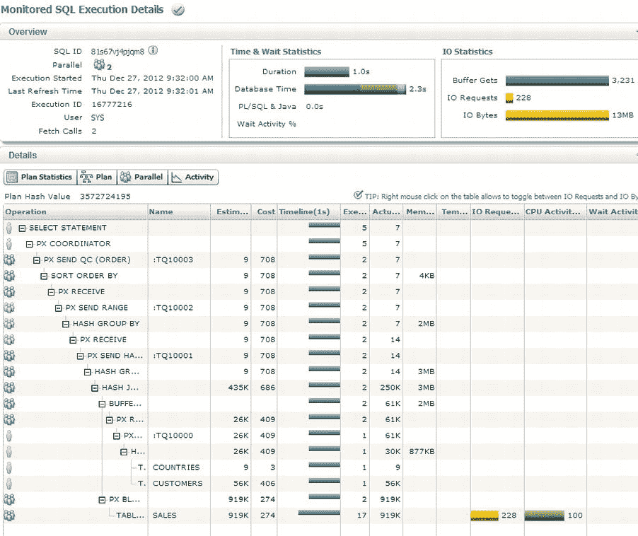
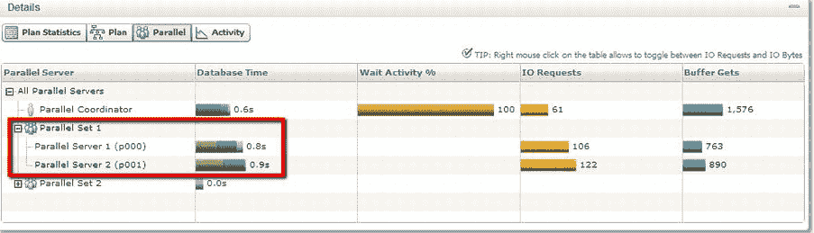
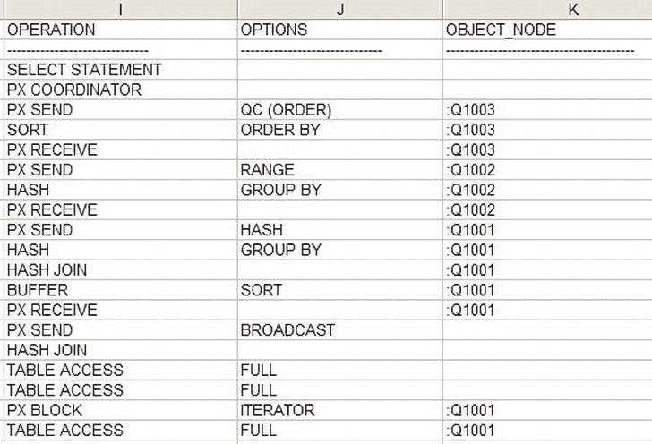

# SQL 监控报告与脚本工具

## 执行计划的详细报告

其他的 SQL 监控报告显示了执行计划的细节。所有相关的 SQL 监控报告都被压缩到一个文件中，每个报告代表一次执行。图 14-16 详细展示了被监控的 SQL 执行计划。



图 14-16 . 细节面板中“**计划统计信息**”按钮对应的其中一个 SQL 监控报告

我们在第 9 章已经介绍过这种执行计划。细节面板的“计划”按钮会显示一个图形化的计划布局，类似于前面图 14-14 所示。“并行”按钮则显示一些与并行相关的信息（见图 14-17）。它展示了每个并行集花费的 I/O 请求、缓冲区获取和 CPU 时间。例如，在我的 SQL 中，我看到并行服务器 `p000` 使用了 0.8 秒的数据库时间，而 `P001` 使用了 0.9 秒。如果我将鼠标悬停在这些条形图上，会得到更详细的信息，细分为 CPU、I/O 和其他。这类报告应该能让您快速、轻松地调查复杂代码的特定分支。



图 14-17 . 显示细节面板上的“并行”按钮页面。并行集 1 已被展开

由 `sqlhc.sql` 脚本生成的主压缩文件内的其余文件是文本文件。一个是该 SQL 的 10053 跟踪文件（在第 5 章介绍过），另一个是 `sqlhc.sql` 脚本自身的日志（您可以检查是否有错误）以及为生成 HTML 文件而创建的临时脚本。

## Sqldx.sql 脚本

`Sqldx` 是为收集单条 SQL 语句的详细信息而编写的。它不需要 SQLT，并会生成许多 CSV 格式文件（逗号分隔值）以便进行进一步分析。它还会生成超过 20 个 HTML 格式的文件。

在下面的例子中，我使用了本章一直在用的同一个 SQL，`q3.sql`。要从 `sqldx.sql` 生成报告，我们只需要在 SQL 运行过的系统上运行该脚本。本例中的 `SQL_ID` 是 `81s67vj4pjqm8`。当我们运行 `sqldx.sql` 时，会提示我们确认许可级别。选择适当的许可级别。我的情况是 `T`。

```
SQL> @sqldx
Parameter 1:
Oracle Pack License (Tuning or Diagnostics) [T|D] (required)
Enter value for 1: T
PL/SQL procedure successfully completed.
```

现在我需要输入报告的格式。`H` 代表 HTML，`C` 代表 CSV 报告，`B` 代表两者。我将选择 `B` 以创建最大数量的文件。一般来说，HTML 文件最有用。CSV 文件是*锦上添花*。它们包含的信息我至今尚未用到。

```
Parameter 2:
Output Type (HTML or CSV or Both) [H|C|B] (required)
Enter value for 2: B
PL/SQL procedure successfully completed.
Parameter 3:
SQL_ID of the SQL to be analyzed (required)
Enter value for 3: 81s67vj4pjqm8
```

在主要执行开始之前，我们会看到传递的值，作为确认我们在做预期操作的依据。

```
Values passed:
∼∼∼∼∼∼∼∼∼∼∼∼∼
License: "T"
Output : "B"
SQL_ID : "81s67vj4pjqm8"
```

执行过程开始，通常只需要几分钟，但如果数据库中有更多数据需要分析，可能需要更长时间。输出几页后，我们会看到最终结果。

```
SQLDX files have been created.
Archive:  sqldx_20130103_195515.zip
  Length      Date    Time    Name
---------  ---------- -----   ----
    39708  01/03/2013 19:55   sqldx_20130103_195515_81s67vj4pjqm8_csv.zip
    67897  01/03/2013 19:55   sqldx_20130103_195515_81s67vj4pjqm8_html.zip
    15118  01/03/2013 19:55   sqldx_20130103_195515_13811832730830921192_force_csv.zip
    28024  01/03/2013 19:55   sqldx_20130103_195515_13811832730830921192_force_html.zip
    26717  01/03/2013 19:55   sqldx_20130103_195515_global_csv.zip
    21463  01/03/2013 19:55   sqldx_20130103_195515_global_html.zip
     6976  01/03/2013 19:55   sqldx_20130103_195515_81s67vj4pjqm8_log.zip
---------                     -------
   205903                     7 files
```

生成的压缩文件包含另外七个压缩文件。是的，就像我说的：**压缩文件套压缩文件**。如果您想追踪哪个文件来自哪个压缩包，可以为每个压缩文件创建一个目录，并将压缩文件解压到该目录中。如果那个压缩文件还包含其他压缩文件，就创建一个子目录来存放它们，依此类推。

*   三个 CSV 压缩文件（普通、强制和全局）。它们包含所收集信息的逗号分隔文件。格式适合导入电子表格。我认为这不如 HTML 格式有用，但可能对进一步分析有用：例如，如果您正在调查复杂的并行语句，可以累加共享内存使用量或执行次数。参见下面的图 14-18，它显示了一个从 `sqldx_20130103_195515_81s67vj4pjqm8_GVsSQL_PLAN.csv` 创建的电子表格示例。这里总共有 20 个其他 CSV 文件，包含各种形式的信息，均为 CSV 格式。（图后是不同压缩包中文件的层次列表，我将其展示出来以使布局清晰。）



图 14-18 . 导入 CSV 结果的一个片段

*   三个 HTML 压缩文件（普通、强制和全局）。这些是我们将要查看以了解 `sqldx` 收集了什么内容的文件。
*   一个日志压缩文件

以下是文件的分层列表，从主压缩文件 `sqldx_20130103_195515.zip` 开始：

`sqldx_20130103_195515.zip` 包含：

*   `CSV` 目录，其中包含：

```
 sqldx_20130103_195515_81s67vj4pjqm8_DBA_HIST_ACTIVE_SESS_HISTORY.csv
           sqldx_20130103_195515_81s67vj4pjqm8_DBA_HIST_SQLSTAT.csv
           sqldx_20130103_195515_81s67vj4pjqm8_DBA_HIST_SQLTEXT.csv
           sqldx_20130103_195515_81s67vj4pjqm8_DBA_HIST_SQL_PLAN.csv
           sqldx_20130103_195515_81s67vj4pjqm8_GVsACTIVE_SESSION_HISTORY.csv
           sqldx_20130103_195515_81s67vj4pjqm8_GVsSQL.csv
           sqldx_20130103_195515_81s67vj4pjqm8_GVsSQLAREA.csv
           sqldx_20130103_195515_81s67vj4pjqm8_GVsSQLAREA_PLAN_HASH.csv
           sqldx_20130103_195515_81s67vj4pjqm8_GVsSQLSTATS.csv
           sqldx_20130103_195515_81s67vj4pjqm8_GVsSQLSTATS_PLAN_HASH.csv
           sqldx_20130103_195515_81s67vj4pjqm8_GVsSQLTEXT.csv
           sqldx_20130103_195515_81s67vj4pjqm8_GVsSQLTEXT_WITH_NEWLINES.csv
           sqldx_20130103_195515_81s67vj4pjqm8_GVsSQL_MONITOR.csv
           sqldx_20130103_195515_81s67vj4pjqm8_GVsSQL_OPTIMIZER_ENV.csv
           sqldx_20130103_195515_81s67vj4pjqm8_GVsSQL_PLAN.csv
           sqldx_20130103_195515_81s67vj4pjqm8_GVsSQL_PLAN_MONITOR.csv
           sqldx_20130103_195515_81s67vj4pjqm8_GVsSQL_PLAN_STATISTICS_ALL.csv
           sqldx_20130103_195515_81s67vj4pjqm8_GVsSQL_REDIRECTION.csv
           sqldx_20130103_195515_81s67vj4pjqm8_GVsSQL_SHARED_CURSOR.csv
           sqldx_20130103_195515_81s67vj4pjqm8_GVsSQL_SHARED_MEMORY.csv
           sqldx_20130103_195515_81s67vj4pjqm8_GVsSQL_WORKAREA.csv
```

*   `FCSV` 目录，其中包含：


