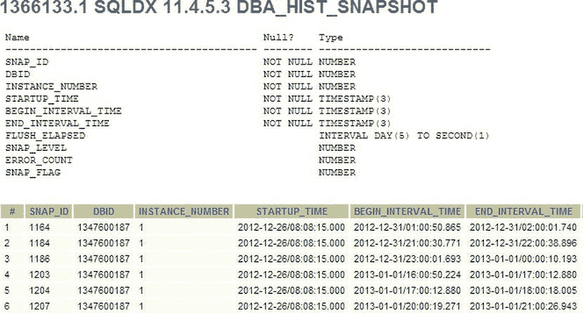
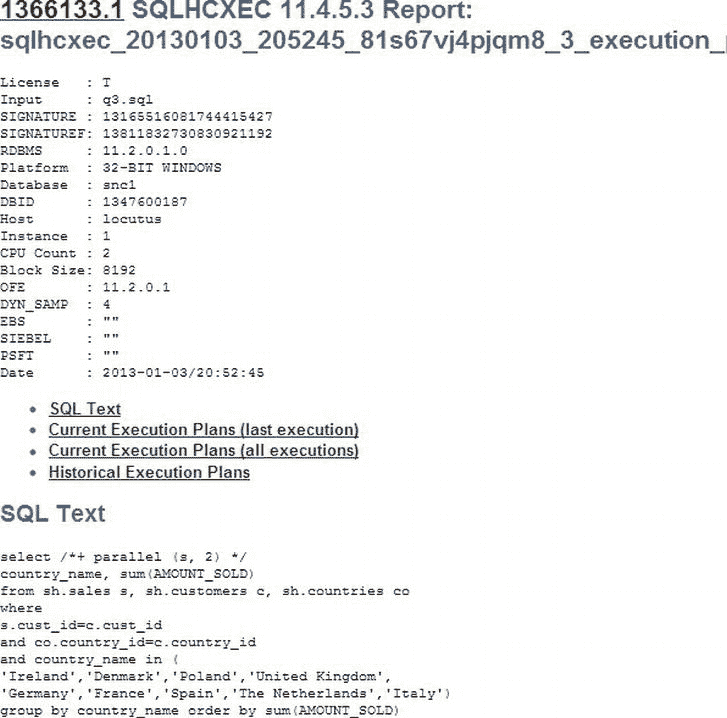

# 文件输出列表

以下是生成的各个目录及其包含的文件：

## `FHTML` 目录

```
sqldx_20130103_195515_13811832730830921192_force_csv.zip
sqldx_20130103_195515_13811832730830921192_force_DBA_HIST_ACTIVE_SESS_HISTORY.csv
sqldx_20130103_195515_13811832730830921192_force_DBA_HIST_SQLSTAT.csv
sqldx_20130103_195515_13811832730830921192_force_GVsACTIVE_SESSION_HISTORY.csv
sqldx_20130103_195515_13811832730830921192_force_GVsSQL.csv
sqldx_20130103_195515_13811832730830921192_force_GVsSQLAREA.csv
sqldx_20130103_195515_13811832730830921192_force_GVsSQLAREA_PLAN_HASH.csv
sqldx_20130103_195515_13811832730830921192_force_GVsSQLSTATS.csv
sqldx_20130103_195515_13811832730830921192_force_GVsSQLSTATS_PLAN_HASH.csv
sqldx_20130103_195515_13811832730830921192_force_GVsSQL_MONITOR.csv
```

## `GCSV` 目录

```
sqldx_20130103_195515_global_csv.zip
sqldx_20130103_195515_global_DBA_HIST_SNAPSHOT.csv
sqldx_20130103_195515_global_GVsPARAMETER2.csv
GHTML directory which contains
sqldx_20130103_195515_global_DBA_HIST_SNAPSHOT.html
sqldx_20130103_195515_global_GVsPARAMETER2.html
sqldx_20130103_195515_global_html.zip
```

## `HTML` 目录

```
sqldx_20130103_195515_81s67vj4pjqm8_DBA_HIST_ACTIVE_SESS_HISTORY.html
sqldx_20130103_195515_81s67vj4pjqm8_DBA_HIST_SQLSTAT.html
sqldx_20130103_195515_81s67vj4pjqm8_DBA_HIST_SQLTEXT.html
sqldx_20130103_195515_81s67vj4pjqm8_DBA_HIST_SQL_PLAN.html
sqldx_20130103_195515_81s67vj4pjqm8_GVsACTIVE_SESSION_HISTORY.html
sqldx_20130103_195515_81s67vj4pjqm8_GVsSQL.html
sqldx_20130103_195515_81s67vj4pjqm8_GVsSQLAREA.html
sqldx_20130103_195515_81s67vj4pjqm8_GVsSQLAREA_PLAN_HASH.html
sqldx_20130103_195515_81s67vj4pjqm8_GVsSQLSTATS.html
sqldx_20130103_195515_81s67vj4pjqm8_GVsSQLSTATS_PLAN_HASH.html
sqldx_20130103_195515_81s67vj4pjqm8_GVsSQLTEXT.html
sqldx_20130103_195515_81s67vj4pjqm8_GVsSQLTEXT_WITH_NEWLINES.html
sqldx_20130103_195515_81s67vj4pjqm8_GVsSQL_MONITOR.html
sqldx_20130103_195515_81s67vj4pjqm8_GVsSQL_OPTIMIZER_ENV.html
sqldx_20130103_195515_81s67vj4pjqm8_GVsSQL_PLAN.html
sqldx_20130103_195515_81s67vj4pjqm8_GVsSQL_PLAN_MONITOR.html
sqldx_20130103_195515_81s67vj4pjqm8_GVsSQL_PLAN_STATISTICS_ALL.html
sqldx_20130103_195515_81s67vj4pjqm8_GVsSQL_REDIRECTION.html
sqldx_20130103_195515_81s67vj4pjqm8_GVsSQL_SHARED_CURSOR.html
sqldx_20130103_195515_81s67vj4pjqm8_GVsSQL_SHARED_MEMORY.html
sqldx_20130103_195515_81s67vj4pjqm8_GVsSQL_WORKAREA.html
sqldx_20130103_195515_81s67vj4pjqm8_html.zip
```

## `LOG` 目录

```
sqldx_20130103_195515_81s67vj4pjqm8_driver.sql
sqldx_20130103_195515_81s67vj4pjqm8_log.zip
```

总共存在超过 80 个不同格式（HTML、CSV 和纯文本）的文件，数量太多无法逐一详述。这里仅提及 `DBA_HIST_SNAPSHOT` HTML 文件，它显示了相关 SQL 的历史信息，包括其开始时间以及所在的 AWR 快照。在 图 14-19 中，展示了该页面的部分内容。



图 14-19 . 来自 `sqldx` 的 HTML `DBA_HIST_SNAPSHOT` 报告

## `sqlhcxec.sql` 脚本

到现在，你肯定已经是 SQLT 专家了，很可能已经猜到了这个例程的作用。该例程接受两个参数：许可级别和包含要分析 SQL 的文件名。请记住，这一切都是在 SQLT 未安装在数据库上的情况下运行的。输出文件包含两个主要文件：一个显示查询结果的结果文件，以及一个包含所有报告的 zip 文件。

该报告输出的最后几行如下所示：

```
SQL> @sqlhcxec
Parameter 1:
Oracle Pack License (Tuning, Diagnostics or None) [T|D|N] (required)
Enter value for 1: T
PL/SQL procedure successfully completed.
Parameter 2:
SCRIPT name which contains SQL and its binds (required)
Enter value for 2: q3.sql
Values passed:
∼∼∼∼∼∼∼∼∼∼∼∼∼
License: "T"
Script : "q3.sql"
In case of a disconnect review sqlhcxec_20130209_122156_error.log
SQL> PRO Ignore MOVE or MV error below
Ignore MOVE or MV error below
SQL> SET TERM OFF;
'mv' is not recognized as an internal or external command,
operable program or batch file.
SQL> WHENEVER SQLERROR EXIT SQL.SQLCODE;
SQL>
SQL> BEGIN
  2    IF '^^sql_id.' IS NULL THEN
  3      RAISE_APPLICATION_ERROR(-20200, 'SQL_ID "^^sql_id." not found in memory.');
  4    END IF;
  5  END;
  6  /
PL/SQL procedure successfully completed.
SQL>
SQL> WHENEVER SQLERROR CONTINUE;
SQL> SET ECHO ON TIMI ON;
SQL>
SQL> /***********************************************
SQL>  *
SQL>  * begin_common: from begin_common to end_common sqlhc.sql and sqlhcxec.sql are identical
SQL>  *
SQL> ****************************************************************************************/
SQL> SELECT 'BEGIN: '||TO_CHAR(SYSDATE, 'YYYY-MM-DD/HH24:MI:SS') FROM dual;
```

为了清晰起见，我省略了许多行，脚本最终以这些行结束：

```
SQLHCXEC files have been created.
Archive:  sqlhcxec_20130103_205245_81s67vj4pjqm8.zip
  Length      Date    Time    Name
---------  ---------- -----   ----
    16784  01/03/2013 20:53   sqlhcxec_20130103_205245_81s67vj4pjqm8_1_health_check.html
   146959  01/03/2013 20:54   sqlhcxec_20130103_205245_81s67vj4pjqm8_2_diagnostics.html
    34947  01/03/2013 20:54   sqlhcxec_20130103_205245_81s67vj4pjqm8_3_execution_plans.html
    81269  01/03/2013 20:54   sqlhcxec_20130103_205245_81s67vj4pjqm8_4_sql_detail.html
   327092  01/03/2013 20:54   sqlhcxec_20130103_205245_81s67vj4pjqm8_6_10046_10053_trace_from_user_script_exec.trc
    23968  01/03/2013 20:54   sqlhcxec_20130103_205245_81s67vj4pjqm8_9_log.zip
    15367  01/03/2013 20:54   sqlhcxec_20130103_205245_81s67vj4pjqm8_5_sql_monitor.zip
   247417  01/03/2013 20:54   sqlhcxec_20130103_205245_81s67vj4pjqm8_8_sqldx.zip
---------                     -------
   893803                     8 files
```

`sqlhcxec` 的 zip 文件包含八个文件：

*   一个健康检查 HTML 文件，其内容与 `sqlhc.sql` 的输出（上文提到过）相同。
*   一个诊断 HTML 文件，其内容也与上面提到的 `sqlhc.sql` 的输出（诊断和配置文件页面）相同。
*   一个执行计划 HTML 文件，显示了当前的执行计划和历史执行计划（这是 `sqlhc.sql` 没有的）。请参见下文的 图 14-20。



图 14-20 . `sqlhcxec` 执行计划报告，显示了历史执行计划

