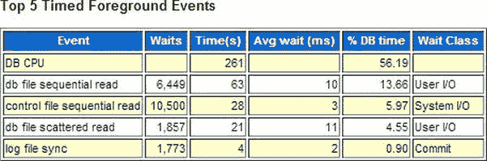
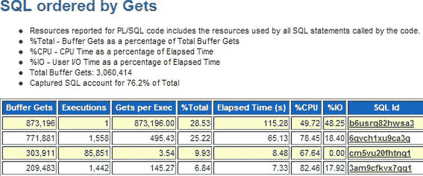

# 第 15 章

## 最终总结

*   一个 SQL 详情 HTML 文件，类似于由`sqlhc.sql`生成的那种。
*   一个压缩包，其中包含针对该 SQL 已知历史执行的 SQL Monitor HTML 文件。
*   一个针对该 SQL 执行的 10046 / 10053 HTML 文件。
*   一个`sqldx`压缩包，包含与执行`sqldx.sql`结果相同的所有报告。
*   一个压缩的日志文件。

## 总结

SQL 健康检查工具虽然与 SQLT 没有直接关联也不依赖它，但包含了许多与 SQLT 相同的元素。创建它的目的是，对于那些不想或无法安装 SQLT 的站点，可以通过使用`sqlhc.sql`及其关联脚本获得一些好处。SQLHC 不像 SQLT 那样各组件相互关联，也没有那么多潜在的观察点（SQLHC 大约有一百个可能的观察点，而 SQLT 有 200 到 300 个）。SQLHC 足够有用，应被视为最低要求，针对新的生产环境 SQL 运行它来检查观察点和预期的执行计划。我们的 SQLT 之旅即将结束，因此在下一章，我将退后一步，为你提供一个关于调优的更宏观视角。

## 调优方法论

调优方法论不是本书的主题，但我认为有必要对此说几句，因为 SQLT 可以成为一个良好策略的核心要素。在我看来，缺乏一个核心的方法来解决 SQL 调优问题，一直是 DBA（尤其是他们）以及需要编写高效代码的开发者面临的主要问题。当你遇到一个调优问题时，从哪里开始？通常这取决于你遇到的是哪种问题。为了帮助你，这里是我的五步法。

1.  获取问题时间段的 AWR 报告。如果在报告的“Top 5 waits”部分存在“显著”问题，先处理那个。如果没有明显问题，则检查 AWR 报告的“SQL Report”部分。如果有某个 SQL 比其他 SQL 消耗更多资源，那么获取一个合适的 SQLT 报告。始终根据 AWR 报告中呈现的证据来引导你，而不是根据自己的直觉或猜测。
2.  如果是单个 SQL 问题，从 SQLT `XTRACT` 或 `XEXCUTE` 开始（取决于你是否能可靠地运行该 SQL），然后利用获得的信息继续深入。如果不能使用 SQLT，那么使用 SQLHC。
3.  评估收集到的信息，并仔细检查任何看起来不寻常的信息（这是持续练习有帮助的地方，因为你开始能识别系统上不寻常的行为）。
4.  调查任何异常并确保理解它们。它们可能是无害的。如果异常无法解释，则尝试评估它们是否可能是问题的原因。
5.  如果你最终在调查一个性能发生变化的单个 SQL，请记住可以部署许多 SQL 工具来获取更多信息。构建一个测试用例，并使用`COMPARE`，或者在绝望时使用`XPLORE`（如果你有时间的话）。

这种高层次的方法论有几个关键要素。首先是识别异常事物。要做到这一点，你必须首先了解什么是正常的，就像我们在第 2 章中遇到的外星访客一样。第二个要素是了解优化器中事物如何工作的知识。这需要练习和一些阅读（希望本书有所帮助）。

重要的是要认识到，SQLT 并不是这种方法论的第一步。尽管 SQLT 对于许多调优问题很有用，但第一步应该是评估整个系统的性能，这可以通过针对相应数据库的 AWR 报告最好地完成。如果问题与操作系统相关，你可能会在那里找到解决方案，并且永远不需要查看 SQLT 报告或任何 SQL。如果你的问题与数据库相关，那么 AWR 报告是了解内存需求、意外等待（在顶部五个事件中看到）的一个很好的起点。参见图 15-1，它显示了 AWR 报告中系统前五个等待的部分。这份报告不是很典型，但至少没有显示异常等待的高百分比。

图 15-1 . AWR 中的前 5 个等待

如果你的系统负载很重，你应该会看到此报告部分中需要调查的等待。根据这些等待是什么，可能会引导你查看报告的 SQL 部分，然后可能建议调查某个特定的 SQL 或一两个 SQL。这时 SQLT 就可以很好地发挥作用（只要该 SQL 不是某些内部的 Oracle 代码）。参见下面的图 15-2，它是按缓冲区获取排序的顶部 SQL。

图 15-2 . 按获取排序的 SQL，AWR 报告的一部分

在上面这份非典型报告中，我们看到一个 SQL 占用了所有获取的 28%，这在生产系统上相当不寻常，你应该可能调查这个（除非你知道它是什么以及为什么它消耗了那么多系统资源）。有时，如果许多 SQL 都发生了性能下降，你可以使用 SQLT 详细查看一个 SQL：这是为了评估困扰该 SQL 的问题，希望影响该 SQL 的因素也将是所有 SQL 的相同解决方案。

## 为什么 SQLT 是毋庸置疑的最佳调优工具

既然我们已经将 SQLT 置于系统调优策略中的适当位置，我们就应当承认，针对单个 SQL 的调优，SQLT 无疑是着手此项工作的最佳起始工具。诚然，市面上有许多调优工具：有些可在 Oracle MOS 站点找到，有些则是付费产品。例如，`TRCANLZR`可作为独立工具使用，`TKPROF`是 Oracle 自带的实用程序，而`10046`和`10053`跟踪可以从标准的 Oracle 安装中收集。然而，它们都只专注于某个特定方面，或是在不提供全局视图的情况下深入探讨某个问题。SQLT 是专注于单个 SQL 的主要工具，并以易于理解的形式为你提供全局视图。当然，SQLT 确实需要你做些工作，分析报告和构建 SQL 的全局视图需要花费一些时间和专业知识。有时，你可能需要比某次 SQLT 运行所提供的更多的信息（例如，共享池被刷新了，或者系统被重启了，因此很多信息丢失了）。根据你通过查看 SQL 历史记录和统计信息所了解到的情况，你可以查看`COMPARE`方法（例如，如果你有一次 SQL 的良好运行记录）。如果你需要进行实验，可以在独立系统上使用测试用例来尝试一些操作，如果你知道变化是由优化器版本变更引起的，你可以使用`XPLORE`。SQLT 就像商场里一位乐于助人的助手：

“先生，我想您今天需要去统计部门。试试二楼，就在过去两扇门的地方。”

## 关于平台的说明

在 IT 术语中，平台是指其他应用程序所驻留的硬件和操作系统。就 Oracle 产品本身而言，它可以被加载到许多不同的平台上：Unix、Linux、OpenVMS、Solaris、Windows 等。就 SQL 命令而言，平台几乎没有区别。一个`select`语句仍然是一个`select`语句。SQLT 可用于 Unix（包括 Linux）和 Windows。其他平台将不允许使用 SQLT 的全部功能。SQLHC，即健康检查脚本，可在 Oracle 运行的所有平台上运行，因为它仅依赖于 Oracle。

在本书中，我几乎所有的示例都是基于 Windows 平台的，但日常情况下，我在 Linux 和 Windows 上都使用 SQLT，并未注意到行为上有任何差异。我也经常在 Exadata 平台上使用 SQLT，同样一切运行如常。本书中为 Windows 展示的每一个示例，在 Linux 上同样可以轻松运行，反之亦然。SQLT 与操作系统的交互通常只发生在报告的最后阶段，即文件正在被收集和压缩的时候。在这些阶段，诸如`cp`（Windows 上为`copy`）和`ls`（Windows 上为`DIR`）之类的命令会生成消息，指出这些命令在当前平台上不存在。这不是一个严重的错误，并且系统会为相应的平台发出替代命令。

## 其他资源

这可能是本书的结束语，但还有许多其他关于 SQLT 的优秀资源可供参考。Metalink 上有很多说明文档：我没有数过，但肯定比这里列出的要多得多。幸运的是，其中许多文档相互链接，因此这些都是很好的起点：

*   `215187.1` – 主要的 SQLT 说明文档，你可以从中下载 SQLT
*   `1454160.1` – 关于 SQLT 的常见问题解答
*   `1465741.1` – 如何使用 SQLT 及测试数据创建测试用例
*   `1455583.1` – 提供对 SQLHC 视频的访问
*   `1366133` – SQL 健康检查脚本

甚至还有网络广播（查看说明文档`740964.1`），它会引导至 Oracle 网络广播计划。选择“Oracle Database”，然后浏览存档的录音。以下是 2012 年关于 SQLT 的一些有趣主题：

*   “Resolve – 使用 SQLT 和 SQLHealthCheck 解决性能问题”
*   “通过浏览一些样本理解 SQLTXPLAIN 主报告”
*   “什么是 SQLTXPLAIN 工具以及如何使用它？”
*   “如何在 5 分钟内使用 SQLTXPLAIN 创建一个 SQL 调优测试用例”

关于 SQL 和 SQLT 的博客可以在以下网址找到：

*   `www.carlos-sierra.net`
*   `www.SteliosCharalambides.com`

## 总结

SQLTXPLAIN 实用程序是 Oracle 客户可用的最有用的免费实用程序之一，它随着 Oracle 产品的多个版本和代次不断演进。最新版本`11.4.5.6`（2013 年 3 月 5 日）已经走过了很长的道路，并增加了许多新功能。它仍在不断发展，无疑将继续演进，但至少在 2013 年会有一个伪冻结期，因此现在是熟悉它的好时机。SQLT 是一个看似简单实则复杂的实用程序，许多功能隐藏在看似普通的脚本中。我希望我已经阐明了其中的一些功能，以便或许能启发你去查看我未提及的其他脚本。请从 MOS 站点获取最新的 SQLT 版本：`http://support.oracle.com`。

我希望你享受了这段旅程，并真诚地希望你使用 SQLT 来了解更多关于你的系统及其上运行的 SQL。记住，关键在于定期使用 SQLT，并利用可靠的资源调查任何你不理解的地方；很快，你就能像最优秀的专家一样进行调优了。

