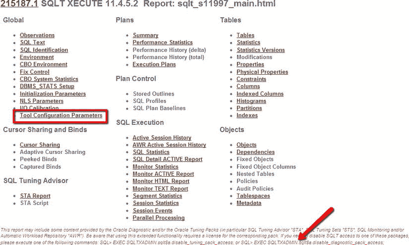

# 附录 A


## 安装 SQLTXPLAIN

你可能会问，为什么要展示一个五分钟内就能安装完成、输入参数最多只有五个的实用程序的安装日志呢？事实情况是，尽管输入简单且大多数安装可以快速轻松地完成，但仍存在安装失败的情况：要么是因为输入有误，要么是因为安装步骤未从具有足够权限的账户执行。你偶尔会遇到一些关于安装可能成功但用户不清楚的问题。这是展示“正常”安装样貌的另一个原因。我还会探讨安装 SQLT 的其他方式，包括“静默”模式和远程安装模式。在 SQLT 安装完成后，还有一些方法可以更改其设置，我也会提及其中一些可用的选项。最后，我还会说明如何卸载 SQLT，例如，当你想要安装更新版本时。通过展示这些选项并描述安装过程，我希望让你相信，安装过程简单而稳健，应被视为任何系统的资产而非负债。

## 标准 SQLT 安装

为了协助任何安装 SQLT 的人，我提供了 SQLT 实用程序的部分安装日志。我已高亮并记录了安装中值得关注和注意的区域。SQLT 的新手可能会觉得这有用，但常用户可能会对关于其他安装方式的章节更感兴趣。在下面的 SQLT 安装示例中，我已将我的响应加粗，以清晰显示我输入数据的位置，并为简洁起见删除了空行。在此示例中，SQLT 的 zip 文件已下载到本地目录并解压。在 zip 文件内部，我们找到了`sqlt`目录和`install`目录（如第 1 章所见）。现在我们以`SYS`身份连接到`SQL*Plus`并启动主安装脚本`sqcreate.sql`：

```
SQL> @sqcreate
PL/SQL procedure successfully completed.
PL/SQL procedure successfully completed.
RDBMS_RELEASE

11.2
RDBMS_VERSION

11.2.0.1.0
no rows selected
```


到目前为止，安装程序已经初始化并发现了它要安装到的环境。接下来的步骤是收集信息，以便安装可以正确地定向。在大多数情况下，安装到本地数据库是最简单、最直接的选择。你只需要一个表空间来存储 SQLT 的信息、包、函数和数据仓库。这个表空间的大小通常非常小（在我的小型安装中大约为 2 Mbytes）。如果你在这里指定一个远程连接，数据将被存储在其他地方，例如在远程数据库上。

```
指定可选的连接标识符（根据 Oracle Net）
包含 "@" 符号，例如 @PROD
如果不适用，直接按 "Enter" 键。
此连接标识符仅在每次执行主要方法之一时导出 SQLT 仓库时使用。
可选的连接标识符（例如 @PROD）：
```

可选的连接标识符并不常用，因为你通常是在本地安装 SQLT。我们将在后面的“远程 SQLT 安装”一节中介绍远程安装的情况。但在这种情况下，我们只需按回车键。

```
PL/SQL 过程已成功完成。
定义 SQLTXPLAIN 密码（隐藏且区分大小写）。
用户 SQLTXPLAIN 的密码：oracle
重新输入密码：oracle
PL/SQL 过程已成功完成。

... 请稍候
表空间                       可用空间 _MB
------------------------------ -------------
USERS                                    246
指定 SQLTXPLAIN 将使用的永久表空间。
表空间名称区分大小写。
默认表空间 [UNKNOWN]: USERS
PL/SQL 过程已成功完成。
... 请稍候
表空间

TEMP
指定 SQLTXPLAIN 将使用的临时表空间。
表空间名称区分大小写。
临时表空间 [UNKNOWN]: TEMP
PL/SQL 过程已成功完成。
```

下一部分是安装中最常引起混淆的部分。“SQLT 的主要应用程序用户”是指实际执行要分析的 SQL 语句的用户的模式名称。这不是 `SQLTXPLAIN`。在本书的大部分内容中，我的示例模式名为 `STELIOS`，因此我在此输入 **STELIOS**。如果出于某种原因你想更改此用户或添加另一个模式，你只需要将 `SQLT_USER_ROLE` 角色授予相关用户即可。这可以通过 `grant SQLT_USER_ROLE to <username>;` 来完成。通常，这个用户名应该可以从 SQL*Plus 提示符连接，以便你可以运行 SQLT 方法。

 **注意** 在某些系统中，SQL 是通过来自另一个系统的远程连接执行的（例如通过 JDBC 连接），并且由于安全限制，用于这些连接的帐户无法通过 SQL*Plus 本地连接。在这些情况下，次优的选择是创建一个模式或使用另一个可以执行 SQL 并且可以访问与目标模式相同数据和对象的模式。在这种情况下，请警惕你没有创建一个无法显示你所遇到问题的不同环境。

```
SQLT 的主要应用程序用户是发出待分析 SQL 的模式所有者。
例如，在 EBS 应用程序上，你可能会
输入 APPS。
不会要求你输入其密码。
在此安装完成后，要添加更多 SQLT 用户，
只需授予他们 SQLT_USER_ROLE 角色。
SQLT 的主要应用程序用户：STELIOS
PL/SQL 过程已成功完成。
SQLT 可以广泛使用 Oracle 诊断包和 Oracle
调优包提供的许可功能，包括 SQL 调优顾问 (STA)、
SQL 监控和自动工作负载仓库 (AWR)。
要启用或禁用从 SQLT 工具访问这些功能，
请在询问时输入以下值之一：
```

这是安装的另一个容易引起混淆的部分，因为 SQLT 的安装者通常不了解相关数据库的许可级别。不幸的是，这没有捷径可走。

```
如果你拥有诊断包和调优包的许可，则输入 "T"
如果你只有 Oracle 诊断包的许可，则输入 "D"
如果你没有这两个包的许可，则输入 "N"
Oracle 包许可 [T]:
PL/SQL 过程已成功完成。
PL/SQL 过程已成功完成。
PL/SQL 过程已成功完成。
PL/SQL 过程已成功完成。
PL/SQL 过程已成功完成。
PL/SQL 过程已成功完成。
PL/SQL 过程已成功完成。
TADOBJ 完成。
PL/SQL 过程已成功完成。
PL/SQL 过程已成功完成。
RDBMS_RELEASE

11.2
RDBMS_VERSION

11.2.0.1.0
未选定行
```

SQLT 的主要安装从这里开始；正如提示中所说，在 SQLT 的全新安装过程中会生成一些错误。这些是正常的 Oracle 错误，是在尝试删除尚不存在的 SQLT 模式中的对象时生成的。

```
SQDOLD 完成。忽略此脚本的错误
SQCUSR 完成。预计会有一些错误。
过程已创建。
无错误。
TAUTLTEST 完成。
SQUTLTEST 完成。
未选定行
TACOBJ 完成。
```

在安装过程中，直到我们进入撤销权限的部分之前，不应该再看到错误。这些错误是正常的，应该忽略。

```
... 正在为 SQLT$S 创建包规范
无错误。
... 正在为 SQLT$T 创建包规范
无错误。
... 正在创建视图
PL/SQL 过程已成功完成。
PL/SQL 过程已成功完成。
RDBMS_RELEASE

11.2
同义词已创建。
REVOKE SELECT, UPDATE ON sys.optstat_hist_control$ FROM SQLTXPLAIN
*
错误出现在第 1 行:
ORA-01927: 无法撤销未授予的权限
授权成功。
同义词已创建。
视图已创建。
REVOKE SELECT ON sys.sqlt$_dba_tab_stats_vers_v FROM SQLTXPLAIN
*
错误出现在第 1 行:
ORA-01927: 无法撤销未授予的权限
授权成功。
同义词已创建。
```

在安装最终结束之前，还有几个类似的错误信息。

```
VALID   PACKAGE BODY 11.4.5.0 TRCA$R
VALID   PACKAGE BODY 11.4.5.0 TRCA$T
VALID   PACKAGE BODY 11.4.5.0 TRCA$X
正在删除 SQLTXPLAIN 对象的 CBO 统计信息 ...
13:42:58 sqlt$a: -> delete_sqltxplain_stats
13:43:01 sqlt$a: <- delete_sqltxplain_stats
PL/SQL 过程已成功完成。
SQCPKG 完成。
TAUTLTEST 完成。
SQUTLTEST 完成。
SQLT 用户在使用此工具前必须被授予 SQLT_USER_ROLE。
SQCREATE 完成。安装已成功完成。
```

最后这条信息 `SQCREATE 完成` 是一个好兆头，表明一切顺利。尽管在安装过程中 SQLT 为你所做的工作量可能看起来很庞大，但安装本身通常不超过五分钟。即使在安装过程中出错了，纠正错误所需的时间也非常短，只需简单地移除 SQLT 并用正确的设置重新安装即可；或者，你也可以在安装后更改设置。例如，如果在安装时许可级别设置错了，你可以使用以下四个例程之一来纠正：

`disable_tuning_pack_access;`

`enable_tuning_pack_access;`

`disable_diagnostic_pack_access;`

`enable_diagnostic_pack_access;`

我在下面的“如何在 SQLT 安装后更改许可级别”一节中提供了有关这些例程用法的更多细节。

## 如何在 SQLT 安装后更改许可级别

SQLT 安装的默认设置适用于大多数情况，但有时你可能需要更改它们。例如，在安装 SQLT 后，你购买了诊断包或调优包的许可。调优包和诊断包可以单独购买，也可以作为捆绑包从 Oracle 购买。如果你没有这两个包，并且你在正常安装中使用了选项 “T”，那么你应该使用 `disable_tuning_pack_access` 和 `disable_diagnostic_pack_access`。以下是示例步骤


SQL 执行示例：
```
SQL> exec sqltxadmin.sqlt$a.disable_tuning_pack_access;
PL/SQL procedure successfully completed.
SQL> exec sqltxadmin.sqlt$a.disable_diagnostic_pack_access;
PL/SQL procedure successfully completed.
```
这些例程不需要任何参数，只需在安装了 SQLT 的数据库上从 SQLT 账户执行即可。您可以通过重新安装 SQLT 来更改许可证级别，但如果您在 SQLT 存储库中有许多想要保留的记录，这不是一个好主意。可配置设置的列表可以在主要 `SQLTXECUTE` 或 `SQLTXTRACT` 报告的“全局”部分下找到（如第 13 章所述）。参见 图 A-1。



图 A-1 .  一个 SQLTXECUTE 报告的顶部，突出显示了配置部分

许可证级别更为重要，并且有专门的例程来管理它们。如果我们安装产品时设置了错误的许可证级别，我们可以使用 `sqltxadmin.sqlt$a` 包进行更改，该包包含前述四个与许可证级别相关的存储过程：
* `disable_tuning_pack_access;`
* `enable_tuning_pack_access;`
* `disable_diagnostic_pack_access;`
* `enable_diagnostic_pack_access;`

这四个存储过程分别禁用和启用 SQLT 中的调优包和诊断包功能。图 A-1 中的箭头指向了 SQLT 主报告顶部显示示例代码的提示。下面我禁用了调优包，然后重新启用，接着又禁用了诊断包并重新启用，最终回到了我开始时的许可证级别。
```
SQL> SQL> exec sqltxadmin.sqlt$a.disable_tuning_pack_access;
PL/SQL procedure successfully completed.
SQL> exec sqltxadmin.sqlt$a.enable_tuning_pack_access;
PL/SQL procedure successfully completed.
SQL> exec sqltxadmin.sqlt$a.disable_diagnostic_pack_access;
PL/SQL procedure successfully completed.
SQL> exec sqltxadmin.sqlt$a.enable_diagnostic_pack_access;
PL/SQL procedure successfully completed.
```
请注意，在早期版本的 SQLT（11.4.4.6 之前及更老版本）中，用于更改许可证级别的例程位于 `SQLTXPLAIN` 模式中，因此更改许可证级别的命令是：
```
SQL> SQL> exec sqlt$a.disable_tuning_pack_access;
PL/SQL procedure successfully completed.
SQL> exec sqlt$a.enable_tuning_pack_access;
PL/SQL procedure successfully completed.
SQL> exec sqlt$a.disable_diagnostic_pack_access;
PL/SQL procedure successfully completed.
SQL> exec sqlt$a.enable_diagnostic_pack_access;
PL/SQL procedure successfully completed.
```

## 远程 SQLT 安装

在安装过程中，您将看到可选的连接标识符提示。通常这是被忽略的，因为您是在本地安装。但是，如果您想以远程模式安装 SQLT，则可以指定一个远程链接。在这些示例中，本地系统是您连接到 SQL Plus 的系统，远程系统是可以找到 SQLT 存储库的系统。
```
Specify optional Connect Identifier (as per Oracle Net)
Include "@" symbol, ie. @PROD
If not applicable, enter nothing and hit the "Enter" key.
This connect identifier is only used while exporting SQLT
repository everytime you execute one of the main methods.
Optional Connect Identifier (ie: @PROD): @REMOTE
```
这会将 `@REMOTE` 附加到所有 SQL 操作上，因此如果您在本地数据库上运行 `@sqltxtract`，它将访问远程数据库来存储 SQLT 信息。

在远程安装中，运行报告的步骤顺序与在本地运行所有操作略有不同。
1.  从本地节点在远程节点上安装 SQLT。
2.  在远程节点上运行 SQL。
3.  在本地节点上运行 `SQLTXTRACT` 或 `SQLTXECUTE` 报告，但该报告在远程节点上运行。
4.  报告在本地节点上生成，但存储库数据存储在远程节点上。

## 其他安装 SQLT 的方法

如果您想将 SQLT 部署到多个系统（谁不想呢？），您可能希望进行非交互式安装。在这种情况下，您可以填充一些变量，然后运行 `sqcsilent.sql`。安装目录中提供了一个名为 `sqdefparams.sql` 的示例变量定义文件。

以下是它包含的内容。这些都是我们在交互式安装中提供的值。
```
DEF connect_identifier      = '';
DEF enter_tool_password     = 'sqltxplain';
DEF re_enter_password       = 'sqltxplain';
DEF default_tablespace      = 'USERS';
DEF temporary_tablespace    = 'TEMP';
DEF main_application_schema = '';
DEF pack_license            = 'T';
```
应根据您的环境更改这些变量：例如，应更改密码，表空间和主要应用程序用户也可能不同。当您在文件中填入自己的值后，就可以运行 `sqcsilent.sql`，它将在“静默”模式下执行，不再提示输入参数。
```
SQL> @sqcsilent.sql
```
您也可以像下面的示例那样，在命令行中带上所有参数运行安装：
```
SQL> @sqcsilent2.sql '' sqltxplain USERS TEMP '' T
```
这也将执行一个正常的安装，不再提示输入信息。这可能是在多个不同系统上进行标准安装的快速方法。

## 如何移除 SQLT

如果您出于某种原因希望卸载 SQLT（例如可能有新版本可用），可以使用 `/install` 目录中名为 `sqdrop.sql` 的例程。此例程没有参数。
```
SQL> @sqdrop
PL/SQL procedure successfully completed.
PL/SQL procedure successfully completed.
RDBMS_RELEASE
            11.2
RDBMS_VERSION
            11.2.0.1.0
no rows selected
... uninstalling SQLT, please wait
TADOBJ completed.
PL/SQL procedure successfully completed.
PL/SQL procedure successfully completed.
RDBMS_RELEASE
            11.2
RDBMS_VERSION
            11.2.0.1.0
no rows selected
SQDOLD completed. Ignore errors from this script
PL/SQL procedure successfully completed.
PL/SQL procedure successfully completed.
RDBMS_RELEASE
            11.2
RDBMS_VERSION
            11.2.0.1.0
no rows selected
SQDOBJ completed. Ignore errors from this script
PL/SQL procedure successfully completed.
PL/SQL procedure successfully completed.
RDBMS_RELEASE
            11.2
RDBMS_VERSION
            11.2.0.1.0
no rows selected
SQL>
SQL> DECLARE
  2    my_count INTEGER;
  3  BEGIN
  4    SELECT COUNT(*)
  5      INTO my_count
  6      FROM sys.dba_users
  7     WHERE username = 'TRCADMIN';
  8  
  9    IF my_count = 0 THEN
 10      BEGIN
 11        EXECUTE IMMEDIATE 'DROP PROCEDURE sys.sqlt$_trca$_dir_set';
 12      EXCEPTION
 13        WHEN OTHERS THEN
 14          DBMS_OUTPUT.PUT_LINE('Cannot drop procedure sys.sqlt$_trca$_dir_set. '||SQLERRM);
 15      END;
 16  
 17      FOR i IN (SELECT directory_name
 18                  FROM sys.dba_directories
 19                 WHERE directory_name IN (
 20                       'SQLT$UDUMP', 'SQLT$BDUMP', 'SQLT$STAGE', 'TRCA$INPUT1', 'TRCA$INPUT2', 'TRCA$STAGE'))
 21      LOOP
 22        BEGIN
 23          EXECUTE IMMEDIATE 'DROP DIRECTORY '||i.directory_name;
 24          DBMS_OUTPUT.PUT_LINE('Dropped directory '||i.directory_name||'.');
 25        EXCEPTION
 26          WHEN OTHERS THEN
 27            DBMS_OUTPUT.PUT_LINE('Cannot drop directory '||i.directory_name||'. '||SQLERRM);
 28        END;
 29      END LOOP;
 30    END IF;
 31  END;
 32  /
Dropped directory TRCA$INPUT2.
Dropped directory TRCA$INPUT1.
Dropped directory SQLT$BDUMP.
Dropped directory SQLT$UDUMP.
Dropped directory TRCA$STAGE.
Dropped directory SQLT$STAGE.
PL/SQL procedure successfully completed.
SQL>
SQL> WHENEVER SQLERROR CONTINUE;
SQL>
SQL> PAU About to DROP users &&tool_repository_schema. and &&tool_administer_schema.. Press RETURN to continue.
```
此时，系统会提示您确认是否要执行 `drop user SQLTXADMIN cascade;` 和 `drop user SQLTXPLAIN cascade;`：

