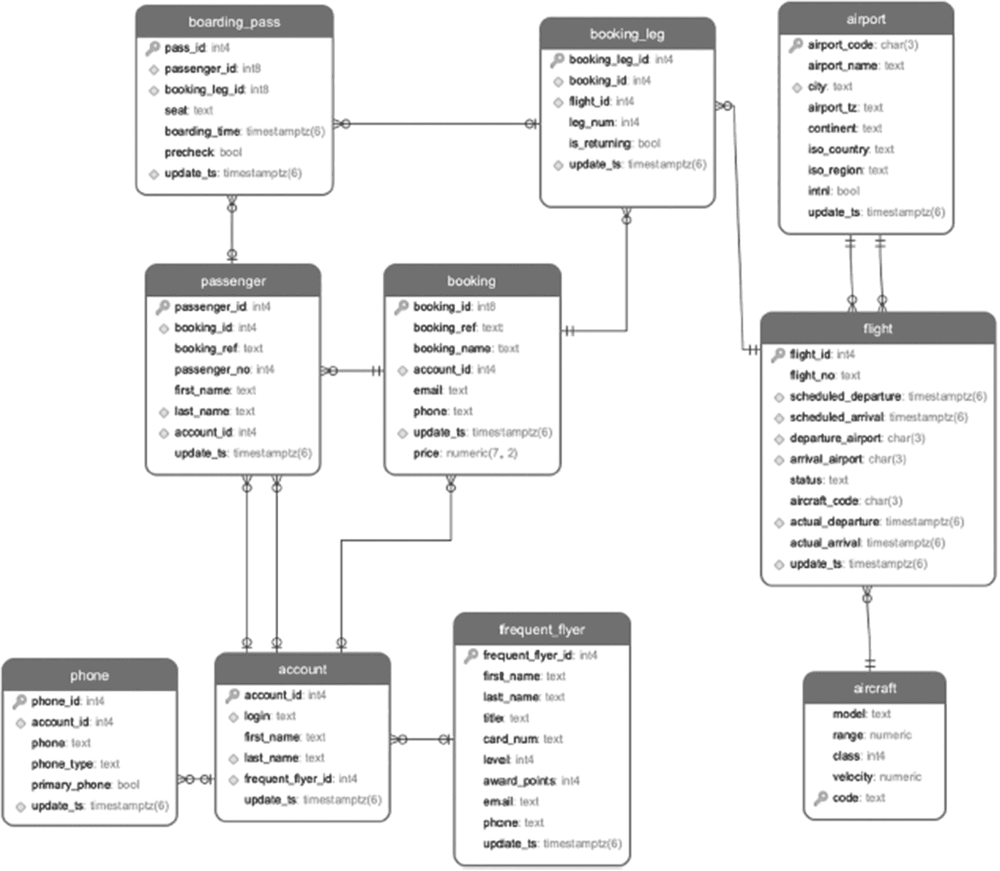

# 引言

“优化”是一个足够宽泛的术语，涵盖了性能调优、个人提升以及通过社交引擎进行营销等范畴，并且总是会引发读者的高度期望和希冀。因此，审慎的做法是，并非从介绍本书涵盖什么内容开始，而是首先说明本书为何存在以及不会涵盖什么内容，以避免那些抱有不当期望的读者感到失望。然后，我们将继续介绍本书的主题、目标读者、涵盖内容以及如何从中获得最大收益。

## 我们为何撰写本书

与许多作者一样，我们撰写本书是因为我们觉得我们 `不得不` 写它。我们是教育工作者和实践者；因此，我们既看到了计算机科学学生在课堂上是如何被教导的，也看到了他们在进入职场时所缺乏的知识。我们不喜欢所看到的现状，并希望本书能有助于弥合这一差距。

在学习数据管理时，大多数学生从未见过真实的生产数据库，更令人担忧的是，他们的许多教授也从未见过。虽然缺乏接触真实系统的机会影响着所有计算机科学学生，但未来的数据库开发人员和数据库管理员（`DBA`）所受的教育受到的影响最为严重。使用一个小型培训数据库，学生可以学习如何编写语法正确的 `SQL`，甚至可能编写出能准确检索所需数据的 `SELECT` 语句。然而，学习编写高性能的查询需要生产规模的数据集。此外，如果学生使用的数据集能轻松装入计算机主内存，并且无论查询多复杂都能在毫秒内返回结果，那么性能可能成为问题这一点可能并不明显。

除了缺乏接触真实数据集的机会外，学生通常也不使用业界广泛使用的 `DBMS`。虽然前面的说法对于许多 `DBMS` 都成立，但对于 `PostgreSQL` 而言，这尤其令人沮丧。`PostgreSQL` 起源于学术环境，并作为一个开源项目进行维护，这使其成为教授关系理论和展示数据库内部原理的理想选择。然而，到目前为止，很少有学术机构在其教育需求中采用 `PostgreSQL`。

随着 `PostgreSQL` 的快速发展并成为一个更强大的工具，越来越多的企业选择它而非专有的 `DBMS`，部分原因是为了降低成本。越来越多的 `IT` 经理正在寻找熟悉 `PostgreSQL` 的员工。越来越多的潜在候选人自学使用 `PostgreSQL`，却错过了充分利用其潜力的机会。

我们希望本书能帮助所有相关方：求职者、招聘经理、数据库开发人员以及正在为数据需求转向 `PostgreSQL` 的组织。

## 不会涵盖的内容

通常，当用户开始抱怨“一切都慢”或夜间备份在光天化日之下才完成，并且每个人似乎都在说“数据库需要优化”时，讨论几乎完全集中在数据库配置参数上，偶尔会涉及底层的 `Linux` 参数。人们常常认为，只要选择了正确的参数值并重启了数据库实例，世界上所有的问题就都会迎刃而解。

我们无数次与期待神奇咒语和作弊码的客户合作过。无数次，当这些客户所求助的“向导”建议他们查找执行最频繁的查询或检查缺失的索引时，他们表达了深深的失望。在礼貌地听完我们所有的建议后，他们仍然追问：那么你能建议 `任何其他的参数更改` 吗？

的确，能够一次性解决所有问题是非常诱人的。这种诱惑导致了一种普遍的信念，即存在某种黑魔法和秘密代码，或者在某个桌子底下隐藏着一个能让数据库运行更快的按钮。

由于我们意识到这些误解，我们希望从一开始就保持透明。以下是通常在优化书籍中会讨论但本书不会涵盖的主题列表，以及原因：

*   `服务器优化` – 随着大规模迁移到各种云环境以及现有的组织结构，数据库开发人员不太可能对服务器的配置方式有发言权。
*   `PostgreSQL 配置参数` – 在本书的第二版中，我们确实涵盖了这个主题。然而，它只占本书相对较小的一部分，因为正如我们将要展示的，它们对性能的影响被高估了，而且通常数据库开发人员没有必要的权限来更改它们（少数例外情况除外）。
*   `分布式系统` – 我们没有足够的相关工业经验。
*   `事务` – 它们对性能的影响非常有限（尽管我们将会在一些它们可能产生重大影响的案例中讨论）。
*   `新颖炫酷的功能` – 这些随着每个新版本的发布而改变，我们的目标是涵盖基础内容。
*   `魔法、仪式、作弊码等` – 我们并不精通这些优化方法。

市面上有大量书籍涵盖了上述所有主题（除了最后一项），但本书并不在此列。相反，我们专注于数据库开发人员日常面临的挑战：当某个应用程序页面持续超时，当客户在“合同签署”页面前被踢出应用程序，当 `CEO` 仪表盘显示的是沙漏而不是昨日的产品 `KPI`，或者当增加硬件不可行时。

我们在本书中介绍的所有内容都已在工业环境中经过测试和实施，尽管它可能看起来像魔法，但我们将解释任何查询性能的提升或缺乏提升的原因。


## 目标受众

大多数时候，关于优化的书籍被视为面向数据库管理员的书籍。既然我们的目标是证明优化不仅仅是建立索引，我们希望这本书能对更广泛的读者群体有所裨益。

本书面向在 PostgreSQL 领域工作的 IT 专业人士，他们希望开发高性能、可扩展的应用程序。它适用于任何职位名称中包含“数据库开发人员”或“数据库管理员”的人，或者是负责编写数据库调用的后端开发人员。对于参与基于 PostgreSQL 数据库的应用系统整体设计的系统架构师来说，本书也很有用。

那么报表编写者和商业智能专家呢？不幸的是，大型分析报表通常被认为天生就是慢的。然而，如果编写报表时不考虑其性能，执行时间可能最终不只是几分钟或几小时，而是几年！对于大多数分析报表，通过使用本书涵盖的简单技术，可以显著减少执行时间。

## 读者将学到什么

在本书中，读者将学习如何：

*   识别 OLTP（在线事务处理）和 OLAP（在线分析处理）系统中的优化目标
*   阅读并理解 PostgreSQL 执行计划
*   识别能够提升查询性能的索引
*   优化全表扫描
*   区分长查询和短查询
*   为每种查询类型选择合适的优化技术
*   避开 ORM 框架的陷阱

在本书的最后，我们介绍了*终极优化算法*，它将引导数据库开发人员完成生成最高效查询的过程。

## Postgres Air 数据库

在整本书中，示例都构建在一个名为 Postgres Air 的虚拟航空公司的其中一个数据库之上。该公司在全球连接超过 600 个虚拟目的地，每周提供约 32,000 次直飞虚拟航班，其常旅客计划拥有超过 100,000 名虚拟会员，每周还有更多乘客。该公司机队由虚拟飞机组成。

请注意，此数据库中提供的所有数据都是虚构的，仅用于说明目的。尽管某些数据看起来非常真实（尤其是对机场和飞机的描述），但它们不能用作有关真实机场或飞机的信息来源。所有电话号码、电子邮件地址和姓名都是生成的。

要在本地系统上安装培训数据库，请参考 GitHub 仓库：`github.com/Hettie-d/postgres_air`。

`README.md`文件包含了数据目录的链接和详细的安装说明。

此外，在恢复数据后，您需要运行清单 1 中的脚本来创建几个索引。

```sql
SET search_path TO postgres_air;
CREATE INDEX flight_departure_airport ON flight(departure_airport);
CREATE INDEX flight_scheduled_departure ON flight  (scheduled_departure);
CREATE INDEX flight_update_ts ON flight  (update_ts);
CREATE INDEX booking_leg_booking_id ON booking_leg  (booking_id);
CREATE INDEX booking_leg_update_ts ON booking_leg  (update_ts);
CREATE INDEX account_last_name ON account (last_name);
```

清单 1
初始索引集

我们将使用此数据库模式来阐述本书涵盖的概念和方法。您也可以使用此模式来练习优化技术。

此模式包含的数据可能存储在航空公司的预订系统中。我们假设您至少曾经在线预订过一次航班，因此数据结构应该很容易理解。当然，这个数据库的结构比任何此类真实数据库的结构都要简单得多。

任何预订航班的人都需要创建一个帐户，该帐户存储登录信息、姓名和联系信息。我们还存储常旅客的数据，这些数据可能与帐户关联，也可能不关联。进行预订的人可以为多名乘客预订，这些乘客在系统中可能有也可能没有帐户。每次预订可能包含多个航班（航段）。在航班起飞前，每位旅客都会收到一张带有座位号的登机牌。

该数据库的实体关系图如图 1 所示。



一个流程图表示了给定模式中乘客、电话、常旅客、预订航段、航班、机场和登机牌实体之间的关系。连接实体的线表示关系，每个实体内的属性列在实体名称下方。

图 1
预订模式的 ER 图

*   `airport` 存储有关机场的信息，包含机场的三字符（IATA）代码、名称、城市、地理位置和时区。
*   `flight` 存储机场间航班的信息。对于每个航班，该表存储航班号、到达和起飞机场、计划和实际到达及起飞时间、飞机代码和航班状态。
*   `account` 存储登录凭证、账户持有人的姓名，并可能包含对常旅客计划会员资格的引用；每个帐户可能拥有多个电话号码，这些号码存储在 `phone` 表中。
*   `frequent_flyer` 存储有关常旅客计划会员资格的信息。
*   `booking` 包含已预订行程的信息；每次行程可能包含多个预订航段和多名乘客。
*   `booking_leg` 存储预订的各个航段。


*   `passenger` 表存储与每个预订关联的乘客信息。请注意，乘客 ID 对于单个预订是唯一的；对于任何其他预订，同一个人将拥有不同的乘客 ID。

*   `aircraft` 表提供飞机的描述，而 `seat` 表存储每种飞机类型的座位图。

*   最后，`boarding_pass` 表存储已签发登机牌的信息。

## 致谢

让一本书面世需要许多人，其中大多数人的名字并未出现在封面上。首先，我们要感谢 Jonathan Gennick，是他提出了这本书的构想并引导了第一版的完成。没有他的倡议，这本书就不会存在。我们也感谢 Apress 整个团队在两个版本中对这项事业的支持。

Tom Kincaid 作为**技术审校员**所做的贡献怎么强调都不为过。他细致、彻底、深思熟虑的反馈改进了文本的内容、结构和可用性。多亏了 Tom，这本书变得更加精确、易懂和全面。我们感激他回来参与第二版的工作，欣然再次进行了细致的审读。当然，任何遗留的问题都是我们自己的责任。

本书第一版发行后，我们收到了许多关于 `postgres_air` 数据库的问题、读者希望涵盖的主题，以及他们认为可以表达得更清晰的段落。这第二版采纳了许多他们的建议。我们感谢所有花时间仔细阅读本书并与我们分享评论和建议的人。特别是，Hannu Krosing 对 `postgres_air` 提供了详尽、细致和具体的反馈，Egor Rogov 则为使本书更易理解、更清晰提供了许多有益的建议。

> —Henrietta Dombrovskaya, Boris Novikov, Anna Bailliekova

感谢 Jeff Czaplewski、Alyssa Ritchie 和 Greg Nelson，他们花费了数小时、数天和数周时间让 `No-ORM (NORM)` 与 Java 协同工作。我在 EDB 的时光是一个与最优秀的 Postgres 专家一起工作并向他们学习的机会。我在 DRW 的同事们——无论是应用程序团队还是数据库管理员 (`DBA`) 团队——都给了我新的机会去推动 Postgres 的极限。

> —Henrietta Dombrovskaya

我要感谢 Andy Civettini 教会我如何以一种易于理解的方式撰写和讲解技术话题，并感谢他多年的学术和职业鼓励。我在 UrbanFootprint 的同事们每天都挑战和激励着我。最后，John、Nadia 和 Kira Bailliekova 都为我的这本书给予了支持并做出了牺牲；我对此无比感激。

> —Anna Bailliekova

## 关于作者 关于技术审校者

