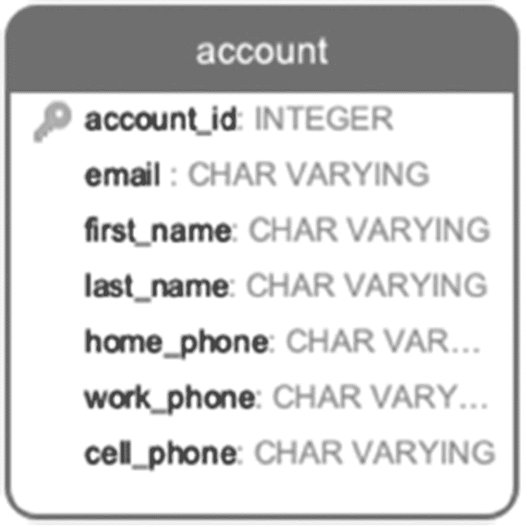

# 1. 为什么需要优化？

本章介绍了为什么优化是数据库开发的重要组成部分。您将了解声明式语言（如 SQL）与命令式语言（如 Java，可能更为您熟悉）之间的区别，以及这些区别如何影响编程风格。我们还将证明优化不仅适用于数据库查询，也适用于数据库设计和应用架构。

## 我们所说的优化是什么意思？

虽然大多数人认为数据库优化就是选择最佳的系统配置参数，但在本书的上下文中，优化是指任何能够提升系统性能的转换。这个定义是特意泛化的，因为我们想强调优化并不是一个独立的开发阶段。很多时候，数据库开发者试图先“让它跑起来”，然后再进行优化。我们认为这种方法并不高效。编写一个完全不知道其运行时间的查询，会带来一个本可以通过从一开始就正确编写来完全避免的问题。我们希望到您读完本书时，您能够准备好以恰恰这种方式进行优化：将其作为查询开发的一个组成部分。

我们将展示一些具体的技术；然而，最重要的事情是理解数据库引擎如何处理一个查询，以及查询规划器如何决定选择何种执行路径。当我们在课堂环境中教授优化时，我们常说，“**像数据库一样思考！**”从数据库引擎的角度审视您的查询，想象它必须做什么来执行该查询；想象一下如果由您自己而不是数据库引擎来执行它，您需要做什么。通过思考工作范围，您可以避免强加次优的执行计划。这一点将在后续章节中更详细地讨论。

如果您实践“**像数据库一样思考**”足够久，它将成为一种自然的思维方式，您将能够立即正确地编写查询，通常不再需要未来的优化。


## 为何困难：命令式与声明式

为什么仅仅写出能返回正确结果的 SQL 语句还不够？在编写应用程序代码时，这就是我们的期望。为什么在 SQL 中情况不同？为什么两个产生相同结果的查询，其执行时间可能天差地别？问题的根本原因在于 SQL 是一种声明式语言。这意味着当我们编写 SQL 语句时，我们描述的是我们想要获得的结果，但我们并没有指定*如何*获得该结果。相比之下，在命令式语言中，我们指定了*做什么*来获取期望的结果——即应执行的步骤序列。

如第 2 章所讨论的，数据库优化器会选择最佳执行方式。何为最佳，取决于许多不同的因素，例如存储结构、索引和数据统计信息。

### 比较相似的查询

来看一个简单的例子：查找计划于 2023 年 10 月 14 日到达的航班，包括其出发和到达机场。现在，考虑清单 1-1 和 1-2 中的查询。

```
SELECT
flight_id
,departure_airport
,arrival_airport
FROM flight
WHERE scheduled_arrival ::date='2023-10-14' ;
清单 1-2
通过转换为日期类型选择航班的查询
```

```
SELECT
flight_id
,departure_airport
,arrival_airport
FROM flight
WHERE scheduled_arrival >='2023-10-14'
AND scheduled_arrival <'2023-10-15';
清单 1-1
使用比较运算符选择航班的查询
```

这两个查询看起来几乎一模一样，也应该产生相同的结果。然而，它们的执行时间将会不同，因为数据库引擎所做的工作会不同。在第 5 章，我们将解释为什么会发生这种情况，以及如何从性能角度选择最佳查询。

### 命令式思维的自然性

以命令式的方式思考对人类来说是很自然的。通常，当我们思考完成一项任务时，我们考虑的是需要采取的步骤。同样，当我们思考一个复杂查询时，我们考虑的是为实现期望结果需要应用的条件序列。然而，如果我们强制数据库引擎严格遵循这个序列，结果可能并非最优。

例如，我们尝试找出有多少常旅客等级为 4 的乘客在独立日从芝加哥出发。如果第一步你想选择所有等级为 4 的常旅客，你可能会写出类似这样的语句：

```
SELECT * FROM frequent_flyer WHERE level =4;
```

现在你已经找到了所有`level = 4`的记录，可以用它们来查找对应的账户。查询将如下所示：

```
SELECT * FROM account WHERE frequent_flyer_id IN (
SELECT frequent_flyer_id FROM frequent_flyer WHERE level =4
);
```

很好，你找到了账户。接下来，你想找出这些账户创建的所有预订：

```
WITH level4 AS (SELECT * FROM account WHERE
frequent_flyer_id IN (
SELECT frequent_flyer_id FROM frequent_flyer WHERE level =4
)
SELECT * FROM booking WHERE account_id IN
(SELECT account_id FROM level4);
```

但这还没完！记住，最初的目标是找出在 7 月 3 日前往芝加哥的常旅客。继续以命令式构建查询，我们可以得到清单 1-3 中展示的代码。

```
WITH bk AS (
WITH level4 AS (SELECT *
FROM account
WHERE frequent_flyer_id IN (
SELECT frequent_flyer_id
FROM frequent_flyer
WHERE level =4
)
)
SELECT * FROM booking WHERE account_id IN
(SELECT account_id FROM level4
)
)
SELECT * FROM bk WHERE bk.booking_id IN
(SELECT booking_id FROM booking_leg WHERE
leg_num=1 AND is_returning IS false
AND flight_id IN (
SELECT flight_id
FROM flight
WHERE departure_airport IN ('ORD', 'MDW')
AND scheduled_departure:: DATE='2023-07-04')
)
清单 1-3
以命令式构建的查询
```

现在，想象一下，除此之外，你还需要计算实际的旅客人数。一种方法是使用清单 1-4 中的查询。

```
WITH bk_chi AS (
WITH bk AS (
WITH level4 AS (SELECT *
FROM account
WHERE frequent_flyer_id IN (
SELECT frequent_flyer_id
FROM frequent_flyer
WHERE level =4
)
)
SELECT * FROM booking WHERE account_id IN
(SELECT account_id FROM level4
)
)
SELECT * FROM bk WHERE bk.booking_id IN
(SELECT booking_id FROM booking_leg WHERE
leg_num=1 AND is_returning IS false
AND flight_id IN (
SELECT flight_id
FROM flight
WHERE departure_airport IN ('ORD', 'MDW')
AND scheduled_departure:: DATE='2023-07-04')
)
)
SELECT count(*) FROM passenger WHERE booking_id IN (
SELECT booking_id FROM bk_chi)
清单 1-4
计算乘客总数
```

以这种方式构建查询，你并没有让查询规划器选择最佳的执行路径，因为操作序列是硬编码的。尽管前面的查询是用声明式语言编写的，但其本质是命令式的。

### 编写声明式查询

相反，要编写声明式查询，只需指定你需要从数据库中检索什么，如清单 1-5 所示。

```
SELECT count(*)
FROM booking bk
JOIN booking_leg bl ON bk.booking_id=bl.booking_id
JOIN flight f ON f.flight_id=bl.flight_id
JOIN account a ON a.account_id=bk.account_id
JOIN frequent_flyer ff ON ff.frequent_flyer_id=a.frequent_flyer_id
JOIN passenger ps ON ps.booking_id=bk.booking_id
WHERE level=4
AND leg_num=1
AND is_returning IS false
AND departure_airport IN ('ORD', 'MDW')
AND scheduled_departure >= '2023-07-04'
AND scheduled_departure <'2023-07-05'
清单 1-5
计算乘客数量的声明式查询
```

这样，你就允许数据库自行决定最佳的操作顺序，这个顺序可能因相关列中的值分布而异。

你可以等到第 5 章所有必需的索引构建完成后再运行这些查询。


## 优化目标

到目前为止，我们暗示了高性能的查询是执行速度快的查询。然而，这个定义既不精确也不完整。即使我们暂时将减少执行时间视为优化的唯一目标，问题依然存在：什么样的执行速度才算“足够好”？

对于一家大公司的月度总分类账，一小时内完成可能就是一个极佳的执行时间。对于每日的营销分析，几分钟可能就很出色。对于包含十几个报告的高管仪表板，十秒内刷新可能就是我们能达到的最佳时间。对于从 Web 应用程序调用的函数，即使是一百毫秒也可能慢得令人担忧。

此外，对于同一个查询，执行时间可能在一天中的不同时间或数据库负载不同时发生变化。在某些情况下，我们可能对平均执行时间感兴趣。如果系统有一个硬性的超时限制，我们可能希望通过限制最大执行时间来衡量性能。响应时间的测量也包含主观因素。归根结底，公司关心的是用户满意度。大多数时候，用户满意度取决于响应时间，但它也是一个主观特征。

然而，除了执行时间，可能还需要考虑其他特征。例如，服务提供商可能对最大化系统吞吐量感兴趣。一家小型初创公司可能希望在不影响系统响应时间的前提下，最小化资源利用率。我们知道有一家公司增加了系统主内存以保持快速的执行时间。他们的目标是确保整个数据库能装入主内存。这在一段时间内有效，直到数据库增长到超出任何可用主内存配置的容量。

我们如何定义优化目标？我们使用熟悉的 `SMART` 目标框架。`SMART` 目标是：

-   具体的
-   可衡量的
-   可实现的
-   基于结果的
-   有时限的

`SMART` 目标的示例如表 1-1 所示。

**表 1-1** `SMART` 目标示例

| 特征 | 坏示例 | 好示例 |
| --- | --- | --- |
| 具体的 | 所有页面都应快速响应。 | 每个函数的执行都应在系统定义的超时之前完成。 |
| 可衡量的 | 客户不应等待太久来完成他们的申请。 | 注册页面的响应时间不应超过四秒。 |
| 可实现的 | 数据仓库的每日数据刷新时间永远不应增加。 | 当源数据量增长时，每日数据刷新时间的增长不应超过对数级别。 |
| 基于结果的 | 每个报告刷新都应尽可能快地运行。 | 每个报告的刷新时间应足够短，以避免锁等待。 |
| 有时限的 | 我们将优化尽可能多的报告。 | 到本月底，所有财务报告的运行时间都应低于 30 秒。 |

## 优化流程

必须牢记，数据库并非存在于真空中。数据库是多个、通常是独立的应用程序和系统的基础。对于任何用户（外部或内部），他们体验到并认为重要的是整个系统的性能。

在组织层面，目标是提升整个系统的性能。这可能是响应时间，也可能是吞吐量（对服务提供商至关重要），或者最可能是两者之间的平衡。没有人会对那些对整体性能毫无影响的数据库优化感兴趣。

数据库开发人员和 DBA 往往倾向于过度优化他们注意到的任何糟糕的查询，仅仅因为它糟糕。与此同时，他们的工作常常与应用开发和业务分析相隔离。这就是优化工作可能看起来不如其潜在效率高的原因之一。一个 SQL 查询不能脱离其目的和执行环境而孤立地进行优化。

由于查询可能不是以声明方式编写的，其原始目的可能并不明显。弄清楚待执行操作的业务意图，可能是第一步也是最关键的优化步骤。此外，关于报告目的的问题可能导致它根本不需要的结论。在一个案例中，对运行时间最长的报告目的的质疑，使我们能够将报告服务器上的总流量减少 40%。

### 优化 `OLTP` 与 `OLAP`

数据库有多种分类方式，不同的数据库类别在性能标准和优化技术上可能有所不同。两个主要类别是 `OLTP`（联机事务处理）和 `OLAP`（联机分析处理）。`OLTP` 数据库支持应用程序，`OLAP` 数据库支持商业智能（BI）和报告。在本书的进程中，我们将强调针对 `OLTP` 和 `OLAP` 的不同优化方法。我们将引入 `短` 查询和 `长` 查询的概念，并解释如何区分它们。

**提示**

这与 SQL 语句的长度无关。

在大多数情况下，我们在 `OLTP` 系统中优化 `短` 查询，而在 `OLAP` 系统中优化 `短` 和 `长` 查询。


### 数据库设计与性能

我们已经提到过，我们不赞同“先编写，后优化”的方法，本书的目标是帮助你从一开始就写出正确的查询。开发者应该在什么时候开始思考他们正在处理的查询性能？答案是越早越好。理想情况下，优化从需求阶段就开始了。在实践中，情况并非总是如此，尽管收集需求是至关重要的。

更准确地说，收集需求使我们能够提出最佳的数据库设计，而数据库设计可以影响性能。

如果你是一名数据库管理员，你可能时不时会收到审查新表和视图的请求，这意味着你需要评估他人的数据库设计。如果你对新项目的背景以及新表和视图的用途一无所知，那么你很难判断所提出的设计是否最优。在不深入了解业务需求细节的情况下，你唯一可能评估的是数据库设计是否规范化。即便如此，如果不知道业务特性，这一点也可能不明显。

评估一个提议的数据库设计的唯一方法是提出正确的问题。正确的问题包括关于这些表所代表的现实世界对象的问题。为了说明这一点，让我们看下面的例子：在这个数据库中，我们需要存储用户账户，并且需要存储每个账户持有人的电话号码。两种可能的设计分别如图表 `1-1` 和 `1-2` 所示。


一个包含 2 张表的数据库设计。一个名为“Account”的表中包含账户 ID、邮箱、名字和姓氏；另一个名为“Phone”的表中包含电话 ID、账户 ID、电话类型和电话号码。

**图 1-2** 双表设计



一个名为“Account”的单表数据库设计。该表中包含账户 ID、邮箱、名字、姓氏、家庭电话、工作电话和手机。

**图 1-1** 单表设计

这两种设计中哪一种是正确的？这取决于数据的预期用途。如果电话号码从不作为搜索条件使用，并且只作为账户的一部分被选择（例如在客户支持屏幕上显示），如果用户界面有特定电话类型的标签字段，那么单表设计更为合适。

然而，如果我们想不考虑类型地通过电话号码进行搜索，那么将所有电话号码放在一个单独的表中会使搜索性能更好。

此外，用户经常被要求指明哪个电话号码是他们的主要号码。在双表设计中添加一个布尔属性 `is_primary` 很容易，但在单表设计中会变得更复杂。当某人没有固定电话或工作电话时（这种情况经常发生），可能会产生额外的复杂性。另一方面，人们经常拥有不止一部手机，或者可能有一个虚拟号码，比如 Google Voice，并且他们可能希望将该号码记录为联系他们的主要号码。所有这些考虑都倾向于双表设计。

最后，我们可以评估每个用例的发生频率以及每个情况下响应时间的关键程度。

### 应用程序开发与性能

我们讨论的是应用程序开发，而不仅仅是数据库端的开发，因为再次强调，数据库查询不会自己执行——它们是应用程序的一部分。传统上，优化单个查询被视为“优化”，但我们将采取更广泛的方法。

经常会出现这样的情况：尽管应用程序执行的每个数据库查询返回结果的时间都少于 0.1 秒，但一个应用程序页面的响应时间可能达到十秒或更长。从技术上讲，对这种流程的优化不是传统意义上的“数据库优化”，但数据库开发人员可以做很多事情来改善这种情况。我们将在第 `10` 章和第 `13` 章介绍一种相关的优化技术。

### 生命周期的其他阶段

应用程序的生命并不会在发布到生产环境后就结束，优化也是一个持续的过程。尽管我们的目标应该是长期优化，但很难确切预测系统将如何演变。持续关注系统性能是一个很好的实践，不仅关注执行时间，还要关注趋势。

一个查询可能性能非常好，人们可能没有注意到它的执行时间开始增加，因为它仍在可接受的范围内，并且不会触发任何自动化监控系统的警报。

查询执行时间可能发生变化，因为数据量增加了，或者数据分布改变了，或者执行频率增加了。此外，我们预计在每个新的 PostgreSQL 版本中都会有新的索引和其他改进，其中一些可能非常重要，以至于促使我们重写原来的查询。

无论变化的原因是什么，任何系统的任何部分都不应被假设为是永远优化好的。


## PostgreSQL 的特性

尽管前一节所述的原则适用于任何关系型数据库，但 PostgreSQL 和其他数据库一样，也有一些需要考虑的特性。如果你之前有优化其他数据库的经验，可能会发现你的大部分知识并不适用。不要认为这是 PostgreSQL 的缺陷；只需记住 PostgreSQL 在很多方面的处理方式都与众不同。

对于曾经的 Oracle 用户来说，最重要的一点是要意识到 PostgreSQL 不会缓存查询；它只缓存 `共享缓冲区` 中的数据。Oracle 会生成一个通用的执行计划，可供多个连接使用，而 PostgreSQL 则会在每次执行查询时生成一个新的执行计划。即使所有必要的数据都已在主内存中，查询本身也必须被执行。这种行为差异在转换到 Oracle 后可能会严重降低应用程序性能。本书后续章节将讨论解决此问题的方法。

缺少缓存的查询计划导致了另一个重要区别：参数化查询与动态 SQL 执行之间的差异。本书第 13 章专门讨论了动态 SQL 的使用，这是一个常被忽视的选项。

你应该注意的另一个重要 PostgreSQL 特性是，它没有优化器提示。如果你之前使用过像 Oracle 这样确实有“提示”选项来指导优化器的数据库，那么面对优化 PostgreSQL 查询的挑战时，你可能会感到无助。然而，这里有个好消息：PostgreSQL 从设计上就没有提示。PostgreSQL 核心团队相信，应该投入精力开发一个无需提示就能选择最佳执行路径的查询规划器。因此，PostgreSQL 的优化引擎在商业和开源系统中都是最好的之一。许多强大的数据库内部开发者都因其优化器而被 Postgres 吸引。此外，Postgres 被选为几个商业数据库的创始代码库，部分原因也在于其优化器。对于 PostgreSQL 来说，以声明式方式编写 SQL 语句，让优化器完成它的工作，就显得更加重要。

在使用 PostgreSQL 时，特别需要注意每个版本新增的功能和能力。近年来，Postgres 每年新增超过 180 项功能。其中许多功能与优化相关。我们不打算涵盖所有功能；此外，在本章撰写和出版之间，无疑会有更多新功能加入。PostgreSQL 拥有一套极其丰富的数据类型和索引，总是值得查阅最新的文档，看看你想要的功能是否已经被实现了。

本书后续部分将讨论更多 PostgreSQL 特性。

## 总结

编写数据库查询与使用命令式语言编写应用程序代码不同。SQL 是一种声明式语言，这意味着我们指定期望的结果，而不指定执行路径。由于产生相同结果的两个查询可能以不同的方式执行，利用不同的资源并花费不同的时间，因此优化和“像数据库一样思考”是 SQL 开发的核心部分。

我们的目标不是优化已经写好的查询，而是从一开始就正确地编写查询。理想情况下，优化在收集需求和设计数据库时就开始了。然后，我们可以继续优化单个查询以及从应用程序调用数据库的结构。但优化并不止于此；为了保持系统性能，我们需要在系统的整个生命周期内监控性能，并持续寻找优化的机会。

