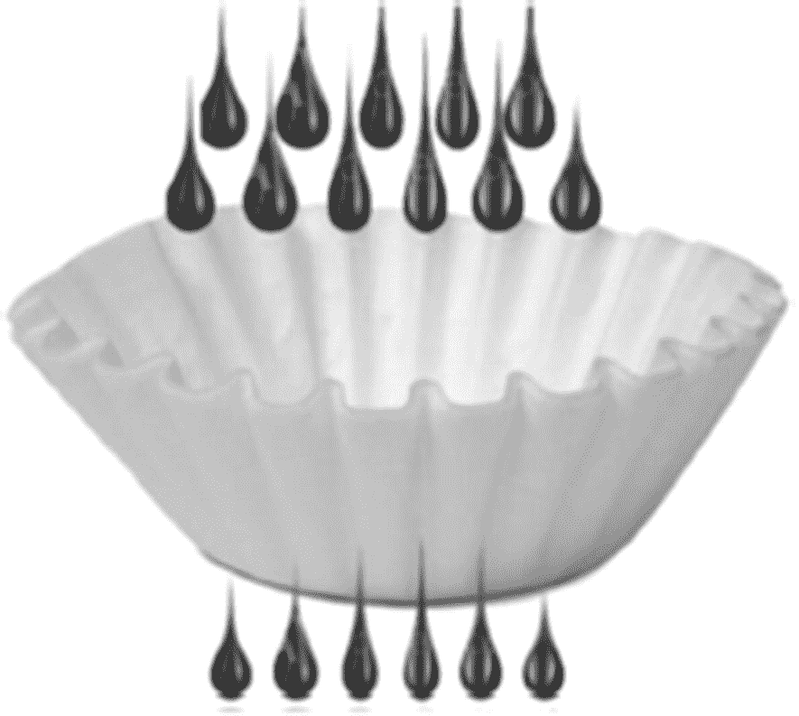
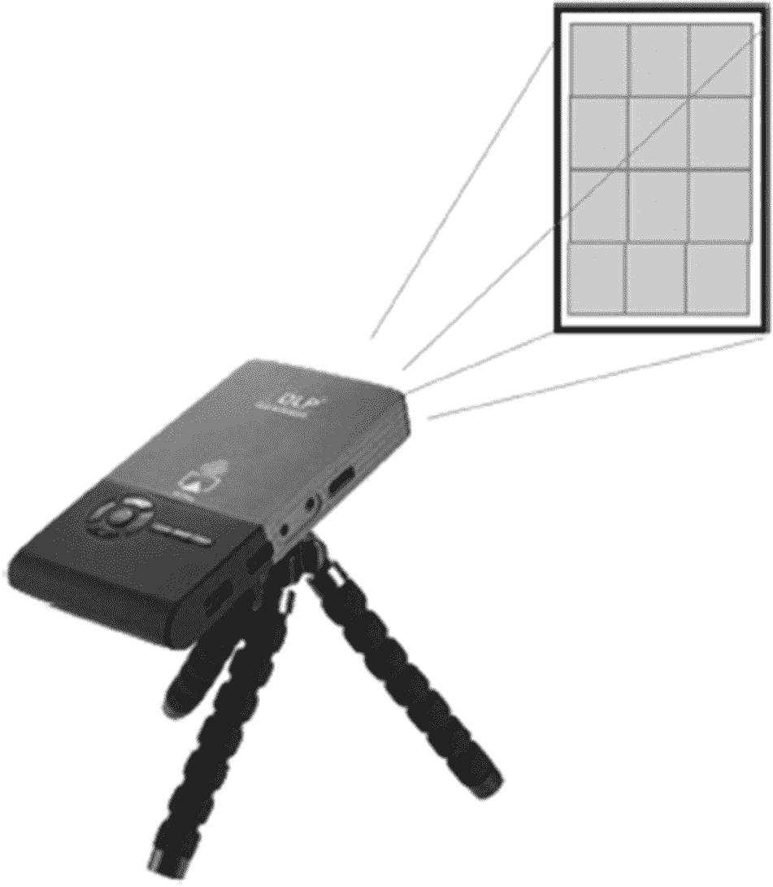
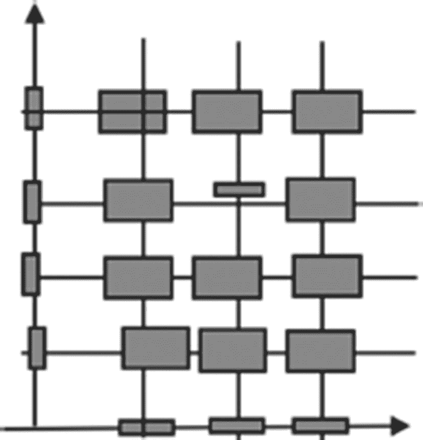

# 2. 理论：是的，我们需要它！

为了编写高性能的查询，数据库开发者需要理解数据库引擎如何处理查询。要做到这一点，我们需要了解关系理论的基础。如果“理论”这个词听起来太枯燥，我们可以称之为“数据库查询的隐秘生活”。在本章中，我们将探讨这个“隐秘生活”，解释当你点击“执行”或按下回车键，到看到数据库返回的结果集之间，数据库查询经历了什么。

如前一章所述，SQL 查询指定了需要什么结果或数据库中必须更改什么，但没有指定如何确切地执行请求的操作。将源 SQL 查询转换为可执行代码并执行它是数据库引擎的工作。本章涵盖了数据库引擎在解释 SQL 查询时所使用的操作及其理论基础。

## 查询处理概述

为了产生查询结果，PostgreSQL 执行以下步骤：

*   编译 SQL 语句并将其转换为由高级逻辑操作组成的表达式，称为逻辑计划。
*   优化逻辑计划并将其转换为执行计划。
*   执行（解释）该计划并返回结果。

### 编译

编译 SQL 查询类似于编译用命令式语言（如 Java 或 Python）编写的代码。源代码被解析，并生成内部表示。然而，SQL 语句的编译有两个本质区别。

首先，在命令式语言中，标识符的定义通常包含在源代码中，而 SQL 查询中引用的对象的定义则大多存储在数据库中。因此，查询的含义依赖于数据库结构：例如，一个同名的对象在一个数据库中可能是一个表，在另一个数据库中可能是一个视图，在还有一个数据库中可能是一个函数。

其次，命令式语言编译器的输出通常是（接近）可执行的代码，例如 Java 虚拟机的字节码。相比之下，查询编译器的输出是一个由高级操作组成的表达式，这些操作仍然是声明式的——它们没有给出任何关于如何获取所需输出的指令。此时指定了操作可能的执行顺序，但没有指定执行这些操作的方式。


### 优化与执行

在查询处理的下一阶段——**优化**中，会出现关于如何执行查询的指令。优化器执行两种转换：它用执行算法替换逻辑操作，并可能通过改变逻辑操作的执行顺序来改变逻辑表达式的结构。

这两种转换都不简单；一个逻辑操作可以使用不同的算法来计算，而优化器会尝试选择最佳的一种。同一个查询可能用多个等效的表达式来表示，这些表达式产生相同的结果，但执行所需的计算资源量却有显著差异。优化器会尝试寻找能最小化所需资源（包括执行时间）的逻辑计划和物理操作。这一搜索需要复杂的算法，超出了本书的范围。不过，我们确实会介绍优化器如何估算物理操作所需的资源量，以及这些资源如何依赖于数据的存储方式和存储量。

优化器的输出是一个包含物理操作的表达式。这个表达式被称为（物理）**执行计划**。因此，PostgreSQL 的优化器也被称为**查询规划器**。

最后，查询执行计划由**查询执行引擎**（在 PostgreSQL 社区中常被称为**执行器**）解释，并将输出返回给客户端应用程序。

让我们更仔细地看看查询处理的每个步骤以及每个步骤所使用的操作。

## 关系、逻辑与物理操作

为了更深入地理解数据库引擎如何解析 SQL，我们最终必须面对本章标题所关注的核心：**理论**。包括 PostgreSQL 在内的许多现代数据库管理系统被称为**关系型**的，因为它们基于关系理论。尽管有些不好的名声（认为理论枯燥、难以理解或无关紧要），但理解关系理论的一小部分对于掌握优化至关重要——具体来说，就是**关系操作**。更准确地说，我们需要理解关系操作如何对应于逻辑操作以及查询中使用的查询语言。上一节从高层次上涵盖了查询处理的三个步骤；本节将更详细地描述每个层面，从关系操作的描述开始。

有些读者可能认为这里涵盖的内容微不足道，并且觉得已经很熟悉了，而另一些读者可能会觉得这是在引入不必要的复杂性。现在，请坚持下去，并相信这是为接下来的内容打下基础。

### 关系操作

关系理论的核心概念是*关系*。就我们的目的而言，我们将关系视为一个**表**，尽管学者们可能会挑剔说这忽略了一些细微但重要的区别。

任何关系操作都接受一个或多个关系作为其参数，并生成另一个关系作为其输出。这个输出可以作为另一个关系操作的参数，产生又一个关系，而这个关系又可以再次成为参数。通过这种方式，我们可以构建复杂的表达式并表示复杂的查询。构建复杂表达式的能力使得关系操作集合（称为*关系代数*）成为一种强大的查询语言。

此外，关系代数中的表达式可用于定义额外的操作。

首先讨论的三个操作是*过滤*、*投影*和*积*。



一个杯形过滤器的三维模型，其中倒入的 11 滴液滴被过滤后得到 6 滴。

图 2-1

**过滤**

*过滤*操作（如图 2-1 所示）通常称为**选择**，在关系理论中称为**限制**。我们更倾向于使用*过滤*一词，以避免与 SQL 的 `SELECT` 语句混淆，而*限制*一词的数学起源又太深。此操作接受单个关系作为参数，并在输出中包含所有满足指定为过滤条件的元组（或行），例如：

```sql
SELECT *
FROM flight
WHERE departure_airport='LAG'
AND (arrival_airport='ORD'
OR arrival_airport='MDW')
AND scheduled_departure BETWEEN '2023-05-27' AND
'2023-05-28'
```

这里，我们从关系 `flight` 开始，并对 `arrival_airport`、`departure_airport` 和 `scheduled_departure` 属性的值应用限制。结果是一个记录集合，也就是另一个关系。



一个安装在三脚架上的投影仪的三维模型，将 4x3 的网格投射到屏幕上。

图 2-2

**投影**

*投影*操作（如图 2-2 所示）同样接受单个关系作为参数，并移除某些属性（列）。关系投影操作也会从输出中移除重复项，而 SQL 投影操作则不会，例如：

```sql
SELECT city, zip FROM address
```

在 PostgreSQL 中执行时，将返回与 `address` 表中记录数一样多的行。但如果我们执行关系操作 `project`，则会为每个邮政编码保留一条记录。为了在 PostgreSQL 中实现相同的结果，我们需要添加 `DISTINCT` 关键字：

```sql
SELECT DISTINCT city, zip FROM address
```



一个笛卡尔积的三维模型，由包含 4 个列元素和 3 个行元素的小条表示。矩阵中的相应乘积是中心位于不同点的小矩形。

图 2-3

**积**

*积*操作（也称为**笛卡尔积**，由图 2-3 表示）产生其第一和第二参数中所有行对的集合。很难找到一个现实生活中的、有用的积的例子，但让我们想象一下，我们想找出所有可能存在的航班（从世界上任何机场到任何机场）。积操作将如下所示：

```sql
SELECT
d.airport_code AS departure_airport,
a.airport_code AS arrival_airport
FROM  airport a,
airport d
```


