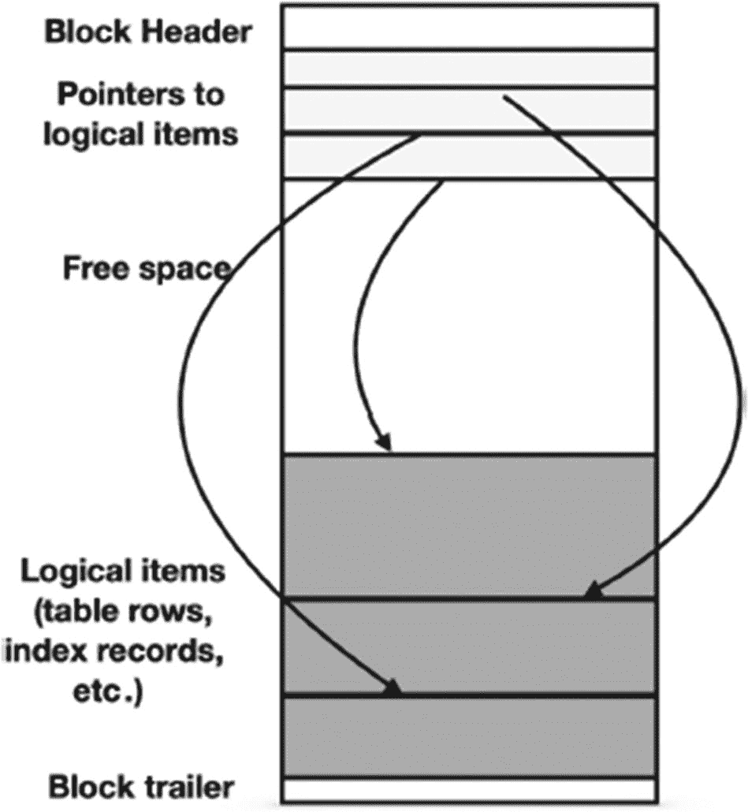
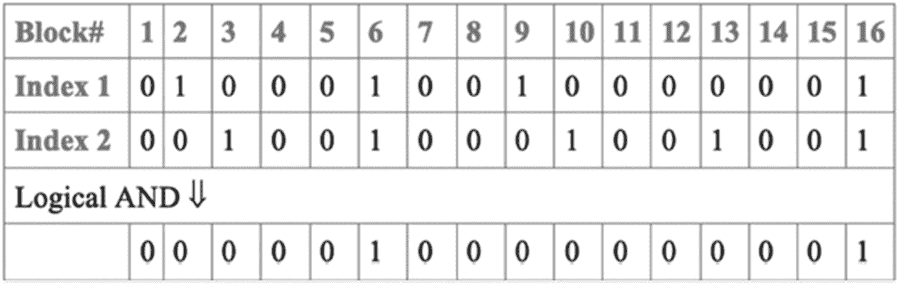
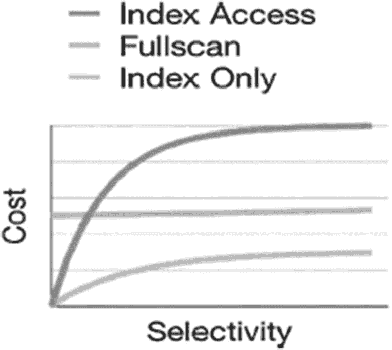
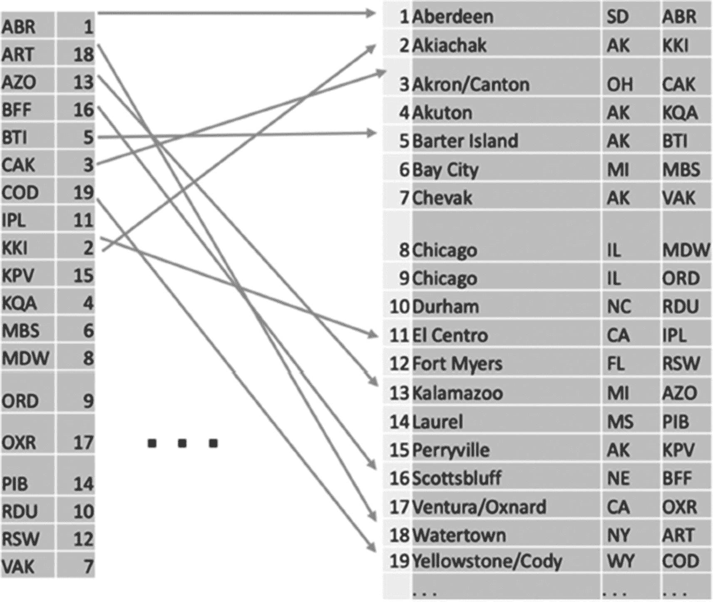
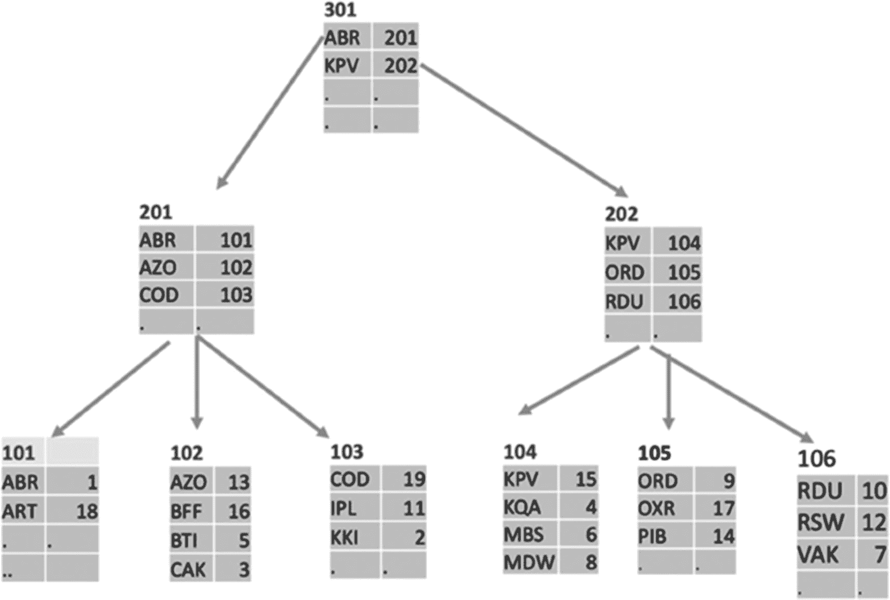
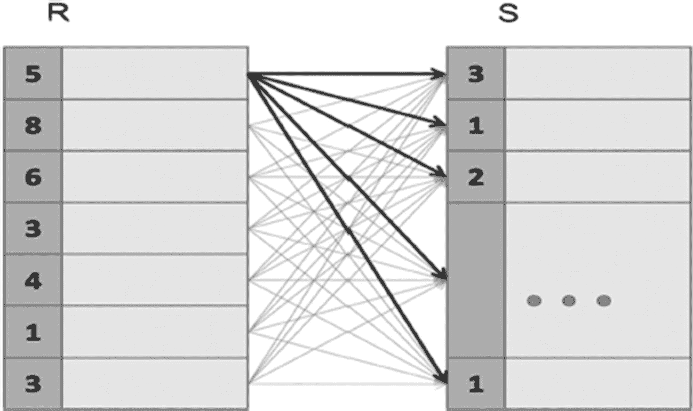
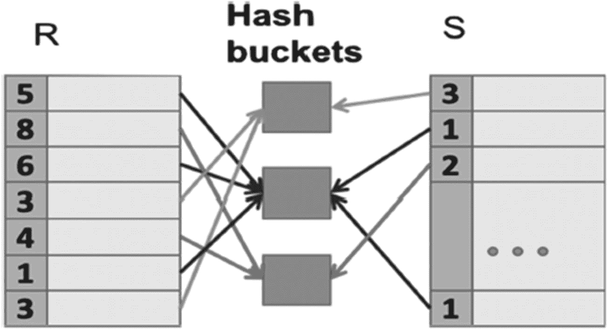
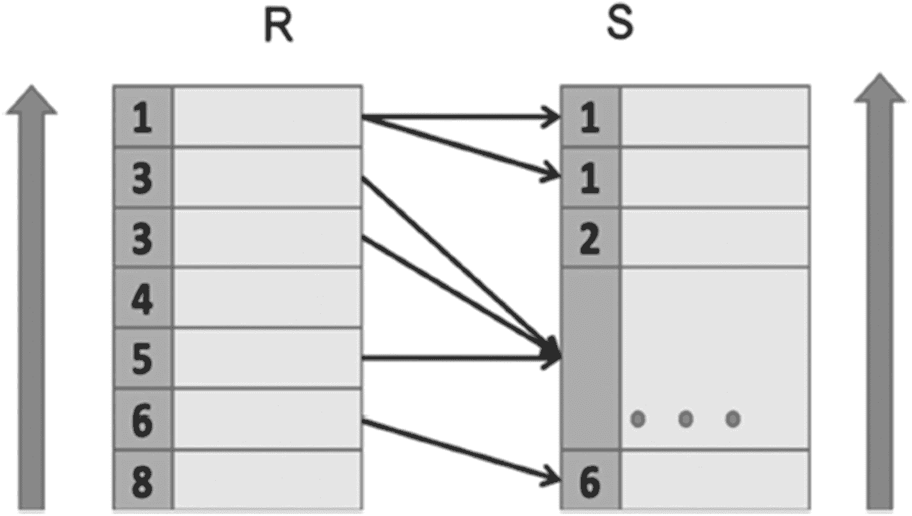

# 3. 更多理论：算法

读到这里，那些没有跳过章节、勤奋阅读本书的读者可能已经有些不耐烦了。我们已经进入第 3 章，却还在谈论理论！我们什么时候才能开始写代码呢？

很快！本章涵盖了查询处理的最后一部分，到最后，我们将拥有理解执行计划所需的所有组件。

第 2 章涵盖了关系操作，并指出我们需要物理操作或算法来执行查询。将这些算法映射到逻辑操作并不简单；有时，一个复杂的逻辑操作会被替换为多个物理操作，或者几个逻辑操作被合并为一个单一的物理操作。

本章描述了这些算法，从数据检索算法开始，然后介绍用于更复杂操作的算法。

理解这些算法将使我们能够回到执行计划，并更好地掌握其组成部分。因此，我们距离目标仅一步之遥：学习如何调优查询。


## 算法成本模型

第 1 章提到了几种衡量系统性能的方法，包括响应时间、成本和用户满意度。这些指标是数据库外部的，尽管外部指标最有价值，但查询优化器无法直接获取它们。
因此，优化器使用基于执行一个查询或计划中单个物理操作所需计算资源量的内部指标。最重要的资源是那些影响执行时间的资源，即 CPU 周期和 I/O 访问（读/写磁盘块）。其他资源，如内存或磁盘空间，对执行时间有间接影响；例如，可用内存量将影响 CPU 周期与 I/O 访问的比率。内存的分配几乎总是由配置参数控制，并将在第 10 章中讨论。
这两个主要指标——CPU 周期和 I/O 操作次数——不能直接比较。然而，为了比较查询执行计划，优化器必须将它们组合成一个单一的成本函数：成本越低，计划越好。几十年来，I/O 操作次数一直是成本的主要组成部分，因为旋转硬盘比 CPU 慢几个数量级。对于现代硬件来说，情况不一定如此，因此优化器必须调整以使用正确的比率。这也通过服务器参数进行控制。
物理操作的成本模型估计执行该操作所需的资源。在本书中，我们概述了简化的成本模型，这些模型易于理解，但对于理解更复杂的成本模型如何工作仍然有用。具体来说，我们将估算算法所需的资源量，即对于作为算法输入或输出的表，每行或每个块需要执行的底层操作数。例如，我们统计块访问的次数，但不区分访问是否实际需要 I/O 操作。在我们的简化模型中，对一个块的访问就是一次访问，无论它是需要 I/O 还是该块已经存在于操作系统的缓冲池中。
通常，成本取决于作为操作参数给出的表。为了表示成本模型，我们将使用以下符号的简单公式：对于任何表或关系`R`，`TR`和`BR`分别表示表中的行数和表占用的存储块数。其他符号将根据需要引入。
以下部分讨论物理操作，概述每种操作的算法和成本模型。由于 CPU 和外部存储的相对速度可能在很大范围内变化，因此 CPU 成本和 I/O 成本被分开考虑。上一章讨论的两个逻辑操作——投影和过滤——不包括在内。它们通常与前面的操作结合使用，因为它们可以独立应用于单行，而不依赖于参数表中的其他行。
当然，投影和过滤并非没有成本，其成本与处理的行数成正比。然而，在大多数情况下，这些成本可以忽略不计，因此我们不将这些成本纳入其他算法的成本模型中。

## 数据访问算法

要开始执行查询，数据库引擎必须提取存储的数据。本节涉及用于从数据库对象读取数据的算法。实际上，这些操作通常与它们在查询执行计划中的后续操作结合使用。在可以避免读取随后将被过滤掉的数据以节省执行时间的情况下，这是有利的。
此类操作的效率取决于保留在存储表中的行数与总行数的比例。这个比率称为*选择率*。给定读取操作的算法选择取决于可以同时应用的过滤器的选择率。

### 存储结构

数据存储在硬盘上的文件中，这并不奇怪。任何用于数据库对象的文件都被划分为相同长度的块；默认情况下，PostgreSQL 使用每个 8192 字节的块。块是在硬盘和主内存之间传输的单位，执行任何数据访问所需的 I/O 操作数等于正在读取或写入的块数。
数据库对象由逻辑项（表行、索引记录等）组成。PostgreSQL 在块中为这些项分配空间。多个小项可以驻留在同一个块中；不适合单个块的项使用单独的存储机制。块的通用结构如图 3-1 所示。


一个堆栈图，从上到下包括块头、指向逻辑项的指针、空闲空间、逻辑项和块尾。逻辑项包括表行和索引记录。来自指针的箭头指向逻辑项。
图 3-1
PostgreSQL 中的通用块结构
项到块的分配也取决于数据库对象的类型。表行使用称为堆的数据结构存储：一行可以插入到任何有足够空闲空间的块中，无需任何特定的排序。其他对象（例如索引）可能以不同方式使用块。

### 全表扫描

在全表扫描（有时称为顺序扫描）中，数据库引擎连续读取表中的所有行，并检查每一行的过滤条件。为了估算此算法的成本，我们需要更详细的描述，如代码清单 3-1 中的伪代码所示。

```
FOR each block IN a_table LOOP
read block;
FOR each row IN block LOOP
IF filter_condition (row)
THEN output (row)
END IF;
END LOOP;
END LOOP;
代码清单 3-1
全表扫描数据访问算法的伪代码
```
I/O 访问次数为`BR`；内层循环的总迭代次数为`TR`。我们还需要估算生成输出的操作成本。此成本取决于选择率，表示为`S`，等于`S * TR`。将所有这些部分放在一起，我们可以估算全表扫描的成本为：

```
c1 * BR + c2 * TR + c3 * S* TR
```
其中常数`c1`、`c2`和`c3`代表硬件的特性。
全表扫描可用于任何表；不需要额外的数据结构。其他算法依赖于表上存在的索引，将在下文描述。


### 基于索引的表访问

请注意，直到我们讨论到物理操作之前，我们甚至没有提及数据访问算法。我们不需要"读取"关系——它们是抽象对象。如果我们遵循关系被映射为表的理念，那么除了将整个表读入主存之外，就没有其他方法来检索数据了。否则，我们如何知道哪些数据行包含哪些值？但如果关系型数据库仅止步于此，它们就不会成为如此强大的数据处理工具。所有关系型数据库，包括 PostgreSQL，都允许构建额外的、冗余的数据结构，从而使数据访问速度远快于简单的顺序读取。

这些额外的结构被称为索引。

索引的构建方式将在本章后面介绍；目前，我们需要理解关于索引的两个事实。首先，它们是"冗余"的数据库对象；它们不存储任何在源表本身中找不到的额外信息。

其次，索引提供了额外的数据访问路径；它们使我们能够确定表行中存储了哪些值，而无需实际读取表——这就是基于索引的访问的工作方式。而且，如前所述，这一切对应用程序来说是完全不可见的。

如果一个过滤条件（或多个条件）被表上的某个索引所涵盖，则可以使用该索引来访问该表的数据。

要从指针获取表行，必须读取包含该行的数据块。表的底层数据结构是 `heap`（堆），即行是无序存储的。它们的顺序不被保证，也不对应于数据的任何属性。根据索引的选择性，PostgreSQL 会利用两种方法之一。第一种是 `index scan`（索引扫描）；第二种则依赖于 `bitmap index scan`（位图索引扫描），随后进行 `bitmap heap scan`（位图堆扫描）。

一个索引条目包含与索引值匹配的记录的地址；此地址包含块地址以及记录在块内的偏移量。在 `index scan` 中，数据库引擎读取满足过滤条件的每个索引条目，并按索引顺序检索数据块。因为底层表是 `heap`（堆），多个索引条目可能指向同一个数据块。如果索引的选择性低，这种情况很少发生，并且很可能没有数据块会被读取（或尝试读取）超过一次。然而，当选择性高、或使用了多个索引、或过滤条件不是等于比较时，情况就不同了。在这些情况下，将会使用 `bitmap index scan`。这种方法在内存中构建一个 `heap` 位图。整个位图是一个单一的比特数组，其比特数与被扫描表的 `heap` 块数一样多。

用于满足每个选择条件的索引被依次使用。要执行 `bitmap index scan`，首先创建一个位图，所有条目初始设置为 0（假）。每当找到一个匹配搜索条件的索引条目时，该索引条目所指示的 `heap` 块对应的位就被设置为 1（真）。第二个及任何附加的 `bitmap index scan` 对其他搜索条件对应的索引执行相同的操作。一旦所有位图都创建完毕，引擎会执行按位逻辑 `AND`（与）操作，以找出哪些块包含了所有选择条件所请求的值，从而产生最终的候选列表。这意味着，对于逻辑 `AND` 操作，只满足两个条件之一的块永远不需要被访问。如图 3-2 所示。



在计算出最终的候选列表后，使用 `bitmap heap scan`（基于位图的 `heap` 扫描）顺序读取候选数据块，并且对于每个块，检查其中的各个记录以重新验证搜索条件。请注意，请求的值可能位于同一个块中的不同行。位图确保相关行不会被遗漏，但并不保证所有被扫描的块都包含相关行。为简洁和清晰起见，此解释省略了一些实现细节。实际的实现更加复杂，并处理了各种边缘情况。

基于索引的访问的成本模型比全表扫描复杂得多。非正式地，可以这样描述：对于选择性小的值，满足过滤条件的行很可能位于不同的块中，因此成本与结果行数成正比。对于选择性大的值，处理的块数接近总块数。在后一种情况下，成本会变得比全表扫描更高，因为访问索引需要资源。

### 仅索引扫描

数据访问操作不一定返回整行。如果某些列对于查询不需要，一旦一行通过了过滤条件（如果有的话），这些列就可以被跳过。更正式地说，这意味着逻辑上的投影操作与数据访问操作相结合。当用于过滤的索引包含查询所需的每一列时，这种组合尤其有用。

在此算法中，数据从索引中读取，并在必要时应用任何剩余的过滤条件。通常不需要访问表数据，但有时需要额外的检查——这将在第 5 章详细讨论。

`index-only scan`（仅索引扫描）的成本模型与基于索引的表访问模型类似，只是无需实际访问表数据。对于选择性小的值，成本大约与返回的行数成正比。对于选择性大的值，该算法对索引执行（几乎）完全扫描。索引扫描的成本通常低于全表扫描的成本，因为它包含的数据更少。


### 比较数据访问算法

最佳数据访问算法的选择主要取决于查询选择率。图 3-3 展示了不同数据访问算法的成本与选择率的关系。我们有意省略了此图表上的所有具体数字，因为这些数字取决于硬件和表的大小，而定性比较则不受此影响。



成本与选择率的关系折线图。两条曲线从原点开始上升。上方的曲线表示索引访问，下方的曲线表示仅索引访问。一条位于中间、略微上升的直线与上方曲线部分重叠，表示全表扫描。

图 3-3

不同数据访问算法的成本与查询选择率关系

全表扫描的成本函数是线性的，并且几乎是水平的，因为其增长源于输出的生成。通常，对于这种算法，输出生成的成本与其他成本相比可以忽略不计。

基于索引的表访问成本函数从（几乎）0 开始，并随着选择率的增长而快速增长。当选择率值较大时，增长会放缓，此时的成本显著高于全表扫描的成本。

最有趣的一点是两个函数的交点：对于较小的选择率值，基于索引的访问更可取；而对于较大的选择率值，全表扫描则更优。交点的位置取决于硬件，并且可能取决于表的大小。对于相对较慢的旋转硬盘驱动器，仅当选择率不超过 2-5%时，基于索引的访问才更可取。对于固态硬盘或虚拟环境，此值可能更高。在较旧的旋转磁盘驱动器上，随机块访问可能比顺序访问慢一个数量级，因此对于给定的行比例，索引带来的额外开销更高。

代表仅索引扫描的线是最低的，这意味着如果该算法适用（即所有需要的列都在索引中），它总是更可取。

查询优化器会估算查询的选择率以及该表和该索引交点的选择率。清单 3-2 所示的查询具有一个范围过滤条件，该条件选择了表中的很大一部分。

```
SELECT
flight_no,
departure_airport,
arrival_airport
FROM flight
WHERE scheduled_departure BETWEEN
'2023-05-15'  AND  '2023-08-31';
清单 3-2
使用全表扫描执行的范围过滤查询
```

在这种情况下，优化器选择了全表扫描。

然而，在同一查询中使用更小的范围（参见清单 3-3）则会导致基于索引的表访问。

```
SELECT
flight_no,
departure_airport,
arrival_airport
FROM flight
WHERE scheduled_departure BETWEEN
'2023-08-12'  AND  '2023-08-13';
清单 3-3
使用基于索引的表访问进行范围过滤
```

实际上，查询优化器的工作要复杂得多：过滤条件可以由具有不同选择率值的多个索引支持。可以组合多个索引以生成位图块，从而减少需要扫描的块数。因此，优化器可用的选择方案数量远不止这三种算法。

因此，数据访问算法之间没有绝对的赢家和输家。任何算法在特定条件下都可能成为赢家。此外，算法的选择取决于存储结构和数据的统计特性。数据库维护称为统计信息的元数据，其中包括列的基数、稀疏性等指标。通常，这些统计信息在应用程序开发期间是未知的，并且可能在应用程序生命周期内发生变化。因此，查询语言的声明性本质对于系统性能至关重要。更具体地说，当表统计信息发生变化或如果其他成本计算因素被调整时，对于相同的查询可能会选择不同的执行计划。

## 索引结构

本节简要探讨最常见的索引结构，如树和哈希索引，并涉及一些 PostgreSQL 的特定内容。

我们将展示如何估算不同类型索引的改进规模，以及如何检测索引使用无法带来任何性能优势的情况。

## 什么是索引？

人们可能认为，任何使用数据库的人都知道索引是什么。唉，令人惊讶的是，包括数据库开发人员、报表编写人员，甚至在某些情况下，数据库管理员在内的许多人，在使用甚至创建索引时，对索引是什么以及它们如何构造只有一知半解。为了避免误解，我们将从定义“索引”一词的含义开始。

索引的类型繁多，因此试图寻找特定的结构属性来识别索引是不明智的。相反，我们基于其用途来定义索引。一个数据结构被称为索引，当它满足以下条件时：

*   是一个冗余的数据结构
*   对应用程序不可见
*   旨在加速基于特定条件的数据选择

冗余意味着可以删除索引而不会丢失任何数据，并且可以从其他地方（当然，是在表中）存储的数据重建。不可见意味着应用程序无法检测到索引是否存在。也就是说，无论有无索引，任何查询都会产生相同的结果。最后，创建索引是希望（或确信）它能提高特定查询或（更妙的是！）多个查询的性能。

性能的提升并非没有代价。由于索引是冗余的，当表数据更新时，它也必须被更新。这为更新操作带来了一些开销，有时这种开销不容小觑。特别是，PostgreSQL 索引可能对 vacuum 操作产生巨大影响。然而，许多数据库教科书高估了这种开销。现代高性能数据库管理系统使用算法来降低索引更新的成本，因此，通常在表上创建多个索引是有益的。

尽管不同类型的索引结构可能差异显著，但加速效果是通过快速检查查询中指定的某些过滤条件实现的。这些过滤条件规定了对表属性的某些限制。

图 3-4 展示了索引如何加速对特定表行的访问。

图 3-4 的右侧显示了一个表，左侧则代表一个索引，它可以被视为一种特殊类型的表。索引的每一行由一个索引键和一个指向表行的指针组成。索引键的值通常等于表属性的值。图 3-4 中的示例以机场代码作为其值；因此，该索引支持按机场代码搜索。

一列在表的多行中可以有相同的值。如果该列被索引，则索引必须包含指向所有包含此索引键值的行的指针。也就是说，一个键可能在逻辑上关联一个指向行的指针列表，而不是单个指针。

在 PostgreSQL 中，对于某些索引类型，索引包含多个记录，即每个指向表行的指针都会重复索引键。

图 3-4 解释了当定位到索引记录后如何到达相应的表行；然而，它并未解释为什么找到索引行比找到表行快得多。实际上，这取决于索引的结构，而这正是后续小节要讨论的内容。



一个包含 2 列 19 行的表（左）映射到一个包含 3 列 19 行的表（右）。左表从顶部开始的九个元素被映射到右表相应的行。

图 3-4

通过索引访问表行

## B 树索引

最常见的索引结构是 B 树。B 树的结构如图 3-5 所示；机场代码是索引键。该树由按层次组织的节点组成，这些节点与存储在磁盘上的块相关联。



一个树状图。索引 301 是根节点，它被分为左侧的索引 201 和右侧的索引 202。索引 201 又分为 101、102 和 103。索引 202 进一步分为 104、105 和 106。每个节点都包含记录。

图 3-5

B 树示例

叶节点（在图 3-5 中显示在底层）包含的索引记录与图 3-4 中的完全相同；这些记录包含一个索引键和一个指向表行的指针。非叶节点（位于除底层外的所有层级）包含的记录由下一层级某个块中的最小键（在图 3-5 中，是字母数字值最小的键）以及指向该块的指针组成。所有块中的所有记录都是有序的，并且每个块至少使用了其一半的容量。

任何对键 `K` 的搜索都从 B 树的根节点开始。在块查找过程中，会找到不超过 `K` 的最大键 `P`，然后搜索继续到与 `P` 关联的指针所指向的块中，直到到达叶节点，在那里指针指向表行。访问的节点数等于树的深度。当然，键 `K` 不一定存储在索引中，但搜索会找到该键或它可能所在的位置。

B 树也支持范围搜索（在 `SQL` 中表示为 `between` 或不等式操作）。一旦定位到范围的下限，就会通过顺序扫描叶节点来获取范围内的所有索引键，直到达到范围的上限。如果索引不是唯一的（即一个索引值可能对应多行），那么获取所有指针也需要扫描叶节点。

### 为什么 B 树如此常用？

根据计算机科学知识，在 `N` 个不同的键中，任何查找算法查找索引键的速度都不可能快于 `log N` 时间（以 CPU 指令衡量）。通过对有序列表进行二分查找或使用二叉树可以达到这种性能。然而，对于有序列表和二叉树，更新（例如插入新键）的成本可能非常高：插入单个记录可能导致完全重构。这使得这两种结构都不适用于外部存储。

相比之下，修改 B 树不会产生显著开销。当插入一条记录时，重构操作仅限于一个块内。如果块容量超出，则该块会分裂为两个块，并且更新操作会传播到上层。

在最坏情况下，被修改的块的数量不会超过树的深度。

要估算 B 树搜索的成本，我们需要计算树的深度。如果每个块包含 `f` 个指针，那么每一层的块数是上一层的 `f` 倍。因此，包含 `N` 条记录的树的深度是 `log N / log f`。该公式给出了单键搜索所需的块访问次数。每个块的 CPU 指令数是有限的，并且通常在块内使用二分查找。

因此，CPU 成本仅比理论最优值略差。PostgreSQL 中的块大小为 `8 Kb`。一个 `8 Kb` 的块可以容纳数十条索引记录；因此，一个六到七层深的索引就可以容纳数十亿条索引记录。

树的深度对索引性能至关重要。一个已满的块分裂后，每个新块至少半满。因此，树的深度不会显著增长，索引保持高效。理论上，填充不足的块应该被合并。然而，现有的实际实现（包括 PostgreSQL）都没有进行合并。因此，大量的删除操作可能导致深度过大，从而降低性能。为避免性能下降，应重建索引。

在 PostgreSQL 中，可以为任何序数数据类型创建 B 树索引；也就是说，对于该数据类型的任意两个不同值，其中一个值小于另一个。这包括用户定义的类型。

### 其他类型的索引

PostgreSQL 提供了多种索引结构，支持多种数据类型和多类搜索条件。

`哈希索引` 使用哈希函数计算包含索引键的索引块的地址。对于等值条件，这种索引类型比 B 树索引性能更好。但是，它对范围查询完全无效。哈希索引搜索的成本估计不依赖于索引大小（与 B 树的对数依赖相反）。

`R 树索引` 支持空间数据的搜索。R 树的索引键始终表示多维空间中的一个矩形。搜索返回所有与查询矩形有非空交集的对象。R 树的结构类似于 B 树的结构；然而，分裂溢出节点要复杂得多。R 树索引在维度数量较少（通常是两到三维）时效率较高。

PostgreSQL 中可用的其他类型索引对于全文搜索、超大表搜索等非常有用。有关这些主题的更多细节将在第 14 章中介绍。这些索引中的任何一种都可以相对容易地为用户定义的数据类型进行配置。然而，本书不讨论用户定义类型上的索引。

## 关系的组合

关系理论和 SQL 数据库的真正强大之处在于能够组合来自多个表的数据。

在本节中，我们将描述用于组合数据的操作的算法，包括笛卡尔积、连接、并集、交集甚至分组。令人惊讶的是，大多数这些操作都可以用几乎相同的算法实现。因此，我们讨论的是算法而非它们所实现的操作。在描述这些算法时，我们将使用 `R` 和 `S` 作为输入表名。

### 嵌套循环

第一个算法是用于计算**笛卡尔积**，即来自输入表的行的所有配对集合。计算该积的简单方法是循环遍历表 `R`，并对 `R` 的每一行，再循环遍历表 `S`。这个简单算法的伪代码如代码清单 3-4 所示，其图形化表示如图 3-6 所示。



左侧为一个名为 R 的表（2 列 7 行）映射到右侧名为 S 的表（2 列 5 行）。R 表的每一行都映射到 S 表的每一行。R 表第一列的条目是 5, 8, 6, 3, 4, 1, 3，S 表的是 3, 1, 2, 空, 1。

**图 3-6**
嵌套循环算法

```
FOR row1 IN table1 LOOP
FOR row2 IN table2 LOOP
INSERT output row
END LOOP
END LOOP
```
**代码清单 3-4**
嵌套循环伪代码

这个简单算法所需的时间与输入表大小的乘积成正比：`rows(R) * rows(S)`。

一个显著的理论事实指出，任何计算笛卡尔积的算法都不可能比这更好；也就是说，任何算法的代价都与其输入大小的乘积成正比或更高。当然，此算法的一些变体可能比其他的执行得更好，但代价仍然与这个乘积成正比。

对嵌套循环算法稍作修改，就可以计算几乎所有结合两个表数据的逻辑操作。代码清单 3-5 中的伪代码实现了连接操作。

```
FOR row1 IN table1 LOOP
FOR row2 IN table2 LOOP
IF match(row1,row2) THEN
INSERT output row
END IF
END LOOP
END LOOP
```
**代码清单 3-5**
用于连接操作的嵌套循环算法

观察发现，嵌套循环连接是连接抽象定义（即笛卡尔积后接一个过滤器）的直接实现。由于嵌套循环连接处理输入的所有行对，尽管输出大小比笛卡尔积的情况要小，但代价保持不变。

在实践中，一个或两个输入表是存储表，而不是先前操作的结果。如果是这种情况，连接算法可以与数据访问相结合。

虽然处理代价保持不变，但嵌套循环算法的变体与全表扫描相结合时，会在输入表的块上执行嵌套循环，并在这些块包含的行上再执行另一层嵌套循环。更复杂的算法通过加载第一个表（外层循环）的多个块，并用一次对 `S` 的扫描处理这些块中的所有行，来最小化磁盘访问次数。

这些算法可以适用于任何连接条件。然而，我们将来需要执行的大多数连接是**等值连接**，即连接条件要求 `R` 的某些属性等于 `S` 的对应属性。

如果表 `S` 在连接条件使用的属性上有索引，嵌套循环连接算法也可以与基于索引的数据访问相结合。对于等值连接，基于索引的嵌套循环算法的内层循环会缩小为针对 `R` 的每一行，只处理 `S` 的少数几行。如果 `S` 上的索引是唯一的（例如，`S` 的连接属性是其主键），内层循环甚至可以完全消失。

如果 `R` 中的行数也较少，基于索引的嵌套循环算法通常是最佳选择。然而，如第 2 章所讨论的，如果要处理的行数变得很大，基于索引的访问就会变得低效。

可以正式证明，对于笛卡尔积和具有任意条件的连接，不存在比嵌套循环性能更好的算法。然而，重要的问题是，对于任何特定类型的连接条件，是否存在更好的算法。下一节将表明对于等值连接来说确实如此。

### 基于哈希的算法

等值连接的输出由来自 `R` 和 `S` 的、在连接属性上具有相等值的行对组成。哈希连接算法的思路很简单：如果值相等，那么它们的哈希值也相等。

该算法根据哈希函数的值对两个输入表进行分区，然后独立地连接每个桶中的行。该算法的示意图如图 3-7 所示。



左侧一个名为 R 的表（2 列 7 行）和右侧一个名为 S 的表（2 列 5 行）被映射到中间的哈希桶。

**图 3-7**
哈希连接算法

哈希连接算法的基本版本包括两个阶段：

1.  在**构建阶段**，`R` 的所有元组根据哈希函数的值存储到各个桶中。
2.  在**探测阶段**，表 `S` 的每一行被发送到相应的桶中。如果桶中有匹配的 `R` 表行，则产生输出行。

在桶中找到匹配行的最简单方法是使用嵌套循环（实际上是对桶中的所有行进行循环，针对 `S` 的每一行）。

哈希算法的这两个阶段在执行计划中显示为独立的物理操作。

哈希连接的代价可以用以下公式近似估计，其中 `JA` 是连接属性：

```
cost(hash,R,S)=size(R)+size(S)+size(R)*size(S)/size(JA)
```

此公式中的第一项和第二项近似于对 R 和 S 所有行进行一次扫描的代价。最后一项表示要产生的连接结果的大小。当然，所有连接算法的输出代价是相同的，但我们不需要将其包含在嵌套循环算法的代价估算中，因为它比嵌套循环本身的代价要小。

这个公式表明，对于大表和连接属性不同值数量多的情况，基于哈希的算法明显优于嵌套循环。例如，如果连接属性在其中一个输入表中是唯一的，那么最后一项就等于另一个表的大小。

基本哈希连接算法在构建阶段产生的所有桶都能放入主内存时有效。另一种变体称为**混合哈希连接**，用于连接无法全部放入主内存的表。混合哈希连接对两个表进行分区，使得其中一个表的分区可以放入内存，然后对每对相应的分区执行基本算法。混合哈希连接的代价更高，因为分区会临时存储在硬盘上，并且两个表都需要扫描两次。然而，其代价仍然与大小之和成正比，而不是与大小之积成正比。


### 排序合并算法

用于等值连接的另一种算法（称为排序合并）如图 3-8 所示。



图 3-8

排序合并算法

该算法的第一阶段按连接属性对两个输入表进行升序排序。

当输入表被正确排序后，合并阶段对两个输入表进行一次扫描，并针对每个连接属性值，计算包含该连接属性值的行之间的笛卡尔积。请注意，该乘积是连接结果的必要组成部分。由于输入表是有序的，剩余的输入部分中不会出现具有相同属性值的新行。

合并阶段的成本可以用与哈希连接相同的公式表示，即与输入和输出的大小之和成正比。实际成本略低一些，因为不需要构建阶段。

排序的成本可以用以下公式估算：

```
Size(R)*log(size(R)) + size(s)*log(size(S))
```

如果其中一个输入表已经排序，排序合并算法尤其高效。这在涉及相同连接属性的一系列连接中可能会发生。

### 算法比较

与数据访问算法一样，没有绝对的赢家或输家。任何算法在特定情况下都可能是最佳选择。嵌套循环算法更通用，对于基于小型索引的连接是最佳选择；而排序合并和哈希连接在适用于大型表时效率更高。

## 总结

在探讨了算法的成本模型、数据访问算法、索引的目的和结构，以及更复杂操作（如连接）的算法之后，我们终于积累了足够的基础模块，可以继续推进查询规划器的完整产物——执行计划。

下一章将介绍如何阅读和理解执行计划，并对其进行优化。

