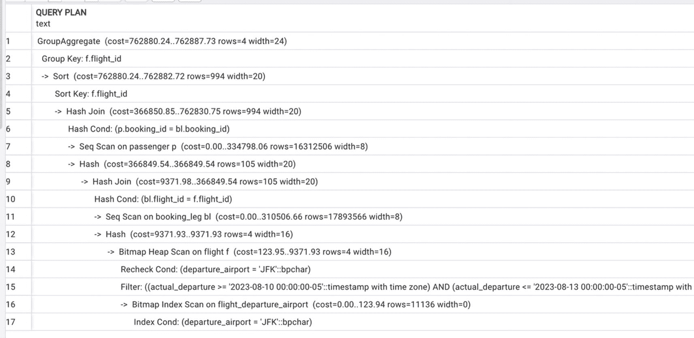
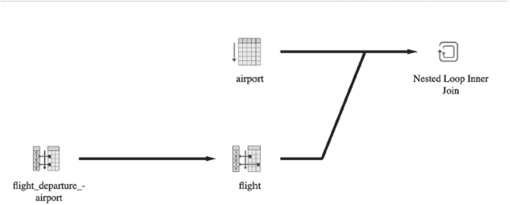
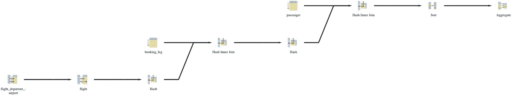
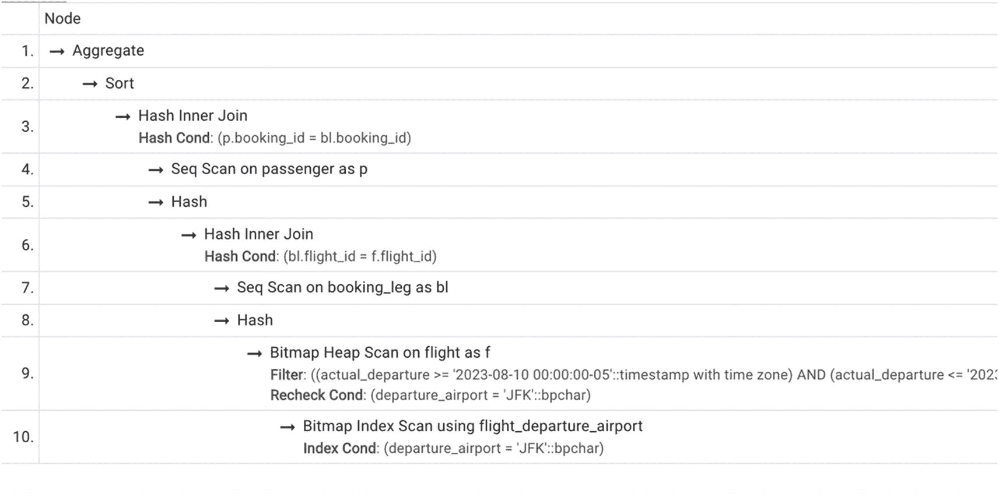
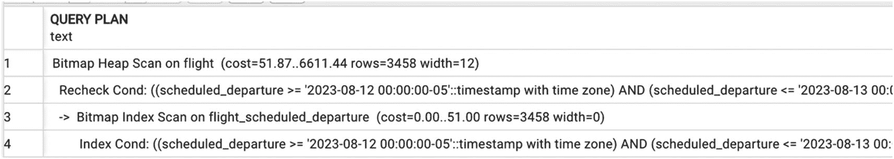
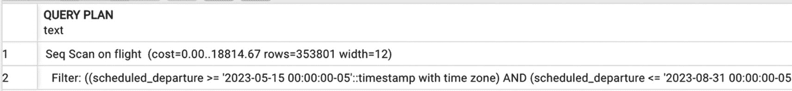
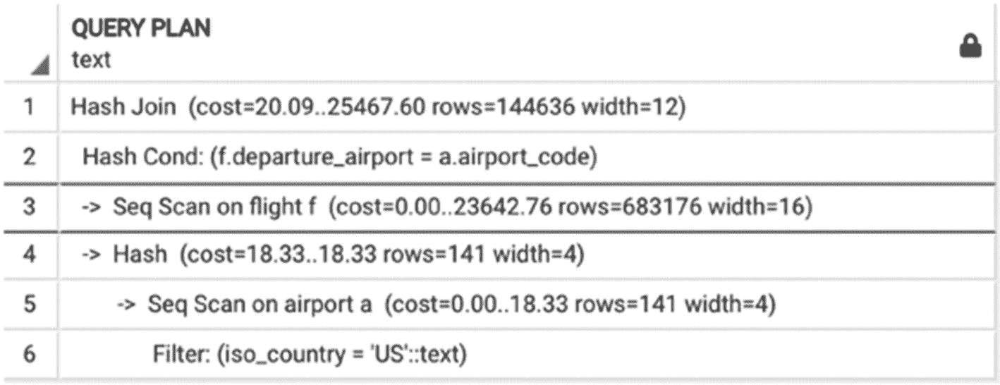
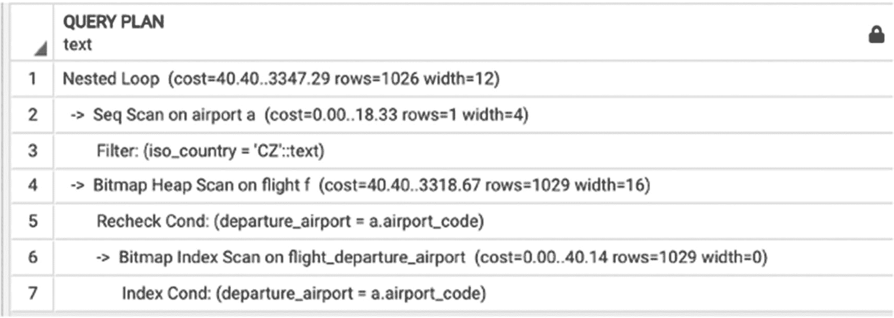
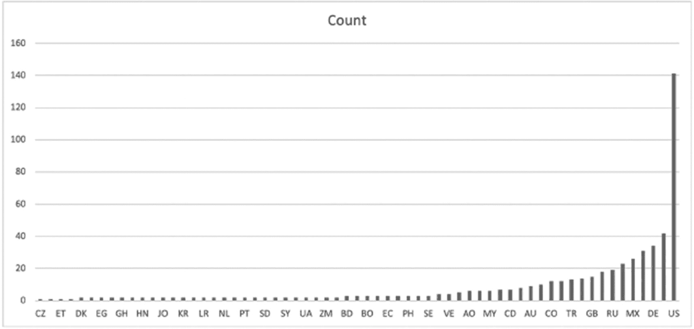

# 4. 理解执行计划

终于，是时候看看执行计划了。在开始之前，让我们回顾一下我们的理论基础。第 3 章解释了如何将逻辑操作映射到其物理执行，涵盖了数据检索和更复杂的操作。

在本章中，理解这些算法将使我们能够解读执行计划，并更好地掌握其组成部分。

## 综合运用：优化器如何构建执行计划

PostgreSQL 优化器的输出是一个*执行计划*。`SELECT`语句定义了*需要做什么*，而执行计划则定义了*如何执行* SQL 操作。

优化器的任务是构建出实现给定逻辑计划的、尽可能最优的物理计划。这是一个复杂的过程：有时，一个复杂的逻辑操作会被替换为多个物理操作，或者多个逻辑操作被合并为一个物理操作。

为了构建计划，优化器使用*转换规则*、*启发式规则*以及基于成本的*优化算法*。*规则*将一个计划转换为成本更低的计划。例如，过滤和投影操作会减少数据集的大小，因此应该尽早执行；一条规则可能会重新排序操作，以便过滤和投影操作更早执行。*优化算法*选择成本估算最低的计划。然而，对于包含多个操作的查询，可能的计划数量（称为*计划空间*）是巨大的——算法无法考虑每一个可能的计划。毕竟，选择正确算法所花费的时间也是查询总执行时间的一部分。*启发式规则*用于减少优化器需要评估的计划数量。


## 阅读执行计划

借用猫王的一句话：少一点抽象，多一点行动，拜托。让我们看一个例子。清单 4-1 中的查询选择了所有从 JFK 出发并抵达 ORD，且计划出发时间在 2023 年 8 月 10 日至 8 月 23 日之间的航班。对于每个航班，计算其乘客总数。

```sql
SELECT f.flight_no,
f.actual_departure,
count(passenger_id) passengers
FROM flight f
JOIN booking_leg bl ON bl.flight_id = f.flight_id
JOIN passenger p ON p.booking_id=bl.booking_id
WHERE f.departure_airport = 'JFK'
AND f.arrival_airport = 'ORD'
AND f.actual_departure BETWEEN
'2023-08-10' and '2023-08-13'
GROUP BY f.flight_id, f.actual_departure;
```
**清单 4-1**
一个选择特定航班乘客数量的查询

该查询的逻辑计划如清单 4-2 所示。

```
project f.flight_no,  f.actual_departure, count(p.passenger_id)[] (
group [f.flight_no, f.actual_departure] (
filter [f.departure_airport = 'JFK'] (
filter [f.arrival_airport = 'ORD'] (
filter f.actual_departure >='2023-08-10',
join(bl.booking_id=p.booking_id (
access (booking_leg bl),
access (passenger p)
))))))))
```
**清单 4-2**
清单 4-1 中查询的逻辑计划

逻辑计划展示了应执行哪些逻辑操作，但并未提供如何执行这些操作的细节。查询规划器会为查询生成一个执行计划，如图 4-1 所示。



**图 4-1**
执行计划

一个包含 17 行的查询计划包括了分组聚合、排序、哈希连接、对 `passenger` 表的顺序扫描、对 `booking` 表的顺序扫描、对 `flight` 表的位图堆扫描以及对航班出发机场的位图索引扫描。

要获取查询的执行计划，需要运行 `EXPLAIN` 命令。该命令接受任何语法正确的 SQL 语句作为参数，并返回其执行计划。

我们鼓励你运行本书中的代码示例并检查其执行计划。但有一点提醒：选择正确的执行计划是一个非确定性过程。你的本地数据库生成的计划可能与本书中展示的计划略有不同。即使计划完全相同，执行时间也可能因硬件和配置的差异而有所不同。

希望观察图 4-1 后，前几章的价值显而易见——每一行都代表一个之前介绍过的操作，因此其内部机制一目了然。请注意，除了算法名称外，执行计划的每一行还在括号中包含了一些神秘的数字。这个谜团可以通过回顾第 3 章轻松解开，该章讨论了不同算法的成本如何计算。

具体来说，一个计划包含预期的输出行数以及预期的输出行平均宽度，这些是根据数据库统计数据计算得出的，还包括成本估算，这些估算是基于先前获得的估算值和配置参数计算的。成本值包含了所有先前操作的累计成本。每个操作有两处成本估算：第一处显示生成第一行输出所需的成本，第二处估算生成完整结果的成本。例如，在图 4-1 的第 13 行，123.95 是第一行输出的成本，而 9371.93 是完整结果的成本。输出行的数量和宽度的估算值用于估算消耗该输出的操作的成本。如何估算成本将在本章后面介绍。

需要强调的是，所有这些数字都是近似值。执行期间获得的实际值可能有所不同。如果你怀疑优化器选择了一个非最优的计划，你可能需要查看这些估算值。通常，对于存储表的误差较小，但它不可避免地在每个操作后累积。

执行计划以物理操作树的形式呈现。在这棵树中，节点代表操作，箭头指向操作数。从图 4-1 中可能看不出树状结构。有多种工具（包括 pgAdmin）可以生成执行计划的图形化表示。图 4-2 展示了一个输出的可能样子。（不同的图形工具可能使用不同的图标；此示例仅用于说明。）实际上，这张图代表了清单 4-4 的执行计划，我们将在本章后面讨论。



**图 4-2**
一个简单执行计划的图形化表示（清单 4-4）

这是一个水平流程图。航班出发机场指向航班。航班和机场指向嵌套循环内部连接。

对于更复杂的查询，执行计划的图形化表示可能不那么有用——参见图 4-3 中清单 4-1 的执行计划的图形化表示。



**图 4-3**
清单 4-1 的执行计划的图形化表示

这是一个用于安排航班乘客数量的水平阶梯式流程图，包括航班出发机场、航班、哈希、航段、哈希内部连接、乘客、排序和聚合。

在这种情况下，更紧凑的表示可能更有用，如图 4-4 所示。



**图 4-4**
同一执行计划的另一种表示

一个包含 10 行的查询计划包括了聚合、排序、哈希内部连接、对 `passenger` 表的顺序扫描、哈希、对 `booking` 表的顺序扫描、对 `flight` 表的位图堆扫描以及使用航班出发机场的位图索引扫描。

现在，让我们回到 `EXPLAIN` 命令的实际输出，如图 4-1 所示。它将树的每个节点显示在单独的一行，以 `->` 开头，节点的深度由偏移量表示。子树位于其父节点之后。有些操作用两行表示。

计划的执行从叶子节点开始，到根节点结束。这意味着首先执行的操作将位于偏移量最靠右的那一行。当然，一个计划可能包含多个独立执行的叶子节点。一旦某个操作产生一个输出行，该行就会被推送到下一个操作。因此，操作之间无需存储中间结果。

在图 4-1 中，执行从最后一行开始，使用 `departure_airport` 列上的索引访问 `flight` 表。由于对该表应用了多个过滤条件，且只有一个过滤条件有索引支持，PostgreSQL 执行了 `位图索引扫描`（在第 2 章中介绍过）。引擎访问索引并编译可能包含所需记录的数据块列表。然后，它使用 `位图堆扫描` 从数据库中读取实际的数据块，并对从数据库中提取的每条记录，`重新检查` 通过索引找到的行是否是最新的，并应用 `过滤` 操作来处理那些我们没有索引的附加条件：`arrival_airport` 和 `scheduled_departure`。


结果与 `booking_leg` 表相连接。PostgreSQL 使用顺序读取来访问此表，并使用哈希连接算法，条件为 `bl.flight_id = f.flight_id`。

接着，通过顺序扫描（因为该表没有任何索引）访问 `passenger` 表，并再次使用哈希连接算法，条件是 `p.booking_id = bl.booking_id`。

最后执行的操作是分组并计算聚合函数 `sum()`。排序操作确定了满足搜索条件的航班。然后，对每趟航班上的所有乘客数量进行计数。

下一节将讨论还能从执行计划中解读出什么信息，以及为什么理解这些信息很重要。

## 理解执行计划

理解小型执行计划很容易。回想一下，在第 3 章，我们比较了两个 `SELECT` 语句，即代码清单 3-2 和 3-3。我们曾说明，对于第一个语句，PostgreSQL 会选择顺序扫描，而对于第二个语句，它会选择索引访问。我们当时是如何得知的？现在，你知道答案了：我们为两个语句都运行了 `EXPLAIN` 命令。代码清单 3-2 的执行计划展示在图 4-5 中，代码清单 3-3 的执行计划展示在图 4-6 中。



一个包含 4 行的查询计划，包括在 flight 上的位图堆扫描、重新检查条件、在 flight scheduled departure 上的位图索引扫描以及索引条件。

**图 4-6**

代码清单 3-4 的执行计划



一个包含两行的查询计划，指示了在 flight 上的顺序扫描和过滤函数。

**图 4-5**

代码清单 3-3 的执行计划

但如果执行计划更复杂呢？

通常，当我们按照前述方式解释如何阅读执行计划时，我们的听众会被一个相对简单的查询所产生的庞大执行计划吓到，尤其是考虑到一个更复杂的查询可能产生一个 100 多行的执行计划。即使是图 4-1 中展示的计划也可能需要一些时间来阅读。有时，即使计划中的每一行都能被解释，问题仍然存在：“我有一个查询，它很慢，你告诉我去看执行计划，而它有 100 多行。我该怎么办？我该从哪里开始？”

好消息是，在大多数情况下，你不需要阅读整个计划就能准确理解是什么导致了执行缓慢。在本节中，我们将进一步学习如何解读执行计划。

### 优化过程中发生了什么？

正如第 2 章所述，优化器执行两种转换：它用相应的物理执行算法替换逻辑操作，并可能通过改变逻辑操作的执行顺序来改变逻辑表达式结构。

查询被解析并检查语法正确性后，第一步是查询重写。在此步骤中，PostgreSQL 优化器通过消除子查询、用其文本表示替换视图等方式来增强代码。必须记住，这个步骤总是会发生。当视图的概念被引入时，SQL 教科书通常建议“视图可以像表一样使用”，这是误导性的。在大多数情况下，视图会被其源代码替代。然而，“大多数时候”并不意味着“总是”。第 7 章将讨论视图、优化器如何处理它们以及它们潜在的性能陷阱。

查询重写之后的下一个步骤通常就是我们所说的优化，它包括以下内容：

*   确定操作的可能顺序
*   确定每个操作的可能执行算法
*   比较不同计划的成本
*   选择最优执行计划

许多 SQL 开发人员假设 PostgreSQL 执行查询访问（和连接）表的顺序与它们在 `FROM` 子句中出现的顺序相同。

然而，连接顺序*大多时候*并不被保留——数据库并不遵循这些指令。在后续章节中，我们将更详细地讨论什么会影响操作顺序。现在，让我们考虑如何评估一个执行计划。

### 为什么有这么多执行计划可供选择？

我们多次提到，一条 `SQL` 语句可以通过多种方式执行，使用不同的执行计划。实际上，对于一条语句，可能存在数百、数千甚至数百万种可能的执行方式！本章让你对这些数字的来源有所了解。计划可能因以下方面而有所不同：

*   操作顺序
*   用于连接和其他操作的算法（例如，嵌套循环、哈希连接）
*   数据检索方法（例如，索引使用、全表扫描）

从形式上讲，优化器通过计算所有可能计划的成本，然后比较这些成本来找到最佳计划。但既然我们知道执行每种连接有三种基本算法，那么一个涉及三个表的简单 `SELECT` 语句就可能产生九种可能的执行计划；考虑到 12 种可能的连接顺序，就有 108 种可能的计划（3 * 3 * 12 = 108）。如果我们再考虑每个表的所有潜在数据检索方法，就有数千个计划需要比较。

幸运的是，PostgreSQL 并不检查每一个可能的计划。

基于成本的优化算法依赖于最优性原理：一个最优计划的子计划对于相应的子查询也是最优的。一个计划可以看作是多个组成部分或子计划的组合。一个子计划是指包含原始计划中任何操作作为根节点及其所有后代节点的计划，即所有为作为子计划根节点的操作贡献输入参数的操作。优化器从最小的子计划（即对单个表的数据访问）开始构建最优计划，并逐步生成更复杂的子计划，包含更多操作，而每一步只进行少量的成本检查。该算法在某种意义上是穷尽式的，即最终将构建出最优计划，尽管大部分可能的计划都不会被尝试。

例如，在前面的例子中，一旦优化器为三个表中的一个选择了正确的数据检索算法，它就不会再考虑任何不使用该最优算法的计划。

尽管如此，生成的子计划数量仍然可能非常庞大。`geqo_threshold` 配置参数指定了查询中连接数量的上限，对于连接数量不超过此限值的查询，会执行近乎穷尽的搜索以找到最佳连接序列。如果表的数量超过此上限，则通过启发式方法确定连接顺序。启发式方法会剔除不太可能包含最优计划的计划空间部分，从而减少优化算法需要检查的计划数量。虽然此功能有助于优化器更快地选择执行计划，但也可能对性能产生负面影响：存在最佳执行计划在成本比较之前被意外丢弃的风险。

尽管启发式方法可能会剔除最优计划，但该算法仍会在剩余的计划中构建出最佳的一个。

现在，让我们更仔细地看看这些成本是如何计算的。


## 如何计算执行成本？

在第 3 章中，我们讨论了衡量数据库算法性能的方法。我们介绍了内部度量标准，并确立了算法的成本是通过 I/O 操作次数和 CPU 周期数来衡量的。现在，我们将把这个理论应用到实践中。

每个执行计划的成本取决于：
* 计划中所用算法的成本公式
* 关于表和索引的统计数据，包括值分布
* 系统设置（参数和偏好），例如 `join_collapse_limit` 或 `cpu_index_tuple_cost`

第 3 章涵盖了计算每种算法成本的公式。这些公式中的每一个都依赖于所用表的大小，以及结果集的预期大小。最后，用户可以通过系统设置来更改操作的默认成本。可以通过改变成本估算期间使用的优化器参数来隐式控制最优计划的选择。因此，所有这三部分信息都参与了执行计划成本的计算。

这有违直觉；通常，SQL 开发者潜意识里期望存在一个“最佳计划”，而且对于所有“相似”的查询，这个计划是相同的。然而，由于前面列表中列出的因素，优化器可能会为几乎相同的 SQL 查询，甚至为同一个查询，产生不同的执行计划。这怎么可能发生呢？优化器选择的是具有最佳成本估算的计划。然而，可能存在几个成本只有细微差别的计划。成本估算是依赖于从随机样本中收集的数据库统计数据。昨天收集的统计数据可能与今天收集的略有不同。由于这些微小的变化，昨天是最佳计划的，今天可能就变成次优了。当然，统计数据也可能因为插入、更新和删除操作而改变。

让我们看一些例子。清单 4-3 和 4-4 展示了两个看起来几乎相同的查询。唯一的区别在于过滤值。然而，图 4-7 和 4-8 中展示的执行计划却显著不同。

```sql
SELECT flight_id,
scheduled_departure
FROM flight f
JOIN airport a ON departure_airport=airport_code
AND iso_country='US'
```
清单 4-3：带有一个条件的简单 SELECT


一个包含 6 行的查询计划，包括哈希连接、哈希条件、对 flight 表的顺序扫描、哈希、对 airport 表的顺序扫描以及过滤函数。
图 4-7：清单 4-3 的执行计划

```sql
SELECT flight_id,
scheduled_departure
FROM flight f
JOIN airport a ON departure_airport=airport_code
AND iso_country='CZ'
```
清单 4-4：与清单 4-3 相同的 SELECT，但搜索值不同


一个包含 7 行的查询计划，包括嵌套循环、对 airport 表的顺序扫描、过滤、对 flight 表的位图堆扫描、重新检查条件、对 flight_departure_airport 的位图索引扫描以及索引条件。
图 4-8：清单 4-4 的执行计划

是什么导致了这种差异？图 4-9 提供了一个线索：第一个查询选择了相当大一部分的机场，而使用索引不会提高性能。相反，第二个查询只选择一个机场，在这种情况下，基于索引的访问会更高效。


一张标题为"Count"的条形图，显示 32 个国家的数据，从左到右呈上升趋势。最低值为 1，对应 CZ 和 ET。最高值为 141，对应美国。数值为近似值。
图 4-9：值分布直方图

这个例子也解释了为什么保持数据库统计数据最新如此重要。如果查询规划器没有意识到这种不均匀分布，它可能会选择一个远非最优的执行计划。`ANALYZE`命令会重新计算作为参数传递的表的统计数据，并更新该表索引的统计信息。PostgreSQL 有一个特殊的机制来自动更新统计信息，我们将在第 8 章更详细地讨论它。但是，如果你正在按照本书的示例在本地副本上重放它们，你应该在构建新索引后手动运行`ANALYZE`。

## 优化器如何被误导？

但我们如何能确定优化器选择的计划确实是可能的最佳计划呢？找到最佳执行计划甚至可能吗？我们花了相当多的时间来解释，如果我们不干涉、不干预，优化器会尽其所能地完成最佳工作。如果这是真的，那本书的其余部分是关于什么的呢？现实是，没有优化器是完美的，即使是 PostgreSQL 查询规划器也不例外。

首先，虽然优化算法在数学上是正确的——它找到了具有最佳成本估算的计划——但这些成本估算本身是不精确的。第 3 章中解释的简单公式仅适用于数据均匀分布的情况，但在真实数据库中均匀分布很少出现。实际上，优化器使用更复杂的公式，但这些也只是对现实的不完美近似。正如乔治·博克斯所说：“所有模型都是错的，但有些是有用的。”

其次，包括 PostgreSQL 在内的数据库系统会维护存储数据的详细统计信息（通常以直方图形式）。直方图显著提高了选择率的估算。不幸的是，直方图不能用于中间结果。估算中间结果的误差是优化器可能无法产生最优计划的主要原因。

第三，最优计划可能因启发式方法而被排除，或者查询可能太复杂，无法使用精确的优化算法。在后一种情况下，会使用近似的优化算法。

在所有这些情况下，都需要一些人工干预，而这正是本书的主题！既然我们知道优化过程中发生了什么，如果有什么不太对劲，我们就可以修复它。

尽管存在这些潜在的瑕疵，优化器在大多数情况下运行良好。然而，人类观察系统的行为，因此拥有比优化器更多的可用信息，并且可以利用这些额外的知识来帮助优化器更好地完成工作。

本章涵盖了执行计划：它们是如何生成的，以及如何阅读和理解它们。我们还了解了基于成本的优化以及影响执行计划成本的因素。

尽管基于成本的优化器通常表现良好，但有时它们需要帮助，而我们现在已装备齐全来提供这种帮助。后续章节将介绍多个需要一些人工干预以实现更好性能的查询示例。

