# 5. 短查询与索引

第 4 章深入探讨了如何理解执行计划。现在，我们转向在运行`EXPLAIN`命令并返回执行计划之后该做什么。如果我们的目标是改进查询执行计划，我们应该从何处入手？

第一步是识别查询是短查询还是长查询。本章将重点讨论如何优化短查询。你将学习如何识别短查询、针对短查询应使用何种优化技术，以及为何索引对此类查询至关重要。我们还将讨论 PostgreSQL 中可用的不同索引类型及其各自的适用场景。

在继续本章之前，让我们先创建几个额外的索引：

```sql
SET search_path TO postgres_air;
CREATE INDEX flight_arrival_airport ON flight  (arrival_airport);
CREATE INDEX booking_leg_flight_id ON booking_leg  (flight_id);
CREATE INDEX flight_actual_departure ON flight  (actual_departure);
CREATE INDEX boarding_pass_booking_leg_id ON boarding_pass  (booking_leg_id);
CREATE INDEX booking_update_ts ON booking  (update_ts);
```

别忘了在你为所有新建索引的表上运行`ANALYZE`：

```sql
ANALYZE  flight ;
ANALYZE  booking_leg;
ANALYZE  booking;
ANALYZE boarding_pass;
```

## 何为“短”查询？

术语*短查询*已经多次出现，但尚未给出正式定义。什么是短查询？首先，它与 SQL 查询语句的长度无关。请看示例 5-1 和 5-2 中展示的两个查询。清单 5-1 中的查询仅包含四行代码，却代表一个*长查询*。而清单 5-2 包含更多行，却是一个短查询。

```sql
SELECT
d.airport_code AS departure_airport,
a.airport_code AS arrival_airport
FROM  airport a,
airport d
Listing 5-1
长查询示例
```

```sql
SELECT
f.flight_no,
f.scheduled_departure,
boarding_time,
p.last_name,
p.first_name,
bp.update_ts as pass_issued,
ff.level
FROM flight f
JOIN booking_leg bl ON bl.flight_id = f.flight_id
JOIN passenger p ON p.booking_id=bl.booking_id
JOIN account a on a.account_id =p.account_id
JOIN boarding_pass bp on bp.passenger_id=p.passenger_id
LEFT OUTER JOIN frequent_flyer ff on ff.frequent_flyer_id=a.frequent_flyer_id
WHERE f.departure_airport = 'JFK'
AND f.arrival_airport = 'ORD'
AND f.scheduled_departure BETWEEN
'2023-08-05' AND '2023-08-07'
Listing 5-2
短查询示例
```

其次，它也不是由结果集的大小来定义的。清单 5-3 中的查询只返回一行；然而，它是一个长查询。

```sql
SELECT
avg(flight_length),
avg (passengers)
FROM (SELECT
flight_no,
scheduled_arrival -scheduled_departure AS flight_length,
count(passenger_id) passengers
FROM flight f
JOIN booking_leg bl ON bl.flight_id = f.flight_id
JOIN passenger p ON p.booking_id=bl.booking_id
GROUP BY 1,2) a
Listing 5-3
产生一行的长查询
```

那么，什么是短查询？

当计算输出所需的行数较少时，该查询就是短查询，无论涉及的表有多大。短查询可能会读取小表中的每一行，但只读取大表中很小比例的行。

上述定义最重要的部分是*需要*和*访问*之间的区别。一个短查询的糟糕执行计划可能会读取和/或处理比最终输出所需多得多的行。虽然一定程度的冗余处理是不可避免的，但我们的目标是减少它。

“很小比例”有多小？不出所料，这取决于系统参数、应用程序的具体情况、实际表大小以及可能的其他因素。但在大多数情况下，它意味着小于 10%。本章后面将通过一个案例研究来说明如何识别这个临界点。

相比之下，长查询的输出依赖于一个大表或几个大表中相当大比例的行。

我们对查询的分类类似于普遍接受的 OLTP（联机事务处理）和 OLAP（联机分析处理）查询之间的区别。所有的 OLTP 查询都是短查询。然而，许多现代应用程序需要的查询可能返回数百行，但仍然是短查询。

为什么清单 5-1 是长查询？因为需要`airport`表中的所有行才能获得结果。为什么清单 5-2 是短查询？因为它只需要大约 200,000 个航班中几个航班的数据。为什么清单 5-3 不是短查询？因为计算结果需要系统中每个预订的数据。

当我们优化一个短查询时，我们知道最终我们选择的是相对较少的记录。这意味着优化目标是尽早减少结果集的大小。如果最具限制性的选择标准应用于查询执行的第一步，后续的排序、分组甚至连接操作的成本都会降低。查看执行计划时，应该不存在对大表的表扫描。对于小表，全表扫描可能仍然有效，如第 3 章图 3-2 所示。

## 选择选择标准

确保最具限制性的选择标准最先应用，这似乎很容易；然而，这并不总是那么简单。显而易见的是，本章名为“短查询与索引”是有原因的：如果没有索引支持相应的搜索，就无法快速从表中选择记录的子集。这就是为什么短查询需要索引来实现更快的执行。如果缺乏支持高限制性查询的索引，很可能就需要创建一个。


### 索引选择性

第 3 章介绍了查询选择性的概念。同样的概念也适用于索引：对应于索引中一个值的记录数越少，索引的选择性值就越低。我们不希望创建选择性高的索引；正如我们在第 3 章所见，这种情况下基于索引的数据检索将比顺序扫描花费更多时间。由于 PostgreSQL 优化器会预先确定每种访问方法的成本，这种索引永远不会被使用，因此性能不会受到影响。然而，添加一个需要存储空间和额外更新时间却无法提供任何收益的数据库对象，仍然是不可取的。

一个数据库表可能在不同列上有多个索引，每个索引都有不同的选择性。对于短查询来说，可能达到的最佳性能是在使用最具限制性的索引（即选择性最低的索引）时。

让我们看一下代码清单 5-4 中的查询。你能说出哪个过滤条件是最具限制性的吗？

```sql
SELECT *
FROM flight
WHERE departure_airport='LAX'
AND update_ts BETWEEN '2023-08-13' AND '2023-08-15'
AND status='Delayed'
AND scheduled_departure BETWEEN '2023-08-13' AND '2023-08-15'
Listing 5-4
索引选择性
```

`Delayed`（延误）状态可能是最具限制性的，因为理想情况下，在任何给定的日子里，准点航班都远多于延误航班。

在我们的培训数据库中，我们有六个月的航班时刻表，所以将其限制在两天内可能限制性不强。另一方面，通常航班时刻表会提前很久发布，如果我们查找的是最后更新时间戳相对接近计划起飞时间的航班，这很可能表明这些航班被延误或取消了。

另一个可能需要考虑的因素是相关机场的受欢迎程度。`LAX`（洛杉矶国际机场）是一个繁忙的机场，对于代码清单 5-4 来说，基于 `update_ts` 的限制会比基于 `departure_airport` 的限制更具限制性。然而，如果我们将 `departure_airport` 上的过滤条件改为 `FUK`（福冈机场），那么机场标准的限制性将超过基于 `update_ts` 的选择。

如果所有搜索条件都被索引了，那么就不用担心；多个索引如何协同工作的方式稍后会介绍。但如果最具限制性的条件没有被索引，执行计划可能不是最优的，并且很可能需要一个额外的索引。

### 唯一索引与约束

索引的选择性越好（越低），搜索速度就越快。因此，最高效的索引是唯一索引。

如果对于每个被索引的值，在表中都恰好只有一行与之匹配，那么该索引就是唯一的。

创建唯一索引有几种不同的方式。首先，PostgreSQL 会自动创建唯一索引来支持表上的任何主键或唯一约束。

主键和唯一约束之间有什么区别？SQL 开发者中一个常见的误解是，主键必须是一个递增的数值，并且每张表“必须”有一个主键。虽然拥有一个数字递增的主键（称为代理键）通常很有帮助，但主键不一定是数字，而且它也不一定是单一属性的约束。可以将主键定义为多个属性的组合；它只需满足两个条件：该组合对于所有参与的属性必须同时是 `UNIQUE`（唯一的）和 `NOT NULL`（非空）的。相比之下，PostgreSQL 中的唯一约束允许 `NULL` 值。

一张表可以有一个主键（尽管主键不是必需的）和多个唯一约束。任何一个非空的唯一约束都可以被选作表的主键；因此，没有编程方式可以确定哪一个是表的主键的最佳候选。例如，`booking` 表的主键在 `booking_id` 上，唯一键在 `booking_ref` 上——参见代码清单 5-5。

```sql
ALTER TABLE booking
ADD CONSTRAINT booking_pkey PRIMARY KEY (booking_id);
ALTER TABLE booking
ADD CONSTRAINT booking_booking_ref_key UNIQUE (booking_ref);
Listing 5-5
一个主键和一个唯一约束
```

由于 `booking_ref` 是一个非空属性，我们可以选择 `booking_id` 或 `booking_ref` 作为主键。

如第 1 章的 ER 图所示，`account` 表中的 `frequent_flyer_id` 列是可空的，并且也是唯一的：

```sql
ALTER TABLE account
ADD CONSTRAINT account_freq_flyer_unq_key UNIQUE (frequent_flyer_id);
```

也可以不正式定义唯一约束，而是直接创建一个唯一索引。你只需在索引创建语句中添加关键字 `unique`：

```sql
CREATE UNIQUE INDEX account_freq_flyer ON
account (frequent_flyer_id);
```

如果我们在这个表已经插入数据之后创建这个索引，`CREATE UNIQUE INDEX` 将会验证值的唯一性，如果发现任何重复，索引将不会被创建。对于任何后续的插入和更新，新值的唯一性也将被验证。

那么外键呢？它们会自动创建索引吗？一个常见的误解是认为外键的存在必然意味着在子表上存在索引。事实并非如此。

外键是一种参照完整性约束；它保证在子表（即具有外键约束的表）中每个非空值，在父表（即它引用的表）中都有一个与之匹配的唯一值。

例如，在 `flight` 表上有一个外键约束，确保每个到达机场都匹配一个现有的机场代码：

```sql
ALTER TABLE flight
ADD CONSTRAINT arrival_airport_fk FOREIGN KEY (arrival_airport)
REFERENCES airport (airport_code);
```

这个约束不会自动创建索引；如果通过到达机场进行搜索很慢，就必须显式创建索引：

```sql
CREATE INDEX flight_arrival_airport
ON flight (arrival_airport);
```

第 3 章提到，唯一索引使嵌套循环变得高效。如果你参考图 3-7，你会意识到当索引存在时会发生什么。


## 嵌套循环连接与索引

如果表 `S` 的连接条件属性上存在索引，嵌套循环连接算法也可以与基于索引的数据访问相结合。对于自然连接，基于索引的嵌套循环算法的内循环会缩小为针对 `R` 的每一行仅访问 `S` 的少数几行。如果 `S` 上的索引是唯一的（例如，`S` 的连接属性是其主键），内循环甚至可以完全消失。

这常常被误解为意味着在连接主键/外键时，嵌套循环总是高效的。然而，如前所述，这仅在子表（即外键）中的列被索引时才成立。

## 是否总是为外键列创建索引？

是否总是为具有外键约束的列创建索引是最佳实践吗？并非总是如此。仅当不同值的数量足够大时才应创建索引。请记住，低选择性的索引不太可能有用。例如，`flight` 表在 `aircraft_code` 上有一个外键约束：

```sql
ALTER TABLE flight
ADD CONSTRAINT aircraft_code_fk FOREIGN KEY (aircraft_code)
REFERENCES aircraft (code);
```

这个外键约束是必要的，因为每个航班必须分配一个有效的飞机。为了支持此外键约束，为 `aircraft` 表添加了主键约束。然而，该表只有 12 行。因此，没有必要在 `flight` 表的 `aircraft_code` 列上创建索引。该列只有 12 个不同的值，因此该列上的索引不会被使用。

为了说明这一点，让我们看清单 5-6 中的查询。该查询选择 2023 年 8 月 14 日至 16 日期间从 JFK 机场出发的所有航班。对于每个航班，我们选择航班号、计划起飞时间、飞机型号和乘客数量。

```sql
SELECT
f.flight_no,
f.scheduled_departure,
model,
count(passenger_id) passengers
FROM flight f
JOIN booking_leg bl ON bl.flight_id = f.flight_id
JOIN passenger p ON p.booking_id=bl.booking_id
JOIN aircraft ac ON ac.code=f.aircraft_code
WHERE f.departure_airport ='JFK'
AND f.scheduled_departure BETWEEN
'2023-08-14' AND '2023-08-16'
GROUP BY 1,2,3
```

清单 5-6：一个没有使用索引的主键/外键连接

该查询的执行计划如图 5-1 所示，并且它非常庞大。

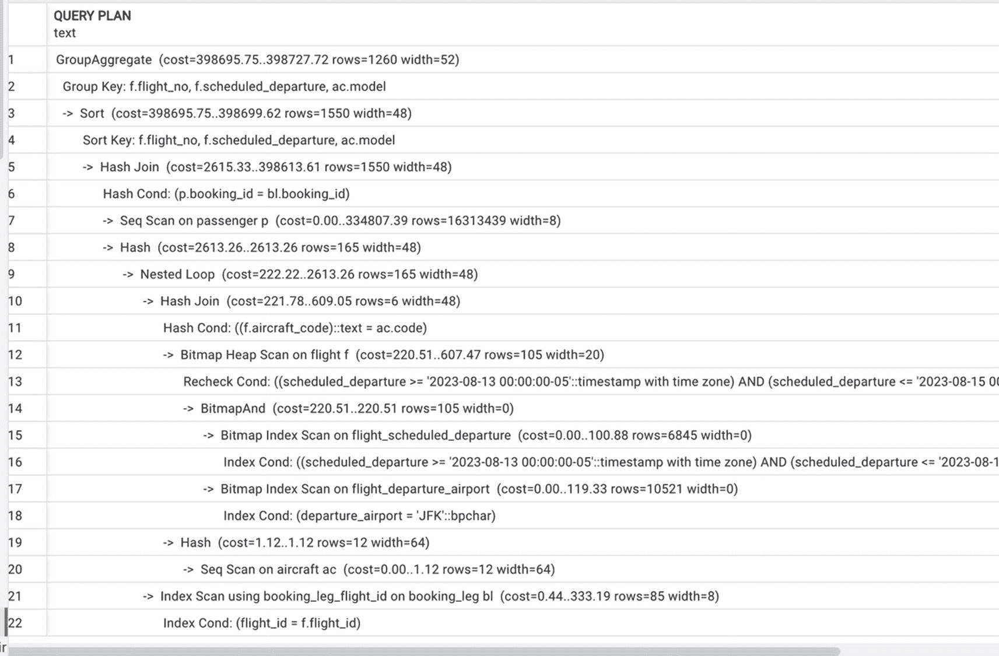

一组文本行表示一个很长的查询计划。它从上到下包含 22 行。一些标签包括分组聚合、分组键、排序、排序键、哈希连接、对 passenger 的顺序扫描、嵌套循环和对 aircraft 的顺序扫描。

图 5-1：对小表进行顺序扫描的计划

我们目前对此计划唯一感兴趣的部分是：

```sql
Hash  (cost=1.12..1.12 rows=12 width=64)
-> Seq Scan on aircraft ac (cost=0.00..1.12 rows=12
```

PostgreSQL 优化器访问表统计信息，并能够检测到 `aircraft` 表的规模很小，使用索引访问效率不高。相比之下，正如我们在本章前面观察到的，由于低选择性，`flight` 表的 `departure_airport` 字段上的索引被证明是有用的。

## 索引与非等值条件

第 3 章描述了 B-tree 索引的结构、构建方式以及如何用于搜索。接下来是它们实际应用的演示。

前一节涉及简单的 B-tree 索引。如第 3 章所述，它们可以支持等于、大于、小于和 BETWEEN 条件的搜索：所有需要比较和排序的搜索。OLTP 系统中的大多数搜索都属于此类，但也存在相当数量的情况，其搜索条件更为复杂。

### 索引与列转换

什么是列转换？当搜索条件针对列中值的某些修改时，就会发生列转换。例如，`lower(last_name)`（将 `last_name` 值转换为小写）和 `update_ts::date`（将带时区的时间戳转换为日期）就是列转换。

列转换如何影响索引使用？很简单，无法在该属性上使用 B-tree 索引。回顾第 3 章中 B-tree 的构建方式和搜索执行方式：在每个节点中，属性的值会与节点中的值进行比较。转换后的值没有记录在任何地方，因此没有东西可以与之比较。因此，如果 `last_name` 上有一个索引

```sql
CREATE INDEX account_last_name
ON account (last_name);
```

……以下搜索将无法利用该索引：

```sql
SELECT *
FROM account
WHERE lower(last_name)='daniels';
```

我们如何解决这个问题？可能需要进行这样的搜索，因为乘客可能会以不同的大小写输入他们的姓氏。如果你认为覆盖最常见的情况就足够了，你可以像这样修改搜索条件：

```sql
SELECT *
FROM account
WHERE last_name='daniels'
OR last_name='Daniels'
OR last_name ='DANIELS'
```

该查询的执行计划如图 5-2 所示。

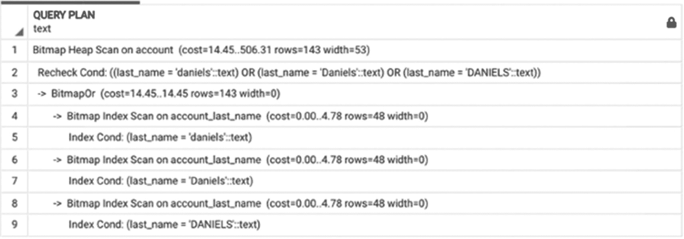

一组文本行表示一个较短的查询计划。它从上到下包含 9 行。它包括对 account 的位图堆扫描、重新检查条件以及对 account_last_name 的位图索引扫描。

图 5-2：使用 "like" 操作符重写的执行计划

更好的解决方案是创建一个（额外的）*函数*索引：

```sql
CREATE INDEX account_last_name_lower
ON account (lower(last_name));
```

当构建函数索引时，PostgreSQL 会将函数应用于列（或多列）的值，然后将这些值放入 B-tree 中。与常规 B-tree 索引（节点包含列的值）类似，在函数索引中，节点包含函数的值。在我们的例子中，函数是 `lower()`。创建索引后，清单 5-7 中的查询 #1 将不会使用顺序扫描，而是能够利用新索引。相应的执行计划如图 5-3 所示。

```sql
---#1
SELECT * FROM account WHERE lower(last_name)='daniels';
---#2
SELECT * FROM account WHERE last_name='Daniels';
---#3
SELECT * FROM account WHERE last_name='daniels';
---#4
SELECT * FROM account WHERE lower(last_name)='Daniels';
```

清单 5-7：不同的搜索条件使用不同的索引

请注意，如果我们希望特定大小写的值搜索也能被索引支持（例如查询 #2），`last_name` 列上的索引仍然是必要的。此外，值得一提的是，如果表 `account` 包含一条 `last_name = 'Daniels'` 的记录和另一条 `last_name = 'DANIELS'` 的记录，查询 #1 将返回两条记录，查询 #2 将只返回第一条记录，而查询 #3 和 #4 将不会返回其中任何一条。

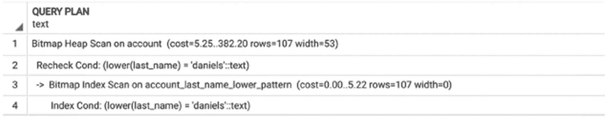

一组文本行表示一个包含 4 行的查询计划，从上到下。这些行表示对 account 的位图堆扫描、重新检查条件、对 account_last_name_lower_pattern 的位图索引扫描以及索引条件。

图 5-3：使用函数索引的计划

注意

有时，不需要额外的索引。

每次需要使用列转换进行搜索时都应该创建函数索引吗？不一定。然而，重要的是要识别列转换，这可能是微妙的。

例如，让我们看下面的 SELECT 语句：

```sql
SELECT *
FROM flight
WHERE scheduled_departure ::date
BETWEEN '2023-08-17' AND '2023-08-18'
```


乍一看，我们似乎是在使用 `scheduled_departure` 列作为选择条件，并且由于该列存在索引，理应会被使用。然而，图 5-4 中的执行计划却转而进行了一次顺序扫描。

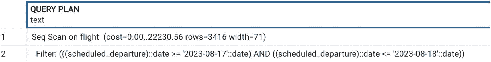

一组文本行表示一个包含两行的查询计划。这两行分别表示对 flight 表的顺序扫描和过滤操作。

图 5-4：由于列转换而未使用索引的执行计划

为什么 PostgreSQL 不使用索引？因为当时间戳被转换为日期时，已经对列进行了转换。

那么，是否需要为 `scheduled_departure::date` 创建一个额外的函数索引呢？不一定。这个选择条件意味着什么？它意味着我们想选择在特定这两个日期出发的航班，无论具体时间是几点。这意味着航班可以在 2023 年 8 月 17 日午夜到 2023 年 8 月 19 日午夜之间的任何时间出发。为了让现有的索引生效，可以修改选择条件为：

```sql
SELECT *
FROM flight
WHERE scheduled_departure >='2023-08-17'
AND  scheduled_departure <'2023-08-19'
```

图 5-5 展示了执行计划的变化。

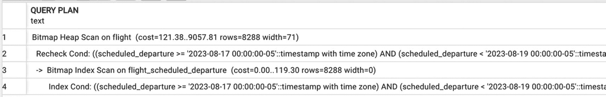

一个查询计划包含四行文本。这几行分别表示对 flight 表的位图堆扫描、重新检查条件、对 flight scheduled departure 的位图索引扫描以及索引条件。

图 5-5：使用了索引的执行计划

观察执行计划可以看出，使用基于索引的访问方法，其成本估算比顺序扫描低了一倍多（`13857.42` 对比 `30474`）。更重要的是，执行时间也证实了这一点：基于索引的访问耗时 `0.5` 秒，而顺序扫描耗时 `1.5` 秒。

请非常仔细地关注这个例子。当你在书中读到这个例子时，前面的段落看起来显而易见。然而，许多 SQL 开发人员和报表编写者却一再使用类似的搜索条件。一个常见的用例是处理对表的当日更改。百分之九十五的情况下，这个条件被写成 `update_ts::date=CURRENT_DATE`，这成功地阻止了在 `update_ts` 列上使用索引。为了利用索引，这个条件应该写成：

```sql
update_ts>= CURRENT_DATE
```

或者，如果这个时间戳的值可能在未来，条件应写为：

```sql
WHERE update_ts>= CURRENT_DATE AND update_ts< CURRENT_DATE +1
```

让我们再检查一个列转换常常被忽视的例子。假设今天是 2023 年 8 月 17 日。我们正在寻找今天已经起飞或计划今天起飞的航班。我们知道，对于尚未起飞的航班，`actual_departure` 列可能为空。

PostgreSQL 中的 `coalesce()` 函数允许我们在第一个参数为 null 时使用一个不同的值。因此，`coalesce(actual_departure, scheduled_departure)` 会在 `actual_departure` 不为 null 时返回它，否则返回 `scheduled_departure`。`scheduled_departure` 和 `actual_departure` 这两列都有索引，你可能期望这些索引会被使用。例如，查看以下 SQL 语句的执行计划，如图 5-6 所示：

```sql
SELECT *
FROM flight
WHERE coalesce(actual_departure, scheduled_departure)
BETWEEN '2023-08-17' AND '2023-08-18'
```

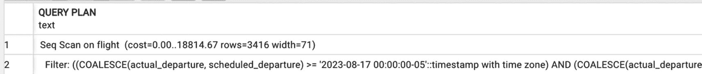

一个查询计划包含两行文本。它表示对 flight 表的顺序扫描和过滤。

图 5-6：尽管存在索引，但仍进行顺序扫描的计划

为什么没有使用任何索引？因为 `coalesce()` 是一个函数，它修改了列的值。我们应该创建另一个函数索引吗？可以，但这并非真正必要。我们可以改写这个 SQL 语句，如代码清单 5-8 所示，这将导致如图 5-7 所示的执行计划。

```sql
SELECT * FROM flight
WHERE (actual_departure
BETWEEN '2023-08-17' AND '2023-08-18')
OR (actual_departure IS NULL
AND scheduled_departure BETWEEN '2023-08-17' AND '2023-08-18')
```
代码清单 5-8：同时使用两个索引的查询

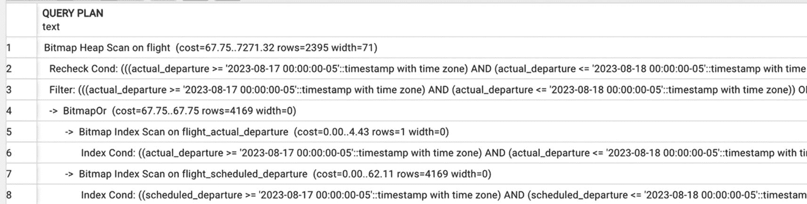

一个查询计划包含 8 行文本。这些行分别表示对 flight 表的位图堆扫描、重新检查条件、过滤、对 flight actual departure 的位图索引扫描、对 flight scheduled departure 的位图索引扫描以及索引条件。

图 5-7：代码清单 5-8 中查询的执行计划

## 索引与 `like` 操作符

另一组并非直接比较列值与常量的搜索条件是使用 `like` 操作符的搜索。例如，查询：

```sql
SELECT * FROM account
WHERE lower(last_name) like 'johns%';
```

将返回所有姓氏以“johns”开头的账户。在 `postgres_air` 模式中，返回的姓氏列表为：

```
"Johnson"
"Johns"
"johns"
"Johnston"
"JOHNSTON"
"JOHNS"
"JOHNSON"
"johnston"
"johnson"
```

这个查询的唯一问题是它不会利用我们在前一节创建的函数索引，因为 B-tree 索引不支持使用 `like` 操作符的搜索。再次，如果我们检查这个查询的执行计划，将会看到对 `account` 表的顺序扫描。

我们如何解决这个问题并避免扫描？

一个可能的解决方案是重写查询，用两个条件替换 `like`：

```sql
SELECT * FROM account
WHERE (lower(last_name) >='johns' and lower(last_name) < 'johnt')
```

这个查询的执行计划如图 5-8 所示，我们可以看到该计划使用了现有的索引。

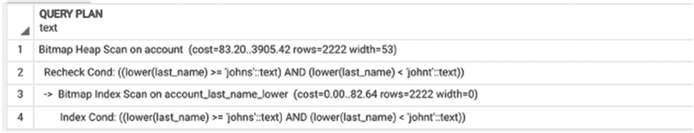

一个查询计划包含 4 行文本。它表示对 account 表的位图堆扫描、重新检查条件、对 account last name lower 的位图索引扫描以及索引条件。

图 5-8：重写后使用索引的查询计划

更好的解决方案是创建一个*模式搜索*索引：

```sql
CREATE INDEX account_last_name_lower_pattern
ON account (lower(last_name) text_pattern_ops);
```

为什么需要这个索引？因为文本值的比较依赖于*区域设置*，这是一组关于字符排序、格式等规则，因语言和国家而异。尽管有些人可能认为我们在美国英语中使用的是通用的顺序，但事实并非如此。唯一允许我们使用 B-tree 索引的区域设置是“C”区域设置，这是一个符合标准的默认区域设置。只有严格的 ASCII 字符在此区域设置中有效。

要查看数据库创建时定义了哪个区域设置，你需要运行命令：

```sql
SHOW LC_COLLATE;
```

如果你居住在美国，很可能会看到：

```
"en_US.UTF-8"
```

这个新创建的索引将被使用 `like` 操作符的查询所利用。我们原始查询的新执行计划如图 5-9 所示，我们可以看到它利用了新索引。

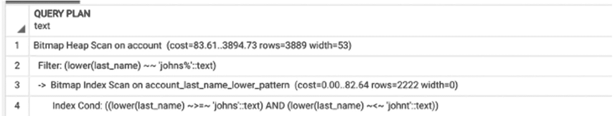

一个查询计划包含 4 行文本。它表示对 account 表的位图堆扫描、过滤、对 account last name lower pattern 的位图索引扫描以及索引条件。

图 5-9：带有模式索引的执行计划


## 使用多个索引

在图 5-7 中，我们看到一个执行计划，它在同一个表`flight`上使用了两个索引。第 3 章中关于基于索引的访问的讨论主要关注的是单个索引的情况。当有多个可用索引时会发生什么？PostgreSQL 究竟如何高效地使用它们？

答案就在执行计划中看到的`位图`一词中。创建内存位图使得优化器能够使用一个表上的多个索引来加速数据访问。让我们来看一个对一个表有三个筛选条件的查询，这些条件都受到索引的支持。

```sql
SELECT
scheduled_departure ,
scheduled_arrival
FROM flight
WHERE departure_airport='ORD'
AND arrival_airport='JFK'
AND scheduled_departure BETWEEN '2023-07-03' AND '2023-07-04';
```

*清单 5-9：一个对单表应用三个过滤条件的查询*

此查询的执行计划如图 5-10 所示。

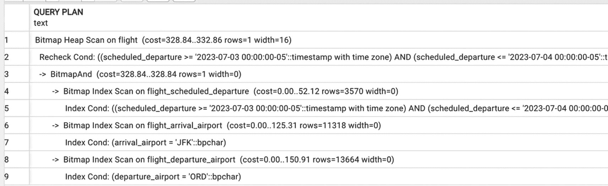

*图 5-10：在单个表上使用多个索引扫描的执行计划*

查询计划包含 9 行文本。这些行表示`对 flight 的位图堆扫描`、`重新检查条件`、`对 flight_scheduled_departure 的位图索引扫描`、`对 flight_arrival 的位图索引扫描`以及`索引条件`。

正如第 3 章深入讨论的那样，Postgres 可以通过在主内存中创建一个包含匹配记录的数据块的位图，然后对它们进行`OR`或`AND`操作，从而使用来自多个索引的搜索结果。在此过程完成后，剩下的唯一数据块是满足所有搜索条件的数据块，PostgreSQL 会读取剩余数据块中的所有记录以重新检查搜索条件。

数据块将按物理顺序扫描，因此基于索引的排序将会丢失。

使用多个基于索引的搜索的位图`AND`和`OR`是应用多个过滤条件的一种非常高效的机制，但不是唯一的一种。在下一节中，我们将讨论另一种选择——创建复合索引。

## 复合索引

到目前为止，展示的索引都是建立在单个列上的。本节讨论建立在多列上的索引及其优势。

## 复合索引如何工作？

让我们回到清单 5-9 中的查询。对表`flight`应用三个搜索条件的结果可以通过使用多个索引来计算。另一种选择是在所有三个列上创建一个复合索引：

```sql
CREATE INDEX flight_depart_arr_sched_dep ON  flight(
departure_airport,
arrival_airport,
scheduled_departure)
```

有了这个索引，执行计划将如图 5-11 所示。

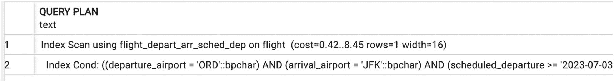

*图 5-11：使用复合索引的计划*

查询计划包含 2 行文本。第一行表示`使用 flight_departure_arrival_scheduled_departure 索引对 flight 进行索引扫描`。第二行表示`索引条件`。

这个新的复合索引将支持按`departure_airport`、按`departure_airport`和`arrival_airport`以及按`departure_airport`、`arrival_airport`和`scheduled_departure`进行搜索。但是，它将不支持仅按`arrival_airport`或`scheduled_departure`进行搜索。

查询

```sql
SELECT
departure_airport,
scheduled_arrival,
scheduled_departure
FROM flight
WHERE  arrival_airport='JFK'
AND scheduled_departure BETWEEN '2023-07-03' AND '2023-07-04'
```

...将产生如图 5-12 所示的执行计划。

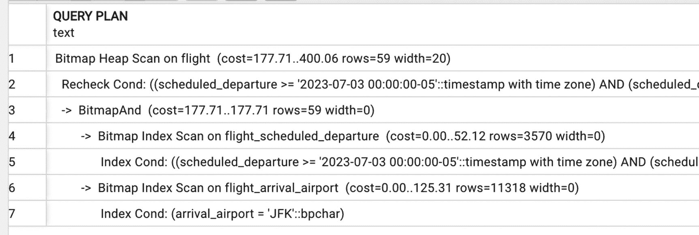

*图 5-12：未使用复合索引*

查询计划包含 7 行文本。它表示`对 flight 的位图堆扫描`、`重新检查条件`、`对 flight_scheduled_departure_arrival 的位图索引扫描`和`索引条件`。

另一方面，查询

```sql
SELECT
scheduled_departure ,
scheduled_arrival
FROM flight
WHERE departure_airport='ORD' AND arrival_airport='JFK'
AND scheduled_arrival BETWEEN '2023-07-03' AND '2023-07-04';
```

...将使用复合索引，尽管只使用了前两列，如图 5-13 所示。

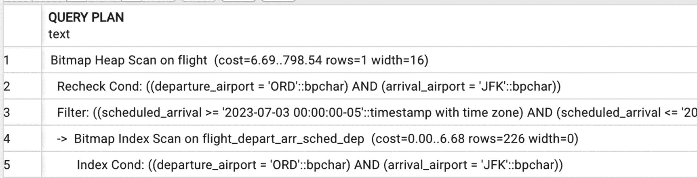

*图 5-13：对前两列使用复合索引的计划*

查询计划包含 5 行文本。它表示`对 flight 的位图堆扫描`、`重新检查条件`、`对 flight_departure_arrival_scheduled_departure 的位图索引扫描`和`索引条件`。

一般来说，建立在(`X`,`Y`,`Z`)上的索引将被用于搜索`X`、(`X`,`Y`)、(`X`,`Y`,`Z`)甚至(`X`,`Z`)，但不会用于仅搜索`Y`或搜索`YZ`。因此，在创建复合索引时，不仅要决定包含哪些列，还必须考虑它们的顺序。

为什么要创建复合索引？毕竟，上一节已经证明同时使用多个索引同样有效。创建此类索引有两个主要原因：降低选择性和额外的数据存储。

## 降低选择性

记住，选择性越低，搜索速度越快。当我们优化短查询时，我们的目标是避免在任何给定点读取大量行（即使以后能够过滤掉它们）。有时，单个列值都不够具有限制性，只有特定的组合才能使查询变短。

在上一节的例子中，有 12,922 个出发机场是`ORD`的航班和 10,530 个到达机场是`JFK`的航班。然而，从`ORD`起飞并降落在`JFK`的航班数量仅为 184。

## 使用索引进行数据检索

当`SELECT`语句中的所有列都包含在复合索引中时，可以在不访问表的情况下检索它们。这被称为`仅索引扫描`数据检索方法。

上一节中的所有执行计划在通过`索引扫描`定位记录后，仍然需要从表中读取记录，因为我们仍然需要索引中未包含的列的值。

让我们再构建一个复合索引，并包含一个额外的列：

```sql
CREATE INDEX flight_depart_arr_sched_dep_sched_arr
ON flight (departure_airport,
arrival_airport,
scheduled_departure,
scheduled_arrival );
```

该查询的执行计划将立即转换为`仅索引扫描`，如图 5-14 所示。

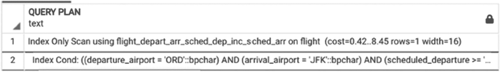

*图 5-14：包含仅索引扫描的计划*

查询计划包含 2 行文本。它表示`使用 departure_airport、arrival_airport、scheduled_departure 和 scheduled_arrival 的仅索引扫描`，以及`索引条件`。

请注意，搜索再次是在索引的前三列上进行的。如果搜索没有包含索引的第一列，例如

```sql
SELECT
departure_airport,
scheduled_departure ,
scheduled_arrival
FROM flight
WHERE arrival_airport='JFK'
AND scheduled_departure BETWEEN '2023-07-03' AND '2023-07-04'
```

...执行计划将恢复为使用多个索引并进行`AND`和`OR`操作，如图 5-15 所示。

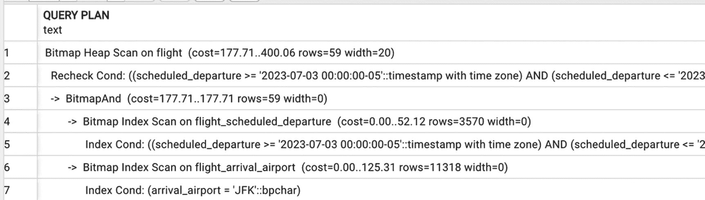

*图 5-15：当搜索不包含索引首列时，不使用复合索引*

查询计划包含 7 行文本。它表示`对 flight 的位图堆扫描`、`重新检查条件`、`对 flight_scheduled_departure 的位图索引扫描`、`对 flight_arrival 的位图索引扫描`和`索引条件`。


### 覆盖索引

覆盖索引最早在 PostgreSQL 11 中引入。这些索引可以被视为对支持“仅索引扫描”访问方法的持续努力的延续。一个`覆盖索引`是专门设计用来包含你频繁运行的特定类型查询所需的列。

在上一节中，将 `scheduled_arrival` 列添加到索引中，仅仅是为了避免额外回表查询。它并不打算用作搜索条件。在这种情况下，可以改用覆盖索引：

```sql
CREATE INDEX flight_depart_arr_sched_dep_inc_sched_arr
   ON flight
(departure_airport,
arrival_airport,
scheduled_departure)
INCLUDE (scheduled_arrival);
```

对于查询

```sql
SELECT
departure_airport,
scheduled_departure,
scheduled_arrival
FROM flight
WHERE arrival_airport='JFK' AND departure_airport='ORD'
AND scheduled_departure BETWEEN '2023-07-03' AND '2023-07-04'
```

的执行计划将如图 5-16 所示。


一个查询计划由 2 行文本组成。第一行表示使用 `flight_departure, arrival, scheduled_departure, and scheduled_arrival` 的仅索引扫描。第二行包含了索引条件。

图 5-16
使用覆盖索引进行仅索引扫描的计划

在这种情况下，在索引中包含一个额外的列与创建一个覆盖索引区别不大。但是，如果需要将更多（或更宽的）列与索引值一起存储，覆盖索引可能会更紧凑。

### 过度选择条件

有时，当过滤逻辑复杂且涉及多个表的属性时，有必要提供额外的、冗余的过滤条件，以促使数据库引擎使用特定的索引或减少连接参数的大小。这种做法被称为使用过度选择条件。其目的是使用这个额外的过滤器从大表中预选出一个小的记录子集。

对于其中一些复杂的条件，PostgreSQL 能够自动执行查询重写。

例如，代码清单 5-10 中的查询的过滤条件结合了表 `flight` 和 `passenger` 的属性值。在早期版本的 PostgreSQL 中，引擎无法在连接所有表之前开始过滤，因为 AND 条件应用于不同表的列。

```sql
SELECT
last_name,
first_name,
seat
FROM boarding_pass bp
JOIN booking_leg bl USING (booking_leg_id)
JOIN flight f USING (flight_id)
JOIN booking b USING(booking_id)
JOIN passenger p USING (passenger_id)
WHERE
(departure_airport='JFK'
AND scheduled_departure BETWEEN
'2023-07-10' AND '2023-07-11'
AND last_name ='JOHNSON')
OR
(departure_airport='EDW'
AND scheduled_departure BETWEEN '2023-07-13' AND '2023-07-14'
AND last_name ='JOHNSTON')
```
代码清单 5-10
涉及两个表条件的查询

然而，现在优化器可以执行复杂的查询重写，如图 5-17 所示。

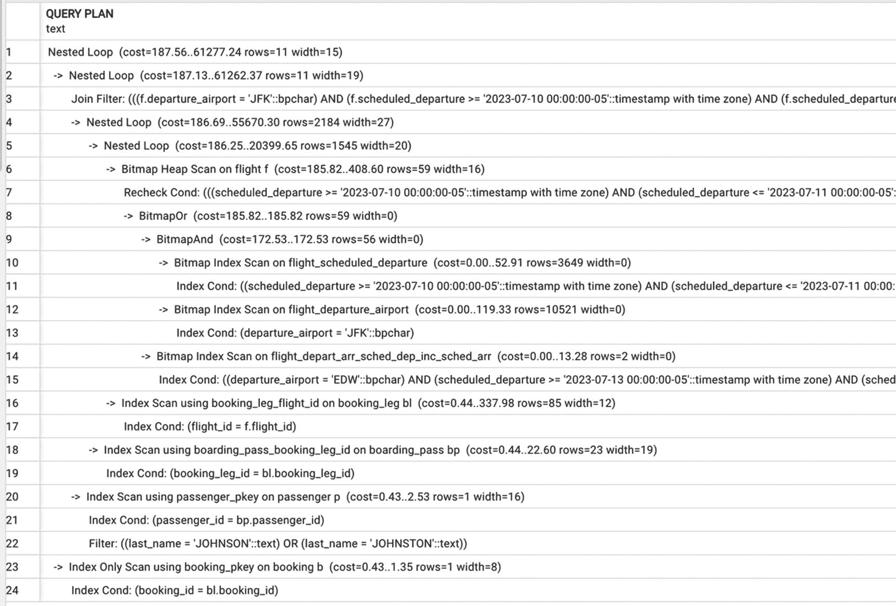

一个查询计划由 24 行文本组成。它标示了嵌套循环、连接过滤、对 flight 表的位图堆扫描、scheduled_arrival、scheduled_departure、arrival_airport、departure_airport、索引条件以及其他细节。

图 5-17
涉及两个表条件并带有查询重写的执行计划

注意第 8 到 15 行。PostgreSQL 重写了逻辑表达式，并选择了 `flight` 表中可能同时满足由 OR 连接的两个条件的所有记录。

在这种情况下，唯一能做的就是让 PostgreSQL 自行处理。

然而，有些查询如果没有人工干预，可能会永远运行下去。让我们看看代码清单 5-11 中的查询。这个查询寻找延误超过一小时的航班（这种航班应该不多）。对于所有这些延误的航班，查询选择在计划起飞时间之后签发的登机牌。

```sql
SELECT
bp.update_ts AS boarding_pass_issued,
scheduled_departure,
actual_departure,
status
FROM flight f
JOIN booking_leg bl USING (flight_id)
JOIN boarding_pass bp USING (booking_leg_id)
WHERE bp.update_ts > scheduled_departure + interval '30 minutes'
AND f.update_ts >=scheduled_departure -interval '1 hour'
```
代码清单 5-11
带有难以优化的过滤条件的简短查询

这看起来可能是一个刻意设计的例子，但它是基于生产环境中的异常报告建模的。许多公司都有某种异常报告机制来识别异常的系统行为。关键的是，根据定义，执行报告的输出应该很小。异常报告要有用，就应该报告相对罕见的情况——否则，它们就只是常规业务报告了。

所描述的情况听起来肯定不正常，而且应该没有很多这样的案例。然而，图 5-18 中的执行计划包含了大型表的全表扫描和哈希连接，即使所有涉及的表上都存在合适的索引。

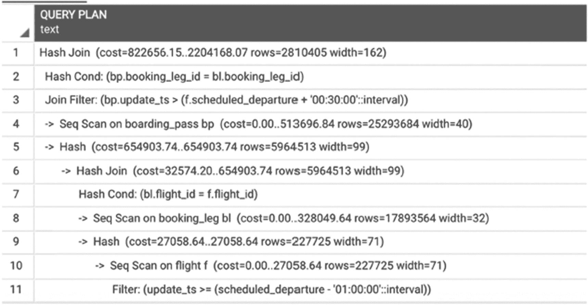

一个查询计划由 11 行文本组成。它们包括哈希连接、哈希条件、连接过滤器、对 boarding_pass 表的顺序扫描以及对 flight 表的顺序扫描。

图 5-18
一个简短查询的次优执行计划

那么，问题出在哪里呢？


## 回到短查询的定义

起初这似乎非常清楚，但现在变得有点棘手了。回想一下，如果一个查询只需要少量行来计算结果，它就是短查询。诚然，在这种情况下，我们确实只需要少量行，但却没有简单的方法找到它们。所以这里有个需要注意的地方：短查询不仅要求需要的行数少，还要求任何中间操作结果的行数也少。如果一个包含三个连接的查询是短查询，但在执行第一个连接后，中间结果却非常庞大，那就说明执行计划有问题。

如前所述，从表中读取少量行的唯一方法是使用索引。然而，对于清单 5-11 中的查询，我们没有任何索引可以支持其过滤条件。此外，也不可能构建这样的索引，因为一个表的筛选条件依赖于另一个表的值。在这种情况下，无法在连接之前进行筛选，这导致了全表扫描和哈希连接。

## 如何改进这个查询？

这个问题的答案与 SQL 本身没有直接关系。第 1 章提到，数据库优化始于收集需求，而在这个案例中，收集精确的需求就是通往优化的最佳途径。

请注意，在原始查询中，搜索空间是自古以来的所有航班——或者至少是数据库所涵盖的整个时间段。然而，这是一份异常报告，很可能是定期审阅的，并且报告的业务所有者很可能只关注自上次审阅以来的近期案例。更早的异常应该已经出现在之前的报告中，并且希望已经得到处理。下一步将是联系这份报告的业务所有者，询问一份仅包含最新异常的报告是否满足他们的需求。

如果答案是 `是`，我们就可以将从业务方获得的这一额外筛选条件应用到查询中。同时，我们还需要再建一个索引：

```
CREATE INDEX boarding_pass_update_ts ON postgres_air.boarding_pass  (update_ts);
```

清单 5-12 展示了修改后的查询，保留了两天的异常数据。

```
SELECT
bp.update_ts AS boarding_pass_issued,
scheduled_departure,
actual_departure,
status
FROM flight f
JOIN booking_leg bl USING (flight_id)
JOIN boarding_pass bp USING (booking_leg_id)
WHERE bp.update_ts > scheduled_departure + interval '30 minutes'
AND f.update_ts >=scheduled_departure -interval '1 hour';
AND bp.update_ts >='2023-08-13' AND bp.update_ts< '2023-08-14';
清单 5-12
添加了额外筛选条件的查询
```

现在，将首先按时间戳进行搜索，如图 5-19 中的执行计划所示。

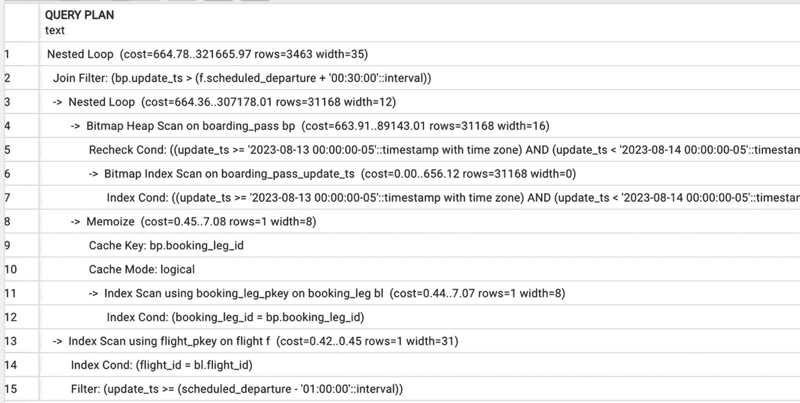

查询计划包含 15 行。其中包括嵌套循环、连接过滤器、对 boarding_pass 的位图堆扫描、重新检查条件、缓存键、缓存模式以及其他数据集。

图 5-19

带有额外筛选条件的执行计划

该查询的执行时间少于 200 毫秒，而原始查询的执行时间是 2 分 44 秒。

如果你运行的是 PostgreSQL 14 或更高版本，并且配置参数 `enable_memoize` 开启，执行计划中会出现一个 `Memoize` 节点（第 8-10 行）。记忆化计划允许在嵌套循环连接内部缓存参数化扫描的结果。这并没有改变本计划中所使用的基于索引的访问方式。

## 部分索引

部分索引是 PostgreSQL 的最佳特性之一。顾名思义，部分索引是建立在表的一个子集上的，由 `CREATE INDEX` 语句的 `WHERE` 子句定义。

例如，对于计划在未来起飞的航班，`actual_departure` 列为空。为了改进按 `actual_departure` 的搜索，我们可以仅为实际起飞值非空的航班创建一个索引：

```
CREATE INDEX flight_actual_departure_not_null
ON flight(actual_departure)
WHERE actual_departure IS NOT NULL
```

在这个特定案例中，执行时间的差异不会很显著，因为 `flight` 表不是很大，并且在当前数据分布下，只有一半的航班实际起飞时间为 null。然而，如果一个列中的值分布不均匀，使用部分索引可以带来很大的优势。

例如，`flight` 表中的 `status` 列只有三个可能的值："On schedule"（按计划）、"Delayed"（延误）和 "Canceled"（取消）。这些值的分布不均；状态为 "On schedule" 的航班数量远多于其他两种。在 status 列上创建索引将不切实际，因为该列的选择性非常高。然而，如果能快速筛选出取消的航班将会很有用，特别是因为与现实生活相比，postgres_air 模式中取消的航班并不多。

我们将创建一个索引：

```
CREATE INDEX flight_canceled ON flight(flight_id)
WHERE status='Canceled';
```

这个索引将被用于所有我们选择取消航班的查询，无论其他过滤条件如何，例如：

```
SELECT * FROM flight WHERE
scheduled_departure between '2023-08-13' AND '2023-08-14'
AND status='Canceled'
```

该查询的执行计划如图 5-20 所示。

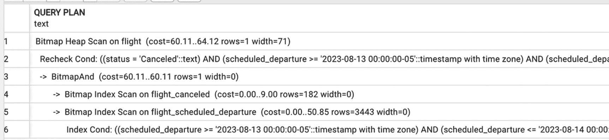

查询计划包含 6 行。其中包括对 flight 的位图堆扫描、重新检查条件、对 flight_canceled 的位图索引扫描、对 flight_scheduled_departure 的位图索引扫描以及索引条件。

图 5-20

部分索引的使用

使用部分索引将执行时间从 0.72 秒减少到了 0.16 秒。


## 索引与连接顺序

如前所述，在短查询中，优化目标是避免产生大型中间结果。这意味着必须确保最具限制性的选择条件最先被应用。之后，对于每个连接操作，我们都应确保结果集持续保持较小。

连接结果集较小的原因可能是连接表本身受限（连接参数中的记录数少），或是由于半连接（其中一个参数显著限制了结果集大小）。

大多数情况下，查询规划器会选择正确的连接顺序，除非被强制指定了错误的顺序。

让我们从创建更多索引开始：

```sql
CREATE INDEX account_login ON account(login);
CREATE INDEX account_login_lower_pattern ON account  (lower(login) text_pattern_ops);
CREATE INDEX passenger_last_name ON passenger  (last_name);
CREATE INDEX boarding_pass_passenger_id ON boarding_pass  (passenger_id);
CREATE INDEX passenger_last_name_lower_pattern ON passenger  (lower(last_name) text_pattern_ops);
CREATE INDEX passenger_booking_id ON passenger(booking_id);
CREATE INDEX booking_account_id ON booking(account_id);
CREATE INDEX booking_email_lower_pattern    ON booking
(lower(email) text_pattern_ops);
```

现在，考虑 5-13 清单中的例子。

```sql
SELECT
b.account_id,
a.login,
p.last_name,
p.first_name
FROM passenger p
JOIN booking b USING(booking_id)
JOIN account a ON a.account_id=b.account_id
WHERE lower(p.last_name) LIKE 'smith%'
AND lower(login) LIKE 'smith%';
```

**清单 5-13**
连接顺序示例

此查询的执行计划如图 5-21 所示。注意，尽管列出的第一个表是 `passenger` 表，并且第一个选择条件也作用于该表，但执行却从 `account` 表开始。

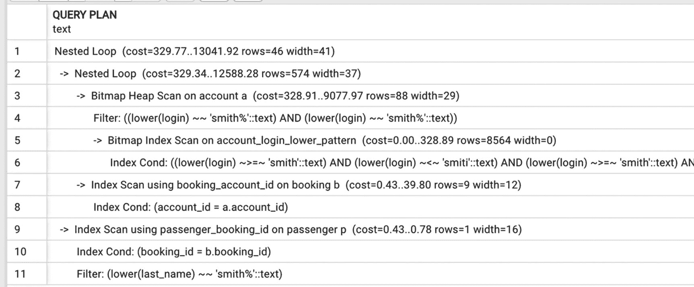

查询计划由 11 行文本组成。这些行包括对 account 表的嵌套循环、位图堆扫描、过滤器、对 account_login_lower_pattern 索引的位图索引扫描、索引条件、使用 booking_account_id 的索引扫描以及其他细节。

**图 5-21**
连接顺序：当选择性相似时，从较小的表开始执行

原因是 `account` 表包含的记录数远少于 `passenger` 表，尽管两个过滤器的选择性大致相同，但 `account` 表上的相应索引将产生更少的记录。注意，在这种情况下，`passenger` 表上的模式索引根本未被使用。

然而，当查询条件寻找姓氏不常见的乘客（即选择性非常低的姓氏）时，执行计划会发生显著变化。图 5-22 中的执行计划表明，在这种情况下，从 `passenger` 表开始处理更具限制性。此时，PostgreSQL 查询规划器使用了 `passenger` 表上的模式索引，而没有使用 `account` 表上的模式索引。

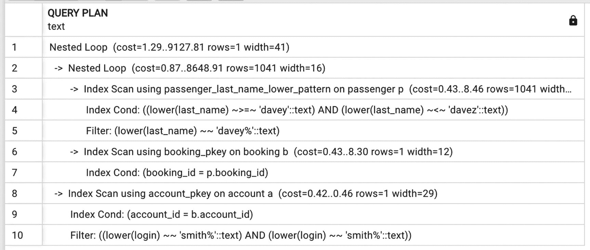

查询计划由 10 行组成。这些行包括对 passenger_last_name_lower_pattern 的嵌套循环、索引扫描、索引条件、过滤器、使用 booking_pkey 的索引扫描以及其他细节。

**图 5-22**
不同的选择性促使不同的连接顺序

比较这两个计划时，另一件值得注意的事情是，由于第一个查询产生的行数多得多，因此使用了位图索引扫描；而第二个查询由于选择性较低，使用了常规的索引扫描。

5-14 清单中的 `SELECT` 语句类似，但不是与 `passenger` 表连接，而是与 `frequent_flyer` 表连接，该表的大小约为 `account` 表的一半。当然，为了能够搜索这个表，还需要再创建两个索引：

```sql
CREATE INDEX frequent_fl_last_name_lower_pattern ON frequent_flyer  (lower(last_name) text_pattern_ops);
CREATE INDEX frequent_fl_last_name_lower ON frequent_flyer  (lower(last_name));
```

在这种情况下，执行将从 `frequent_flyer` 表开始，如图 5-23 所示。

```sql
SELECT
a.account_id,
a.login,
f.last_name,
f.first_name,
count(*) AS num_bookings
FROM frequent_flyer f
JOIN account a USING(frequent_flyer_id)
JOIN booking b USING(account_id)
WHERE lower(f.last_name)='smith'
AND lower(login) LIKE 'smith%'
GROUP BY 1,2,3,4
```

**清单 5-14**
查询每位常旅客的预订数量

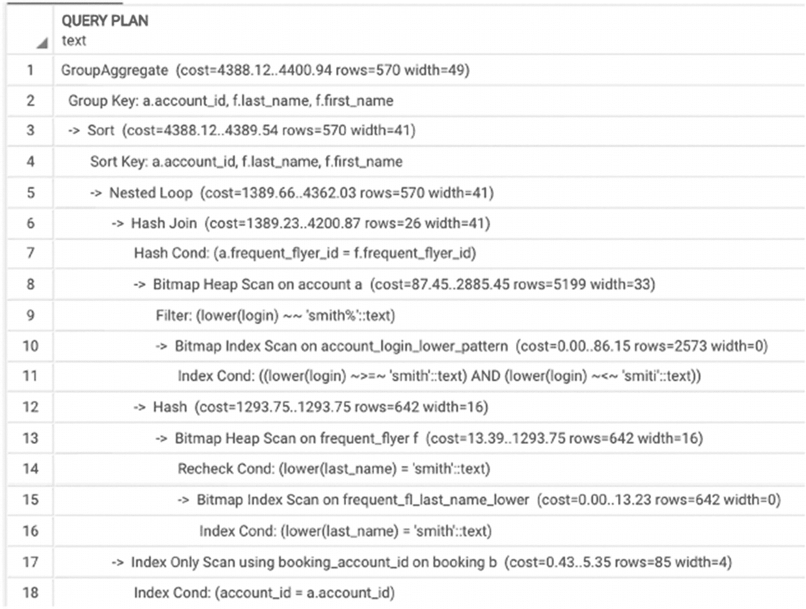

查询计划由 18 行文本组成。这些行包括分组聚合、分组键、排序键、嵌套循环、哈希连接、哈希条件、对 account 表的位图堆扫描、对 account_login_lower_pattern 的位图索引扫描以及其他细节。

**图 5-23**
清单 5-14 中查询的执行计划

## 何时不使用索引

到目前为止，本章介绍了索引如何在查询中使用。本节将转向索引*不被使用*的情况。具体来说，它讨论两种情况：如何在某些情况下防止 PostgreSQL 使用索引，以及当索引未被使用而我们认为其应该被使用时该怎么办。

### 避免使用索引

*为什么*需要避免使用索引？通常，数据库开发人员认为使用索引可以提高任何查询的性能。我们每个人都能回忆起被要求“建立一些索引以使此查询运行更快”的情况。然而，索引并非总是必需的，有时甚至可能适得其反。本章前面的两个例子（图 5-1 和 5-6）展示了尽管包含顺序读取，但仍然相当高效的执行计划。

我们可能希望避免使用索引的两个主要原因如下：

*   小表被完全读入主内存。
*   我们需要执行查询时用到表中很大比例的行。

是否有办法避免使用现有索引？大多数情况下，优化器足够智能，能够判断何时应该或不应该使用索引。但在极少数失败的情况下，我们可以修改选择条件。回想本章开头提到的，列转换会阻止索引的使用。当时，这被描述为列转换的负面影响，但当目标是阻止索引使用时，它也可以用来提高性能。

如果列是数字类型，可以通过对其值加零来修改。例如，条件 `attr1+0=p_value` 将阻止对 `attr1` 列上索引的使用。对于任何数据类型，`coalesce()` 函数总是会阻止索引的使用，因此假设 `attr2` 不可为空，条件可以修改为类似 `coalesce(t1.attr2, '0')=coalesce(t2.attr2, '0')` 的形式。


### 为什么 PostgreSQL 会忽略我的索引？

偶尔会遇到极其令人沮丧的情况：明明存在合适的索引，但出于某种原因，PostgreSQL 就是不使用它。这时，熟悉其他支持优化器提示的系统的数据库开发者可能真的会开始怀念它们。然而，大多数情况下，并没有理由感到沮丧。PostgreSQL 拥有顶尖的优化器之一，在绝大多数情况下都会做出正确的选择。因此，很有可能存在一个合理的原因，并且通过检查执行计划是能够找到的。

让我们考虑一个例子。这个例子，以及后续章节中的一些例子，使用了较大的表。由于这些表的体积，它们没有包含在 `postgres_air` 发行版中。但这些表对于说明现实生活中可能遇到的情况是必要的。这里使用的是 `boarding_pass_large` 表，它与 `boarding_pass` 表结构相同，但包含的行数是后者的三倍——超过 75,000,000 张登机牌。为了创建一个更大的表以供实验，你可以将 `boarding_pass` 表的每一行插入三次。

在 `postgres_air` 数据库中，当前日期是 2023 年 8 月 14 日。让我们选取过去一周办理登机手续的 100 名乘客样本：

```sql
SELECT * FROM boarding_pass_large
WHERE update_ts::date BETWEEN '2023-08-07' AND '2023-08-14'
LIMIT 100
```

不出所料，如图 5-24 所示的执行计划显示了一个顺序扫描。

```
[Images/501585_2_En_5_Fig24_HTML.jpg]
查询计划包含 3 行文本。各行内容包括 limit、在 boarding_pass 上的 sequential scan 和 filter。
图 5-24
由于列转换导致的顺序扫描
```

没问题，我们已经讲过如何避免这个问题。我们不将时间戳转换为日期，而是使用一个区间：

```sql
SELECT * FROM boarding_pass_large
WHERE update_ts BETWEEN '2023-08-07' AND '2023-08-15'
LIMIT 100
```

然而，当我们检查执行计划时，发现它仍然在使用顺序扫描！

为什么移除列转换后，PostgreSQL 仍然没有使用索引？答案在图 5-25 中。这是该索引在大表上相对较高的选择性与 `LIMIT` 操作符的存在共同作用的结果。查询规划器估计指定的筛选条件将选出超过 700,000 行，回想一下，这可能需要两倍的磁盘 I/O 操作。由于只需要 100 行，并且没有指定顺序，直接进行表的顺序扫描会更快。满足此条件的前一百条记录有更大的概率被更快地找到。

```
[Images/501585_2_En_5_Fig25_HTML.jpg]
查询计划包含 3 行文本。各行内容包括 limit、在 boarding_pass 上的 sequential scan 和 filter。
图 5-25
由于高索引选择性导致的顺序扫描
```

如果这 100 条记录需要按特定顺序选出，情况就会不同。除非排序顺序是在索引属性上，否则 PostgreSQL 将需要选出*所有*记录，然后才能决定哪些是排在前面的。

让我们修改 `SELECT` 语句，加入排序：

```sql
SELECT * FROM boarding_pass_large
WHERE update_ts BETWEEN '2023-08-07' AND '2023-08-15'
ORDER BY boarding_time
LIMIT 100
```

现在执行计划（如图 5-26 所示）看起来大不相同了。

```
[Images/501585_2_En_5_Fig26_HTML.jpg]
查询计划包含 7 行文本。各行内容包括 limit、sort、sort key、在 boarding_pass 上的 bitmap heap scan、rechecked condition、在 boarding_pass_large_update 上的 bitmap index scan 和 index condition。
图 5-26
包含排序的执行计划
```

比较这两个查询的执行时间，顺序扫描的那个运行了 140 毫秒，而强制使用索引访问的那个运行了 620 毫秒，因此在这种情况下顺序扫描确实更高效。

## 让 PostgreSQL 做它该做的事！

在本节中，我们将使用前几节中查询的几个修改版本来说明 PostgreSQL 如何根据数据统计信息修改执行计划。

我们希望到目前为止，已经有力地证明了优化器在大多数情况下都做得很对，而我们在大多数情况下的目标只是给它足够的灵活性来做出正确的选择。

让我们回到上一节中对大表的查询：

```sql
SELECT * FROM boarding_pass_large
WHERE update_ts BETWEEN '2023-08-07' AND '2023-08-15'
LIMIT 100
```

这个查询的执行计划如图 5-25 所示，PostgreSQL 优化器选择了顺序扫描，因为七天的区间太大，无法从索引访问中获得任何好处。现在，让我们缩小时间区间：

```sql
SELECT * FROM boarding_pass_large
WHERE update_ts BETWEEN '2023-08-12' AND '2023-08-15'
LIMIT 100
```

图 5-27 中这个查询的执行计划显示使用了基于索引的访问。

```
[Images/501585_2_En_5_Fig27_HTML.jpg]
查询计划包含 3 行文本。各行内容包括 limit、使用 boarding_pass 的 index scan 和 index condition。
图 5-27
当时间区间变小时，计划转为索引访问
```

继续检查不同的区间，我们会发现在这个案例中，八天是一个临界点。如果区间的开始日期是 8 月 7 日之后的任何日期，执行计划就会显示使用索引。

更有趣的是，如果从查询中移除 `LIMIT 100`，执行计划将显示索引扫描。如果我们将区间再增加一天，执行计划将转向位图扫描；如果再增加一天，它就会翻转为顺序扫描（参见图 5-28、5-29 和 5-30 中相应的执行计划）。

```
[Images/501585_2_En_5_Fig30_HTML.jpg]
查询计划包含 2 行文本。各行内容包括在 boarding_pass_large 上的 sequential scan 和 filter。
图 5-30
使用顺序扫描的执行计划
```

```
[Images/501585_2_En_5_Fig29_HTML.jpg]
查询计划包含 4 行文本。各行内容包括在 boarding_pass_large 上的 bitmap heap scan、rechecked condition、在 boarding_pass_large_update 上的 bitmap index scan 和 index condition。
图 5-29
使用位图扫描的执行计划
```

```
[Images/501585_2_En_5_Fig28_HTML.jpg]
一张截图显示了一个包含 2 行文本的查询计划。各行内容包括使用 boarding_pass_large_update 的 index scan 和 index condition。顶部指示了不同的图标。
图 5-28
使用索引扫描的执行计划
```

让我们看另一个例子——清单 5-13 中的查询。我们观察到，根据乘客姓氏的选择性不同，连接顺序（以及应用索引的方式）也会改变。事实上，通过尝试不同的姓氏，可以识别出执行计划发生翻转时的选择性（大约 200 次出现）。

最后，让我们看一个相对简单的 SQL 语句。清单 5-15 中的三个 `SELECT` 语句除了每个搜索条件的过滤值不同外，其余完全相同。在第一个查询中，出发机场具有高选择性，乘客姓名具有低选择性。在第二个查询中，两个值都具有高选择性。在最后一个查询中，出发机场具有低选择性。如图 5-31、5-32 和 5-33 所示的计划在连接算法、连接顺序和使用的索引上有所不同。


## 代码清单 5-15 使用三组不同参数的 SELECT 语句

```sql
--#1
SELECT
p.last_name,
p.first_name
FROM passenger p
JOIN boarding_pass bp USING (passenger_id)
JOIN booking_Leg bl USING (booking_leg_id)
JOIN flight USING(flight_id)
WHERE departure_airport='LAX'
AND lower(last_name)='clark'
--#2
SELECT
p.last_name,
p.first_name
FROM passenger p
JOIN boarding_pass bp USING (passenger_id)
JOIN booking_Leg bl USING (booking_leg_id)
JOIN flight USING(flight_id)
WHERE departure_airport='LAX'
AND lower(last_name)='smith'
--#3
SELECT
p.last_name,
p.first_name
FROM passenger p
JOIN boarding_pass bp USING (passenger_id)
JOIN booking_Leg bl USING (booking_leg_id)
JOIN flight USING(flight_id)
WHERE departure_airport='FUK'
AND lower(last_name)='smith'
```

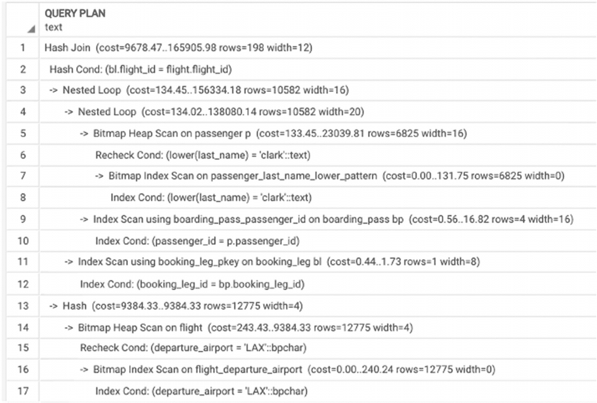

**图 5-31** 查询 #1 的执行计划

一个查询计划由 17 行组成。这些行表示哈希连接、哈希条件、嵌套循环、对 passenger 表的位图堆扫描、对乘客姓氏小写模式的位图索引扫描、索引条件和其他细节。

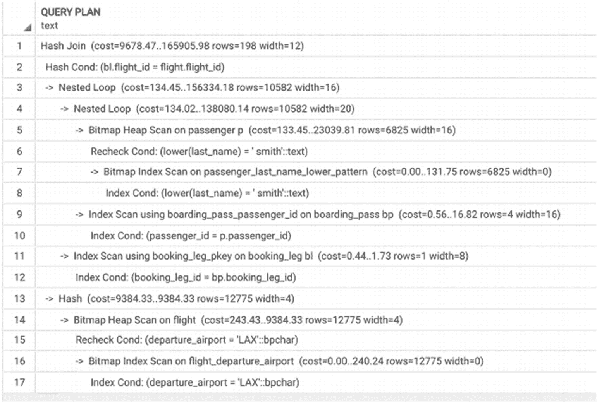

**图 5-32** 查询 #2 的执行计划

一个查询计划由 17 行文本组成。这些行表示哈希连接、哈希条件、嵌套循环、对 passenger 表的位图堆扫描、对乘客姓氏小写模式的位图索引扫描、登机牌上的乘客 ID、索引条件和其他细节。

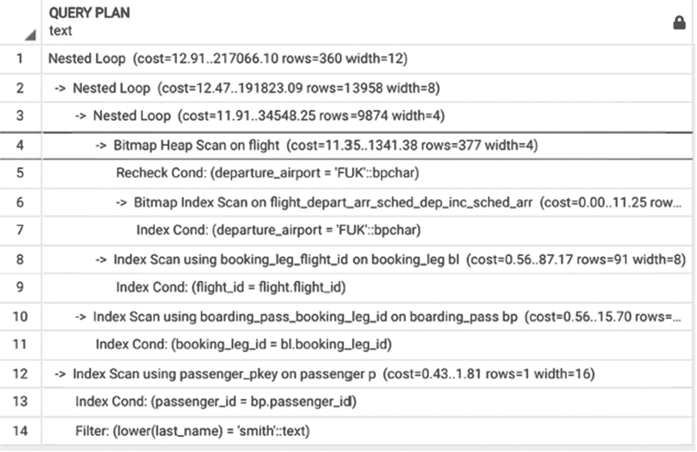

**图 5-33** 查询 #3 的执行计划

一个查询计划由 14 行文本组成。它高亮显示了第四行，该行表示对 flight 表的位图堆扫描，以及括号内的成本、行数和宽度等详细信息。

## 如何构建合适的索引

在本章开头，我们在 `postgres_air` 模式中定义了一组最小索引集。几乎每次我们想要提高查询性能时，都会建议再构建一个索引。所有这些索引确实都有助于缩短执行时间。但从未讨论过的是，创建新索引是否需要额外的依据。

### 构建还是不构建

二十年前，我们在决定是否添加又一个索引时要谨慎得多。反对创建过多索引的两个主要原因是：索引会占用数据库中的额外空间，以及当有太多索引需要与记录本身一起更新时，插入和更新操作会变慢。当时的普遍建议是在批量加载数据之前删除表上的所有索引，然后再重新创建它们。一些数据库教科书至今仍提供相同的建议——不是要删除索引，而是要注意表上索引的数量。

自那时起，时代已经改变。在当今的硬件和软件条件下，情况有所不同。磁盘存储更便宜，磁盘速度更快，而且总的来说，快速响应比节省磁盘空间更有价值。二十年前，数据库中某个表的索引累计大小超过表本身大小是一个危险信号。如今，这已成为 OLTP 系统的常态。但是，问题仍然存在：多少才算足够？

### 需要哪些索引？

要就哪些索引是必要的提供任何通用建议是具有挑战性的。在 OLTP 系统中，响应时间通常至关重要，任何短查询都应该有索引支持。

我们建议在有意义的情况下创建部分索引和覆盖索引。部分索引通常比常规索引小，更有可能完全驻留在内存中。覆盖索引避免了访问表的开销，从而允许引擎在内存中执行大部分处理。

插入和更新所需的额外时间通常不如快速响应那么关键。但是，您应该始终关注这个时间，如果检测到变慢，就评估索引清单。唯一/主键索引和引用其他唯一/主键字段的外键，以及插入/更新上的触发器，通常是导致变慢的常见原因。在每种情况下，您都需要权衡数据完整性与更新速度的重要性。

网上有许多查询可以计算每个表上索引的总大小，大多数监控工具都会在索引过度增长时发出警报。

### 哪些索引是不需要的？

尽管我们通常不关心索引所需的额外磁盘空间，但我们不希望创建无用的数据库对象。PostgreSQL 的目录视图 `pg_stat_all_indexes` 显示了自上次重置统计信息以来索引被使用的总次数（扫描、读取和获取）。

请注意，某些主键索引可能从未用于数据检索；然而，它们对于数据完整性至关重要，不应被移除。

## 索引与短查询的可扩展性

在本节中，我们将讨论如何优化短查询，以便在数据量增长时它们仍能保持良好的性能。

在第 1 章中，我们提到优化在查询投入生产后并未停止。我们应该持续监控性能，并主动识别性能动态的变化。

对于短查询，这种性能监控至关重要，因为当数据量增长时，查询行为可能会发生巨大变化，尤其是当不同表的增长速度不同时。

当一个查询有索引支持时，至少可以保证它具有一定的可扩展性，因为对索引的访问次数相对于表的增长仅呈对数增长。但如果一个表的大小增长过快，索引可能变得太大而无法完全放入内存，或者可能被竞争查询的索引挤出内存。如果发生这种情况，执行时间可能会急剧增加。

有可能一开始某个查询在没有任何索引的情况下也能快速运行，而我们可能无法确切知道未来需要哪些索引。也有可能某个部分索引的条件最初非常严格，索引访问非常快，但后来，满足该条件的记录越来越多，索引的效率就降低了。

简而言之，尽管我们努力确保短查询具有可扩展性，并且即使数据量增长也能表现良好，但我们不能假设任何东西是“永远”优化的。我们应该始终关注数据量、值分布以及其他可能干扰性能的特征。

## 总结

本章介绍了短查询以及可用于优化它们的技术。短查询的主要优化目标是首先应用最具限制性的搜索条件，并确保所有中间结果集保持较小。因此，本章讨论了索引在短查询中的作用，并展示了如何确定需要创建哪些索引来支持特定查询。

本章还展示了各种执行计划以及如何阅读它们以理解连接和过滤的顺序，并讨论了 PostgreSQL 中可用的各种索引类型及其适用场景。更复杂的索引类型将在第 14 章深入探讨。


