# 6. 长查询与全表扫描

第 5 章讨论了短查询，并解释了如何识别短查询以及适用于它们的优化策略与技术。它还涵盖了索引对于短查询的重要性、最常用的索引类型及其应用。第 5 章也提供了一个实践阅读执行计划的机会，并有望帮助你建立对 PostgreSQL 优化器的信心。

本章关注长查询。有些查询，无论写得多好，就是无法在零点几秒内运行完成。这并不意味着它们无法被优化。许多从业者认为，既然分析报表没有严格的响应时间要求，那么它们运行得快或慢并不重要。在极端情况下，报表开发者甚至不努力确保报表在合理时间内完成，借口是查询每天、每周或每月只运行一次。

这是一种危险的做法。如果忽视报表性能，性能很容易从几分钟退化到几小时甚至更久。我们曾观察到有报表运行了六天才完成！等到情况变得如此严峻时，在有限的时间内修复并非易事。通常，在开发分析报表时，源数据量确实很小，一切表现良好。SQL 开发者的职责是，即使查询目前运行良好，也要检查执行计划，并采取主动措施以防止未来性能下降。

## 哪些查询被视为长查询？

第 5 章介绍了短查询的正式定义。可以合理地假设，所有非短查询都是长查询。这没错，但基于否定的定义在实践中可能不够直观。

第 5 章中的两个长查询示例（清单 5-1 和 5-3）分别复制在下面的清单 6-1 和 6-2 中。两者中的第一个查询是结果集庞大的长查询；该查询返回了所有可能的出发和到达机场组合。第二个查询仅产生一行输出——显示 `postgres_air` 模式中所有航班的平均飞行长度和乘客数量——但仍然被归类为长查询。

清单 6-2：结果集只有一行的长查询

```sql
SELECT
avg(flight_length),
avg (passengers)
FROM
(SELECT
flight_no,
scheduled_arrival -scheduled_departure AS flight_length,
count(passenger_id) passengers
FROM flight f
JOIN booking_leg bl ON bl.flight_id = f.flight_id
JOIN passenger p ON p.booking_id=bl.booking_id
GROUP BY 1,2) a
```

清单 6-1：结果集很大的长查询

```sql
SELECT
d.airport_code AS departure_airport
a.airport_code AS arrival_airport
FROM  airport a,
airport d
WHERE a.airport_code  d.airport_code
```

那么，究竟什么是长查询？

当一个查询对于至少一个大表具有高选择性时，即，即使输出规模很小，几乎每一行都对输出有贡献，该查询就被视为 *长查询*。

对于长查询，我们应该设定什么样的优化目标？本章明确反驳的一个常见误解是，如果一个查询是长查询，就无法显著提升其性能。此外，每位合著者都有幸将长查询的性能提升 *数百倍*。当应用以下两种优化策略时，这种改进成为可能：

1.  避免多次表扫描。
2.  在尽可能早的阶段减少结果的大小。

本章剩余部分将详细解释这些技术，并描述几种实现此目标的方法。

## 长查询与全表扫描

第 5 章指出，短查询要求在搜索条件中包含的列上存在索引。对于长查询，情况恰恰相反：不需要索引，如果表有索引，我们要确保索引不被使用。

为什么全表扫描对于长查询是可取的？如图 3-3 所示，当所需的行数足够大时，索引访问将需要更多的 I/O 操作。百分之多少或多少条记录算是“足够大”是变化的，并取决于许多不同的因素。时至今日，PostgreSQL 在大多数时候都能正确估计这个百分比，应该不足为奇了。

第 5 章对短查询也说过非常类似的话。但是，“多大算足够大”比“多小算足够小”更难估计。

对于多少条记录算“太多”的估计，会随着更好的硬件、更快的磁盘和更强大的 CPU 的出现而演变。因此，本书尽量避免给出具体的数字阈值，因为这些阈值必然会变化。为了构成本章的代表性案例，我们构建了几个包含数亿行数据的表。这些表太大了，无法随 `postgres_air` 一起分发。然而，如果几年后本章中的一些示例不再具有代表性，也无需感到惊讶。


## 长查询与哈希连接

在本章的大多数示例中，都使用了哈希连接算法。这正是我们希望在长查询的执行计划中看到的。为什么在这种情况下哈希连接更可取呢？在第 3 章中，我们评估了嵌套循环和哈希连接算法的成本。

对于嵌套循环，表 `R` 和 `S` 连接的成本是

```
cost(nl,R,S)=size(R) * size(S)+size(R)*size(S)/size(JA)
```

对于哈希连接，成本是

```
cost(hash,R,S)=size(R)+size(S)+size(R)*size(S)/size(JA)
```

其中 `JA` 表示连接属性的不同值数量。如第 3 章所述，应在两种算法的成本上都加上第三项，该项代表结果集的大小，但对于嵌套循环算法，这个值远小于连接本身的成本。对于长查询，`R` 和 `S` 的规模很大（因为它们没有受到显著限制），这使得嵌套循环的成本显著高于哈希连接的成本。

假设数据库统计信息估计表 `R` 的大小为 1,000,000 行，表 `S` 的大小为 2,000,000 行，连接属性 `JA` 有 100,000 个不同值。根据第 3 章的公式，连接结果的大小将是

```
Z=size(R) * size(S) / size(JA) =20,000,000
```

那么，嵌套循环算法的操作次数将是

```
Z+size(R)* size(S)=2,000,020,000,000
```

而哈希连接算法所需的操作次数将是

```
Z+size(R)+ size(S)==23,000,000
```

这几乎小了 10,000 倍。优化器将基于类似的计算来估算这些算法的成本，当然会选择哈希连接算法。

当第一个参数能完全放入主内存时，哈希连接的效果最好。可用内存的大小可以通过服务器参数进行调整。

在某些情况下，会使用归并连接算法，例如本章后面图 6-10 中的情况。第 3 章指出，当至少有一个表是预排序的时，归并连接可能更高效。在这种情况下，由于正在选择唯一值，排序确实被执行了。

总结第 5 章和本章的内容，大多数情况下，索引访问与嵌套循环算法配合良好（反之亦然），而顺序扫描与哈希连接配合良好。

由于 PostgreSQL 没有优化器提示，是否有办法强制使用特定的连接算法呢？正如已经多次提到的，我们能做的最好的事情就是在编写 SQL 语句时不要限制优化器。

## 长查询与连接顺序

第 5 章讨论了小查询的连接顺序。对于短查询，期望的连接顺序是能优先使用选择性较低的索引的顺序。

既然我们不期望在长查询中使用索引，那么连接的顺序是否重要呢？也许令人惊讶的是，它确实重要。大型表的规模可能差异很大。此外，在实践中，当选择“几乎所有记录”时，“几乎”这个词可能意味着少至 30%，多至 100%。即使不使用索引，连接的顺序也很重要，因为保持中间数据集尽可能小是至关重要的。

限制性最强的连接（即能最大程度减少结果集大小的连接）应该最先执行。

优化器通常会选择正确的顺序；然而，验证优化器是否选择正确是开发者的责任。

### 什么是半连接？

通常，查询中限制性最强的连接是`半连接`。让我们稍作停顿，给出一个正式定义。

两个表`R`和`S`之间的半连接，返回表`R`中那些在连接列上至少有一个来自表`S`的匹配行的行。

需要澄清的是，半连接不是额外的 SQL 操作；编写类似`SELECT a.* FROM a SEMI JOIN b`这样的语句是无效的 SQL。半连接是一种特殊的连接，它满足两个特定条件：首先，只有来自第一个表的列出现在结果集中。其次，当第二个表中存在多个匹配时，第一个表中的行不会被重复。大多数情况下，半连接根本不包含`JOIN`关键字。指定半连接的第一种也是最常见的方法如代码清单 6-3 所示。此查询查找所有至少有一个预订的航班的信息。

```
SELECT * FROM flight f WHERE EXISTS
(SELECT flight_id FROM booking_leg WHERE flight_id=f.flight_id)
代码清单 6-3
使用 EXISTS 关键字定义半连接
```

该查询使用与表`booking_leg`的隐式连接来过滤表`flight`中的记录。换句话说，我们不是提供用于过滤的值，而是使用另一个表中的列值。

显示指定半连接的另一种等效查询方法如代码清单 6-4 所示。

```
SELECT * FROM flight WHERE flight_id IN
(SELECT flight_id FROM booking_leg)
代码清单 6-4
使用 IN 关键字定义半连接
```

这些查询都没有使用`JOIN`关键字，它们如何包含连接呢？答案在于执行计划，两个查询的执行计划是相同的，如图 6-1 所示。

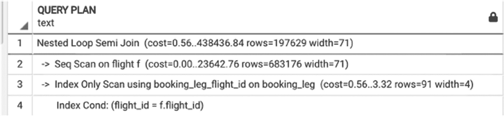

查询计划列表的截图。它包括嵌套循环半连接、对 flight f 的顺序扫描、仅索引扫描和索引条件。

图 6-1

半连接的执行计划

你可以在这个计划中看到一个`SEMI JOIN`，尽管查询本身没有使用`JOIN`关键字。

尽管这两种编写半连接查询的方式在语义上是相同的，但在 PostgreSQL 中，只有第一种能保证在执行计划中出现`SEMI JOIN`。代码清单 6-3 和 6-4 中两个查询的计划是相同的，但在其他情况下，优化器可能会选择将其重写为常规连接。这个决定基于两个表之间的基数关系以及过滤器的选择性。

## 半连接与连接顺序

由于半连接可能显著减小结果集的大小，且根据其定义绝不会增大结果集，因此半连接通常是查询中**限制性最强**的连接。如前所述，限制性最强的连接应最先执行。

半连接绝不会增大结果集的大小；需检查首先应用它们是否有益。

当然，这仅在半连接条件应用于单个表的列时才可能。当半连接条件引用多个表时，必须先连接这些表，然后再应用半连接。

考虑代码清单 6-5 中的示例，它显示了从位于美国的机场出发的预订信息。

```sql
SELECT departure_airport,
booking_id,
is_returning
FROM booking_leg bl
JOIN flight f USING (flight_id)
WHERE departure_airport
IN (SELECT
airport_code
FROM airport
WHERE iso_country='US')
```
*代码清单 6-5：存在半连接时的连接顺序*

图 6-2 显示了此查询的执行计划。

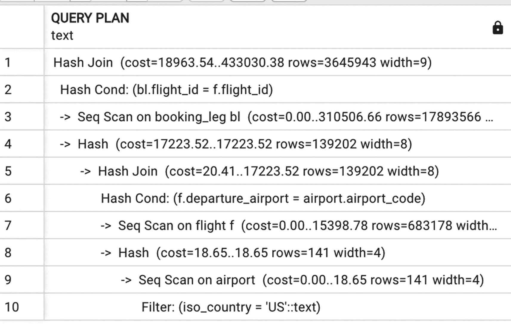
*图 6-2：代码清单 6-5 中查询的执行计划*

此执行计划未显示半连接操作，而是显示哈希连接，因为没有重复项需要移除。然而，它在逻辑上仍然是一个半连接，并且限制性最强，因此最先执行。这里也值得简要提一下对 `airport` 表的顺序扫描。使用顺序扫描是因为 `iso_country` 字段上没有索引。让我们创建此索引，看看它是否会加速查询。

如果此索引存在：

```sql
CREATE INDEX airport_iso_country
ON airport(iso_country);
```

……查询规划器将会使用它，如图 6-3 所示。然而，此时的执行时间与顺序扫描相同或更差，因为索引的选择性不够强。我们现在先删除此索引。

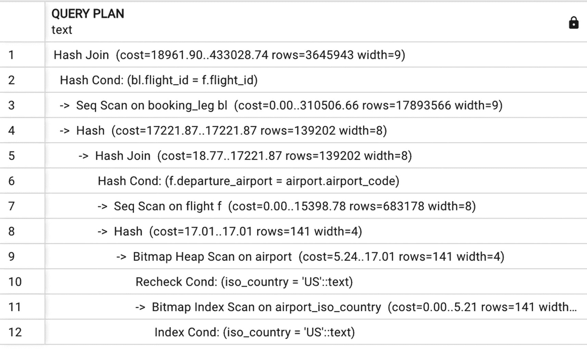
*图 6-3：带索引扫描的执行计划*

## 更多关于连接顺序

让我们看一下代码清单 6-6 中一个更复杂的例子，这是一个包含多个半连接的长查询。此查询与上一个类似，查找从美国出发的航班的预订，但仅限于 2020 年 7 月 1 日之后更新的预订。由于我们在 `booking` 表的 `update_ts` 列上没有索引，现在创建它并查看是否会被使用：

```sql
SELECT
departure_airport,
booking_id,
is_returning
FROM booking_leg bl
JOIN flight f USING (flight_id)
WHERE departure_airport IN
(SELECT airport_code
FROM airport
WHERE iso_country='US')
AND bl.booking_id IN
(SELECT booking_id FROM booking
WHERE update_ts>'2023-07-01')
```
*代码清单 6-6：一个长查询中的两个半连接*

```sql
CREATE INDEX booking_update_ts ON booking (update_ts);
```

图 6-4 中的执行计划显示，对 `airport.iso_country` 的半连接最先执行。正如前面的代码一样，尽管我们使用了关键字 `IN`，优化器使用的是 `JOIN` 而非 `SEMI JOIN`，因为无需消除重复项。

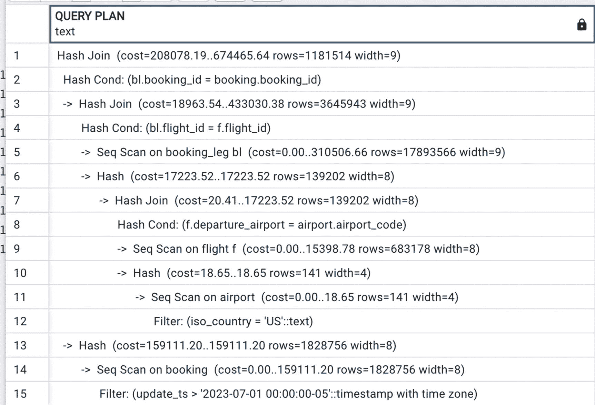
*图 6-4：带两个半连接的执行计划*

此执行计划中有三点值得注意。首先，尽管使用了基于索引的访问来获取一些中间结果，并且我们在此情况下看到使用了嵌套循环连接算法，但最终的连接是基于哈希的，因为使用了两个数据集中的大部分数据。其次，半连接使用了表顺序扫描。即使这种方式我们读取了 `airport` 表中的所有行，其结果集大小仍小于先连接航班与预订航段再根据机场位置进行过滤的结果集大小。这就是优化器选择限制性最强的半连接的益处。

最后，尽管 `booking` 表的 `update_ts` 列上存在索引，但此索引未被使用，因为条件 `update_ts>'2023-07-01'` 覆盖了该表中几乎一半的行。

但是，如果我们更改此查询（见代码清单 6-6）中的过滤条件，将时间间隔缩减为 `update_ts>'2023-08-10'`，执行计划将发生巨大变化——见图 6-5。在这个新的执行计划中，我们看到不仅 `update_ts` 上的过滤器限制性更强，而且优化器判断使用索引访问可能是有益的。

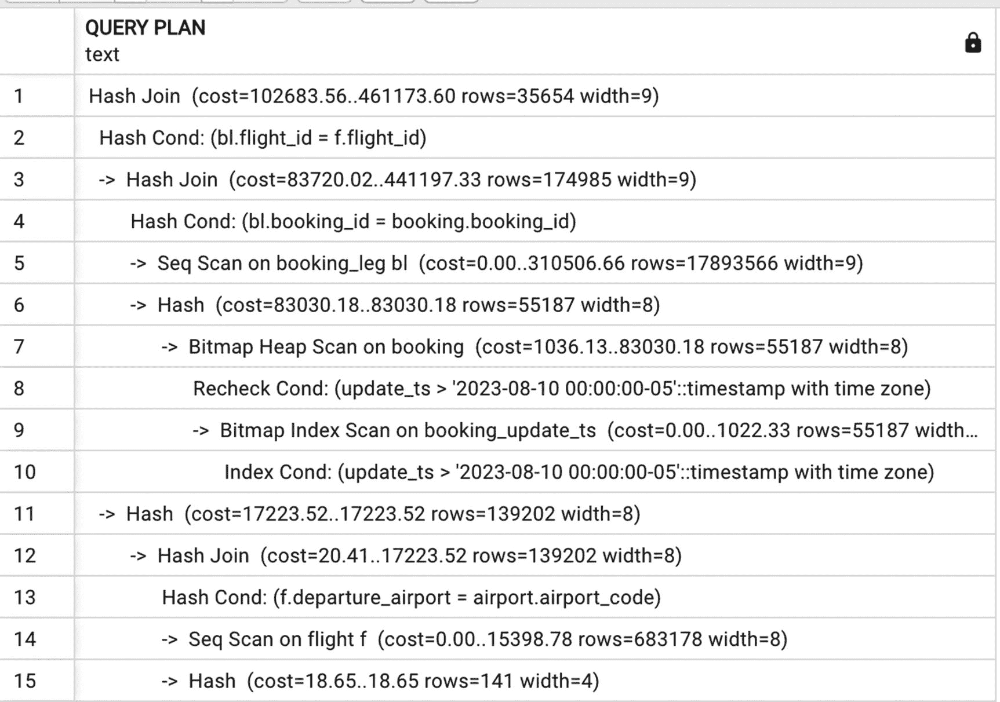
*图 6-5：具有不同选择性的两个半连接的执行计划*

在这种情况下，对 `booking` 表的索引访问是否确实是最佳选择？我们可以通过阻止索引访问来进行比较，方法是对 `update_ts` 列应用列转换，按以下方式重写过滤器：`coalesce(update_ts, '2023-08-11')> '2023-08-10'`。

如图 6-6 所示，这强制进行了顺序扫描。事实上，在较大时间间隔上，阻止索引并强制顺序扫描比索引访问执行得更好。随着进一步减小时间间隔，索引访问开始具有优势。'2023-08-07' 似乎是一个转折点；对于从 '2023-08-08' 开始的所有日期，索引访问将工作得更好。

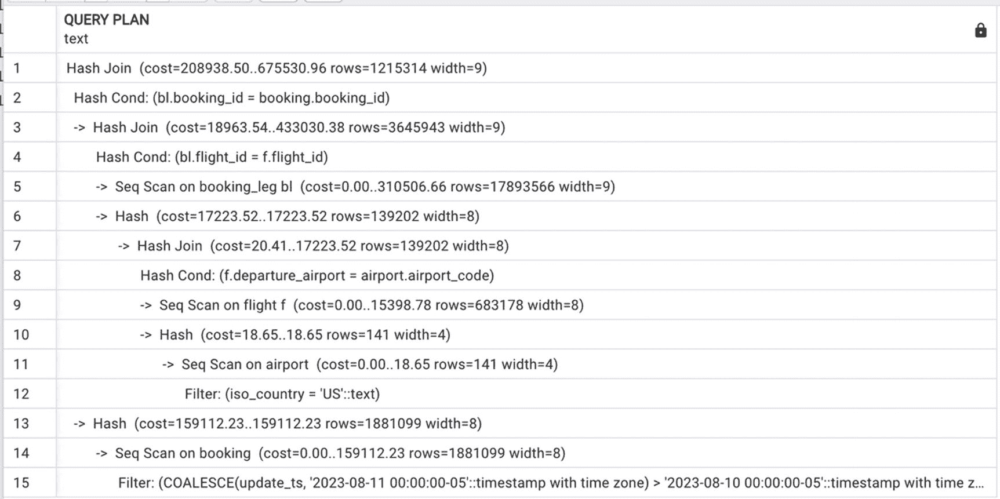
*图 6-6：强制全表扫描*


### 什么是反连接？

顾名思义，`反连接`是`半连接`的反面。形式化定义如下：

两个表 `R` 和 `S` 之间的反连接，返回来自表 `R` 的行，这些行在连接列上没有来自表 `S` 的匹配值。

与半连接的情况类似，并没有专门的 `反连接` 操作符。相反，带有反连接的查询可以用两种不同的方式编写，如清单 6-7 和 6-8 所示。这些查询返回没有预订的航班。

```sql
SELECT * FROM flight WHERE flight_id NOT IN
(SELECT flight_id FROM booking_leg)
清单 6-8
使用 NOT IN 定义反连接
```

```sql
SELECT * FROM flight f WHERE NOT EXISTS
(SELECT flight_id FROM booking_leg WHERE flight_id=f.flight_id)
清单 6-7
使用 NOT EXISTS 关键字定义反连接
```

与半连接一样，尽管编写反连接查询的两种方式在语义上是等价的，但在 `PostgreSQL` 中，只有 `NOT EXISTS` 版本能在执行计划中保证使用反连接。图 6-7 和 6-8 分别展示了清单 6-7 和 6-8 的执行计划。在这种特定情况下，两个查询的执行时间大致相同，带有反连接的计划只快一点点。对于哪种反连接语法更好，没有通用的指导方针。开发者应尝试两种方法，看看哪种在其用例中表现更佳。

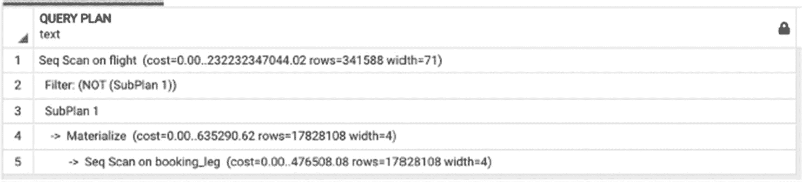

一个 5 行执行计划的截图，不含反连接。包括在 `flight f` 上的顺序扫描、过滤、子计划 1、物化，以及在 booking 上的顺序扫描。

图 6-8

不含反连接的执行计划

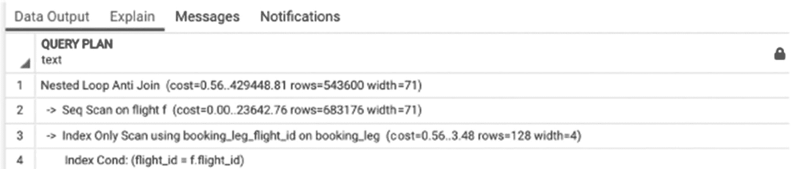

一个 4 行执行计划的截图，包含反连接。包括嵌套循环反连接、在 `flight f` 上的顺序扫描、仅索引扫描和索引条件。

图 6-7

包含反连接的执行计划

### 使用 JOIN 操作符的半连接和反连接

此时，细心的读者可能会想，为什么我们不能使用显式连接并精确指定我们需要的内容？为什么使用 `EXISTS` 和 `IN` 操作符？答案是这是可行的，并且在某些情况下，这可能确实比使用半连接是更好的解决方案。但这需要小心构建一个逻辑上等价的查询。

清单 6-3 和 6-4 中的查询在语义上是等价的，但清单 6-9 不是。回顾一下，清单 6-3 和 6-4 返回至少有一个预订的航班的信息。

```sql
SELECT f.*
FROM flight f
JOIN booking_leg bl USING (flight_id)
清单 6-9
返回重复项的连接
```

相比之下，清单 6-9 将为每个航班返回与其对应 `flight_id` 的预订数量一样多的行。为了像原始查询那样，每个航班只返回一条记录，需要将其重写为清单 6-10 所示。

```sql
SELECT *
FROM flight f
JOIN (select distinct flight_id FROM booking_leg) bl USING (flight_id)
清单 6-10
使用连接为每个航班返回一行的查询
```

此查询的执行计划如图 6-9 所示，它不包含半连接。

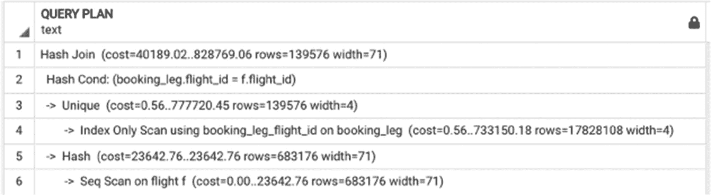

一个 6 行查询执行计划的截图。包括哈希连接、哈希条件、在 booking 上的仅索引扫描，以及在 `flight f` 上的顺序扫描。

图 6-9

清单 6-10 中查询的执行计划

从这个执行计划中，无法明显看出此查询是否会比带半连接的查询更快或更慢。在实践中，它的运行速度比清单 6-3 中的查询快一倍以上。

如果你只需要有预订的航班的 ID，运行清单 6-11 中的查询可能就足够了。

```sql
SELECT flight_id
FROM flight f
JOIN (select distinct flight_id FROM booking_leg) bl USING (flight_id)
清单 6-11
使用连接只为每个航班返回一行 flight_id 的查询
```

此查询的执行计划如图 6-10 所示，与图 6-9 中的有很大不同，执行速度更快。

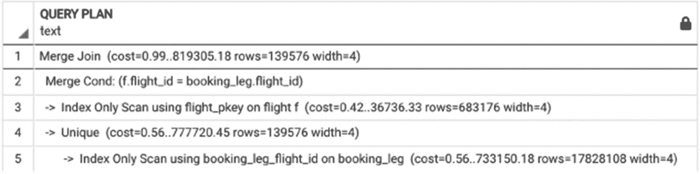

一个 5 行执行计划的截图，包含合并连接。包括合并连接、合并条件、仅索引扫描和唯一操作。

图 6-10

包含合并连接的执行计划

那么反连接呢？反连接不会产生重复项，这意味着可以使用 `OUTER JOIN` 并随后过滤 `NULL` 值。因此，清单 6-7 中的查询等价于清单 6-12 中的查询。

```sql
SELECT f.flight_id
FROM flight f
LEFT OUTER JOIN booking_leg bl USING (flight_id)
WHERE bl.flight_id IS NULL
清单 6-12
过滤 NULL 值的外连接
```

此查询的执行计划包含一个反连接——参见图 6-11。

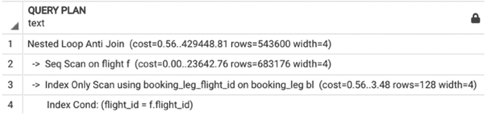

一个 4 行查询执行计划的截图。包括嵌套循环反连接、在 `flight f` 上的顺序扫描、仅索引扫描和索引条件。

图 6-11

清单 6-12 中查询的执行计划

优化器能识别这种结构并将其重写为反连接。这种优化器行为是稳定的，可以依赖。


### 何时需要指定连接顺序？

到目前为止，优化器一直在没有任何 SQL 开发人员干预的情况下选择最佳的连接顺序，但情况并非总是如此。

长查询在 OLAP 系统中更为常见。换句话说，长查询很可能是一个分析报告，它很可能需要连接多个表。任何与 OLAP 系统打过交道的人都可以证明，这个数量可能非常庞大。当查询涉及的表数量过多时，优化器将不再尝试寻找最佳的连接顺序。尽管大多数系统参数超出了本书的讨论范围，但有一个值得一提：`join_collapse_limit`。

此参数限制了仍由基于成本的优化器处理的连接中的表数量。该参数的默认值为 8。这意味着，如果连接中的表数量为 8 个或更少，优化器将执行候选计划选择、比较计划并选择最佳计划。但如果表的数量为 9 个或更多，它将简单地按照`SELECT`语句中列出的表顺序来执行连接。

为什么不将此参数设置为可能的最大值呢？该参数没有官方上限，因此它可以是最大整数值，即 2147483647。然而，你将此参数设置得越高，选择最佳计划所花费的时间就越多。对于一个连接`n`个表的查询，需要考虑的可能计划数量是`n!`。因此，当`n`为 8 时，最多可以比较 40,000 个计划。如果`n`增加到 10，需要考虑的计划数量将增加到三百万，并且数量会随之可预测地增长——当此参数设置为 20 时，计划总数已经过大而无法存入整数。我们中的一位曾亲眼目睹一位数据科学家在本地将此参数改为 30，以处理一个涉及 30 个连接的查询。结果令人痛苦不堪——不仅执行停滞不前，甚至连`EXPLAIN`命令也无法返回结果。

这很容易通过实验验证；该参数可以在会话级别本地设置，因此运行命令
```
SET join_collapse_limit = 10
```
然后检查`EXPLAIN`命令的运行时间。

此外，请回想一下，中间结果没有可用的表统计信息，这可能导致优化器选择次优的连接顺序。如果 SQL 开发人员知道更好的连接顺序，可以通过将`join_collapse_limit`设置为 1 来强制执行所需的连接顺序。在这种情况下，优化器将生成一个计划，其中连接将按照它们在`SELECT`语句中出现的顺序执行。

通过将`join_collapse_limit`参数设置为 1 来强制特定的连接顺序。

例如，如果执行清单 6-13 中的命令（即对清单 6-6 中的查询进行`EXPLAIN`分析），执行计划（图 6-12）显示连接完全按照列出的顺序执行，并且`update_ts`上的索引未被使用（这在本例中对性能有负面影响）。

```
SET join_collapse_limit=1;
EXPLAIN
SELECT
departure_airport,
booking_id,
is_returning
FROM booking_leg bl
JOIN flight f USING (flight_id)
WHERE departure_airport IN (
SELECT
airport_code
FROM airport
WHERE iso_country='US')
AND bl.booking_id IN (
SELECT
booking_id
FROM booking
WHERE update_ts>'2023-08-08')
Listing 6-13
部分禁用基于成本的优化
```

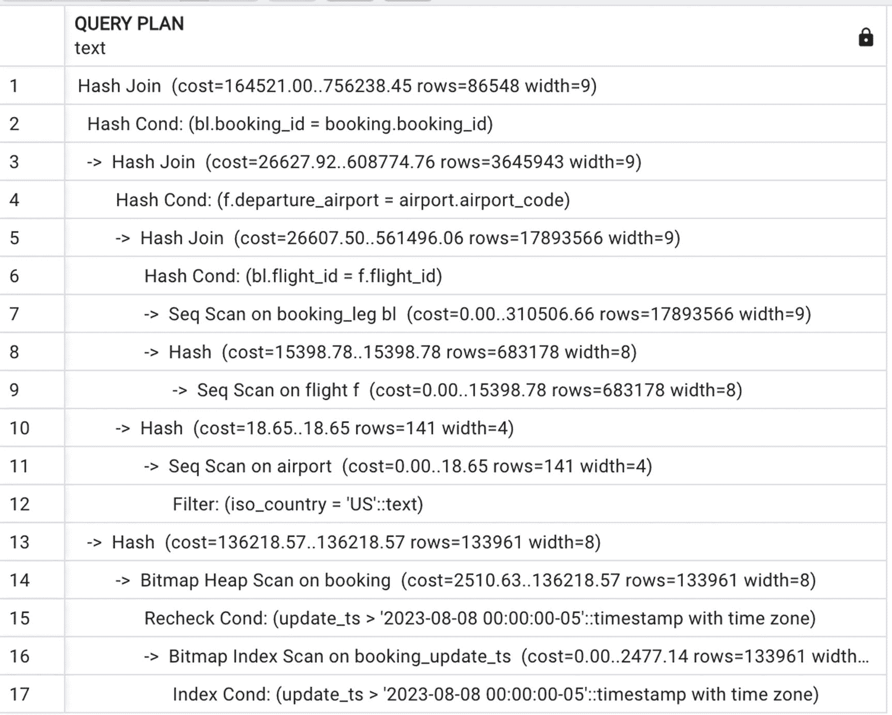

一个 15 行执行计划的截图，已禁用基于成本的优化。计划包括哈希连接、哈希条件、对 booking 的顺序扫描、对 flight f 的顺序扫描、位图索引扫描和索引条件。

图 6-12
禁用基于成本优化的执行计划

另一种强制特定连接顺序的方法是使用公用表表达式（CTE），这将在第 7 章讨论。

## 分组：先过滤，后分组

在第 5 章中，我们提到对于短查询，分组操作并不耗时。对于长查询，我们处理分组的方式可能对性能产生非常显著的影响。关于在何时进行分组的次优决策，常常是导致查询整体变慢的主要原因。

清单 6-14 展示了一个查询，它计算所有有预订的航班中，每个航班的平均票价和乘客总数。

```
SELECT
bl.flight_id,
departure_airport,
(avg(price))::numeric (7,2) AS avg_price,
count(DISTINCT passenger_id) AS num_passengers
FROM booking b
JOIN booking_leg bl USING (booking_id)
JOIN flight f USING (flight_id)
JOIN passenger p USING (booking_id)
GROUP BY 1,2
Listing 6-14
每个航班的平均票价和乘客总数
```

为了计算单个航班的这些数值，一个常见的反模式是清单 6-15 中的查询。

```
SELECT *
FROM
(SELECT
bl.flight_id,
departure_airport,
(avg(price))::numeric (7,2) AS avg_price,
count(DISTINCT passenger_id) AS num_passengers
FROM booking b
JOIN booking_leg bl USING (booking_id)
JOIN flight f USING (flight_id)
JOIN passenger p USING (booking_id)
GROUP BY 1,2) a
WHERE flight_id=222183
Listing 6-15
特定航班的平均票价和乘客总数
```

在这个查询中，我们从一个内联`SELECT`语句中为某个航班选取数据。早期版本的 PostgreSQL 无法高效地处理此类结构。数据库引擎会首先执行带有分组的内部`SELECT`，然后才选择对应于特定航班的行。为了确保查询高效执行，需要像清单 6-16 所示那样编写查询。

```
SELECT
bl.flight_id,
departure_airport,
(avg(price))::numeric (7,2) AS avg_price,
count(DISTINCT passenger_id) AS num_passengers
FROM booking b
JOIN booking_leg bl USING (booking_id)
JOIN flight f USING (flight_id)
JOIN passenger p USING (booking_id)
WHERE flight_id=222183
GROUP BY 1,2
Listing 6-16
将条件下推到 GROUP BY 内部
```

但现在，由于优化器的持续改进，两个查询都将使用图 6-13 中的执行计划执行。该计划使用了索引访问，此查询的执行时间约为两秒。

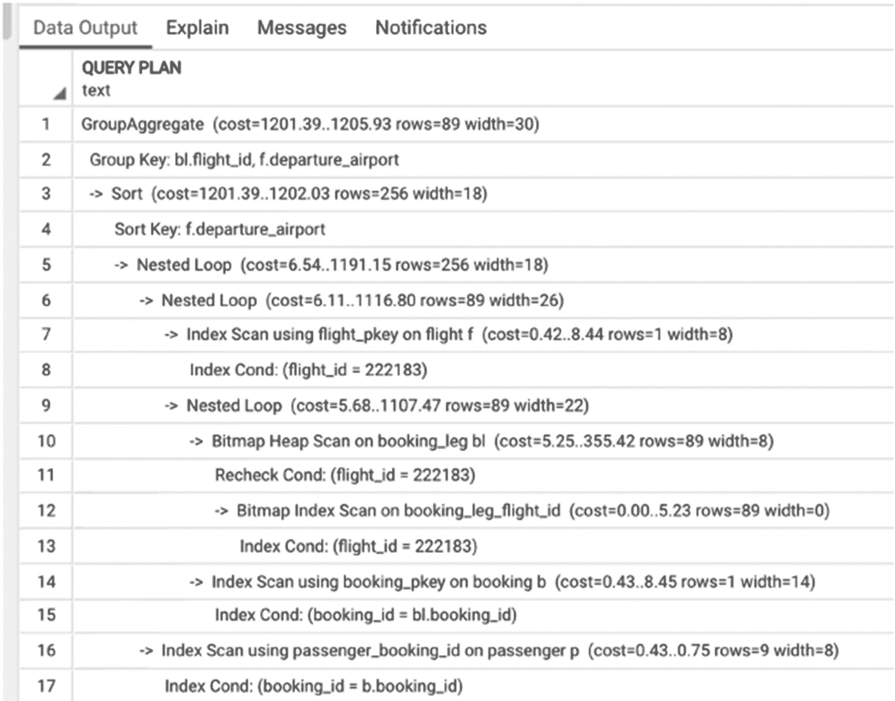

一个针对单个航班的 17 行执行计划截图。包括分组聚合、分组键、嵌套循环、索引扫描、位图堆扫描和索引条件。

图 6-13
针对单个航班的执行计划

对于`GROUP BY`子句中使用的所有列，应将过滤条件下推到分组操作内部。

对于 PostgreSQL 12 及更高版本，优化器会负责这种重写，但在旧版本中可能仍需手动处理。

让我们看另一个例子。清单 6-17 计算从 ORD 出发的所有航班的相同数值（平均价格和客户数量）。

```
SELECT
flight_id,
avg_price,
num_passengers
FROM (SELECT
bl.flight_id,
departure_airport,
(avg(price))::numeric (7,2) AS avg_price,
count(DISTINCT passenger_id) AS num_passengers
FROM booking b
JOIN booking_leg bl USING (booking_id)
JOIN flight f USING (flight_id)
JOIN passenger p USING (booking_id)
GROUP BY 1,2 )a  WHERE departure_airport='ORD'
Listing 6-17
为多个航班进行选择
```

此查询的执行计划如图 6-14 所示。该查询大约需要 1.5 分钟执行完成。这是一个大型查询，大部分连接使用哈希连接算法执行。关键点在于，对`departure_airport`的条件是在分组之前应用的。

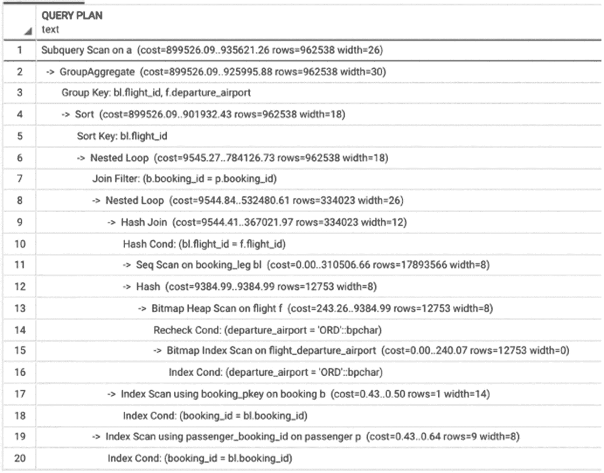


一张展示 20 行清单查询执行计划的截图。计划中包括分组聚合、分组键、嵌套循环、连接过滤条件、位图堆扫描和索引条件。

图 6-14
代码清单 6-17 的执行计划

然而，更复杂的过滤条件无法被推入分组内部。代码清单 6-18 计算了相同的统计数据，但 `flight_id` 列表不是直接传递，而是从 `booking_leg` 表中选取的。

```sql
SELECT
flight_id,
avg_price,
num_passengers
FROM (SELECT
bl.flight_id,
departure_airport,
(avg(price))::numeric (7,2) AS avg_price,
count(DISTINCT passenger_id) AS num_passengers
FROM booking b
JOIN booking_leg bl USING (booking_id)
JOIN flight f USING (flight_id)
JOIN passenger p USING (booking_id)
GROUP BY 1,2 )a
WHERE flight_id in
(SELECT
flight_id
FROM flight
WHERE scheduled_departure BETWEEN '07-03-2023' AND '07-05-2023');
```
代码清单 6-18
无法推入分组内部的条件

执行计划（图 6-15）显示，先进行了分组，然后将过滤条件应用到分组的结果上。这意味着，首先对系统中所有航班进行计算，然后才选择子集。该查询的总执行时间为十分钟。

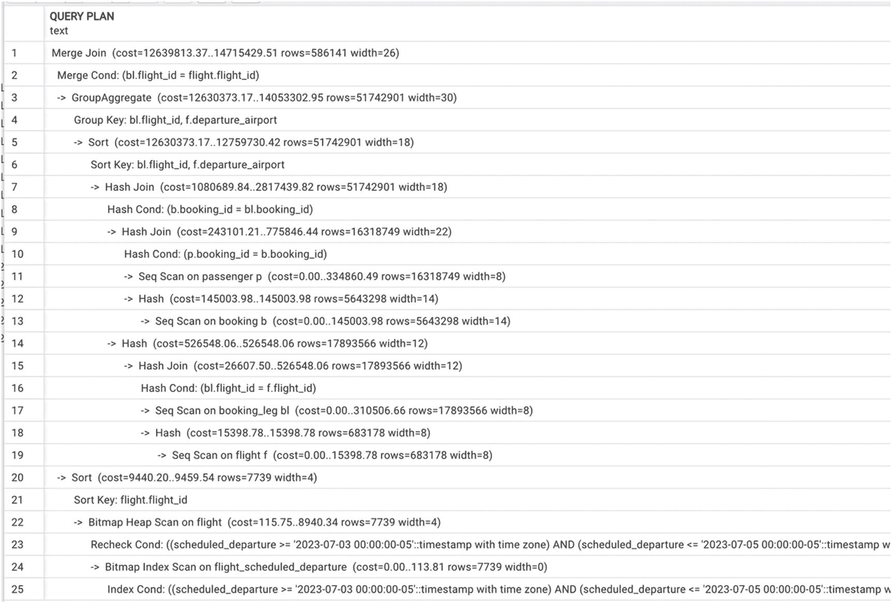

一张展示单航班 25 行执行计划的截图。计划中包括合并连接、合并条件、分组聚合、分组键、哈希连接、哈希条件、位图堆扫描和索引条件。

图 6-15
代码清单 6-18 的执行计划

代码清单 6-18 中的查询是我们称之为“劣化”的一个例子——即使用了保证会减慢查询执行速度的实践。很容易理解为什么这个查询会这样写。首先，数据库开发者弄清楚了如何执行某些计算或如何选择特定值，然后他们对结果应用过滤器。这样，他们就将优化器限制在某种特定的操作顺序上，而在这种情况下，这种顺序并非最优。

相反，过滤可以在内部 `WHERE` 子句中完成。做出这一改动后，就不再需要内联 `SELECT`——参见代码清单 6-19。

```sql
SELECT bl.flight_id,
departure_airport,
(avg(price))::numeric (7,2) AS avg_price,
count(DISTINCT passenger_id) AS num_passengers
FROM booking b
JOIN booking_leg bl USING (booking_id)
JOIN flight f USING (flight_id)
JOIN passenger p USING (booking_id)
WHERE scheduled_departure
BETWEEN '07-03-2023' AND '07-05-2023'
GROUP BY 1,2
```
代码清单 6-19
条件被推入分组内部

执行时间约为一分钟，执行计划如图 6-16 所示。这可以看作是前一个示例所阐述技术的一种泛化。

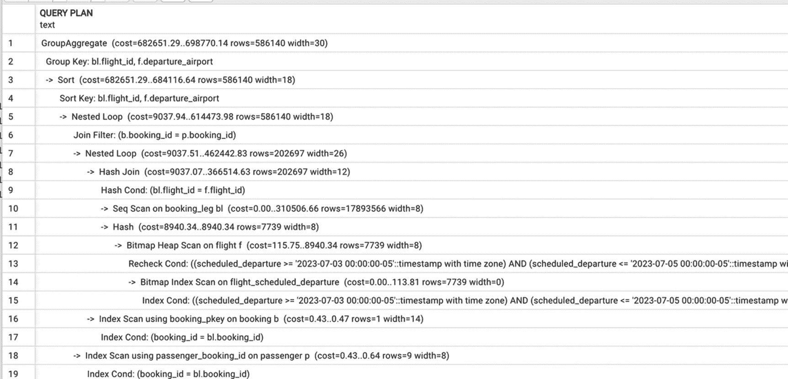

一张展示过滤条件被推入分组内部后的 19 行执行计划截图。计划中包括分组聚合、分组键、哈希连接、哈希条件、位图堆扫描、重新检查条件和索引条件。

图 6-16
过滤条件被推入分组内部的执行计划

在分组之前不需要为聚合过滤行。

即使这个查询的最优执行也不是瞬间完成的，但这是我们能实现的最佳结果。现在是回顾优化目标应切合实际的好时机。对大数据量进行的长查询，即使最优执行，也无法在几分之一秒内完成。关键是要使用尽可能少的行，但不能更少。

## 分组：先分组，后选择

在某些情况下，操作顺序应该相反：`GROUP BY` 应尽早执行，然后再执行其他操作。你可能已经猜到，当分组会减小中间数据集的大小时，这种操作顺序是可取的。

代码清单 6-20 中的查询计算了按月从每个城市出发的乘客数量。在这种情况下，无法减少所需行数，因为计算中使用了所有航班。

```sql
SELECT
city,
date_trunc('month', scheduled_departure) AS month,
count(*)  passengers
FROM airport  a
JOIN flight f ON airport_code = departure_airport
JOIN booking_leg l ON f.flight_id =l.flight_id
JOIN boarding_pass b ON b.booking_leg_id = l.booking_leg_id
GROUP BY 1,2
ORDER BY 3 DESC
```
代码清单 6-20
计算每个城市每月的乘客数量

该查询的执行时间为 25 秒，执行计划如图 6-17 所示。

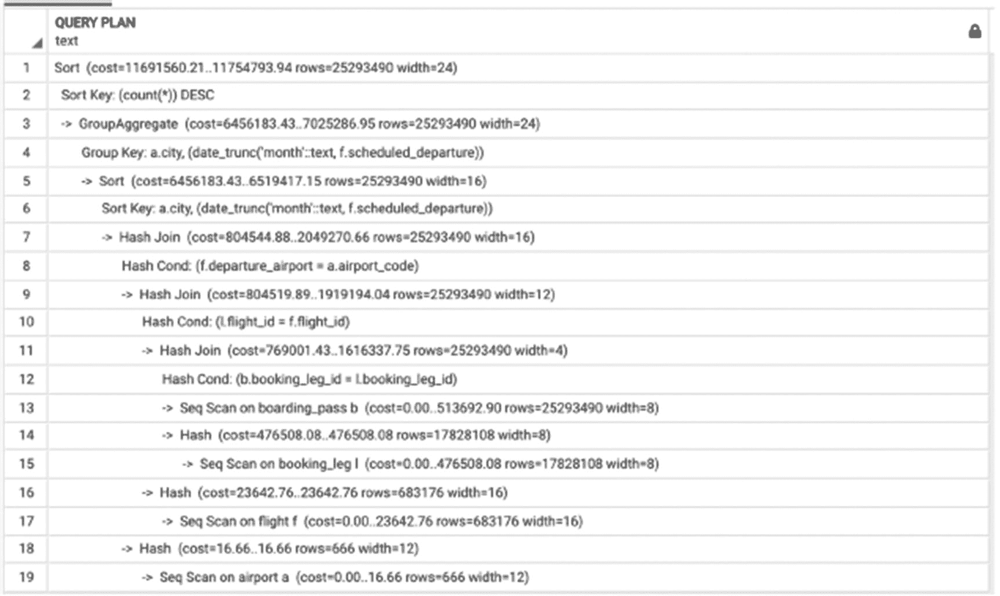

一张展示最后进行分组的 19 行执行计划截图。计划中包括排序、排序键、分组聚合、分组键、哈希连接、哈希条件以及对 flight f 的顺序扫描。

图 6-17
最后进行分组的执行计划

如代码清单 6-21 所示，通过一个巧妙的重写，该查询的执行得到了显著改善。

```sql
SELECT
city,
date_trunc('month', scheduled_departure),
sum(passengers)  passengers
FROM airport  a
JOIN flight f ON airport_code = departure_airport
JOIN (
SELECT flight_id, count(*) passengers
FROM booking_leg l
JOIN boarding_pass b USING (booking_leg_id)
GROUP BY flight_id
) cnt
USING (flight_id)
GROUP BY 1,2
ORDER BY 3 DESC
```
代码清单 6-21
强制先进行分组的查询重写

这里发生了什么？首先，在内联视图 `cnt` 中对每个航班的出发乘客数量进行求和。之后，将结果与 `flight` 表连接以检索机场代码，再与 `airport` 表连接以找出每个机场所在的城市。然后，按城市对航班总数进行求和。这样，执行时间缩短为 15 秒。执行计划如图 6-18 所示。

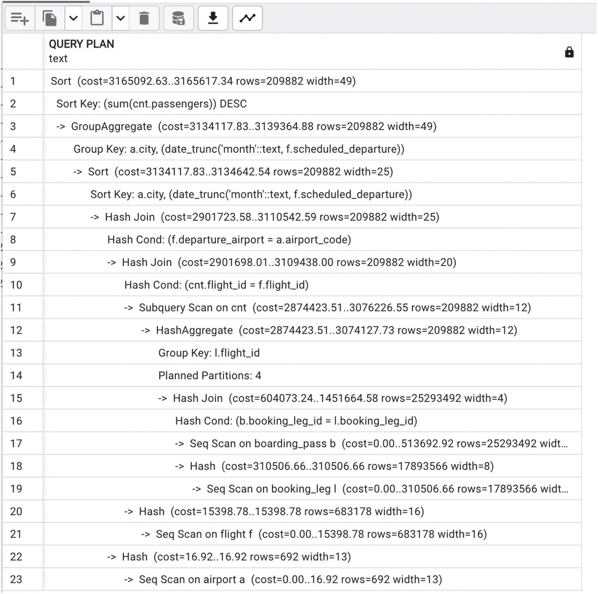

一张展示强制先进行分组的 23 行执行计划截图。计划中包括排序、排序键、分组聚合、分组键、哈希连接、哈希条件、计划分区以及对 flight f 的顺序扫描。

图 6-18
强制先进行分组的执行计划


## 使用集合操作

在 SQL 查询中，我们很少使用集合论操作（如 `UNION`, `EXCEPT` 等）。然而，对于大型查询，这些操作可能会促使优化器选择更高效的算法。

使用集合操作可以（有时）促使采用替代的执行计划并提高代码的可读性。

通常，我们可以：

*   使用 `EXCEPT` 代替 `NOT EXISTS` 和 `NOT IN`。
*   使用 `INTERSECT` 代替 `EXISTS` 和 `IN`。
*   使用 `UNION` 代替使用 `OR` 的复杂选择条件。

有时，性能会有显著提升；有时，执行时间变化不大，但代码变得更简洁、更易于维护。代码清单 6-22 展示了对代码清单 6-8 中查询的重写，用于返回没有预订的航班。

```
SELECT
flight_id
FROM flight f
EXCEPT
SELECT
flight_id
FROM booking_leg
代码清单 6-22
使用 EXCEPT 代替 NOT IN
```

执行时间是一分三秒，这比反连接快了近一倍。

带有 `EXCEPT` 操作的执行计划如图 6-19 所示。

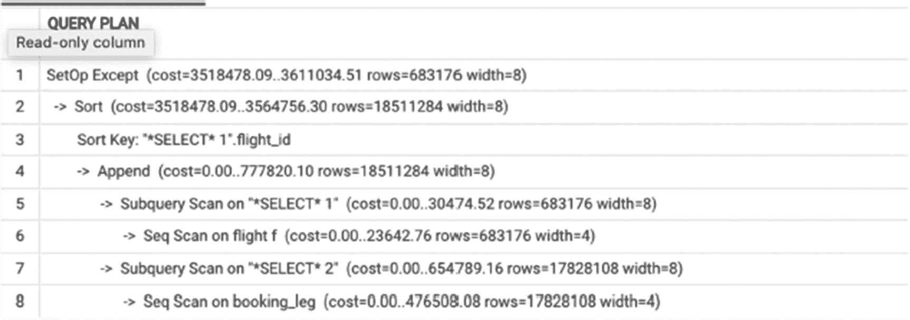

使用 EXCEPT 的 8 行执行计划截图。它包含集合操作符 EXCEPT、排序、排序键、追加、子查询扫描以及对 flight f 的顺序扫描。

图 6-19
带有 `EXCEPT` 的执行计划

代码清单 6-23 展示了使用集合操作对代码清单 6-4 中查询的重写，用于显示所有有预订的航班。

```
SELECT
flight_id
FROM flight f
INTERSECT
SELECT
flight_id
FROM booking_leg
代码清单 6-23
使用 INTERSECT 代替 IN
```

此查询的执行时间是 49 秒。这比使用 `IN` 关键字的查询版本要短，且大致相当于使用仅索引扫描的查询的运行时间（参见代码清单 6-10）。执行计划如图 6-20 所示。

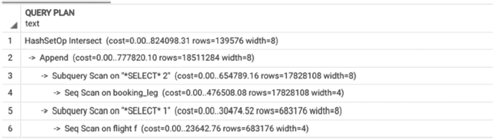

使用 INTERSECT 的 6 行执行计划截图。它包含哈希集合操作符 INTERSECT、追加、子查询扫描以及对 flight f 的顺序扫描。

图 6-20
带有 `INTERSECT` 的执行计划

我们很少需要将带有 `OR` 的复杂选择条件重写为集合论的 `UNION ALL`，因为大多数情况下，PostgreSQL 优化器在分析此类条件并利用所有合适的索引方面做得相当不错。然而，有时这种重写方式会使代码更易于维护，尤其是当查询包含大量通过 `OR` 连接的不同选择条件时。代码清单 6-24 是一个查询，它使用两组不同的选择条件计算从 `FRA` 出发的延误航班上的乘客数量。第一组是延误超过一小时且登机牌在计划起飞时间后 30 分钟以上有变更的航班上的乘客。第二组是延误超过半小时但不足一小时的航班上的乘客。

```
SELECT
CASE
WHEN actual_departure>scheduled_departure + interval '1 hour'
THEN 'Late group 1'
ELSE 'Late group 2'
END AS grouping,
flight_id,
count(*) AS num_passengers
FROM boarding_pass bp
JOIN booking_leg bl USING (booking_leg_id)
JOIN booking b USING (booking_id)
JOIN flight f USING (flight_id)
WHERE departure_airport='FRA'
AND actual_departure>'2023-07-01'
AND
(
(actual_departure>scheduled_departure + interval '30 minute'
AND actual_departure scheduled_departure + interval '1 hour'
AND bp.update_ts >scheduled_departure + interval '30 minute'
)
)
GROUP BY 1,2
代码清单 6-24
带有复杂 OR 选择条件的查询
```

使用 `UNION ALL` 重写此查询的代码如清单 6-25 所示。执行时间差异不显著（约三秒），但代码更易于维护。

```
SELECT
'Late group 1' AS grouping,
flight_id,
count(*) AS num_passengers
FROM boarding_pass bp
JOIN booking_leg bl USING (booking_leg_id)
JOIN booking b USING (booking_id)
JOIN flight f USING (flight_id)
WHERE departure_airport='FRA'
AND actual_departure>scheduled_departure + interval '1 hour'
AND bp.update_ts  > scheduled_departure + interval '30 minutes'
AND actual_departure>'2023-07-01'
GROUP BY 1,2
UNION ALL
SELECT
'Late group 2' AS grouping,
flight_id,
count(*) AS num_passengers
FROM boarding_pass bp
JOIN booking_leg bl USING(booking_leg_id)
JOIN booking b USING (booking_id)
JOIN flight f USING (flight_id)
WHERE departure_airport='FRA'
AND  actual_departure>scheduled_departure + interval '30 minute'
AND  actual_departure '2023-07-01'
GROUP BY 1,2
代码清单 6-25
使用 UNION ALL 重写带有复杂 OR 条件的查询
```

值得注意的是，对于大型查询，始终需要考虑可用 RAM 的大小。对于哈希连接和集合论操作，如果涉及的数据集无法全部装入主内存，执行速度会显著下降。

## 避免多次扫描

长查询中另一个导致速度缓慢的原因是存在多次表扫描。这个常见问题是设计不完善的直接结果。设计可以修复，至少在理论上是可以的。但由于我们经常遇到无法控制设计的情况，因此我们将建议一些方法，即使在不完善的模式下也能编写高性能的查询。

我们在`postgres_air`模式中建模的情况在现实世界中并不少见。系统已经上线运行，突然间，我们需要为数据库中已有的对象存储一些额外的信息。

在过去的 30 年里，此类情况下最简单的解决方案是使用实体-属性-值（EAV）表，它可以存储任意属性——现在需要的以及最终可能需要的任何属性。在`postgres_air`模式中，这种模式在`custom_field`表中实现。对于每位乘客，护照号码、护照有效期和护照签发国被存储下来。属性相应地被命名为`'passport_num'`、`'passport_exp_date'`和`'passport_country'`。

此表未包含在 postgres_air 发行版中。要在本地运行该示例，请从 postgres_air GitHub 存储库执行以下脚本：

[`github.com/hettie-d/postgres_air/blob/main/tables/custom_field.sql`](https://github.com/hettie-d/postgres_air/blob/main/tables/custom_field.sql)

现在，想象一个需要生成乘客姓名及其护照信息报告的请求。代码清单 6-26 是一个典型的推荐解决方案：`custom_field`表被扫描了三次！为了防止溢出到磁盘，乘客被限制在前 500 万，这使我们能够展示真实的执行时间比率。图 6-21 中的执行计划确认了三次表扫描，该查询的执行时间为 5 分钟。

```sql
SELECT
first_name,
last_name,
pn.custom_field_value AS passport_num,
pe.custom_field_value AS passport_exp_date,
pc.custom_field_value AS passport_country
FROM passenger p
JOIN custom_field pn ON pn.passenger_id=p.passenger_id
AND pn.custom_field_name='passport_num'
JOIN custom_field pe ON pe.passenger_id=p.passenger_id
AND pe.custom_field_name='passport_exp_date'
JOIN custom_field pc ON pc.passenger_id=p.passenger_id
AND pc.custom_field_name='passport_country'
WHERE p.passenger_id<5000000
```
**代码清单 6-26**
对一个大表的多次扫描

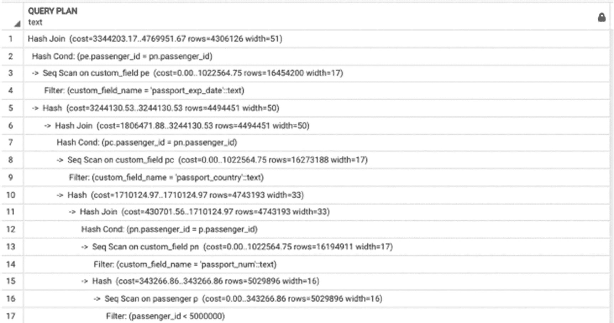

包含多次扫描的 17 行执行计划的截图。它包括哈希连接、哈希条件、对自定义字段的序列扫描、过滤以及对乘客表`p`的序列扫描。

**图 6-21**
包含多次扫描的执行计划

将这个表扫描三次，就像是从一个黑箱中将苹果、橙子和柠檬分类到三个桶中。具体做法是先挑出所有苹果，将所有橙子和柠檬放回箱子，然后挑出橙子，最后再回去挑柠檬。一个更有效的方法是先把三个桶摆在面前，当你第一次从黑箱中取出水果时，就将其放入正确的桶中。

当从实体-属性-值表中检索多个属性时，只连接该表一次，并在`SELECT`列表的聚合函数`MAX()`中使用`FILTER`子句，以在每一列中返回适当的值。

为了在`custom_field`表上实现这种效果，可以如代码清单 6-27 所示重写查询。

```sql
SELECT
last_name,
first_name,
coalesce(max (custom_field_value )
FILTER (WHERE custom_field_name ='passport_num' ),'')
AS passport_num,
coalesce(max (custom_field_value )
FILTER (WHERE custom_field_name ='passport_exp_date' ),'')
AS passport_exp_date,
coalesce(max (custom_field_value )
FILTER (WHERE custom_field_name ='passport_country' ),'')
AS passport_country
FROM passenger p
JOIN custom_field cf  USING (passenger_id)
WHERE cf.passenger_id<5000000
AND p.passenger_id<5000000
GROUP by 1,2;
```
**代码清单 6-27**
一次表扫描以检索多个属性

代码清单 6-27 的执行计划如图 6-22 所示。

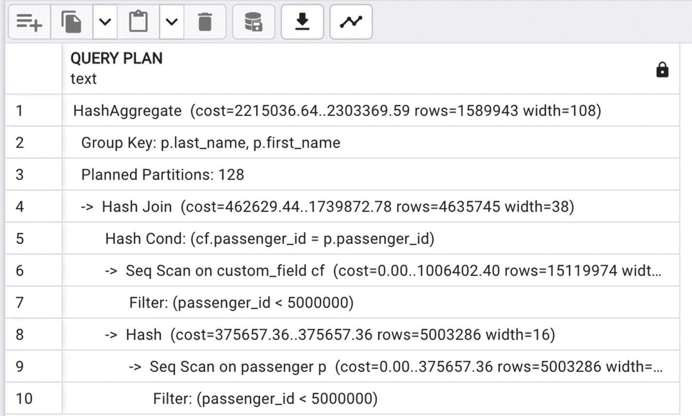

包含一次表扫描的 10 行执行计划的截图。它包括哈希聚合、分组键、计划分区、哈希条件、过滤以及对乘客表`p`的序列扫描。

**图 6-22**
一次表扫描

这看起来好多了——只有一次表扫描——但当你尝试执行它时，它的运行时间会显著延长。仔细观察就会发现原因：可能有很多乘客拥有相同的姓氏和名字，因此不仅耗时更长，而且结果也是不正确的。让我们再次修改查询——见代码清单 6-28。

```sql
SELECT
last_name,
first_name,
p.passenger_id,
coalesce(max (custom_field_value )
FILTER (WHERE custom_field_name ='passport_num' ),'')
AS passport_num,
coalesce(max (custom_field_value )
FILTER (WHERE custom_field_name ='passport_exp_date' ),'')
AS passport_exp_date,
coalesce(max (custom_field_value )
FILTER (WHERE custom_field_name ='passport_country' ),'')
AS passport_country
FROM passenger p
JOIN custom_field cf  USING (passenger_id)
WHERE cf.passenger_id<5000000
AND p.passenger_id<5000000
GROUP by 3,1,2;
```
**代码清单 6-28**
对代码清单 6-27 中查询的修正

图 6-23 中的执行计划看起来好多了——分组列现在是`passenger_id`。

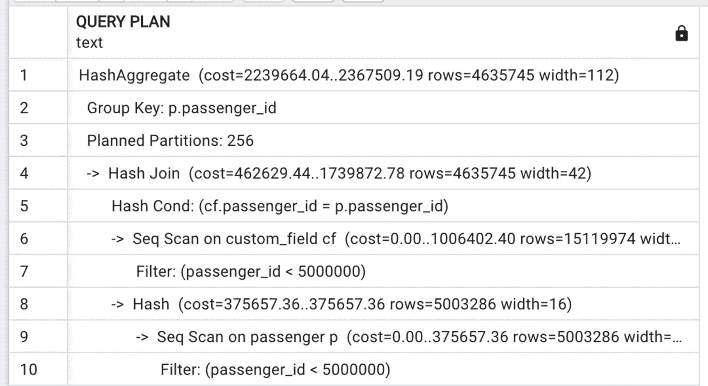

代码清单的 10 行执行计划的截图。它包括哈希聚合、分组键、计划分区、哈希条件、过滤以及对乘客表`p`的序列扫描。

**图 6-23**
代码清单 6-28 的执行计划

这里还有一个优化点；来自 EAV 表的属性经常需要与其他表连接，我们可以通过在执行其他连接之前，“折叠”并过滤此表到所需值，来减小中间结果集的大小。这是前面提到的先分组再连接这一通用技术的更具体案例。

**在连接其他表之前，将来自 EAV 表的值提取到子查询中。**

针对护照示例这样做，我们可以如代码清单 6-29 所示，再次修改查询。

```sql
SELECT
last_name,
first_name,
passport_num,
passport_exp_date,
passport_country
FROM  passenger p
JOIN (
SELECT
cf.passenger_id,
coalesce(max (custom_field_value )
FILTER (WHERE custom_field_name ='passport_num' ),'')
AS passport_num,
coalesce(max (custom_field_value )
FILTER (WHERE custom_field_name ='passport_exp_date' ),'')
AS passport_exp_date,
coalesce(max (custom_field_value )
FILTER (WHERE custom_field_name ='passport_country' ),'')
AS passport_country
FROM custom_field cf
WHERE cf.passenger_id<5000000
GROUP BY 1
) info  USING (passenger_id)
WHERE p.passenger_id<5000000
```
**代码清单 6-29**
将分组移至子查询

执行计划如图 6-24 所示。

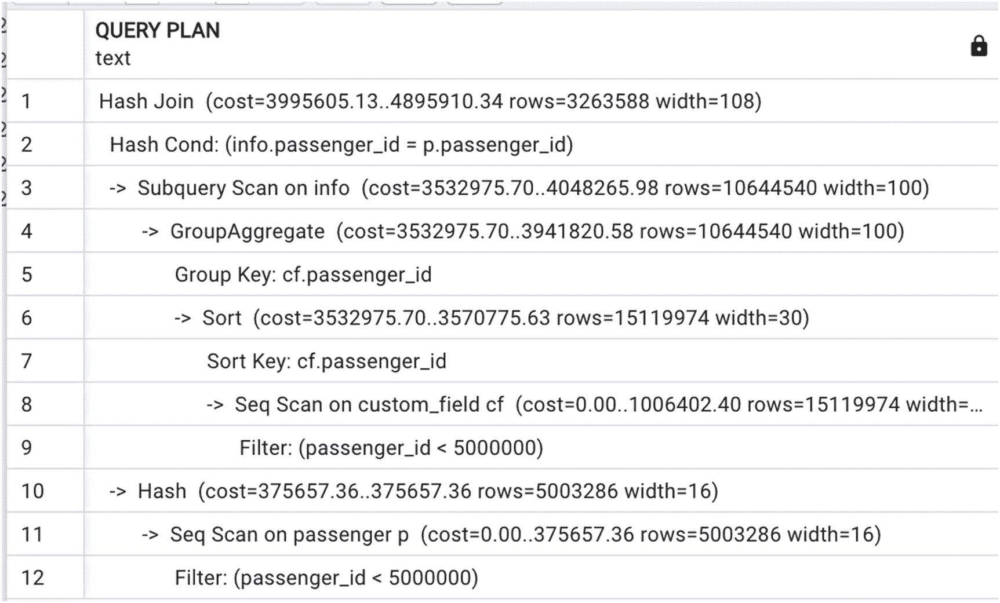

将分组移至子查询的 12 行执行计划的截图。它包括哈希连接、哈希条件、分组键、分组聚合、排序、排序键、过滤以及对乘客表`p`的序列扫描。

**图 6-24**
将分组移至子查询的执行计划


## 结论

本章正式定义了长查询，并探讨了其优化技术。

本章的首要重要原则是：索引并不一定能加快查询速度，实际上，它可能使长查询运行得更慢。一个常见的误解是，如果无法构建索引，就无法优化全表扫描。希望本章已明确证明，优化全表扫描存在多种可能性。

与短查询类似，长查询的优化也通过减少中间结果的大小并尽可能少地对行进行必要工作来实现。对于短查询，这是通过对最具限制性的条件应用索引来完成的。对于长查询，则通过注意连接顺序、应用半连接和反连接、在分组前过滤、在连接前分组以及应用集合操作来实现。

