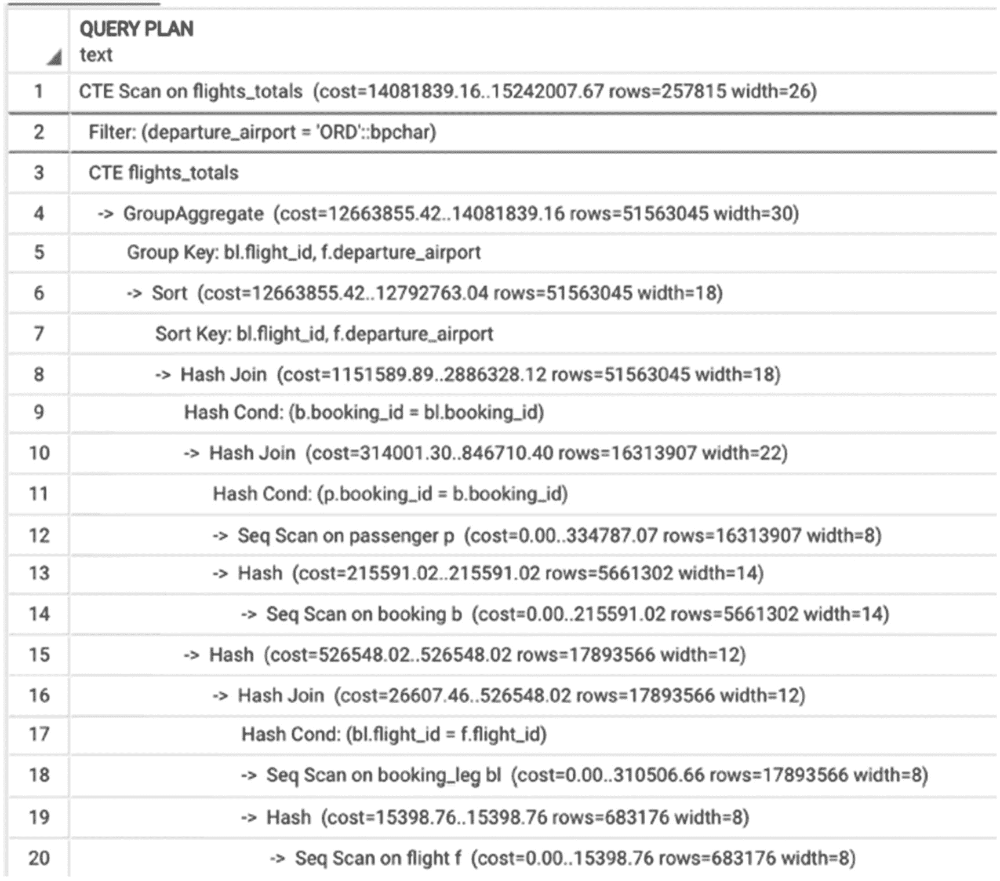
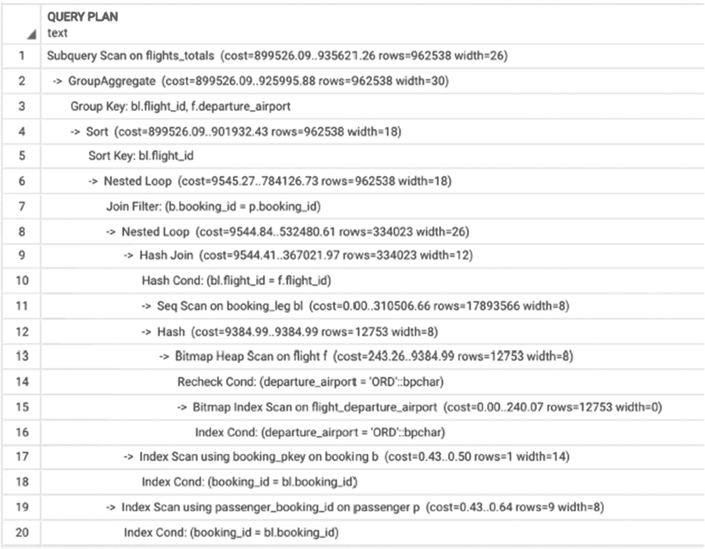
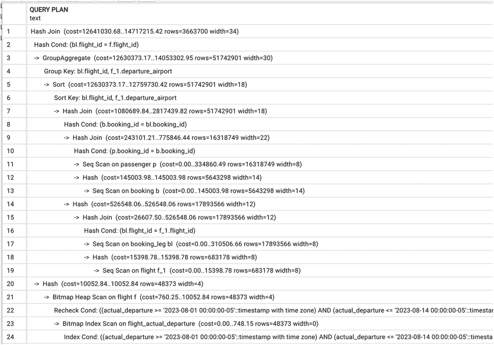
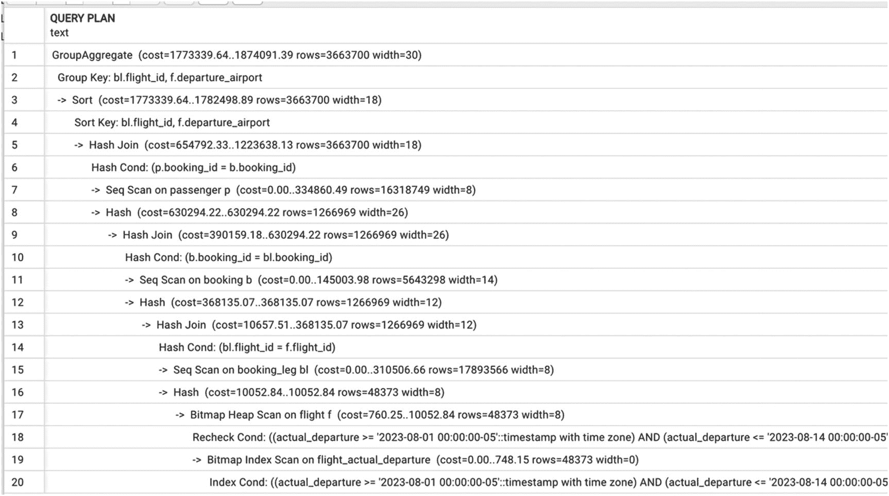
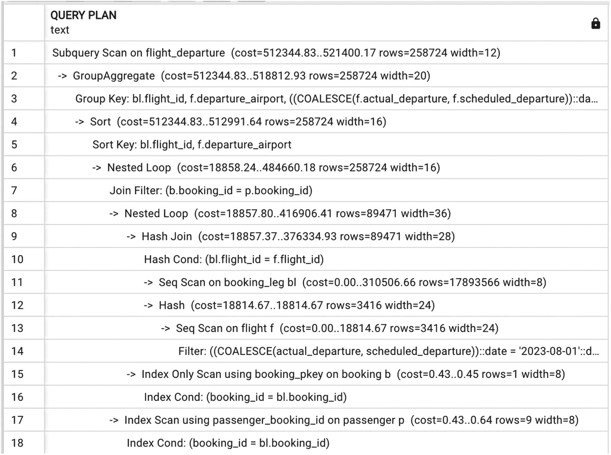
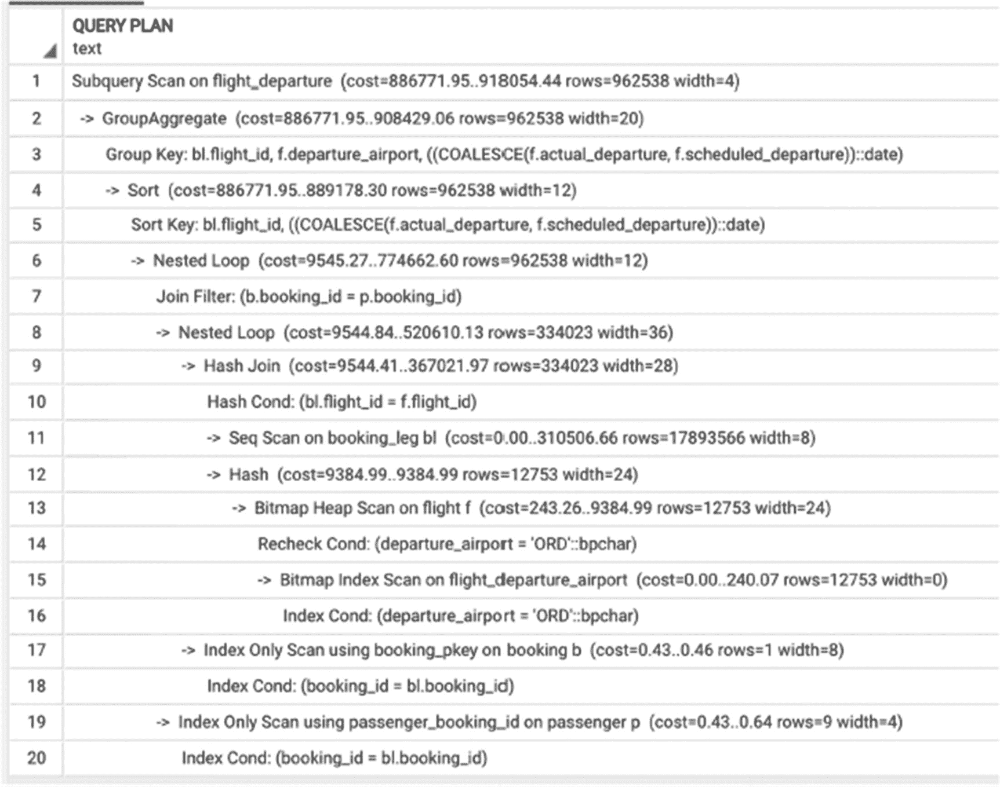
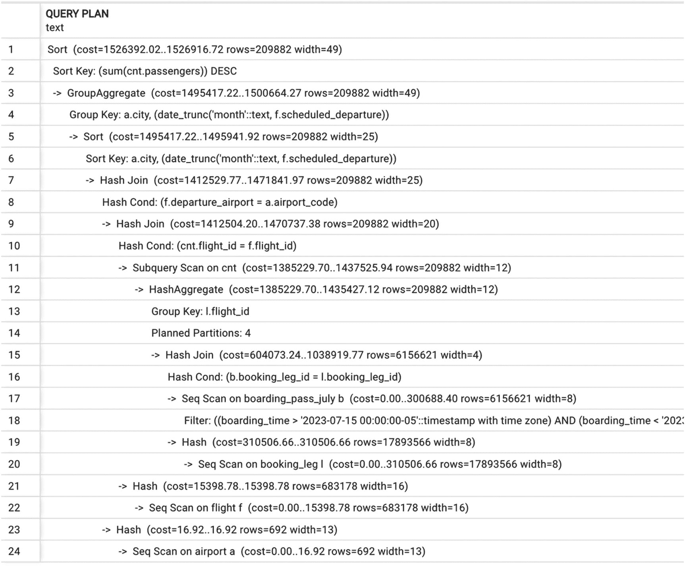

# 7. 长查询：附加技术

第 6 章讨论了多种提升长查询性能的方法。到目前为止，所涉及的技术都与重写查询而不创建额外的数据库对象有关。本章将探讨提升长查询性能的其他方法，包括物化中间结果的不同方式。将讨论临时表、CTE（公共表表达式）、视图和物化视图——每种工具何时可以提升性能，以及每种工具如何被滥用并导致性能下降。最后，本章将介绍分区和并行执行。

## 构造查询

熟悉面向对象编程（OOP）的读者会对分解（因式分解）和封装的概念不陌生。OOP 的最佳实践规定，代码应被分解（或因式分解）为许多更小的类和对象，这些类和对象负责系统行为中定义良好的子集，同时应进行封装，限制对组件的直接访问，从而隐藏其实现细节。这两个原则使应用程序代码更易于阅读和管理，并使更改更容易。

基于这种范式，当面对一个超过 500 行的单一 `SELECT` 语句时，人们很自然地会想要应用相同的原则，将代码分解成更小的部分并封装一些逻辑。

然而，SQL 的声明性质决定了它因式分解查询的风格与用于应用程序代码的风格截然不同。在 SQL 中，如同在任何语言中一样，代码应保持易于理解和修改，但不能以牺牲性能为代价。

我们可以通过多种方式在 SQL 中进行因式分解和封装，每种方式都有其自身的优点和陷阱。有些方法（效果各异）用于提升性能和存储中间结果。有些用于使代码可重用。还有一些则影响数据的存储方式。本章将介绍几种方法，其他方法，如函数，将在后续章节中深入探讨。

无论如何，任何分解或封装都应对应一个逻辑实体——例如，一份报告或每日刷新任务。

## 临时表和 CTE

在第 6 章中，我们提到有时 SQL 开发人员加速查询执行的尝试可能会适得其反，导致执行变慢。这通常发生在他们决定使用 `temporary tables`（临时表）时。

### 临时表

要创建临时表，需执行常规的 `create table` 语句，并添加关键字 `temporary` 或简写 `temp`：

```sql
CREATE TEMP TABLE interim_results
```

临时表仅对当前会话可见，如果在会话断开连接前未显式删除，它们会被自动删除。除此之外，它们与常规表一样好，可以在查询中毫无限制地使用，甚至可以创建索引。临时表常用于存储查询的中间结果，因此 `CREATE` 语句通常如下所示：

```sql
CREATE TEMP TABLE interim_results AS
SELECT ...
```

这一切看起来非常方便，那么这种方法有什么问题呢？

如果你使用临时表来存储查询结果以便进行一些分析，然后在完成后丢弃它，这完全没问题。但是，当 SQL 开发人员开始使用 `temporary tables` 来存储每个步骤的结果时，代码往往会变成这样：

```sql
CREATE TEMP TABLE T1 AS SELECT  ;
CREATE TEMP TABLE T2 AS SELECT 
FROM T1
INNER JOIN 
```

临时表的链条可能会变得相当长。这会导致问题吗？是的，而且问题很多，包括以下几点：

*   `Indexes`（索引） – 数据被选入临时表存储后，我们无法再使用在源表上创建的索引。我们只能选择在没有索引的情况下继续操作，或者在临时表上新建索引，这需要时间。
*   `Statistics`（统计信息） – 由于我们创建了一个新表，优化器无法使用源表上的值分布统计数据，因此我们只能选择在没有统计信息的情况下操作，或者在临时表上运行 `ANALYZE` 命令。
*   `Disk space`（磁盘空间） – 临时表仍然是存储在磁盘上的表，因此当它们被过度使用时，可能导致数据库大小显著增长。
*   `Excessive I/O`（过量 I/O） – 同样，因为它们是写入磁盘的表，所以写入和读取磁盘需要额外的时间。

过度使用临时表最重要的负面影响是，这种做法阻碍了优化器进行重写。

通过将每个连接的结果保存在临时表中，你阻止了优化器选择最优的连接顺序；你“锁定”了创建临时表的顺序。

当我们查看清单 6-15 中查询的执行计划时，我们观察到 PostgreSQL 能够将过滤条件下推到分组操作内部。如果为中间结果创建了临时表，会发生什么？

```sql
CREATE TEMP TABLE flights_totals AS
SELECT
bl.flight_id,
departure_airport,
(avg(price))::numeric (7,2) AS avg_price,
count(DISTINCT passenger_id) AS num_passengers
FROM booking b
JOIN booking_leg bl USING (booking_id)
JOIN flight f USING (flight_id)
JOIN passenger p USING (booking_id)
GROUP BY 1,2;

SELECT
flight_id,
avg_price,
num_passengers
FROM flights_totals
WHERE departure_airport='ORD';
```
**清单 7-1** 临时表的低效用法

创建这个临时表耗时 50 秒，产生了超过 500,000 行数据，而我们只需要其中的 10,000 行。与此同时，清单 6-15 中的查询仅用 0.1 秒就执行完毕。


### 公共表表达式（CTE）

如果临时表很危险，那么是否应该改用`CTE`（公共表表达式）呢？首先，什么是 CTE？

公共表表达式，或简称`CTE`，可以理解为仅在单个查询中存在的临时表。`WITH`子句中的每条辅助语句都可以是`SELECT`、`INSERT`、`UPDATE`或`DELETE`；而`WITH`子句本身则附加到一条主语句上，该主语句同样可以是`SELECT`、`INSERT`、`UPDATE`或`DELETE`。

让我们来尝试一个 CTE。在列表 7-2 中，来自列表 7-1 的查询被修改为使用 CTE 而不是临时表。

```sql
WITH flights_totals AS(
SELECT
bl.flight_id,
departure_airport,
(avg(price))::numeric (7,2) AS avg_price,
count(DISTINCT passenger_id) AS num_passengers
FROM booking b
JOIN booking_leg bl USING (booking_id)
JOIN flight f USING (flight_id)
JOIN passenger p USING (booking_id)
GROUP BY 1,2)
SELECT
flight_id,
avg_price,
num_passengers
FROM flights_totals
WHERE departure_airport=’ORD’
```
*列表 7-2 使用 CTE 的查询示例*

你在执行计划中看到的结果将取决于你运行的是 12 之前的 PostgreSQL 版本还是 12 及以上的版本。对于所有 12 之前的版本，CTE 的处理方式与临时表完全相同。结果会被物化在主内存中，并可能溢出到磁盘。这意味着使用 CTE 相比临时表没有任何优势。

公平地说，CTE 的预设用途是不同的。CTE 背后的理念是，如果你需要多次使用某个（可能很复杂的）子查询，你可以将其定义为 CTE，然后在查询中多次引用它。在这种情况下，`PostgreSQL`只会计算一次结果，然后根据需要多次复用。

由于这种预设的用途，优化器会将`CTE`的执行与查询的其余部分分开规划，并且不会将任何连接条件推入`CTE`内部，从而提供了所谓的*优化壁垒*。当`WITH`用于可能具有副作用的`INSERT/DELETE/UPDATE`语句或递归`CTE`调用时，这一点尤其重要。此外，拥有优化壁垒意味着参与`CTE`的表不计入`join_collapse_limit`的限制。这使得我们能够有效地利用`PostgreSQL`优化器的功能来处理连接大量表的查询。

对于列表 7-2 中的查询，在 12 之前的`PostgreSQL`版本中，`CTE` `flight_totals`会为所有航班计算，之后才会选择一部分航班。

`PostgreSQL 12`对`CTE`优化带来了巨大改变。对于没有递归的`SELECT`语句，如果一个`CTE`在查询中只被使用一次，它将被内联到外部查询中（移除优化壁垒）。如果它被调用多次，则保留旧行为。

更重要的是，前面描述的行为是默认的，但可以通过使用关键字`MATERIALIZED`和`NOT MATERIALIZED`来覆盖（参见列表 7-3）。第一个关键字强制使用旧行为，第二个关键字强制内联，忽略所有其他考虑因素。

```sql
WITH flights_totals AS MATERIALIZED (
SELECT
bl.flight_id,
departure_airport,
(avg(price))::numeric (7,2) AS avg_price,
count(DISTINCT passenger_id) AS num_passengers
FROM booking b
JOIN booking_leg bl USING (booking_id)
JOIN flight f USING (flight_id)
JOIN passenger p USING (booking_id)
GROUP BY 1,2)
SELECT
flight_id,
avg_price,
num_passengers
FROM flights_totals
WHERE departure_airport='ORD'
```
*列表 7-3 MATERIALIZED 关键字的使用*

图 7-1 展示了列表 7-2 在`PostgreSQL 12`中的执行计划。如果添加了`MATERIALIZED`关键字，如列表 7-3 所示，则会强制使用旧行为，如图 7-2 所示。


*图 7-2 强制物化 CTE*


*图 7-1 CTE 内联的执行计划*

在这些最近的改动之前，当 SQL 语句看起来像下面这样时，我们会劝阻 SQL 开发者使用多个嵌入式 CTE：

```sql
WITH z AS (
WITH y AS (
WITH x AS (SELECT ...)
SELECT ... FROM a JOIN x ...)
SELECT ... FROM b
JOIN y...)
SELECT ... FROM c
JOIN z
...
```
然而，随着`PostgreSQL 12`中引入的改动，这样的查询变得更容易管理了。我们仍然会鼓励 SQL 开发者注意不要强制产生次优的执行计划，但使用`CTE`链远比使用一系列临时表要好；在后一种情况下，优化器是无能为力的。

最后，重要的是要提到，存储中间结果在某些情况下是有益的。然而，几乎总有比使用临时表更好的方法。我们将在本章后面讨论其他选项。


## 视图：用还是不用

视图是最具争议的数据库对象。它们似乎易于理解，创建视图的好处也显而易见。但它们为何会引发问题？

尽管我们确信大多数读者都有机会为某个项目创建过至少一两个视图，但还是先给出一个正式定义。最简单的定义是：

`视图`是一种数据库对象，它存储一个定义了虚拟表的查询。

视图是虚拟表，这意味着在语法上，视图可以像表一样在 `SELECT` 语句中使用。然而，它们与表有显著区别，即不存储任何数据；数据库中只存储定义该视图的查询。

让我们再看一下清单 6-14 中的查询。这个查询计算了 `postgres_air` 模式下所有航班的总计，但我们希望使用这个查询逻辑来选择特定航班和/或出发机场的统计信息。清单 7-4 创建了一个视图来封装这个逻辑。

```sql
CREATE VIEW flight_stats AS
SELECT
  bl.flight_id,
  departure_airport,
  (avg(price))::numeric (7,2) AS avg_price,
  count(DISTINCT passenger_id) AS num_passengers
FROM booking b
JOIN booking_leg bl USING (booking_id)
JOIN flight f USING (flight_id)
JOIN passenger p USING (booking_id)
GROUP BY 1,2
```
清单 7-4
创建一个视图

现在，很容易就能选择任何特定航班的统计信息：

```sql
SELECT *
FROM flight_stats
WHERE flight_id=222183
```

这个查询计划看起来与图 6-13 中的计划完全相同。原因是在查询处理的第一步，查询解析器将视图转换为内联子查询。在这种情况下，这对有利的，因为过滤条件被推入到了分组操作之内。但如果使用了非常量搜索条件，结果可能会令人失望。在清单 7-5 中，视图 `flight_stats` 的航班统计信息被航班的出发日期所限制。

```sql
SELECT *
FROM flight_stats fs
JOIN (SELECT
        flight_id
      FROM flight f
      WHERE actual_departure between '2023-08-01' and '2023-08-14'
     ) fl
ON fl.flight_id=fs.flight_id
```
清单 7-5
使用视图进行查询

此查询的执行计划如图 7-3 所示。



一个查询计划包含 24 行文本。这些行包括哈希连接、分组聚合、哈希条件、分组键、排序键、对 `booking` 表的顺序扫描以及其他细节。

图 7-3
条件无法被推入的执行计划

查看这个执行计划，我们观察到，首先计算所有航班的统计信息，之后才将结果与选定的航班进行连接。该查询的执行时间为十分钟。

不使用视图，我们遵循第 6 章解释的模式，在分组之前过滤航班，如清单 7-6 所示。

```sql
SELECT
  bl.flight_id,
  departure_airport,
  (avg(price))::numeric (7,2) AS avg_price,
  count(DISTINCT passenger_id) AS num_passengers
FROM booking b
JOIN booking_leg bl USING (booking_id)
JOIN flight f USING (flight_id)
JOIN passenger p USING (booking_id)
WHERE actual_departure between '2023-08-01' AND '2023-08-14'
GROUP BY 1,2
```
清单 7-6
不使用视图重写查询

该查询的执行计划如图 7-4 所示，显示对 `flight` 表的限制被首先应用。该查询的执行时间为三分钟。



一个查询计划包含 20 行文本。这些行包括分组聚合、哈希条件、分组键、排序键、对 `passenger`、`booking` 的顺序扫描、重新检查条件以及其他细节。

图 7-4
清单 7-6 的执行计划

当数据库教科书，包括那些教授 PostgreSQL 基础知识的书，声称视图可以“像表一样”使用时，这是一种误导。在实践中，最初仅为封装独立查询而创建的视图，经常被用于其他查询中，与其他表和视图连接，包括多次连接到视图中已包含的表，而用户并不知道幕后发生了什么。

一方面，人们创建视图的目的通常就是为了封装，以便其他人无需弄清楚选择逻辑就能使用它。另一方面，这种不透明性正是查询性能不佳的原因。当视图中的某些列是转换结果时，这种影响尤其明显。考虑清单 7-7 中的视图 `flight_departure`。

```sql
CREATE VIEW flight_departure as
SELECT
  bl.flight_id,
  departure_airport,
  coalesce(actual_departure, scheduled_departure)::date
  AS  departure_date,
  count(DISTINCT passenger_id) AS num_passengers
FROM booking b
JOIN booking_leg bl USING (booking_id)
JOIN flight f USING (flight_id)
JOIN passenger p USING (booking_id)
GROUP BY 1,2,3
```
清单 7-7
带有列转换的视图

执行查询

```sql
SELECT
  flight_id,
  num_passengers
FROM flight_departure
WHERE flight_id =22183
```
……对航班的过滤条件会被推入视图内部，查询将在 63 毫秒内执行完毕。一个不知道 `flight_departure` 是视图的用户可能会认为所有列的性能都差不多，并在运行以下查询时对结果感到惊讶：

```sql
SELECT
  flight_id,
  num_passengers
FROM flight_departure
WHERE departure_date= '2023-08-01'
```

这个查询需要 2.5 秒或更长的执行时间，是前者的四十倍。差异的原因是 `departure_date` 列是一个转换结果，如第 5 章所讨论的，无法利用任何索引来应用此过滤条件。此查询的执行计划如图 7-5 所示。请注意，尽管 `scheduled_departure` 和 `actual_departure` 上的索引未被使用，PostgreSQL 仍然正确识别了连接顺序，先搜索 `flight` 表，然后使用索引访问 `booking` 和 `passenger` 表。



一个查询计划包含 18 行。这些行包括对 `flight departure` 的子查询扫描、分组聚合、分组键、排序键、嵌套循环、哈希连接、哈希条件、对 `flight` 表的顺序扫描以及其他细节。

图 7-5
某些索引无法被利用时的执行计划

清单 7-8 展示了一个更严重的性能下降案例。不幸的是，这是一个真实案例。当使用视图的人不知道创建它用了什么查询时，他们可能会用它来选择那些从底层表中更容易获取的数据。

```sql
SELECT
  flight_id
FROM flight_departure
WHERE departure_airport='ORD'
```
清单 7-8
仅从视图中选择一列

这个查询不关心航班上的乘客数量；它仅仅是选择所有从 `ORD` 出发且已售出任何机票的航班。然而，清单 7-8 的执行计划相当复杂——见图 7-6。



一个查询计划包含 20 行。它们包括对 `flight departure` 的子查询扫描、分组聚合、分组键、排序键、嵌套循环、连接过滤器、哈希连接、哈希条件、对 `flight` 表的顺序扫描、索引条件以及其他细节。

图 7-6
清单 7-8 中查询的执行计划

该查询运行了 3.1 秒。然而，一个不使用视图而选择相同信息的查询

```sql
SELECT
  flight_id
FROM flight
WHERE departure_airport='ORD'
AND flight_id IN (SELECT flight_id FROM booking_leg)
```


...将使用可用索引，并且仅需运行 120 毫秒。

## 为何要使用视图？

既然我们已经看到了很多使用视图带来的负面影响例子，那么有没有什么为其辩护的理由呢？是否存在一些场景，使用视图可以提升查询性能？

在 PostgreSQL 内部，大多数情况下，任何视图的创建都隐式地包含了规则的创建。`select` 规则可能会限制对底层表的访问。规则、触发器和自动更新使得 PostgreSQL 中的视图极其复杂，并提供了与表非常相似的功能。

然而，它们并不能带来任何性能上的好处。视图最好且或许是唯一合理的用途，是作为安全层或用于定义报表实体，以确保所有的连接和业务逻辑都正确定义。

## 物化视图

大多数现代数据库系统允许用户创建物化视图，但它们的实现和具体行为各不相同。

让我们从定义开始。

物化视图是一种数据库对象，它结合了查询定义和一个表，用于在查询运行时存储其结果。

物化视图与视图不同，因为查询结果被存储了下来，而不仅仅是视图定义。这意味着物化视图反映的是它最后一次刷新时的数据，而不是当前数据。它也不同于表，因为你不能直接修改物化视图中的数据，只能使用预定义的查询来刷新它。

### 创建和使用物化视图

让我们通过一个例子来帮助说明物化视图的定义。清单 7-9 创建了一个物化视图。

```sql
CREATE MATERIALIZED VIEW flight_departure_mv AS
SELECT
bl.flight_id,
departure_airport,
coalesce(actual_departure, scheduled_departure)::date departure_date,
count(DISTINCT passenger_id) AS num_passengers
FROM booking b
JOIN booking_leg bl USING (booking_id)
JOIN flight f USING (flight_id)
JOIN passenger p USING (booking_id)
GROUP BY 1,2,3
```

清单 7-9
创建物化视图

运行此命令时会发生什么？首先，在这个特定的例子中，它需要很长时间来执行。但执行完成后，数据库中将出现一个新对象，该对象存储了此次查询执行的结果。此外，查询本身也会与数据一起存储。与视图相反，当在查询中引用物化视图时，它们的行为完全像表。优化器不会用它们的定义查询来替换它们，而是像访问表一样访问它们。也可以在物化视图上创建索引，尽管它们不能有主键和外键：

```sql
CREATE UNIQUE INDEX flight_departure_flight_id
ON flight_departure_mv(flight_id);
--
CREATE INDEX flight_departure_dep_date
ON flight_departure_mv(departure_date);
--
CREATE INDEX flight_departure_dep_airport
ON flight_departure_mv(departure_airport);
```

执行此查询

```sql
SELECT
flight_id,
num_passengers
FROM flight_departure_mv
WHERE departure_date= '2023-08-01'
```

...将仅需 60 毫秒，并且执行计划将显示索引扫描。

### 刷新物化视图

`REFRESH` 命令使用基础查询在刷新执行时的结果来填充物化视图。`REFRESH` 命令的语法如下：

```sql
REFRESH MATERIALIZED VIEW flight_departure_mv
```

PostgreSQL 中的物化视图不如 Oracle 等其他一些数据库管理系统成熟。物化视图不能进行增量更新，并且刷新计划无法在物化视图定义中指定。每次执行 `REFRESH` 命令时，底层表都会被截断，然后插入 `SELECT` 语句的结果。如果在刷新过程中发生错误，刷新过程将回滚，物化视图保持不变。

在刷新期间，物化视图会被锁定，其内容对其他进程不可用。为了使物化视图的先前版本在刷新期间仍然可用，可以添加 `CONCURRENTLY` 关键字：

```sql
REFRESH MATERIALIZED VIEW CONCURRENTLY flight_departure_mv
```

物化视图只有在具有唯一索引时才能进行并发刷新。并发刷新比常规刷新花费的时间更长，但对物化视图的访问不会被阻塞。

### 我应该创建物化视图吗？

很难提供创建物化视图在哪些具体、普遍条件下是有益的，但可以遵循一些决策指南。由于物化视图的刷新需要时间，而从物化视图中进行选择会比从视图中快得多，请考虑以下因素：

*   基表中的数据变化频率如何？
*   获取最新数据有多关键？
*   我们需要选择这个数据的频率如何（或者更准确地说，每次刷新前预计有多少次读取）？
*   有多少不同的查询会使用这个数据？

“频繁”和“许多”的阈值应该是什么？这是主观的，但让我们看一些例子来说明。清单 7-10 定义了一个与清单 7-9 中的视图非常相似的物化视图，不同之处在于它选择了昨天起飞的航班。

```sql
CREATE MATERIALIZED VIEW flight_departure_prev_day AS
SELECT
bl.flight_id,
departure_airport,
coalesce(actual_departure, scheduled_departure)::date departure_date,
count(DISTINCT passenger_id) AS num_passengers
FROM booking b
JOIN booking_leg bl USING (booking_id)
JOIN flight f USING (flight_id)
JOIN passenger p USING (booking_id)
WHERE (actual_departure BETWEEN CURRENT_DATE -1
AND  CURRENT_DATE
)
OR (
actual_departure IS NULL
AND scheduled_departure BETWEEN CURRENT_DATE -1
AND CURRENT_DATE
)
GROUP BY 1,2,3
```

清单 7-10
用于昨日航班的物化视图

关于昨日起飞航班的信息不会改变，因此可以安全地假设在第二天之前不需要刷新该视图。另一方面，这个物化视图可以在多个不同的查询中使用，如果查询结果被物化，这些查询都会执行得更快。

让我们考虑另一个可能适合物化的候选对象，清单 6-29。假设创建了一个带有子查询的物化视图，如清单 7-11 所示。

```sql
CREATE MATERIALIZED VIEW passenger_passport AS
SELECT
cf.passenger_id,
coalesce(max (custom_field_value )
FILTER (WHERE custom_field_name ='passport_num' ),'')    AS passport_num,
coalesce(max (custom_field_value )
FILTER (WHERE custom_field_name ='passport_exp_date' ),'') AS passport_exp_date,
coalesce(max (custom_field_value )
FILTER (WHERE custom_field_name ='passport_country' ),'') AS passport_country
FROM custom_field cf
GROUP BY 1;
```

清单 7-11
基于子查询创建物化视图

这个物化视图将会非常有用。首先，已经证明这个查询执行需要很长时间，因此通过预先计算结果可以节省时间。其次，护照信息不会改变（此信息与预订相关联，同一个人在不同的预订中会被分配不同的 `passenger_id`）。如果不考虑几个潜在问题，它看起来是物化视图的绝佳候选。

首先，乘客在预订时并非必须提交护照信息。这意味着尽管一旦输入，这些信息将保持不变，但对于任何特定航班，护照信息可能会持续输入直到登机口关闭。因此，这个物化视图将需要不断刷新，并且每次刷新大约需要十分钟。

## 物化视图的增长与优化

其次，这个物化视图会不断增长。与之前每天刷新只覆盖前一天数据的例子不同，关于乘客护照的数据会持续累积，刷新物化视图所需的时间也会越来越长。这种情况在项目早期经常被忽视，因为那时表中数据很少，物化视图刷新很快。由于 PostgreSQL 不支持增量刷新物化视图，一个可能的解决方案是创建另一个与清单 7-11 中物化视图结构相同的表，并在新的护照信息可用时定期追加新行。

然而，如果采用后一种解决方案，如果数据需要以 `passenger_passport` 物化视图指定的格式存在，那么最初为何需要 `custom_field` 表就变得不明确了。这将是下一章讨论的主题，将探讨设计对性能的影响。

### 物化视图是否需要优化？

虽然物化视图的查询执行频率低于其本身的使用频率，但我们仍需关注其执行时间。即使物化视图是一个快速的查询（例如，如清单 7-9 中只包含前一天的数据），如果没有合适的索引或执行计划不是最优的，它最终也可能对大表进行全表扫描。

如前所述，我们不能接受“因为运行频率低所以不需要优化”这样的借口，无论是一个月一次、一周一次还是一天一次。没有人会对运行六小时的报表感到满意，无论其频率多低。此外，这些周期性报表通常都被安排在同一时间执行——往往是周一早上 8 点——以比任何人所需压力更大的方式开启一周。如果物化视图之间存在某些*依赖关系*，这种压力会更加明显。在这种情况下，物化视图需要按特定顺序刷新，增加了最终报告刷新前的总等待时间。

值得一提的是，刷新缓慢的物化视图可能引发的另一个问题。如果在物化视图刷新开始之后开始数据库备份，并在刷新结束之前完成备份，那么该物化视图将以不一致的状态存储在备份中。如果你从这个备份中恢复（例如，在你的开发环境中），你将既不能删除也无法重建它。综上所述，我们相信很明显物化视图应该像任何其他 SQL 查询一样进行优化。第 5 章和第 6 章讨论的技术可以并且应该应用于物化视图。

### 依赖关系

当视图和物化视图被创建时，一个副作用是产生*依赖关系*。视图和物化视图都有关联的查询，当这些查询中涉及的任何属性被更改时，相关的视图和物化视图就需要被重新创建。

实际上，PostgreSQL 甚至不允许对存在依赖视图和物化视图的表或物化视图执行 `alter` 或 `drop` 操作。进行更改需要在 `ALTER` 或 `DROP` 命令中添加 `CASCADE` 关键字。

如果视图和物化视图建立在其他视图之上，更改或删除基础表中的一个列可能会导致重建几十个相关的数据库对象。创建一个视图不需要大量时间，但重建多个相关的物化视图却需要，并且在这段时间内，即使它们允许并发刷新，这些物化视图也将不可用。

后续章节将讨论函数和存储过程，它们可以消除此类依赖关系。

## 分区

到目前为止，本章讨论了将查询分割成更小部分的不同方法。

分区是另一种划分——划分数据。一个分区表由多个分区组成，每个分区被定义为一张表。分区表本身是一个虚拟表，不存储任何行。相反，根据创建分区表时指定的规则，每一行数据被存储在其中一个分区中。

分区支持在 PostgreSQL 中相对较新，从 PG 10 开始，每个版本都有改进，使分区表更易于使用。目前，PostgreSQL 支持以下分区方法：范围分区、列表分区和哈希分区。

最常见的情况是范围分区，这意味着每个分区包含其属性值在分配给该分区的范围内的行。分配给不同分区的范围不能相交，不符合任何分区范围的行无法被插入。

例如，让我们创建 `boarding_pass` 表的分区版本。命令序列如清单 7-12 所示。

```
---create table

CREATE TABLE boarding_pass_part (
boarding_pass_id SERIAL,
passenger_id BIGINT NOT NULL,
booking_leg_id BIGINT NOT NULL,
seat TEXT,
boarding_time TIMESTAMPTZ,
precheck BOOLEAN,
update_ts TIMESTAMPTZ
)
PARTITION BY RANGE (boarding_time);
--create partitions
--
CREATE TABLE boarding_pass_may
PARTITION OF boarding_pass_part
FOR VALUES
FROM ('2023-05-01'::timestamptz)
TO ('2023-06-01'::timestamptz) ;
--
CREATE TABLE boarding_pass_june
PARTITION OF boarding_pass_part
FOR VALUES
FROM ('2023-06-01'::timestamptz)
TO ('2023-07-01'::timestamptz);
--
CREATE TABLE boarding_pass_july
PARTITION OF boarding_pass_part
FOR VALUES
FROM ('2023-07-01'::timestamptz)
TO ('2023-08-01'::timestamptz);
--
CREATE TABLE boarding_pass_aug
PARTITION OF boarding_pass_part
FOR VALUES
FROM ('2023-08-01'::timestamptz)
TO ('2023-09-01'::timestamptz);
--
INSERT INTO boarding_pass_part SELECT * from boarding_pass;
```
清单 7-12 创建一个分区表

## 分区能提升性能吗？

人们普遍认为，对大型表进行**分区**可以提高查询性能。但情况并非总是如此。此外，分区常常会降低性能，你可能需要重写旧查询以确保性能不会受到负面影响。

分区能够提升性能的方式在于：如果查询包含对分区键的条件判断，那么搜索就仅限于这些特定分区。这使得分区在那些**全表扫描**往往是最佳选择的长查询中特别有用：分区可以显著减少表扫描所需时间。而对于索引访问而言，这种差异可以忽略不计：分区只是从`B-树`中移除了一个层级。

应如何为表选择分区键？根据`Postgres`优化器的工作方式，需要满足两个条件：1）分区键应在（几乎）所有针对此表运行的查询中使用，或至少在关键查询中使用；2）这些值必须在 SQL 语句执行前已知。后者意味着该值不能作为参数或子查询的结果传递。

让我们来看一个来自第 6 章的示例，即代码清单 6-21。如果此查询被限制在 7 月 15 日至 7 月 31 日的登机时间范围内

```
SELECT
city,
date_trunc('month', scheduled_departure),
sum(passengers)  passengers
FROM airport  a
JOIN flight f ON airport_code = departure_airport
JOIN (
SELECT
flight_id,
count(*) passengers
FROM   booking_leg l
JOIN boarding_pass b USING (booking_leg_id)
WHERE boarding_time > '07-15-23'
and boarding_time <'07-31-23'
GROUP BY flight_id
) cnt
USING (flight_id)
GROUP BY 1,2
ORDER BY 3 DESC
```

…这仍然将是一个长查询，会对`boarding_pass`表执行全表扫描。其执行计划与图 6-18 中的相同。

然而，当对分区表`boarding_pass_part`（参见代码清单 7-13）执行类似的查询时，此查询将能够利用分区优势。

```
SELECT
city,
date_trunc('month', scheduled_departure),
sum(passengers)  passengers
FROM airport  a
JOIN flight f ON airport_code = departure_airport
JOIN (
SELECT
flight_id,
count(*) passengers
FROM   booking_leg l
JOIN boarding_pass_part b USING (booking_leg_id)
WHERE boarding_time > '07-15-23'
and boarding_time <'07-31-23'
GROUP BY flight_id
) cnt
USING (flight_id)
GROUP BY 1,2
ORDER BY 3 DESC
Listing 7-13
查询分区表
```

图 7-7 中的执行计划证明，优化器选择仅扫描一个分区，而不是全表扫描，因为查询是基于`boarding_time`进行过滤的。对于非分区表，无论是否按`boarding_time`过滤，其查询运行时间大致相同；而对于分区表，执行时间则快了一倍多，因为所有相关行都位于同一个分区中。



一个查询计划包含 24 行文本。它包括排序键、分组聚合、分组键、哈希连接、哈希条件、对计数结果的子查询扫描、规划的分区、对 booking、flight 和 airport 表的顺序扫描，以及其他细节。

图 7-7
使用分区表的执行计划

分区可以拥有自己的索引，这些索引显然比整个分区表上的索引要小。对于短查询而言，这个选项可能是有益的。然而，只有当几乎所有查询都从同一分区提取数据时，这才能显著提高性能。在`B-树`中搜索的成本与其深度成正比。分区上的索引很可能只消除`B-树`的一个层级，而选择所需分区也需要消耗一定的资源。这些资源很可能与处理一个额外索引层级所需的资源相当。当然，查询可以指定分区而不是整个分区表，从而将选择分区的开销隐藏在发出查询的应用程序中。

因此，不应高估分区对短查询的好处。

## 为什么要创建分区表？

读完上一节，读者可能会想，是否有理由去创建分区表。事实上，理由有很多，我们将在本节进行介绍。

可以向分区表添加分区或删除分区。`DROP`命令的执行速度远快于批量`DELETE`操作，并且不需要后续的`VACUUM`。一个典型的用例是表按日期范围分区（例如，每月一个分区），每月末添加一个新分区并删除最旧的分区。

此外，还可以`ATTACH`（附加）和`DETACH`（分离）分区。通过这种方式，你可以将现有表作为分区添加到分区表中，也可以分离分区而不删除数据。例如，你可以将最近三个月的数据保留在分区表中，每月初添加一个新分区，分离出最旧的分区，然后将其附加到归档表中。

分区可用于将大量数据分布到多台数据库服务器上：一个分区可以是外部表（foreign table）。

然而，分区的主要理由在于维护。当表达到 TB 级别时，复制此类表或对其运行`pg_dump`就变得具有挑战性。最重要的是，在该表上运行`autovacuum`也变得困难。我们将介绍`autovacuum`及其对维护健康 PostgreSQL 数据库的重要性；现在，我们只想提到，`autovacuum`几乎不可能在 1TB 的表上完成。

## 并行处理

从版本 10 开始，PostgreSQL 具备支持并行查询执行的能力。两个配置参数`max_parallel_workers`和`max_parallel_workers_per_gather`定义了可用并行进程的数量以及单一会话中可生成的并行进程数量。

我们仍然记得这个功能推出时社区的兴奋之情。的确，并行处理过去乃至现在常常被宣传为解决所有性能问题的“银弹”，我们感到有必要提醒您不要对并行处理抱有过高期望——这在任何关系型数据库管理系统中都是如此，而不仅仅是 PostgreSQL。

并行执行可以被视为另一种拆分查询的方式：执行查询所需的工作量被分配到多个处理单元（处理器或核心）之间。

任何并行算法都有一部分必须在单个单元上执行。此外，作为并行进程间同步的成本，会产生额外的开销。由于这些原因，并行处理主要在处理批量数据时有益。具体来说，对于大规模扫描和哈希连接，并行执行是有益的。扫描和哈希连接都是长查询的典型操作，其性能提升通常最为显著。

相反，对于短查询的加速效果通常可以忽略不计。不同查询的并行执行可能会提高吞吐量，但这与单个查询的并行执行无关。

有时，优化器可能会用并行表扫描替代基于索引的访问（后者会在顺序执行中使用）。这可能是由成本估算不准确引起的。在这种情况下，并行执行可能比顺序执行更慢。

本书中的所有执行计划都是在关闭并行处理的情况下创建的。

此外，无论并行执行能带来多大的可扩展性优势，都无法修复糟糕的设计或补偿低效代码，原因很简单：并行带来的可扩展性收益最多是线性的，而嵌套循环的成本是二次方的。


## 本章小结

本章介绍了将查询拆分为更小功能单元的不同方法，以及每种方法的优缺点。讨论了一种常用优化工具——临时表——的潜在缺陷，并展示了如何使用公用表表达式作为替代方案，从而避免阻碍查询优化器。本章还探讨了视图与物化视图及其对性能的影响。最后，简要介绍了分区与并行执行。

