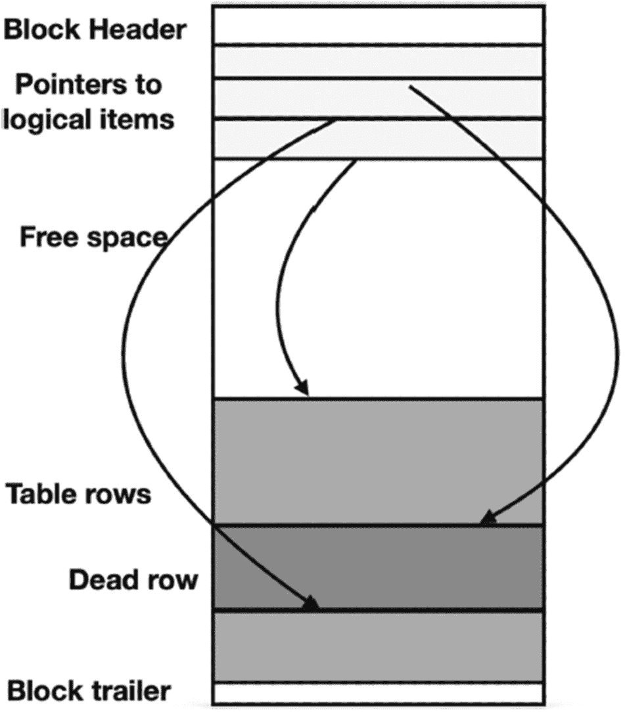

# 8. 优化数据修改

至此，我们一直专注于优化 `查询`，这意味着只涵盖了数据检索。我们尚未涉及任何与数据操作相关的内容，即更新、删除或添加记录。这正是本章的主题，将讨论数据操作如何影响性能以及如何提升这些操作的性能。

## 什么是 DML？

任何数据库系统都有两种语言：DDL（数据定义语言），用于创建表和其他数据库对象；以及 DML（数据操作语言），用于查询和修改数据库中的数据。在 PostgreSQL 中，DDL 和 DML 都是 SQL 的一部分，但某些命令与 DDL 相关（如 `ALTER TABLE`、`CREATE MATERIALIZED VIEW`、`DROP INDEX` 等），而另一些则与 DML 相关（`INSERT`、`UPDATE`、`DELETE`）。通常也将这些命令分别称为 DDL 和 DML，因此提及“运行 DDL”即指执行数据定义命令，而“运行 DML”则指执行 `INSERT`、`UPDATE` 或 `DELETE`。

## 优化数据修改的两种途径

任何 DML 语句的执行都包含两部分：选择要修改的记录和实际的数据修改。对于 `INSERT` 语句，当插入的是常量时，第一部分可能被省略。然而，如果使用的是 `INSERT-SELECT` 结构，则必须先找到插入所需的记录。

因此，优化 DML 语句包含两部分：优化选择操作和优化数据修改操作。

如果问题出在搜索部分，那么应该优化的是该命令的 `SELECT` 部分。这在之前的章节已有详细讨论。本章将专注于第二部分——优化数据写入操作。

在绝大多数情况下，即便是 OLTP 系统，执行的 DML 语句也远少于 `SELECT` 语句。这是人们很少讨论优化 DML 的主要原因。然而，长时间运行的 DML 不仅可能因为更新后的数据无法在系统中及时可用而引发问题，还可能因为它会产生 `阻塞锁`，从而减慢其他语句的执行速度。

## DML 是如何工作的？

为了讨论适用于数据修改 SQL 命令的优化方法，我们需要理解它们是如何执行的。

### 底层输入/输出

归根结底，任何 SQL 操作，无论多么复杂，最终都归结为几个底层操作：读取和写入单个数据库块。原因很简单：只有在将数据库块获取到主内存后，才能处理其中包含的数据；并且所有修改首先在主内存中完成，然后再写入磁盘。

读取和写入的一个根本区别在于：必须在数据被处理之前完成从磁盘的读取；因此，`SELECT` 语句在所需的所有块被获取到内存之前无法完成。相反，块内部的修改是在写入开始之前完成的；因此，SQL 操作可以在没有任何延迟的情况下完成。无需等待修改后的数据实际写入磁盘。这有点违反直觉：通常人们会认为更新操作比读取需要更多资源。

当然，写入确实比读取需要多得多的资源：数据库必须修改索引，并在 WAL（预写日志）中记录更新。然而，就单个 DML 语句而言，这些操作都是在主内存中发生的。WAL 记录是异步强制刷盘的：默认情况下，PostgreSQL 保证它们在提交时被写入。

这听起来很棒：任何 `INSERT`、`UPDATE` 或 `DELETE` 操作看起来都比 `SELECT` 运行得快得多。既然如此，为什么仍然需要优化呢？

主要有两个原因：首先，写操作仍然是必需的，因此会消耗一定量的硬件资源，主要是 I/O 带宽。写入的成本与传输页面的成本相关，不一定在任何单个操作上明显可见，但它仍然会减慢处理速度，甚至可能影响 `SELECT` 语句的性能。后台（例如，修改后的块被写入磁盘）和维护期间会产生额外的工作负载。通常，这种维护执行数据重组，例如 PostgreSQL 中的 `VACUUM` 操作。一些重组任务会在整个重组操作期间阻止对修改对象的访问。

其次，修改操作可能会相互干扰，甚至干扰数据检索。只要数据未被修改，处理的顺序就无关紧要。不同的 `SELECT` 语句可以同时访问数据。相反，修改操作不能同时进行，操作顺序至关重要。为了确保正确性，有些操作必须延迟甚至拒绝。正确性是并发控制（也称为事务处理）子系统的职责。事务处理不是本书的重点；然而，讨论修改操作无法避免一些与 DBMS 事务行为相关的考量。


### 并发控制的影响

为确保操作顺序的正确性，事务调度器通常依赖于加锁机制。如果一个事务需要获取锁，而另一个事务已持有冲突的锁，其执行就会被延迟，直到冲突的锁被释放。这被称为锁等待。锁等待是导致修改操作延迟的主要原因。

并发控制的另一个功能是确保更新不丢失。已提交事务执行的任何更新都必须在提交前可靠地存储在硬盘上。实现此机制的工具是预写式日志（`WAL`）。在事务能够提交之前，所有数据修改都必须在硬盘上被记录到 `WAL` 记录中。`WAL` 是顺序写入的，在速度较慢的机械硬盘上，顺序读写比随机读写快两个数量级。这种差异在 SSD 上可以忽略不计。虽然无需等待所有更改从缓存写入数据库，但提交仍然必须等待 `WAL` 刷新到磁盘。因此，过于频繁地提交会显著减慢处理速度。一个极端情况是将每条 `DML` 语句都放在单独的事务中执行。如果应用程序不使用事务控制语句，从而导致数据库将每条语句自动包装成一个单独的事务，这种情况就真的会发生。另一方面，过长的事务可能因锁机制而导致系统缓慢。

上述考虑适用于任何高性能数据库。现在，让我们看看 PostgreSQL 特有的技术。

PostgreSQL 的一个显著特点是 `MVCC`：多版本并发控制。PostgreSQL 从不执行“就地更新”，也就是说，它从不“更新”一条记录。取而代之的是，创建一个数据项（例如表中的一行）的新版本，并将其存储在同一数据块或一个新分配的数据块的空闲空间中，而先前的版本仍然可以访问。

图 8-1 展示了图 3-1 中的数据块在删除（或更新）第二行后的结构。该行先前占用的空间不能被用于另一行；实际上，该数据仍然可访问。



一个区块图从上到下依次展示了区块头、指向逻辑项的指针、空闲空间、表行、死亡行和区块尾部的各层结构。

图 8-1

删除一行后的区块布局

此特性对性能可能既有积极也有消极的影响。

过期的版本不会被永久保留。当旧版本不再需要用于当前运行的事务时，`VACUUM` 操作会移除它们并合并区块中的空闲空间。

PostgreSQL 使用快照隔离（`SI`）并发控制协议来防止事务之间发生不良干扰。请注意，数据库教科书通常解释的是在两阶段锁并发控制协议中使用的锁机制，这与 PostgreSQL 中锁的使用方式显著不同。从教科书或其他系统经验中获得的任何直觉都可能产生误导。

在 `SI` 下，事务总是读取一行的最新已提交版本。如果另一个事务在该行已更新但在读取操作开始前尚未提交，读取操作将返回一个过时的版本。这是一个优点，因为旧版本是可用的，且读取它无需加锁。也就是说，多版本并发控制提高了吞吐量，因为无需延迟读取操作。

根据 `SI` 规则，不允许对相同数据进行并发写入：如果两个并发（即同时运行的事务）尝试修改相同数据，则必须中止其中一个事务。通常，有两种策略来强制执行此规则。一种称为首次更新胜出，另一种称为首次提交胜出。强制执行第一种策略更容易：我们知道更新是立即执行的，第二个事务可以被立即中止而无需任何等待。然而，PostgreSQL 使用的是第二种策略。

为了强制执行此规则，PostgreSQL 对任何修改操作都使用写锁。在事务能够更改任何数据之前，它必须先获取一个更新锁。如果因为其他事务正在修改相同数据而无法获得锁，该操作将被延迟，直到持有冲突锁的事务终止。如果持有锁的事务因中止而释放了锁，则该锁将授予等待的事务，数据修改操作即可完成。否则，如果该事务成功提交，后续行为则取决于事务隔离级别。对于 `READ COMMITTED`（PostgreSQL 中的默认级别），等待的事务将读取已修改的数据，获取写锁，并完成修改。这种行为是可能的，因为在此隔离级别上，读取操作可以读取在 `SELECT` 语句开始前提交的版本，而非在事务开始前提交的版本。如果隔离级别是 `REPEATABLE READ`，则等待的事务将被中止。这种实现方式导致了等待，但避免了不必要的中止。

我们不讨论 `SERIALIZABLE` 级别，因为它极少被使用。

现在，让我们看一些重要的特殊情况。

## 数据修改与索引

在第 5 章讨论创建新索引时，我们提到向表添加索引可能会减慢 `DML` 操作的速度。具体变慢多少取决于存储和系统特性（如磁盘速度、处理器和内存），但根据多位 PostgreSQL 专家的观察，增加一个额外索引只会使 `INSERT/UPDATE` 时间增加 1%。

你可以使用 `postgres_air` 模式进行一些实验。例如，从一个拥有许多索引的表开始，比如 `flight` 表。

首先，创建一个没有索引的 `flight` 表的副本：

```
CREATE TABLE flight_no_index AS
SELECT * FROM flight LIMIT 0;
```

然后，将 `flight` 表中的行插入到 `flight_no_index` 表中：

```
INSERT INTO flight_no_index
SELECT * FROM flight LIMIT 100
```

记录执行时间。接着，清空（truncate）新表，并开始为 `flight_no_index` 表构建第 5 章中为 `flight` 表创建的所有相同索引。重复插入操作。对于少量行（大约几百行），执行时间没有差异，但在插入 100,000 行时，可以观察到一些缓慢。然而，对于在 `OLTP` 环境中执行的典型操作而言，不会有实质性的差异。

自然地，创建索引需要时间，值得一提的是，PostgreSQL 中的 `CREATE INDEX` 操作会锁定表，禁止所有 `DML` 操作（但仍允许读取）。`CREATE INDEX CONCURRENTLY` 操作需要更长的完成时间，但允许执行 `DML`。

正如我们前面提到的，PostgreSQL 插入更新行的新版本。这对性能有一些负面影响：通常，新版本会被插入到不同的位置，因此表上的所有索引都必须进行修改。为了减少这种负面影响，PostgreSQL 使用了一种有时被称为 `HOT`（仅堆元组）的技术；它会尝试将新版本插入到同一个数据块中。如果该数据块有足够的空闲空间，并且更新不涉及修改任何索引列，则无需修改任何索引。实际上，情况稍微复杂一些，但我们在此不深入探讨内部细节。


## 数据操作语言与清理

如前所述，PostgreSQL 不会立即移除行的旧版本。`DELETE` 语句将删除的行标记为已移除，而 `UPDATE` 会插入行的新版本，并将之前的版本标记为过时。一旦这些行不再需要用于活动事务，它们就变成了“死行”。随着死行数量增长，这实际上会减少数据块中的活动行数，从而减慢后续的堆扫描速度。

死行（即已删除的元组）所占用的空间将保持未使用状态，直到被 `VACUUM` 操作回收。这种情况称为表膨胀。大多数情况下，即使更新率相对较高，由 autovacuum 后台进程发起的常规清理也能及时处理死元组，因此不会导致任何明显的延迟。

关于调整 `AUTOVACUUM` 系统参数的建议可以在 PostgreSQL 文档和许多咨询公司的网站上找到。在选择这些参数的最佳值时，需要在减少 I/O 峰值、确保清理能够相对快速完成以及完成任务（即控制住膨胀）之间找到恰当的平衡。

### 批量 UPDATE/DELETE

如果执行批量 `UPDATE/DELETE` 会怎样？即影响表中很大一部分数据的操作。如果您运行这类工作负载，可能会注意到从受影响表中进行的 `SELECT` 操作显著变慢。可见性映射图强制重新检查需要访问堆数据块；此外，页面上的活动元组数量减少。这将导致每次选择操作需要读取更多数据块到内存中。

虽然在一个非常繁忙的系统上调整 autovacuum 有多种方法，但如果更新/删除的级别过高，即使 autovacuum 参数调整得非常完美，也可能无法减少表和索引的膨胀。您可能需要评估整个系统架构，看看数据修改量是否合理。这包括检查应用程序是否对同一组记录执行了多次连续更新，或者将表分区并用 `DROP`/`DETACH` 分区以及随后的 `CREATE`/`ATTACH` 分区来替代批量更新是否有意义。

### 频繁更新

现在，让我们考虑另一种情况：一个表经历频繁的更新（尽管每次更新只影响单行或极少数行）。

根据这些更新的性质，有时可以通过设置表的 `fillfactor` 来减少索引更新的开销和表膨胀。此存储参数设置了表块中空闲空间的百分比，可以在 `CREATE TABLE` 语句的 `WITH` 子句中定义。默认情况下，此参数的值为 100，告诉 PostgreSQL 尽可能多地容纳行，并最小化每个块中的空闲空间大小。因此，通常只有在更新或删除后进行清理时才会出现空闲空间。

然而，如果表行的尺寸足够小，一个块中可以存储多条记录，并且更新不影响索引属性，我们可以指定较小的 `fillfactor` 值。PostgreSQL 允许的最低值为 10，为行的更新版本留出 90% 的块空间。当然，`fillfactor` 参数值小会导致存储表数据所需的块数量增加，从而增加表堆扫描所需的读取次数。这显著减慢了长查询的速度，但对于短查询，尤其是当仅从块中选择一行时，影响可能不那么明显。将 `fillfactor` 设置为低于 100% 会增加本节前面描述的 HOT 更新的可能性。

## 引用完整性与触发器

表中存在多个外键可能会减慢数据操作语言的速度。这并不是说引用完整性检查不好。相反，维护引用关系的能力是关系系统最强大的特性之一。它们可能减慢数据操作的原因是，对于在具有完整性约束的表上执行的每次 `INSERT`/`UPDATE` 操作，数据库引擎必须检查受约束列的新值是否存在于相应的父表中，从而执行额外的隐式 `SELECT` 语句。如果父表是一个很小的查找表，只包含少量行，这些检查可能几乎不花费时间。然而，如果父表的大小与子表的大小相当，开销可能会更明显。与大多数其他情况一样，实际的延迟时间取决于系统参数和硬件特性。

可以通过创建 `flight` 表的副本来比较有约束和无约束情况下的执行时间：

```sql
CREATE TABLE flight_no_constr AS
SELECT * FROM flight LIMIT 0;
```

然后，再次向 `flight_no_constr` 表添加与 `flight` 表相同的约束，并再次尝试执行插入。您可能会注意到，在 `aircraft_code` 属性上添加完整性检查不会影响插入时间，但在 `departure_airport` 和 `arrival_airport` 上添加约束会明显减慢插入速度。

请注意，父表上的操作也会受到影响：当更新或删除父表中的记录时，数据库引擎必须检查每个子表中是否存在引用了被更新或删除值的记录。

触发器也可能减慢数据修改操作，原因与引用完整性约束相同：每次触发器调用都可能导致执行多个额外的 SQL 命令。每个触发器减慢执行的程度取决于其复杂性。

值得注意的是，PostgreSQL 中的引用完整性约束是使用系统触发器实现的，因此所有关于完整性约束的观察也适用于触发器。然而，触发器的潜在性能影响并不意味着不应该使用触发器。相反，如果有一些操作或检查需要对表上的任何数据操作语言操作执行，使用数据库触发器来实现它们比在应用程序中编程这些检查更有益。后一种方法效率较低，并且无法覆盖直接在数据库中修改表数据而不通过应用程序访问的情况。

## 总结

在本章中，我们简要讨论了数据操作操作对系统性能的影响。通常，数据操作语言命令的执行频率至少比 `SELECT` 语句低一个数量级。然而，如果数据修改的低效问题得不到及时解决，它们可能会导致阻塞锁并影响整个应用程序的性能。

