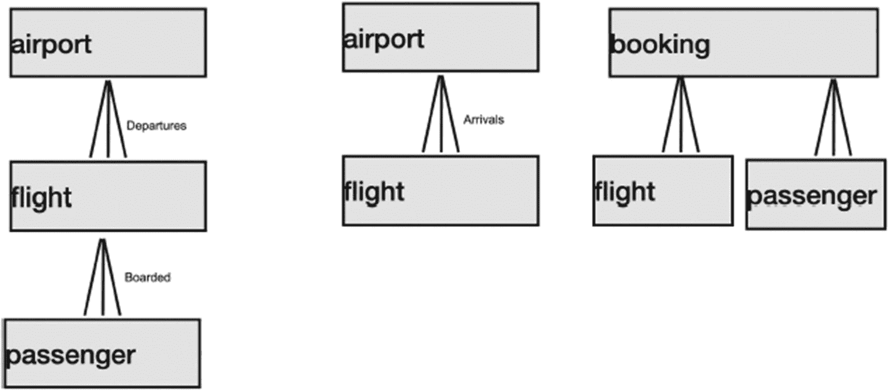
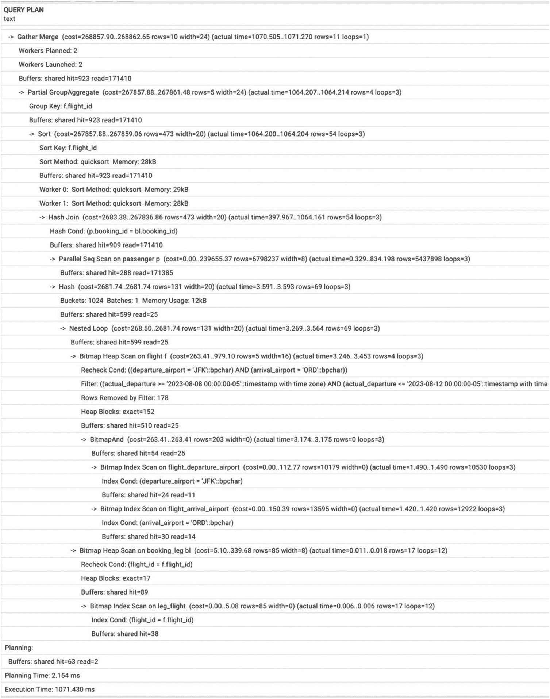
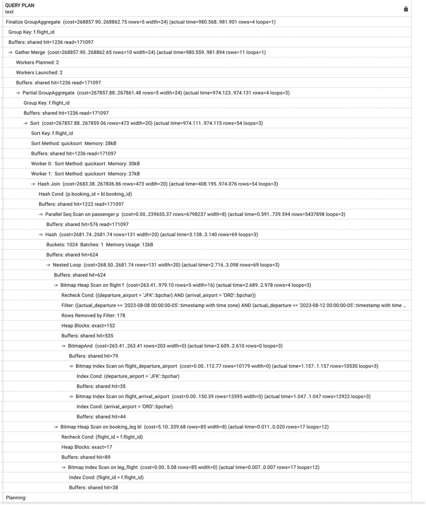
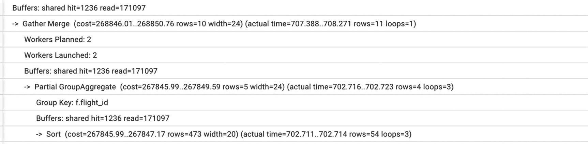
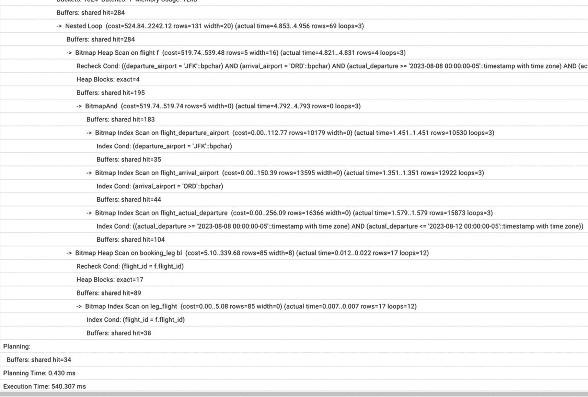
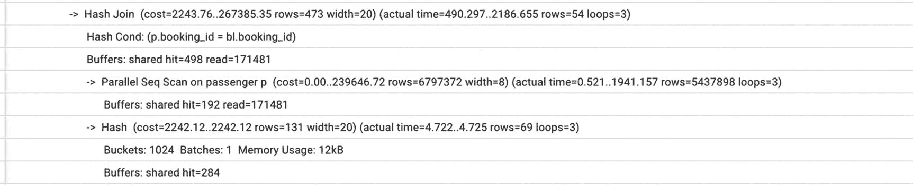
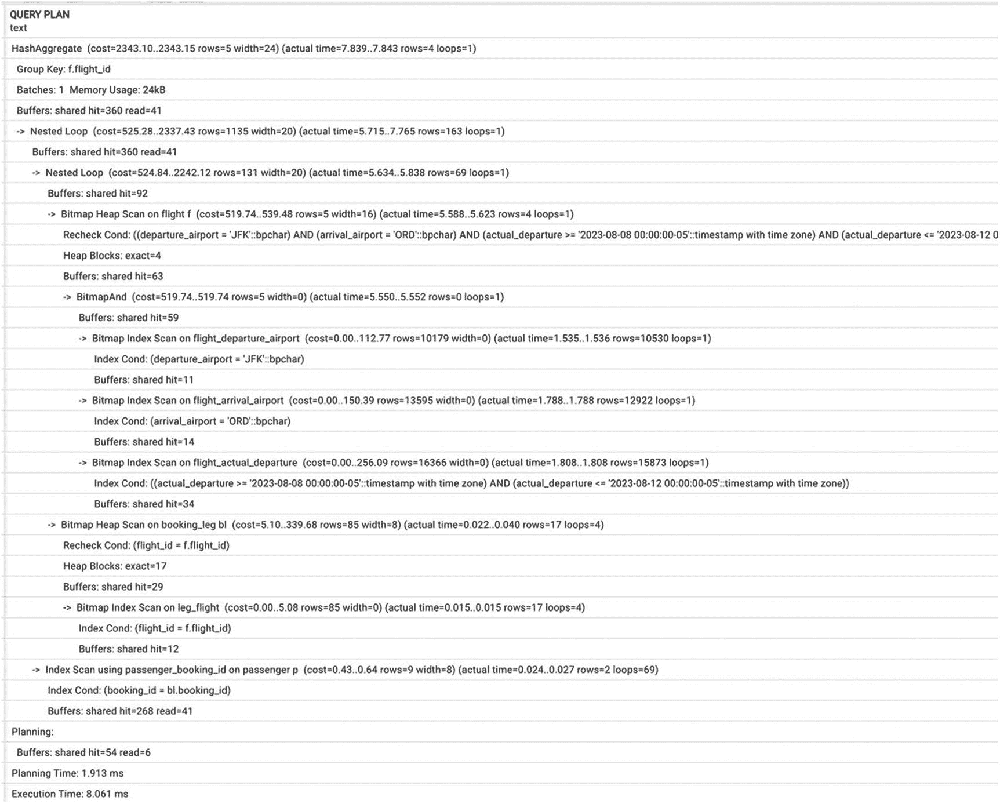

# 9. 设计至关重要

在引言中，我们提到优化始于需求收集和设计阶段。准确地说，它始于系统设计，包括数据库设计，但除非我们投入时间收集有关数据库中应包含对象的信息，否则无法得出正确的设计。在本章中，我们将讨论各种设计选项，并展示设计决策如何影响性能。


## 设计的重要性

第 1 章解释了存储电话号码信息的两种不同方案，如图 1-1 和 1-2 所示。让我们回到这个例子。

清单 9-1 展示了`postgres_air`模式中使用的表定义。`account`表包含用户账户信息，`phone`表包含与账户关联的所有电话号码信息。这种关系通过外键约束来支持。

清单 9-2 展示了一种替代设计，其中所有电话与账户信息存储在一起。

```sql
/* account table */
CREATE TABLE account(
account_id integer,
login text,
first_name text,
last_name text,
frequent_flyer_id integer,
home_phone text,
work_phone text,
cell_phone text,
primary_phone text,
update_ts timestamp with time zone,
CONSTRAINT account_pkey PRIMARY KEY (account_id),
CONSTRAINT frequent_flyer_id_fk FOREIGN KEY (frequent_flyer_id)
REFERENCES frequent_flyer (frequent_flyer_id)
);
```
清单 9-2
单表设计

```sql
/* account table */
CREATE TABLE account(
account_id integer,
login text,
first_name text,
last_name text,
frequent_flyer_id integer,
update_ts timestamp with time zone,
CONSTRAINT account_pkey PRIMARY KEY (account_id),
CONSTRAINT frequent_flyer_id_fk FOREIGN KEY (frequent_flyer_id)
REFERENCES frequent_flyer (frequent_flyer_id)
);
/*phone table */
CREATE TABLE phone(
phone_id integer,
account_id integer,
phone text,
phone_type text,
primary_phone boolean,
update_ts timestamp with time zone,
CONSTRAINT phone_pkey PRIMARY KEY (phone_id),
CONSTRAINT phone_account_id_fk FOREIGN KEY (account_id)
REFERENCES account (account_id)
);
```
清单 9-1
两表设计

`postgres_air`模式选择两表设计有多重原因；正如第 1 章所讨论的，许多人没有家庭固定电话或专用工作电话。许多人拥有不止一部手机或一个虚拟号码，比如 Google Voice。所有这些场景都可以通过两表解决方案得到支持，而无法适应单表解决方案，除非我们开始增加列来适应每种情况。在单表解决方案中标明主电话需要将其中一个号码重复填入`primary_phone`列，这为不一致创造了空间。从性能角度来看，两表解决方案也更有益。

在两表解决方案中，通过电话号码搜索账户是一个直接的`SELECT`语句：

```sql
SELECT
DISTINCT account_id
FROM phone
WHERE phone='8471234567'
```

该查询将使用索引仅扫描执行。

在单表设计中，类似的查询如下：

```sql
SELECT
account_id
FROM account
WHERE home_phone= '8471234567'
OR work_phone= '8471234567'
OR cell_phone= '8471234567'
```

为了避免全表扫描，必须建立三个不同的索引。

这是否意味着单表设计比两表设计差？这取决于数据的访问方式。如果该模式支持的是旅行社使用的系统，最可能的用例是需要根据电话号码提取客户账户。当客服人员询问客户电话号码时，客户不太可能指明电话的类型。

另一方面，考虑一份关于过去 24 小时内更新过的客户账户报告。这份报告应包含家庭电话、工作电话和手机，即使某些为空也应分别列在独立的列中，并且应包含过去 24 小时内有过任何修改（包括电话号码更新）的账户。在这种情况下，如清单 9-3 所示的单表解决方案要简单和高效得多。

```sql
SELECT *
FROM account
WHERE update_ts BETWEEN now()- interval '1 day' AND now();
```
清单 9-3
单表设计的使用

在两表设计中产生相同的结果则更为复杂——参见清单 9-4。

```sql
SELECT
a.account_id,
login,
first_name,
last_name,
frequent_flyer_id,
home_phone,
work_phone,
cell_phone,
primary_phone
FROM account a
JOIN (
SELECT
account_id,
max(phone) FILTER (WHERE phone_type='home')
AS home_phone,
max(phone) FILTER (WHERE phone_type='work')
AS work_phone,
max(phone) FILTER (WHERE phone_type='mobile')
AS cell_phone,
max(phone) FILTER (WHERE primary_phone IS true)
AS primary_phone
FROM phone
WHERE account_id IN (
SELECT
account_id
FROM phone
WHERE update_ts BETWEEN now()- interval '1 day' AND now()
UNION
SELECT
account_id
FROM account
WHERE update_ts BETWEEN now()- interval '1 day' AND now()
)
GROUP BY 1)  p
USING (account_id);
```
清单 9-4
使用两表设计的相同查询

这两个例子具有启发性的另一个原因是——两表解决方案更优的查询更可能出现在 OLTP 系统中，而单表解决方案表现更好的查询更可能出现在 OLAP 系统中。ETL 工具可用于将数据从 OLTP 系统转换为更适合商业智能需求的格式。

第 6 章展示了一个类似的情况，其中非最优的数据库设计导致了非最优的查询（见清单 6-26）。即使优化后的查询仍然相对较慢。这些例子说明了数据库设计对性能的影响，有时糟糕设计的负面后果无法通过改进查询或建立额外索引来补救。

本章后续部分将讨论可能对性能产生负面影响的最常见设计选择。

## 为何使用关系模型？

虽然之前的所有例子都是关系型的（因为 PostgreSQL 构建在关系模型之上），但我们知道许多人认为关系数据库已经过时或不流行了。像“关系数据库之后是什么？”这样的公开演讲会定期举行。

本节并非为关系数据库辩护。关系数据库无需辩护，而且到目前为止，还没有任何潜在的继任者获得接近可比水平的采用率。相反，目标是解释其他模型的局限性。

### 数据库的类型

那么，除了关系模型之外还存在哪些替代方案呢？目前使用的数据库系统和数据存储种类繁多，采用了各种各样的数据模型和存储技术。这些系统包括传统的基于行或基于列存储的关系系统、可扩展的分布式系统、流处理系统等等。

我们已经看到不止一个非关系型数据库系统经历了 Gartner 炒作周期，从过高期望的顶峰跌入幻灭的低谷。然而，值得注意的是，关系模型的核心是基于布尔逻辑的查询语言，而不是任何特定的数据存储方式。这可能是许多作为传统 RDBMS 替代品而创建的系统最终采用 SQL 变体作为高级查询语言，从而也采用了相关布尔逻辑的原因。

虽然关系数据库似乎远未被取代，但在新系统中开发和验证的技术已被证明有用并被广泛采用。三种流行的方法是实体-属性-值模型、键值存储和分层系统（后者通常被称为文档存储）。


### 实体-属性-值模型

在实体-属性-值（EAV）模型中，值是标量（通常是文本，以适应多种数据类型）。回顾第 6 章，该模型的特点是一个包含三列的表：第一列是实体的标识符，第二列是该实体属性的标识符，第三列是该实体对应属性的值。这种设计以“灵活性”为名，实际上意味着需求不精确或不明确。不出所料，这种灵活性是以性能为代价的。第 6 章介绍了 `custom_field` 表，指出这种设计并非最优，并展示了它如何对性能产生负面影响。即使应用了优化技术以避免多次表扫描，执行速度也相对较慢。

除了性能影响，这种设计还限制了数据质量管理。在第 6 章介绍的案例中，三个自定义字段包含三种不同类型的数据：`passport_num` 是数字，`passport_exp_date` 是日期，`passport_country` 是文本字段（应包含有效的国家名称）。然而，在 `custom_field` 表中，它们都存储在文本字段 `custom_field_value` 中，这不允许进行强类型检查或参照完整性约束。

### 键值模型

键值模型将复杂对象存储在单个字段中，因此结构不对数据库暴露。这样，提取对象的单个属性就变得非常复杂，实际上严重限制了数据库引擎执行超出通过主键返回单个对象之外的任务。在最极端的情况下，一种设计可能将除主键之外的所有字段打包到一个 JSON 对象中。

自从 PostgreSQL 在 9.2 版本中引入 JSON 支持以来，这种方法在数据库和应用程序开发人员中变得非常流行。JSONB 在 9.4 版本中被引入，并且在之后的每个版本中都有更多的增强功能。有了这种支持，定义为 JSON 的表列变得很常见。例如，来自 `postgres_air` 模式的 `passenger` 表可以按清单 9-5 所示的方式定义。

```sql
CREATE TABLE passenger_json (
passenger_id INT,
passenger_info JSON);
```
清单 9-5
包含 JSON 的表

清单 9-6 展示了 `passenger_info` JSON 的一个例子。

```json
{"booking_ref" : "8HNB12",
"passenger_no": "1",
"first_name" : "MARIAM",
"last_name" : "WARREN",
"update_ts" : "2023-04-17T19:45:55.022782-05:00",
}
```
清单 9-6
JSON 值示例

是的，建议的设计看起来是通用的，无论未来添加多少新数据元素，都不需要任何 DDL 更改。然而，同样的问题影响着这种设计，就像影响 EAV 模型一样。这种方法使得对标量值执行类型检查变得不可能，也无法定义参照完整性约束。此外，经常被忽视的是存储 JSON 所需的数据量大幅增加。确实，键名在每个记录中都是重复的。根据存储的值的类型和大小，数据量可能会增加好几倍。

本章稍后将讨论用于处理 JSON 字段的工具和方法。

### 层次模型

层次结构易于理解和使用。事实上，由于其易用性和相对较小的内存需求，层次结构在 20 世纪 60 年代首次在数据库中实现。当然，在那个时候，XML 和 JSON 都还不可用。只要所有内容都适合单一层次结构，这些结构就工作得很好。然而，一旦数据适合多个层次结构，使用层次结构就变得既复杂又低效。

让我们用 `postgres_air` 模式中的例子来说明，如图 9-1 所示。对于一个机场，离港航班列表是一个层次结构，而到港航班列表是另一个层次结构。登机牌可能与离港航班属于同一个层次结构。同时，它们也可能是完全不同的、从预订开始的层次结构的一部分。请注意，乘客和预订航段不适合在不重复的情况下放入同一个层次结构。



一个展示 3 个层次结构的框图。左侧：解释乘客预订航班，航班从机场离港。中间：解释航班到达机场。右侧：表示从预订开始的航班和乘客的层次结构。

图 9-1
postgres_air 模式中的层次结构示例

早期的层次数据库（如 IMS/360）向客户端应用程序提供了数据的多个层次视图，但在内部支持更复杂的数据结构。

### 融合各家所长

PostgreSQL 不仅仅是一个关系系统。它是对象关系型的，这意味着列数据类型不一定是标量。实际上，列可以存储结构化类型，包括数组、复合类型或表示为 JSON 或 XML 文档的对象。

负责任地使用这些功能，可以结合多种替代方法与更传统的关系功能，提供所有潜在的好处。

“负责任地”是这里的关键词。例如，PostgreSQL 允许前面部分提到的多层次结构方法。我们可以在数据库内部的关系结构之上为客户端应用程序构建层次结构表示。这种方法结合了两个世界的优点：数据可以通过关系查询的能力高效提取，而应用程序可以以友好的数据交换格式使用复杂对象。更多关于这种方法的细节在第 14 章中提供。

尽管本书不涵盖分布式系统，但值得一提的是，PostgreSQL 拥有一套庞大的扩展（不包含在基本发行版中的附加库），这些扩展支持分布式查询，包括查询除 PostgreSQL 之外的其他 DBMS。这些扩展被称为 `foreign data wrappers (FDWs)`，它们提供了几乎透明的方式来访问驻留在超过 60 种类型的 DBMS（包括关系型和非关系型）中的数据。


## 灵活性与效率和正确性之间的权衡

支持灵活设计的一个常见论点是“数据结构/模式定义可能会发生变化”。接着，论点认为添加一列是 DDL（数据定义）变更，而添加一行（在键值模型中）只是添加一行数据。

诚然，现实系统是演进的，为了充分反映这些变化，必须修改现有的数据结构。这可能涉及添加或删除某些属性、更改数据类型或更改关系的基数。然而，进行变更的必然性并不意味着必须使用替代模型，例如文档存储或键值系统。对数据库模式进行变更的成本，必须始终与这些灵活解决方案可能带来的性能和数据完整性缺陷进行权衡。

前一节提到了在非关系设计中创建任何完整性约束的困难。出于某种原因，人们普遍认为 NoSQL 数据库比关系数据库“更快”。这种说法在极少数情况下可能是真的，但在大多数情况下，情况恰恰相反。水平分布可能会带来性能提升，但这些提升会被需要采取额外步骤来验证数据完整性所带来的成本所抵消。由于在 EAV 和键值模型中创建索引的困难，还会出现其他潜在的性能问题。

例如，在 `custom_field` 表的情况下，`passport_exp_date` 应该是一个日期，并且经常需要与其他日期进行比较，例如与航班日期进行比较，以确保护照不会在出发日期之前过期。然而，这个日期存储在一个文本字段中，这意味着必须将其转换为日期类型才能执行类型特定的比较。此外，这种转换只能应用于包含日期类型值的行。

PostgreSQL 支持部分索引，因此可以仅为包含护照到期日期的行创建索引。然而，它们无法被索引为一种可以高效用作搜索条件的日期类型，因为无法使用像下面这样的易变函数来构建索引：

```
CREATE INDEX custom_field_exp_date_to_date
ON custom_field(to_date(custom_field_value, 'MM-DD-YYYY'))
WHERE custom_field_name='passport_exp_date'
```

这是因为所有日期/时间转换函数都是 `易变` 的，因为它们依赖于当前的会话设置。为了能够在索引中使用转换函数，需要编写一个自定义的转换函数。第 11 章将介绍如何创建用户定义函数。这个函数必须包含异常处理，这意味着格式错误的值将不会被索引。此外，与一开始就拥有一个 `date` 字段相比，搜索本身也会显著变慢。

那么，将所有属性打包到一个 JSON 列中的情况呢？会出现类似的索引问题。可以为 JSON 创建索引；例如，对于清单 9-5 中的 `passenger_json` 表，可以像清单 9-7 所示那样在 `booking_ref` 上创建索引。

```
CREATE INDEX passenger_j_booking_ref
ON passenger_json ((passenger_info ->> 'booking_ref'));
清单 9-7
为 JSON 列创建索引
```

它的速度会比在原始 `passenger` 表上创建索引慢，但会比顺序扫描效果好。然而，对于任何旨在是数字类型或包含日期的值，将遵循与前面示例相同的转换。

这并不是说这些非关系解决方案完全没有存在理由。

例如，一个描述欧盟某些法规的表大约有 500 列，并且每次法规变更时只添加一行，大约每五年添加一行。将该表替换为键值的一种变体（辅以几个描述值的附加列），使得数据库和应用开发人员都感到满意。由于数据规模的原因，不存在效率问题。

在考虑 JSON 列时，我们建议仅在数据只需要作为一个整体对象使用时才使用它们，例如存储外部文档（例如，外部来源的信用报告）。即使在这些情况下，如果某些将用于搜索条件的属性可以被分离出来，建议也将它们解析为额外的、独立的列进行存储，同时将其作为较大对象的组成部分存储。


## 我们必须进行规范化吗？

在关系理论中，几乎没有比“规范化”更被滥用的术语了。许多数据库管理员、数据库开发人员、系统架构师等人都宣称一个系统应该被“规范化”，但很少有人能描述出他们期望达成的结果，更不用说给出规范化的定义了。

这不只是自命不凡；并非所有从事数据管理工作的人都需要记住每种范式的定义。关系规范化算法在实践中并不常用。从这个意义上说，规范化是“已死”的理论，就像拉丁语是一种“已死”的语言。然而，学者们仍然发现学习拉丁语是有用的，同样，一些规范化知识对于良好的数据库设计至关重要。

非正式地说，如果一个数据库模式中所有列值仅依赖于表的主键，并且数据被分解到多个表中以避免重复，那么这个模式就是规范化的。

创建规范化模式的方法之一是从构建实体关系模型开始：如果实体被正确定义，从实体关系模型生成的数据库模式将是规范化的。可以说，实体关系设计隐含地包含了依赖关系的发现。如果模式没有规范化，通常表明缺失了一些实体。

对数据库模式进行规范化真的很重要吗？它有助于提升性能吗？通常情况，这要视情况而定。

规范化的首要目的*并非*提升性能。规范化创建了一个清晰的逻辑结构，并有助于确保数据完整性，尤其是在有参照完整性约束支持的情况下。规范化之所以必要，原因与关系模型的必要性相同：不一定是为了存储数据，而是为了确保数据完整性，并能够使用关系查询语言。逻辑结构与存储结构之间的映射不一定是一一对应的。理想情况下，应该为应用程序提供一个基于为性能优化的存储结构的清晰逻辑结构。

另一方面，现实世界中存在许多非规范化的实体，规范化并不能带来任何好处。最著名的例子是邮政地址。美国邮政地址由以下部分组成：街道地址、城市、邮政编码和州。

正如任何曾在自动化美国邮政局自助服务台寄送包裹的人所知，地址并没有被规范化。自动检查不允许您输入与先前输入的地址不匹配的邮政编码。然而，我们怀疑当地址存储在数据库表中时，是否有人会决定对它们进行规范化。

一个经常听到的支持非规范化数据结构的论点是“连接需要时间”，并且如果需要查询执行得更快，就需要进行反规范化。正如第 5 章所讨论的，如果构造得当，简短的查询用于连接的额外时间可以忽略不计，这不应该为了数据准确性而进行权衡。

然而，在某些情况下，规范化确实可以提升性能，例如，当我们需要选择具有高选择性的某个属性的不同值，或者一般来说，选择在非规范化表中重复出现的任何列子集时。在 `postgres_air` 模式中，`flight` 表中的航班 `status` 是显式指定的，这意味着要查找可能的航班状态列表，可以执行以下查询：

```sql
SELECT DISTINCT status
FROM flight
```

## 代理键的使用与误用

代理键是由系统生成的唯一值，用于标识存储在数据库中的对象。在 PostgreSQL 中，代理值可以通过从序列中选择获取。当插入一行时，使用伪类型 `serial` 指定的列会自动接收与该表关联序列的下一个值。

代理键被广泛使用。一些公司有内部标准，要求每个表都使用代理键。然而，代理键既有优点也有缺点。

代理键的优点是保证了分配给不同对象的值是唯一的。但是，代理键的值与对象的其他属性无关，当需要将存储的对象与现实世界的对象进行匹配时，它是无用的。

代理键的唯一性可能掩盖某些错误。一个现实世界的对象可能在数据库中以不同的代理键表示多次。例如，如果一次购买在系统中被注册了两次，客户的卡将为单个产品被扣费两次，并且没有人工干预很难解决该问题。话虽如此，虽然我们的建议是使用某个现实世界中唯一的属性作为主键，但这并不总是可行的。在存储超市所有购买的数据库中，无法区分同一客户在自助结账时随后扫描的两瓶可乐。源系统必须能够区分这两种情况：一次交易中购买两瓶可乐，与复制同一交易以购买一瓶可乐。同样，医院系统可能将一个患者与多个病历号关联；在这种情况下拥有一个代理键至关重要，以便将患者的所有临床数据存储在一起。

有时，表中存在代理键被错误地与规范化联系起来。使用代理键的要求通常被解释为使数据库模式规范化的一种方式。而且，确实，如果为每一行分配一个唯一标识符，一切都将是规范化的。但是，由于唯一标识符与现实世界的对象没有关联，结果可能是一个现实世界的对象映射到数据库中的多个条目。例如，我们曾见过一个系统，每当客户输入他们的地址时，如果该城市尚不在数据库中，系统就会为该城市分配一个唯一标识符。结果，系统最终有了六个不同版本的“芝加哥”。不用说，这与规范化无关，并且可能危及数据准确性和性能。

使用代理键也可能导致额外的连接。`flight` 表使用在现实世界中广泛使用的三字符代码引用 `airport` 表。在这个设计中，可以从航班表中提取机场代码：

```sql
SELECT
departure_airport,
arrival_airport,
scheduled_departure
FROM flight;
```

但是，如果机场表使用了代理键，返回机场代码将需要两次访问机场表：

```sql
SELECT
d.airport_code,
a.airport_code,
f.scheduled_departure
FROM flight f
JOIN airport d ON d.airport_id = f.departure_airport_id
JOIN airport a ON a.airport_id = f.arrival_airport_id
```

让我们更仔细地看看 `postgres_air` 模式中代理键的使用。

`postgres_air` 模式中 `airport` 表的定义如代码清单 9-8 所示。该表的主键是 `airport_code`。此列包含三字符代码，这些代码在全球所有航班预订系统中用于标识机场，并且这些代码永远不会改变。因此，它们作为唯一标识符是可靠的，不需要代理键。


### airport (机场)

```sql
CREATE TABLE airport(
airport_code char(3)NOT NULL,
airport_name text NOT NULL,
city text COLLATE NOT NULL,
airport_tz text NOT NULL,
continent text,
iso_country text,
iso_region text,
intnl boolean NOT NULL,
update_ts timestamptz,
CONSTRAINT airport_pkey PRIMARY KEY (airport_code)
);
```
代码清单 9-8
airport 表

同样，`aircraft`（航空器）由三位字符代码标识，我们使用这些代码作为 `aircraft` 表的主键——参见代码清单 9-9。

### aircraft (航空器)

```sql
CREATE TABLE aircraft (
model text,
range numeric NOT NULL,
class integer NOT NULL,
velocity numeric NOT NULL,
code text NOT NULL,
CONSTRAINT aircraft_pkey PRIMARY KEY (code)
);
```
代码清单 9-9
aircraft 表

对于 `booking`（预订）表（参见代码清单 9-10），我们使用了代理主键 `booking_id`，尽管预订有一个六字符的 `booking_ref` 可以唯一标识预订且永不改变。`booking_ref` 也是一个代理键，尽管它并非源自数据库序列。我们本可以使用 `booking_ref` 作为主键。因此，`booking_id` 列是冗余的，但如果预期未来需要从多个预订应用程序接收预订数据，它提供了一些面向未来的保障。这也使得该表的定义与许多工业系统中的定义相似。

### booking (预订)

```sql
CREATE TABLE booking (
booking_id bigint NOT NULL,
booking_ref text NOT NULL,
booking_name text,
account_id integer,
email text NOT NULL,
phone text NOT NULL,
update_ts timestamptz,
price numeric(7,2),
CONSTRAINT booking_pkey PRIMARY KEY (booking_id),
CONSTRAINT booking_booking_ref_key UNIQUE (booking_ref),
CONSTRAINT booking_account_id_fk FOREIGN KEY (account_id)
REFERENCES account (account_id)
);
```
代码清单 9-10
`booking` 表

`booking_leg`（预订航段）表（代码清单 9-11）将预订与航班关联起来。因此，该表的一个自然键应由 `flight_id` 和 `booking_id` 组成，即引用 `flight` 和 `booking` 表的两个外键。这对列本可以成为一个极好的主键。选择创建额外的代理键 `booking_leg_id` 是为了避免从依赖表（`booking_pass` 表，它是数据库中最大的表）引用复合键。

### booking_leg (预订航段)

```sql
CREATE TABLE booking_leg (
booking_leg_id SERIAL,
booking_id integer NOT NULL,
booking_ref text NOT NULL,
flight_id integer NOT NULL,
leg_num integer,
is_returning boolean,
update_ts timestamp with time zone,
CONSTRAINT booking_leg_pkey PRIMARY KEY (booking_leg_id),
CONSTRAINT booking_id_fk FOREIGN KEY (booking_id)
REFERENCES booking (booking_id),
CONSTRAINT flight_id_fk FOREIGN KEY (flight_id)
REFERENCES flight (flight_id)
);
```
代码清单 9-11
`booking_leg` 表

`passenger`（旅客）表需要一个代理键（参见代码清单 9-12），因为同一个人可能是多个预订的旅客，而且旅客不一定在预订系统中注册为客户（航班可能由他人代为预订）。

### passenger (旅客)

```sql
CREATE TABLE passenger(
passenger_id serial,
booking_id integer NOT NULL,
booking_ref text,
passenger_no integer,
first_name text NOT NULL,
last_name text NOT NULL,
account_id integer,
update_ts timestamptz,
CONSTRAINT passenger_pkey PRIMARY KEY (passenger_id),
CONSTRAINT pass_account_id_fk FOREIGN KEY (account_id)
REFERENCES account (account_id),
CONSTRAINT pass_booking_id_fk FOREIGN KEY (booking_id)
REFERENCES booking (booking_id),
CONSTRAINT pass_frequent_flyer_id_fk FOREIGN KEY (account_id)
REFERENCES account (account_id)
);
```
代码清单 9-12
`passenger` 表

没有明显的方法来标识 `account`（账户）；因此，必须为 `account` 表使用代理键，如代码清单 9-13 所示。

### account (账户)

```sql
CREATE TABLE account(
account_id SERIAL,
login text NOT NULL,
first_name textNOT NULL,
last_name text NOT NULL,
frequent_flyer_id integer,
update_ts timestamp with time zone,
CONSTRAINT account_pkey PRIMARY KEY (account_id),
CONSTRAINT frequent_flyer_id_fk FOREIGN KEY(frequent_flyer_id)
REFERENCES frequent_flyer (frequent_flyer_id)
);
```
代码清单 9-13
`account` 表

忠诚度计划客户可能通过卡号识别。然而，独立的代理键 `frequent_flyer_id` 便于替换丢失或被盗的卡片，无需将数据从一个客户记录映射或迁移到另一个，也不会丢失忠诚客户的数据。

相比之下，`flight` 表中的代理键 `flight_id` 是必需的。航班的自然标识由 `flight_num`（航班号）和 `scheduled_departure`（计划离港时间）组成。航班号在不同日期是相同的，而离港时间在不同日期可能不同，并且当航班已部分售出时，可能会有轻微更改（例如，晚 5-10 分钟）。`flight_id` 代表了具有特定航班号的航班的特定实例，如代码清单 9-14 所示。

### flight (航班)

```sql
CREATE TABLE flight (
flight_id serial,
flight_no text NOT NULL,
scheduled_departure timestamptz NOT NULL,
scheduled_arrival timestamptz NOT NULL,
departure_airport char(3) NOT NULL,
arrival_airport char(3) NOT NULL,
status text NOT NULL,
aircraft_code char(3) NOT NULL,
actual_departure timestamptz,
actual_arrival timestamptz,
update_ts timestamptz,
CONSTRAINT flight_pkey PRIMARY KEY (flight_id),
CONSTRAINT aircraft_code_fk FOREIGN KEY (aircraft_code)
REFERENCES aircraft (code),
CONSTRAINT arrival_airport_fk FOREIGN KEY (departure_airport)
REFERENCES airport (airport_code),
CONSTRAINT departure_airport_fk FOREIGN KEY (departure_airport)
REFERENCES airport (airport_code)
);
```
代码清单 9-14
`flight` 表

`boarding_pass`（登机牌）表（代码清单 9-15）有一个代理键，但它没有被任何其他表引用，因此是无用的。该表的自然键由两列组成：`flight_id` 和 `passenger_id`。

### boarding_pass (登机牌)

```sql
CREATE TABLE boarding_pass (
pass_id integer NOT NULL,
passenger_id bigint,
booking_leg_id bigint,
seat text,
boarding_time timestamptz,
precheck boolean,
update_ts timestamptz,
CONSTRAINT boarding_pass_pkey PRIMARY KEY (pass_id),
CONSTRAINT booking_leg_id_fk FOREIGN KEY (booking_leg_id)
REFERENCES booking_leg (booking_leg_id),
CONSTRAINT passenger_id_fk FOREIGN KEY (passenger_id)
REFERENCES passenger (passenger_id)
);
```
代码清单 9-15
登机牌 (Boarding pass)

## 本章总结 (Summary)

本章讨论了设计决策对性能的影响。讨论涵盖了关系模型内与规范化和代理键相关的选择，以及流行的非关系模型。探讨了这些模型的局限性，并提供了替代方法的示例。

## 10. 配置参数怎么办？(What About Configuration Parameters?)

本书引言提到，大多数时候，当人们谈论“数据库调优”时，他们假设所有性能问题都可以通过找出最优的 PostgreSQL 配置参数来解决。

尽管某些参数调优确实可以提高数据库性能，但我们通常谈论的是 10%、20%，在极少数情况下，如果参数先前设置得很差，最多可达 50% 的性能提升。这些数字听起来可能令人印象深刻，但单个查询优化通常能使查询运行速度提高数倍，在某些情况下甚至十倍或更多，而重构应用程序（正如我们将在第 11 章中看到的）可以将整体系统性能提升数百倍。

本章讨论了最重要的 PostgreSQL 配置参数。我们将展示它们对数据库性能的影响，并将这种影响与前面章节介绍的技术进行比较。


## PostgreSQL 配置参数概述

PostgreSQL 有超过 300 个配置参数，即使经验丰富的 DBA 也可能无法全部记住。如果你是一名应用开发者或数据库开发者，你可能甚至不知道 PostgreSQL 配置参数的存在，更不用说它们是什么以及有何含义了。这种“无知”情有可原，因为在实际环境中，普通用户对这些参数的设置没有任何发言权。的确，配置参数是为整个 PostgreSQL 实例设置的（一个实例可能包含多个数据库），因此任何单个用户获得的设置都与其他用户相同。坦率地说，在某些情况下，普通用户 `可以` 仅为他们自己指定一些参数，但让我们先稍安勿躁。

让我们来看一些对查询性能影响最大的配置参数。

### 内存分配

关于 PostgreSQL 内存分配参数存在很多迷思。互联网上的许多建议和公式是在多年前、多个 PostgreSQL 版本之前提出的，其中很多自那时起就从未被重新审视过。因此，这些推荐中有许多要么是错误的，要么只能作为初步近似值使用，后续还需要调整。

`shared_buffers`

存储在 PostgreSQL 数据库中的数据必须先从硬盘读取到主内存中，然后才能被任何人使用。为此目的分配的内存区域称为共享内存缓冲区。此参数设置数据库服务器使用的共享内存缓冲区的数量。64 GB 的限制源于旧版本的 Linux，如今已成迷思。这是 PostgreSQL 按其字面意义使用的少数几个与内存相关的参数之一，意味着它为共享缓冲区设置了硬性限制。此外，重置此参数需要重启实例。此值的唯一实际限制是，从总 RAM 中减去它后，应剩余足够的内存用于 `work_mem`（稍后讨论）。

*建议*：从 RAM 的 25% 开始，逐步增加，直到 `cache_hit_ratio` 接近 90%。

`effective_cache_size`

此参数是建议性的。它不预留任何内存，PostgreSQL 仅将其用于查询规划目的。它表示操作系统有多少内存可用于缓存数据（因此包括内存缓存、磁盘缓存、文件系统缓存等）。查询规划器使用它的方式并不直接，但该值设置得越高，使用索引而非顺序扫描的可能性就越大。

*建议*：通常建议设为 RAM 的 75%，但不是必须的（且此数字与 `shared_buffers` 的值无关）。

### 连接与会话

下一组参数与单个用户会话相关。

`max_connections`

此参数设置 PostgreSQL 实例可以同时处理的最大并发连接数。这是一个硬性限制；如果达到最大连接数，系统将变得无响应。除超级用户外，任何用户都将不被允许连接。这种情况将持续到超级用户终止一些连接为止。更改此参数需要重启系统。你可能会想，为什么这个限制是必要的？如果它不能动态更改，为什么不尽可能设得高一些，这样我们就永远不会遇到这些问题了？

在任何数据库中，过多的连接都是不可取的，因为每个连接即使在空闲时也会占用额外资源。最重要的资源是为每个会话分配的内存——我们将在下一节讨论细节。在应用端，这个问题通过设置应用连接池来解决，这样应用用户就不会启动新的数据库连接，而是使用可用池中已打开的连接之一。如果我们把 `max_connections` 的值设得非常高，系统可能会变得缓慢且无响应，因为没有足够的资源来支持所有连接。此外，PostgreSQL 内核本身存在一些内部限制，这使得在任何时候拥有超过几百个连接变得不可取。

既然我们已经描述了连接过多时可能出现的许多问题，我们应该注意到，这些“恐怖故事”并非必然发生，至少在一定程度上被夸大了。如果主机上有足够的硬件资源可用，即使设置几千个 `max_connections` 也可能运行良好。

*建议*：从几百个开始，观察系统行为，并相应调整。

`work_mem`

`work_mem` 设置控制每个查询操作节点可以使用的内存量，通常用于数据排序和哈希表。这也是一个硬性限制，意味着这是 PostgreSQL 将分配给任何查询节点的最大内存量。

任何需要超过此内存量的哈希操作都将 resort 到交换到磁盘，因此需要更长的时间才能完成。

一个众所周知的公式建议将系统总内存的 25% 除以 `max_connections`。因此，减少 `max_connections` 将允许使用更高的 `work_mem` 值。请注意，像许多其他情况一样，此公式假设主机只有一个数据库，因此在为该参数赋值时要谨慎。记住，PostgreSQL 不会执行任何计算来检查你的设置是否合理。在下一个会话无法从操作系统获得足够的 RAM 并抛出内存不足错误之前，每个人可能都很满意。

幸运的是，`work_mem` 是 PostgreSQL 参数中可以在会话内甚至事务持续时间内动态设置的参数之一。因此，一个可能的解决方案是从应用程序动态设置 `work_mem`。假设已知某个特定查询将要对大型数据集进行排序，那么增加该单个查询的 `work_mem`（注意不要过度分配）可能是有利的。

例如，如果会话需要 200 GB 的 `work_mem`，你可以运行以下命令：

```
set work_mem = '200GB';
```

这将设置会话的 `work_mem` 为新值，并允许该会话内的后续查询利用更多内存进行排序或哈希操作。要恢复到标准值，请运行：

```
reset work_mem;
```

`maintenance_work_mem`

此参数决定了用于维护操作（如 `VACUUM`、`CREATE INDEX`、`ALTER TABLE`、`ADD FOREIGN KEY` 和数据加载操作（例如 `COPY`）的最大内存量。这些操作在运行时可能会增加数据库服务器上的 I/O，因此为它们分配更多内存可能会使这些操作更快完成。也有一个计算此值的公式，但我们将在讨论 PostgreSQL `VACUUM` 过程时再探讨这个参数。


## 调优参数以获得更好性能

正如我们在本章开头所做的陈述（比较参数调优与查询调优带来的性能提升），要说明这一点尤为困难。要跟随本章的示例操作，你需要额外恢复一份干净的 `postgres_air` 数据库副本。或者，你也可以临时删除我们在前面章节中创建的索引，待实验完成后再恢复它们。让我们从清单 10-1 中呈现的查询开始。

```sql
SELECT
f.flight_no,
f.actual_departure,
count(passenger_id) passengers
FROM flight f
JOIN booking_leg bl ON bl.flight_id = f.flight_id
JOIN passenger p ON p.booking_id=bl.booking_id
WHERE f.departure_airport = 'JFK'
AND f.arrival_airport = 'ORD'
AND f.actual_departure BETWEEN '2023-08-08' and '2023-08-12'
GROUP BY f.flight_id, f.actual_departure;
Listing 10-1
待优化的查询
```

首先，我们将使用默认的内存分配参数来运行它：

```sql
shared_buffers=128MB
work_mem=4MB
```

为了观察缓冲区使用的变化，在本章中，我们使用带额外参数的 `EXPLAIN` 命令——`EXPLAIN (ANALYZE, BUFFERS, TIMING)`。此查询的执行计划如图 10-1 所示。



查询计划的截图。它包含几行检查机场预订的代码。规划时间为 2.154 毫秒，执行时间为 1071.430 毫秒。

图 10-1
使用默认内存分配的执行计划

查看此查询计划，我们看到优化器使用了 `flight` 表上的两个索引，然后扫描所有块以检查实际起飞时间。另请注意，`shared_buffers` 的数量不足（为获得一致的结果，请多次运行相同的查询或 `EXPLAIN ANALYZE`），并且 PostgreSQL 选择运行两个并行工作进程来加速此过程。总执行时间刚刚超过一秒。

由于我们没有对多个同时运行的查询进行建模，可能对查询执行时间产生实质性影响的参数是 `shared_buffers`（此更改需要重启）和 `work_mem`（可在会话中修改）。让我们首先尝试增加 `work_mem` 的大小，然后将 `shared_buffers` 参数更改为 1 GB，重启数据库，并重复 `work_mem` 的更改。

逐渐将 `work_mem` 增加到最高 1 GB，我们不会注意到执行计划和执行时间有任何显著变化。限制因素似乎是 `shared_buffers` 不足。我们没有看到任何磁盘使用，这意味着从一开始就有足够的 `work_mem`。图 10-2 展示了使用 128 MB `shared_buffers` 和 500 MB `work_mem` 的执行计划。执行时间在 1 秒左右波动。



查询计划的截图。它包含几行检查机场预订的代码，使用 128 兆字节共享缓冲区和 500 兆字节工作内存。它使用了哈希连接和嵌套循环。

图 10-2
使用增加的 work_mem 和默认 shared_buffers 的执行计划

现在，让我们将 `shared_buffers` 增加到 1 GB 并重启我们的 Postgres 实例。在开始测量执行时间之前，我们先运行几次此查询，以确保任何可以放入共享缓冲区的内容都已加载。

遗憾的是，执行时间的减少微不足道。执行计划将保持不变，由于 `shared_buffers` 的增加，读取次数略有减少（执行计划的一部分见图 10-3）。



查询计划的截图。它包含几行增加共享缓冲区后检查机场预订的代码。计划工作进程数为 2，已启动工作进程数为 2。

图 10-3
增加 shared_buffers 后执行计划的一部分，显示比图 10-2 更少的读取量

如果我们继续将 `work_mem` 增加到 200 MB、500 MB 和 1 GB，我们会注意到执行时间缓慢下降，最终低至 750 毫秒。然而，我们需要意识到，这种 `work_mem` 的增加对于多个会话同时运行的生产服务器来说是不可能的。无论如何，这个查询似乎并不太复杂。是否有其他方法可以提升其性能？

## 是否有更好的方法？

在我们实验期间产生的所有执行计划中，存在一个主要缺陷：Postgres 必须读取堆（表行）才能找到 `actual_departure` 在 8 月 8 日至 8 月 12 日之间的记录。这表明在此属性上创建索引可能会有帮助。让我们继续创建缺失的索引：

```sql
CREATE INDEX flight_actual_departure
ON flight (actual_departure);
```

立即，执行计划出现了差异（见图 10-4）。



查询计划的截图。它包含几行检查机场预订的代码。规划时间为 0.430 毫秒，执行时间为 540.307 毫秒。

图 10-4
在 actual_departure 列上带有索引的执行计划

此外，执行时间终于下降了，我们降到了 0.5 秒的执行时间。然而，差异仍然不如我们希望的那么显著。在检查新的执行计划时请注意，PostgreSQL 对 `passenger` 表执行了全表扫描（见图 10-5）。



查询计划的截图。它包含几行使用哈希连接检查机场预订的代码。桶数为 1024，批次数为 1，内存使用量为 12 千字节。

图 10-5
包含全表扫描的执行计划的一部分

注意到连接条件和 `booking_id` 字段上的外键约束，我们可能会假设在 `booking_id` 上创建索引可能会有帮助。事实上，当创建新索引时

```sql
CREATE INDEX IF NOT EXISTS passenger_booking_id
ON postgres_air.passenger
(booking_id);
```

……执行计划发生了巨大变化——见图 10-6。现在，总执行时间仅为 10 毫秒，**比最佳参数调优时少了五十倍**。



查询计划的截图。它包含几行使用 2 个索引检查机场预订的代码。规划时间为 1.913 毫秒，执行时间为 8.061 毫秒。

图 10-6
使用两个索引的执行计划

更重要的是，如果我们回滚系统参数至默认设置，并将 `shared_buffers` 减少到 128 MB，执行计划和执行时间都不会有任何变化。这并不奇怪——仔细观察图 10-6 中的新执行计划，既然现在没有大规模的表扫描，增加的共享缓冲区就不再需要了！

## 参数调优的其他局限性

当我们思考 PostgreSQL 配置参数的含义时，重要的是要记住，本质上我们只是在告诉查询规划器它有哪些可用的硬件资源。Postgres 并不清楚其运行主机的 RAM 大小、存储类型、可用核心数，以及同一主机上运行的其他系统。我们通过将参数设置为特定值来提供一些“输入参数”以供优化。

例如，如果在拥有 16 GB RAM 的主机上定义了`shared_buffers=128MB`，查询规划器将无法使用大部分可用内存。然而，它可能会选择其他方式来加速查询，例如像我们在图 10-3 中看到的那样，使用多个并行进程来运行查询。

反之亦然。如果我们有同样的 16 GB RAM，并为共享缓冲区分配了 4 GB，同时设置了`default work_mem=200MB`和`max_connections=700`，那么 Postgres 极有可能从操作系统收到“内存不足”的错误。

另一个例子：`random_page_cost`参数帮助优化器估算基于索引的访问成本。旧版 Postgres 中的默认值 4 反映了十年前可用磁盘的特性。如今，将这个值保持在 4 可能会阻止优化器选择最佳的执行计划。然而，如果系统使用较慢的磁盘，降低这个参数值会产生相反的效果。

## 结论

尽管为特定系统最优地设置 PostgreSQL 配置参数很重要，但这远不足以实现最佳性能。正如我们所展示的，参数调优通常能将系统性能提升百分之几十，在某些情况下甚至更多。同时，创建缺失的索引可以使查询运行快几十倍，并同时减少资源使用。

