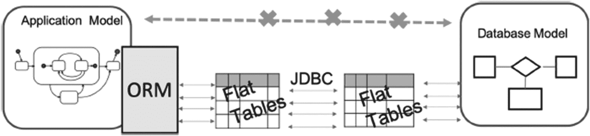
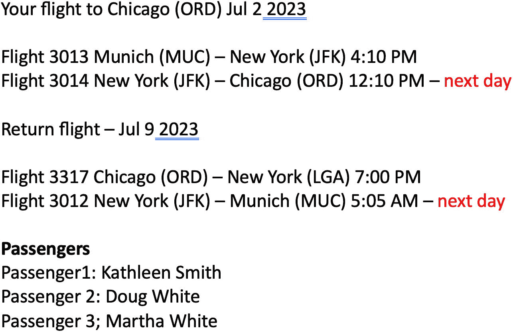
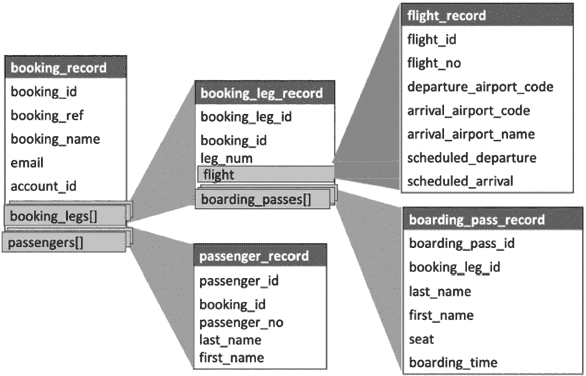

# 11. 应用程序开发与性能

在本书写到一半，已经介绍过多种技术之后，现在是时候退一步，探讨第 1 章中预示的额外性能方面了。我们当时写道，本书的方法比仅仅优化单个查询更为广泛。

数据库查询是应用程序的一部分，本章关注的是优化流程，而非单个查询。虽然这通常不被认为是传统意义上的“数据库优化”，但不解决流程缺陷很容易抵消掉从优化单个查询中获得的任何性能收益。而且，由于应用程序和数据库开发者都倾向于忽视这个潜在的改进领域，我们将要对此进行阐述。

## 响应时间至关重要

第 1 章列举了性能不佳的原因，并解释了为什么查询优化是必要的。当时没有涉及的是*为什么*应用程序需要高性能。

希望读到本书一半时，你还没有忘记你最初开始阅读的原因。也许，提升整体系统性能或系统特定部分性能的需求已经变得刻不容缓。然而，尽管听起来令人惊讶，但认为响应时间慢没什么大不了的观点仍然并不罕见。

我们断然拒绝这种观点：这*确实*是件大事，你无需深究，问问你的市场部门就能得到确认。在当今消费者的期望下，“时间就是金钱”这句老话再贴切不过了。

多项市场研究^(³)表明，网站或移动应用的快速响应时间对于吸引和维持流量至关重要。在大多数情况下，可接受的响应时间低于 1.5 秒。如果响应时间增加到超过 3 秒，50%的访问者会放弃该网站，其中超过四分之三的人永远不会回来。

具体的例子包括谷歌报告的数据，显示搜索速度减慢 0.4 秒会导致每天减少 800 万次搜索。另一个例子是亚马逊发现，页面加载时间减慢一秒钟会导致一年损失 16 亿美元的销售额。像这样的情况下，必须解决什么问题才能改善状况？

## 全球等待

如果你曾与开发数据库应用程序的应用开发者交谈过，或者你本身就是一名应用开发者，下面这句话可能听起来很熟悉：“应用程序运行得很好，直到它遇到了数据库！”

这句话，我们理解为“应用程序在与数据库交互时经常出现性能问题”，但通常被理解为“数据库很慢”，这让人相当沮丧。毕竟，DBMS 是专门设计用来提供*更快*数据访问的软件，而不是让事情变慢。

事实上，如果你询问监督同一项目数据库健康的 DBA，他们可能会回复说数据库运行得非常完美。如果是这样，为什么用户会体验到“全球等待”——无休止的加载屏幕和缓慢的响应时间呢？

通常，即使应用程序执行的每个单独的数据库查询在不到 0.1 秒内返回结果，应用程序页面的响应时间也可能达到十秒或更长。从 DBA 的角度来看，系统是高性能的，但最终用户的体验却很差。那么，问题不在于每个查询的执行速度，而在于应用程序与数据库之间的交互模式。

## 性能指标

第 1 章讨论了优化目标，提到许多性能指标，如客户满意度，是“外部”于数据库的，不能被优化器使用。事实上，这些指标不仅是数据库外部的，而且是整个应用程序外部的。

执行给定业务功能所需的时间难以衡量，因此也难以改进。追逐易于衡量的优化目标可能产生不良的激励。例如，应用程序开发者可以强迫用户点击十个按钮而不是一个，有时这会减少每个按钮的响应时间。这可能会改善某些基准测试结果，但几乎不会改善用户体验和满意度。

然而，这正是最终用户感兴趣的指标。他们不关心任何单个查询；他们关心的是整体体验。他们希望应用程序快速响应，不想盯着“等待”和“加载”屏幕。

## 阻抗失配

那么，导致整体性能不佳的根本原因是什么？

从非常普遍的角度来看，原因在于数据库模型与编程语言模型的不兼容性，这通常被称为 `impedance mismatch`（阻抗失配）。在电气工程中，阻抗是当电压施加时，电路对交流电电阻的广义概念。任何元件的阻抗相位角是该元件两端电压与通过该元件电流之间的相移；如果这个角度接近 90 度，即使电压和电流都很高，传递的功率也接近 0。

类似地，数据库查询语言的表达能力和效率与命令式编程语言的优势并不匹配。尽管两者都可能非常强大，但它们结合时可能产生的效果却不如预期。

命令式编程语言和声明式查询语言各自在完成其设计任务时都表现得极为出色。问题始于我们试图让它们协同工作之时。性能不佳的根源正是数据库模型与编程语言模型的不兼容性。

应用程序和数据库的设计旨在处理以下方面的操作：

*   不同大小的对象（粒度）——单个对象 vs. 批量（对象集合）
*   访问模式（遍历 vs. 通过属性值搜索）
*   不同的标识方式——地址 vs. 一组属性值

在本章剩余部分，我们将更详细地讨论这种不兼容性带来的后果。

## 一片好心铺就的道路

上述内容听起来像是我们在将每一个性能问题以及开发者不愿“像数据库一样思考”的责任归咎于应用程序开发者。但是，指责并非解决问题的建设性方式，包括解决糟糕的应用程序性能问题。更具建设性的方法是尝试理解，良好的初衷是如何导致如此痛苦的结果的。

让我们从审视一些常见的应用程序开发模式开始。

### 应用程序开发模式

最常见的现代软件工程架构模式是分层架构。通常，它包含四个层次：

*   最终用户界面
*   业务逻辑
*   持久化层
*   数据库

每一层只允许与相邻层通信，并且鼓励每一层内部，尤其是跨层之间的封装和独立性。在此模型中，业务对象“`customer`”完全不知道数据库表“`Customer`”的存在；事实上，只要持久化层定义了数据库数据与业务层对象之间的映射关系，它可以连接到任何任意的数据库。

这样做有几个重要原因，主要在于促进快速开发、可维护性、易于应用程序更新以及实现组件的可重用性。表面上显而易见的是，最终用户界面的变更不应实际导致数据库模式的更改。这种严格的分离也有利于并行快速工作：开发者可以处理应用程序的不同部分，并放心地知道，在他们负责的狭窄领域之外，应用程序的其他部分并不依赖于他们正在处理的内部结构或对象实现。当然，多个应用程序可以建立在同一套业务逻辑基础之上似乎也很有用——应用程序的内部逻辑不必为每个新的构建环境重复一遍。

到目前为止，一切顺利——那么问题出在哪里呢？不幸的是，存在许多陷阱，这种方法并未完全兑现其承诺的收益——至少，在其实现方式中是如此。

考虑一下集中业务逻辑的想法。首先，当“一个地方”变成了数十万行代码时，将所有逻辑放在一处（即业务层）的好处会有所减弱。在实践中，如此庞大的业务层会导致代码重复——或者更糟，尝试性重复。当业务逻辑层变得臃肿时，很难找到一个完全符合需求的功能——结果往往是，现实世界的业务逻辑在不同方法中以不同方式实现，导致结果各异。

其次，这种业务逻辑虽然可能可供额外的最终用户界面使用，但它无法供其他直接与数据库交互的业务用途使用——最关键的是报表。因此，报表编写者最终不得不在数据仓库中，或者更糟地在单个报表中，复制应用程序逻辑代码，且无法保证其与应用程序逻辑的等效性。

此外，采用这种方法时，与持久化层的通信通常仅限于单个对象甚至单个标量值，这实际上削弱了数据库引擎的强大功能。最终用户界面可能知道它需要的所有不同数据元素，但由于它不直接与持久化层通信，数据请求需要通过业务逻辑层进行中介。

持久化层的典型实现包含与业务对象类一一对应的数据访问类。编写基本的数据库 DML 函数（`INSERT`、`UPDATE`、`DELETE`）是直接了当的，但当需要对这个类的对象集合执行操作时会发生什么？有两条路径：开发者可以创建另一套方法，为对象集合实现相同的功能。然而，这将违反代码复用的原则。或者，更常见的情况是，开发者直接遍历集合，依次调用已定义的用于处理每个单独对象的函数。

想象一个列出从奥黑尔机场出发的所有乘客的应用程序界面。数据库开发者会认为，要列出所有从奥黑尔机场出发的乘客，他们需要将 `flight` 表与 `boarding_pass` 表进行连接。所有信息一次性返回。对于应用程序开发者来说，这个任务可能更棘手。他们可能有一个像 `get_flight_by_departure_airport()` 这样的方法，它接受一个机场代码作为参数并返回一个航班集合。然后，他们可以遍历这些航班，返回每个航班的所有登机牌。实际上，他们在应用程序内部实现了一个嵌套循环连接算法。

为了避免这种情况，他们可能会采用几种不同的解决方案。他们可以在登机牌对象中添加一个出发机场属性。然而，这会为数据完整性问题打开大门：如果航班记录中的航班起飞时间被更新了，但并非所有登机牌都更新了怎么办？或者，可以定义一个方法，根据航班出发机场检索登机牌，但这将违反对象之间相互不可知的准则。在纯粹的分层方法中，登机牌对象不知道航班对象的存在，航班对象也不知道登机牌。一个同时为两者拉取数据的方法，不应属于其中任何一个对象。

### 购物清单问题

斯特凡·法鲁尔^(⁴) 将前面描述的情况称为“购物清单问题”。

假设你有一张去杂货店的购物清单。在现实生活中，你会去杂货店，推一辆购物车，把清单上的所有物品拿上，结账，打包，带回家，放进冰箱。现在想象一下，如果你不是这样做的，而是每次去商店只拿清单上的第一件物品，然后回家放进冰箱，接着再去商店拿下一件！你会以这种方式处理清单上的每一项。

这听起来很荒谬吗？是的，但许多应用程序在与数据库交互时，恰恰就是这样做的。

现在想象一下，为了加快购物速度，专家们建议拓宽杂货店的过道，或者修建更好的道路，或者设计一种新型购物车。

其中一些建议确实可能有所帮助。但是，即使购物时间减少了 30%，与一个简单的流程改进相比——一次性采购所有物品——这也只是九牛一毛。

“购物清单问题”如何转化为应用程序行为呢？大多数性能问题都是由**太多太小的查询**引起的。正如如果我们继续为每件商品单独跑一趟，更好的高速公路也无法改善购物体验一样，以下常见的建议也无助于提高应用程序性能：

*   *更强大的计算机* 帮助不大，因为应用程序和数据库有 99%的时间都处于等待状态。
*   *更高的网络带宽* 也无济于事。高带宽网络对于批量数据传输是高效的，但无法显著改善往返所需的时间。时间取决于跳数和消息数量，而不主要取决于消息大小。此外，数据包头的大小与消息大小无关；因此，对于非常短的消息，用于有效载荷的带宽比例很小。
*   *分布式服务器* 可能提高吞吐量，但不能改善响应时间，因为应用程序是顺序发送数据请求的。

“太多太小的查询”这种反模式是一个已知了几十年的问题。大约 20 年前，我们中的一位曾分析过一个应用程序，它需要五到七分钟来生成一个包含约 100 个字段的 HTML 表单。应用程序代码结构完美，方法小巧、注释良好、格式漂亮。然而，数据库跟踪显示，为了生成这个表单，应用程序发出了大约 16,000 次查询——比表单上的字符还多。进一步分析表明，其中几千次查询来自`GetObjectIdByName`方法。每次调用之后，应用程序另一部分（可能由另一位开发者编写）的方法`GetNameByObjectId`又会触发一次查询。由于`name`的值是唯一的，因此第二次调用总是返回第一次调用的参数。而一次提取构建表单所需所有数据的单个查询，在不到 200 毫秒内就返回了结果。

面对这些可预见的问题，许多公司尝试了许多相同的、失败的补救措施来提高性能。即使他们最初能取得一些改善，也不会持久。例如，我们曾观察一家公司长达数年的优化努力。

由于 PostgreSQL 优化器总是试图利用可用的 RAM，这家公司不断增加硬件资源，确保整个数据库能放入主内存。他们从 512GB RAM 的机器迁移到 1TB、2TB，然后是 4TB 主内存，唯一的限制因素就是相应配置的可用性。每次迁移后，经过短暂的相对满意期，问题会再次出现：数据库增长变大，再次无法完全装入主内存。

另一种常实施的补救方法是使用键值存储，而不是全功能的数据库管理系统。其理由通常是“应用程序只使用主键访问数据，因此不需要查询引擎”。事实上，这种方法可能会改善单次数据访问的响应时间。然而，它无法改进完成一个业务功能所需的时间。在一个极端案例中，使用主键值检索一条记录平均需要大约十毫秒。同时，一个应用程序控制器操作中执行的数据库调用次数接近一千次，整体性能影响可想而知。

### 接口

应用程序与数据库交互次优的另一个原因在于接口层面。通常，应用程序使用诸如 ODBC 或 JDBC 之类的通用接口。这些接口将数据库简化视为一组扁平的表。实际上，应用程序和数据库都可以基于复杂的结构化对象进行操作；然而，没有办法通过这种接口传递如此高级别的结构。因此，即使数据库中维护着高级模型，应用程序也无法从中受益。

要传递一个复杂的数据库对象，应用程序被迫使用单独的查询来获取对象的每个部分，或者使用自定义解析方法，将通过接口返回的扁平表示反序列化为复杂的对象本身。

主导开发实践的不完善之处对专业人士来说是众所周知的。为什么这些实践如此普遍？

原因并非技术性的。应用程序开发者几乎总是在时间压力下工作。新产品或新功能有发布截止日期，而这个日期常常是“越早越好”。早期交付带来的经济收益远高于后期交付和更好质量所带来的收益。

## 欢迎来到 ORM 的世界

将数据库语言（即 SQL）与应用程序开发者隔离，从而简化他们的任务（并减少对数据库技能的需求），这一需求催生了将数据库功能转换为对象方法的软件。

*对象关系映射器*（ORM）是一种将数据库对象映射到内存中应用程序对象的软件。

一些 ORM 开发者声称阻抗失配问题已得到解决。对象与数据库表一一映射，数据库的底层结构以及用于与之交互的生成的 SQL，应用程序开发者都无需关心。不幸的是，这种解决方案的代价是不可接受的性能下降。

ORM 是如何工作的？该过程如图 11-1 所示。

1.  应用程序将一个对象分解为不可再分（标量）的部分。
2.  这些部分被单独发送到数据库或从数据库接收。
3.  在数据库中，虽然存在复杂的数据结构，但所有查询都是分别运行的。

将数据库模型映射到应用程序模型的 ORM 过程架构图。此过程涉及平面表和 JDBC。

图 11-1：ORM 工作原理

理论上，ORM 并不阻止应用程序运行任意的数据库查询；ORM 通常为此提供了方法。然而，在实践中，由于时间压力以及在应用程序中创建这些查询的简便性，几乎总是使用生成的查询。

由于实际的数据库代码对开发者是隐藏的，对对象集合的数据库操作最终以与非 ORM 解决方案非常相似的方式发生：ORM 方法从数据库返回一个对象 ID 列表，然后每个对象通过一个单独的查询（同样在 ORM 中生成）从数据库中提取出来。因此，为了处理 N 个对象，ORM 会发出 N+1 个数据库查询，有效地实现了上一节描述的购物清单模式。

这种映射解决了从数据存储细节抽象出来的问题，但并未提供操作数据集的有效手段。

此外，ORM 可能隐藏重要的实现细节。举一个在生产系统中观察到的例子：`Customer`对象上有一个`IsActive`标志，用于表示客户最近是否有活动。开发者可能认为这只是一个存储在数据库`customer`表中的属性，但实际上，它依赖于基于客户行为的一套复杂标准，并且每次调用该属性时都会运行这个查询。更糟糕的是，这个属性在代码中用于控制流程和根据客户状态显示不同内容的视觉组件，并被频繁检查。结果是，为了渲染单个页面，这个复杂的查询会运行多次。

## 寻求更好的解决方案

总结前面的内容，在应用层，用于表和集合的类和方法应该与数据库集成才能有效工作（方法应由数据库引擎执行）。然而，大多数架构不允许这种集成，这导致在应用层重新实现数据库操作。

这种特定的阻抗失配情况被称为*ORIM*——*对象关系阻抗失配*。

因此，应用程序和数据库之间通信的传统架构方式是应用程序缓慢的最重要来源。这里并无恶意：应用程序和数据库开发者都在用他们拥有的工具尽力而为。

为了解决这个问题，我们需要找到一种方法来*传输复杂对象的集合*。请注意，实际上我们是在为两个紧密相关的问题寻找解决方案。第一个问题是无法“一次性传输所有数据”，即无法以集合的方式思考和操作。第二个问题是无法在不事先分解的情况下传输复杂对象。

为了说明期望的结果，让我们看一个 Web 应用程序如何与`postgres_air`数据库交互的例子。当用户登录在线预订系统时，他们首先看到的很可能是他们现有的预订。当他们选择一个特定的预订时，他们会看到一个屏幕，看起来类似于图 11-2 中的截图。

预订的截图。它显示了 2023 年 7 月 2 日从慕尼黑飞往芝加哥的航班信息，以及 2023 年 7 月 9 日从芝加哥返回慕尼黑的返程航班详情。乘客是凯瑟琳·史密斯、道格·怀特和玛莎·怀特。

图 11-2：您的预订屏幕

屏幕上显示的信息来源于几个不同的表：`booking`、`booking_leg`、`flight`、`passenger`和`airport`。办理登机手续后，您还将看到登机牌。

使用传统方法开发的 Web 应用程序将访问数据库 17 次来显示这些结果：首先，选择当前用户的`booking_id`列表，然后从预订表中选择预订详情，接着选择每个航段（总共四个）的详情，然后选择每个航班（另外四个）的航班详情，再选择机场详情（另外四个），最后选择乘客详情（另外三个）。然而，应用程序开发者确切地知道需要构建什么对象来显示预订结果。在数据库端，数据库开发者同样知道如何选择构建此对象所需的每一片信息。对象的结构应如图 11-3 所示。

映射复杂对象的关系图。它呈现了预订记录、航段记录、乘客记录、航班记录和登机牌记录的变量。

图 11-3：映射复杂对象

如果我们可以将数据库端的数据打包成这样的对象，并通过一条命令将其发送给应用程序，数据库调用的次数将急剧减少。幸运的是，PostgreSQL 可以构建复杂对象。以下 PostgreSQL 特性使之成为可能：

*   PostgreSQL 是一个对象关系数据库。
*   PostgreSQL 支持创建自定义类型。
*   PostgreSQL 函数可以返回集合，包括记录集合。

后续章节将讨论返回记录集合的函数、对 JSON/JSONB 数据类型和自定义数据类型的支持，并将展示如何创建这些函数以及如何在应用程序中使用它们的示例。

## 总结

本章讨论了通常不被认为与数据库优化相关的额外性能方面。虽然严格来说，这不是关于优化查询，但它提出了一种优化整体应用程序性能的方法。正如我们经常指出的，SQL 查询并非在真空中执行；它们是应用程序的一部分，而应用程序和数据库之间通信的“中间”地带，过去和现在都经常被数据库和应用程序开发者忽略。

因此，我们擅自宣称拥有这片未知领域，并提出了一条改进路径。值得注意的是，本章没有提供任何实际的解决方案或任何“如何正确操作”的示例。后续章节将讨论几种技术，这些技术共同构成了一个强大的机制，以克服传统 ORM 的局限。

脚注 1   2

