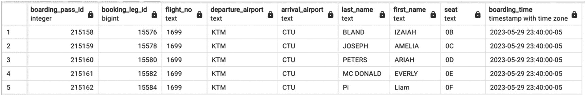
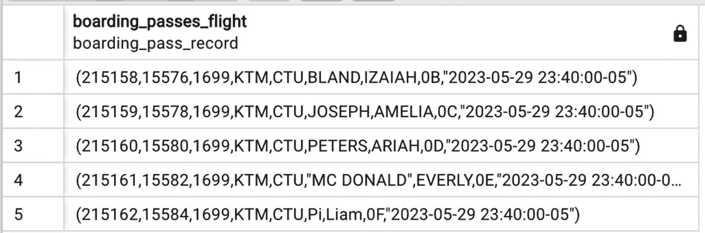

# 3.  在你执行一个函数（通常需要执行多次，如果存在多个代码路径的话）之前，你无法知道它是否正常工作。

关于 PostgreSQL 函数另一个重要的知识点，可以从前面的解释中总结出来，即函数在多个不同方面具有“原子性”。首先（令 Oracle 用户失望的是），你不能在 PostgreSQL 函数内启动事务，因此对于 DML 语句来说，总是“要么全部成功，要么全部失败”。其次，PostgreSQL 优化器在优化执行计划时，对函数执行一无所知，该计划包含了对用户定义函数的调用。例如，如果你执行

```sql
EXPLAIN SELECT num_passengers(13)
```

……执行计划看起来会像这样：

```sql
"Result (cost=0.00..0.26 rows=1 width=4)"
```

如果你需要弄清楚用于执行函数内部 `SELECT` 语句的执行计划是什么，你将需要提供一些实际值来替代参数，并为每个值运行 `EXPLAIN` 命令。

`CREATE FUNCTION` 操作符中的关键字之一（记住，我们并没有列出所有的关键字！）是 `COST`。它允许开发者显式设置函数执行的成本，供优化器使用。默认值是 100，我们不建议更改它，除非你有非常充分的理由。

## 函数与性能

简要介绍之后，现在该讨论本书的核心关注点了。函数如何影响性能？第 7 章讨论了代码因子化的主题，并概述了在命令式语言和 SQL 中进行代码因子化的不同影响。其中涵盖了几种可能的技术，并提到函数值得更详细的讨论，接下来就对此展开。

为什么在 PostgreSQL 中创建函数？在命令式语言中，使用函数是显而易见的选择：函数提高了代码的可读性，促进了代码的重用，并且对性能没有负面影响。相比之下，PostgreSQL 中的函数可能会提高代码可读性，但也可能降低代码可读性，并可能显著恶化性能。请注意“可能”这个词；本章的其余部分将讨论明智地使用用户定义函数的方法，使它们带来性能优势而非性能灾难。

### 使用函数如何降低性能

在前面的章节中，我们创建了函数 `num_passengers(int)`，它计算由函数参数指定的航班上的乘客数量。这个函数对于单个航班效果很好，在 150 毫秒内返回结果。

让我们看看如果这个函数被包含在 `SELECT` 列表中会发生什么。清单 12-13 选择了所有在 6 月 13 日至 7 月 13 日期间从 `ORD` 出发的航班，并为每个航班计算乘客总数。

```sql
SELECT
flight_id,
num_passengers(flight_id) AS num_pass
FROM flight f
WHERE departure_airport='ORD'
AND scheduled_departure BETWEEN '2023-07-05' AND '2023-07-13'
清单 12-13
在 SELECT 列表中使用函数会降低性能
```

这个语句的执行时间是 13 秒。现在，如果使用执行完全相同计算的 SQL 语句（清单 12-14）来代替，执行时间将只有 165 毫秒。

```sql
SELECT
f.flight_id,
count(*) AS num_pass
FROM booking_leg bl
JOIN booking b USING (booking_id)
JOIN passenger p USING (booking_id)
JOIN flight f  USING (flight_id)
WHERE departure_airport='ORD'
AND scheduled_departure BETWEEN '2023-07-05' AND '2023-07-13'
GROUP BY 1
清单 12-14
不使用函数获得相同的结果
```

为什么会有如此大的差异？在第 7 章中，我们解释了视图和 CTE 如何充当优化屏障。这种效果在函数身上更为明显。由于函数对于周围的 SQL 语句来说是一个真正的黑匣子，PostgreSQL 唯一的选择就是根据选中的行数尽可能多次地执行每个函数。

准确地说，由于对于来自同一会话的后续函数调用，PostgreSQL 使用预处理语句，因此可以节省一些时间，但这一事实既可能加速也可能减慢执行速度，因为执行计划不会考虑不同函数调用之间统计信息的差异。

即使差异不那么剧烈，有人可能会争辩说，为了便于代码维护，可以容忍适度的性能下降，但我们正在跨越一个用户愿意等待的时间阈值。而在这种情况下，函数内部的 SQL 非常轻量，执行只需几毫秒。

好吧，我们理解将 `SELECT` 语句嵌入到另一个语句的 `SELECT` 列表中执行并不是最好的主意。但是那些执行简单数据转换的函数呢？就像我们为类型转换创建的那些？在这种情况下，直到输出规模变得非常大之前，差异可能不会那么剧烈，但它仍然是可见的。

让我们比较一下清单 12-10 中语句的执行时间和清单 12-15 中语句的执行时间。

```sql
SELECT
passenger_id,
passport_num,
passport_exp_date
FROM passenger_passport
清单 12-15
不进行类型转换选择护照信息
```

两者都从一个单独的表中选择数据，且不应用任何过滤器，因此唯一的时间开销将是在 `SELECT` 列表中执行函数所引起的时间。`passenger_passport` 物化视图包含超过 1600 万行。清单 12-15 中语句的执行时间是七秒。如果我们不调用函数而使用类型转换（清单 12-16）

```sql
SELECT
passenger_id,
passport_num::numeric,
passport_exp_date::date
FROM passenger_passport
清单 12-16
使用类型转换选择护照信息
```

……执行时间将是九秒。运行清单 12-10 中的语句，执行时间将是 40 秒！请注意，在这种情况下，执行时间的显著增加是异常处理的结果，这创建了一个隐式的检查点。

在这个特定的情况下，除了从一开始就设计一个更好的方案之外，几乎无法采取什么措施来提高性能，但在本书后面，我们将回顾其他示例，在这些示例中可以实现一些性能改进。

### 函数是否有提升性能的机会？

回顾了这么多函数对性能产生负面影响的例子，人们可能会想，是否存在函数能够提高性能的条件。像许多其他情况一样，这要看情况。

如果我们谈论的是提高单个 SQL 语句的性能，将其包装在函数中并不能使其运行得更快。然而，当优化一个过程时，函数可能非常有帮助。

## 函数与用户定义类型

到目前为止的所有函数示例中，我们构建的函数都返回标量值。现在，让我们看看返回用户定义数据类型的函数能提供哪些额外的好处。


## 用户自定义数据类型

除了其自身丰富的数据类型集合外，PostgreSQL 还允许创建几乎无限数量的用户自定义数据类型。

用户自定义类型可以是简单的或复合的。简单的用户自定义类型包括以下类别：域（domain）、枚举（enum）和范围（range）。

以下是简单类型创建的示例：

```sql
CREATE DOMAIN timeperiod  AS tstzrange;
CREATE TYPE mood AS ENUM ('sad', 'ok', 'happy’);
CREATE TYPE mood_range AS RANGE...
CREATE TYPE 
```

正如我们可以定义基本类型的数组一样，我们也可以定义用户自定义类型的数组：

```sql
DECLARE
v_moods_set mood[];
```

当我们创建一个复合类型时，会有更多选项可用。

复合类型代表一行或一条记录。一个类型定义由字段名序列及其各自的数据类型组成。例如，清单 12-17 定义了类型 `boarding_pass_record`。

```sql
CREATE TYPE boarding_pass_record AS (
boarding_pass_id int,
booking_leg_id bigint,
flight_no text,
departure_airport text,
arrival_airport text,
last_name text,
first_name text,
seat text,
boarding_time timestamptz
);
```
**清单 12-17**
类型 `boarding_pass_record`

既然类型 `boarding_pass_record` 已定义，我们就可以声明此类型的变量，就像声明基本类型的变量一样：

```sql
DECLARE
v_new_boarding_pass_record boarding_pass_record;
```

而且，我们还可以创建返回复合类型集合的函数。

## 返回复合类型的函数

为什么函数能够返回复合类型集合这一点如此关键？我们为什么想要这样做呢？回想一下第 9 章，我们需要能够从数据库中检索整个对象，而不是一个接一个地获取其组成部分。现在，之前讨论的一切都可以结合起来了。

让我们构建一个例子。在清单 12-18 中，我们展示了一个返回指定航班所有登机牌的函数。

```sql
CREATE OR REPLACE FUNCTION boarding_passes_flight (p_flight_id int)
RETURNS SETOF boarding_pass_record
AS
$body$
BEGIN
RETURN QUERY
SELECT
pass_id,
bp.booking_leg_id,
flight_no,
departure_airport::text ,
arrival_airport ::text,
last_name ,
first_name ,
seat,
boarding_time
FROM flight f
JOIN booking_leg bl USING (flight_id)
JOIN boarding_pass bp USING(booking_leg_id)
JOIN passenger USING (passenger_id)
WHERE bl.flight_id=p_flight_id;
END;
$body$
LANGUAGE plpgsql;
```
**清单 12-18**
返回航班所有登机牌的函数

要执行此函数，请运行以下命令：

```sql
SELECT * FROM boarding_passes_flight(13);
```

此 SELECT 语句的结果如图 12-1 所示。



截图展示了登机牌航班的结果数据库。它列出了 10 列和 5 行数据。列标题为序列号、登机牌 ID 和预订航段 ID、航班号、出发和到达机场、姓氏、名字、座位和登机时间。

**图 12-1**
执行函数 `boarding_passes_flight` 的结果

现在，让我们创建另一个函数，该函数将仅根据 `pass_id` 选择一张登机牌。请注意，由于这两个函数都接受单个整数参数，因此在这种情况下无法使用重载。新函数如清单 12-19 所示。

```sql
CREATE OR REPLACE FUNCTION boarding_passes_pass (p_pass_id int)
RETURNS SETOF boarding_pass_record
AS
$body$
BEGIN
RETURN QUERY
SELECT
pass_id,
bp.booking_leg_id,
flight_no,
departure_airport::text ,
arrival_airport ::text,
last_name ,
first_name ,
seat,
boarding_time
FROM flight f
JOIN booking_leg bl USING (flight_id)
JOIN boarding_pass bp USING(booking_leg_id)
JOIN passenger USING (passenger_id)
WHERE pass_id=p_pass_id;
END;
$body$
LANGUAGE plpgsql;
```
**清单 12-19**
返回一张登机牌的函数

当我们执行此函数时

```sql
SELECT * FROM boarding_passes_pass(215158);
```

……结果将是一个只包含一行的集合，但其结构将相同（参见图 12-2）。


截图展示了登机牌 pass 的结果数据库。它列出了 10 列和 1 行数据。列标题为序列号、登机牌 ID 和预订航段 ID、航班号、出发和到达机场、姓氏、名字、座位和登机时间。

**图 12-2**
执行函数 `boarding_passes_pass` 的结果

为什么使用这些函数能提高性能？正如我们在第 10 章讨论的，应用程序很少直接执行 SQL 语句；相反，它们通常使用 ORM 在后台生成的 SQL 语句。在这种情况下，登机牌、乘客和航班很可能可以通过不同的方法访问。这意味着，为了选择函数 `boarding_passes_flight` 返回的相同数据，我们很可能需要一种方法来选择航班的出发机场、到达机场和计划出发时间（该航班作为参数传递给此函数），另一种方法来选择该航班的所有预订航段，再一种方法选择登机牌，还有一种方法选择乘客信息。如果能够说服应用程序开发人员，将这些操作合并到一个函数中，将带来巨大的性能提升。

使用登机牌函数为拥有 600 名乘客的航班选择所有登机牌需要 220 毫秒，运行 `SELECT * FROM boarding_passes_flight(13650)`。另一方面，从任何表中进行任何单独的 SELECT 操作大约需要 150 毫秒。由于每个进程都将数据返回给应用程序，进行一次往返通信，因此执行时间会累加——使用多次调用会很快超过函数的执行时间。

之前我们了解到，对于标量函数，语法 `SELECT * FROM function_name` 和 `SELECT function name` 之间没有区别。但是当函数返回复合类型时，就存在区别了。

图 12-1 显示了运行以下语句的结果

```sql
SELECT * FROM boarding_passes_flight(13)
```

图 12-3 显示了以下语句的结果



截图展示了登机牌航班的结果数据库。它列出了 2 列和 5 行数据。列标题为序列号和 boarding_passes_flight。

**图 12-3**
作为记录集合的函数结果

```sql
SELECT boarding_passes_flight(13)
```


## 使用具有嵌套结构的复合类型

复合类型能否用作其他复合类型的元素？是的，PostgreSQL 允许这样做。

在图 11-4 中，我们展示了复杂对象 `booking_record` 的结构。其组件之一是复杂对象 `booking_leg_record`。为了将此对象的表示构建为复合类型，首先需要创建 `flight_record` 类型和 `boarding_pass_record` 类型，然后继续创建 `booking_leg_record` 类型，如代码清单 12-20 所示。

```sql
CREATE TYPE flight_record AS(
flight_id int,
flight_no text,
departure_airport_code text,
departure_airport_name text,
arrival_airport_code text,
arrival_airport_name text,
scheduled_departure timestamptz,
scheduled_arrival timestamptz
);
CREATE TYPE booking_leg_record AS(
booking_leg_id int,
leg_num int,
booking_id int,
flight flight_record,
boarding_passes boarding_pass_record[]
);
```
**代码清单 12-20: 更多记录类型定义**

`booking_leg_record` 类型包含的元素之一是复合类型 `flight_record`，另一个组件是 `boarding_pass_record` 元素的数组。

看起来我们解决了第 11 章提出的问题：我们可以创建具有嵌套结构的复合类型，也可以创建返回此类对象的函数。然而，仍然有大量问题需要解决。

为了说明剩余的问题，让我们创建一个函数，它将使用 `booking_leg_id` 返回整个 `booking_leg_record` 对象。该函数的代码如代码清单 12-21 所示。

```sql
CREATE OR REPLACE FUNCTION booking_leg_select (p_booking_leg_id int)
RETURNS SETOF booking_leg_record
AS
$body$
BEGIN
RETURN QUERY
SELECT
bl.booking_leg_id,
leg_num,
bl.booking_id,
(SELECT row(
flight_id,
flight_no,
departure_airport,
da.airport_name,
arrival_airport,
aa.airport_name ,
scheduled_departure,
scheduled_arrival)::flight_record
FROM flight f
JOIN airport da on da.airport_code=departure_airport
JOIN airport aa on aa.airport_code=arrival_airport
WHERE flight_id=bl.flight_id
),
(SELECT array_agg (row(
pass_id,
bp.booking_leg_id,
flight_no,
departure_airport ,
arrival_airport,
last_name ,
first_name ,
seat,
boarding_time)::boarding_pass_record)
FROM flight f1
JOIN  boarding_pass bp ON f1.flight_id=bl.flight_id
AND bp.booking_leg_id=bl.booking_leg_id
JOIN passenger p ON p.passenger_id=bp.passenger_id)
FROM booking_leg bl
WHERE bl.booking_leg_id=p_booking_leg_id
;
END;
$body$ language plpgsql;
```
**代码清单 12-21: 返回具有嵌套结构的复杂对象的函数**

不要被前面这个冗长的函数吓到——它确实长，但不算太复杂。我们来仔细看看。

主 `SELECT` 语句从 `booking_leg` 表中提取数据，使用函数参数值作为搜索条件。记录的前三个元素——`booking_leg_id`、`leg_num`、`booking_id`——直接来自 `booking_leg` 表。记录的下一个元素是 `flight_record`，其中的 `flight_id` 来自所选航段的 `flight_id`。这个条件在内部 `SELECT` 的 `WHERE` 子句中设置：

```sql
WHERE flight_id=bl.flight_id
```

我们选择与所选航段相关的航班信息。

内部函数 `row()` 从一组元素构建行，并且这行被强制转换为 `booking_leg_record` 中期望的 `flight_record` 类型。

`booking_leg_record` 的最后一个元素是登机牌数组——数量与该预订中的乘客数相同。让我们仔细看看这个内部 `SELECT`：

```sql
(SELECT array_agg (row(
pass_id,
bp.booking_leg_id,
flight_no,
departure_airport ,
arrival_airport,
last_name ,
first_name ,
seat,
boarding_time)::boarding_pass_record)
FROM flight f1
JOIN  boarding_pass bp ON f1.flight_id=bl.flight_id
AND bp.booking_leg_id=bl.booking_leg_id
JOIN passenger p ON p.passenger_id=bp.passenger_id)
```

你首先会注意到，这个查询与我们在 `boarding_pass_flight` 函数中使用的查询基本相同。不同之处在于：

*   无需再与 `booking_leg` 表连接，因为它已在外部 `SELECT` 中被选中。我们仍然需要来自 `flight` 表的信息，但我们可以使用所选航段的 `flight_id`。这样，就与 `flight` 表的一行产生了一个笛卡尔积。
*   同样，对于登机牌，也不需要连接 `booking_leg` 表；我们直接使用已有的 `booking_leg_id`。

最后，我们使用内部函数 `array_agg()` 创建一个单一的*记录数组*，这正是 `booking_leg_record` 期望的最后一个元素。

**注意：** 以上只是构建具有嵌套结构的对象的多种方法之一。在后续章节中，我们将介绍其他方法，这些方法在其他情况下可能更有用。

现在，坏消息来了。我们费了这么大劲创建这个函数，可当执行它时，结果却有些令人失望。执行

```sql
SELECT * FROM booking_leg_select (17564910)
```

结果如图 12-4 所示。


一张截图展示了一个航段选择的结果数据库。它列出了 5 列和 1 行数据。列标题依次为序号、航段 ID、航段编号、预订 ID 和航班。

**图 12-4: 返回的具有嵌套结构的复杂对象**

结果集看起来正是我们想要的，但请注意一个重要细节。对于标量元素，PostgreSQL 保留了元素名称（就像我们从表中选择时一样），但当涉及到本身是复杂对象的元素时，其结构并未展现出来。注意，在内部，PostgreSQL 仍然保留着内部类型结构的概念，但它并未将其传达给上层。

为什么这是个问题？第 11 章讨论了 ORM 的陷阱，并在图 11-3 中勾勒了一个假设的解决方案。当时，我们没有讨论实现这一目标的任何具体细节，但有了能够返回复杂类型的函数，解决方案似乎触手可及。然而，当应用程序既无法识别元素名称也无法识别其类型时，函数的输出就变得无用了，至少对于直接从应用程序调用的目的而言是这样。

解决方案在第 14 章，但现在，让我们专注于那些返回不包含嵌套结构的记录的函数。


## 函数与类型依赖性

第 7 章在讨论视图和物化视图时提到了依赖性。对于物化视图，如果不先删除该对象，就无法更改其定义。这反过来意味着所有依赖对象都必须被删除并重新创建，即使物化视图的名称和列数没有改变。如果这些依赖对象又被用于其他视图或物化视图，那么它们的依赖对象也必须被删除。

这可能导致一些极其不希望看到的后果。我们在生产系统中观察到这样的情况：一次改动导致超过 60 个依赖对象被级联删除，并且必须按照特定顺序重新构建。

幸运的是，函数没有这个问题。由于函数体中的 SQL 语句在创建函数时不会被解析，因此不存在对函数体中使用的表、视图、物化视图、其他函数或存储过程的依赖。因此，函数只需要在实际需要变更时才重新创建，而不是仅仅因为级联删除。

然而，函数引入了一种新的依赖类型：函数依赖于其返回的类型，包括用户定义类型。与物化视图类似，用户定义的数据类型如果不先删除，就无法修改。要删除一个类型，所有将其作为元素的其他用户定义类型以及所有依赖该类型的所有函数都必须被删除。这听起来可能是个更糟糕的问题，但实际上，这恰恰是正确的问题。如果修改了一个用户定义类型，那么它的一些元素必定被添加、移除或更改了。这反过来意味着返回该类型记录的 `SELECT` 语句必须被修订，因此函数应该被删除。

此外，与创建物化视图可能需要一些时间不同，创建函数几乎是瞬间完成的。

## 使用函数进行数据操作

到目前为止，本章只考虑了选择数据的函数。但 PL/pgSQL 函数允许使用任何 SQL 命令，包括 DML 函数。

清单 12-22 是一个为乘客签发新登机牌的函数。

```sql
CREATE OR REPLACE FUNCTION issue_boarding_pass(
p_booking_leg_id int,
p_passenger_id int,
p_seat text,
p_boarding_time timestamptz)
RETURNS SETOF boarding_pass_record
AS
$body$
DECLARE
v_pass_id int;
BEGIN
INSERT INTO boarding_pass
(passenger_id,
booking_leg_id,
seat,
boarding_time,
update_ts)
VALUES (
p_passenger_id,
p_booking_leg_id,
p_seat,
p_boarding_time,
now()) RETURNING pass_id INTO v_pass_id;
RETURN QUERY
SELECT  * FROM boarding_passes_pass(v_pass_id);
END;
$body$
LANGUAGE plpgsql;
Listing 12-22
创建一个新的登机牌
```

请注意此函数体中对函数 `boarding_passes_pass` 的调用。这个函数是之前创建的，但即使它不存在，`CREATE FUNCTION` 操作符也不会报错，直到这个函数被执行。这种行为有利有弊。它在开发过程中提供了更大的灵活性，但也可能带来问题，因为被嵌入的函数已被移除或无法正常工作这一事实可能未被察觉。执行此函数与其他函数相同：

```sql
SELECT * FROM issue_boarding_pass(175820,462972, '22C', '2023-06-16 21:45'::timestamptz)
```

请注意，这次执行没有太大意义，因为航班已经在过去起飞了，此处仅用于说明目的。图 12-5 展示了这次执行的结果——数据格式与其他返回登机牌的函数相同。


一张截图展示了已签发登机牌的结果数据库。它列出了 10 列和 1 行数据。列标题为序列号、登机牌和预订段 I D、航班号、出发和到达机场、姓氏、名字、座位和登机时间。

图 12-5

返回用户定义类型的 DML 函数

创建此函数时，我们做了一些在现实生活中不一定成立的假设。例如，该函数不检查该乘客和该航班是否已经签发了登机牌，不检查座位图中的座位可用性，并且不捕获 `INSERT` 时可能出现的错误。在生产环境中，这个函数会复杂得多。

## 函数与安全

在本书中，我们不涉及 PostgreSQL 中的数据访问控制/权限，主要是因为这个主题与性能无关。不过，我们将稍微介绍一下如何为 PostgreSQL 函数设置安全，以及函数安全设置与性能之间一个令人惊讶的联系。

之前未涉及的 `CREATE FUNCTION` 操作符中的一个参数是 `SECURITY`。该参数只有两个允许的值：`INVOKER` 和 `DEFINER`。前者是默认值；它表示函数将使用调用该函数的用户的权限集来执行。这意味着，为了能够执行函数，用户应该对函数体中使用的所有数据库对象拥有相关的访问权限。如果我们明确指定 `SECURITY DEFINER`，函数将使用创建该函数的用户的权限执行。请注意，与其他数据库对象权限不同，任何函数的执行权限默认授予 `PUBLIC`。

你们中的许多人（以及我们，本书作者）都遇到过这样的情况：一个有影响力的业务用户需要访问一些关键数据，但你不想给他们 `READ ALL` 访问权限，因为你对他们的 SQL 技能以及他们的查询是否会导致整个系统崩溃不完全确定。

在这种情况下，一个折衷方案可能是——你创建一个函数，使用一个高性能的查询来提取所有必要的数据，用 `SECURITY DEFINER` 参数创建这个函数，从所有人（从 `PUBLIC`）那里撤消执行权限，然后给这个有影响力的用户执行权限。操作步骤如清单 12-23 所示。

```sql
CREATE FUNCTION critical_function (par1 ...)
RETURNING SETOF...
AS $FUNC$
...
END:
$FUNC$
LANGUAGE plpgsql
SECURITY DEFINER;
--
REVOKE EXECUTE ON critical_function (par1 ...)
FROM public;
GRANT EXECUTE ON critical_function (par1 ...)
TO powerbusinessuser;
Listing 12-23
SECURITY DEFINER 函数的使用
```


## 业务逻辑如何处理？

在您能说服应用开发者使用函数与数据库通信的情况下，性能提升是显著的。仅仅消除多次往返这一事实，当我们衡量的是应用程序响应时间而非数据库响应时间时，就足以轻松地将应用程序性能提升数十倍甚至数百倍。

通往成功道路上最严重的阻碍之一就是 `业务逻辑` 的概念。其中一个定义（来自 [Investopedia.com](http://investopedia.com)）是这样的：

> `业务逻辑` 是处理数据库和用户界面之间信息交换的定制规则或算法。业务逻辑本质上是计算机程序的一部分，其中包含定义或约束企业如何运营的信息（以业务规则的形式）。

业务逻辑通常被认为是一个独立的应用层，而当我们将“过多逻辑”放入数据库函数时，应用开发者会不高兴。我们花费了大量时间试图与业务和应用开发者找到共同点。这些讨论的结果可以总结如下：

*   我们需要一些业务逻辑来执行连接和选择。
*   选定的结果转换和操作不必在数据库端执行。

在实践中，这意味着在决定什么可以放入数据库、什么必须留在应用程序中时，一个决定性因素是：将依赖项引入数据库是否会提升性能（促进连接或能够使用索引）。如果可以，则该逻辑被移入函数并被视为“数据库逻辑”；否则，数据将被返回给应用程序，以进行进一步的业务逻辑处理。

例如，对于航空预订应用程序，可以创建一个函数来返回可用的行程，即可能的预订。该函数的参数包括出发城市、目的地、行程开始日期和返回日期。为了能够高效地检索所有可能的行程，该函数需要知道表 `airport` 和 `flight` 如何连接，以及如何计算飞行时长。所有这些信息都属于数据库逻辑。

然而，我们不希望该函数对选择哪个行程做出最终决定。最终的选择标准可能各不相同，并由应用程序处理；它们属于业务逻辑。

一致地应用这一标准可以很快地融入常规开发周期，并鼓励“一步到位”地开发应用程序。

## OLAP 系统中的函数

至此，我们希望已经说服您在 OLTP 系统中使用 PostgreSQL 函数是有益的。那么 OLAP 呢？

除非您尝试过，否则您可能不知道许多报告工具，包括 Cognos、Business Objects 和 Looker，都可以展示函数的结果。实际上，执行一个返回记录集的函数类似于执行 `SELECT * FROM <某些表>`。

然而，软件能做某事并不意味着它应该做。那么在 OLAP 环境中何时应该使用函数呢？

### 参数化

视图或物化视图无法参数化。如果我们只想运行最近日期、昨天、上周等的报告，这可能不会造成任何问题，因为我们可以利用 `CURRENT_DATE` 或 `CURRENT_TIMESTAMP` 等内部函数，但如果我们需要为过去的任何时间区间重新运行任何报告，如果不修改视图，这就不是一件容易的事。例如，我们可能有一个视图

```sql
CREATE VIEW recent_flights_v AS
SELECT flight_id,
departure_airport,
arrival_airport,
scheduled_departure
FROM flight
WHERE scheduled_departure BETWEEN CURRENT_DATE-7
AND CURRENT_DATE
```

如果您需要为不同的日期区间运行相同的查询，您将需要创建另一个视图（或重新创建现有视图）。但是，如果将这个 SELECT 语句打包成函数

```sql
CREATE OR REPLACE FUNCTION recent_flights(p_date date)
RETURNS SETTOF recent_flights_record AS
$BODY$
BEGIN
RETURN QUERY
SELECT flight_id,
departure_airport,
arrival_airport,
scheduled_departure
FROM flight
WHERE scheduled_departure BETWEEN p_date-7
AND p_date;
END; $BODY$;
```

… 您就可以简单地使用不同的参数执行它：

```sql
SELECT * FROM recent_flights(CURRENT_DAY)
SELECT * FROM recent_flights(‘2023-08-01’)
```

### 不显式依赖表和视图

如果报告是通过调用函数来执行的，那么它可以在不需要删除和重建的情况下进行优化。此外，底层表可以被修改，或者我们最终可能使用完全不同的表，而所有这些对最终用户都是不可见的。

### 执行动态 SQL 的能力

函数允许根据参数的值构建 SQL 语句。SQL 语言本身没有在运行时动态构建语句然后执行的选项。您可以在应用程序中构建 SQL 语句，然后发送到数据库执行，或者可以在 `plpgsql` 函数内部构建它。这是 PostgreSQL 另一个极其强大的功能，但经常未被充分利用，更多细节将在第 13 章讨论。

## 存储过程

与其他数据库管理系统相比，PostgreSQL 有一段时间没有存储过程，这让许多来自商业系统的早期采用者非常失望。至于我们，本书的作者，我们对函数的原子性尤其感到沮丧，因为它不允许任何事务管理，包括提交中间结果。

### 无结果函数

有一段时间，PostgreSQL 开发者除了使用函数代替存储过程外别无选择。您可以使用返回 `VOID` 的函数来做到这一点，例如

```sql
CREATE OR REPLACE function cancel_flight (p_filght_id int) RETURNS VOID AS
```

此外，当从另一个函数或过程调用函数时，还有另一种执行方式：

```sql
PERFORM issue_boarding_pass(175820,462972, '22C', '2020-06-16 21:45'::timestamptz)
```

上述方式将执行函数并创建登机牌，但不会返回结果。

### 函数与存储过程

函数和存储过程的区别在于，过程不返回任何值；因此，我们不需要指定返回类型。清单 12-24 展示了 `CREATE PROCEDURE` 命令，它与 `CREATE FUNCTION` 命令非常相似。

```sql
CREATE PROCEDURE procedure_name (par_name1 par_type1, ...)
AS

LANGUAGE procedure language;
```
清单 12-24
`CREATE PROCEDURE` 命令

过程体的语法与函数体相同，只是不需要 `RETURN` 类型。此外，前面关于函数内部结构的所有章节内容也适用于存储过程。要执行存储过程，使用 `CALL` 命令：

```sql
CALL cancel_flight(13);
```


### 事务管理

函数与存储过程在执行方式上最重要的区别在于，可以在过程体内提交或回滚事务。

过程执行开始时会启动一个新事务，函数体内的任何 `COMMIT` 或 `ROLLBACK` 命令都会终止当前事务并启动一个新事务。其中一个用例是批量数据加载。我们发现将变更以合理大小的部分进行提交是有益的，例如，每 50,000 条记录。存储过程的结构可能如清单 12-25 所示。

```
CREATE PROCEDURE load_with_transform()
AS $load$
DECLARE
v_cnt int:=0;
v_record record;
BEGIN
FOR v_record IN (SELECT * FROM data_source) LOOP
PERFORM transform (v_rec.id);
CALL insert_data (v_rec.*);
v_cnt:=v_cnt+1;
IF v_cnt>=50000 THEN
COMMIT;
v_cnt:=0;
END IF;
END LOOP;
COMMIT;
END;
$load$ LANGUAGE plpgsql;
Listing 12-25
带事务的存储过程示例
```

在此示例中，数据在加载前进行处理，并在处理 50,000 条记录时执行 `COMMIT`。在循环结束后需要为剩余的记录（在最后一次循环内提交之后处理的记录）执行一次额外的提交。

### 异常处理

与函数一样，你可以包含指令来处理某些处理异常的发生。在清单 12-3 中，我们提供了函数中异常处理的示例。可以在过程中执行类似的异常处理。

此外，可以在函数或过程体内创建内部块，并在每个块中使用不同的异常处理。这种情况下的过程体结构如清单 12-26 所示。

```
CREATE PROCEDURE multiple_blocks AS
$mult$
BEGIN
---case #1
BEGIN

EXCEPTION WHEN OTHERS THEN
RAISE NOTICE 'CASE#1";
END; --case #1
---case #2
BEGIN

EXCEPTION WHEN OTHERS THEN
RAISE NOTICE 'CASE#2";
END; --case #2
---case #3
BEGIN

EXCEPTION WHEN OTHERS THEN
RAISE NOTICE 'CASE#3";
END; --case #3
END; ---proc
$mult$ LANGUAGE plpbsql;
Listing 12-26
过程体中的嵌套块
```

请注意，过程体中的 `BEGIN` 与启动事务的 `BEGIN` 命令是不同的。

## 总结

PostgreSQL 中的函数和存储过程是极其强大的工具，却被许多数据库开发者忽视。它们既能显著提升性能，也能显著降低性能，并且可以成功地用于 OLTP 和 OLAP 环境。第 14 章将提供更多关于如何决策函数使用的指导。

本章是对函数多种使用方式的初步介绍。关于如何定义和使用函数及存储过程的更多细节，请查阅 PostgreSQL 文档。

