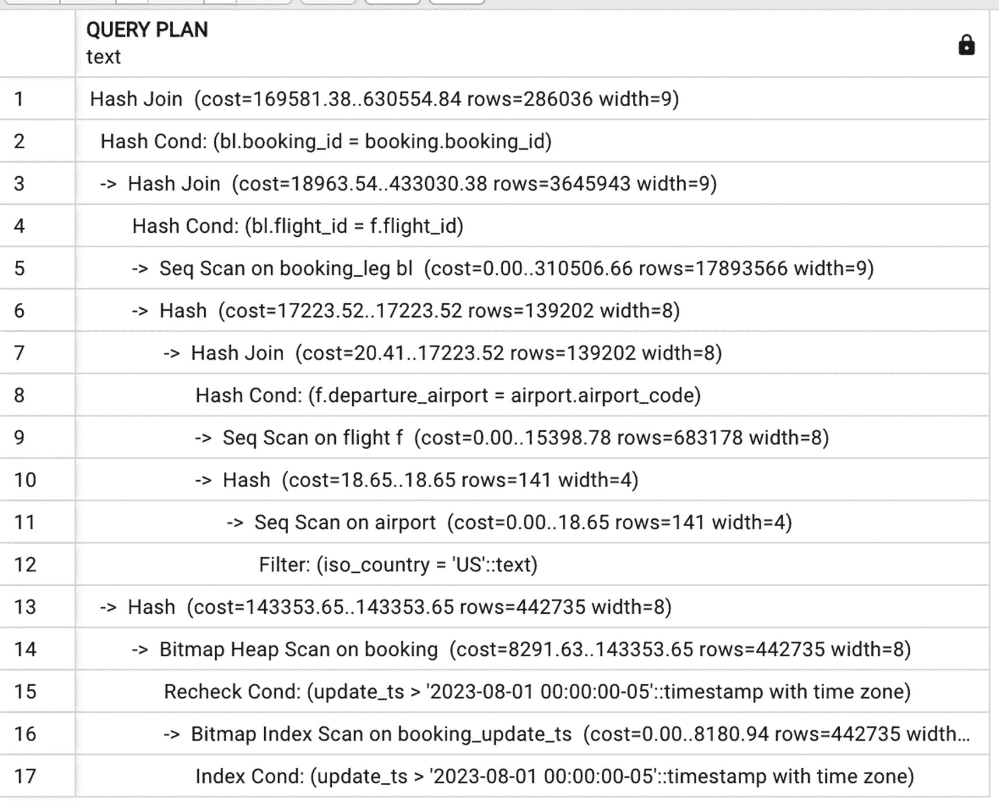
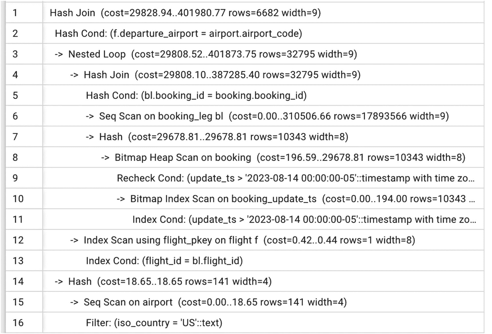
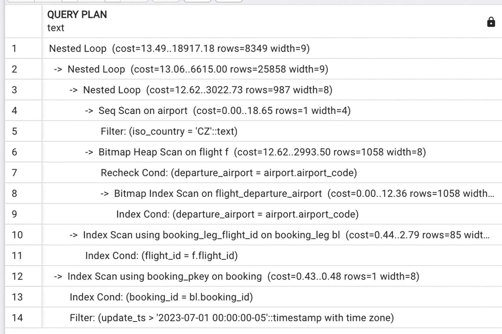
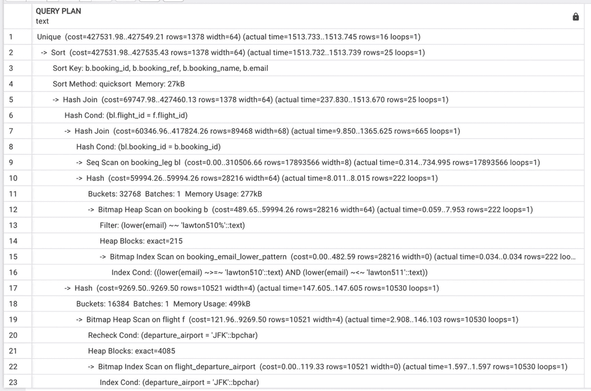
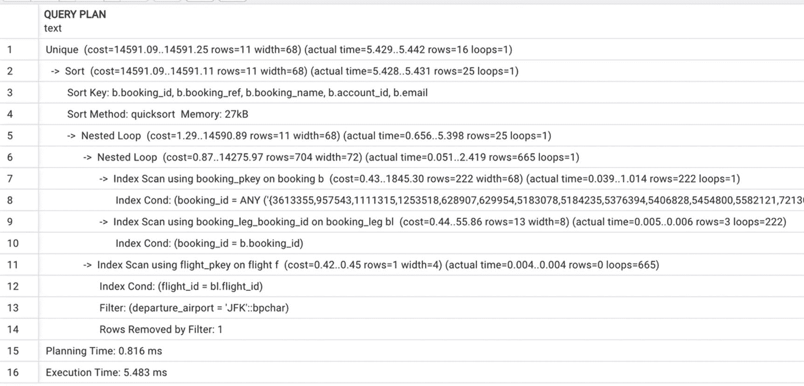

# 13. 动态 SQL

## 什么是动态 SQL

动态 SQL 是指首先构建为文本字符串，然后使用 `EXECUTE` 命令执行的任何 SQL 语句。动态 SQL 的示例如清单 13-1 所示。动态 SQL 在大多数关系数据库管理系统中都未得到充分利用，在 PostgreSQL 中尤其如此。本章的建议与许多数据库教科书的常规做法背道而驰，但所有建议都严格基于我们的实践经验。

```
DECLARE
v_sql text;
cnt int;
BEGIN
v_sql:=$$SELECT count(*)
FROM booking
WHERE booking_ref='0Y7W22'$$;
EXECUTE v_sql into cnt;

Listing 13-1
动态 SQL
```

### 为什么动态 SQL 在 Postgres 中效果更好

相对于其他数据库管理系统，PostgreSQL 有什么特别之处，使得这里的建议如此偏离传统智慧？请考虑以下几点。

首先，在 PostgreSQL 中，即使对于*预处理查询*（即使用 `PREPARE` 命令进行预解析、分析和重写的查询），执行计划也不会被缓存。这意味着优化总是在执行前立即发生。

其次，PostgreSQL 中的优化步骤发生得比其他系统更晚。例如，在 Oracle 中，参数化查询的执行计划总是为通用查询准备，即使存在具体值。此外，如果使用不同值执行相同的查询，带有绑定变量的计划会被缓存以供将来使用。优化器会考虑表和索引统计信息，但不考虑参数的具体值。PostgreSQL 做的相反。执行计划是针对具体值生成的。

如前所述，动态查询在其他数据库管理系统中也被不公平地忽视。这主要是因为对于长时间运行的查询（数十秒或更久），开销大多可以忽略不计。

### 那么 SQL 注入呢？

通常，建议使用动态 SQL 以获得更好性能会引发担忧：SQL 注入怎么办？当然，我们都听说过密码被盗和数据被删的恐怖故事，因为恶意攻击者在表单中传入了危险的命令而非数据。当然，这是一个真实的风险，而且黑客获取本不应访问数据的方式不止一种。然而，使用动态 SQL 有防护措施可以最大限度地降低风险。

在函数调用的参数值直接从数据库获取的情况下（例如，引用 ID），SQL 注入是不可能的。从用户输入获取的值必须使用 PostgreSQL 函数（`quote_literal`、`quote_indent` 等或 `format`）进行清理——本章稍后将演示这方面的示例。用户输入也可以受益于应用程序端的验证。


## 如何使用动态 SQL 获得最优执行计划

如第 12 章所述，PostgreSQL 可能会复用函数中参数化 SQL 语句的执行计划，这在某些情况下可能导致性能不佳。为确保构建最优的执行计划，我们可以在函数内部构建动态 SQL 然后执行，而不是将参数值作为绑定变量传递。让我们看一个例子。

回顾清单 6-6 中的查询，它有两个选择条件：出发机场国家和预订的最后更新时间。第 6 章演示了 PostgreSQL 如何根据这些参数的具体值来修改执行计划。

在本章中，我们将看看如果这个查询在函数内部执行会发生什么。

首先，让我们创建一个返回类型（参见清单 13-2）。

```sql
DROP TYPE IF EXISTS booking_leg_part ;
CREATE TYPE booking_leg_part AS(
departure_airport char (3),
booking_id int,
is_returning boolean
);
```

清单 13-2：创建一个返回类型

现在，让我们创建一个包含两个参数的函数：ISO 国家代码和最后更新的时间戳。此函数如清单 13-3 所示。

```sql
CREATE OR REPLACE FUNCTION select_booking_leg_country (
p_country text,
p_updated timestamptz)
RETURNS SETOF booking_leg_part
AS
$body$
BEGIN
RETURN QUERY
SELECT
departure_airport,
booking_id,
is_returning
FROM booking_leg bl
JOIN flight f USING (flight_id)
WHERE departure_airport IN
(SELECT
airport_code
FROM airport
WHERE iso_country=p_country
)
AND bl.booking_id IN
(SELECT
booking_id
FROM booking
WHERE update_ts>p_updated
)
;
END; $body$
LANGUAGE plpgsql;
```

清单 13-3：清单 6-6 中的 SQL，打包在一个函数中

第 6 章演示了 PostgreSQL 如何根据国家和时间戳搜索参数的值选择不同的执行计划，以及这如何影响执行时间。

由于 PostgreSQL 中的函数（如同其他系统中的函数）是原子性的，我们无法运行`EXPLAIN`命令来查看函数的执行计划（准确地说，`EXPLAIN`会被执行，但它只会显示执行本身），但由于已知查询的预期响应时间，我们可以很好地了解内部发生了什么。

回顾一下，之前执行清单 13-4 中的语句，执行时间约为 9.5 秒，执行了两个哈希连接。

```sql
SELECT
departure_airport,
booking_id,
is_returning
FROM booking_leg bl
JOIN flight f USING (flight_id)
WHERE departure_airport IN
(SELECT
airport_code
FROM airport WHERE iso_country='US'
)
AND bl.booking_id IN
(SELECT
booking_id
FROM booking
WHERE update_ts>'2023-07-01'
)
```

清单 13-4：包含两个哈希连接的 SELECT

还要回顾一下，通过将`update_ts`的边界移近数据集的“当前日期”8 月 17 日，最初执行时间并没有显著变化。`update_ts>'2023-08-01'`的执行时间仍约为 7.9 秒，减少的原因是中间数据集变小了。该情况的执行计划如图 13-1 所示。



图 13-1：带有两个哈希连接的执行计划

最终，随着`update_ts`的值接近 8 月 17 日，PostgreSQL 将选择索引访问，对于清单 13-5 中的查询，执行时间为 1.8 秒。

```sql
SELECT departure_airport, booking_id, is_returning
FROM booking_leg bl
JOIN flight f USING (flight_id)
WHERE departure_airport IN
(SELECT airport_code
FROM airport WHERE iso_country='US')
AND bl.booking_id IN
(SELECT booking_id FROM booking
WHERE update_ts>'2023-08-14')
```

清单 13-5：一个哈希连接被替换为嵌套循环

这种情况下的执行计划如图 13-2 所示。



图 13-2：带有一个哈希连接和一个嵌套循环的执行计划

此外，如果我们使用`iso_country=’CZ’`运行相同的 SELECT，PostgreSQL 将产生另一个不同的执行计划，如图 13-3 所示。在这种情况下，执行时间约为 200 毫秒。



图 13-3：仅包含嵌套循环的执行计划

以这些数据为参考，让我们检查一下函数版本的查询性能如何。

让我们尝试复现第 6 章中观察到的相同行为，即具有不同搜索条件的长查询，并执行清单 13-6 中所示的语句。

```sql
#1
SELECT * FROM select_booking_leg_country('US', '2023-07-01');
#2
SELECT * FROM select_booking_leg_country('US', '2023-08-01');
#3
SELECT * FROM select_booking_leg_country('US', '2023-08-14');
#4
SELECT * FROM select_booking_leg_country('CZ', '2020-08-01');
```

清单 13-6：函数调用示例

观察到的执行时间将根据前三到五次调用期间传递给函数的参数而有所不同。因此，语句#1 的执行时间（本应大约需要 9 秒）可能从 9 秒到 1 分钟不等，具体取决于调用的顺序。你甚至可以打开到本地 PostgreSQL 的两三个连接，并尝试以不同的顺序执行这些调用。

为什么函数的行为如此不一致？回顾第 12 章，其中指出 PostgreSQL *可能*保存预处理语句的执行计划，并且当函数在会话中第一次被调用时，它执行期间到达的每个 SQL 语句都会被评估，执行计划会被优化，然后*可能*被缓存以供后续执行。

我们故意不描述每个调用序列的具体行为，因为这是不保证的。虽然“不保证”对于训练数据库可能是可以接受的，但在生产环境中绝对是不可接受的，特别是当 OLTP 系统实施了限制最大等待时间并在等待时间超过该限制时中止事务的策略时。另外，别忘了连接池。实际上，任何 Web 应用程序都会启动一定数量的连接，称为连接池，这些连接由应用程序用户的进程使用，最常见的是用于单个 SQL 语句。结果，一个 PostgreSQL 会话几乎肯定会使用非常不同的参数集来执行每个函数。

为了保证每次执行函数时*都会针对其被调用时的具体值评估和优化执行计划*，我们创建执行动态 SQL 的函数。

清单 13-7 展示了函数`select_booking_leg_country_dynamic`，它执行与`select_booking_leg_country`函数相同的 SQL。唯一的区别是前者在函数内部构建了一个 SELECT 语句然后执行它。


**引言**

考虑下面这个函数定义：

```
CREATE OR REPLACE FUNCTION select_booking_leg_country_dynamic(
p_country text,
p_updated timestamptz)
RETURNS setof booking_leg_part
AS
$body$
BEGIN
RETURN QUERY
EXECUTE $$
SELECT
departure_airport,
booking_id,
is_returning
FROM booking_leg bl
JOIN flight f USING (flight_id)
WHERE departure_airport IN
(SELECT
airport_code
FROM airport
WHERE iso_country=$$|| quote_literal(p_country) ||
$$ )
AND bl.booking_id IN
SELECT
booking_id
FROM booking
WHERE update_ts>$$|| quote_literal(p_updated)||$$)$$;
END;
$body$ LANGUAGE plpgsql;
```
清单 13-7
一个执行动态 SQL 的函数

这个函数接受与 `select_booking_leg_country` 相同的参数集，并返回相同的结果。但请注意，它对每组参数的执行时间是一致的，这正是我们在生产系统中想要的。

为什么行为会改变？因为 SQL 是在执行前立即构建的，优化器不会使用缓存的执行计划。相反，它会为每次执行评估执行计划。这看起来可能会花费额外的时间，但实际上，结果恰恰相反。规划时间在 100 毫秒以下，并且通过获得更好的执行计划来回报，从而节省更多时间。

另外请注意，此函数使用 `quote_literal()` 函数来防范 SQL 注入。

这是在函数中使用动态 SQL 的第一个但不是唯一的原因。本章后续会提供更多支持这种实践的案例。

## 在 OLAP 系统中使用动态 SQL

本节的标题可能会产生误导。以下演示的技术可以用于任何系统；但是，当结果集很大时，效果最为显著。结果集越大，收益越明显。

假设为了统计分析，我们需要按年龄对乘客进行排序。定义了一个用于划分年龄类别的函数，如清单 13-8 所示。

```
CREATE OR REPLACE FUNCTION age_category (p_age int)
RETURNS TEXT language plpgsql AS
$body$
BEGIN
RETURN (CASE
WHEN p_age <= 2 then 'Infant'
WHEN p_age <=12 then 'Child'
WHEN p_age < 65 then 'Adult'
ELSE 'Senior'
END);
END; $body$;
```
清单 13-8
一个分配年龄类别的函数

如果此函数用于统计报告，我们可能需要为每个乘客计算年龄类别。在第 12 章中，我们提到在 SELECT 列表中执行函数可能会减慢速度，但那些函数更复杂。`age_category` 函数执行的是非常简单的替换。尽管如此，函数调用仍然需要时间。因此，

```
SELECT
passenger_id,
age_category(age)
FROM passenger
```

需要 6.5 秒执行，而

```
SELECT passenger_id,
CASE
WHEN age <= 2 then 'Infant'
WHEN age <=12 then 'Child'
WHEN age < 65 then 'Adult'
ELSE 'Senior'
END from passenger
```

只需要 3.5 秒。

在这种特定情况下，使用函数并非绝对必要，因为它只使用了一次，而且即使 Postgres Air 中最大的表之一，`passenger`，也只有 1600 万行。在真实的分析查询中，需要处理的行数可能达到数亿，并且可能需要多个分类函数。在一个实际场景中，使用函数的执行时间为四小时，而将一个函数替换为直接使用 `CASE` 操作符的执行时间不到 1.5 小时。

这是否意味着我们要不惜一切代价避免在 SELECT 列表中使用函数？可能我们的分析团队希望将年龄类别分配包装在函数中。最有可能的是，他们将在多个查询中使用此函数，并且希望如果年龄类别发生变化，他们的查询能够保持弹性和一致。

一个更高效且能保持函数可维护性的解决方案是创建一个不同的函数，它包含*部分代码作为文本*，如清单 13-9 所示。

```
CREATE OR REPLACE FUNCTION age_category_dyn (p_age text)
RETURNS text language plpgsql AS
$body$
BEGIN
RETURN ($$CASE
WHEN $$||p_age ||$$ <= 2 THEN 'Infant'
WHEN $$||p_age ||$$<= 12 THEN 'Child'
WHEN $$||p_age ||$$< 65 THEN 'Adult'
ELSE 'Senior'
END$$);
END; $body$;
```
清单 13-9
一个构建动态 SQL 的函数

注意区别：当我们执行

```
SELECT age_category(25)
```
...它会返回值 'Adult'。

如果你执行

```
SELECT age_category_dyn('age')
```
...它将返回一个文本行，其中包含代码部分

```
CASE
WHEN age <= 2 THEN 'Infant'
WHEN age<= 12 THEN 'Child'
WHEN age< 65 THEN 'Adult'
ELSE 'Senior'
END
```

要使用此函数，你需要将 SELECT 语句包装到一个函数中，但我们已经知道如何做了——参见清单 13-10。

```
CREATE TYPE passenger_age_cat_record AS (
passenger_id int,
age_category text
);
CREATE OR REPLACE FUNCTION passenger_age_category_select ()
RETURNS setof passenger_age_cat_record
AS
$body$
BEGIN
RETURN QUERY
EXECUTE $$SELECT
passenger_id,
$$||age_category_dyn('age')||$$ AS age_category
FROM passenger $$
;
END;
$body$ LANGUAGE plpgsql;
```
清单 13-10
使用 `age_category_dyn` 函数构建动态 SQL 查询

现在，我们可以执行以下语句：

```
SELECT * FROM passenger_age_category_select ()
```

这大约需要五秒钟执行，比没有任何函数调用的语句要慢，但仍比我们选择执行原始版本的 `age_category` 函数要快。再一次，当我们处理真实的分析查询时，效果将更加明显。事实上，使用更大的表（例如，通过构建 `passenger_large` 表，类似于第 7 章中构建 `boarding_pass_large` 表的方式），我们可以观察到类似的行为，且执行时间的差异更明显。

有些人可能会认为，费心创建生成代码的函数不值得那点性能提升。重申一下，对于创建函数是否有益——无论是对于性能、代码提取还是可移植性——并没有普遍原则。第 11 章提到，代码提取在 PG/PL SQL 函数中不像在面向对象编程语言中那样工作，并承诺提供一些例子。本节给出了其中一个例子。这里，函数 `age_category_dyn` 有助于代码提取，因为年龄类别分配的更新只需在一个地方进行。同时，它对性能的影响比更传统的带参数的函数要小。大多数情况下，构建一个执行动态 SQL 的函数在开始时需要一些时间，因为调试更困难。然而，一旦函数就位，进行更改所需的时间就很少。决定哪种时间更关键——是初始开发时间还是平均执行时间——只能由应用程序和/或数据库开发人员来决定。


## 使用动态 SQL 实现灵活性

此处描述的技术最常用于**OLTP**系统，尽管再次强调，它并非严格局限于某一种环境类型。

通常，系统允许用户选择任意搜索条件组合，可能通过下拉列表或其他图形化方式构建查询。

用户不需要（也不应该）了解数据在数据库中的存储方式。然而，搜索字段可能位于不同表中，搜索条件可能具有不同的选择性，并且总体上，`SELECT`语句可能因选择条件的不同而看起来差异很大。

让我们看一个示例。假设需要实现一个函数，通过以下值的任意组合搜索预订记录：

*   电子邮箱（或邮箱的前缀部分）
*   出发机场
*   到达机场
*   出发日期
*   航班 ID

是否有办法在不依赖 Elasticsearch 的情况下高效实现此功能？！

解决此问题的常见方法类似**代码清单 13-11**所示。

```
CREATE TYPE booking_record_basic AS(
booking_id bigint,
booking_ref text,
booking_name text ,
account_id integer,
email text );
CREATE OR REPLACE FUNCTION select_booking (
p_email text,
p_dep_airport text,
p_arr_airport text,
p_dep_date date,
p_flight_id int)
RETURNS SETOF booking_record_basic
AS
$func$
BEGIN
RETURN QUERY
SELECT DISTINCT
b.booking_id,
b.booking_ref,
booking_name,
account_id,
email
FROM booking b
JOIN booking_leg bl USING (booking_id)
JOIN flight f USING (flight_id)
WHERE (p_email IS NULL OR lower(email) LIKE p_email||'%')
AND (p_dep_airport IS NULL OR departure_airport=p_dep_airport)
AND (p_arr_airport IS NULL OR arrival_airport=p_arr_airport)
AND (p_flight_id IS NULL OR bl.flight_id=p_flight_id);
END;
$func$ LANGUAGE plpgsql;
```
**代码清单 13-11** 支持使用不同参数组合进行搜索的函数

此函数将始终返回正确结果，但从性能角度来看，其行为至少可以说是难以预测的。请注意，当按电子邮箱搜索时，与`booking_leg`和`flight`表的连接并不需要，但它们仍将存在。

下面，我们记录了一个可能的调用序列以及观察到的执行时间。

#1. 按电子邮箱搜索。

```
SELECT DISTINCT
b.booking_id,
b.booking_ref,
b.booking_name,
b.email
FROM booking b
WHERE lower(email) like 'lawton52%'
```

作为`SELECT`语句，此查询耗时 2.1 秒。

```
SELECT * FROM select_booking ('lawton52',
NULL,
NULL,
NULL,
NULL
)
```

等效的函数执行耗时 3.5 秒。

#2. 按电子邮箱和`flight_id`筛选。

```
SELECT DISTINCT
b.booking_id,
b.booking_ref,
b.booking_name,
b.email
FROM booking b
JOIN booking_leg bl USING (booking_id)
WHERE lower(email) like 'lawton52%'
AND flight_id= 2605
```

`SELECT`语句耗时 80 毫秒。

```
SELECT * FROM select_booking (
'lawton52',
NULL,
NULL,
NULL,
NULL
)
```

函数执行同样耗时 80 毫秒。

#3. 按电子邮箱、出发机场和到达机场筛选。

```
SELECT DISTINCT
b.booking_id,
b.booking_ref,
b.booking_name,
b.email
FROM booking b
JOIN booking_leg bl USING (booking_id)
JOIN flight f USING (flight_id)
WHERE lower(email) like 'lawton52%'
AND departure_airport='ORD'
AND arrival_airport='JFK'
```

`SELECT`语句耗时 80 毫秒。

```
SELECT * FROM select_booking (
'lawton52',
'ORD',
'JFK',
NULL,
NULL
)
```

使用相同参数的函数执行耗时 200 毫秒。

#4. 按电子邮箱、出发机场、到达机场和计划出发时间筛选。

```
SELECT DISTINCT
b.booking_id,
b.booking_ref,
b.booking_name,
b.email
FROM booking b
JOIN booking_leg bl USING (booking_id)
JOIN flight f USING (flight_id)
WHERE lower(email) like 'lawton52%'
AND departure_airport='ORD'
AND arrival_airport='JFK'
AND scheduled_departure BETWEEN '07-26-2023' AND '07-27-2023'
```

`SELECT`语句耗时 46 毫秒。

```
SELECT * FROM select_booking (
'lawton52',
'ORD',
'JFK',
'2023-07-26',
NULL
)
```


函数执行耗时 155 毫秒。

## 5. 按邮箱和计划出发时间搜索。

```sql
SELECT DISTINCT
b.booking_id,
b.booking_ref,
b.booking_name,
b.email
FROM booking b
JOIN booking_leg bl USING (booking_id)
JOIN flight f USING (flight_id)
WHERE lower(email) like 'lawton52%'
AND scheduled_departure BETWEEN '07-30-2023' AND '07-31-2023'
```

`SELECT` 耗时 1.3 秒。

```sql
SELECT * FROM select_booking (
'lawton52',
NULL,
NULL,
'2023-07-30',
NULL
)
```

函数执行耗时 35 秒。

## 6. 按 flight_id 搜索。

```sql
SELECT DISTINCT
b.booking_id,
b.booking_ref,
b.booking_name,
b.email
FROM booking b
JOIN booking_leg bl USING (booking_id)
WHERE flight_id= 27191
```

`SELECT` 耗时 56 毫秒。

```sql
SELECT * FROM select_booking (
NULL,
NULL,
NULL,
NULL,

)
```

函数执行耗时 10 秒。

正如我们之前讨论的，如果在当前会话中，前五次函数执行产生的执行计划对后续执行并非最优，那么不同函数调用的执行时间甚至可能更长。在测试此函数时，我们设法找到一个函数调用顺序，使得最后一个示例的运行时间长达三分钟。但是，即使在预期响应时间低于 100 毫秒的情况下，十秒的执行时间也可能导致应用程序超时。即便这种情况极为罕见，但在生产系统中也是不可接受的。

我们能否找到替代解决方案？与前面的示例类似，可以编写一个函数，根据传入的参数动态构建 `SELECT` 语句。此外，它还能在每次执行前受益于分析。

新函数的源代码如清单 13-12 所示。

```sql
CREATE OR REPLACE FUNCTION select_booking_dyn (
p_email text,
p_dep_airport text,
p_arr_airport text,
p_dep_date date,
p_flight_id int)
returns setof booking_record_basic
AS
$func$
DECLARE
v_sql text:=
'SELECT DISTINCT
b.booking_id,
b.booking_ref,
booking_name,
account_id,
email
FROM  booking b ';
v_where_booking text;
v_where_booking_leg text;
v_where_flight text;
BEGIN
IF p_email IS NOT NULL
THEN v_where_booking :=$$ lower(email) like $$ ||quote_literal(p_email||'%'); END IF;
IF p_flight_id IS NOT NULL
THEN v_where_booking_leg:= $$ flight_id=$$||p_flight_id::text;
END IF;
IF p_dep_airport IS NOT NULL
THEN v_where_flight:=concat_ws($$ AND $$, v_where_flight,
$$departure_airport=$$||
quote_literal(p_dep_airport));
END IF;
IF p_arr_airport IS NOT NULL
THEN v_where_flight:=concat_ws($$ AND $$,v_where_flight,
$$arrival_airport=$$||
quote_literal(p_arr_airport));
END IF;
IF p_dep_date IS NOT NULL
THEN v_where_flight:=concat_ws($$ AND $$,v_where_flight,
$$scheduled_departure BETWEEN $$||
quote_literal(p_dep_date)||$$::date AND
$$||quote_literal(p_dep_date)||
$$::date+1$$);
END IF;
IF v_where_flight IS NOT NULL  OR v_where_booking_leg IS NOT NULL
THEN v_sql:=v_sql||$$ JOIN booking_leg bl USING (booking_id) $$;
END IF;
IF v_where_flight IS NOT NULL
THEN v_sql:=v_sql ||$$ JOIN flight f USING (flight_id) $$;
END IF;
v_sql:=v_sql ||$$ WHERE $$||concat_ws($$ AND $$,v_where_booking, v_where_booking_leg, v_where_flight);
return query EXECUTE (v_sql);
END;
$func$ LANGUAGE plpgsql;
```

清单 13-12：一个构建动态 SQL 以根据不同条件进行搜索的函数

这代码量可不少！让我们一步步来看，审视一下这里究竟发生了什么。

新函数的参数与旧函数完全相同，结果类型也一致，但函数体完全不同。从高层次看，此函数在 `v_sql` 文本变量中构建了一条待执行的语句。

动态构建查询意味着我们可以选择只包含所需的连接。`booking` 表总是需要的，这就是为什么 `v_sql` 的初始值被设置为

```sql
'SELECT DISTINCT
b.booking_id,
b.booking_ref,
booking_name,
account_id,
email
FROM  booking b ';
```

然后，根据传入了哪些非 `NULL` 的参数，函数决定需要哪些其他表。如果 `p_flight_id` 参数为 `NULL`（即未使用与航班相关的参数），则可能只需要 `booking_leg` 表。也可能需要两个表：`booking_leg` 和 `flight`。

在添加了所有必要的表之后，通过用 `'AND'` 分隔符连接所有条件来构建完整的搜索条件。根据搜索条件，最终确定 `v_sql` 语句并执行。要查看不同函数调用下的最终查询是什么，请取消 `RAISE NOTICE` 语句的注释。

为了提升性能，这工作量是否太大？尝试编译此函数，并使用前面示例中的相同参数执行它。很快就能发现，对于每一组参数，`select_booking_dyn()` 函数的执行时间都不超过相应 SQL 语句的执行时间——这在案例 #5 和 #6 中尤为明显。此外，执行时间是可预测的，并不取决于当前会话中的首次执行。

再次强调，动态函数不易调试，你可能需要包含大量的调试输出，但如果你的生产系统性能至关重要，那么这些努力所带来的回报是非常值得的。


## 使用动态 SQL 辅助优化器

由于本章全文致力于探讨如何通过动态 SQL 提升查询性能，本节标题或许令人费解。然而本节关注的是另一类性能问题成因。这些示例中，动态 SQL 并非用于构建特定场景的 SQL 语句，而是用于引导优化器选择更优的执行计划。

细察前一节所有示例，会发现有一种搜索条件组合表现尤为糟糕——尽管结果集很小，即同时根据预订邮箱和出发机场进行搜索时。即使邮箱条件具有足够筛选性，优化器仍未能利用第二次连接中`booking_id`的索引。若执行代码清单 13-13，其执行计划显示为哈希连接——参见图 13-4。

```sql
SELECT DISTINCT
b.booking_id,
b.booking_ref,
b.booking_name,
b.account_id,
b.email
FROM booking b
JOIN  booking_leg bl USING (booking_id)
JOIN flight f USING (flight_id)
WHERE lower(email) like 'lawton510%'
AND departure_airport='JFK'
清单 13-13
通过邮箱和出发机场选择预订记录
```

该查询执行时间约四秒，而结果仅包含 16 行数据。对于如此小规模的查询，其执行速度理应更快。

此次优计划的原因前文已提及——PostgreSQL 优化器未能准确估算中间结果集的大小。通过模式索引筛选出的实际行数为 3941，而计划中的估算值却是 28219。



查询计划截图。包含 23 行代码，通过哈希连接检查机场预订记录。

图 13-4

代码清单 13-13 使用哈希连接的执行计划

优化此查询的技术本质上是辅助优化器完成工作，消除对结果集大小估算的需求。具体方法是：首先找出与目标邮箱对应的预订 ID，然后将`booking_id`列表传递给主`SELECT`语句。注意：本例使用的函数高度特定于当前场景，仅作演示用途（清单 13-14）。更接近生产环境通用方案的函数会庞大得多。

```sql
CREATE OR REPLACE FUNCTION select_booking_email_departure(
p_email text,
p_dep_airport text)
RETURNS SETOF booking_record_basic AS
$body$
DECLARE
v_sql text;
v_booking_ids text;
BEGIN
EXECUTE $$SELECT array_to_string(array_agg(booking_id), ',')
FROM booking
WHERE lower(email) like $$||quote_literal(p_email||'%')
INTO v_booking_ids;
v_sql=
$$SELECT DISTINCT
b.booking_id,
b.booking_ref,
b.booking_name,
b.account_id,
b.email
FROM booking b
JOIN  booking_leg bl USING(booking_id)
JOIN flight f USING (flight_id)
WHERE b.booking_id IN ($$||v_booking_ids||$$)
AND departure_airport=$$||quote_literal(p_dep_airport);
RETURN QUERY EXECUTE v_sql;
END;
$body$ LANGUAGE plpgsql;
清单 13-14
通过动态 SQL 改进清单 13-13 的代码
```

为何此方法有效？我们知道邮箱搜索将具有较强限制性，因为传递的参数几乎是完整邮箱地址（或至少是其核心部分）。因此第一步预先筛选出具有该邮箱的较少数量预订记录，并保存至文本变量`v_booking_ids`。随后在`SELECT`语句中显式使用`booking_id`列表构建查询。

执行这个新函数

```sql
SELECT * FROM select_booking_email_departure('lawton510','JFK')
```

……执行时间将仅需 200 毫秒。检查生成的 SQL 语句的`EXPLAIN`命令输出，其执行计划如图 13-5 所示。



查询计划截图。包含 16 行代码，通过预订 ID 列表检查机场预订记录。

图 13-5

使用`booking_id`列表的动态 SQL 执行计划

即使涉及数千个 ID，基于索引的访问方式仍证明更为高效。

## 外部数据包装器与动态 SQL

如引言所述，分布式查询的详细讨论超出本书范围。但由于涵盖动态 SQL，借此机会对外部数据包装器（FDWs）的应用稍作说明。

外部数据包装器是能与外部数据源通信的库（即位于 PostgreSQL 服务器外的数据），它隐藏了连接数据源及从中获取数据的具体细节。

FDW 是功能强大的工具，针对不同类型数据库的外部数据包装器正日益增多。PostgreSQL 在优化涉及`foreign tables`（外部系统表的映射）的查询方面表现出色。然而，由于访问外部统计信息可能受限（尤其当外部系统非 PostgreSQL 时），优化可能不够精确。我们发现运用前节所述技术极具助益。

优化的第一种方式是先执行查询的本地部分，识别需要从远程服务器获取的记录，再访问远程表。另一种方式是将带常量条件（如`WHERE update_ts> CURRENT_DATE -3`）的查询发送至远程站点，将远程数据拉取到本地，再执行查询剩余部分。采用这两种技术之一有助于最小化执行时间的不一致性。

## 总结

动态 SQL 是 PostgreSQL 中极其强大的工具，却未被数据库开发者充分利用。当所有其他优化技术失效时，动态 SQL 能有效提升性能。

动态 SQL 在函数内效果最佳：基于函数输入参数生成 SQL 语句后执行。它既适用于 OLTP 环境，也适用于 OLAP 环境。

若选择在项目中使用动态 SQL，请准备好进行大量耗时的调试工作。初期可能令人沮丧，但性能提升绝对物有所值。

