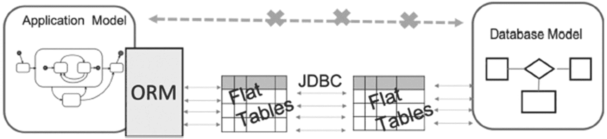
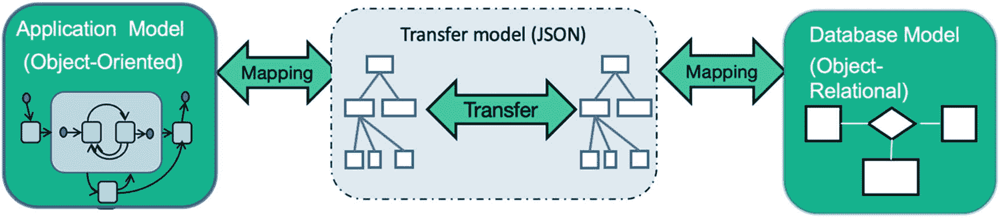
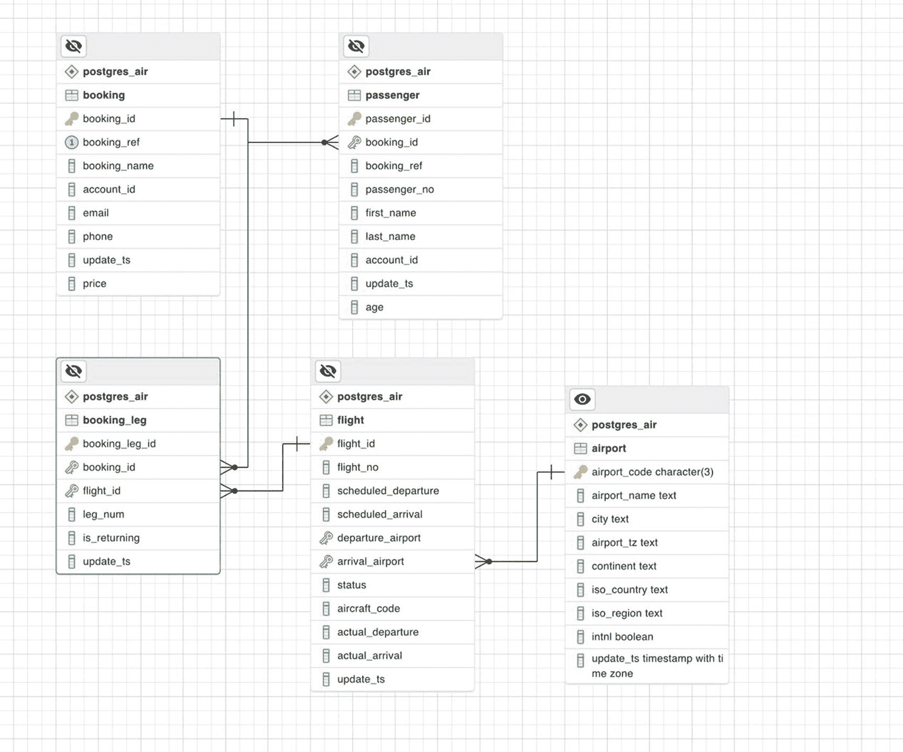
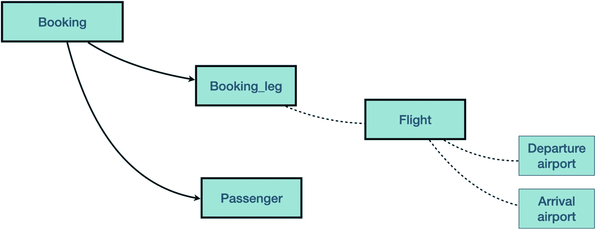
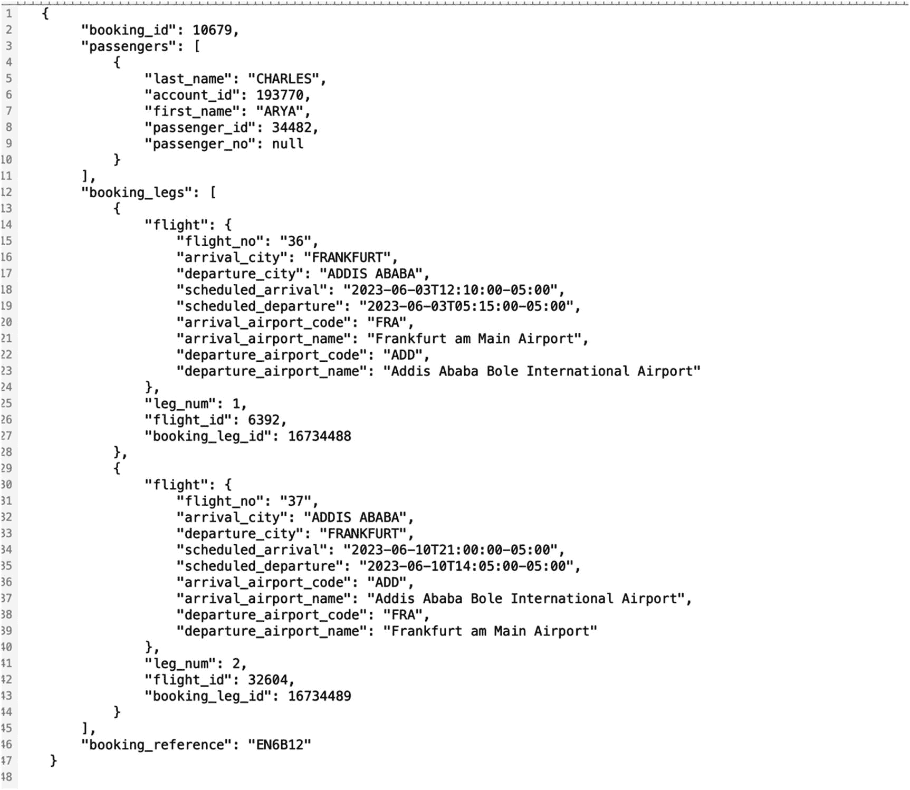
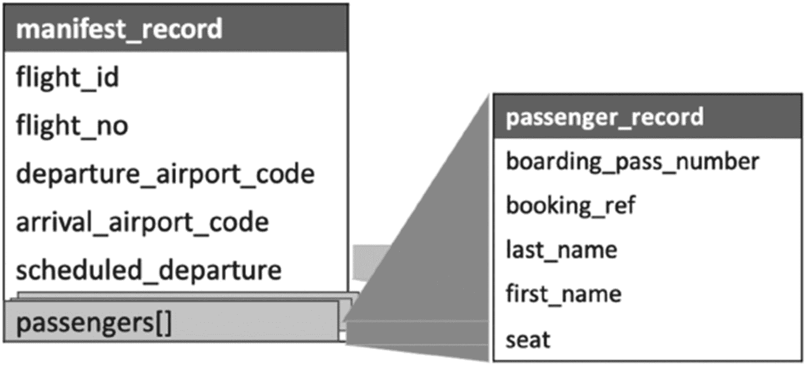
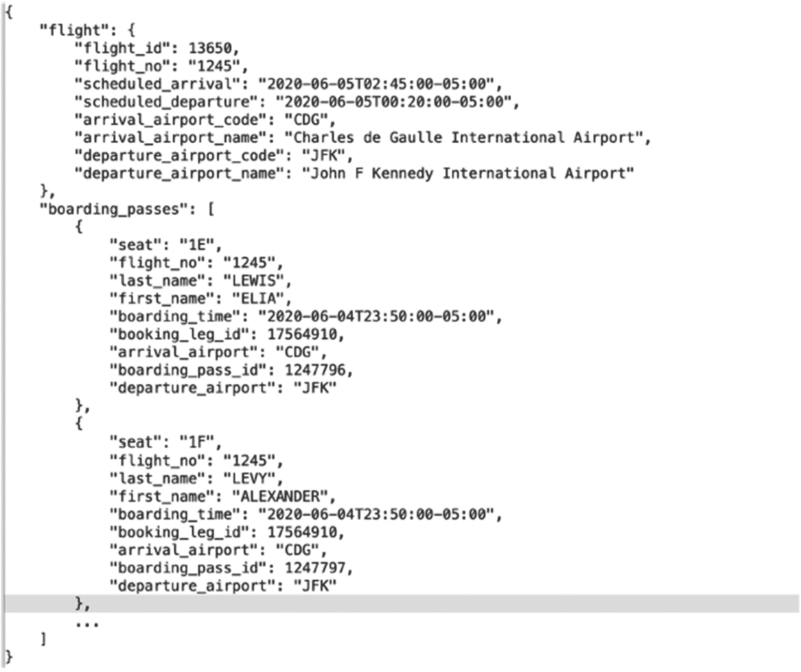

# 14. 规避对象关系映射的陷阱

第 11 章讨论了应用程序与数据库的典型交互，阐释了 ORMI（对象关系阻抗失配）及其对性能的影响。同时指出，任何潜在解决方案都应支持对大型对象（即数据集）的操作，并应支持复杂对象的交换。本章介绍我们开发并成功应用于生产环境的方法，称为 NORM（非对象关系映射）。

在克服对象关系阻抗失配的探索中，我们绝非先驱，也非首个提出 ORM 替代方案者。NORM 只是众多可行方案之一。然而使其在众多工具中脱颖而出的特点，是其对应用程序开发者的易用性。

NORM GitHub 仓库（[`https://github.com/hettie-d/NORM`](https://github.com/hettie-d/NORM)）包含关于该方法的文档及按 NORM 方法构建的代码示例。最重要的是，它提供了一套可自动化生成函数代码的程序集。本章后续将提供更详细的说明。


## 为何应用开发者青睐 NORM

通常，新的开发方法论会要求应用开发者对开发流程进行重大调整，这不可避免地会导致生产力下降。潜在的性能提升往往无法弥补开发时间的增加，这并不罕见。毕竟，开发者的时间是任何项目中最昂贵的资源。

在第 12 章中，在阐述使用函数的优势之前，有一个告诫：“如果你能说服应用开发者的话”。而通常情况下，你很难说服他们，因为适应新的编程风格存在困难。但 NORM 的情况并非如此。在接下来的章节中，我们将解释这种方法对应用开发者和数据库开发者的吸引力所在。

## ORM vs. NORM

第 11 章讨论了 ORM 造成的数据交换瓶颈。图 14-1 是第 11 章中的图 11-1 的复本，它展示了应用程序和数据库之间的数据流。



一个展示 O R M 如何将数据库模型映射到应用模型的架构图。此过程涉及平面表和 J D B C。

图 14-1：ORM 的工作原理

主要问题在于，来自应用模型的复杂对象在与数据库通信之前被分解为原子对象，产生了过多、过小的查询，这降低了系统性能。一个更严重的问题是，应用复杂对象与数据库复杂数据结构之间的对应关系丢失了。

NORM 提出的方法如图 14-2 所示。



一个展示 N O R M 如何将数据库模型映射到应用模型的架构图。此过程涉及 J S O N 传输模型。

图 14-2：NORM 的工作原理

在此图中，A-Model 是应用模型，D-Model 是数据库模型，T-Model 是`传输模型`。T-Model 的存在是 NORM 方法的一个独特特性，它使得映射是`对称的`。我们不是试图基于应用模型构建数据库模型，也不是坚持先创建数据库对象。

相反，我们呼吁在应用层和数据库之间建立`契约`，类似于你在 RESTful Web 服务上看到的契约。NORM 契约要求应用控制器对数据库的访问最多两次：一次是获取功能所需的所有数据，另一次是发送数据修改请求。由于整个复杂的层次结构对象是作为最小传输单元发送或接收的，因此为每个用例正确定义它（或从已定义的类/层次结构中选择合适的类/层次结构）至关重要。NORM 的不同实现可能使用不同的手段来表示层次结构。我们的实现使用了最流行的表示法之一，即`JSON`。

该契约，或称 T-Model，以`JSON 模式`的形式呈现，该模式描述了复杂对象的结构、它们在层次结构中的关系以及这些对象到数据库对象（表和列）的映射。

通过此契约，可以将对象序列化为数据库可以处理的`JSON 有效载荷`，从而简化对象的持久化。这导致无论对象结构或复杂度如何，只需一次数据库调用即可持久化一个对象。

同样，在检索对象时，应用可以通过一次数据库调用将数据库返回的结果反序列化为模型。它还可以传递额外的参数作为契约的一部分，告诉数据库它需要模型的额外部分，类似于 ODATA Web 服务请求。

许多应用开发者喜爱应用端数据访问层的简化实现。NORM 使用契约来确定每次数据库调用的输入和输出，这一事实允许应用开发者针对契约进行编码，并在测试时轻松模拟任何依赖项，因为进出数据库的调用都将遵守契约。因此，一旦契约建立，数据库和应用开发者可以独立并同时进行各自的工作。此外，不同的应用开发者团队可以在不同的项目中使用相同的契约。

在应用端，几乎所有现代面向对象语言都有用于序列化和反序列化对象的库。随着每次新的数据库交互发生，可以重用相同的实现模式。

这使得应用开发者可以花费更多时间设计`JSON 有效载荷`，以确保其满足当前和未来的业务需求。重用相同的交互模式也减少了实现时间，最大程度地减少了缺陷的可能性，并允许最小的代码更改影响整个数据库访问实现。更重要的是，一个应用程序通常需要不同的复杂对象，因此需要多个契约，尽管这些复杂对象可以从同一个数据库构建。


## NORM 解析

为了说明 NORM 的工作原理，让我们回到第 11 章的示例。

## 实体关系图

图 14-3 展示了用于构建示例的 `postgres_air` 实体关系图的一个子集。



该实体关系图展示了 `booking`、`booking leg`、`passenger`、`flight` 和 `airport` 等变量。

**图 14-3**
案例研究的实体关系图

在第 11 章讨论应用程序与数据库的交互时，我们草拟了一个对象（我们现在可以称之为 T 对象层次结构），它代表了与一次 `booking` 相关的所有信息。从航空旅客的角度看，一个 `booking` 代表了他们的旅行行程。为了使代码示例保持可读性，我们省略了一些通常可以在行程单上找到的细节。具体来说，我们包含了机场代码，但没有包含机场所在的城市，从而避免了需要包含 `airport` 表的映射。

图 14-3 中的实体关系图展示了从数据库对象映射到传输对象层次结构所需的所有表和关系。

## 传输对象层次结构

层次结构中传输对象的关系如图 14-4 所示。



该关系图展示了 `booking`、`booking leg`、`passenger`、`flight`、`departure airport` 和 `arrival airport` 的层次结构。

**图 14-4**
传输对象层次结构（契约）中的关系

## JSON Schema 契约

以 JSON 描述的契约如清单 14-1 所示。该清单包含了 `booking` 层次结构的完整描述。

对象定义放置在 `"definitions"` 键下。所有对象定义都在同一层级。层次结构通过放置在 `"$ref"` 键中的引用来指定。第 2 行要求传输单元是一个 JSON 对象的数组。第 5-7 行指定了层次结构的根对象类型为 `booking`。

该对象的定义包含 `passengers` 和 `booking_legs` 键，它们分别是 `passenger` 和 `booking_leg` 对象的数组（第 15-25 行）。

请注意，数据库表 `passenger` 和 `booking_leg` 都包含一个外键列 `booking_id`。此字段不包含在 JSON 中，因为关系是通过 JSON 的层次结构来表示的。

在 `booking_leg` 的定义中使用了另一种构建层次结构的方法。此对象包含一个类型为 `flight` 的嵌入式对象。重要的区别在于 `flight_id` 字段包含在 `booking_leg` 对象中。

`flight` 数据无法通过此层次结构更新（因为此类更新会影响同一航班上的其他预订）。

相反，如果需要重新预订，可以修改 `booking_leg.flight_id`（第 88-90 行）。

同样，`flight` JSON 对象包含了出发和到达机场的 `name` 和 `city`。这些字段无法通过此层次结构更新，因为预订的更改不能影响 `airport` 的属性。

```json
{
    "type": "array",
    "title": "booking_hierarchy",
    "description": "all booking details",
    "items": {
        "$ref": "#/definitions/booking"
    },
    "definitions": {
        "booking": {
            "type": "object",
            "properties": {
                "booking_id": {
                    "type": "number"
                },
                "passengers": {
                    "type": "array",
                    "items": {
                        "$ref": "#/definitions/passenger"
                    }
                },
                "booking_legs": {
                    "type": "array",
                    "items": {
                        "$ref": "#/definitions/booking_leg"
                    }
                },
                "booking_reference": {
                    "type": "string"
                }
            }
        },
        "flight": {
            "type": "object",
            "properties": {
                "flight_no": {
                    "type": "string"
                },
                "arrival_city": {
                    "type": "string"
                },
                "departure_city": {
                    "type": "string"
                },
                "scheduled_arrival": {
                    "type": "string"
                },
                "scheduled_departure": {
                    "type": "string"
                },
                "arrival_airport_code": {
                    "type": "string"
                },
                "arrival_airport_name": {
                    "type": "string"
                },
                "departure_airport_code": {
                    "type": "string"
                },
                "departure_airport_name": {
                    "type": "string"
                }
            }
        },
        "passenger": {
            "type": "object",
            "properties": {
                "last_name": {
                    "type": "string"
                },
                "account_id": {
                    "type": "number"
                },
                "first_name": {
                    "type": "string"
                },
                "passenger_id": {
                    "type": "number"
                },
                "passenger_no": {
                    "type": "number"
                }
            }
        },
        "booking_leg": {
            "type": "object",
            "properties": {
                "flight_id": {
                    "type": "number"
                },
                "flight": {
                    "type": "object",
                    "items": {
                        "$ref": "#/definitions/flight"
                    }
                },
                "leg_num": {
                    "type": "number"
                },
                "booking_leg_id": {
                    "type": "number"
                }
            }
        }
    }
}
```

**清单 14-1**
以 JSON schema 形式呈现的契约


请注意，此模式代表了契约，即应用程序期望接收的对象结构。它与数据在数据库中的存储方式有显著差异，最重要的是，只要数据库响应符合契约，数据库的实现方式就不会影响应用程序与其的交互方式。

遵循此契约的示例`JSON`对象如图 14-5 所示。



预订`ID`为 10679 的`JSON`代码截图。它展示了预订详情、预订航段、乘客和航班信息。预订参考号为`EN6B12`。

图 14-5

作为`JSON`的传输对象

简而言之，应用程序与数据库之间的交互可总结如下：

1.  应用程序将数据序列化为`JSON`格式，并通过调用相应的数据库函数将其发送至数据库。
2.  数据库函数解析作为参数传递的`JSON`，并执行该函数应有的功能：无论是搜索还是数据转换。`PostgreSQL`提供了非常完善的`JSON`支持，拥有一套丰富的函数集，这使得在数据库端操作`JSON`变得容易。
3.  结果集被转换为`JSON`并传递给应用程序，在应用程序中反序列化，供应用程序使用。

## 从应用程序视角看 NORM

在应用程序端，代码清单 14-2 中的`Python`类被映射到相同的传输对象。

```python
from typing import List
from pydantic import BaseModel, Field
from datetime.datetime import datetime, timezone
from phonenumber import PhoneNumber

class Booking(BaseModel):
    booking_id: int
    booking_ref: str
    booking_legs: List[BookingLeg]
    booking_name: str
    account_id: int
    email: str
    phone: PhoneNumber
    update_ts: datetime
    price: decimal

class BookingLeg(BaseModel):
    booking_leg_id: int
    flight: Flight
    is_returning: bool
    update_ts: datetime

class Flight(BaseModel):
    flight_id: int
    flight_no: int
    scheduled_departure: datetime
    scehduled_arrival: datetimee
    departure_airport: Airport
    arrival_airport: Airport
    status: str
    aircraft_code: str
    actual_departure: datetime
    actual_arrival: datetime
    update_ts=datetime

class Airport(BaseModel):
    airport_code: str = Field(min_length=3,max_length=3)
    airport_name: str
    airport_tz: timezone
    city: str
    continent: str
    iso_country: str
    iso_region: str
    intnl: bool
    update_ts: datetime

class Passenger(BaseModel):
    passenger_id: int
    booking: Booking
    passenger_no: int
    first_name: str
    last_name: str
    account_id: int
    update_ts: datetime
    age: int
```

代码清单 14-2
Postgres Air 应用程序类

值得一提的是，我们可以使用同一组表构建完全不同的传输对象。例如，在任何航班起飞前，必须生成一份名为舱单的文件。该文件列出了航班上的所有乘客及其座位分配。舱单的传输对象如图 14-6 所示。



传输对象的关系图。它展示了舱单记录和乘客记录的变量。

图 14-6

航班舱单的传输对象

对应的`JSON`如图 14-7 所示。



`JSON`代码截图。它展示了航班和登机牌的详细信息，用于在预订时检查到达机场代码`CDG`和起飞机场代码`JFK`。

图 14-7

作为`JSON`的舱单对象

## 从数据库视角看 NORM

在`NORM`项目的早期，对其采用的唯一严重反对意见是需要手动创建所有数据操作函数。敏捷团队不想花费时间编写额外的代码，特别是当`ORM`几乎可以在没有人工干预的情况下生成功能相似的代码时。他们也不想在团队中增加额外的人员（数据库开发人员）。为了解决这些担忧，我们在`NORM`中添加了一个自动生成模块，我们称之为`NORM-GEN`。在本节中，我们将解释如何在数据库端生成类型和函数，而不是手动创建它们。为了实现这个目标，我们需要对我们的契约进行一个重要更改，即找到一种定义应用程序类与数据库对象之间映射的方法。

### 将`JSON`映射到数据库

为了实现数据库对象的自动生成，我们通过一个`db_mapping`键扩展了`JSON`模式语法，该键可以为整个层次结构、一个对象或一个键指定。该映射指定了与`JSON`对象和键相对应的数据库模式、表名和列名，以及定义对象之间关系的主键和外键列。

代码清单 14-3 展示了如何为契约的一部分（即乘客对象）指定映射。该清单的第 4-7 行定义了与`JSON`对象对应的表、表的主键、父对象的主键，以及在转换为`JSON`之前在数据库中表示该对象的复杂数据类型的名称。当`JSON`键名与表列名一致时，可以省略较低级别对象的显式映射。

```json
{
    "passenger": {
        "type": "object",
        "db_mapping": {
            "pk_col": "passenger_id",
            "db_table": "passenger",
            "record_type": "passenger_record",
            "parent_fk_col": "booking_id"
        },
        "properties": {
            "last_name": {
                "type": "text"
            },
            "account_id": {
                "type": "number"
            },
            "first_name": {
                "type": "text"
            },
            "passenger_id": {
                "type": "number"
            },
            "passenger_no": {
                "type": "number"
            }
        }
    }
}
```

代码清单 14-3
乘客对象的数据库映射


### 生成数据库代码

该合约用于生成：

*   以嵌套复杂对象和数组形式表示层次结构的数据库类型定义。
*   根据根对象的主键列表从数据库中选择完整层次结构的函数。该层次结构被构建为数据库复杂嵌套对象，然后转换为 JSON 格式。
*   基于作为输入参数指定的搜索请求返回根对象键列表的函数。
*   对层次结构中的指定对象或其子对象执行修改操作的函数。可以在同一请求中插入、更新或删除多个对象和/或子对象。

应用程序用于访问数据库的某些接口（包括 JDBC）不支持 JSON 作为数据类型。为了绕过这一点，JSON 在传输前被转换为文本字符串列表，并在传输后立即转换回 JSON。

现在，让我们更具体地说明这是如何实现的。

清单 14-4 展示了为预订层次结构生成的类型定义。这些定义与清单 12-17 和 12-20 中的定义相似。

我们定义了类型 `passenger_record`、`flight_record` 和包含 `flight_record` 子对象的 `booking_leg_record`，然后是 `booking_record`，它以这些类型的数组作为组成部分。

```sql
/* entering  : booking */
/* entering  : passenger */
drop type if exists norm.bh_passenger_record cascade;
create type norm.bh_passenger_record as (
last_name  text,
account_id  int4,
first_name  text,
passenger_id  int4,
passenger_no  int4
);
/* entering  : booking_leg */
/* entering  : flight */
drop type if exists norm.bh_flight_record cascade;
create type norm.bh_flight_record as (
flight_no  text,
arrival_city  text,
departure_city  text,
scheduled_arrival  timestamptz,
scheduled_departure  timestamptz,
arrival_airport_code  bpchar,
arrival_airport_name  text,
departure_airport_code  bpchar,
departure_airport_name  text
);
drop type if exists norm.bh_booking_leg_record cascade;
create type norm.bh_booking_leg_record as (
flight_id  int4,
flight  norm.bh_flight_record,
leg_num  int4,
booking_leg_id  int4
);
drop type if exists norm.bh_booking_record cascade;
create type norm.bh_booking_record as (
booking_id  int8,
passengers  norm.bh_passenger_record[],
booking_legs  norm.bh_booking_leg_record[],
booking_reference  text
);
```

清单 14-4 预订类型定义

查看这些类型定义，可以清楚地看到它们确实表示了图 14-4 中的传输对象 `booking`。

### 从数据库获取数据

合约要求应用程序应以尽可能少的与数据库交互的次数接收所有需要的数据。通常，应用程序应接收一组完整的层次结构。这意味着返回数据的结构取决于层次结构的定义，而不是具体的查询。清单 14-5 显示了为预订层次结构生成的 SELECT 子句。

```sql
/* selecting booking_hierarchy booking */
select
array_agg(
/* Entering booking_record */
row(top.booking_id  ,
(
select array_agg(  /* Entering passenger_record */
row(passengers.last_name  ,
passengers.account_id  ,
passengers.first_name  ,
passengers.passenger_id  ,
passengers.passenger_no)::norm.bh_passenger_record)
from  postgres_air.passenger  passengers
where  top.booking_id = passengers.booking_id
)
,
(
select array_agg(  /* Entering booking_leg_record */
row(booking_legs.flight_id  ,
(
select  (  /* Entering flight_record */
row(flight.flight_no  ,
arrival.city  ,
departure.city  ,
flight.scheduled_arrival  ,
flight.scheduled_departure  ,
flight.arrival_airport  ,
arrival.airport_name  ,
flight.departure_airport  ,
departure.airport_name)::norm.bh_flight_record)
from  postgres_air.flight  flight
join postgres_air.airport departure on  departure.airport_code = flight.departure_airport
join postgres_air.airport arrival on  arrival.airport_code = flight.arrival_airport
where  booking_legs.flight_id = flight.flight_id
)
,
booking_legs.leg_num  ,
booking_legs.booking_leg_id)::norm.bh_booking_leg_record)
from  postgres_air.booking_leg  booking_legs
where  top.booking_id = booking_legs.booking_id
)
,
top.booking_ref)::norm.bh_booking_record)
from  postgres_air.booking  top
```

清单 14-5 生成的 SELECT 子句

清单 14-5 中显示的 SELECT 子句返回一个包含嵌套复杂对象的 PostgreSQL 数组。此输出通过一次调用 `to_json` 函数转换为 JSON 格式。

与 SELECT 子句相反，过滤条件取决于应用程序的具体需求，因此每次查询都需要。NORM 接受 JSON 格式的搜索条件，这种格式类似于某些面向 JSON 的系统中找到的格式。然而，NORM 既不提供这些语言的完整功能，甚至也不提供它们的子集。本质上，NORM 支持在 JSON 合约中任何层次级别的任何标量键上进行基本的比较操作。搜索条件的示例如清单 14-6 所示。

```json
{
  "booking_hierarchy":{
    "departure_airport_code":"ORD",
    "arrival_city":{"$like":"NEW%"},
    "last_name":"Smith"
  }
}
```

清单 14-6 JSON 格式的搜索条件

此搜索将返回所有包含姓氏为“Smith”的乘客且包含一个航段，该航段的航班从 ORD 飞往任何名称以“NEW”开头的城市的预订记录。对于所有这些预订，结果中将包含所有乘客和所有航段。

请注意，搜索条件不能包含任何连接操作，因为对象之间的关系已在层次结构中定义。如果需要更多关系，则必须定义另一个层次结构。清单 14-7 显示了为此搜索生成的 SQL 代码。

```sql
booking_id IN (
select booking_id from postgres_air.booking_leg where
flight_id IN (
select flight_id from postgres_air.flight where
arrival_airport IN (
select airport_code from postgres_air.airport where
city  LIKE  ('NEW%'::text) )
AND  departure_airport  =  ('ORD'::bpchar) ) )
AND  booking_id IN (
select booking_id from postgres_air.passenger where
last_name  =  (Smith::text) )
```

清单 14-7 生成的过滤条件

此生成的代码被包装在构建完整查询并执行它的函数中。请注意，此生成的代码类似于第 12 章中讨论并显示在清单 12-21 中的代码。


## 修改数据库中的数据

`NORM` 可以处理任何数据操作，即 `INSERT`、`UPDATE` 和 `DELETE`，这些操作统称为更新请求。

一个更新请求由应用程序作为一个复杂对象发送，在数据库层面，可能会导致对多个表执行多个更新操作。重申一次，数据库开发是契约驱动的。一个数据库函数从应用程序接收一个 JSON 对象，解析该对象，并解释在数据库层面需要执行的操作。

`NORM` 方法旨在减少数据库操作的数量。当然，不可能用单条 SQL 语句更新多个表，因此 `NORM` 需要为一个更新请求执行多条 SQL 语句。然而，它会从更新请求的多个子对象中收集数据，以便对于可以通过层次结构修改的每个表，最多执行一条 `DELETE`、一条 `UPDATE` 和两条 `INSERT` 语句，无论该更新请求修改了多少层级和子对象。

生成的 `NORM` 代码基于以下假设：所有表都有单列主键，并且在插入新行时主键值会自动分配。

一个更新请求作为符合契约模式并满足一些附加规则的层级结构的 JSON 数组从应用程序发送：

-   如果层次结构中任何级别的对象不包含映射到主键的键，则该对象及其所有子对象将被插入到相应的表中。
-   如果一个对象包含主键值以及一个附加键 `"cmd":"DELETE"`，那么该对象及其所有子对象将从数据库中删除。
-   如果一个对象包含主键但不包含 `"cmd"` 键，则该对象其他键的值将用于 `UPDATE` 操作。

清单 14-8 展示了一个更新请求的示例。此请求中指定的修改从业务角度来看不一定有意义；然而，它们说明了如何指定修改。

```json
[
    {
        "booking_id": 556470,
        "cmd": "DELETE"
    },
    {
        "passengers": [
            {
                "last_name": "Jones",
                "account_id": 238648,
                "first_name": "Lucy"
            }
        ],
        "booking_legs": [
            {
                "leg_num": 1,
                "flight_id": 558238
            },
            {
                "leg_num": 2,
                "flight_id": 563410
            }
        ],
        "booking_reference": "IYZI42"
    },
    {
        "booking_id": 3974917,
        "passengers": [
            {
                "cmd": "DELETE",
                "passenger_id": 11479596
            },
            {
                "last_name": "SCOTT",
                "first_name": "MILES",
                "passenger_id": 11479599
            }
        ],
        "booking_legs": [
            {
                "flight_id": 432724,
                "booking_leg_id": 11453272
            },
            {
                "flight_id": 427273,
                "booking_leg_id": 11453273
            }
        ]
    },
    {
        "booking_id": 2733047,
        "booking_reference": "Q8JX22"
    }
]
```

**清单 14-8**
一个更新请求的示例

清单 14-8 所示的更新请求要求执行以下操作：

-   删除整个预订（第 2-5 行）。
-   插入一个新预订（第 6-25 行）。
-   删除一名乘客，更新另一名乘客的名和姓，并更改两个 `booking_leg` 条目中的航班（第 26-49 行）。
-   更新一个预订中的预订参考号（第 50-53 行）。

为了支持更新请求，`NORM` 为每个表生成几个包含 SQL `DML` 操作的函数，以及一个名为 `TO_DB` 的函数。`TO_DB` 函数接受更新请求，并根据需要调用所有其他函数来执行请求的修改。该函数返回在执行更新请求期间触及的所有层次结构的顶级对象的主键列表。

生成的代码太长，无法包含在本书中，但可以在 GitHub 上的 `NORM` 仓库中找到。

## 为什么不直接存储 JSON？！

此时，你可能想知道，既然 PostgreSQL 支持 `JSON` 类型，我们为什么要如此麻烦？为什么不直接“原样”存储 `JSON` 呢？

第 9 章已经讨论过一些原因。特别是，第 9 章讨论了键值模型和层次模型，并解释了它们的局限性。如果将本章定义的预订航段作为 `JSON` 对象存储，航班信息将会重复，因为它属于不同的层次结构。另一个原因是 `JSON` 是无类型的，因此在提供一致的开发接口方面是不可靠的。

此外，尽管我们可以构建索引以方便对特定 `JSON` 键进行搜索，但其性能比常规列上的 `B-tree` 索引要差。对 `JSON` 索引及相关性能问题将在第 15 章中介绍。

## 性能提升

使用 `NORM` 对性能有什么影响？正如第 11 章所讨论的，这种性能差异很难进行基准测试。我们需要测量应用程序的整体性能，而不是比较单独操作的速度，而在这种情况下，应用程序本身的编写风格差异很大。由于超出了本书的范围，本章不提供任何应用程序代码示例。

然而，根据我们的行业经验，用这种方法替代传统的 `ORM`，可以将应用程序控制器的性能提高 10 到 50 倍。此外，应用程序性能似乎更加一致，因为它避免了 `N+1 问题`（即，当代码需要加载父-child 关系中的子记录时：大多数 `ORM` 默认启用延迟加载，因此会为父记录发出一次查询，然后为每个子记录发出一次查询）。

## 与应用程序开发人员协同工作

正如多次讨论过的，整体系统性能不仅仅局限于数据库性能，优化始于需求收集。`NORM` 是这一论点的绝佳例证。

使用 `NORM`，开发从定义契约开始，这使得应用程序和数据库开发人员可以并行开展他们的任务。此外，这种契约意味着未来可以在不更改应用程序的情况下，在数据库端进行性能优化。

## 总结

`NORM` 是一种应用程序设计和开发方法，它允许后端与数据层之间的无缝数据交换，从而消除了对 `ORM` 的需求。始终如一地应用它，有助于构建高性能系统，同时简化应用程序开发。

`NORM` 是几种潜在的解决方案之一；然而，它拥有经过验证的成功记录，可以作为那些希望避免 `ORM` 潜在缺陷的人的模板。

