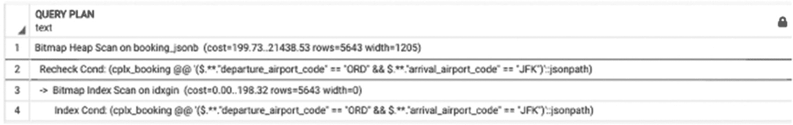
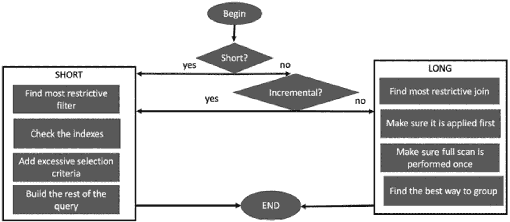

# 第 16 章 终极优化算法

## JSON 与 JSONB 的索引

有时，为了寻求灵活性，开发者会将表行转换为文本或半结构化格式（`JSON`或`XML`），然后使用文本搜索而非更特定的索引。这种方法当然比外部索引工具更好，但速度明显慢于特定索引。

回到我们在第 14 章末尾提出的问题：既然我们可以直接将`JSON`类型存储在数据库中，为什么还要费心构建函数将搜索结果转换为`JSON`呢？

让我们看看这种方法在实践中如何运作。为此，我们来构建一个将预订信息存储为`JSON`对象的表。我们遇到的第一个问题是，不同的应用程序端点可能需要不同的`JSON`结构（我们已经在第 12 至 14 章中构建了几种不同的记录类型）。但让我们假设我们可以整合不同的需求，并以能满足大多数用例的方式存储数据。我们可以使用清单 15-1 中的代码。

```sql
--创建简化的预订航段记录类型
CREATE TYPE booking_leg_record_2 AS
(booking_leg_id integer,
leg_num integer,
booking_id integer,
flight flight_record);
--创建简化的预订记录类型
CREATE TYPE booking_record_2 AS
(     booking_id integer,
booking_ref text,
booking_name text,
email text,
account_id integer,
booking_legs booking_leg_record_2[],
passengers passenger_record[]
);
---创建表
CREATE TABLE booking_jsonb AS
SELECT  b.booking_id,
to_jsonb ( row (
b.booking_id,  b.booking_ref,  b.booking_name, b.email, b.account_id,
ls.legs,
ps.passengers
) :: booking_record_2 ) as cplx_booking
FROM booking b
JOIN
(SELECT booking_id,    array_agg(row (
booking_leg_id, leg_num, booking_id,
row(f.flight_id, flight_no, departure_airport,
dep.airport_name,
arrival_airport,
arv.airport_name,
scheduled_departure, scheduled_arrival
)::flight_record
)::booking_leg_record_2)  legs
FROM  booking_leg l
JOIN flight  f   ON  f.flight_id = l.flight_id
JOIN   airport dep  ON dep.airport_code =  f.departure_airport
JOIN   airport arv  ON arv.airport_code =  f.arrival_airport
GROUP BY booking_id)  ls
ON b.booking_id = ls.booking_id
JOIN
( SELECT    booking_id,
array_agg(
row(passenger_id, booking_id, passenger_no, last_name, first_name):: passenger_record)  as passengers
FROM passenger
GROUP by booking_id) ps
ON ls.booking_id = ps.booking_id
) ;
```
清单 15-1
构建一个包含`JSONB`列类型的表

请注意，我们创建表时使用的是`JSONB`（`JSON`二进制）列类型，而不是`JSON`。这些类型之间的唯一区别在于，`JSONB`存储的是`JSON`数据的二进制表示形式，而非字符串。对于`JSON`类型，你能构建的唯一索引是针对特定标签的 B 树索引，然后你需要指定完整的路径，包括数组中的索引，这使得例如索引“任意”预订航段变得不可能。

如果我们想在`JSON`列上构建高性能的索引，就需要使用`JSONB`类型。

构建这个表需要一些时间。构建一个 GIN 索引也需要一些时间：

```sql
CREATE INDEX idxgin ON booking_jsonb USING GIN (cplx_booking);
```

然而，在这个索引创建之后，感觉我们所有的问题都解决了。现在我们可以使用简单的查询来检索所有需要的数据，无需任何连接和任何复杂的结构构建，如清单 15-2 所示。

```sql
SELECT  *
FROM  booking_jsonb
WHERE
cplx_booking @@ '$.**.departure_airport_code == "ORD" && $.**.arrival_airport_code == "JFK"'
```
清单 15-2
使用`JSONB`列上的 GIN 索引进行搜索

图 15-1 中的执行计划证明使用了 GIN 索引。



一个查询计划的截图。它有 4 行代码，用于在预订期间检查出发机场代码 O R D 和到达机场代码 J F K。

图 15-1
带有 GIN 索引的执行计划

有几个问题使得这种方法不如乍看之下那么吸引人。首先，这种搜索仍然比使用 B 树索引的搜索慢。使用第 14 章描述的技术生成的搜索函数能产生相同的结果，但速度快了两到五倍。

其次，GIN 索引不支持对日期时间属性的搜索，也不支持使用`like`运算符的搜索，或者对任何转换后的属性值（如`lower()`）的搜索。你可以在`WHERE`子句中使用`json_path`表达式和`JSONB`运算符及函数来指定几个复杂的搜索条件（包括正则表达式），但这些条件将通过堆扫描来检查。一个好主意是将这些条件与那些支持索引的条件结合起来。

实际上，我们见过一个这样构建的生产系统：来自多个表/模式的数据被用来创建`JSON`类型的“搜索文档”，然后添加了`ts_vector`列并为其创建了索引。

然而，这种方法还有第三个问题。如前所述，一个`JSON`结构只能支持一个层次结构。如果我们按照前面的描述构建了`booking_jsonb`列，我们可以相对容易地更新预订航段中的航班，但我们无法更新实际的出发时间或航班状态。

这意味着`booking_jsonb`表必须定期重建才能保持有用。事实上，前面提到的那个生产系统有一个复杂的触发器序列，用于重建所有可能受影响的`JSON`数据。在预期更新数量相对较低的情况下，这个限制可能并不关键，但对于航班延误和时刻表变更的情况则并非如此。

## 小结

PostgreSQL 拥有多种不同的索引。本书涵盖了许多种，但并非全部；几乎每个新版本都会出现新的索引类型。如果在本章撰写完成到本书出版期间发布了新的索引，也不足为奇。

第 5 章和本章都提供了许多示例，说明如何为支持不同的搜索选择正确的索引。为你的系统、针对特定搜索选择最合适的索引并非一项简单的任务。不要止步于为单个列创建 B 树索引。你需要复合索引吗？函数索引？GIST 索引能帮助你解决问题吗？这个特定查询的响应时间有多关键？这个特定索引对更新的影响有多大？只有你能回答这些问题。

前面的章节涵盖了大量的优化技术：不仅包括优化`SQL`语句的不同方法，还包括数据库设计如何影响性能、与应用程序开发人员协作的重要性、函数的使用以及数据库性能的许多其他方面。

尽管如此，引言中提出的问题仍然存在：当你遇到一个现实世界的问题，当你的用户看到沙漏图标而你却不知缘由时，该从何处着手？一个相关但更具挑战性的任务是弄清楚从一开始该做什么。你还没有遇到问题。你有一个任务，可能是一个查询草案，或者你很幸运拥有详细的需求。你如何确保自己做的是对的？

在本章中，我们将提供一个分步指南，帮助你立即正确地编写查询，并在有选择时，选择适合你的数据库设计。


## 主要步骤

图 16-1 展示了一个建议用于确定针对您所处理查询的最佳策略的流程图。在后续章节中，我们将更详细地讨论每个步骤。



一个最终优化算法的流程图。它包含是或否条件，用于检查短查询和增量值。如果是短查询，则找到最具限制性的筛选条件，进行处理，然后构建查询的其余部分。如果是长查询，则找到最具限制性的连接，进行处理，并找到最佳的分组方式。

图 16-1

最终优化算法的步骤

## 分步指南

### 步骤 1：短查询还是长查询？

第一步是确定所讨论的查询是短查询还是长查询。如第 5 章和第 6 章所述，仅查看查询本身不一定能帮助您找到答案。步骤 1 是回顾查询优化始于收集需求的好时机，与业务负责人和/或业务分析师合作非常重要。

确认业务是对最新数据感兴趣，还是需要追踪历史趋势等等。业务方可能会说他们需要查看所有已取消的航班，但最好问一下他们是想查看有史以来所有已取消的航班，还是仅限过去 24 小时内的。

如果您确定所讨论的查询是短查询，请转到步骤 2；否则，请转到步骤 3。

### 步骤 2：短查询

因此，您的查询是一个短查询。您需要遵循哪些步骤，以确保它不仅以尽可能最佳的方式编写，而且即使在数据量增长时，查询性能也能保持稳定？

#### 步骤 2.1：最具限制性的条件

为您的查询找到最具限制性的条件。请记住，通常仅通过查看查询无法判断哪个条件是。查询表以查找属性的不同值数量。注意值分布（即找出哪些值出现频率最低）。识别出最具限制性的条件后，进行下一步。

#### 步骤 2.2：检查索引

在此步骤中，您需要检查是否有支持对最具限制性条件进行搜索的索引。这包括以下内容：

*   检查最具限制性条件的所有搜索属性是否都已编入索引。如果索引缺失，请请求或创建一个。
*   如果涉及多个字段，请检查复合索引是否会表现更好，以及性能提升是否足以证明创建额外索引的合理性。
*   检查是否可以使用复合索引或覆盖索引进行仅索引扫描。

#### 步骤 2.3：添加额外的选择条件（如果适用）

如果最具限制性的条件基于来自不同表的属性组合，因此无法编入索引，请考虑添加一个额外的选择条件。

#### 步骤 2.4：构建（或重建）查询

通过应用最具限制性的条件开始编写查询；这可能意味着从单表选择开始，或者从包含最具限制性条件的连接开始。

不要省略此步骤。通常，当数据库开发人员了解对象之间的关系时，他们倾向于在应用筛选条件之前编写所有连接。虽然我们知道这是一种经常被推荐的方法，但我们认为对于具有多个连接的复杂查询，这可能会使开发复杂化。我们建议从您已知执行高效的 `SELECT` 语句开始，然后一次添加一个表。

每次添加新连接时，检查查询性能和执行计划。请记住，优化器在估计中间结果集的大小时，离执行树的根节点越远，往往越容易出错。如果查询中的连接数量接近十个，您可以考虑使用 `CTEs`（如果您的版本是 12 或更高），或者考虑构建动态 SQL。

### 步骤 3：长查询

您的查询是一个长查询。在这种情况下，第一步将是确定是否可以使用增量刷新。再次强调，这是您需要与业务负责人和/或业务分析师合作，以更好地理解查询目的的时候。通常，需求的制定没有考虑数据动态性。当查询的结果存储在表中并定期更新时，可以每次拉取最新数据（完全刷新，从时间起点拉取所有数据到最新可用数据），也可以增量拉取，仅引入自上次数据拉取以来发生变化的数据。后者就是我们所说的增量更新。在绝大多数情况下，可以增量拉取数据。例如，不是像第 7 章所示那样创建 `passenger_passport` 物化视图，而是将其创建为表 `passenger_passport`，并在输入新的护照信息时添加/更新行。

*   如果可以使用增量更新，请转到步骤 4。
*   否则，请转到步骤 5。

### 步骤 4：增量更新

将选择最近添加/更新记录的查询视为一个短查询，其中更新时间是最具限制性的条件。转到步骤 2 并遵循优化短查询的步骤。

### 步骤 5：非增量长查询

如果无法运行增量更新，请继续执行长查询优化的以下步骤：

*   找到最具限制性的连接、半连接或反连接（如果适用）（有关详细信息，请参阅第 6 章），并确保它首先执行。
*   逐个向连接中添加表，并在每次添加后检查执行时间和执行计划。
*   确保您不会多次扫描任何大表。按照第 6 章所述，规划您的查询，使大表只被扫描一次。
*   注意分组。在大多数情况下，您需要将分组推迟到最后一步，也就是说，您需要确保 `GROUP BY` 是执行计划中的最后一条语句。请注意第 6 章中描述的一些情况，在这些情况下，应提前执行分组以最小化中间数据集的大小。


