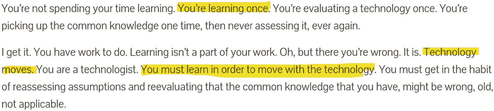

# 1. 面向现代开发者的数据库

云计算的出现在各个领域带来了大量创新，关系型数据库也从中获益匪浅。它们已发展到这样的程度：其中许多，包括 Azure SQL 在内，如今都融合了传统上只见于非关系型数据库、分布式系统和分析平台的特性。这种演进在灵活性和可扩展性方面提供了大量选项，同时依然提供由关系代数坚实数学基础所保障的一致性和所有保证，使得开发者可以兼得二者之长：在一个地方同时获得成熟可靠的技术与新颖颠覆性的创意。

## 我们为何撰写本书？

正如你将在本书中了解到的，Azure SQL 数据库中包含了你可能意想不到的许多特性。或许你现在已猜到了，这正是我们感到需要一本如你手中所持的书籍的原因。作为一名开发者，你需要知道手边有哪些工具和特性可以助你最优地完成工作，而本书正是为此提供帮助。本书将从一种全新的开发与数据管理方法出发，贯穿思维模式的转变——这是应对像云所提供那样不断演进环境所必需的——进而讨论像 Azure SQL 这样的现代数据库在当今现代软件架构中所能扮演的角色，同时采用非常实用的方式，阐释 Azure SQL 向你开放的所有特性，以及它们在现代解决方案中的适用场景和使用方法。

事实上，你迟早要与数据打交道，无论它数量巨大还是仅仅一点。你越早学会恰当地处理它并善加利用，就越有利。凭借对 Azure SQL 的深入了解，你可以简化架构，保持代码整洁，并实现清晰的关注点分离（[`https://aka.ms/seofco`](https://aka.ms/seofco)），同时仅通过使用可用特性就能将性能提升数个数量级，并扩展到几乎满足你当前或未来的任何需求。是的，这听起来好得令人难以置信，但它是真实的。而且这并非魔法。这些特性是近 30 年研发的成果，融合了当今云的弹性和可扩展性。

事实上，关系型数据库完全基于数学概念，尽管在 50 年前就已推向市场，它在应对当今挑战方面依然表现出色。就像数学中的求和运算——可能是我们所知最古老的运算——它确实不会过时。如果其背后的理念是坚实且经过数学证明的，它就将永远有效。相反，可能会过时的是它在现有硬件和软件中的使用和实现方式。这正是演进和持续改进发挥作用的地方：我们知道关系模型有效且效果良好。需要极力突破的是现有硬件和软件强加的限制。

Azure SQL 是一款关系型数据库，特别是在其新的 Hyperscale 版本中，它已完全革新和重构，以提供云服务所期望的弹性，尽管它展示的是自 1970 年代以来被成功使用的、众所周知的编程模型和数据管理特性。

这种双重特质——一方面植根于一个成熟稳健的领域（请记住，Azure SQL 就是 Azure 云中的 SQL Server），另一方面扎根于可扩展性和数据管理的令人兴奋的新前沿——使得 Azure SQL 成为一个相当独特、独一无二的数据库，能够处理当今要求最高、最需扩展性的工作负载。

因此，它集成了如此多的特性，每位开发者都会发现一些令人喜爱之处；这也意味着对于从未使用过它的人来说，有很多需要学习的内容。本书正是为此提供帮助。

## 成长型思维

2006 年，心理学家卡罗尔·德韦克出版了名为《*思维模式：成功的新心理学*》的书，在书中她介绍了*成长型思维*的概念。她描述道，那些明白才能和能力可以通过持续的努力、学习和坚持来发展、获得和提升的人，即使经历失败和挫折，也比那些拥有*固定型思维*的人更可能取得成功。拥有固定型思维的人致力于维护已达到的现状，试图不表现出任何弱点，并且总是炫耀自己似乎没有遇到任何挑战或失败，因为他们认为自己懂得很多，如果不是全部的话。

在当今这个瞬息万变的世界里，固定型思维行不通。

相反，成长型思维的理念与敏捷方法论以及更普遍的观点——即成功的关键在于*拥抱变化*的能力——完美契合。保持学习并能适应新情况的能力，是拥抱变化的能力的基础。当然，这并非一蹴而就，失败以及从失败中汲取的教训，与成功一样，都是这一过程的一部分。

这种方法还带来了另一个重要的行为：能够持续检查我们迄今所学，甚至我们的信念，是否仍然正确和适用。

正如你现在可以想象的，以上所描述的一切，乍看之下似乎与这样一本技术书籍完全不搭，但实际上它与开发者的日常生活有着更深刻、更紧密的联系，因为在云环境中，变化持续不断地发生。应对如此高变化率的能力，成为优秀开发者的首要特质之一。

事实上，并非偶然，在微软内部，“成长型思维”的理念是普遍存在的：这是发展、成长和保持竞争力所必需的。

直到其中一位作者加入微软，了解了成长型思维，他才意识到，虽然有些开发者始终拥有这种思维，但另一些则没有。而这对于一切与数据和数据库相关的事情尤其如此。开发者通常不那么喜欢数据库，如果必须处理的话，他们往往只是试图以最简单、最快捷的方式搞定。

但在信息时代，应该很清楚，数据，进而信息，再而知识，是我们所构建和赖以生存的一切的重心。高效操纵数据的能力将立即使一个开发者变成一个*更好的开发者*。

成长型思维是开始审视这一挑战的一种方式。但这如何应用于开发？任何人都能成为*更好的开发者*吗？为什么这很重要，最重要的是，这与 Azure SQL 有什么关系？

让我们尝试给出一些答案。

### 重新审视旧观念

“关系模型过时了，无法扩展。” “你需要使用一些新范式才能扩展到云级别。” 甚至，“你无法在关系数据库中处理超过几百万行的数据。” 无论你是在云时代出生的新一代开发者，还是自己组装过第一台电脑、至今仍知道什么是*半字节*的老手，你听到上述言论的可能性都很高。

既然有人说过这些，甚至写书撰文论述，那它们必定是真的。嗯，它们在某个时间点，比如大约 40 年前，可能是真的。但从那时到现在已经过去了很多年，所以是时候检验这些观念和迷思是否依然正确了。

答案是：不。Azure SQL 由 SQL Server 发展而来，多年来经过了如此多的改进和升级，如果你没有真正专注于数据领域，你可能已经错过了它们。从开发者的角度看，你仍然在处理表和列——老实说，这已经不完全正确了，你将在接下来的章节中了解到——但在幕后，数据库引擎已经进行了大量更新，正如著名的 SQL Server 专家 Bob Ward 所说，“SQL Server 2019 不是你爷爷辈的 SQL Server” ([`https://aka.ms/ssnygss`](https://aka.ms/ssnygss))。

仅举几个现在在 SQL Server（因此也在 Azure SQL）中可用的惊人功能为例：你可以找到列存储表，数据以高度压缩的列式结构存储，能够使用 AVX 和 SIMD 指令（是的，就是电子游戏用的那些指令）实现快速的向量计算；无锁结构也是可用的，它们不使用锁来保持数据一致性，而是采用更先进的技术，如多版本并发控制（MVCC），根据观察者与之交互的方式，相同的数据可以同时以不同的版本存在；表可以自动跟踪其保存数据发生的所有更改，甚至允许进行“时间点”查询，字面意思就是让查询可以回到过去；JSON 文档和图模型可用，并与查询优化器深度集成，后者是人类工程学的一个奇迹，能够为你优化任何查询的执行，考虑到表中有多少数据、有哪些可用资源，以及为达到最佳性能目标有哪些可能的替代方案。

所有这些功能——以及更多——还具备规模化运行的能力。云规模。事实上，一些最常用的网站、在线和移动游戏及应用，每天都在使用 Azure SQL，扩展到为全球数百万用户提供服务。

Azure SQL 提供了许多功能，你应该去了解一下，以确保你不是每次都在重新发明轮子。

但这只是故事的一半。

### 持续学习

在格兰特·弗里奇（Grant Fritchey）撰写的另一篇优秀博客文章中（图 1-1），你可以在以下链接找到它：“为何人们不使用列存储索引” ([`https://aka.ms/wdpuci`](https://aka.ms/wdpuci))，这个问题——以及其他多个问题——被阐述得极为透彻。我们过去习惯于学习一次，然后将所学知识沿用多年。早在很久以前，在信息技术领域就要求人们持续学习并保持更新，但那时的创新速度远比现在慢得多。

图 1-1：智慧箴言

学习新概念、技术和思想的需求，过去你完全可以每隔几年才进行一次，有时甚至间隔更长。而今天技术发展的速度已截然不同。在云端，新功能每个月都会发布。Azure SQL 也在持续更新，不仅仅是为了修正错误或改进现有功能，更是为了发布全新的功能，让全球的开发者能够利用它们来创建更简单、可扩展性更强、功能更强大的解决方案。

显然，如今要成为一名成功的开发者，其关键不仅在于精通某一门编程语言。其中一个关键因素是学习并保持持续学习的能力，这样你的解决方案才能利用最新、最优秀的创新成果，借助成百上千人已完成的工作，让你能够创建出否则不可能实现的解决方案。

你不能指望学一次就足够。显然这不够。现在再也不够了。**挑战自我，持续学习，关注新事物，并将其作为日常工作的一部分。** 这就像为你编写的代码创建单元测试或集成测试一样。多年前，几乎没人这么做。现在它已像呼吸一样自然，如果没有一些测试来保证你没有引入错误或破坏现有代码，你就无法推进你的项目。持续学习也是如此：任何人都不应因为忙于编写代码而忽视云端提供的强大能力。你可能正在浪费数小时甚至数天的时间去重复实现某些已经存在的东西。

### 更优秀的开发者

毫无疑问，懂得如何正确利用数据和数据库的开发者是更优秀的开发者——他们不仅因为能使用合适的工具来处理数据而优秀，更因为在云端，任何低效率都意味着更高的成本。例如，一个高度“健谈”的应用程序，持续地将数据从数据库移动到处理服务进行计算和处理，可能每秒需要执行数千次查询。这就需要将处理服务与数据库紧密部署，以最大限度地减少网络延迟，因为*每一次*查询都会产生一些网络延迟（因为数据需要在数据库内外移动）；此外，代码会更复杂，需要更多的 CPU 资源；与此同时，数据库将被用作一个“愚钝”的存储，仅仅为了处理一个用户发出的大量查询就浪费 CPU 周期，导致的结果是，随着新用户使用该服务，可扩展性的成本会越来越高，因为需要越来越多的计算能力。通过利用 `Table-Valued Parameters`（表值参数）或 `Bulk Load`（批量加载）等批处理技术，可以避免这一系列问题。更优秀的开发者会知道何时应该编写代码，何时应该利用数据库来高效地操作数据。这只是一个简单的选择，却可能在许多地方产生带有一连串零的影响：从你公司月底需要支付的云账单，到维护和演进系统所需的时间，再到能够将解决方案的不同部分隔离出来并行工作的能力。

通过了解你的工具、保持务实，并牢记“你不是谷歌” ([`https://aka.ms/yang`](https://aka.ms/yang))，成为一名更优秀的开发者；不要仅仅因为大公司采用了某项新奇技术就盲目跟风。选择最能满足你整体需求的工具，综合考虑成本、性能、功能、可支持性和可用性。

### 不仅仅是被动的数据容器

关系型数据库远不止是一个数据容器。它不仅仅提供了一种持久化数据的方式，正如一些持有非常极端观点的架构师和开发者可能认为的那样。如果你只需要一个持久化层，甚至一个文本文件可能就足够了，尤其是在今天，你可以将文本文件放在 Azure Blob Storage 中，并几乎可以确定它将是高可用、安全且全球分布的。但是，这就够了吗？

挑战始于当超过一个实体（无论是人还是软件）需要访问这些数据时。谁来确保所有需要访问的人不会互相踩脚？如何确保对部分存储数据的访问是安全的，使得不同的实体只能访问他们被允许查看的数据？谁来负责确保这些数据以正确的方式处理，以便如果一个应用程序在修改数据时崩溃，所做的修改不会半途而废？

当然，如果你的解决方案是唯一访问数据库的，你可以将所有这些逻辑放在解决方案的某个地方。虽然从架构的角度来看这听起来非常优雅，但实现和维护的成本也很高。这再次归结于判断“重新发明轮子”是否有意义。如果你正在创造一种探索火星的新交通工具，那么重新发明轮子肯定有意义。但在大多数情况下，你并不要去火星。因此，将你的开发精力集中在应对独特业务挑战的事物上，而不是使用那些已经可用并经历了近半个世纪实战检验的东西，会好得多。所有的进化都建立在前人的肩膀上：在软件开发中遵循同样的方法也是有意义的。

### 数据的守护者

数据库是数据的守护者。如果所有的开发者都是好开发者，如果没有错误产生，如果我们不必处理人为错误或硬件故障，那将是一个美好的世界。但这不是我们生活的世界，而且很可能永远不是。现实情况是，并非所有开发者都是好开发者，硬件会发生故障，因此数据需要受到保护，免受任何有意或无意的损坏。

数据是终极资产，它承载着价值，因为它可以转化为信息和知识，必须不惜一切代价加以保护。像 Azure SQL 这样的数据库，在众多职责中，其主要目的在于保护数据免受任何事物的影响——包括错误、故障、不一致性以及恶意用户。

数据库是确保数据在大规模、预期性能下得到正确修改和服务的最后机会。将所有这些功能移出数据库将意味着创建一个新的数据库管理系统。但那样你就回到了起点。沿用之前的类比，这就像你为探索火星而创造的轮子现在也能在地球上使用，并且适用于各种地形：它无疑更灵活，但与现有的轮子具有完全相同的优缺点，并增加了复杂性——只有少数人知道如何正确使用它。

所以，还是好好学会如何善用现有的轮子吧。

