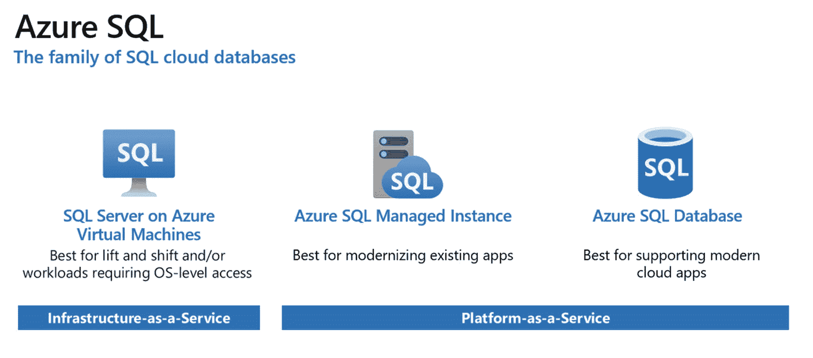

# 2. Azure SQL 入门指南

Azure SQL 的首次提及（当时称为“Microsoft SQL Services”）是在 2008 年微软专业开发者大会（PDC）上宣布“红狗项目”（即 Microsoft Azure）时。这个云端托管的 SQL Server 版本是 Azure 上最早可用的服务之一。从一开始，它就旨在提供 SQL Server 的**平台即服务（PaaS）**形态，让你无需配置硬件或修补软件，并能享受云端运行带来的优势——可用性、性能、安全性和可扩展性——而无需在本地部署复杂且昂贵的系统。自那时起，Azure SQL 便伴随着 Azure 平台持续成长和演进。当你阅读本书时，重要的是要记住事物总是在变化。虽然书中的一些“小石子”或细节可能会随着平台的发展而略有改变，但你将在本书中学到的“大石子”将为你在数据库开发领域的发展提供坚实的基础。

对于 Azure 或 Azure SQL 的新手读者来说，本章将作为一个入门指南，帮助你快速上手并准备使用 Azure SQL 构建应用程序。你将了解当今 Azure SQL 中存在的灵活部署方式，以及一些常见场景，这些场景可以帮助你决定应该选择何种部署选项、服务层级和其他选项。你还将了解一些可用于操作和管理 Azure SQL 的工具和示例。

在阅读本章（以及后续章节）时，我们建议你充分利用随书提供的代码示例，以便获得一些关于这些主题的实践经验。

如今，当你听到“Azure SQL”这个词时，它指的是一套产品，而不仅仅是 Azure SQL Database。在 Azure SQL 内部，有不同的部署选项，这基本上相当于 Azure SQL 品牌下的不同产品。如图 2-1 所示，根据抽象级别和访问级别，很容易将部署选项分为三类：操作系统（OS）级别、服务器级别和数据库级别。



图 2-1：Azure SQL 产品家族

操作系统级别的访问意味着 Azure 负责处理所有事务，直到你获得操作系统级别的控制权。数据中心、硬件、虚拟化等由微软管理，但操作系统、SQL Server 和数据库则由你管理。你本质上获得了一个预装了 SQL Server 的 Azure 虚拟机。这通常被称为**基础设施即服务（IaaS）**类型的产品。使用 IaaS，虽然你负责管理和修补操作系统、SQL Server 和数据库，但你也能访问这些级别中包含的所有功能。例如，如果你想在 SQL Server 所在的同一台机器上运行第三方应用程序，你可以通过 IaaS 来实现。此外，SQL Server 2019（本书撰写时的最新版本）中有一些功能在其他部署选项中尚不可用，例如 PolyBase。如果你希望获得与 SQL Server 100% 的功能一致性，Azure SQL 虚拟机可能是你的最佳选择。更多信息请参见 [`https://aka.ms/azuresqlvm`](https://aka.ms/azuresqlvm)。

当你从需要操作系统级别访问的场景移开，开始寻找更多托管服务时，有一些 Azure SQL 选项属于**平台即服务（PaaS）**类型的产品，这些选项将是本书的重点。使用 PaaS 服务，你可以获得诸如自动备份、数据库引擎和操作系统的修补、可用性的服务级别协议（SLA）、高级安全性、监控和开箱即用的可扩展性等功能。对于开发者来说，这意味着你可以拿到一个连接字符串，不再需要担心维护问题，并花更少的时间在故障排除上。

例如，假设你不想操心操作系统补丁和 SQL Server 升级。你只想要一个 SQL Server 实例。你可以选择 `Azure SQL 托管实例`，它将操作系统抽象化，让你拥有一个始终最新的、托管的 SQL Server 实例。在这里，你几乎可以获得所有的实例级功能；例如，支持 SQL Server Agent、Service Broker、链接服务器和公共语言运行时（CLR）。这种部署选项非常适合那些希望迁移到 PaaS 产品，但仍需控制和访问许多服务器级别组件的公司。Azure SQL 托管实例还提供原生虚拟网络支持，允许你根据需要将该服务集成到本地网络中。

现在，考虑这样一种场景：你的公司正在转型为云原生实体，或者你在一个云端诞生的公司工作。也许你对管理 SQL Server 实例不感兴趣，也不需要服务器级别的功能。甚至，你可能根本不知道 SQL Server 是什么，因为你可能从未在本地使用过它或有使用它的需要。那么，你正在寻找的是 Azure SQL 能提供的下一层抽象，即 `Azure SQL Database`。在这个产品中，你可以获得 Azure SQL 托管实例所给予的所有 PaaS 优势，但你只获得一个数据库和数据库级别的功能。对于这种部署选项，你会有一个用于组织和管理的逻辑服务器，但无法访问实例级别的功能或视图。

在 Azure SQL 托管实例和 Azure SQL Database 之间做选择时，你可以考虑一些额外的权衡因素，以确定最适合应用程序需求的方案。思考 Azure SQL 托管实例与 Azure SQL Database 的一种方式，类似于你思考虚拟机与容器的方式。如果你使用虚拟机（VM）来部署应用程序，你会拥有更多的计算能力、磁盘和安全服务，但每个主机只能运行 2-10 个虚拟机。另一方面，如果你使用容器，你会得到更轻量、更快、弹性更大且每个主机可运行数百个容器的方案。如果你将这种思路应用到 Azure SQL 上，使用 Azure SQL 托管实例，你能获得更多功能和控制权；而使用 Azure SQL Database，你能获得更快、更小且可能成本更低的方案。让我们来考虑一下这些权衡因素。


## Azure SQL 选项概览与创建指南

首先，您可能会考虑成本因素。虽然 Azure SQL Database 和 Azure SQL 托管实例在存储和计算方面的定价相同，但如果您只有少数几个数据库，且其消耗低于 Azure SQL 托管实例的最低配置，那么 Azure SQL Database 可能更便宜，因为它允许更小的最低配置（成本更低）。Azure SQL Database 还能保证特定数据库的资源，因为它不像 Azure SQL 托管实例那样与其他数据库共享资源。您可能还会考虑速度和弹性。由于 Azure SQL Database 部署在安全的公有云中，Microsoft 可以在几分钟甚至更短时间内完成资源调配和扩展。而 Azure SQL 托管实例则部署在完全隔离的环境中（这具有安全优势），但结果是资源调配和扩展可能需要数小时。从功能角度来看，Azure SQL 托管实例允许访问实例级功能，如果您当前未使用这些功能，但可能希望以后有选项使用它们，它还允许进行时区和排序规则（将在本章后面介绍）的自定义，这是 Azure SQL Database 所不具备的。

接下来，让我们看一个拥有许多数据库或许多 SQL Server 实例的场景。也许您是一个 *软件即服务* (SaaS) 提供商，您的软件服务于多个客户，这意味着您需要多租户支持。或者您有许多不同的 SQL Server，想要迁移到 PaaS 产品中。到目前为止，我们探讨的是单个数据库或单个实例的场景，但对于这些场景，您可以考虑“池”选项，它允许多个数据库或服务器共置并共享资源。这可以实现成本优化并减少管理开销。对于多个数据库，您可以考虑 *弹性池*，而对于多个实例，您可以考虑 *实例池*。

尽管选择众多，但 Azure SQL 平台具有灵活性，能够满足您的需求。在本书中，我们将从开发人员的角度，更深入地探讨不同 PaaS 部署选项之间存在的功能和细微差别。

如果您是 Azure SQL 的新手，所有这些选项可能会让您望而生畏，但请不要担心。如果您想轻松入门，并且在 90% 的情况下都能获得所需，可以从 Azure SQL Database 开始。但请放心，所有其他选项都是为了确保即使您作为开发人员遇到最奇特、最苛刻的边缘情况也能得到覆盖。

### 创建 Azure SQL Database

要创建单个数据库（或托管实例、弹性池、实例池），您首先需要一些关于 Azure 的基础知识。首先，您需要一个 Azure 帐户和一种支付服务费用的方式。如果您之前没有创建过 Azure 免费帐户，可以访问 [`https://azure.com/free`](https://azure.com/free) 获取一次性额度。这应该足够您完成本书中大部分（如果不是全部）实践练习。如果您已经使用过免费帐户，并且拥有支持该福利的 Visual Studio 订阅，您可能每月会有一定金额的 Azure 额度。如果这些都不是选项，您将需要使用或获取一个有权创建和管理资源的 Azure 帐户。

一旦您准备好使用 Azure，您将创建一个 *资源组*，它基本上是绑定到特定订阅的一组 Azure 资源的逻辑容器。您可以使用任何喜欢的操作系统、Azure 门户、PowerShell 或 Azure CLI（命令行界面）来执行与部署和管理资源相关的任务。例如，在安装 Azure CLI ([`https://aka.ms/install-azure-cli`](https://aka.ms/install-azure-cli)) 后，您可以连接并使用以下代码创建一个资源组。

```
### 登录到您的 Azure 帐户
az login
### 查看您可用的订阅
az account show
### 复制您要使用的订阅的 "id" 并将其设置为默认值
az account set –-subscription <subscription_id>
### 查看您的帐户可用的区域，记下您要使用的区域的 "name"（例如 "westus"）
az account list-locations
### 创建一个资源组（指定区域和名称）
az group create –l <region> -n <resource_group_name>
```
*清单 2-1 设置 Azure CLI 并创建资源组*

请注意，您必须提供创建资源组的 *区域*。所有资源都绑定到一个区域（例如，美国西部、印度南部、中国东部）。由于资源组本身本质上是一个元数据实体，您在创建时选择的位置表示元数据存储的位置。理论上，资源组中的每个资源都可以在不同的区域中创建。一旦您有了一个资源组，就可以开始将其他资源（应用程序、网络、数据库等）部署到其中。要查看您的帐户可用的所有区域并找到前面脚本中使用的区域名称，您可以运行以下命令：

```
az account list-locations -o table
```
*清单 2-2.*

要部署 Azure SQL Database，您首先需要一个 *逻辑服务器*，它与资源组类似，用于将 Azure SQL 数据库分组在一个逻辑容器中。您可以在同一个逻辑服务器中拥有弹性池和单个数据库。使用 Azure CLI，您可以使用以下代码完成此操作。

```
### 创建一个逻辑服务器
az sql server create –-admin-password <password> –-admin-user <username> –-name <server_name> –-resource-group <resource_group_name> –-location <region>
```
*清单 2-3 创建 Azure SQL Database 服务器*

配置好逻辑服务器后，您可以使用以下代码将数据库（单个数据库或弹性池中的数据库）部署到该服务器。

```
### 使用默认配置创建一个 Azure SQL Database
az sql db create –-name <database_name> –-resource-group <resource_group_name> –-server <server_name>
```
*清单 2-4 创建 Azure SQL Database*

我们将在接下来的章节中详细讨论众多选项、工具和示例数据库，但获取示例数据库之一（如果您想利用 AdventureWorksLT）的最简单方法是在部署时指定其中一个。您可以使用以下命令，在之前的 `az sql db create` 命令中添加一个参数。

```
### 使用默认配置和 AdventureWorksLT 示例数据库创建一个 Azure SQL Database
az sql db create –-name <database_name> –-resource-group <resource_group_name> –-server <server_name> -–sample-name AdventureWorksLT
```
*清单 2-5 使用示例创建数据库*


部署过程需要几分钟时间，但一旦完成，你将获得一个已还原 **AdventureWorksLT** 示例数据库的 Azure SQL 数据库。

一旦你的数据库部署完成并导入了数据，下一步可能是连接到它并验证所有内容是否部署正确。要从本地计算机连接，你需要指定允许连接到该数据库的 IP 地址范围。你也可以选择使用起始和结束 IP 地址值“0.0.0.0”创建防火墙规则，以允许所有 Azure 内部 IP 地址。这将使其他服务（例如 `Azure Functions`、`Azure 虚拟机`）能够连接到你的数据库。这两种选项的代码是相同的；只需在以下代码中替换所需的 IP 地址范围即可。

```bash
az sql server firewall-rule create \
–-name  \
–-resource-group  \
–-server  \
–-start-ip-address  \
–-end-ip-address
```
**清单 2-6** 创建防火墙规则

现在，你应该能够从你选择的工具（更多关于工具的内容稍后介绍）通过一个允许的 IP 地址连接到你的 Azure SQL 数据库了。

创建 Azure SQL 托管实例的过程和命令略有不同，因为对于托管实例，你创建的是一个“托管的” SQL Server（而非逻辑服务器），然后再创建“托管的”数据库。

在部署之前，你需要处理 `VNetName` 和 `SubnetName` 的新参数。这是因为托管实例必须部署在 Azure 虚拟网络的自有子网中，或仅与其他托管实例共处的子网中。设置此环境最简单的方法是使用此处提供的 Azure 资源管理器 (ARM) 部署模板：[`https://aka.ms/sqmicvs`](https://aka.ms/sqmicvs)。ARM 模板是一个 JSON 文件，它使用声明性语法来定义要部署的基础设施和配置。有许多 ARM 模板可用于开始在 Azure 中构建简单或复杂的解决方案 ([`https://aka.ms/armtemplates`](https://aka.ms/armtemplates))。使用 ARM 模板，你只需单击“部署到 Azure”按钮并填写你的订阅和资源组信息，它就会部署托管实例所需的虚拟网络和子网。

你可以在此处阅读有关不同命令的更多信息：[`https://docs.microsoft.com/en-us/cli/azure/sql/mi`](https://docs.microsoft.com/en-us/cli/azure/sql/mi)，下面是一个示例脚本。

```bash
### 使用默认参数创建 Azure SQL 托管实例
az sql mi create -g  -n  -l  -i -u  -p  --subnet /subscriptions//resourceGroups//providers/Microsoft.Network/virtualNetworks//subnets/
### 在现有的 Azure SQL 托管实例内创建新的托管数据库
az sql midb create -g  –-mi  -n
```
**清单 2-7** 用于创建 Azure SQL 托管实例的 Azure CLI 命令

## 用于使用和管理 Azure SQL 数据库的工具

在上一节中，你了解了如何使用 Azure CLI 来部署和管理 Azure SQL。根据你要完成的任务和你的偏好，还有其他工具可供你利用。例如，如果你更熟悉 PowerShell，你可以获得与 Azure CLI 大致相同的功能。由于 SQL Server 和 Azure SQL 已经分别存在了 25 年和 10 年以上，因此也有许多可用的命令行工具。如果你正在寻找提供图形用户界面 (GUI) 的工具，也有几种供你选择。在本节中，你将从 GUI 到 CLI 概览可用的工具。

大约有五种主要提供 GUI 的工具，其中最流行的是 `SQL Server Management Studio` (SSMS)。这个工具已经存在了 20 多年，可用于访问、管理和开发 SQL Server 和 Azure SQL 的组件。它包含图形工具和脚本编辑器。

`Azure Data Studio` (ADS) 是一个较新的开源工具，也提供了 GUI 和 SSMS 的大部分功能。ADS 构建在 Visual Studio Code 之上，所以如果你熟悉后者，你会对 ADS 感到得心应手。ADS 也是跨平台的，支持 Windows、macOS 和 Linux。在 SSMS 和 ADS 之间做选择时，通常取决于偏好或功能需求。例如，如果你想利用 Jupyter 来创建 SQL、PowerShell、Python 等笔记本（笔记本最简单的解释是可运行并保存结果的代码单元格与格式化文本单元格的混合），那么 ADS 是目前唯一支持该功能的工具。同样，有些功能你只能在 SSMS 中找到而 ADS 没有。微软正在积极投资这两个工具，所以请期待它们持续演进。

还有两个直接链接到 Visual Studio 的扩展：`SQL Server Data Tools` (SSDT) 和 `mssql`。SSDT 是一个用于设计和部署与 SQL（包括 Azure SQL）相关的许多内容的工具，它提供了类似于使用 Visual Studio 开发应用程序的体验。类似地，Visual Studio Code 的 mssql 扩展允许你利用这个轻量级编辑器连接到数据库和实例，并享有良好的编辑体验。

第五个提供管理和开发 GUI 的工具是 Azure 门户。从部署到与其他应用程序和服务的集成，Azure 门户是一种简单、用户友好的方式，几乎不需要编码即可构建应用程序。

转向命令行工具，也有很多。大多数命令行工具都是跨平台的（Windows、macOS 和 Linux）。有些是用于非常具体的任务；以下是几个常见的例子：

*   `mssql-cli` 是一个开源的命令行工具，专门用于查询，具有交互性和诸如智能感知和语法高亮等有用功能 ([`https://aka.ms/mssqlcli`](https://aka.ms/mssqlcli))。

*   `sqlcmd` 实用程序允许你在命令提示符下使用 T-SQL 语句、脚本文件和系统存储过程。

*   `大容量复制程序` 实用程序 (bcp) 专门用于批量复制数据。

*   `mssql-scripter` 可用于帮助创建、编辑和存储脚本 ([`http://aka.ms/mssqlscripter`](http://aka.ms/mssqlscripter))。

*   `sqlpackage` 可自动执行与提取、发布、导出和导入实时数据库、数据库架构和用户数据相关的任务 ([`http://aka.ms/sqlpackage`](http://aka.ms/sqlpackage))。

有些工具是为更广泛的用途而构建的。例如，Azure CLI 和 SQL Server PowerShell 插件提供了用于访问、部署和管理 Azure SQL 的命令。几乎可以肯定的是，你不会只使用一个 GUI 工具或一个 CLI 工具，而是会使用两者的组合（甚至在同一类别内使用多个）。正如你将在其他章节中看到的，有些任务使用不同的工具会更容易完成。

在整本书中，你将更深入地接触不同的工具。如果你想要任何工具的参考资料，这里有一个有用的链接可以指导你：[`https://aka.ms/sqltools`](https://aka.ms/sqltools)。

## 选择，选择，还是选择

一旦你明确了哪种 Azure SQL 部署选项最适合你的场景（Azure SQL 数据库单一数据库或弹性池，或 Azure SQL 托管实例子单实例或实例池），你还可以做出许多其他选择来定制解决方案以满足你的需求。在前面的部分中，你看到了如何使用 Azure SQL 数据库 CLI 进行部署，但许多选项都是默认选择。在本节中，你将了解在部署过程中可以做出的所有选择和配置，以及一些关于如何选择的指导。本节遵循目前 Azure 门户中呈现的顺序和流程，但顺序和具体细节可能会根据你选择的部署工具（Azure 门户、Azure PowerShell、Azure CLI）而变化。


### 快速回顾

在本章第一节“创建 Azure SQL 数据库”中，我们介绍了一些 Azure 基础知识，包括 Azure 订阅、资源组、区域以及 Azure SQL 数据库的逻辑服务器。回顾一下，要在 Azure 中执行任何操作（即使是免费操作），你都需要一个 Azure 订阅；资源组是你部署在 Azure 中的资源或服务的逻辑容器或元数据实体；区域是你的服务部署的地点；而逻辑服务器则充当多个单数据库或池数据库以及与该逻辑服务器关联的其他设置/配置的集中管理点。对于 `Azure SQL 托管实例`，你选择的服务器名称并非逻辑服务器，而是实际的服务，之后你可以在其中部署数据库（有时称为“托管数据库”）。在所有部署选项中，你都需要提供管理员登录名和密码。如果你熟悉 `SQL Server`，这相当于 `SQL Server` 中的系统管理员。此账户将使用你提供的用户名和密码进行连接，并且只能存在一个这样的账户。如果你熟悉 `Azure Active Directory`，也可以选择在此处或部署后配置单个或安全组账户（可选）。

### DTU 或 vCore

设置好管理员登录后，在部署 `Azure SQL 数据库` 时，你的下一个选择是是否要将部署的数据库作为新的或现有的 `弹性池` 的一部分。如果是，那么你就必须为 `弹性池` 配置服务层、存储和计算选项。请注意，在 `弹性池` 中，你共享池中所有数据库之间的资源。如果你希望限制某些数据库，也可以在池中的数据库之间进行资源调控。同样地，如果你要部署 `实例池`，则需要使用不同的 Azure 门户流程或命令集，因为你需要先部署 `实例池`，然后才能在其中部署 `托管实例`。

接下来，你将选择所谓的购买模型，有两个选项：基于虚拟核心 (`vCore`) 的模型或基于数据库事务单元 (`DTU`) 的模型。`DTU` 模型在 `Azure SQL 托管实例` 中不可用。基于 `DTU` 的模型是 `Azure SQL 数据库` 中的早期购买模型。其理念是你获得一个计算、存储和 I/O 资源的捆绑度量单位（即 `DTU`），然后选择满足你需求的 `DTU` 级别。该模型的一个挑战是你无法在这三者之间独立扩展，并且很难确定你获得的具体资源。基于 `vCore` 的模型是应客户要求独立选择计算和存储资源而推出的。这是 Microsoft 推荐的模型。此外，使用 `vCore` 模型可以利用 `Azure 混合权益（适用于 SQL Server）` 来节省大量成本。此权益允许你应用可能已拥有的现有未使用许可，以换取大幅折扣。在 `vCore` 模型中，你需要为计算资源（基于服务层、`vCore` 数量、内存量以及硬件代数）、数据和日志存储的类型与容量以及备份存储付费。

在本书中，我们将主要关注 `vCore` 购买模型，因为它是 Microsoft 推荐的现代模型，但如果你想进一步比较 `vCores` 和 `DTUs`，可以参考这里：[`https://aka.ms/sdpm`](https://aka.ms/sdpm)。

### 服务层

一旦选择了购买模型，其下方还有称为服务层的选项。这些服务层代表了不同的性能和可用性等级。可用的层级包括 `通用型`、`业务关键型` 和 `超大规模`。仔细考虑你的选项很重要，但一个通用的建议是从 `通用型` 层开始，并根据需要进行调整。

`通用型` 层提供了一套经济、平衡且可扩展的计算和存储选项。对于 `Azure SQL 数据库`（单数据库）的 `通用型` 服务层，目前有两种计算选项可供选择：预配型和无服务器型。预配型计算适用于更常规的使用模式，其平均计算利用率随时间推移较高，或多个数据库使用弹性池。这可能是你想要开始使用的层。无服务器型计算适用于间歇性、不可预测的使用模式，其平均计算利用率随时间推移较低。

例如，考虑一个费用报销内部业务应用程序，它通常只在营业时间内使用，但在大型内部会议后或月底偶尔会出现使用高峰。这意味着每天晚上，从下午 5 点到上午 8 点，几乎没有活动发生。然而，在大型会议后和月底，会出现显著的活动高峰。然后你必须做出选择：是过度配置以满足需求高峰，还是配置不足以保持相对安静的应用程序的成本较低。使用无服务器型，你可以利用自动暂停和恢复功能，并可自定义时间延迟。这意味着当你的数据库在一定时间内处于非活动状态时，它将被暂停。在此期间，你只需支付存储费用，计算费用将降为零。一旦有人再次尝试访问应用程序，`SQL` 将重新启动，你的计算资源将在你设定的最小和最大 `vCore` 数之间按秒进行扩展。在此示例中，当需求高涨时，`Azure SQL 数据库` 可以自动扩展到所需水平，然后在需求减少时使用一个有趣的缓存回收系统来缩减。请记住，无服务器型目前仅在 `Azure SQL 数据库` 单数据库中可用，但请查阅文档以获取最新信息：[`https://aka.ms/sdserverless`](https://aka.ms/sdserverless)。

目前，除了 `Azure SQL 数据库` 的 `通用型` 层之外，所有其他层和部署选项都只有预配型计算这一选择。一旦选择了服务层，你就可以根据需要进行向上或向下扩展，甚至可以在服务层之间切换。下一个在所有部署选项中可用的服务层是 `业务关键型`。它专为具有低延迟响应要求的业务应用程序而设计。此层还通过利用多个隔离副本（其中一个也可用作只读副本）来提供最高的故障恢复能力。倾向于使用此层的一些行业包括游戏、应急和金融。虽然 `Azure SQL 数据库` 通常具有较高的服务级别协议 (`SLA`) 来设定正常运行时间和性能预期，但 `业务关键型` 可以保证最高的 `SLA`，达到 99.995% 的正常运行时间。有关 `Azure SQL` `SLA` 的更多信息，请参考这里：[`https://aka.ms/sdsla`](https://aka.ms/sdsla)。

`业务关键型` 层也是 `Azure SQL` 中唯一支持内存中技术的服务层。内存中技术将在第 9 章中更深入地介绍。概言之，内存中技术可以帮助提高各种 `SQL` 工作负载（分析型和事务型）的性能，`业务关键型` 层支持内存中 `OLTP`、聚集列存储索引、非聚集列存储索引以及内存优化聚集列存储索引。


