# 哪种 Azure SQL 驱动最适合我

对于 C#、C++、Node.JS 或 Python 等语言，根据平台和应用需求，有多种驱动选项可供选择，因此了解有哪些可用组合及其推荐情况非常重要。

如果你的应用程序面向 `full .NET Framework`（在 Windows 上）或跨平台的 `.NET Core`（在 Windows、macOS、Linux 或 Docker 上），并使用如 `C#` 这样的语言，你有两个主要选项：

*   依赖 `System.Data.SqlClient` 命名空间中经典的 `ADO.NET Provider for SQL Server`，它作为机器级别安装的完整 .NET Framework 版本的一部分提供。
*   在你的项目中引用新的 `Microsoft.Data.SqlClient` 驱动，它托管在 GitHub ([`https://aka.ms/ghmdsc`](https://aka.ms/ghmdsc)) 和 NuGet ([`https://aka.ms/ngmdsc`](https://aka.ms/ngmdsc))。

后一种选项为 Microsoft 提供了更灵活、更直接的方式，以便为 .NET 的客户端库引入改进，因此在开发一个全新的应用程序时，推荐使用此版本。使用 `dotnet` CLI 为项目安装和引用此包非常简单：

```dotnet add package Microsoft.Data.SqlClient```

像 Perl、PHP 和 Python 这样的编程语言提供了围绕原生 ODBC 驱动的轻量级包装器和接口（例如 `pyodbc`、`DBI` 等）。为了支持 Azure SQL 最新版本中所有可用的最新功能（例如 Always Encrypted、数据分类、Azure Active Directory 身份验证等），推荐使用 `Microsoft ODBC Driver 17 for SQL Server`（或更高版本）。该驱动除了支持 Windows 外，还适用于大多数主要的 Linux 发行版和版本。与此驱动一同打包的还有传统的 SQL Server 客户端实用程序，如 `sqlcmd` 和 `bcp`。ODBC 驱动的安装过程很大程度上取决于你的目标操作系统和发行版，所有详细信息都可以在此 URL 找到：[`https://aka.ms/azuresql-odbc-install`](https://aka.ms/azuresql-odbc-install)。

Java 开发人员应使用 `Microsoft JDBC Driver 8.2 for SQL Server`，这是一个 Type 4 JDBC 驱动，支持 JRE 8、11 和 12，并且可以在所有支持 Java 的主要操作系统上运行，包括 Sun Solaris。使用 Maven 时，可以通过将其作为依赖项添加到 `POM.xml` 文件中来将 JDBC 驱动添加到项目：

```com.microsoft.sqlserver
mssql-jdbc
8.2.0.jre11
```

正如 Java 领域的典型情况，JDBC 驱动不提供原生连接池功能，因此市场上有许多外部库可用。虽然我们不特别认可任何一个，但 `HikariCP` ([`https://aka.ms/hikaricp`](https://aka.ms/hikaricp)) 是我们在与连接到 Azure SQL 实例的客户合作时经常遇到的一个库，并已被证明快速且可靠。

对于其他编程语言如 `Python`，通常有多种选项可用，尽管 Microsoft 将其测试工作和信心放在 `pyodbc` 驱动 ([`https://aka.ms/pyodbc`](https://aka.ms/pyodbc)) 上，如前所述，它依赖于 SQL Server 的 ODBC 驱动，并支持大多数操作系统。你可以在命令提示符中使用以下一行命令轻松安装 `pyodbc`：

```pip install pyodbc```

类似地，对于 Node.JS，可以通过在命令行键入规范的包管理器命令来将 Tedious 驱动添加到项目：

```npm install tedious```

## 入门指南

Microsoft 官方文档为开发者提供了一个很棒的“入门”部分 ([`https://aka.ms/sdcq`](https://aka.ms/sdcq))，这是开始熟悉使用循序渐进方法为 Azure SQL 产品系列进行应用程序开发的最佳起点。

虽然你将有时间评估所有这些示例，但我们将从这里开始，使用一些最流行的编程语言，从头开始解释如何连接到 Azure SQL 并运行一些基本查询的关键方面。

本章中的所有示例都引用了一个名为“WideWorldImportersFull”的数据库，该数据库可以作为独立的 Azure SQL 数据库或托管实例进行部署。在第 2 章中，你会找到关于如何部署此示例数据库的说明。请相应地更新连接字符串以使这些示例工作。

## 清单 3-1. .NET Core 应用程序中的数据访问方法

```public async Task> GetOrders()
{
List orders = new List();
using (SqlConnection cnn =  new SqlConnection(
config.GetConnectionString
("DefaultConnection")))
// 连接字符串模式: "Server=tcp:.database.windows.net,1433;Initial Catalog=;User ID=;Password=;Connect Timeout=30;"
{
SqlCommand cmd = new SqlCommand
(@"SELECT TOP 5
[o].[OrderID],
[o].[OrderDate],
[c].[CustomerName]
FROM [Sales].[Orders] AS [o]
INNER JOIN [Sales].[Customers] AS [c]
ON [o].[CustomerID] = [c].[CustomerID]", cnn);
await cnn.OpenAsync();
SqlDataReader dr = await cmd.ExecuteReaderAsync();
while (dr.Read())
{
orders.Add(new Order()
{
OrderID = Convert.ToInt32(dr[0]),
OrderDate = Convert.ToDateTime(dr[1]),
CustomerName = Convert.ToString(dr[2])
});
}
}
return orders;
}```

在这个基本示例中，你可以找到一个典型的 .NET Core 数据访问方法，该方法可以在多种应用程序类型中复用，从控制台应用到 WebAPI 或 Azure 函数。一旦你从 NuGet 添加了对 `Microsoft.Data.SqlClient` 包的引用，你就可以使用 `SqlConnection` 和 `SqlCommand` 类，通过异步方法与 Azure SQL 交互，以打开新连接并执行命令，该命令检索结果集并实例化一个对象集合，供你在业务逻辑中使用。虽然当你执行像这样简单的操作时，幕后发生了许多其他事情，并且有许多最佳实践和指导可用于优化你的数据访问层，但你会发现在应用程序的大多数数据库交互中都会编写类似的代码。现在让我们用 Java 来解决完全相同的场景，它是企业开发人员最喜欢的编程语言之一。

## 清单 3-2. Java 应用程序中的数据访问方法

```public List getOrders() {
List order = new ArrayList();
String connectionString = "jdbc:sqlserver://.database.windows.net:1433;" + "database=WideWorldImporters-Full;user=@;" + "password=;loginTimeout=30;";
try {
try (Connection conn =
DriverManager.getConnection(connectionString)) {
String sql =
"SELECT TOP 5 "
+"[o].[OrderID],"
+"[o].[OrderDate],"
+"[c].[CustomerName]"
+"FROM [Sales].[Orders] AS [o]"
+"INNER JOIN [Sales].[Customers] AS [c] "
+"ON [o].[CustomerID] = [c].[CustomerID]";
try (Statement stmt =
conn.createStatement();
ResultSet rs =
stmt.executeQuery(sql)) {
while (rs.next()) {
order.add(new Order(
rs.getInt(1),
rs.getString(2),
rs.getString(3)));
}
}
conn.close();
}
} catch (Exception e) {
System.out.println();
e.printStackTrace();
}
return order;
}```


Java 代码示例与之前的 .NET Core 示例非常相似。一旦我们通过 Maven 为所需的应用程序类型（如控制台应用、REST 服务等）创建了初始代码骨架，就需要在 `pof.xml` 文件中引用 JDBC 驱动库以从中央包仓库下载它，然后在代码中使用。`DriverManager` 类代表应用程序中加载的所有 JDBC 驱动程序的入口点，而连接字符串中的 `jdbc:sqlserver` 前缀指示使用哪个特定驱动。`Connection`、`Statement` 和 `resultset` 再次是用于封装底层连接管理、命令执行和结果集迭代的主要类。这三个类将成为大多数数据库交互的基础。

Python 是近年来在编写数据访问和管理应用程序方面获得广泛关注的语言。让我们看看如何使用它来连接到 Azure SQL 数据库实例。

### 清单 3-3：创建一个简单的 Python 应用程序

```python
@app.route('/order')
def getorders():
cnxn = pyodbc.connect("DRIVER={ODBC Driver 17 " \
"for SQL Server};" \ "SERVER="+server+";DATABASE="+database+"" \
";UID="+username+";PWD="+ password)
cursor = cnxn.cursor()
tsql = "SELECT TOP 5 " \
" [o].[OrderID], [o].[OrderDate]," \
" [c].[CustomerName]" \
" FROM [Sales].[Orders] AS [o]" \
" INNER JOIN [Sales].[Customers] AS [c]" \
" ON [o].[CustomerID] = [c].[CustomerID]"
rows = cursor.execute(tsql).fetchall()
order_list = []
for row in rows:
d = collections.OrderedDict()
d['orderID'] = row.OrderID
d['orderDate'] = str(row.OrderDate)
d['customerName'] = row.CustomerName
order_list.append(d)
return json.dumps(order_list)
```

在这个 Python Flask 函数中（你可以在配套的 GitHub 仓库中找到完整的应用程序），`pyodbc` 模块扮演着核心角色。它提供了对 ODBC 驱动的包装以及更高级的抽象，如连接（connection）、游标（cursor）和行（row），这使你可以执行命令并遍历结果。然后，行被转换为有序字典列表，并作为 JSON 片段返回给函数调用者。秉承纯粹的 Python 风格，`pyodbc` 代表了一种从 Python 程序访问 Azure SQL 数据库实例的高效且直接的方法。

正如我们之前提到的，`tedious` 是可以从 Node.JS 应用程序连接到 Azure SQL 的驱动。让我们看一个简单的函数示例，该函数执行查询并将结果集转换为一个 JSON 数组，该数组可以作为 REST API 结果返回。

### 清单 3-4：从数据库返回 JSON 数组的 Node.JS 函数

```javascript
exports.getorders = function(req, res) {
const { Connection, Request } = require("tedious");
const config = {
server: ".database.windows.net",
options: {
database: "WideWorldImporters-Full",
encrypt: true},
authentication: {
type: "default",
options: {
userName: "username",
password: "password",
}
}
};
const connection = new Connection(config);
connection.on("connect", err => {
if (err) {
console.error(err.message);
} else {
getOrders();
}
});
function getOrders() {
var data = []
const request = new Request(
`SELECT TOP 5 [o].[OrderID],
[o].[OrderDate], [c].[CustomerName]
FROM [Sales].[Orders] AS [o]
INNER JOIN [Sales].[Customers] AS [c]
ON [o].[CustomerID] = [c].[CustomerID]`,
(err, rowCount) => {
if (err) {
console.error(err.message);
}
else {
res.send(data)
}
}
);
request.on("row", function(row) {
data.push({
orderid: row[0].value,
orderdate: row[1].value,
customername: row[2].value
})
});
connection.execSql(request);
}
};
```

如其他编程语言的先前示例所示，`Connection` 和 `Request` 对象在打开到数据库的新连接、执行命令和检索结果方面扮演着核心角色（你可以在配套的 GitHub 仓库中找到完整的工作示例）。这两个对象提供了覆盖大多数常见场景的所有属性和功能，从定义参数化查询到事务管理或批量加载。

本节并未涵盖所有可用的驱动和库，但提供了应用程序如何与 Azure SQL 连接的代表性概述，并且绝对可以应用于此处未提及的其他驱动。接下来，我们将重点介绍对应用程序数据访问层至关重要的高级和特定场景。


### 连接性方面

如第 2 章简要提到的，网络连接是应用程序与 Azure SQL 交互的另一个基本方面。尽管这更关系到基础设施设计和网络安全，而非纯粹的应用程序开发，但你仍需要考虑在此过程中发挥作用的各种选项和组件，以成功连接到你的数据库实例。Azure SQL Database 的单一数据库和托管实例部署模型都支持两种主要的应用程序连接选项：

*   `私有虚拟网络`
*   `公共连接`

托管实例在创建时会自动与 Azure 虚拟网络关联，而公共连接是可选的。对于单个 Azure SQL Database 实际情况正好相反，你应该依赖 Azure Private Link 功能，通过私有端点和完全隔离的网络流量路径，将部署在支持虚拟网络的 Azure 服务之一上的应用程序连接起来。

在需要公共连接的场景中，仍然可以考虑一些选项来管理应用程序与 Azure SQL 之间的网络流量：

*   服务器级和数据库级防火墙
*   `虚拟网络服务终结点`
*   `虚拟网络安全组`

服务器级和数据库级防火墙规则旨在定义哪些 IP 地址范围（来自公共互联网连接或各种 Azure 服务内部）可以与 Azure SQL Database 单一实例建立连接。如果存在数据库级防火墙规则（目前只能通过 `T-SQL` 命令创建），系统将首先评估这些规则以确定客户端连接是否来自允许的范围；否则，将检查服务器级规则（对与该虚拟服务器关联的所有数据库实例有效，可通过 `T-SQL`、`PowerShell/CLI` 或 `Azure 门户` 定义）。如果你决定信任来自 Azure 服务的所有网络连接，那么门户上有一个“允许 Azure 服务和资源访问此服务器”的复选框选项，可以简化你的设置。

`虚拟网络服务终结点` 是一项功能，旨在确保只有来自你部署应用程序的一个或多个 `虚拟网络/子网` 对的网络连接才能被特定的 Azure SQL 服务器接受。

在连接的应用程序端，可以创建 `虚拟网络安全组` 并将其与虚拟机的 `网络接口` 或整个子网关联，以确保它们只能连接到你的 Azure SQL 实例所在的特定 IP 地址范围和端口。

网络安全并不是影响数据库连接的唯一方面；网络延迟是另一个关键因素。连接策略决定了你的数据库连接如何与在 Azure SQL 中托管数据库的后端节点交互，可以是以下两种选项之一：

*   `代理`
*   `重定向`

使用 `代理`，你可以获得最大的灵活性，可以从任何地方使用 `完全限定域名` 服务器名和仅端口 `1433` 连接到你的实例，但这些连接总是会通过一个网关前端层，这会增加网络延迟（通常对需要频繁交互的应用程序不利）。

`重定向` 策略则直接建立到托管数据库的节点的连接，减少了延迟并提高了应用程序吞吐量，但它要求应用程序主机和数据库之间开放特定的端口范围（`11000–11999`）。

所有来自 *外部* Azure 服务 IP 范围的连接的默认连接策略是 `代理`，而来自 *内部* Azure 的连接则是 `重定向`，但你可以通过 `PowerShell` 和 `Azure CLI` 更改此默认设置。关于 Azure SQL 连接架构的更多细节可以在以下 URL 中找到：

*   Azure SQL Database 单一实例 – [`https://aka.ms/sdca`](https://aka.ms/sdca)
*   Azure SQL Database 托管实例 – [`https://aka.ms/sdmica`](https://aka.ms/sdmica)

### 弹性连接和查询执行

在云架构上构建分布式系统，关于服务到服务交互需要采用特定的方法以提高弹性和可用性。这对于所有类型的云服务和交互（从事务解决方案到批处理）通常都是正确的。

在传统的本地解决方案中，数据库和应用服务器通常位于具有专用交换机和路由器等物理网络设备的附近，以提供稳定快速的连接。当发生硬件或软件故障时，尽管有适当的冗余和高质量设备，这些故障也可能造成相当大的影响，并持续到有人物理修复问题并使系统重新上线。

在云环境中，一切都是虚拟化和完全自动化的，因此你将有更多的移动部件，可能会引入一些瞬时连接问题，应用程序开发人员应该考虑这一点以使他们的应用程序整体更可靠。例如，Azure SQL 会自动管理硬件或软件故障，或数据库节点服务应用程序请求的任何时刻的计划维护操作，但是，尽管故障转移到辅助节点的操作可能很快，但在该事件发生后的几秒钟内（平均约 8 秒，最多不超过 60 秒），数据访问代码可能会遇到异常，之后才能正常响应请求。

瞬时连接问题的其他例子可能与达到所选服务层和大小的 Azure SQL 实例的最大限制有关。由于我们指的是多租户服务，维护整个系统的稳定性至关重要。如果发生此类事件，应用程序将暂时无法连接到 Azure SQL，直到资源利用率降低到给定阈值之内。

```
if (transientError) {
    await Task.Delay(retryDelay);
    retryCount++;
}
```


### 重试逻辑

为了使应用程序更加可靠，一种常见的方法是在数据库访问代码中引入适当的重试逻辑功能。重试逻辑通常指的是一种技术，它能够：

1.  拦截由瞬时条件引发的应用程序错误。
2.  以固定的或递增的延迟间隔，对原始操作进行一定次数的重试。这样做是为了确保不会用注定会失败的请求淹没实例，从而避免通常产生的“车队效应”。

这种逻辑可以非常简单，比如在之前的尝试因返回特定异常而失败后，仅以固定的次数和一定的重试延迟来重新打开连接。

重试逻辑更棘手的用例出现在一个操作最终会修改数据库状态时，例如插入新记录或更新一个或多个现有记录。如果在此命令执行过程中发生了瞬时错误，应用程序需要负责判断之前的尝试是在数据库被实际修改之前还是之后失败的。事实上，在这种情况下，客户端应用程序不能盲目地重新执行之前的命令，因为无法保证数据尚未被修改（例如，考虑银行账户交易的情况）。重试逻辑需要确保之前的事务要么已完全提交，要么整个操作已被回滚；否则，数据库可能会保持不一致的状态。基本上，用于事务性数据库代码的重试逻辑可能相当复杂，并且通常仅适用于那些你的数据修改代码是完全幂等（即，可以多次执行而不一定修改数据库状态）的用例。

如果建模正确，数据库将帮助你确保数据的一致性：例如，不允许插入一个订单号已存在的订单。话虽如此，你仍然需要处理返回的错误，因此实现稳健的重试逻辑将显著提高应用程序的可靠性和稳定性。

### 瞬时错误与持久错误

实现健壮的重试逻辑机制的一个关键方面是，拦截并识别哪些错误应被应用程序解释为瞬时错误，哪些是永久性错误（重试逻辑对此无能为力）。

如前所述，有几类条件和事件可归类为瞬时错误，从底层硬件故障和自动重新配置到临时资源耗尽。瞬时问题也可能发生在堆栈的不同层：想象一下软件定义网络中的临时故障！虽然这些情况可能罕见且持续时间很短，但通过采用适当的编码实践来主动应对它们非常重要。Azure SQL 的公共文档在此链接中提供了对不同层典型连接问题的全面解释：[`aka.ms/tciasb`](https://aka.ms/tciasb)。

### 自定义代码或可重用库

让我们看看如何按照前面章节的描述，实际实现一个用于数据库访问的简单重试逻辑机制。以下代码非常直接，仅通过将数据库交互方法包装在一个 `for` 循环中，并拦截其执行期间可能抛出的潜在异常，提供了基本的重试功能。

```
bool success = false;
int retryCount = 3;
int retryInterval = 8;
List RetriableCodes =
new List { 4060, 40197, 40501, 40613,
49918, 49919, 49920, 11001,208 };
for (int retries = 1; retries  1)
{
Thread.Sleep(1000 * retryInterval);
// Retry interval increases by 50% every retry
retryInterval = Convert.ToInt32 (retryInterval * 1.5);
}
await MyDatabaseOperation();
success = true;
break;
}
catch (SqlException se)
{
if (RetriableCodes.Contains(se.Number) == true)
{
// Retriable error – log and continue
continue;
}
else
{
// Non-retriable error – exit the loop
break;
}
}
catch (Exception e)
{
// Generic exception – exit the loop
break;
}
}
Listing 3-5
在 C# 应用程序中创建自定义重试逻辑
```

如你所见，即使是一个相当简单的数据库操作，要使其能够抵御瞬时错误，也需要大量的“粘合”代码和复杂性。想象一下，如果你的应用程序与其数据层之间的每个方法和交互都需要重复这样做！此外，这缺乏任何一致配置参数的选项，例如重试次数、固定或递增的延迟，甚至哪些异常应被视为瞬时错误，哪些是永久错误。

幸运的是，多年来，已经创建了许多可重用的库，几乎涵盖了每种编程语言和框架。这些库将那些“粘合”代码封装成可配置的机制，开发人员可以使用它们来使应用程序更加可靠。

对于 .NET 应用程序，最知名的重试逻辑库之一是“瞬时错误处理（TFH）应用程序块”。它最初是 Microsoft Enterprise Library 框架的一部分，最近已移植到 .NET Core，并可以在以下 URL 免费下载：[`aka.ms/eltfhc`](https://aka.ms/eltfhc)。

它是一套完全可配置且全面的类，让你能够定义自己的 `RetryStrategy`（例如，`FixedInterval`、`Incremental`、`ExponentialBackoff`），并使用标准（开箱即用）或自定义的瞬时错误检测逻辑。这两个组件结合起来定义了一个 `RetryPolicy`，这就是你用来包装数据库访问活动的类。让我们看看使用这个框架的实际实现。

```
public async Task> GetOrders()
{
// Get retry strategy
RetryStrategy retryStrategy =
config.GetRetryStrategies()
["MyFixedStrategy"];
// Create retry policy
RetryPolicy retry = new
RetryPolicy(retryStrategy);
// Wrap database interaction with retry policy
await retry.ExecuteAsync(async () => {
List orders = new List();
using (SqlConnection cnn =  new SqlConnection(
_config.GetConnectionString
("DefaultConnection")))
{
SqlCommand cmd = new SqlCommand
(@"SELECT TOP 5
[o].[OrderID],
[o].[OrderDate],
[c].[CustomerName]
FROM [Sales].[Orders] AS [o]
INNER JOIN [Sales].[Customers] AS [c]
ON [o].[CustomerID] = [c].[CustomerID]",cnn);
await cnn.OpenAsync();
SqlDataReader dr = await cmd.ExecuteReaderAsync();
while (dr.Read())
{
orders.Add(new Order()
{
OrderID = Convert.ToInt32(dr[0]),
OrderDate = Convert.ToDateTime(dr[1]),
CustomerName = Convert.ToString(dr[2])
});
}
}
return orders;
});
}
Listing 3-6
在 C# 应用程序中使用重试逻辑库
```

在这个代码片段中（你可以在配套的 GitHub 仓库中找到完整的示例），我们主要在配置文件中配置重试策略的细节，本质上定义了所有参数，如重试次数、重试间隔等。


您可能希望在应用程序中定义更多的重试策略，并根据要重试的数据库操作类型来使用它们。例如，对于不频繁的数据检索操作，您可能希望定义一个更激进的重试策略，具有更高的重试次数；而对于不同的用例，您可能希望快速退后一步，将错误返回给最终用户，以便他或她能够根据错误做出不同的决策。

下一步是确定您想要使用的错误检测策略。TFH 提供了一个开箱即用的类 `SqlDatabaseTransientErrorDetectionStrategy`，该类封装了 Azure SQL 在遇到暂时性错误时最常发出的错误代码的检测逻辑。在这个例子中，我们通过创建一个实现 `ITransientErrorDetectionStrategy` 接口的类来创建了一个自定义策略，因为我们希望用一些非暂时性错误来测试我们的重试逻辑。

然后，您通过组合您的重试策略和暂时性错误检测类来创建一个 `RetryPolicy` 实例，该实例将提供 `ExecuteAction()` 或 `ExecuteAsync()` 方法来有效地包装数据库访问代码。

重试策略类还公开了一个 `Retrying` 事件，您可以订阅该事件，以便在重试逻辑拦截到暂时性错误并重试操作时得到通知。

.NET 领域另一个流行的库是 Polly（[`https://aka.ms/avnp`](https://aka.ms/avnp)），它通过实现 Circuit Breaker、Timeout、Bulkhead Isolation 和 Fallback 等弹性模式，提供了涵盖其他应用程序可靠性方面的功能，而不仅仅是重试。

大多数其他编程语言和框架中也存在类似的实现。在 Python 中，一个常见的库称为 Tenacity（[`https://aka.ms/tenacity`](https://aka.ms/tenacity)），并提供类似的功能。Tenacity 作为一个通用的装饰器 `@retry` 应用到您希望自动重试的方法上。您可以指定几个参数，例如尝试次数（停止条件）和尝试之间的延迟（称为等待条件），当然还可以自定义哪些异常类型应被视为可重试的。这个实现非常简单易用；让我们在下一个示例中看看它的实际应用。

```python
import pyodbc
import random
from tenacity import *
import logging
def is_retriable(value):
    # 定义所有可重试的错误代码，来源 https://docs.microsoft.com/en-us/azure/sql-database/troubleshoot-connectivity-issues-microsoft-azure-sql-database
    RETRY_CODES = [1204,1205,1222,49918,49919,49920,4060,4221,40143,40613,40501,  40540,40197,10929,10928,10060,10054,10053,233,64,20,0]
    ret = value in RETRY_CODES
    return ret
@app.route('/order')
@retry(stop=stop_after_attempt(3), wait=wait_fixed(10), after=after_log(logger, logging.DEBUG))
def getorders():
    cnxn = pyodbc.connect("DRIVER={ODBC Driver 17 " \
        "for SQL Server};" \ "SERVER="+server+";DATABASE="+database+"" \
        ";UID="+username+";PWD="+ password)
    try:
        cursor = cnxn.cursor()
        tsql = "SELECT TOP 5 " \
            " [o].[OrderID], [o].[OrderDate]," \
            " [c].[CustomerName]" \
            " FROM [Sales].[Orders] AS [o]" \
            " INNER JOIN [Sales].[Customers] AS [c]" \
            " ON [o].[CustomerID] = [c].[CustomerID]"
        rows = cursor.execute(tsql).fetchall()
        order_list = []
        for row in rows:
            d = collections.OrderedDict()
            d['orderID'] = row.OrderID
            d['orderDate'] = str(row.OrderDate)
            d['customerName'] = row.CustomerName
            order_list.append(d)
    except Exception as e:
        if isinstance(e,pyodbc.ProgrammingError) or isinstance(e,pyodbc.OperationalError):
            if is_retriable(int(e.args[0])):
                raise
            pass
    return json.dumps(order_list)
```
**Listing 3-7** 在 Python 应用程序中实现重试逻辑

在这个示例中，我们使用 Tenacity 来装饰一个与数据库交互的 Flask 方法 `getorders()`，并且在出现异常时，我们以固定间隔 10 秒重试三次。我们没有在装饰器的属性中指定要重试的异常，而是用一个 `try/except` 块包装了 `pyodbc` 方法，并检查异常是否与数据库访问有关。在这种情况下，我们检查底层数据库错误代码是否包含在我们维护的可重试错误列表中，如果是，我们只是引发该异常，以便 `@retry` 装饰器可以自动重试该方法，直到它成功或达到最大尝试次数而应该停止尝试。

即使在 Java 中，也有多种选项可以实现相同的结果。最常用的之一称为 Failsafe（[`https://aka.ms/jnfs`](https://aka.ms/jnfs)），它与我们之前提到的瞬态错误处理库非常相似。无需在另一个完整的应用程序中演示它，以下代码片段展示了如何快速使用 Failsafe 的主要类：

```java
// 定义一个具有熟悉参数的重试策略实例
RetryPolicy retryPolicy = new RetryPolicy()
    .handle(ConnectException.class)
    .withDelay(Duration.ofSeconds(1))
    .withMaxRetries(3);

// 使用该重试策略包装您的数据库交互代码
Failsafe.with(retryPolicy).run(() -> connect());
```


### 连接最佳实践

让我们从一个非常基础的要点开始：在数据库应用程序中，延迟至关重要！这意味着，出于性能考虑，确保你的应用程序代码尽可能靠近数据库运行是非常重要的，无论它将部署在哪个 Azure 服务上。对于执行大量数据库交互或往返通信的应用程序来说尤其如此，在这种情况下，延迟的影响很容易变得比实际处理时间更大。

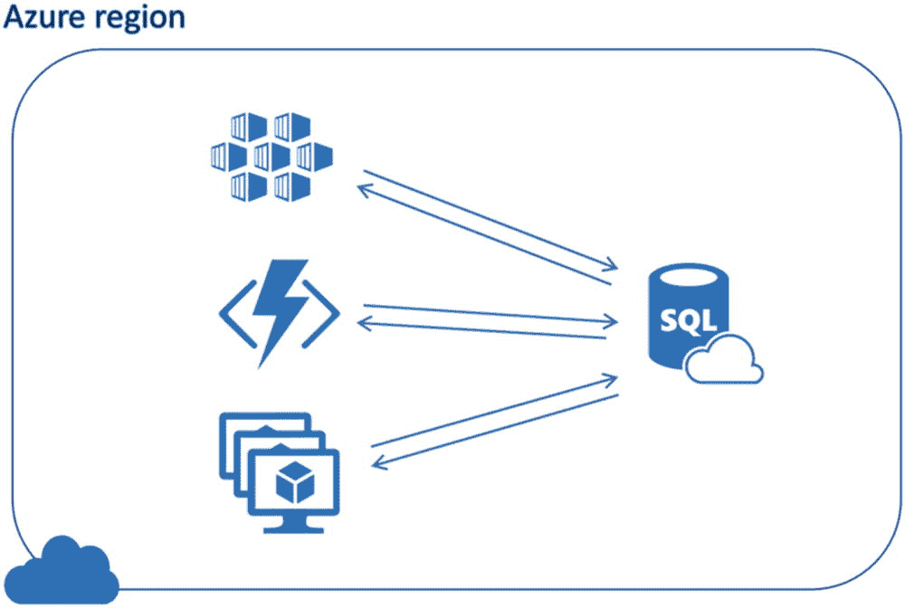
图 3-1 与数据库的往返通信

至少，你应该确保应用程序部署在数据库实例所在的同一区域。如果你在设计一个高可用的跨区域解决方案，这可能也会带来一些架构上的影响。这意味着你需要相应地规划数据层和应用层的故障转移，以在主站点发生故障时将延迟影响降至最低。

同样重要的是，要理解 Azure SQL 的整体连接架构（在官方文档中有解释：[`https://aka.ms/sdmica`](https://aka.ms/sdmica)），并确保如果你的应用层运行在 Azure 服务中（例如虚拟机、应用服务或 Azure Kubernetes 服务），它使用了 `Redirect` 连接策略。这意味着你的应用程序将直接与托管数据库实例的节点通信，而不是每次交互都通过网关层。如果你的应用程序每分钟执行的查询远不止几个，那么从性能角度来看，这个选项将产生显著的差异，而所需的权衡仅仅是确保你的客户端代码所在网络配置中开放了 11000–11990 范围内的端口。

虽然这听起来可能很基础，但另一个关于连接的建议是，确保你的代码在执行某些有意义的命令之前，尽可能晚地打开与 Azure SQL 数据库实例的连接，并在结果被消费后尽快关闭该连接。实际上，大多数驱动库都设计为利用 `连接池` 机制，该机制可以帮助你在打开一个全新的物理连接（例如，一个 TCP 套接字）的成本（这总是伴随着一定的毫秒级开销）与保持过多连接一直打开的成本（这会增加服务端消耗的资源，如内存、工作线程等）之间取得平衡。

`连接池` 在进程级别工作，即使你在应用程序代码中显式调用了关闭或处置方法，它也会在一段时间内保持物理连接处于打开状态。这样，如果稍后执行了使用相同连接字符串参数打开连接的新请求，将会重用现有的物理连接，而不是打开一个全新的连接。

得益于这种方法，在典型的 Web 应用程序或 Web API 场景中，即使有数千名用户访问某个页面，在任何给定时间只保持几十个真实的数据库连接打开的情况并不少见，这显著减少了为 Azure SQL 数据库实例产生的开销。

一般来说，在大多数多线程应用程序对 Azure SQL 实例执行常规数据库工作负载（查询、事务等）的场景中，出于性能原因，建议利用 `连接池`。此通用规则的唯一例外是你的应用程序确实需要精确控制如何针对数据库执行特定操作。一个很好的例子是数据定义语言（`DDL`）命令（`CREATE`, `ALTER`, `DROP`，这些将在后面讨论，它们作用于数据结构而非数据本身），你的应用程序可能会向数据库发出这类命令，通常一次只在一个连接上执行，并且命令在该连接上被序列化。

如前所述，大多数现有驱动都开箱即用地提供了此功能，甚至默认启用，例如 `.NET Data Provider for SQL Server`，但有一个重要的例外。在 Java 领域，历史上连接池一直是与 `JDBC` 驱动分开实现的，因此 `SQL Server` 的驱动本身不提供此功能。

值得庆幸的是，有许多外部包为你的 Java 应用程序提供了此功能，其中最知名的之一无疑是 `HikariCP` ([`https://aka.ms/hikaricp`](https://aka.ms/hikaricp))，如前所述。但需要注意的是，一般来说，Java 驱动在检测所谓的“陈旧连接”方面存在一些挑战，即由于临时问题而丢失了与数据库实例底层连接的客户端连接对象，除非尝试执行测试命令（通过显式调用 `java.sql.Connection.isValid()`，该方法会定期 ping 数据库以确保连接是打开的）。在其他驱动中，这通常通过在较低级别检查 TCP 套接字状态来执行，但 Java 原生 API 在这方面存在问题。类似的问题也可能在命令执行期间发生，此时结果集正在被你的应用程序代码消费。这里的建议是，仔细配置你的 `JDBC` 驱动和连接池类，设置适当的超时，以避免在错误时间发生临时错误时应用程序可能永远挂起。关于这些配置的所有细节，在这篇文章中有进一步解释：[`https://aka.ms/jdbc-connection-guidance`](https://aka.ms/jdbc-connection-guidance)。

其他高级语言和框架，如 Python 和 `pyodbc`，也可能遭受相同的临时连接问题，因此也推荐采用相同的方法和指导原则。


## 异常处理

打开到数据源的连接和执行命令这些操作，自然可能会发生错误。错误范围可能从服务器网络连接缺失，到违反某些维护数据完整性的规则（这些规则编码在数据库中，如主键、关系等），甚至包括应用程序中或维护操作期间的并发管理问题（例如，锁定/阻塞）（数据库引擎错误代码的完整列表可在此处查阅：[`https://aka.ms/eaerde`](https://aka.ms/eaerde)）。因此，有必要为执行数据库交互的应用程序代码，提供一种适当的拦截机制和错误状况管理方案。

大多数编程语言和框架都通过 try/catch（或 except）方法实现异常处理。在 try 块中，你通常会放置那些预计可能生成异常的指令，例如打开连接、执行命令，或者调用一个本身也可能生成应用程序异常的组件。如果这些操作中的某一个失败，应用程序控制权将传递给第一个 catch/except 块，该块指定了与已发生异常兼容的异常类型。通常，这些异常类型提供了有关失败的具体操作的所有信息；这些信息随后在 catch 块中可用，以便你能够编写适当的逻辑来处理它。

在 T-SQL 语言中（例如，在存储过程内部），除了可能由与数据库对象交互的命令（例如，违反主键约束）生成的错误之外，你还可以通过使用 `RAISERROR` 或 `THROW` 函数生成表示过程中逻辑错误的异常，从而使你的应用程序能够相应地做出行为反应。

你可以向 `RAISERROR` 函数传递错误消息、严重级别和代码，根据严重程度，客户端提供程序将相应地采取行动：

*   级别 10 或更低，连接不会中断，也不会生成异常。消息仍然可以从客户端驱动程序收集。
*   级别 11 到 19，连接保持打开状态，但会抛出异常。
*   超过 19 的级别被视为致命错误，会抛出异常，并且连接会被终止。

对于 Azure SQL，严重级别等于或小于 10 生成的错误实际上并不生成异常，而是被视为简单的信息性消息或警告消息。驱动程序库通过特定的类（例如，*.NET Provider for SQL Server* 中的 `InfoMessage`）以及适当的异常收集机制来捕获此信息。

至少，你还需要将这些关于错误状况的详细信息作为日志记录策略的一部分，供负责运行你的应用程序的运维团队进行后续分析。除此之外，你必须决定是仅重试操作（如重试逻辑部分所述）还是将信息返回给调用者，哪种选择更为正确，以便能够针对每个特定用例做出关于最佳行动方案的适当决策。

## 框架、ORM 和 MicroORM

到目前为止，我们提到客户端驱动程序通常提供基础的抽象层来连接、查询和使用 Azure SQL 数据库实例的结果。话虽如此，在大多数情况下，应用程序开发人员通常寻求更高级别的抽象，以帮助他们提高工作效率，并消除重复且可能容易出错的数据访问任务，例如在他们的应用程序逻辑中表示数据实体并与之交互。

为了实现更高的生产力，在过去大约 20 年里创建了许多数据访问框架，它们可以分为两大类：

*   辅助类：仅封装这些基础抽象并简化常见任务
*   对象关系映射器（ORM）：提供丰富的数据建模和映射能力，以减少关系结构与面向对象编程之间的阻抗不匹配

下表按编程语言列出了一些市场上最流行（非详尽）的库：

| **语言** | **推荐/流行的库** |
| --- | --- |
| .NET | • 数据集• Entity Framework (Core)• Dapper |
| Java | • Spring Data• Hibernate |
| PHP | • Doctrine• Eloquent |
| Node.js | • RxDB• TypeORM• Sequelize |
| Python | • SQLAlchemy• Django• pandas |
| Ruby | • ActiveRecord |
| Go | • Gorm |

在接下来的章节中，我们将更深入地探讨其中一些。

### 数据访问框架

虽然基础抽象通常会控制数据库交互的每个可能方面，但它们可能需要在你的应用程序中编写大量样板代码，以将逻辑中表示更高级别实体的对象和结构转换为数据库结构中的行和列。

多年来，创建了许多库和框架来简化这个问题，同时仍然让你控制代码如何与数据交互。举一个实际例子，在 .NET 领域，`ADO.NET Provider for SQL Server` 从第一个版本开始就提供了除了 `SqlConnection`、`SqlCommand` 和 `SqlDataReader` 类（通常被称为 SqlClient 库的“连接”部分）之外的其他许多类。这些类用于以更“面向对象”的方式解释和导航查询结果，同时也负责将原始数据所做的任何更改持久化回底层数据库。我指的是像 `SqlDataAdapter` 和 `DataSet`（类型化或非类型化）这样的类。`DataSet` 是从代码中从头填充或从对数据库的一次或多次查询返回的结果集的内存中表示，它提供了围绕离线更改跟踪、数据验证以及实体间关系管理的额外逻辑。`SqlDataAdapter` 充当 `DataSet` 和数据库对象之间的“连接器”，既可以自动生成获取对内存数据的更改并将其持久化到后端数据库的 T-SQL 命令，也可以利用现有的命令和存储过程来出于性能或并发原因控制这些数据库操作的所有方面。数据集也可以从数据库架构自动生成，并成为完全类型化的对象，将内部结果集作为命名集合（例如，Customers、Orders 等）而不是行和列来公开。要了解更多关于这些选项的信息，你可以在此链接找到完整的介绍：[`https://aka.ms/dnfado`](https://aka.ms/dnfado)。

类似的辅助类在其他编程框架中也非常流行。例如 Java 的 `Spring Data Access` ([`https://aka.ms/sfrda`](https://aka.ms/sfrda)) 或 Python 的 `SQLAlchemy Core` 类。

```python
def getorders():
    # 使用 SQL Server 方言创建 SQLAlchemy 引擎
    engine = create_engine("mssql+pyodbc:///?odbc_connect=%s" % connectionString)
    # 初始化元数据存储库
    metadata = MetaData()
    # 为结果集定义元数据
    orders = Table('Orders', metadata,
        Column('orderid', Integer, primary_key=True),
        Column('customerid', Integer),
        Column('orderdate', Date),
        schema='Sales'
    )
    customers = Table('Customers', metadata,
        Column('customerid',Integer,primary_key=True),
        Column('customername',String),
        schema='Sales'
    )
    # 使用类 SQL 语法定义我们的查询
    s = select([orders.c.orderid,orders.c.orderdate,customers.c.customername]).\
        select_from(orders.join(customers, orders.c.customerid==customers.c.customerid)).\
        limit(10)
    try:
        # 打开到数据库的连接
        cnn = engine.connect()
        # 执行 SQLAlchemy 命令
        res = cnn.execute(s)
        # 遍历结果
        for row in res:
            print(row)
        # 关闭连接
        cnn.close()
    except Exception as e:
        print (e)
        pass
```

*列表 3-8*
在 Python 应用程序中使用 SQLAlchemy


在这个简单的例子中，你可以看到 SQLAlchemy 如何让我们定义应用程序实体的内存表示，以及它们如何映射到数据库表。通过使用应用层的类 SQL 语法，我们可以指定包含高级操作（如连接、过滤、聚合、投影等）的查询，SQLAlchemy 类会将此转换为 Azure SQL 特定的 SQL 语法，但你也可以轻松地将相同的代码移植到其他受支持的数据库系统。虽然 SQLAlchemy 能做的远不止这些（我们这里只是浅尝辄止），但它最强大的功能已经超越了数据访问框架的范畴，属于**对象关系映射器（Object-Relational Mappers）**的领域，这也是下一节的主题。

## ORM

ORM 的目的是在关系型世界和面向对象世界之间进行协调，让开发者能够使用代表应用程序领域的强类型对象来编写与关系型数据库中存储的数据交互的应用程序，从而减少他们通常需要编写的冗余（或“管道”）数据访问代码。下表概述了可用于连接 Azure SQL 的各种 ORM 库：

| **语言** | **平台** | **ORM** |
| --- | --- | --- |
| C# | Windows, Linux, macOS | Entity Framework |
|  |  | Entity Framework Core |
| Java | Windows, Linux, macOS | Hibernate ORM |
| PHP | Windows, Linux, macOS | Laravel (Eloquent) |
|  |  | Doctrine |
| Node.js | Windows, Linux, macOS | Sequelize ORM |
| Python | Windows, Linux, macOS | Django |
| Ruby | Windows, Linux, macOS | Ruby on Rails |

该领域最早且最成功的库之一是 Java 的 Hibernate ([`https://aka.ms/horm`](https://aka.ms/horm))，出现于 21 世纪初，其目标是提供比 Enterprise Java Beans 实体更好的体验，以便在不必要使用 SQL 命令的情况下将数据持久化到数据库中。多年来，这些库变得越来越强大和复杂（对某些人来说甚至过于复杂，以至于创建了像“微 ORM”库这样的替代品）以涵盖数据访问层的其他方面，如建模、安全性和可扩展性。

微软自家用于 .NET 世界的 ORM 是 Entity Framework (EF)，其较新的版本是 EF Core ([`https://aka.ms/ghdnefc`](https://aka.ms/ghdnefc))。EF Core 可与多种后端数据库存储一起工作，如 SQL Server、Azure SQL Database、SQLite、Azure Cosmos DB、MySQL、PostgreSQL 以及其他通过提供程序插件 API 连接的数据库。它是该领域 10 多年开发的成果，并提供了诸如 LINQ 查询、离线变更跟踪、批处理更新以及通过名为“迁移（migrations）”的功能进行数据库架构管理等特性。

该库的核心是 `DbContext` 类，开发者可以用它来创建其数据库交互上下文，并建模数据库表将如何映射到实体和集合，以及对这些实体的操作将如何透明地转换为 SQL 代码，以在数据库中读取、创建或更新记录。

```
using(var dbctx = new WWImportersContext())
{
var res = dbctx.Orders
.Include("Customer")
.Select (o => new
{o.OrderID,o.OrderDate,o.Customer.CustomerName})
.ToList().Take(10);
foreach(var o in res)
{
Console.WriteLine("OrderId: {0} - OrderDate: {1} - CustomerName: {2}",o.OrderID,o.OrderDate,o.CustomerName);
}
}
class Order
{
public int OrderID {get;set;}
public DateTime OrderDate {get;set;}
public int CustomerID {get;set;}
public Customer Customer {get;set;}
}
class Customer
{
public int CustomerID {get;set;}
public String CustomerName {get;set;}
}
class WWImportersContext : DbContext
{
// 模型构建在此片段中故意省略
public DbSet Orders {get;set;}
public DbSet Customers {get;set;}
}
列表 3-9
在 C# 应用程序片段中使用 Entity Framework Core
```

让我们关注这个简单例子的三个关键方面：

*   首先，两个 **POCO**（Plain Old CLR Objects）类 `Order` 和 `Customer`，它们代表了我们的应用程序管理的业务实体。
*   `WWImportersContext` 类，继承自 `DbContext`，它代表了我们的应用程序用于连接和查询数据库的上下文。具体来说，它确实包含两个映射到数据库表的 `DbSet` 集合。
*   与数据库上下文交互并表达我们想要检索哪些实体的 **LINQ** 查询。

正如你在完整示例中（请参阅 GitHub 仓库）所注意到的，有趣的是看到我们的 `WWImportersContext` 类如何重写其基类的 `OnConfiguring` 和 `OnModelCreating` 方法来准确实现其名称所暗示的功能：配置我们的上下文与数据库通信的方式，以及定义一个模型，其中我们的实体映射到相应的数据库表。我们还配置了日志记录基础设施，以展示由上下文自动生成的 T-SQL 代码的样子。非常直观，不是吗？

Entity Framework Core 还能做更多的事情，你可以通过这个免费的 Microsoft Learn 在线课程 ([`https://aka.ms/lmpsefc`](https://aka.ms/lmpsefc)) 开始熟悉所有这些功能。

“**能力越大，责任越大**”，因此有一些基本的良好实践你应该始终牢记，以从像 EF Core 这样的 ORM 工具中获得最大收益：

*   首先，确保你只从数据库中提取你真正需要的数据，并让你的结果集尽可能高效。
*   如果你的应用程序只需要根据查询结果具体化对象并将其显示在屏幕上，但永远不会修改和更新它们，请关闭变更跟踪。这将避免浪费大量应用程序资源来跟踪你永远不会使用的对象状态信息。
*   相反，如果你的应用程序将在其数据库上下文中创建或更新许多实体，请确保你利用批处理（例如，在你的 `DbSet` 集合上调用 `AddRange()` 方法）。EF Core 将在后台创建一个表值参数（Table-Valued Parameter, TVP），并将其用于 MERGE 语句中，以在一次数据库往返中插入多行。这为 Azure SQL 提供了许多好处，包括降低延迟和最小化事务日志压力。对于非常大的批量操作（大于 10,000 行），你可能希望在 Entity Framework 之外执行它们（例如，使用 ADO.NET 的 `SqlBulkCopy` 类）或使用一个名为 EFCore.BulkExtensions ([`https://aka.ms/efcbe`](https://aka.ms/efcbe)) 的很好的 EF Core 扩展。
*   在可能的情况下，启用日志记录并验证 EF Core 生成的 T-SQL 语法。
*   在复杂的数据库交互情况下，通过 EF Core 使用原始 SQL 命令或存储过程可以解决性能和灵活性问题。


### 微 ORM

对于那些不需要完整 ORM 库复杂性的场景，近年来出现了一类简化的工具，通常被称为微 ORM。其中最成功的可能是 StackExchange 的 Dapper（[`https://aka.ms/ghsaed`](https://aka.ms/ghsaed)）。基本上，Dapper 提供了一种基于 SQL 查询快速高效地物化对象的方法，对于不需要跟踪断开连接的更改或将对象完整持久化到数据库的应用场景来说，这是一个很好的解决方案。Dapper 扩展现有的`IDbConnection`接口（在各种 ADO.NET 数据提供程序中可用），并提供辅助方法来执行 T-SQL 查询并将结果映射到 POCO 对象集合，或以高性能的方式执行修改数据库状态的命令。以下示例展示了如何使用 Dapper 检索结果集。

```
class Program
{
    static void Main(string[] args)
    {
        using (SqlConnection cnn = 
            new SqlConnection(
                "Server=tcp:.database.windows.net,"+
                "1433;Initial Catalog=WideWorldImporters-Full;"+
                "User ID=;Password=;"))
        {
            var orders = cnn.Query("SELECT TOP 10 OrderID, OrderDate, CustomerID FROM Sales.Orders;");
            foreach (var o in orders)
            {
                Console.WriteLine("OrderId: {0} - OrderDate: {1} - CustomerId: {2}",o.OrderID,o.OrderDate,o.CustomerID);
            }
        }
    }
}
class Order
{
    public int OrderID {get;set;}
    public DateTime OrderDate {get;set;}
    public int CustomerID {get;set;}
}
```

清单 3-10
在 C#应用程序中使用 Dapper

此示例展示了像 Dapper 这样的微 ORM 如何在底层的`SqlConnection`、`SqlCommand`和`SqlDataReader`类与更复杂但功能更强大的解决方案（如 Hibernate 或 Entity Framework）之间取得良好平衡。

## 使用只读副本

Azure SQL 高级层、业务关键层和超大规模层数据库实例的一个好处是，作为其高可用性架构的一部分，会部署多个辅助副本，并通过底层基础设施以最小延迟与主副本保持同步。默认情况下在高级层和业务关键层启用的*Read Scale-Out*功能，使您能够针对其中一个辅助副本运行只读工作负载，而不会影响主读写副本的性能，且无需额外成本。

从数据访问的角度来看，这非常易于使用，因为它只需要在连接字符串中添加`ApplicationIntent=ReadOnly;`属性，该连接的所有流量将自动重定向到数据库的只读副本。超大规模性能层也提供了此功能，但您必须显式为数据库创建至少一个辅助副本才能利用它。

您的应用程序可以通过检查命令`SELECT DATABASEPROPERTYEX(DB_NAME(), 'Updateability')`是否确实返回`READ_ONLY`结果来确保它连接到只读副本。值得记住的是，虽然只读副本处于事务一致的状态，但在极少数情况下，与主副本中的数据相比可能会有一些小的延迟。此外，在撰写本文时，某些功能如查询存储、扩展事件和审核在只读副本上尚不支持，尽管可以使用传统的 DMV 进行监控，如`sys.dm_db_resource_stats`、`sys.dm_exec_query_stats`、`sys.dm_exec_query_plan`和`sys.dm_exec_sql_text`，这些方法可以按预期工作。有关此有趣功能的更多详细信息，请参阅官方文档：[`https://aka.ms/sqrso`](https://aka.ms/sqrso)。

## 延伸阅读

本章为您全面介绍了如何使用传统驱动程序和更先进的数据访问框架，从各种传统和现代编程语言连接到 Azure SQL 数据库实例。它提供了一些最佳实践，关于如何有效地提高连接可靠性，并使您的应用程序在基于云的环境中设计和实现分布式系统时，能够更好地应对可能发生的瞬态连接问题。要深入了解其中一些主题，我们建议查看以下链接：

*   快速入门：Azure SQL 数据库连接和查询 – [`https://docs.microsoft.com/en-us/azure/sql-database/sql-database-connect-query`](https://docs.microsoft.com/en-us/azure/sql-database/sql-database-connect-query)
*   Azure SQL 瞬态错误 – [`https://docs.microsoft.com/en-us/azure/sql-database/sql-database-connectivity-issues`](https://docs.microsoft.com/en-us/azure/sql-database/sql-database-connectivity-issues)
*   Dapper.NET – [`https://medium.com/dapper-net`](https://medium.com/dapper-net)
*   如何使用批处理提高 SQL 数据库应用程序性能 – [`https://docs.microsoft.com/en-us/azure/sql-database/sql-database-use-batching-to-improve-performance`](https://docs.microsoft.com/en-us/azure/sql-database/sql-database-use-batching-to-improve-performance)


# 4. 使用 Azure SQL 进行开发 – 基础篇

现在，你已经了解了如何创建 Azure SQL 数据库、如何连接到它以及如何还原示例数据库，是时候开始了解 Azure SQL 为现代开发者提供了哪些功能。

在本章中，我们将探讨所有能帮助你创建现代应用程序的主要特性，并以示例数据库 `WideWorldImporters` 作为我们的实践平台。

一如既往，本书将采取非常实用的方法。我们假设你对表有一个基本概念：表是一个由列组成的实体，每一列都有其名称和数据类型，其中包含数据行。列定义了数据的形态，即 `schema`（模式）。为了存储在表中，数据必须遵守其模式，这意味着必须遵循列数据类型和约束；否则，数据库将拒绝该数据。这种方法最近被定义为 `schema-on-write`（写入时模式）：在数据写入数据库时检查其与模式的一致性。这确保了数据与使用它的应用程序所预期的保持一致。一些其他数据库提供了 `schema-on-read`（读取时模式）方法，即所有数据都可以存储，模式仅在有人尝试读取数据时进行检查。这两种方法各有优缺点；由于数据只有在一致且有意义时才有用，因此无论你选择哪种方法，都必须确保所提供的数据在逻辑上是正确和合理的。通过 `schema-on-write` 方法，Azure SQL 会与你协作以确保这一点发生，因为它会为你检查数据是否始终与定义的模式一致。如果不一致，它将返回错误。这种行为可能看起来有些死板，有时也确实如此，因此 Azure SQL 在某种程度上也支持 `schema-on-write`，即原生支持存储和操作 `JSON` 文档。请记住，在 `schema-on-read` 模式下，你需要在应用程序内部编写代码，在使用数据之前对其进行验证。在大多数常见情况下，这是一项相当繁重的任务，最好由像 Azure SQL 这样的专门实体来处理，这可以大大减轻你作为开发者的工作量，并有助于更好地实现关注点分离。数据一致性和完整性主要是数据库的问题，它可以为访问其数据的所有解决方案以集中方式处理。

关于表的更深入讨论将在第 6 章中进行，但考虑到开发者通常从处理现有数据库开始工作，我们认为最好先了解我们可以对已有数据做些什么。

我们能做的事情有很多！因此，本章旨在为你提供所有你需要了解的功能的全面概述，以确保你真正利用了 Azure SQL 的全部潜力。

由于 Azure SQL 中为开发者集成了如此多的功能，在本章中你将只看到冰山一角。请务必使用本书附带的代码示例来了解功能的更多细节并查看它们的实际操作。利用参考资源深入了解所有功能及其选项。

请记住，本书就像一个跳板，旨在推动你更好地潜入数据的海洋！

## 将计算推送到数据端

我强烈建议将尽可能多的计算需求推送到数据端，而不是将数据拉取到你这里。移动数据是一项繁重、复杂且消耗资源的任务。移动计算逻辑则容易得多，因为它更加紧凑和轻量级。此外，通过使用我们稍后将讨论的 `视图`、`函数` 或 `存储过程`，你甚至不需要移动源代码或编译后的二进制文件。

但将计算推送到数据端的主要好处是，你可以真正利用你为使用像 Azure SQL 这样的数据库所支付的所有费用。如果你必须在自己的代码中实现所有的查询、筛选和优化逻辑，那为什么还要使用数据库呢？直接使用便宜得多的文件存储，你就能省下很多钱。

嗯，这可能是表面印象，但实际上，如果你不使用 Azure SQL，你仍然需要花费时间来实际实现那些你放弃的功能。所以，它实际上并不会那么便宜。

事实证明，如果你还考虑到你可能需要维护和演进这些功能，它实际上会更昂贵。而且可能只有你一个人或少数几个人在做这些事，而对于 Azure SQL，有数百名工程师每天都在为此工作，只有一个目标：尽可能地提高其性能和能力。通过将计算推送到数据端，你可以获得所有这些幕后工作的工程师带来的好处。这可以影响你和你应用程序的性能：让我给你一个非常实际的例子。

如果你需要在一个包含 `5000 万` 行数据的表中找出不同的值，就在不那么久以前，你可能需要等待大约 `5 秒钟`。还不错，对吧？然而，如果你正在创建一个为移动应用程序提供服务的 API，`5 秒钟` 在当今世界是非常漫长的。在过去的几年里，驱动 Azure SQL 的引擎通过添加列存储表和向量（或批处理）执行得到了改进，这些执行利用了 `SIMD` CPU 指令集以及一些高级优化技术，如 `分组聚合下推`。通过所有这些改进，同样的查询现在只需要 `个位数毫秒` —— 从原来的 `5000 毫秒` 降至 `个位数毫秒`。

你能想象如果你没有将计算推送到数据库端，而是将数据移动到应用程序端以达到同样的改进，你需要付出多少努力和成本吗？相反，你可以将所有这些资源用于你的用例或业务问题所特有的、数据库无法为你解决的事情上。

将计算推送到数据端：这确实是构建可扩展、现代化、高性能解决方案的最佳方法。


# 声明式与命令式

Azure SQL 允许你使用一种与你日常习惯不同的方法来创建操作数据的解决方案。如果你使用的是 `C#`、`Java`、`Python` 或 `NodeJS`，那么你很可能习惯于遵循*命令式*范式。在命令式范式下，你会告诉系统具体如何去执行一个过程，更准确地说，是一个算法。例如，如果你有一个数字列表，并想统计其中有多少个不同的值，你可能会用循环来实现解决方案，遍历这些值，将当前值与已见过的值列表进行比较，只有当当前值不在该列表中时才将其加入。

相反，如果你使用*声明式*方法，你只需告诉系统你想要什么，而不是如何去做。本质上，你是以已有的数据结构为起点，描述你想要达到的结果。从概念上讲，这与设置导航系统带你从点“A”到点“B”并无太大不同。

因此，使用前面提到的相同例子，在 Azure SQL（以及任何关系型数据库）中，你可能会写出类似这样的语句：

```sql
SELECT DISTINCT Number FROM Values;
```

我们将在接下来的章节中详细讨论这行代码的细节，但你已经可以凭直觉理解它在做什么。

`Python` 和 `C#` 提供了一些声明式支持。`C#` 支持语言集成查询（`LINQ`），而 `Python` 使用列表推导式，因此你可能有一些相关经验，这将极大地帮助你使用 Azure SQL。另一方面，如果你还没有这方面的经验，通过阅读本书，你将会熟悉声明式范式的 power and beauty。

关系型数据库，尤其是 Azure SQL，将声明式方法的理念提升到了一个新的高度。Azure SQL 不仅会为你处理实现细节，让你可以专注于“做什么”而不是“如何实现”，而且它在处理时还会考虑大量令人印象深刻的额外因素。例如，表中有多少数据，操作这些数据需要多少内存，现有的索引是否有帮助，甚至数据在表中的分布情况。

想一想，现代导航系统的工作方式完全相同：它不仅允许你指定起点和目的地，还会考虑实时交通、道路封闭和其他条件，以便在给定的有限时间内尝试为你提供*最佳*解决方案，而不仅仅是*一个*解决方案。

在现代开发中，这对于确保你的应用程序始终保持响应至关重要，即使它使用的数据在值和大小上不断变化：适应变化不仅是开发者的关键因素，对于应用程序同样如此。

# 查询与数据操作

正如人们可能猜测的那样，你将用来与 Azure SQL 数据库中的数据交互的语言是 *SQL*（*结构化查询语言*）。SQL 是一个被许多关系型和非关系型数据库采纳的标准。学好它不仅对使用 Azure SQL 有用，对利用 Apache Spark 等许多其他知名数据平台也同样有益。每个数据库通常都在一定程度上实现了 `ANSI/ISO SQL` 标准，并有一些变体以利用平台特有的功能。因此，实现的 SQL 被称为一种*方言*。对于 Azure SQL，其方言与 `SQL Server` 使用的相同：简称为 *Transact-SQL* 或 *T-SQL*。

要操作数据，你只需要掌握少数几个命令，通常被称为 *DML* – *数据操作语言* – 它们涵盖了所有所需的功能：

*   `SELECT`
*   `INSERT`
*   `UPDATE`
*   `DELETE`
*   `MERGE`

如果你熟悉应用程序开发中常见的 *CRUD – 创建、读取、更新、删除* 功能集，你会发现只有前四个 SQL 命令真正用于实现 CRUD 操作；添加了第五个 `MERGE` 命令，以便在一个命令中同时完成插入、更新和删除操作，通过将大量细节留给查询引擎来简化代码，使其更易理解，并且在许多情况下也更高效。

## 检索数据

`SELECT` 命令允许你从数据库中获取一组数据。它需要你想要获取的列的列表、表名，以及可选但几乎总是使用的过滤器，用于将返回的行限制在你感兴趣的范围内，例如：

```sql
SELECT
    InvoiceID,
    InvoiceDate,
    DeliveryInstructions,
    ConfirmedDeliveryTime
FROM
    Sales.Invoices
WHERE
    CustomerID = 998
ORDER BY
    ConfirmedDeliveryTime;
```

这个查询将查看 `Sales.Invoices` 表，返回 `CustomerID` 列中值为 `998` 的所有行，并将结果限制为仅包含 `InvoiceID`、`InvoiceDate`、`DeliveryInstructions` 和 `ConfirmedDeliveryTime` 列。

即使这样一个简单的 `SELECT` 语句也很有趣。首先，值得注意的是，数据没有固有的或自然的顺序。如果不指定 `ORDER BY`，数据将以无特定顺序的方式返回。

出于性能原因，数据很可能以 Azure SQL 访问它的顺序返回，而这种顺序可能会随时间变化；如果你依赖数据按特定顺序排列，你必须指定 `ORDER BY` 子句。其次，除非通过一个名为 `COLLATION` 的选项另行指定，否则数据库对象不区分大小写。这也适用于表中的数据。当然可以更改这一点，但可能会对性能产生影响：更多相关讨论将在后续章节中进行。

现在让我们看一个更复杂的例子。假设我们的客户 `998` 正在浏览她的订单历史，以寻找她在 `2016` 年第一季度收到的一个特定商品。通过在虚构的移动应用上使用一系列过滤器，这可能是我们需要执行的 `T-SQL` 语句：

```sql
SELECT
    il.InvoiceLineID AS LineID,
    i.InvoiceID,
    il.[Description],
    il.Quantity,
    il.UnitPrice,
    il.UnitPrice * il.Quantity AS TotalPrice,
    i.ConfirmedDeliveryTime
FROM
    Sales.Invoices AS i
INNER JOIN
    Sales.InvoiceLines AS il ON i.InvoiceID = il.InvoiceID
WHERE
    i.CustomerID = 998
    AND
    il.[Description] LIKE N'%red shirt%'
    AND
    CAST(i.ConfirmedDeliveryTime AS DATE) BETWEEN '2016-01-01' AND '2016-03-31';
```

在 `WideWorldImporters` 数据库中执行后，结果将如图 4-1 所示。

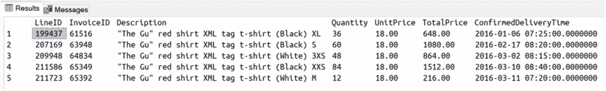

图 4-1 示例 SELECT 结果

在刚才使用的示例查询中，尽管简单，但有几个值得注意的地方在日常使用中非常常见。

> **注意**
> 你可以使用星号 `*` 来自动包含表中的所有列，而不是指定你想要作为结果的列。虽然这对于仅查看数据或进行一些数据探索时执行查询可能有用，但在创建将被应用程序使用的内容时，这不是最佳实践。列的顺序随时可能改变，如果有人更改了表定义，列也可能被添加或删除。始终指定你想要返回的列，这样你才能得到确定的结果。如果你不需要所有列，你还能避免浪费网络带宽并提高传输速度。


# SQL 查询基础概念与语法

## 表名称与 Schema

对象，如表，拥有自己的名称，例如`Invoices`表。由于同一个名称可能在不同的上下文中被使用，最佳实践是始终使用其所属的**schema**来限定对象名称。Schema 是一种组织属于同一组对象的方式，例如`Sales`。所有与销售相关的对象都会被放置在同一个 schema 中。除了消除歧义，Schema 还有助于简化管理，特别是在安全方面，因为权限可以授予 schema，这将影响属于同一 schema 的所有对象。

## 别名

你可以使用`AS`关键字为表名称创建别名，这样如果某个列出现在多个表中，你就可以使用别名作为列名的前缀，并明确指定从哪个表中获取该列。某些列名会频繁重复（例如`Name`、`ID`、`Description`等），因此需要一种消除歧义的方法。别名允许你做到这一点，同时也无需使用完整的表名作为列前缀。代码更少，效果更佳。

除了表，列也可以被**别名化**。你可能希望在返回结果时更改列名，例如`InvoiceLineID`列被返回为`LineID`。正如你可能注意到的，该列无论如何都已被其所在表的别名所限定。虽然这里并非必需（因为查询使用的表中没有其他同名列），但使用前缀也有助于快速理解列的来源。这是一种让代码更易理解、更人性化的良好实践。

当列本身没有名称时，则**必须**为其创建别名。例如，当结果列是通过表达式创建时，就像`TotalPrice`列那样。在示例中，表达式非常简单，但请记住，它们可以复杂得多，并对列值应用复杂的数据转换。

## 引号标识符

对象几乎可以使用任何你喜欢的名称（当然，有一些命名规则：[`https://aka.ms/rdddi`](https://aka.ms/rdddi)），但如果你使用的名称可能与关键字冲突，只需使用方括号来确保查询引擎能理解你指的是列或表，而不是其他东西，比如系统函数。

## 连接

示例还展示了如何从不同的表中返回值。使用`INNER JOIN`语句，我们表示：对于表`Sales.Invoices`、列`InvoiceID`中存在的每个值，我们希望获取在表`Sales.InvoiceLines`的相同列中具有相同值的所有行。发票数据被保存在两个不同的表中，以避免数据重复并更易于访问每个发票行。但由于`CustomerID`仅在`Sales.Invoices`表中可用，因此需要连接操作来返回所需数据。

选择将所有内容保存在较少的表中以应对数据重复的挑战，还是将数据分解到不同的表中以避免重复，然后在需要时将数据组合起来，这是一个非常重要的理解主题，属于数据库建模的定义范畴，更具体地说，是一个称为**规范化**的过程。有整本书专门讨论这个话题，以及规范化和**反**规范化的优缺点，因此你将在本章末尾找到更多参考资料。请记住，规范化过程旨在组织数据以最小化冗余。数据库中存在重复信息会带来许多不那么明显的影响和很多挑战，因此即使你使用非关系型数据库，也绝对需要理解这一点：所有的规范化概念无论如何都将适用。事实上，规范化也是一个可以在 NoSQL 手册中找到的概念。

有不同类型的连接允许你精确定义结果中必须返回哪些行。例如，假设你希望获得所有客户及其相关发票的列表，正如你可以猜到的，你有两个独立的表来保存这两组不同的数据：客户和发票。可能会发生这样的情况：你有一个新客户尚未收到任何发票。使用*内连接*，这样的客户将不会包含在我们假设的查询结果中。如果你想要*所有*客户，无论他们是否有发票，你需要使用*左连接*。如果你想要返回所有发票，即使是那些不属于任何客户的发票，你将需要使用*右连接*。术语“左”和“右”指的是表相对于`JOIN`子句的位置（图 4-2）。

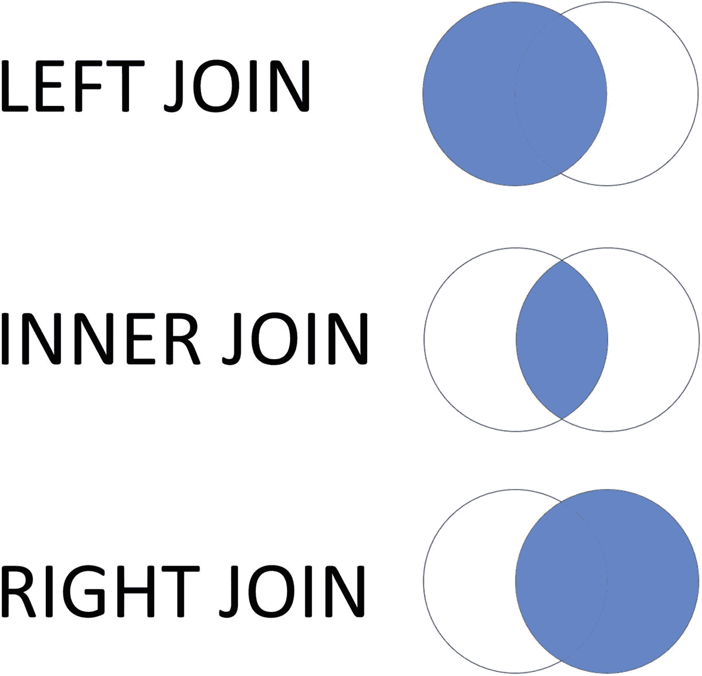

图 4-2 连接类型

**全连接**是这三种类型的总和。你将获得参与连接的两个表中的所有行。

连接可以与其他连接一起使用，以便表示复杂的关系。如果我们希望扩展原始代码示例以同时返回客户数据，我们需要更改它，以便将客户、发票和发票行连接在一起：

```sql
SELECT
    c.CustomerName,
    il.InvoiceLineID AS LineID,
    i.InvoiceID,
    il.[Description],
    il.Quantity,
    il.UnitPrice,
    il.UnitPrice * il.Quantity AS TotalPrice,
    i.ConfirmedDeliveryTime
FROM
    Sales.Customers AS c
INNER JOIN
    Sales.Invoices AS i ON i.CustomerID = c.CustomerID
INNER JOIN
    Sales.InvoiceLines AS il ON i.InvoiceID = il.InvoiceID
WHERE
    i.CustomerID = 998
    AND
    il.[Description] LIKE N'%red shirt%'
    AND
    CAST(i.ConfirmedDeliveryTime AS DATE) BETWEEN '2016-01-01' AND '2016-03-31';
```

结果如下：

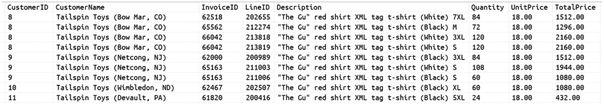

如你所见，`CustomerName`和`CustomerID`对于`Sales.Invoices`中与该客户相关的每一行都重复出现，而`Sales.Invoices`又对于与该发票相关的每个`Sales.InvoiceLine`重复出现。

这使你能够为应用程序的每一行提供所需的全部信息，而无需在数据库中存储重复的数据。虽然一开始这可能看起来很复杂，甚至可能适得其反，因为你本可以将所有数据保存在每行一个 JSON 文档中，这样甚至不需要在需要时将数据片段组合起来，但这实际上极大地帮助**简化**了事情。

**通过将复杂数据分解成更小的部分，你可以让每个部分与其他数据集一起使用和重用。这与代码重用的概念相同，只是应用于数据。**

如前所述，将数据分解成更小片段而不丢失信息的过程称为**规范化**，它并非关系型数据库所特有。相反，它在许多不同的领域和技术中都有帮助，因为它只不过是一个帮助避免信息重复的过程，而信息重复通常带来的挑战多于其解决的问题。毫不奇怪，它在 NoSQL 文档甚至对象建模文档中都有提及。学习它将在从开发到数据科学的各种情况下有所帮助：你将在本章末尾找到深入探讨这些概念的若干资源。


#### 筛选

通常，你可能只想从数据库中获取少数几行，甚至只是一行。要筛选掉不需要的行，就必须使用 `WHERE` 子句。正如你在示例查询中所见，`WHERE` 子句可以包含一个或多个筛选 `谓词`，这些谓词允许你指定对查询可用的任何列，你感兴趣的具体值是什么。`FROM` 子句或 `JOIN` 中指定的任何表的列都可以使用。

在 `WHERE` 子句中使用的值可以是字面量、变量、来自其他查询的数据集，或者函数调用的结果。这使你能够精确定位你想要处理的数据。

#### 子查询

子查询是嵌套在另一个查询中的查询。就像在 Linux Shell 或 Windows PowerShell 中，你可以将一个命令的输出通过管道传递给另一个命令，从而轻松构建复杂的转换一样，Azure SQL 也允许你做概念上类似的事情：

```
SELECT
    OrderId,
    OrderDate,
    (SELECT COUNT(*) FROM Sales.[OrderLines] AS ol
        WHERE
            ol.[OrderID] = o.OrderId) AS OrderSize
FROM
    (SELECT * FROM Sales.[Orders] WHERE SalespersonPersonID = 2) AS o
WHERE
    o.[CustomerID] IN
    (
        SELECT
            c.CustomerID
        FROM
            Sales.[Customers] AS c
        WHERE
            [CustomerName] = 'Daniel Martensson'
    )
    AND
    OrderDate >= '2015-01-01'
ORDER BY
    [o].[OrderID];
```

在上面的示例中，有三个子查询。第一个用于 `FROM` 子句，用于将订单限制为仅由特定销售人员生成的订单。然后 `WHERE` 子句中还有另一个子查询，将订单限制为仅由特定客户完成的订单。最后，第三个子查询位于 `SELECT` 列表中，用于通过计算每个订单中的行数来丰富结果。

如果你已经有一些 SQL 语言经验，你可能会意识到，这个示例查询也可以使用一些连接（JOIN）来编写，而不是在 `FROM` 和 `WHERE` 子句中使用子查询。Azure SQL 查询优化器足够智能，也能意识到这一点，通常，无论查询以哪种方式编写，性能上都没有差异。

#### 公用表表达式

公用表表达式，或简称 CTE，是子查询的一种改进替代方案。正如你可能猜到的，如果你有一个非常复杂的 SQL 语句，包含许多子查询，它会变得非常难以阅读。

另外，如果同一个子查询需要在同一个查询中使用两次，会发生什么？你最终会复制代码。但是，作为追求卓越的开发者，如果可能的话，我们不希望有任何代码重复。

CTE 正是我们组织代码所需要的，以便更容易理解，最重要的是，更容易修改和维护。CTE 是一个临时的查询定义，它的生命周期仅限于使用它的 `SELECT`、`INSERT`、`UPDATE` 或 `MERGE` 语句的执行期间。

以下是子查询段落中展示的相同代码，重写后使用 CTE 代替了子查询（在合理的地方）：

```
WITH cteOrders AS
(
    SELECT * FROM Sales.[Orders] WHERE SalespersonPersonID = 2
),
cteCustomers AS
(
    SELECT
        c.CustomerID
    FROM
        Sales.[Customers] AS c
    WHERE
        [CustomerName] = 'Daniel Martensson'
)
SELECT
    OrderId,
    OrderDate,
    (SELECT COUNT(*) FROM Sales.[OrderLines] AS ol WHERE ol.[OrderID] = o.OrderId) AS OrderSize
FROM
    cteOrders AS o
INNER JOIN
    cteCustomers c ON [c].[CustomerID] = [o].[CustomerID]
    AND
    OrderDate >= '2015-01-01'
ORDER BY
    [o].[OrderID];
```

如你所见，在 `WITH` 语句之后，定义了两个 CTE，一个名为 `cteOrders`，另一个名为 `cteCustomers`。在查询中每次引用这些名称时，就如同在那里放置了一个子查询。不同之处在于，代码变得更容易理解。我个人喜欢将 CTE 视为一种清晰地定义在主查询中需要处理哪些数据集的好方法：我可以在顶部定义这些集合，这样也更容易理解它们如何操作数据，然后我可以在任何需要的地方、根据需要多次引用它们，而无需重复输入相同的代码。

**记住**
CTE 的生命周期仅限于定义它的查询的执行期间。如果你需要在其他查询中重用封装在 CTE 中的查询，你可能需要创建一个 `VIEW`（视图）或 `FUNCTION`（函数）。更多内容将在后续章节中介绍。

CTE 也可以引用 CTE，因此你可以在保持代码非常清晰易读的同时创建非常复杂的查询。此外，CTE 甚至可以引用自身，从而可以创建递归查询。当你需要处理具有层次结构的数据（例如树形结构）并希望遍历整棵树，但你不知道树有多深，因此需要一个“智能”算法，该算法仅在不再有数据可处理时才停止，而不仅仅是在经过一定次数的迭代后停止时，这会变得非常方便。

一个递归 CTE 的示例可在随附代码中找到。

#### 联合

如果你有两个查询，并且你想将它们的结果连接起来，只向用户返回一个结果集，你可以使用 `UNION` 语句：

```
WITH cteContacts AS
(
    SELECT
        [CustomerID],
        [PrimaryContactPersonID] AS ContactPersonId,
        'Primary' AS [ContactType]
    FROM
        Sales.[Customers]
    UNION
    SELECT
        [CustomerID],
        [AlternateContactPersonID],
        'Alternate' AS [ContactType]
    FROM
        Sales.[Customers]
)
SELECT
    [ContactPersonId],
    [ContactType]
FROM
    [cteContacts] c
WHERE
    c.CustomerId = 42
```

该代码会将 `Sales.Customer` 上的两个查询结果作为单个结果返回。为了无错误地工作，`UNION` 要求两个结果集必须具有兼容的架构。

请记住，`UNION` 也会从结果集中移除任何重复值，因此这可能是一个相当耗费资源的过程。如果你事先知道不可能有重复值，或者你不在意重复值，那么你可以使用 `UNION ALL` 来代替，它更轻量级，因为它不需要查找并移除重复项。

#### 分号

所有 Azure SQL 语句都应以分号终止。虽然目前这不是强制性的，但它是一个最佳实践，因为它是 ANSI-SQL 92 标准的一部分，并且在未来的版本中将是必需的。事实上，即使在今天，某些命令也需要它才能正确执行。例如，CTE 的 `WITH` 语句必须是行的首语句。换句话说，这意味着前一条语句*必须*以分号终止。

#### Unicode 字符串

你可能已经注意到字符串 `N'%red shirt%'` 前面有一个大写的 N。此前缀告诉 Azure SQL 该字符串是一个 Unicode 字符串。


## 添加数据

`INSERT INTO` 是用于向表中添加数据的命令。它非常易于使用，只需要三样东西：要添加数据的表、要操作的列以及要添加的值。

例如，以下代码将向表 `Warehouse.Colors` 添加两行：

```
INSERT INTO [Warehouse].[Colors]
([ColorID], [ColorName], [LastEditedBy])
VALUES
(50, ‘Deep Sea Blue’, 1),
(99, 'Out of space', 1);
```

表可能有也可能没有其他列，但我们必须为指定的列提供值。正如你将了解到的，表可能有一些特定的约束以使某些列成为必需的，例如 `User` 表中的电子邮件；如果没有约束，对于表中存在但未在 `INSERT` 语句中指定的所有列，将使用默认值或 `NULL` 值。

除了手动指定值（如上一个示例所示）外，`INSERT` 也可以从 `SELECT` 语句中获取值，例如：

```
INSERT INTO
[Warehouse].[Colors]
([ColorID], [ColorName], [LastEditedBy])
SELECT
ColorID, ColorName, LastEditedBy
FROM
[External].[Colors]
```

在这种情况下，你可能在另一个名为 `External.Colors` 的表中有数据，并且希望将其移动到 `Warehouse.Colors` 中。通过使用 `INSERT FROM … SELECT`，你只需一条命令即可移动数据。

### 修改数据

要更改表中现有的数据，可以使用 `UPDATE` 命令。与 `INSERT` 命令类似，你必须指定包含要更新数据的表以及要更新的每个列的新值。这是一个例子：

```
UPDATE
[Warehouse].[Colors]
SET
[ColorName] = N'Unknown',
[LastEditedBy] = 2
WHERE
[ColorID] = 99;
```

`WHERE` 部分是可选的，但几乎总是被指定，因为它允许你限制更改的范围，否则更改将应用于表中的所有行。正如在“检索数据”部分中所解释的，`WHERE` 子句将确保你能够精确地只定位要更新的行。

字符 `N` 告诉 Azure SQL 用于更新表的文本是 Unicode 文本。你会注意到，即使不指定它，一切也会正常工作。这是因为 Azure SQL 会执行隐式转换，自动将字符串转换为 Unicode 字符串。虽然在这种情况下没有坏处，但隐式转换会严重影响性能，因此请确保数据类型正确，尤其是在使用 `WHERE` 谓词或 `JOIN` 子句时。

### 删除数据

要从表中删除数据，可以使用 `DELETE` 命令。对于此命令，只需指定表：`DELETE` 将从指定表中删除整行，因此无需像其他 DML 命令那样指定列。

显然，`WHERE` 子句也受支持，通过它，你可以确保只删除想要删除的行，方法是指定一个仅针对这些行的谓词。

如果没有 `WHERE` 子句，所有行都将被删除。注意！不会发出警告，表将被清空：

```
DELETE FROM
[Warehouse].[Colors]
WHERE
[ColorID] = 99;
```

Azure SQL 会自动对你的数据执行备份，并允许你将其恢复到过去 7 到 35 天内的任何时间点（具体取决于你使用的服务）。这没有额外费用。即使你误删除了所有内容，你也能够轻松地将其恢复到意外操作发生之前的状态。

## 合并数据

Merge 是一个允许你同时执行插入、更新和删除的命令，以便将一组数据合并到现有数据中。包含要合并到另一个表中的数据的表是你的源表，而另一个表是目标表。通过将源表合并到目标表中，根据你在 `MERGE` 命令中指定的内容，可能会发生以下情况：

*   存在于源表中但不存在于目标表中的所有行将被插入到目标表中。
*   存在于两个表中的所有行将在源表中被更新。
*   存在于目标表中但不存在于源表中的所有行将从目标表中被删除。

我说“可能”，因为你完全控制插入、更新和删除操作是否以及如何发生，甚至是否会发生：

```
MERGE INTO
[Warehouse].[Colors] AS [target]
USING
(VALUES
(50, 'Deep Sea Blue'),
(51, 'Deep Sea Light Blue'),
(52, 'Deep Sea Dark Blue')
) source
ON
[target].[ColorID] = [source].[Id]
WHEN MATCHED THEN
UPDATE SET [target].[ColorName] = [source].[Name]
WHEN NOT MATCHED THEN
INSERT ([ColorID], [ColorName], [LastEditedBy]) VALUES ([source].Id, [source].[Name], 1)
WHEN NOT MATCHED BY SOURCE AND [target].[ColorID] BETWEEN 50 AND 100 THEN
DELETE
;
```

在 `MERGE INTO` 之后，是目标表。`USING` 指明了源是什么。在这个例子中，代码使用了一个表值构造函数来动态创建一个表，并用别名 `source` 标记它。因此，这个表是完全临时的，一旦语句执行完毕就会消失；它还要求你指定其列的名称，因为没有任何地方有元数据可以确定这些名称。数据类型将从提供的值中自动推断。

`ON` 部分与 `JOIN` 的使用方式非常相似，它定义了 Azure SQL 所需的规则，以理解如何将来自源的行与目标中的行进行匹配。在示例中，我们使用了源的 `Id` 和目标的 `ColorId`。之后，你必须告诉 `MERGE` 在匹配时以及在不匹配时该怎么做：

*   `WHEN MATCHED` – 如果源表和目标表的行之间存在匹配，代码将使用源表中 `Color` 列的相关值更新目标表中的 `ColorName` 列。
*   `WHEN NOT MATCHED` – 如果目标表中没有 `ColorID` 也存在于源表中的行，则这些行将从源中取出并插入到目标中。
*   `WHEN NOT MATCHED BY SOURCE` – 如果目标表包含一些 `ColorID` 不存在于源表中的行，这些行将从目标中被删除。该示例添加了一个额外的谓词来更好地定义范围。不仅目标中的 `ColorID` 必须不存在于源中，而且 `ColorID` 值还必须介于 50 到 100 之间。这意味着，例如，源表中 `ColorID` 值从 0 到 49 的所有行将不会被删除，因为它们超出了已定义规则的范围。

### 其他有用功能

到目前为止，已经讨论了基本概念。它们足以开始创建出色的解决方案，但还有一些更多功能你希望立即开始使用，因为它们在多种不同场景下有助于简化代码，并提高解决方案的性能和并发性。


## 输出子句：插入和删除的虚拟表

将`INSERT`、`UPDATE`或`DELETE`（或`MERGE`）操作的结果返回给应用程序是一个非常常见的需求。例如，假设您正在创建的 API 解决方案中，通过 HTTP `PUT` 方法接受对实体的更新。您创建的 API 将使用 `UPDATE` 或 `MERGE` 语句，通过 `PUT` 接收到的新数据更新数据库。遵循既定的良好实践，您希望将完整的实体作为 `PUT` 请求的结果返回，以便调用方能够获得完全更新后的实体，而无需发出专门的 `GET` 请求。

这意味着需要执行类似以下的操作：

```
UPDATE
[Warehouse].[Colors]
SET
[ColorName] = 'Unknown'
WHERE
[ColorID] = 99;
SELECT
[ColorID],
[ColorName],
[LastEditedBy],
[ValidFrom],
[ValidTo]
FROM
[Warehouse].[Colors];
```

上述代码的问题在于，在一个高并发系统中，可能在`UPDATE`和随后的`SELECT`之间，其他连接可能已对数据应用了一些更改，这通常是您希望避免的行为。关于此问题的更深入讨论将在专门介绍事务的章节中进行，但与此同时，您可以看到问题源于我们有两个不同的命令，需要它们一个接一个地执行，中间不能插入其他操作，就像它们只是一个逻辑操作一样。

解决此问题的一种非常优雅、可扩展且高性能的方法是要求 `UPDATE` 命令也生成输出，这样一切都将作为 *一个* 命令执行，问题将从根源上得到解决。

`OUTPUT` 语句正是用于此目的：

```
UPDATE
[Warehouse].[Colors]
SET
[ColorName] = 'Unknown'
OUTPUT
[Inserted].[ColorID],
[Inserted].[ColorName],
[Inserted].[LastEditedBy],
[Inserted].[ValidFrom],
[Inserted].[ValidTo],
WHERE
[ColorID] = 99;
```

结果将与使用单独的 `UPDATE` 和 `SELECT` 语句的代码等效，但没有描述的潜在问题。

`Inserted` 是一个虚拟表，仅在其使用的语句持续期间存在。`Inserted` 虚拟表提供对数据在修改 *之后* 状态的访问；还有一个 `Deleted` 虚拟表，提供对数据在修改发生 *之前* 状态的访问。

由于 `UPDATE` 语句可以被认为是逻辑上的一对 `DELETE`/`INSERT` 语句，因此 `UPDATE` 允许您使用这两个虚拟表。`INSERT` 语句将只允许您访问 `Inserted` 虚拟表，当然，`DELETE` 语句只允许访问 `Deleted` 虚拟表。`MERGE` 语句显然也将允许同时访问 `Inserted` 和 `Deleted` 虚拟表。

## 标识和序列

当您需要创建一个 ID 编号来分配给实体或行（通常是为了轻松地唯一标识它）时，您可以在应用程序中完成，也可以依靠数据库来完成。使用数据库将确保默认情况下不会生成两个相同的 ID，从而大大简化您的代码。

在 Azure SQL 中，有两种方法可以实现这一点。一种是使用 `IDENTITY` 功能，它主要出于向后兼容的目的而存在。当您创建表时，可以选择一个整数列作为标识列。这意味着 Azure SQL 将为您自动生成该列的值，每次插入新行时：

```
CREATE TABLE dbo.SampleID
(
Id INT IDENTITY(1,1) NOT NULL,
OtherColums NVARCHAR(10) NULL
);
```

`IDENTITY(1,1)` 意味着数字将从 1 开始生成，并以 1 递增。

虽然它多年来运行良好，但它有两个主要缺点。第一个是，除非您使用特定的 `SET` 选项暂时禁用标识行为，否则在执行 `INSERT` 命令时，您 *不能* 手动为该列提供值。这并不十分友好。第二个，更重要的是，如果您有多个包含标识列的表（这可能相当常见），它们不会彼此感知，因此不同表中的行可能会具有相同的 ID 值。这可能不是大问题，但有时您希望能够在整个数据库中，或者至少在一组逻辑相关的表中唯一地标识行。

### SEQUENCE 对象

*序列* 正是您克服旧限制并获得所需全部灵活性所需要的。序列是在数据库级别创建的，可以在您需要的任何地方使用：

```
CREATE SEQUENCE dbo.BookSequence
AS BIGINT
START WITH 1
INCREMENT BY 1;
CREATE TABLE dbo.SampleID
(
Id INT NOT NULL DEFAULT(NEXT VALUE FOR dbo.BookSequence),
OtherColums NVARCHAR(10) NULL
);
```

使用这种方法，您可以在编写 `INSERT` 语句时，决定是使用自动生成的值还是提供您自己的值，而无需在执行前设置任何特定选项。

序列通常还提供更好的性能和对数字生成方式的更多控制。您甚至可以 *保留* 数字（如果需要）。

因此，如果您开始创建一个新数据库，建议是使用一个或多个 `SEQUENCE` 来生成您的 ID。只需记住，无论是 `IDENTITY` 还是 `SEQUENCE`，都不能保证不会生成重复的数字：您总是可以重置数字生成器并从已生成的数字开始。`SEQUENCE` 命令甚至允许您在达到某个值后自动从头开始循环，因为有时这种在定义的一组数字中循环的能力可能非常有用。

可以使用 `DROP SEQUENCE` 命令删除序列：

```
DROP SEQUENCE dbo.BookSequence;
```

## TOP 和 OFFSET/FETCH

有时，特别是当您只是探索数据时，您并不真正需要获取表中的所有数据。这在大表上尤其如此，更不用说我们谈论的是云中的数据库了。如果您不是真正使用这些数据，就没有必要移动大量数据。例如，仅前 100 行可能就足以窥视您要处理的数据。

您希望将返回的行数限制在特定数量的另一个原因是您希望对数据进行分页。例如，如果您正在实现一个必须公开 `ODATA` 端点的 `REST API`，支持分页将是一个常见需求。

在 Azure SQL 中，您有两个选项来确保只返回请求的行数：`TOP` 和 `OFFSET/FETCH` 组合。

`TOP` 是最容易使用但也是最受限的。`OFFSET/FETCH` 稍微复杂一些，但为您提供了更大的灵活性，并使分页实现变得非常容易：

```
SELECT TOP (50)
*
FROM
[Sales].[Orders]
ORDER BY
[ExpectedDeliveryDate] DESC;
```

前面的代码将按 `ExpectedDeliveryDate` 降序返回前 50 行。

下一个代码示例将执行相同的操作，但得益于 offset 选项，它将跳过前 50 行并返回接下来的 50 行。基本上，如果您为正在实现的分页功能将页面大小设置为 50，则该代码实际上返回的是数据的第二页。如果 `OFFSET` 设置为 0，则产生的结果将与 `TOP` 相同，但如您所见，`OFFSET/FETCH` 提供了更大的灵活性。从性能角度来看，它们是完全相同的：

```
SELECT
*
FROM
[Sales].[Orders]
ORDER BY
[ExpectedDeliveryDate] DESC
OFFSET
50 ROWS
FETCH
NEXT 50 ROWS ONLY
```

## 聚合

Azure SQL 为聚合提供了广泛的支持，因此您可以高效地编写查询，使用最先进的优化技术对数据集进行聚合和分析。您可以在将需要编写的代码复杂性保持在尽可能低水平的同时，获得出色的性能。


### 分组数据

`GROUP BY`子句可用于`SELECT`语句中，对表中存在的所有组应用聚合函数，例如`COUNT`或`MAX`（但远不止这些）。一个组被定义为指定列具有相同值的一组行。例如，以下代码返回仓库中库存的产品及其数量，按`SupplierID`和`ColorID`分组：

```sql
SELECT
    [SupplierID],
    [ColorID],
    COUNT(*) AS ProductsInStock,
    SUM(QuantityPerOuter) AS ProductsQuantity
FROM
    [Warehouse].[StockItems]
GROUP BY
    [SupplierID], [ColorID]
ORDER BY
    [SupplierID], [ColorID]
```

这是一个示例结果。

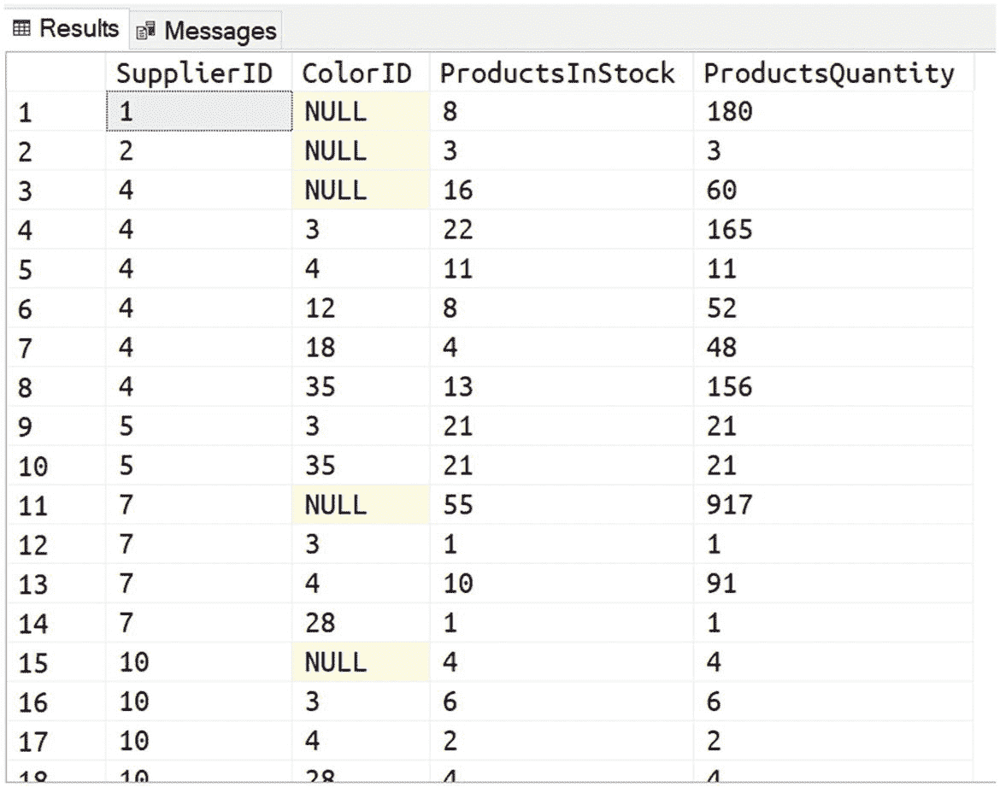

当然，你可能希望将结果数据与其他表进行`JOIN`，以不仅返回 ID，还返回供应商和颜色的名称。

你可以轻松做到这一点，通过结合目前所学的知识，使用一个公用表表达式（Common Table Expression）和几个`JOIN`，优雅地解决问题，并向你的应用程序返回一个包含所有所需数据的结果集。

本书附带的代码中提供了展示此类查询的完整注释代码。

### 多重分组

Azure SQL 提供的一个非常有趣的功能是能够同时对*不同的组*执行聚合。这可能听起来令人困惑，因此一个例子会有所帮助。使用之前相同的示例，现在让它更贴近实际。你需要返回可用于创建矩阵报表的数据，最终用户可以按供应商和颜色分析仓库中有多少产品。行和列将分别包含供应商和颜色。在行和列的交叉点，可以找到具有该颜色、来自该供应商的库存产品数量。由于是矩阵报表，用户期望在最右侧的列中看到每个供应商的产品总数，在最后一行看到每种颜色的产品总数。

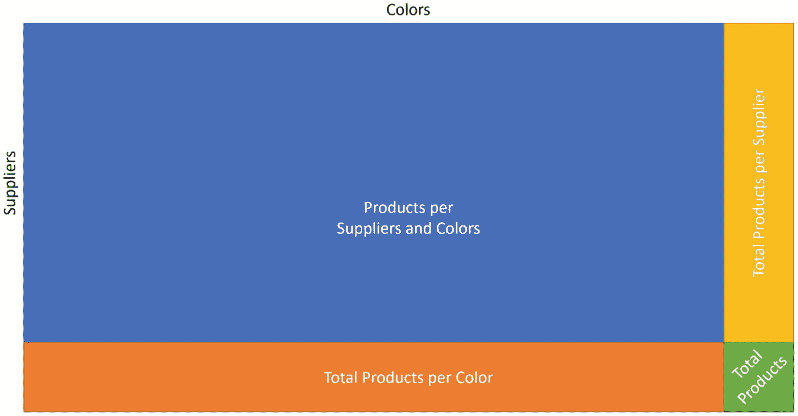

这意味着你必须使用四种不同的设置来对数据进行分组：

*   产品和供应商
*   仅产品
*   仅供应商
*   全部（计算所有产品）

这通常意味着四个不同的查询：在大型数据集上，性能肯定会受到影响，因为你必须读取和聚合数据四次。

我相信作为开发人员，你已经在考虑使用一些缓存来避免这种资源浪费，并将一些计算移到代码中，这样就不必四次读取相同的数据——这很聪明，但这会增加代码的复杂性。如果可能，我们希望避免这一点。幸运的是，不需要这种额外的复杂性，你可以保持代码的简单和精简。你需要做的就是要求 Azure SQL 使用`GROUPING SET`功能为你执行这多个并发聚合：

```sql
SELECT
    [SupplierID],
    [ColorID],
    COUNT(*) AS ProductsInStock,
    SUM(QuantityPerOuter) AS ProductsQuantity,
    GROUPING(ColorID) as IsAllColors,
    GROUPING(SupplierID) as IsAllSuppliers
FROM
    [Warehouse].[StockItems]
GROUP BY
    GROUPING SETS
    (
        ([SupplierID], [ColorID]),
        ([SupplierID]),
        ([ColorID]),
        ()
    )
ORDER BY
    TotalPerColorID, TotalPerSupplierID
;
```

前面查询的结果将包含按所有四种定义的*分组集*分组的数据，因此你将获得所有需要的数据，而无需任何额外的复杂性——并且性能要好得多。

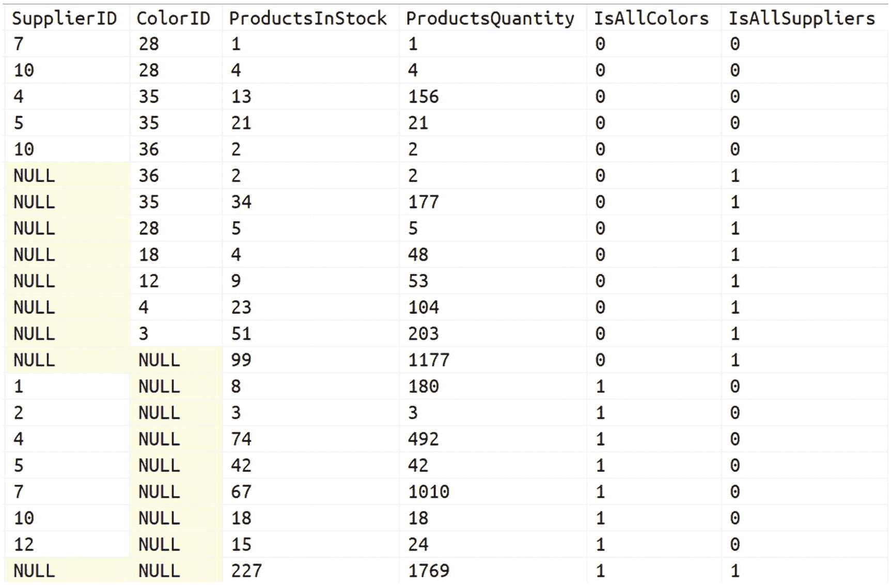

`SELECT`列表中的函数`GROUPING`用于帮助最终用户理解一行是否代表特定值的总计。例如，`IsAllColors`等于 1 的行必须用于矩阵的最右侧部分，因为它代表特定供应商的产品总数，无论颜色如何。

### 窗口函数

窗口函数及其所有相关功能可能是你在 Azure SQL 中用于操作数据的最强大的结构之一。它们能优雅解决的问题数量惊人，而且有整本书专门详细解释它们的用法。本节的目标是让你熟悉它们的使用，以便你可以立即开始利用它们的强大功能。

虽然功能极其强大，但窗口函数相当容易理解。用非常简单的术语来说，它们允许你访问位于当前处理行之前和之后的数据。

最简单的实际例子是由*累计总和*的计算提供的。累计总和被定义为“根据添加的项目不断调整的总和”。

这是一个例子。

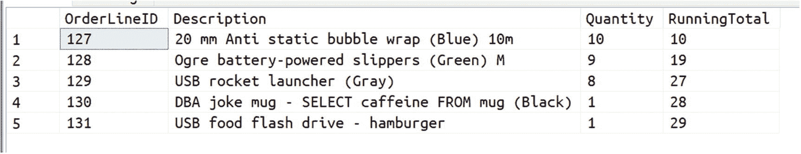

要计算第三行（等于 27）的累计总和，从逻辑角度来看，Azure SQL 必须获取`Quantity`列所有前几行的值并将它们相加。计算第四行及后续行的`Running Total`值时也是如此。

这些需要考虑的额外行代表了 Azure SQL 正在操作的数据*窗口*。对于累计总和，该窗口从表的第一行开始，到当前行结束。

一旦定义了窗口，你就可以告诉 Azure SQL 你想在该窗口可用的数据上使用哪个函数。像`SUM`这样的聚合函数很常见。实际上，`SUM`正是你实现累计总和所需要的。生成上图中结果的代码如下：

```sql
SELECT
    [OrderLineID],
    [Description],
    [Quantity],
    SUM(Quantity) OVER (ORDER BY [OrderLineID] ROWS BETWEEN UNBOUNDED PRECEDING AND CURRENT ROW) AS RunningTotal
FROM
    [Sales].[OrderLines]
WHERE
    [OrderID] = 37
```

另一个常见的聚合函数是`AVG`，它将为你提供计算移动平均值的简便方法。你只需要定义用于计算平均值的窗口大小，例如：

```sql
AVG(Quantity) OVER (ORDER BY [OrderLineID] ROWS BETWEEN 2 PRECEDING AND CURRENT ROW) AS MovingAvg
```

窗口的大小被称为*帧*。除了聚合函数，你还可以使用*分析函数*，这极大地增强了窗口函数的能力。例如，你可以使用函数`LAG`来访问存在于当前行之前的行中的值。同样，一个实际的例子会让这一点非常容易理解。假设你想计算特定客户的两个连续订单之间经过了多少时间。

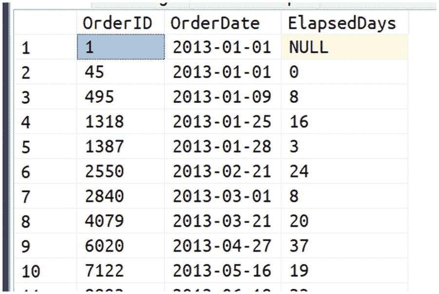

对于每一行，你需要访问前一行，获取订单日期，并将其与当前行的日期进行比较。得益于窗口函数，这非常容易：

```sql
SELECT
    [OrderID],
    [OrderDate],
    DATEDIFF(
        [DAY],
        LAG(OrderDate, 1) OVER (ORDER BY [OrderDate]),
        [OrderDate]
    ) AS ElapsedDays
FROM
    [Sales].[Orders]
WHERE
    [CustomerID] = 832
ORDER BY
    [OrderDate]
```

这是一段非常简单而优雅的代码，Azure SQL 引擎也能很好地优化它；它还为你节省了原本需要编写的大量代码。


到目前为止，我们只关注了使用单个特定客户 ID 或订单 ID。但是，回到累计总值的例子，如果我们想计算整个表中**所有**订单的累计总值，该怎么办？当然，我们不想把订单 ID 37 的行和订单 ID 39 的行混在一起。窗口函数也能为我们处理好这一点。我们只需要指定如何*分区*这个计算过程。在这里，分区让我们可以告诉 Azure SQL 何时应该从头开始一个新的计算。你可以把它想象成类似这样的指令：“只要你处理的值属于同一个组，就持续累加这些值。” 让我们修改一下累计总值的例子，使用两个订单，而不是仅一个。

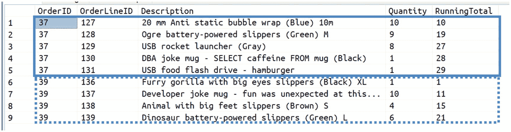

图 4-8：按订单分区计算

如你所见，一旦订单 ID 从 37 变为 39，累计总值必须重新从头开始计算，因为我们希望为每个订单计算各自的累计总值。

实现这一点的代码与原始代码非常相似，只是增加了 `PARTITION BY [OrderID],`。这行代码告诉 Azure SQL，只要 `OrderID` 列中的值没有改变，就持续累加值。当它改变时，Azure SQL 就必须开始一个新的计算：

```sql
SELECT
[OrderID],
[OrderLineID],
[Description],
[Quantity],
SUM(Quantity) OVER (
PARTITION BY [OrderID]
ORDER BY [OrderLineID] ROWS BETWEEN
UNBOUNDED PRECEDING AND
CURRENT ROW
) AS RunningTotal
FROM
[Sales].[OrderLines]
WHERE
[OrderID] in (37, 39)
```

窗口函数在简化代码和提升性能方面都能提供很大帮助，而我们刚刚所见只是它们强大功能的冰山一角，因此请务必去了解它们，并在合适的时候加以使用。

## 批量操作

如果你需要将*大量*数据加载到 Azure SQL 中（这里说的大量是指数十万、数百万甚至数十亿行），你需要使用一个名为 Bulk Copy API 的特定 API。因为它只允许将数据插入到目标表，所以有时也被称为 Bulk Insert API 或 Bulk Load API。

此 API 直接由客户端库调用，它允许你以极高的速度批量加载数据，轻松实现每秒加载数万行甚至更多。当然，我指的是在 Azure 内部的性能，比如从一个 Web API 应用程序或虚拟机（VM）加载到后端使用的 Azure SQL 数据库。如果 API 或应用程序位于另一个云中或在本地运行，则加载数据的速度将取决于本地网络速度。

要执行批量加载，.NET 提供了 `SqlBulkCopy` 类，而 Java 则提供了 `SQLServerBulkCopy` 类。以下是一个使用 .NET 编写的示例节选：

```csharp
using(var conn = new SqlConnection(Environment.GetEnvironmentVariable("CS_AzureSQL")))
{
conn.Open();
var bc = new SqlBulkCopy(conn)
bc.DestinationTableName = "dbo.BulkLoadedUsers";
bc.BatchSize = 10000;
bc.WriteToServer(userDataTable);
}
```

只是为了让你对此速度有个概念（你可以自己测试，因为该示例是本书附带代码的一部分），如果从与你加载数据的目标数据库处于同一区域的 Azure VM 中执行，它将加载 100,000 行用时 0.91 秒，即每秒约 110,000 行，即使使用的是较小的 `BC_Gen5_2` 数据库。我想我们可以称之为*快速*，对吧？

## 如果你想了解更多

在本章中，你学到了很多，为你提供了理解“将计算推向数据”为何重要的基础知识，以及高效执行此操作所需的知识，从理解声明式方法的强大功能，到使用窗口函数操作数据。

我们还简要讨论了规范化及其重要性，以及这个想法为何不仅对关系数据库有用。以下是一些资源列表，可以帮助你更深入地了解刚刚学到的一切：

*   `查询处理体系结构指南` – [`https://docs.microsoft.com/zh-cn/sql/relational-databases/query-processing-architecture-guide`](https://docs.microsoft.com/zh-cn/sql/relational-databases/query-processing-architecture-guide)
*   `智能查询处理` – [`https://docs.microsoft.com/zh-cn/sql/relational-databases/performance/intelligent-query-processing#batch-mode-on-rowstore`](https://docs.microsoft.com/zh-cn/sql/relational-databases/performance/intelligent-query-processing#batch-mode-on-rowstore)
*   `快速查找唯一值` – [`https://sqlperformance.com/2020/03/sql-performance/finding-distinct-values-quickly`](https://sqlperformance.com/2020/03/sql-performance/finding-distinct-values-quickly)
*   `类规范化` – [`www.agiledata.org/essays/classNormalization.html`](http://www.agiledata.org/essays/classNormalization.html)
*   `规范化数据模型` – [`https://docs.mongodb.com/manual/core/data-model-design/#normalized-data-models`](https://docs.mongodb.com/manual/core/data-model-design/#normalized-data-models)
*   `T-SQL 基础知识` – [`www.amazon.com/T-SQL-Fundamentals-3rd-Itzik-Ben-Gan-dp-150930200X/dp/150930200X`](http://www.amazon.com/T-SQL-Fundamentals-3rd-Itzik-Ben-Gan-dp-150930200X/dp/150930200X)
*   `T-SQL 查询开发人员参考` – [`www.amazon.com/T-SQL-Querying-Developer-Reference-Ben-Gan-dp-0735685045/dp/0735685045/`](http://www.amazon.com/T-SQL-Querying-Developer-Reference-Ben-Gan-dp-0735685045/dp/0735685045/)
*   `窗口函数开发人员参考` – [`www.amazon.com/T-SQL-Window-Functions-Developer-Reference/dp/0135861446`](http://www.amazon.com/T-SQL-Window-Functions-Developer-Reference/dp/0135861446)
*   `数据库系统导论` – [`www.amazon.com/Introduction-Database-Systems-8th/dp/0321197844`](http://www.amazon.com/Introduction-Database-Systems-8th/dp/0321197844)
*   `SQL Server 关系数据库设计与实现专业指南` – [`www.amazon.com/Server-Relational-Database-Design-Implementation-ebook/dp/B01MR14K06`](http://www.amazon.com/Server-Relational-Database-Design-Implementation-ebook/dp/B01MR14K06)
*   `数据库管理实践问题：面向思考型从业者的参考书` – [`www.amazon.com/Practical-Issues-Database-Management-Practitioner/dp/0201485559`](http://www.amazon.com/Practical-Issues-Database-Management-Practitioner/dp/0201485559)
*   `数据库设计与关系理论：范式及其他` – [`www.amazon.com/Database-Design-Relational-Theory-Normal-ebook/dp/B082X1B6WP`](http://www.amazon.com/Database-Design-Relational-Theory-Normal-ebook/dp/B082X1B6WP)

# 5. 使用 Azure SQL 进行开发 – 高级篇

在讨论了查询和操作数据的基础方面之后，现在是时候关注 Azure SQL 中更高级和以开发为中心的功能了。如果你已经瞥过本章内容，可能会惊讶地发现有一个关于安全性的完整章节。不必惊讶。安全性不是像事后想法那样可以在后期添加的东西，不是那种“有也不错但非核心”的功能。相反，安全*性*与性能和可维护性同等重要，必须从一开始就被纳入考量。因此，Azure SQL 为你提供的保障数据安全的选项，对于任何想要创建现代应用程序的人来说都是必须了解的——之所以称为现代，不仅是因为它可扩展和模块化，更是因为它也是安全的。

## 可编程性

作为一名开发人员，你已经知道能够重用和封装现有代码是多么重要。Azure SQL 提供了广泛的选项，你可以使用这些选项来确保你的 SQL 代码干净、清晰、易于维护且可重用。


## 变量

T-SQL 中有两种类型的变量：标量变量和表变量。标量变量就是你在其他编程语言中习惯使用的普通变量。变量必须显式声明，其名称以字符“@”开头，并且必须指定类型：

```sql
DECLARE @i INT = 42;
DECLARE @name NVARCHAR(50) = N'John';
SELECT @i AS FamousNumber, @name AS CommonName;
```

T-SQL 不支持数组、列表或字典，但如果你需要在变量中存储多个值，可以使用表变量：

```sql
DECLARE @t AS TABLE (
[Id] INT NOT NULL,
[Name] NVARCHAR(50) NOT NULL
);
INSERT INTO @t VALUES (42, N'John');
SELECT * FROM @t;
```

有一个在初学时可能会让人感到惊讶的行为，它与其他编程语言中的变量管理方式截然不同，那就是 Azure SQL 如何管理变量的**作用域**。变量的作用域是某个 `批处理` 或某个对象。对于对象而言，理解作用域很容易，因为 T-SQL 的行为与其他任何编程语言完全一样。在 `存储过程`、`触发器` 或 `函数` 内部定义的变量，其作用域将仅限于该对象。

而在对象外部定义的变量，其作用域则是 `批处理`。一个 `批处理` 是一起执行的一组 T-SQL 语句。在前面的代码示例中，你必须将所有三个语句（`DECLARE`、`INSERT` 和 `SELECT`）放在一起执行；否则，代码将无法工作。如果你尝试单独执行 `DECLARE` 语句，它是可以工作的，但一旦执行完毕，变量就消失了。如果你接着尝试执行 `INSERT` 语句，你将会收到一个错误，提示变量 `@t` 未定义。

表变量通常只在非常特定的场景下使用，因为它们可能对性能产生相当大的影响，而且通常不应包含太多行。需要注意的是，这与内存消耗或类似问题无关：问题在于表变量介于两个世界——变量和表——之间，因此 Azure SQL 引擎无法像优化常规表那样优化对其数据的访问。如果你想了解更多细节，请参阅本章末尾的内容。一般来说，如果你需要一个临时位置来存储部分数据，请改用临时表。

## 临时表

尤其是在创建分析解决方案时，你可能（甚至相当频繁地）需要将处理后的数据临时存储在某个地方，以便稍后对其进行处理。有时，将一个非常复杂的查询拆分成几个较小的查询也很有帮助，这时你需要一个地方来存储某个查询的结果，以便另一个查询可以获取它进行进一步处理。

临时表正是为解决这类情况而设计的。你可以使用标准的 `CREATE TABLE` 命令来创建临时表。只要表名以井号字符（`#`）开头，该表就是临时的：

```sql
CREATE TABLE #t
(
[Id] INT NOT NULL,
[Name] NVARCHAR(50) NOT NULL
);
```

“临时”意味着它将一直存在，直到被 `DROP` 命令手动销毁，或者直到它超出其作用域。对于 `存储过程` 或 `触发器`，作用域是创建该临时表的 `存储过程` 或 `触发器` 的生命周期。一旦 `存储过程` 或 `触发器` 执行完毕，临时表就会被销毁。

使用 `SELECT INTO` 语句可以快速“创建并填充”一个包含查询结果的临时表：

```sql
SELECT
[OrderLineID],
[Description],
[Quantity]
INTO
#Order37
FROM
[Sales].[OrderLines]
WHERE
[OrderID] = 37;
```

一个名为 `#Order37` 的临时表将被创建，系统会自动推断列名和类型，并用与指定订单相关的 `[Sales].[OrderLines]` 表中的所有行来填充它。

临时表受益于 Azure SQL 能够进行的特殊优化，因为它知道这些表本质上就是临时的。如果你需要临时存放数据，请确保使用它们而不是常规表。


### 视图

视图可能是可用于重用代码和封装数据处理逻辑的最简单选项。视图不过是一个查询定义，被赋予名称，并可以作为表来使用。事实上，视图也被称为 `虚拟表`，尽管这个名称很少使用。

视图对于代码重用很有用，同时也有助于保障数据访问的安全，并通过抽象对底层表的访问来保持与现有应用程序的向后兼容性。

#### 代码重用与性能

第一点相当显而易见：与其编写包含 `JOIN`、窗口函数以及 Azure SQL 提供的所有优点的复杂查询，不如将查询定义保存为视图，然后通过执行更简单的代码来调用它。例如，让我们创建一个视图来封装计算累计总计的逻辑：

```sql
CREATE OR ALTER VIEW [Sales].[OrderLinesRuninngTotal]
AS
SELECT
    [OrderID],
    [OrderLineID],
    [Description],
    [Quantity],
    SUM(Quantity) OVER (
        PARTITION BY [OrderID]
        ORDER BY [OrderLineID] ROWS BETWEEN
        UNBOUNDED PRECEDING AND
        CURRENT ROW
    ) AS RunningTotal
FROM
    [Sales].[OrderLines];
GO
```

现在，你可以使用这个更简单的代码执行相同的查询：

```sql
SELECT
    OrderID,
    [OrderLineID],
    [Description],
    [Quantity],
    [RunningTotal]
FROM
    [Sales].[OrderLinesRuninngTotal];
```

执行的查询将与不使用视图而直接执行查询代码时 `完全一样`。更准确地说，视图主体会被“展开”并与查询主体合并。例如，实际上，如果你编写类似这样的代码：

```sql
SELECT
    OrderID,
    [OrderLineID],
    [Description],
    [Quantity],
    [RunningTotal]
FROM
    [Sales].[OrderLinesRuninngTotal]
WHERE
    [OrderID] IN (41, 42, 43);
GO
```

`GO` 不是 `T-SQL` 命令或关键字。`GO` 是由工具（如 `SQL Server Management Studio` 或 `Azure Data Studio`）识别的关键字，用于通知工具两组 `T-SQL` 语句（通常称为批处理）必须 `单独` 且 `独立` 地执行（但并非并行执行！）。某些命令（例如许多 `CREATE` 语句）需要这样做，以便你可以告诉所使用的工具一个视图主体何时结束，以及另一个可能与该视图无关的命令何时开始。

Azure SQL 的行为就像是可以 `推送` `WHERE` 子句到视图中并应用过滤器，以便仅对请求的订单计算累计总计。更准确地说，真正发生的情况是视图被 `展开` 并与使用它的查询合并。这使得 Azure SQL 可以作为一个整体来优化查询，从而避免，例如，仅仅遵循优先顺序——那将需要为 `所有` 订单计算累计总计，然后删除所有不在查询范围内的行。正如你所想，那样做效率极低。通过遵循此优化过程，视图可以利用外部查询中使用的所有过滤器（在合理的情况下），从而尽可能减少其必须操作的行数，提供更好的性能和更少的资源使用。

#### 安全性

安全性是视图有用的另一个原因：你可以授予某人对视图的访问权限，同时拒绝该用户对视图所用表的访问。这意味着你可以确保用户只能看到查询的结果，而不能看到用于创建该结果的底层表中存储的值。

#### 抽象与兼容性

利用视图的最后一个原因是，它们通过创建一个间接层来帮助抽象对表的访问，从而使你的应用程序和数据库保持松散耦合，为你提供灵活性，让你可以对数据库进行更改而不一定会破坏任何正常工作的应用程序：视图可以用作与现有应用程序向后兼容的接口。你可以自由地重构数据库并使其设计朝着你想要的新方向发展，并且无需担心会引入任何破坏性更改。

可以使用 `DROP VIEW` 命令删除视图：

```sql
DROP VIEW [Sales].[OrderLinesRuninngTotal];
```


## 函数

Azure SQL 中的函数分为两类：返回表的函数和返回标量值的函数。除了这个区别，它们与您可能预期的非常相似，因为正如其名所示，它们就是*函数*。它们允许您封装和重用代码及处理逻辑，可以接受参数并返回结果。

由于 Azure SQL 内置了许多系统函数，例如 `STRING_SPLIT`，用户创建的函数通常被称为用户定义函数或简称 UDF。

返回表的函数通常被称为表值函数或简称 TVF；因此，它们可以在任何可以使用表的地方使用，例如：

```sql
SELECT
    [OrderID],
    [OrderDate],
    [TotalQuantity],
    [TotalValue]
FROM
    dbo.GetOrderTotals;
```

如果一个 TVF 仅由一个 `SELECT` 语句组成，它就变得与视图非常相似，只是它支持参数。像视图一样，这样的函数可以被展开并与使用它的查询合并（这个过程通常被称为*内联*），从而可以利用更好的优化。为了具备这种*内联*能力，这些 TVF 被称为内联表值函数：

```sql
CREATE OR ALTER FUNCTION dbo.GetOrderTotals(@FromOrderId AS INT, @ToOrderID AS INT)
RETURNS TABLE
AS
RETURN
    WITH cte AS (
        SELECT
            [OrderId],
            SUM([Quantity]) AS TotalQuantity,
            SUM([Quantity] * [UnitPrice]) AS TotalValue
        FROM
            [Sales].[OrderLines]
        WHERE
            [OrderId] BETWEEN @FromOrderId AND @ToOrderID
        GROUP BY
            [OrderId]
    )
    SELECT
        o.[OrderId],
        o.[OrderDate],
        ol.[TotalQuantity],
        ol.[TotalValue]
    FROM
        cte ol
        INNER JOIN
            [Sales].[Orders] o ON [ol].[OrderID] = [o].[OrderID];
GO
```

由多个 `SELECT` 语句组成的表值函数称为多语句表值函数，虽然它比内联 TVF 提供更大的灵活性，但当被其他查询调用时，它的优化程度较低。因此，仅应在没有其他选项可用时才使用它，因为它可能对性能产生显著影响。

另一方面，是标量函数。它们只返回单个值。其主体中使用的代码可以任意复杂，甚至可以包含多个 `SELECT` 语句，但在执行结束时，必须且只能返回一个标量值。

虽然标量函数可能会给人一种你会尽可能多地使用的感觉，特别是如果你习惯于命令式编程语言，但在你想要创建和使用新的标量函数时，你应该三思。原因很简单，并且与这样一个事实有关：对一组数据应用一个操作通常比为集合中的每个数据点（在关系数据库中是行）执行该操作要高效得多。如果你创建一个标量函数并用它来处理查询返回的值，你就是在强制 Azure SQL 为返回的每一行执行该函数。每次函数调用都有其自身的开销，再加上 Azure SQL 查询优化器在优化你的代码时空间有限，因为它必须为每一行执行函数。性能会大受影响。事实上，每当数据库被迫逐行处理数据而不是处理数据集时，人们称之为 RBAR（Row-By-Agonizing-Row，逐行痛苦处理），这并非偶然。所以，要谨慎使用标量 UDF。好的一面是，近年来，微软研究发现了一些巧妙的方法，可以将标量函数内部的代码*重写*为更可优化的代码，但即便如此，如果你能从一开始就写出不需要 RBAR 的代码，你就能立即帮助优化器，而无需等待微软的研究，从而立即获得更好的性能。

可以使用 `DROP FUNCTION` 命令删除函数：

```sql
DROP FUNCTION dbo.GetOrderTotals;
```

## 存储过程

存储过程正如其名：存储在数据库中的过程，可以通过按名称调用来执行。存储过程可以有参数，可以返回单个标量值，并且可以返回零个、一个或多个结果集。

它们提供了一种极其强大的方式来封装复杂性、重用代码和创建抽象层：它们可用于创建 API 接口——一种契约——可以保护用户免受数据库生命周期中发生的任何更改或演变的影响。除此之外，存储过程还提供了其他有趣的好处。

像许多其他用于轻松保护数据访问的可编程性特性一样，存储过程也可用于此目的。用户可以被授权执行存储过程，但可能被拒绝直接访问底层表或视图。这一点，特别是如果你正在创建面向公众的应用程序（如 API 或 Web 应用），至关重要，因为你可以确保，无论如何，通过该解决方案访问数据库的用户只能通过你为此目的创建的存储过程来访问数据。即使由于某种原因，用户能够绕过你的中间层或 Web 应用直接访问数据库，他或她也无法做存储过程允许之外的任何事情。这是一个相当重要的观点，对于保持数据安全有巨大帮助。

存储过程还有另一个重要好处。Azure SQL 在首次调用存储过程后，将缓存*执行计划*（在其他数据库系统中也称为 DAG，即有向无环图），这是 Azure SQL 为生成查询结果而将执行的一系列步骤。你将在本书后面了解更多相关内容，但正如你可以想象的，特别是对于复杂查询，生成执行计划可能非常昂贵且消耗资源，因此缓存它将帮助 Azure SQL 节省 CPU 和时间，为你提供更好的整体性能，并为更高的可伸缩性释放资源，而不会产生额外成本。

作为开发人员，存储过程将是你会乐于使用的东西，因为它们确实有助于创建非常清晰的关注点分离，保持代码整洁和完善，促进数据库和应用程序之间接口的清晰定义，并最终有利于良好的松散耦合架构。

一个存储过程可以包含你实现最复杂的数据处理过程所需的所有代码，它们使用 `EXEC`（或者如果你喜欢详细点，可以用 `EXECUTE`）命令调用：

```sql
CREATE OR ALTER PROCEDURE dbo.GetOrderForCustomer
    @CustomerInfo NVARCHAR(MAX)
AS
IF (ISJSON(@CustomerInfo) != 1) BEGIN
    THROW 50000, '@CustomerInfo is not a valid JSON document', 16
END
    SELECT [Value] INTO #T FROM OPENJSON(@CustomerInfo, '$.CustomerId') AS ci;
    SELECT
        [CustomerID],
        COUNT(*) AS OrderCount,
        MIN([OrderDate]) AS FirstOrder,
        MAX([OrderDate]) AS LastOrder
    FROM
        Sales.[Orders]
    WHERE
        [CustomerID] IN (SELECT [Value] FROM #T)
    GROUP BY
        [CustomerID];
GO
```

在前面的代码中，存储过程需要一个字符串参数。经过简单的验证后，读取输入的 JSON 文档，并且只是为了模拟一个中间步骤，相关内容被保存到一个临时表中。之后，检索结果并返回给用户。创建的存储过程只需使用 `EXEC` 命令即可执行：

```sql
EXEC dbo.GetOrderForCustomer N'{"CustomerId": [106, 193, 832]}';
```

存储过程内部的代码将被执行，并且将返回一个结果集，即由 `SELECT ... FROM Sales.[Order]` 查询生成的那个。


您可能在想，此时应该在何时使用函数，何时使用存储过程。这是个好问题！作为一般性指导，请记住，尽管函数功能强大，尤其是内联表值函数，但它们也有相当多的限制和约束。因此，除非您有某个特定用例非常适合使用函数，否则推荐使用存储过程：它们性能更好，并且没有函数的所有限制。

## 存储过程

可以使用 `DROP PROCEDURE` 命令删除存储过程：

```
DROP PROCEDURE dbo.GetOrderForCustomer;
```

### 触发器

触发器是一种特殊的存储过程，当特定事件发生时执行。触发器有两种类型：*DML*（*数据操作语言*）触发器和 *DDL*（*数据定义语言*）触发器。第一种，DML 触发器，在执行 `INSERT`、`UPDATE` 或 `DELETE`（或 `MERGE`）命令时执行。后者，DDL 触发器，则是在调用用于定义数据结构的 `CREATE`、`ALTER` 或 `DROP` 命令时执行。

在这两种情况下，您都可以访问特殊对象，让您能够与引发触发器执行的事件进行交互。

对于 DML 触发器，您可以访问 `Inserted` 和 `Deleted` 虚拟表，以便访问更改前后的数据。您可以决定如何处理这些数据。例如，您可以将删除的数据存储到另一个表中，以提供易于访问的已更改行日志。您还可以指示触发器直接阻止该更改发生：例如，您可能希望确保某些配置数据不会从应用程序正常运行所需的核心表中被移除。

在 DDL 触发器中，您可以访问一个 `EVENTDATA()` 函数，该函数返回一个包含有关正在执行的语句所有详细信息的 XML。例如，在这种情况下，您可以保存该信息以跟踪表是何时、如何以及由谁修改的，或者对象是何时被删除的。同样，您也可以阻止该修改发生。

触发器是正在执行的事务的一部分，这意味着您可以决定是否允许该事务成功完成。例如，可能发生这种情况的一种场景是：只有一组选定的用户被授权更改应用于特定客户的产品折扣率。在触发器中，您可以检查进行更改的用户是否具有相应授权，甚至可能将该操作记录在另一个表中以进行跟踪。如果用户没有该授权，您可以在触发器内直接回滚事务，这意味着更改根本不会发生：

```
CREATE OR ALTER TRIGGER [Warehouse].[ProtectAzure]
ON [Warehouse].[Colors]
FOR UPDATE, DELETE
AS
BEGIN
IF EXISTS(
SELECT * FROM [Deleted]
WHERE [ColorName] IN ('Azure')
)
BEGIN
THROW 50000, 'Azure is here to stay.', 16;
ROLLBACK TRAN;
END
END
```

如果您尝试 `DELETE` 或 `UPDATE` `Warehouse.Colors` 表中的值，导致颜色 “Azure” 被移除或更改为其他内容，触发器将回滚该操作，使 “Azure” 颜色保持不变：

```
DELETE FROM [Warehouse].[Colors] WHERE ColorID = 1
```

这种功能非常强大，但开销也相当大：由于触发器是活动事务的一部分，它们可以回滚事务，但从资源使用的角度来看，最好一开始就防止这种情况发生。预先防止本可以避免使用 IO、CPU 和内存资源，却在进程最后才发现所有已完成的工作都必须撤销——这是对宝贵资源的浪费。

除了对资源使用的影响外，触发器还可能对性能产生重大影响。它们的性能取决于您编写的代码质量以及触发器内置逻辑的执行速度。如果您在触发器中试图聚合一个包含十亿行的数据表，性能很可能不会太好。而且这种情况*每次*触发器执行时都会发生。

这就是为什么触发器越来越频繁地被原生支持的功能所取代。例如，在接下来的章节中您将了解到，跟踪对表所做的所有更改可以通过一种称为“时态表”的功能更高效、更轻松地完成；或者，保护对特定行和值的访问可以通过“行级安全性”来实现。

因此，一般来说，应尽量减少触发器的使用。您应该在更改数据之前就进行所有检查，这样就不必撤销任何操作。这将有利于性能、并发性、可维护性和可扩展性。

可以使用 `DROP TRIGGER` 命令删除触发器：

```
DROP TRIGGER [Warehouse].[ProtectAzure]
ON [Warehouse].[Colors];
```

### 非标量参数

正如您在前面章节中了解到的，存储过程和函数，如预期那样，支持参数。在所有现代编程语言中，参数可以是任何内容，从标量到复杂对象。在 Azure SQL 中，这也是正确的，但有一些区别，因为没有像*对象*这样的概念，因为 SQL 不是面向对象的语言。在接下来的章节中，您将找到可用的选项，以实现其他语言中传递对象所能达到的效果。


### 表值参数

顾名思义，参数可以是表。是的，你可以将整个表传递给一个函数或存储过程。到目前为止，当你需要从应用程序向 Azure SQL 传递大量数据时，这是最佳选择。我用了 *相当* 多这个词，因为根据经验法则，这个选项适用于传递数千行以内的数据。如果你的数据量达到数十万、数百万甚至更多，那么你应该参考前一章讨论的“批量操作”部分，以获得*非常出色*的性能。

另外请记住，表值参数功能需要客户端库的支持，因为它需要知道这个选项才能使用它。常见的语言如 .NET、Python、Node 和 Go 都支持 TVP。

如何使用 TVP 取决于你使用的语言，但基本思路是：你可以将数据加载到一个可以枚举的对象中，确保数据结构与你将用作参数的表*类型*的架构兼容，然后将该对象传递给你调用的存储过程。

首先创建表类型：

```sql
CREATE TYPE dbo.PostTagsTableType AS TABLE
(
Tag NVARCHAR(100) NOT NULL UNIQUE
);
```

然后在你的存储过程中引用它：

```sql
CREATE PROCEDURE dbo.AddTagsToPost
@PostId INT,
@Tags dbo.PostTagsTableType READONLY
AS
INSERT INTO dbo.PostTags SELECT @PostId, Tag FROM @Tags
```

如你所见，参数 `@Tags` 实际上是一个表，因此你可以像使用常规表一样使用它，唯一的限制是它是只读的。然后，以 .NET 为例，你可以像下面的代码那样使用 TVP：

```csharp
var p2 = new SqlParameter("@Tags", SqlDbType.Structured);
p2.TypeName = "dbo.PostTagsTableType";
p2.Value = tags;
cmd.Parameters.Add(p2);
```

其中，`tags` 对象是一个 .NET `DataTable`：

```csharp
var tags = new DataTable("PostTagsTableType");
tags.Columns.Add("Tag", typeof(string));
tags.Rows.Add("azure-sql");
tags.Rows.Add("tvp");
```

表值参数经过了深度性能优化，并且通过向 Azure SQL 发送一批行数据，你的应用程序只需要与数据库进行一次往返通信，而不是每传递一行数据就通信一次。由于每次调用应用程序外部资源都会产生少量开销，因此将调用数据库的次数保持在最低水平（也称为减少应用程序的通信频率），可以确保为最终用户提供最佳体验，创建出可扩展且性能优异的应用程序。

## JSON

有时，将对象作为表传递可能是不可行的。例如，当我们有一个表示诸如博文及其标签、分类、作者详细信息等的对象时。我们当然可以找到方法将此类对象转换为某种表值参数，但这很难称得上优雅。那么，为什么不直接将对象序列化为 JSON 整体传递呢？Azure SQL 完全能够进行复杂的 JSON 操作，正如你将在第 8 章学到的。你可以编写一个能够接受 JSON 作为参数的存储过程；然后你可以用它来读取所需的 JSON 部分，以便填充相应的表，或者将提取的值甚至整个 JSON 文档传递给其他过程：

```sql
CREATE PROCEDURE dbo.AddTagsToPost
@PostId INT,
@Tags NVARCHAR(MAX)
AS
INSERT INTO dbo.PostTags
SELECT @PostId, T.[value] FROM OPENJSON(@Tags, '$.tags') T
GO
```

该存储过程可以接受 `@Tags` 中的 JSON：

```sql
EXEC dbo.AddTagsToPost 1, '{"tags": ["azure-sql", "string_split", "csv"], "categories": {}}';
```

由于 JSON 是作为常规字符串传递的，这项技术适用于任何语言，因为客户端库不需要任何特殊知识即可利用此选项。

#### CSV

如果你只是需要传递一个小型值数组怎么办？或者如果你使用的语言不支持 TVP，而使用 JSON 又感觉有点杀鸡用牛刀？解决这个问题的一个优雅方法是使用经典的、但始终存在的 *CSV*（*逗号分隔值*）。请注意，逗号并非强制性的，你可以使用自己喜欢的分隔符，如竖线或破折号。Azure SQL 为你提供了表值系统函数 `STRING_SPLIT` 来用于此目的：

```sql
CREATE PROCEDURE dbo.AddTagsToPost
@PostId INT,
@Tags NVARCHAR(MAX)
AS
INSERT INTO dbo.PostTags
SELECT @PostId, T.[value] FROM STRING_SPLIT(@Tags, '|') AS T
```

然后你可以像这样使用存储过程：

```sql
EXEC dbo.AddTagsToPost 1, 'azure-sql|string_split|csv'
```

与 JSON 一样，此选项不需要在客户端进行任何特殊处理，因此你可以将此技术用于任何支持常规 ODBC 连接的开发语言。

#### 监控数据变更

找出自上次应用程序或用户访问以来哪些数据发生了更改，对于提高应用程序的效率和可扩展性极为有帮助。例如，与目标应用程序交换仅更改的数据，而不是完整的数据集，所需的资源（CPU、网络和 IO 方面）将大大减少。除了这个已经非常重要的优点外，由于跟踪变更的负担可以交给 Azure SQL 处理，你的代码将更加精简，并且只专注于你需要处理的特定业务场景。结果，你将有更多时间来处理它，从你的任务清单中移除那些在现代应用程序中无论如何都是必需且期望处理的其他复杂性——例如数据传输的效率。


### 变更跟踪

变更跟踪是一项简单而有效的技术，用于了解自特定时间点以来数据发生了哪些变化。这项功能背后的理念是，每次用户访问一个表时，都可以请求获取当时的活动版本号。用户必须安全地存储该版本号，以便下次再次尝试访问该表时，用户还可以请求 Azure SQL 仅获取从该版本号开始之后发生的*已更改*数据。Azure SQL 将返回从该版本号起的所有已更改数据，以及用户应在自身数据集上执行的操作（插入、更新或删除）以将其更新至当前状态，同时返回用户下次用于获取新一组更改的新版本号。

此功能非常强大，因为它完全消除了客户端的所有复杂性，因为客户端唯一需要做的就是保存版本号并将其呈现给 Azure SQL。

必须在数据库上启用变更跟踪：

```sql
ALTER DATABASE WideWorldImportersStandard
SET CHANGE_TRACKING = ON
(CHANGE_RETENTION = 2 DAYS, AUTO_CLEANUP = ON)
```

并在要跟踪的表上启用：

```sql
ALTER TABLE [Warehouse].[Colors]
ENABLE CHANGE_TRACKING
```

从那时起，您可以使用系统标量函数 `CHANGE_TRACKING_CURRENT_VERSION()` 来获取当前版本号：

```sql
SELECT CHANGE_TRACKING_CURRENT_VERSION()
```

版本号在数据库级别计算并自动更新——这就是为什么它不需要任何参数——并且每当受跟踪的表中数据发生变化时，它都会改变。例如，假设我刚刚读取了表 `Warehouse.Colors`，并在操作完成后请求了当前版本号。除了结果集之外，Azure SQL 还向我返回了值 42，该值代表与*当前*版本相关联的数字，这意味着我刚刚读取的值与该版本号相关联。

现在假设有人（甚至可能包括我自己）对 `Warehouse.Colors` 表进行了一些更改。一段时间后，比如 3 小时后，我需要再次从同一表中获取数据，但这次不是获取完整的数据集，我希望只获取自上次查看以来的更改，这样我就可以避免读取和传输所有未更改的行，而这些行很可能占大多数。

`CHANGETABLE` 是我需要用于此目的的函数：

```sql
SELECT
SYS_CHANGE_OPERATION, ColorID
FROM
CHANGETABLE(CHANGES [Warehouse].[Colors], 42) C
```

该查询将返回如下所示的表格：

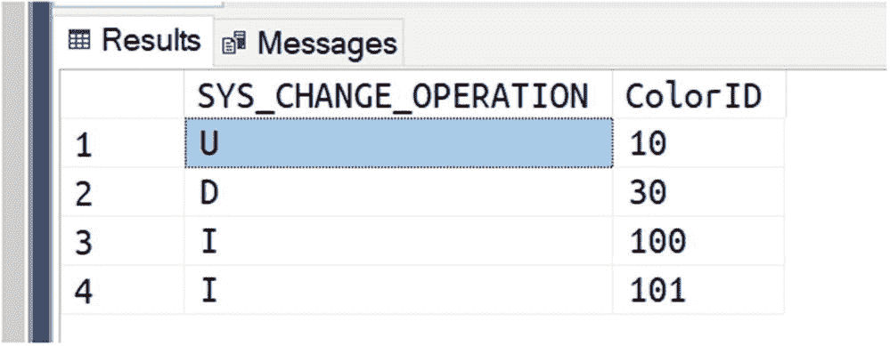

其中您可以看到对一行执行的操作以及该行主键列的值。借助主键（唯一标识表中的行），我们可以将该结果与原始表 `Warehouse.Colors` 进行联接，并获取所有我们需要的数据。我们现在可以再次运行 `CHANGE_TRACKING_CURRENT_VERSION()` 函数以获取当前版本；假设现在它等于 50，我们将该值保存在某个地方，这样下次我们再次查询变更时，将使用该值来获取从那时起发生的新更改——依此类推，用于后续的同步。

简单且极其高效——有助于保持客户端代码非常简洁且易于理解。

要禁用特定表上的变更跟踪，您可以在要禁用变更跟踪的表上使用 `ALTER` 命令：

```sql
ALTER TABLE [Warehouse].[Colors]
DISABLE CHANGE_TRACKING
```

要在整个数据库上禁用它，您需要在整个数据库上使用 `ALTER` 命令：

```sql
ALTER DATABASE WideWorldImportersStandard
SET CHANGE_TRACKING = OFF
```

### 变更数据捕获

变更数据捕获是一项更复杂的技术，它使用内部不可变的事务日志来读取数据上所做的所有更改，并将其保存到指定的表中。它非常类似于其他数据库提供的变更数据流概念。它使用异步过程从事务日志中读取，因此非常适合在不影响发生更改的表的性能的情况下使用这些更改。目前，它尚未在所有 Azure SQL 产品中完全可用，但请密切关注。借助像 Debezium 这样的解决方案，它将轻松实现近实时 ETL 解决方案的创建，并与 Kafka 集成，从而提供完全升级的开发者体验。

## 保护数据资产

除了存储数据并按需提供访问外，数据库还承担着保护数据安全的任务。Azure SQL 提供了丰富的功能来实现这一点，包括通过权限管理、数据屏蔽到加密，因此您可以精确选择希望在何种程度上以及向谁暴露您的数据。

除了将在下一节中介绍的功能外，请记住，默认情况下，得益于名为`透明数据加密`的功能，静态数据会自动加密。顾名思义，它是完全透明的，不需要对您的代码进行任何更改。一旦数据置于 Azure 上，默认即受到保护。当然，这对你来说可能还不够，所以请继续阅读。


### 权限

管理权限及相应的数据访问授权通常是数据库管理员的职责，但正如之前讨论的，安全性在每个应用中都至关重要。因此，开发者至少掌握所用工具和系统安全原理的基础知识总是有益的，这能确保从底层就考虑到安全性，避免未来的麻烦和意外。

Azure SQL 遵循**最小权限原则**，因此，一个新创建的用户在 Azure SQL 中实际上能做的事情非常有限。除了你在创建 Azure SQL Server 或 Azure SQL 托管实例资源时定义的`administrative`用户（它拥有所有可能的授权，因为是管理员账户，**不应**用于授予应用数据访问权限）之外，你应该为你的应用创建一个专用的用户。例如，对于一个托管在 Azure Web API 中的 API 服务，你可以创建 `WebAPI` 用户：

```sql
CREATE USER WebAPI WITH PASSWORD = '94m1-2sx0_1!';
```

如果你尝试用这个用户登录，你会发现它无法访问任何内容。要允许它对某个表执行 `SELECT` 操作，例如，你需要 `GRANT` 它正确的权限：

```sql
GRANT SELECT ON OBJECT::[Sales].[Orders] TO WebAPI;
```

Azure SQL 中有大量的权限设置，允许你对任何用户的安全访问进行**微调**。为了简化安全管理，你可以使用 `roles` 或 `schemas`。角色允许你将用户分组，这样用户就能继承其所属角色的权限。角色可以手动创建，也可以使用预定义的角色。例如，`db_datareader` 角色中的任何用户都可以从任何表读取数据，但他们无法修改任何数据：

```sql
ALTER ROLE [db_datareader] ADD MEMBER [WebAPI];
```

如果你只想对特定的一组对象（例如，你正在创建的 Web API 解决方案所使用的所有表）授予某些权限，你可以针对一个对象架构：

```sql
GRANT SELECT ON SCHEMA::[Sales] TO WebAPI;
```

这样的代码将允许你对属于 `Sales` 架构的任何对象使用 `SELECT`。

正如你可能已经猜到的，存储过程不允许使用 `SELECT`，你需要向用户授予 `EXECUTE` 权限，以确保其可以执行所需的存储过程：

```sql
GRANT EXECUTE ON OBJECT::[dbo].[AddTagsToPost] TO WebAPI;
```

每当用户尝试对一个他/她没有正确权限的对象执行操作时，系统将引发错误，并停止该语句的执行。

为了测试某个特定用户是否拥有正确的权限，如果你已经使用管理员账户登录，你可以 `impersonate`（模拟）该用户：

```sql
EXECUTE AS USER = 'WebAPI';
```

从现在开始，你可以执行所有你想要测试的 T-SQL 代码，其执行效果就如同是用户 `WebAPI` 调用的一样。

要切换回你的管理员用户，你只需运行：

```sql
REVERT;
```

另外，请记住，如果你希望确保某人不能访问某个资源，你可以明确地 `DENY`（拒绝）该用户在某对象上执行某项操作的权限：

```sql
DENY SELECT ON OBJECT::[Sales].[Orders] TO SampleUser;
```

如果存在多个针对同一对象且相互冲突的授权，`DENY`（拒绝）将始终优先。如果用户属于一个或多个角色，这种情况就可能发生。

要从数据库中完全移除一个用户，使其甚至无法连接到数据库，一个简单的方法是删除该用户：

```sql
DROP USER SampleUser;
```

如果你只想暂时阻止用户连接，而不是删除该用户，你可以直接拒绝其连接权限：

```sql
DENY CONNECT TO SampleUser;
```

权限和安全是庞大的主题，但这是一个好的开始。请记住从一开始就牢记安全性，这样你就已经领先一步了。

如果你已经是一个精通安全的人，你可能会认为使用密码登录系统并不十分安全，你是完全正确的。你可以创建一个不将密码存储在 Azure SQL 中的 Azure SQL 用户，它依赖于 Azure Active Directory。然后，你的应用程序可以在连接到 Azure SQL 时使用托管标识进行身份验证。

关于此主题的完整教程在这里：[`https://aka.ms/aswtcmsi`](https://aka.ms/aswtcmsi)。


### 行级安全

通过使用权限（`permissions`），您可以拒绝访问某些表，甚至只是某些列。但如果您想拒绝访问某些特定的行呢？在 Azure SQL 中，您拥有一个强大的功能，称为 `行级安全`（简称 `RLS`），它允许您精确地做到这一点。

借助 `RLS`，您可以为一个或多个表创建一个 `策略`（`policy`）。每次对这些表执行读或写操作时，该策略就会生效：它将评估受影响的行对于执行操作的用户是否可访问。

为了进行评估，策略会将一个提供的用户定义内联表值函数应用到活动操作触及的每一行。如果函数返回 1，则该行可访问；否则，不可访问。

得益于 Azure SQL 查询优化器，该函数将被 `内联`（`inlined`），因此它实际上不会为范围内的每一行执行（否则性能会非常糟糕），但从逻辑角度来看，这正是正在发生的事情。

以下是一个安全策略定义的示例：

```sql
CREATE SECURITY POLICY OrderSecurityPolicy
ADD FILTER PREDICATE [rls].LoginSecurityPolicy(SalespersonPersonID) ON [Sales].[Orders]
WITH (STATE = ON);
```

如您所见，它使用函数 `rls.LoginSecurityPolicy` 来检查对 `Sales.Orders` 表中行的授权。该函数将接收它需要评估的每一行中 `SalespersonPersonID` 列的值。该函数的创建方式如下：

```sql
CREATE FUNCTION rls.LoginSecurityPolicy(@PersonID AS INT)
RETURNS TABLE
WITH SCHEMABINDING
AS
RETURN
SELECT
1 As [Authorized]
FROM
[Application].[People]
WHERE
LoginName = SESSION_CONTEXT(N'Login')
AND
PersonID = @PersonId;
GO
```

该代码使用系统函数 `SESSION_CONTEXT` 来检索 `Login` 键的值。该函数非常有用，因为它允许客户端在连接数据中将一些信息传递给 Azure SQL，然后在整个连接生命周期内都可以访问这些信息。当您创建一个运行在中间层或作为微服务并且无法模拟调用用户的解决方案时，此功能非常方便。这样，您仍然可以将所需的信息（例如登录名）传递给 Azure SQL，以便您可以使用它来应用安全策略。例如，如果您正在使用 OAuth2 来验证调用您正在构建的解决方案的用户，这绝对是一个必需的功能；否则，Azure SQL 将无法知道到底是谁在尝试访问数据，而您将不得不自己在客户端找到巧妙（且复杂）的方法来解决安全挑战。

一旦 Azure SQL 获得了关于谁在实际尝试访问数据的信息，正如您在代码中所见，它将检查该登录名是否存在于 `Application.People` 表中。它还将使用活动安全策略注入到 `@PersonId` 变量中的值来检查此人是否是分配来管理他或她正尝试访问的订单的人。如果所有这些检查都为真，则该行将允许呈现给用户。否则，该行将被简单地丢弃，用户甚至不会知道它的存在。事实上，当安全策略处于活动状态时，如果 Kayla Woodcock 小姐（其 PersonId = 2）尝试通过我们创建的解决方案访问数据，她将只看到她自己的行：

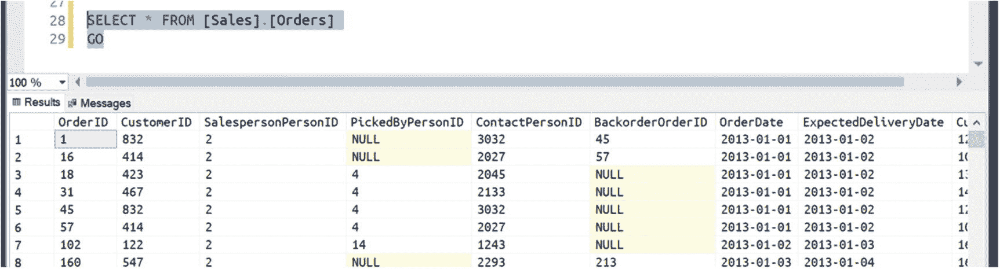

这非常棒，因为它确实大大简化了代码，确保只有用户有权看到的数据才会真正离开数据库。

除了过滤掉行之外，策略还可以被指示在有人尝试访问其没有所需权限的行时引发错误。例如，这可以用于拦截那些会插入未授权值的 `INSERT` 命令。由于该值尚不存在，因此无法使用过滤谓词，但您可能仍然希望阻止其执行：这正是 `阻止谓词`（`BLOCK PREDICATE`）可以做到的。

像往常一样，可以使用 `DROP` 命令删除安全策略：

```sql
DROP SECURITY POLICY OrderSecurityPolicy;
```

一个深入探讨 `RLS` 并展示如何将其用于创建真实世界应用程序的视频，以及一个包含有效示例代码的 GitHub 仓库，可以在这里找到：[`https://aka.ms/rlsvideo`](https://aka.ms/rlsvideo)。

### 动态数据屏蔽

有时您无法阻止对某些列的访问，因为应用程序需要它们才能正常工作。例如，想象您正在创建一组 API，允许用户在可用数据上执行即席查询，这样就可以拥有一个即席报告或分析解决方案来运行最奇特的分析。一个典型的用例是将 Power BI 连接到此类 API。根据访问数据的用户，您可能希望屏蔽一些返回的数据，以便未经授权的用户不会收到错误，而是简单地看到一个预设的模式，从而保护敏感信息。为此，您需要为您想要混淆的列添加一个 `掩码`（`Mask`）：

```sql
ALTER TABLE [Application].[People]
ALTER COLUMN EmailAddress ADD MASKED WITH (FUNCTION = 'email()');
```

在执行上述代码后，任何没有 `UNMASK` 权限的人将只看到 `EmailAddress` 列的已屏蔽数据。

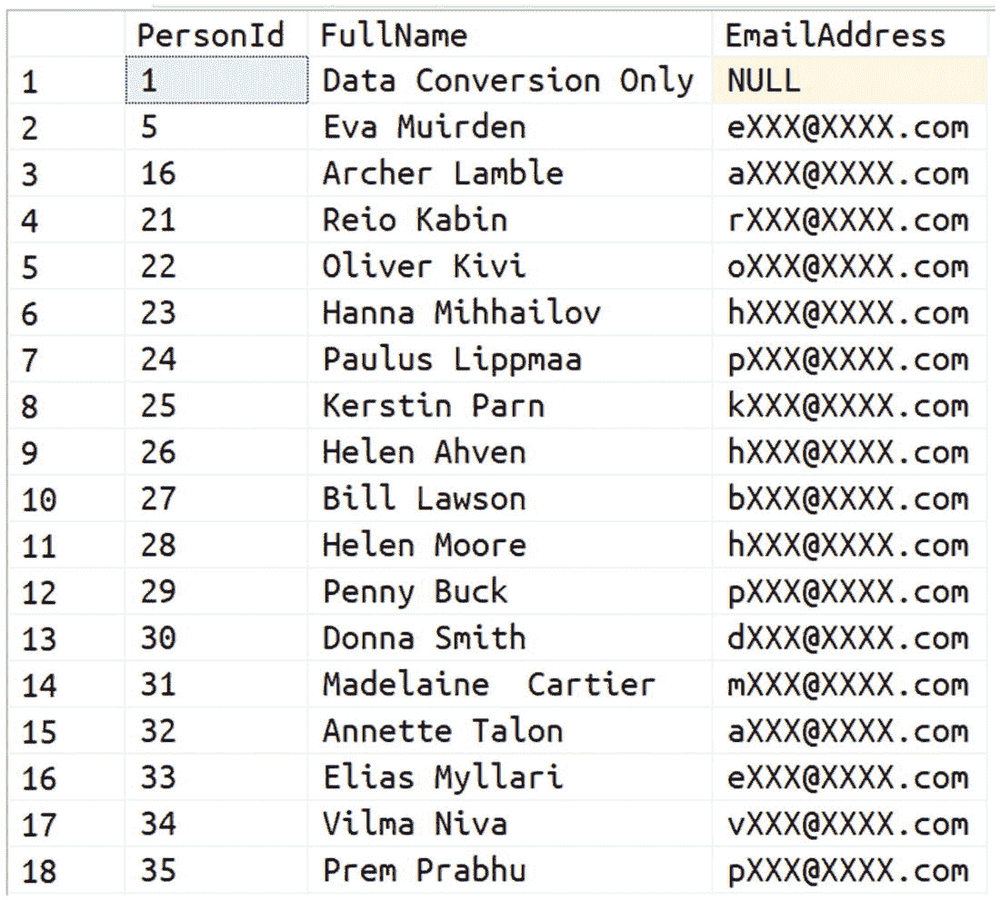

*图 5-1. 动态数据屏蔽在行动中*

这种混淆直接发生在数据库中，因此敏感数据永远不会被发送到 Azure SQL 之外。

由于数据只是被混淆，一个*已经*拥有某些敏感数据的用户仍然可以使用该信息来查询数据库。假设在您正在创建的报告中，您需要分析一个特定用户，并且该用户向您提供了她自己的电子邮件。像这样的查询将完美工作：

```sql
SELECT * FROM [Application].[People] WHERE EmailAddress = 'helenm@fabrikam.com'
```

这为您提供了相当大的灵活性，因为您可以确保保护数据而不限制其对那些通过其他合法方式已访问该受保护信息的人的使用。

当然，这是一把双刃剑，因为它也意味着通过执行暴力攻击，混淆后的数据可能会被恶意用户猜出。这就是为什么动态数据屏蔽应始终与其他安全功能（如行级安全）一起使用，以使发生数据泄露的可能性最小化。Azure 还提供了一个名为高级威胁防护的功能，它也适用于 Azure SQL，它通过使用复杂的机器学习算法监控可疑的数据库访问和异常查询模式来引发潜在威胁的警报，因此您可以始终确保任何恶意访问数据的尝试都会被立即报告。


### 始终加密

`始终加密`是一项功能，它能保证您高度敏感的数据（如信用卡号或社会保障号）使用一组密钥进行加密，而这组密钥不与数据库引擎共享。这意味着即使是数据库管理员也无法解密这些数据，因为数据将由应用程序直接加密，并以加密形式发送到数据库。

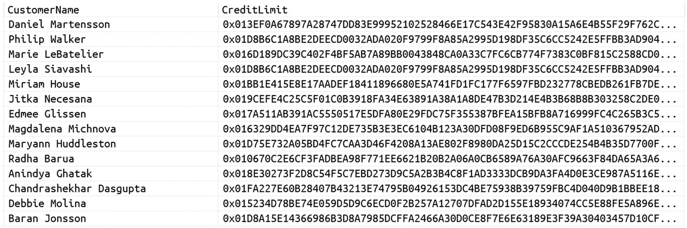

`图 5-2. CreditLimit 已被始终加密`

用于加密的密钥可以存储在本地计算机或`Azure 密钥保管库`中，只有有权访问这些密钥的应用程序才能访问加密数据。尝试在没有正确密钥的情况下访问`始终加密`数据将导致错误：

```
Msg 0, Level 11, State 0, Line 0
Failed to decrypt column 'CreditLimit'.
```

为了对值进行加密和解密，客户端应用程序必须使用支持`始终加密`的连接库，例如

*   `Microsoft JDBC Driver 6.0`（或更高版本）
*   `ODBC Driver 13.1 for SQL Server`
*   `ODBC Driver 17 for SQL Server`
*   `Microsoft Drivers 5.2 for PHP for SQL Server`
*   `Microsoft.Data.SqlClient`

这些库会处理好一切，加密和解密对开发人员来说将是完全透明的。

## 如果您想了解更多

现在，您已经全面了解了`Azure SQL`提供的所有受支持的可编程性特性，以及安全概念和选项的坚实基础。这些功能供您使用，以确保您的应用程序不仅可扩展、快速，而且安全。

要了解本章提及主题的更多信息，您可以从这些资源开始：

*   `SQL Server 2017 Developer's Guide` – [`www.amazon.com/SQL-Server-2017-Developers-Guide-dp-1788476190/dp/1788476190`](http://www.amazon.com/SQL-Server-2017-Developers-Guide-dp-1788476190/dp/1788476190)
*   `SQL Server 中临时表和表变量有什么区别？` – [`https://dba.stackexchange.com/questions/16385/whats-the-difference-between-a-temp-table-and-table-variable-in-sql-server/16386#16386`](https://dba.stackexchange.com/questions/16385/whats-the-difference-between-a-temp-table-and-table-variable-in-sql-server/16386%252316386)
*   `使用变更跟踪` – [`https://docs.microsoft.com/sql/relational-databases/track-changes/work-with-change-tracking-sql-server`](https://docs.microsoft.com/en-us/sql/relational-databases/track-changes/work-with-change-tracking-sql-server%253Fview%253Dsql-server-ver15)
*   `Debezium：从数据库流式传输变更` – [`https://debezium.io/`](https://debezium.io/)
*   `SQL Server 变更流` – [`https://medium.com/@mauridb/sql-server-change-stream-b204c0892641`](https://medium.com/%2540mauridb/sql-server-change-stream-b204c0892641)
*   `透明数据加密` – [`https://docs.microsoft.com/azure/sql-database/transparent-data-encryption-azure-sql?tabs=azure-portal`](https://docs.microsoft.com/en-us/azure/sql-database/transparent-data-encryption-azure-sql%253Ftabs%253Dazure-portal)
*   `始终加密` – [`https://docs.microsoft.com/sql/relational-databases/security/encryption/always-encrypted-database-engine`](https://docs.microsoft.com/en-us/sql/relational-databases/security/encryption/always-encrypted-database-engine)
*   `始终加密客户端开发` – [`https://docs.microsoft.com/sql/relational-databases/security/encryption/always-encrypted-client-development?view=azuresqldb-current`](https://docs.microsoft.com/en-us/sql/relational-databases/security/encryption/always-encrypted-client-development%253Fview%253Dazuresqldb-current)

## 6. 表和索引的实际应用

当人们想象一个表时，大多数情况下，它看起来像一个 Excel 电子表格。有许多按行和列组织的单元格，通常有一列包含行的标识符。

`Azure SQL` 使您能够使用的远不止一个简单的表。您可以针对某些特定的查询模式、复杂的分析或高度并发的更新来配置和优化表。您还可以配置表以保留变更的完整历史记录、实现部分域数据完整性逻辑，并应用细粒度的安全规则。在本章中，您会发现一些实用建议，可以帮助您利用`Azure SQL`提供的功能来创建最适合您需求的表。


## 设计优秀的表格：最佳实践

首先，我们需要了解一些表格设计的最佳实践。表格设计与 Eric Evans 著作中描述的**领域驱动设计**（Domain-Driven Design， DDD）理论紧密耦合。在 DDD 中，我们定义领域模型实体（对象或类），这些实体被划分到`限界上下文`中。一个`限界上下文`是一个逻辑边界，其中特定的术语、定义和规则以一致的方式适用。领域模型实体之间也存在关联，如图 6-1 所示。

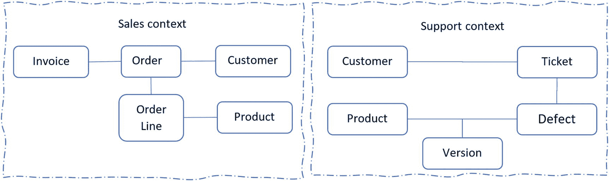

图 6-1：应用程序的领域模型

## 将领域模型映射到数据库表

领域模型中实体的定义被称为领域设计或逻辑设计。最终，我们需要决定如何将领域模型对象存储在数据库中。如果你决定将领域模型实体存储在 Azure SQL 中，有一种直接的方式来定义你的底层表。每个`限界上下文`（图 6-1 中的`Sales`或`Support`）都可以表示为一个模式（schema）。在某些情况下，`限界上下文`甚至可以用独立的数据库来表示。每个领域模型实体应映射到关联模式中的一个或多个表。你可以使用以下一些高级指导原则将领域模型实体映射到数据库表：

- 每个领域模型实体应映射到一个表，该表包含一个唯一标识领域对象的列（即所谓的`主键`）。
- 领域对象的每个简单属性应表示为表中具有匹配 SQL 类型的一列。
- 领域对象中的每个集合、数组或列表应表示为一个单独的表。该表应包含一个列（称为`外键`），该列与包含此集合的行的主键相匹配。
- 如果存在从一个领域对象到另一个领域对象的关联，底层表应包含一个列，该列包含相关对象的主键。在某些复杂情况下，应该有一个单独的映射表，其中包含相关表的主键对。

## 数据规范化的价值与复杂性

看起来很复杂？起初可能确实如此。将复杂的领域对象重新组织为一套冗余度最小的表的过程绝对是一个挑战。我们已经稍微讨论过这个过程了，正如你可能从第 4 章回忆起来的，它被称为`规范化`。

`规范化`使我们能够避免意外错误并防止数据不一致。例如，人们会交替使用像“inquiry”和“enquiry”这样的词（有些人可能认为“enquiry”是“inquiry”的拼写错误）。美式英语和英式英语中也有很多拼写略有差异的单词（例如，colour 和 color，center 和 centre）。让我们想象一下，你有一个实体作为单行存储（或在 NoSQL 文档数据库中作为文档存储），它有一个值为“inquiry”的`type`属性，以及一个`tags`数组，其中一个标签是“.NET”。有人可能会插入另一个类似的实体，其类型为“enquiry”，标签之一为“dotnet”。一个按类型和标签搜索实体的功能将根据搜索条件返回不同的结果，因为客户端会输入“inquiry”和“enquiry”或“.NET”和“dotnet”，而你可能无法实现能够理解这些同义词的复杂规则。在这些情况下，将类型和标签的值存储在单独的表中，为它们分配标识符，并在实体中使用这些标识符，可能是一个更好的主意。这样，就可以选择一个标准化的术语来使用，也许还有该术语的同义词列表，搜索将始终返回一致的结果。

## 规范化过程的核心优势

如果你以前从未做过，如何才能正确完成呢？幸运的是，创建一个好的模型是`规范化`规则迭代应用的过程，所以我们并不孤单。由于`规范化`的目的在于避免潜在的数据不一致性和冗余，因此值得理解为什么我们无论如何都要不惜一切代价避免这些。

冗余本身不一定就是坏的，但它确实带来了挑战。例如，假设订单头显示订单价值为 100 美元，但如果你将订单明细表中该特定订单的所有项目相加，发现总价值是 120 美元。哪个是正确的？你不知道。更糟糕的是，仅凭你已有的数据，你*无法*知道答案，因为数据不一致。数据在那里，但信息丢失了。而这只是一个例子。有几种众所周知的`数据异常`（详情请见`https://aka.ms/sednda`），可以通过正确的`规范化`来避免。

`规范化`过程将帮助你将对象分解成更小的部分，而不会丢失任何信息。这是一个“无损分解”过程：它赋予你在需要时始终能够重建原始信息的能力。同时，它有助于避免冗余以及由此产生的不一致性的危险，从而有利于重用作为其应用结果而创建的更小的信息片段。

## 规范化：起点与延伸阅读

我们只是浅尝辄止，详细描述整个`规范化`过程超出了本书的范围。你可以通过牢记一个好的模型是这样的来打好基础：表中的标量列*仅*依赖于主键，并且使用外键来引用和强制执行与其他表的关系，从而确保信息永不丢失。

`规范化`是一个极其有趣的话题，也是少数可以应用于信息学的正式过程之一：你可以在本章末尾引用的书籍中找到有关数据库设计的更多细节。

## 考虑表格设计的其他方面

到目前为止，我们专注于数据库设计的逻辑方面：`规范化`和将领域类映射到表并不是过程的结束。为了最优地设计一个表，你需要考虑以下方面：

- 为表中列定义类型和其他属性的最佳方式是什么？
- 如何使用索引优化对表的操作？
- 你想在表中定义哪些规则和约束以确保数据有效？
- 如何使你的表安全？

在接下来的章节中，将介绍一些可以帮助你回答这些问题的指导原则。

### 创建表

Azure SQL 让你能够轻松创建表，无需使用图形化工具或生成器。你可以使用简短的 `CREATE TABLE` 语句来创建新表：

```
CREATE TABLE Customer (
CustomerID tinyint,
CustomerName varchar(max),
LocationID bigint
);
```

虽然定义好列来创建表结构很简单，但这仍然不算是表设计。恰当的表设计是一个过程，你需要识别出最适合你应用程序的表特征。回顾上一个示例中的表定义，我们可能会问自己几个问题来审视这个设计：

*   是否可能有两个客户的 `CustomerID` 相同？我们是否需要确保不会有人插入两个具有相同标识符的客户？
*   `tinyint` 类型是客户 ID 的合适选择吗？`tinyint` 列只能包含 256 个不同的值，这对于我们可能拥有的所有客户来说是否足够？
*   `varchar(max)` 类型允许我们存储最大达 2GB 的字符串；然而，这是不是有点小题大做？如果我们知道客户名称长度不能超过 100 个字符，我们是否可以使用像 `varchar(100)` 这样更小的类型？
*   `varchar` 类型允许我们使用英语和其他西方语言的大多数常见字符。但是，我们是否会有一些客户名称包含非常见的拉丁字符（例如，匈牙利语的 ű 或 ő，或斯拉夫语的 đ、č、ć）、西里尔字符（ђ、ч 或 ћ）或亚洲字符？如果是这样，`nvarchar` 类型可能是更好的选择。
*   当我们对客户名称进行排序或比较时，是否应该忽略字母大小写？是否还有其他语言规则我们需要应用？
*   在 `LocationID` 列中，我们可以存储 `2⁶⁴` 个不同的位置，但我们真的有这么多位置吗？我们可以使用更小的类型吗？
*   `LocationID` 值是某个独立表中位置的标识符吗？如果是这样，我们如何确保 `LocationID` 中的值存在于另一个表中？如何确保如果某个位置仍有客户关联时，该位置不会被删除？

恰当的表设计应该回答这些问题，并让你的表拥有正确的解决方案。

你可能也注意到，相当多的问题都围绕着合适的数据类型大小。如今，空间和资源并不短缺，因此仅仅为了节省几个字节而花费时间可能看起来是浪费时间。但是，请记住，如果你的解决方案成功了，你的数据库可以轻易地包含数十亿行数据。浪费空间不仅意味着浪费存储空间，还意味着更多的内存需求和更高的 CPU 消耗。在云环境中，你需要为所使用的服务付费……好吧，我想你已经明白了：对于原本可以优化的模型，却要为同样的性能支付更高的成本。做一个更优秀的开发者吧！

### 确定合适的列类型

设计表时，你需要为你想要持久化的应用程序中的每个数据类型找到一个对应的 SQL 列类型。为了有效地设计表，你需要考虑以下几点：

*   定义能描述你数据的列类型。
*   指定排序规则（collations）来定义文本数据的排序和比较规则。
*   使用计算列（computed columns）来存放预计算的表达式。

在接下来的章节中，你将看到一些在定义表时可以使用的最佳实践和指南。

#### 定义你的列类型

应用程序编程语言中的大多数值类型都有对应的 SQL 类型，你可以据此快速确定用于存储领域对象值的 SQL 类型。也有许多工具可以根据类属性的类型（即所谓的“代码优先”方法）自动生成表列及其类型。虽然你可以使用工具和确定性的映射，但如果你学会仔细检查和改进你的表设计，将会受益匪浅。主要原因是你比工具更了解领域模型，你不应该让自动化的生成器使用一组通用规则来创建你应用程序最核心的部分。一些默认的映射规则可能并不最适合你的设计，例如：

*   字符串类型默认映射到 `NVARCHAR(MAX)` 类型，因为它可以包含任意长度（最大 2GB）的任何 Unicode 文本。这个决定的缺点是，`NVARCHAR(MAX)` 是一个 4000 字符的列表，因此，与长度小于 4000 字符的字符串类型相比，它在许多操作中并非最优。如果你知道你的文本有长度限制，请尝试使用更精确的类型，如 `NVARCHAR(100)`，这可能会提升查询性能。
*   像 C#这样的语言，没有针对日期和日期时间的精细类型。你可能对日期也使用 `DateTime` 类型，即使你不使用时间部分。这些数据值会被映射到 `datetime2`。如果你知道你的 `DateTime` 值只包含日期而不包含时间，使用精确的 `date` 类型会更优。
*   十进制数字（`float`、`real` 类型）被映射到 `decimal` 类型。在 Azure SQL 中，你可以显式指定十进制数的小数位数，也就是其大小。十进制数字的大小可能在每个数字 5 到 17 字节之间变化，具体取决于精度。如果你使用十进制数来存储货币，只有两位小数，并且你知道你的应用程序将使用的最大理论金额，你可以显式指定大小。

这些例子是一些小的检查和调整，如果你花些时间验证默认规则的结果，并利用你对领域模型的了解进行改进，就能让你成为团队中的英雄。

一般的建议是，尽量使列尽可能小，并为给定类型找到最小的 SQL 类型。通过使用大小合适的较小类型，你可以用更少的存储空间来存储相同数量的应用数据。除了节省存储空间外，较小的类型还能积极影响查询性能。Azure SQL 数据库有一个内部内存缓存（称为 SQL 缓冲池），其中包含来自持久存储的部分数据，从而提高了检索这些数据的速度。使用不必要的大类型，你会用不必要的填充数据浪费宝贵的缓冲池空间。此外，较小的类型需要更少的磁盘和网络输入/输出操作，这使你能够更快地加载或保存数据。再者，大列可能会“欺骗”Azure SQL 查询优化器，使其为这些列上的查询保留过多的内存。这些内存可能不会被充分利用，但由于它被保留给了查询，其他查询可能无法获得足够的内存。此外，内存占用较小的数据可以被分配到更小、更快的内层内存缓存中。在某些情况下，你可能会发现查询性能提升仅仅是因为数据没有被无用的 0 值填充——而这是因为有人选择了比实际需要更大的数据类型。

有些人建议使用全局唯一标识符（GUID）值作为领域模型对象的标识符，以避免依赖数据库来生成对象标识符。GUID 的优势在于，你可以在不咨询数据库的情况下，在应用程序中直接给 Model 对象分配标识符。然而，巨大的缺点是 GUID 值长达 16 字节，而 `int` 为 4 字节，`bigint` 为 8 字节。虽然存储消耗不是最优的，但这并非主要问题。如果你不必要地使用 GUID 值，查找或连接行可能会慢得多，因为数据是随机分布的，这会严重影响缓存效率，尤其是在你的表在投入生产后增长起来——特别是如果解决方案成功并拥有大量用户时。良好的设计可以防止许多在应用程序面临每张表数百万行数据的真实场景时可能出现的性能问题。


## 排序规则

排序规则是 Azure SQL 中另一个重要的文本属性。不同的排序规则使您能够定义 Azure SQL 在比较或排序文本值时应使用的语言规则。

在标准编程语言中，您使用的是普通字符串，并且需要在需要时显式指定要使用不区分大小写的比较或排序规则。例如，如果您需要在 C# 中使用某种区域性语言规则对字符串进行排序，则需要为目标语言指定 `CultureInfo`。在大多数编程语言中，您需要在某些方法中显式指定不区分大小写或区域性。Azure SQL 允许您定义语言规则和大小写敏感性，但它还支持一些更高级的比较和排序规则，如音调敏感性、假名敏感性（用于区分日语平假名和片假名字符）或变体选择符敏感性（用于在现代数字编码中应用一些细粒度的排序规则）。

您可以使用如下语句轻松地在任何字符串列上设置排序规则：

```sql
ALTER TABLE Warehouse.StockItems
ALTER COLUMN Brand NVARCHAR(50)
COLLATE Serbian_Cyrillic_100_CI_AI
```

此语句将指定对该列的任何字符串操作都将使用塞尔维亚语规则，并忽略字符串中的大小写（`CI`）和音调（`AI`）。更改列的属性将自动应用于使用该列的所有排序和比较规则。

Azure SQL 为世界上大多数语言提供了排序规则，并允许您为所有语言开启或关闭大小写、音调或假名敏感性规则。如果您需要为全球市场实施应用程序，这是一个巨大的优势。

如果您不说日语，并且遇到了一个错误，指出应用程序中的某些日语单词排序不正确，您最不想做的事情就是为了修复这个错误而开始学习片假名和平假名之间的区别。这正是您可以利用 Azure SQL 提供的语言规则的力量，并依赖 Azure SQL 能够正确排序结果这一事实的时候。

文本的另一个重要属性是编码。字符可以使用不同的二进制表示形式存储，将字符转换为其二进制形式的规则称为编码模式。Unicode 标准为当前使用的大多数相关字符分配了唯一的数字标识符（称为 `code point`，码点）。编码模式定义了如何将字符或其码点序列化为一系列字节。

最简单的编码模式之一是 ASCII，它使用 7 位来编码英语中最常用的字符，每个字符一个字节（例如，代码 `0x5B` 代表 "]"）。ASCII 编码仅支持英语中使用的常见字符，但不支持西方或拉丁语言中使用的其他字符，如 ä、ö、ü、ñ 或 ß。Windows-1252 和 ISO-8859-1 是 ASCII 的扩展，它们使用 8 位来编码更广泛的字符集。这些编码模式对西方语言中的其他常用字符进行编码。然而，由于这些编码模式无法表示其他语言中使用的字符，其他国家衍生出了自己的 8 位编码模式用于国家字符集。其他国家级字符集的例子有 ISCII（印度）、VSCII（越南）或 YUSCII（前南斯拉夫）。单字节国家字符集使用高达 256 的码点范围来表示其国家字母表中使用的常见字符。Azure SQL 使用 `varchar` 类型来表示某些单字节编码模式中的字符（尽管也有一些多字节代码页）。为了区分编码值属于哪个国家字符集，Azure SQL 使用列排序规则。如果 `varchar` 列中的二进制值是 `0xC6`，且列排序规则是某个拉丁排序规则（代码页 Windows-1250），Azure SQL 会假定这是字符 "Ć"。如果排序规则是某个塞尔维亚语排序规则，Azure SQL 会假定这是字符 "Ж"（在 `Serbian_Cyrillic` 排序规则中 - 代码页 Windows-1251）或 "Æ"（在 `Serbian_Latin` 排序规则中 - 代码页 Windows-1252）。基于 8 位码点和国家字符集来识别字符是不必要地简化且容易出错的，因此 Unicode 标准使用多字节编码空间来编码所有语言的字符，每个字符都有不同的码点。有几种用于 Unicode 码点的编码模式，如 UTF-8，其中每个字符使用 1、2、3 或 4 个字节表示；以及 UTF-16，其中每个字符使用 2 或 4 个字节表示。Azure SQL 使用 `varchar` 类型来表示采用 UTF-8 编码的 Unicode 字符，但这些值必须使用以 `UTF8` 结尾的排序规则。为了表示 UTF-16 编码方案，Azure SQL 使用 `nvarchar` 类型，该类型不依赖于排序规则。

除非您确定 `string` 列中的字符只有有限的已知值，否则始终使用 Unicode。在大多数情况下，`nvarchar` 类型是一个不错的选择。尽管即使对于可以放入一个字节的常见字符，它也使用 2 个字节，但 Azure SQL 有一些优化可以自动压缩这些值。如果您真的关心性能并希望针对常见字符进行优化，则应该使用带有 UTF-8 排序规则的 `varchar` 类型。

## 计算列

除了经典列之外，您还可以使用特殊的计算列，它们代表命名的表达式。例如，假设您有购买产品的数量、每个单位的价格和税率。您可以创建一个计算利润的函数并提供列值，但在某些情况下，创建一个自动重新计算的虚拟列会更好：

```sql
ALTER TABLE Sales.OrderLines
ADD Profit AS (Quantity*UnitPrice)*(1-TaxRate)
```

读取此表的应用程序将获得利润值，而无需知道用于计算利润的函数。对于外部应用程序来说，此值看起来就像是表中的另一个值。此计算列不占用额外空间，并且在查询使用它时会动态重新计算。如果表达式可以快速计算，这种轻量级计算列是理想的解决方案。但是，如果您有一些需要字符串处理的繁重计算，您可能希望永久存储计算值，直到基础列更改。这样，您将使用一些额外的空间，但查询无需等待每个应返回行的计算完成。这类计算列称为持久化计算列，可以通过在前面的示例中添加关键字 `PERSISTED` 来创建。生成的代码如下：

```sql
ALTER TABLE Sales.OrderLines
ADD Profit AS (Quantity*UnitPrice)*(1-TaxRate) PERSISTED
```

当任何基础值更改时，持久化计算列中的值会自动重新计算。

这可能看起来与您在上一章学到的用户定义函数非常相似：事实上，如果您愿意，也可以决定使用 `User-Defined Function` 来创建计算列。如果您不打算在其他地方使用 `User-Defined Function`，您只需将逻辑定义为计算列的表达式，这样就能节省一些代码和精力。


## 复杂类型列

标量类型列是关系数据库中标准且最常用的列类型。在大多数情况下，你可以仅包含标量类型列的规范化表来表示你的领域模型。然而，在某些场景下，你可能需要用一些非标量类型来表示你的应用程序对象。Azure SQL 支持在表列中存储以下类型：

*   `XML` – Azure SQL 支持在列中存储格式正确的 XML 文档。
*   空间列包含一些常用元素，用于表示地理和几何概念，如点、线、多边形等。
*   `CLR` 列 – 这些列包含 `.NET` 对象的序列化二进制表示形式。

这些类型不仅仅是其对应应用程序对象的二进制序列化。Azure SQL 支持对这些类型应用一些特定方法。以下代码示例展示了一个最近邻查询，该查询返回距离给定点最近的五个城市：

```
DECLARE @g geography = 'POINT(-95 45.5)';
SELECT TOP(5) Location.ToString(), CityName
FROM Application.Cities
ORDER BY Location.STDistance(@g) ASC;
```

空间列具有诸如 `STDistance` 之类的方法，该方法计算点与作为参数提供的位置之间的距离，并确保应用正确的计算，例如考虑地球是一个球体，以及有几种将地球表面投影到地图上的方式。这些并不简单的三角函数计算，你可以免费使用！

Azure SQL 中的复杂类型使你能够解决需要超出经典表类型特殊处理的、非常特定的问题。

Azure SQL 支持存储 JSON 文档；然而，没有特殊的 JSON 类型。Azure SQL 使用标准的 `nvarchar` 类型来存储 JSON 格式的文本。这意味着 `任何` 编程语言都可以支持它，而无需特殊库。

### 声明式约束

应用程序开发的黄金法则之一是业务规则应在应用层实现。纯粹主义者可能会认为，将业务逻辑推送到数据库存储过程、函数和触发器或客户端可能会导致问题和维护噩梦。我们对此已经做了一些讨论，明确描述了将计算推送到数据的必要性，但让我们先把之前讨论的所有原因放在一边，只关注 `业务规则`。业务规则必须留在应用层：这总是正确的吗？让我们看一些你可能需要实现的业务规则示例：

*   你必须确保一个人的电子邮件地址或用户名是唯一的。在创建新用户之前，你会查询表以检查是否存在具有相同电子邮件的另一个用户吗？
*   你必须确保如果产品引用了不存在的客户，则无法保存该产品。在保存产品之前，你是否会每次读取客户表，只是为了确保没有人在此期间删除了该客户？
*   当你从系统中删除客户时，所有附加信息（如文档）也应被删除，但订单和发票除外，对于这些，你需要断开与客户的关系，并在引用列中设置 `null` 值。如果客户仍有活动账户，则不应删除这些账户。在删除产品之前，你会从应用层查询 `订单` 和 `发票` 表以确保它们不返回任何结果吗？这可能是一个你需要实现并彻底测试的非平凡策略。

虽然你可以在应用程序中实现这些规则，但是否应该这样做是有争议的。描述数据状态和某些操作上行为的业务规则可以很容易地在数据库中声明。事实上，这些业务规则与数据紧密相连，以至于它们实际上更像是一种 `数据一致性` 规则。当然，它始终属于“业务规则”这个大家族的定义范畴，但一如既往，过度概括可能比有益更有害。事实上，通过在数据库级别应用这些规则，你可以确保数据与业务规则保持一致，并且无需一行应用代码即可应用这些规则，遵循保持事物尽可能简单（但不能过于简单！）的黄金原则，也有助于建立良好且清晰的关注点分离。数据绝对是数据库关注的问题。此外，你的操作不会产生额外的性能影响，因为你不需要在主操作中运行额外的查询来验证额外规则或实现某些附带活动。因此，你还能获得更好的性能。这应该有助于你更好地理解，哪些程度的业务规则应在应用层应用，哪些应在数据库应用。

Azure SQL 支持你通过以下约束来增强你的表，并声明性地定义规则以确保数据有效：

*   `主键` 使你能够指定一个列（或一组列）保存对象的唯一标识符。
*   `外键` 指定一个对象（表行）在逻辑上属于另一个对象或以某种方式与该对象相关。这被称为 `参照完整性`，它保证通过外键和主键绑定的两行之间的关系不会意外中断。
*   `检查约束` 是每个对象都应检查的条件。这些约束保证对于保存在表中的数据，某些条件将始终为真。你可以将这些检查实现为最后一道防线，因此即使你的应用程序代码未能检查某些条件，或者你有多个服务可以更新相同的数据，你也可以确信数据库将保证该条件必须始终为真。
*   `唯一约束` 保证列中的值是唯一的。它们几乎类似于主键（一个很大的区别是它们允许空值），可用于用户名或电子邮件地址等值。

Azure SQL 支持你无需实现即可声明性地指定这些约束。以下声明描述了客户与其发票和订单之间的关系。这些声明还将指定在客户被删除时应对相关数据采取什么操作。当有人试图删除客户时，此关系将删除该客户的所有发票：

```
ALTER TABLE Sales.Invoices
ADD CONSTRAINT FK_Cust_Inv FOREIGN KEY (CustomerID)
REFERENCES Sales.Customers (CustomerID) ON DELETE CASCADE;
```

以下声明将阻止删除客户的操作，如果该客户存在某些订单：

```
ALTER TABLE Sales.Orders
ADD CONSTRAINT FK_Cust_Orders FOREIGN KEY (CustomerID)
REFERENCES Sales.Customers (CustomerID) ON DELETE NO ACTION;
```

只需几行代码，你就可以轻松实现可能难以在应用层编码（尤其是测试）的业务规则。利用这些内置约束，你可以依赖 Azure SQL 来维护数据完整性，而无需在应用逻辑中付出任何额外努力。


### 保障表的安全性

Azure SQL 支持为任何能够访问数据库的用户或登录名关联细粒度的权限。假设你有一个管理销售订单信息的**销售微服务**。该微服务使用登录名 `SalesMicroservice` 访问 Azure SQL 数据库，该登录名应能读取或插入 `Sales.Orders` 表，但不能更新或删除数据。它应仅能读取关于 `Customers` 和 `Invoices` 的信息。对于某些自定义操作，它可能仅使用位于 `Sales` 架构中的存储过程。此微服务所需的最小权限集可以通过以下规则定义：

```sql
GRANT SELECT, INSERT ON OBJECT::Sales.Orders TO SalesMicroservice;
GRANT SELECT ON OBJECT::Sales.Customers TO SalesMicroservice;
GRANT SELECT ON OBJECT::Sales.Invoices TO SalesMicroservice;
GRANT EXECUTE ON SCHEMA::Sales TO SalesMicroservice;
```

这些是易于编写和审查的安全规则，你可以定义在数据库中。这种安全模型在诸如**命令查询职责分离 (CQRS)** 的架构中非常重要，这类架构中有各自独立的进程，分别只被允许读取或更新数据。分配所需的最小权限集将确保你不易受到各种安全攻击，例如 SQL 注入或未经授权的更改。Azure SQL 数据库中的安全规则是你数据的最后一道防线，即使应用程序层存在某些安全漏洞，它也应能防止数据泄露。

如果你需要检查分配给用户的权限，可以以该用户身份登录或模拟该用户，并使用 `fn_my_permissions` 函数检查权限：

```sql
EXECUTE AS USER = 'SalesMicroservice';
SELECT * FROM fn_my_permissions('Sales.Customers', 'OBJECT');
REVERT;
```

除了手动检查外，任何 Azure SQL 中都内置了**漏洞评估工具**，它会自动检查分配给用户的权限并提出建议。

## 使用索引提升性能

一张表，除非你为其创建了*聚集索引*（你将在几页后了解到；现在只需记住，默认情况下主键也会在后台创建一个聚集索引），否则它是一组物理存储在类似 .NET、Java 和其他现代编程语言或运行时环境中堆内存区域中的行。这种表在 Azure SQL 术语中被称为*堆表*。

经典的堆表仅在非常有限的场景（如扫描小表或追加行）中有用。然而，在 Azure SQL 数据库中，最常见的操作可能是通过标识符（主键）查找行、根据某些条件查找或更新一组数据等等。这些常见操作在组织为堆的普通行集合上效率极低。正如你将很快了解到的，即使是对整个表的简单扫描，如果我们使用某种特殊的列存储格式也会更高效。

Azure SQL 支持你使用*索引*来增强这种基本结构，并在各种场景下加速对行的访问。索引是行地址的结构，使你能够组织表中的行，或构建一种查询可以比使用基本表更高效利用的结构。Azure SQL 中有几种索引类型：

*   **B 树索引**：代表多级指针树状结构。这些索引使你无需扫描整个表即可轻松定位一个或一组行。
*   **列存储索引**：以列式格式而非默认的行格式组织数据。这些结构（将在下一章描述）是加速扫描大表部分区域的报告和分析查询的绝佳解决方案。
*   **领域特定索引**：为高效支持某些非标准结构或数据类型而构建的特殊索引类型。Azure SQL 支持**空间索引**、**全文索引**和 **XML 索引**。这些索引使你能够运行一些非标准的过滤，例如坐标是否在某个区域内、XPath 表达式、基于文本中两个词邻近性的过滤等。

B 树索引是你在任何 Azure SQL 数据库（更广泛地说，在任何关系型或非关系型数据库）中最常见和使用的结构。B 树索引和表紧密耦合，无法分开讨论。在 Azure SQL 术语中，它们被称为 Hobits（HOBT – 堆或 B 树），它们是大多数数据库中最常见的结构。

列存储索引和领域特定索引是高级概念，将在后续章节中解释。


### B 树索引

B 树索引是一种按表中列值划分节点的层级结构。这种索引在关系型和非关系型数据库中都非常普遍，因为它效率极高且计算上简单明了。这实际上是 Erich Gamma 等人所著的著名 *《设计模式》* 一书中描述的一种**组合设计模式**。在 B 树索引中，每个叶节点都包含指向表行的引用，而非叶节点则包含指向其他节点的引用。这种多层级的树形结构使你能够轻松定位一行或多行。每个 B 树索引都有一个所谓的键列。正是该列中的值被用来搜索表行以查找所需数据。

图 6-2 展示了一个使用 `Price` 列来划分行指针的索引。

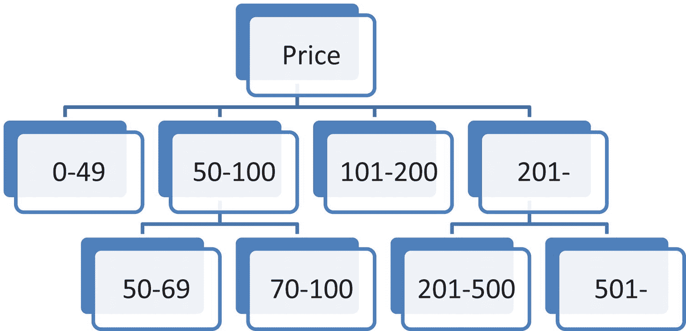

图 6-2：使用 Price 列上的索引将行分组

在根节点之下，你有一系列代表基于 `Price` 列值划分的行范围的组。每个组可能包含指向具有这些值的行的引用，也可能包含指向具有更细粒度范围的其他节点的引用。假设我们需要查找一组 `Price` 等于 73 的行。从根节点开始，我们可以定位到表示 `Price` 值在 50 到 100 之间的行引用范围的节点。这个节点会将我们引向包含 `Price` 列值在 70 到 100 范围内的行引用的节点。这就是叶节点，它包含行的地址，我们可以搜索该节点中的引用列表来找到具有所需值的行。叶节点中的引用数量不多，因此可以快速找到这些行。

索引中的叶节点是行或行地址的列表，为了确保性能始终最佳，这些列表不应过大。如果引用数量超过预定义的限制，Azure SQL 会将该节点拆分为两个节点（此操作称为页拆分）。

叶节点可能包含表行的引用（地址），也可能包含实际存储在表行中的单元格。因此，我们有以下几种索引类型：

- `聚簇索引在其叶节点中保存实际行数据`。当你使用某个条件导航到叶节点时，你将找到实际的行。聚簇索引在物理上组织了表行。其结构定义了行的物理组织方式。由于表行只能有一种物理结构，因此每个表只能有一个聚簇索引。

- `非聚簇索引在其叶节点中保存行的地址`。当你使用某个条件导航到叶节点时，你需要额外的一次读取操作才能从实际行中获取数据。非聚簇索引是在表行之上构建的附加二级引用结构，旨在使你能够根据某些条件定位行。

一般建议是在主键列上创建聚簇索引，因为按主键筛选行是最常见的筛选模式，你希望用最优化的索引来覆盖这种情况。如果你知道有其他更主要的模式，也可以为聚簇索引选择其他列（例如，外键或某个日期列）。

非聚簇索引是额外的辅助结构，用于优化那些常见但非主要的查询。你可以添加多个非聚簇索引，查询优化器会为查询选择最合适的那一个。

下面我们来详细看看何时该使用哪种索引。

### 何时使用 B 树索引？

B 树索引是你在 Azure SQL 数据库中最常见的索引类型。其结构在以下场景中能为我们提供帮助：

- **索引查找**操作：定位具有指定列值的单行或一组行。
- **范围扫描**操作：定位值在某个范围内的行集合。

在以下查询中，索引可能会成为有用的性能助推器：

```sql
SELECT c.CustomerName, c.CreditLimit,
o.CustomerPurchaseOrderNumber, o.DeliveryInstructions
FROM Sales.Customers AS c
INNER JOIN Sales.Orders AS o
ON c.CustomerID = o.CustomerID
WHERE c.PostalCityID = 42
```

Azure SQL 需要读取 `Customers` 表以找到所有 `PostalCityID` 值为 42 的客户。然后，它还需要读取 `Orders` 表，以查找其 `CustomerID` 列值与从第一次读取中获取的 `CustomerID` 值相匹配的订单。仅仅为了获取几行数据而扫描整个表，效率可能非常低下。让我们看看如果我们创建以下索引会发生什么：

```sql
CREATE INDEX ix_Customer_PostalCityID
ON Sales.Customers(PostalCityID);
CREATE INDEX ix_Orders_CustomerID
ON Sales.Orders(CustomerID);
```

有了在 `Customers` 表 `PostalCityID` 列上创建的索引，Azure SQL 将使用该索引快速定位具有给定 `PostalCityID` 的 `Customers` 行。然后，它将基于 `CustomerID` 值在第二个索引中查找订单。可以想象，在大型表中，这会带来巨大的性能优势，更不用说能减少资源、CPU、RAM 和 IO 的使用，而这反过来意味着更好的可扩展性和更低的成本。


### 何时创建索引？

人们有时会忍不住通过添加各种索引来优化数据库，只要他们认为这些索引可能有帮助。有些人甚至认为在每个列上创建自动索引可能是数据库设计的圣杯。然而，在创建索引之前，你需要意识到索引的代价是什么。

索引并非总是能提升查询性能的银弹。在只读工作负载中，它们可能是完美的解决方案，因为它们为更好的执行计划提供了更多选择，而最坏的影响只是它们占用的一些额外空间。然而，对于写操作来说，它们是一种负担，因为每个包含更新值的索引都必须随表一起更新。如果你有一个包含五个索引的表，那么每次插入、删除以及许多更新语句都可能不仅需要更新主表，还需要更新所有索引。

你不应该盲目地在每一列或外键上添加索引，因为这可能会损害数据库性能。以下是一些可用于选择在哪里添加索引的通用准则：

*   你可以从为主键列创建聚集索引开始，因为表上最常见的操作是通过主键值查找行。
*   表可能需要在外键上创建非聚集索引，因为你可能期望查询需要读取具有外键值的所有行。
*   如果你发现应用程序的某个重要查询速度缓慢，你可能需要为该查询使用的列创建索引。

随着数据库和解决方案复杂性的增加，你可能会发现一个非常常见的查询，它使用 `OrderDate` 列返回过去一天的所有订单。在这种情况下，在该列上创建聚集索引可能很有用，这样，同一天下的所有订单在物理存储上会彼此靠近。请记住，实际上，聚集索引将其行存储在叶级，并且行按创建索引的列排序。这意味着 Azure SQL 可以从该天下的第一笔订单开始读取，并在找到最后一笔订单时停止，从而将读取优化到最低程度。当然，由于只有一个聚集索引，你需要根据对应用程序工作方式以及用户主要使用方式的了解来仔细评估此策略。

如你所见，确定正确的索引并非易事。因此，存在各种工具，如 `SQL Server Management Studio` 中的 `Performance Dashboard`、`Database Tuning Advisor`，或开源脚本如 `Tiger Toolbox` 或 `First Responder Kit`（本章末尾的链接中引用了两者），它们可以提供可能需要创建的索引列表。在创建索引之前，请务必使用工具来证明你确实需要它。过度索引和很少使用的索引是导致性能问题的两个最常见原因。

Azure SQL 提供了一系列智能功能，例如 `Automatic tuning`，它会提供关于你可能需要创建的索引的建议。这是识别缺失索引的最佳方式，因为这些建议由机器学习算法提供支持，这些算法在 Azure SQL 中的大量数据库上进行了训练。更棒的是，你可以让 Azure SQL 的 `Automatic tuning` 功能自动为你创建索引。`Automatic tuning` 功能的主要好处是，它会验证创建的索引是否会改善你的查询性能。Azure SQL 具有内置的机器学习模型，用于衡量索引创建前后数据库工作负载的性能，识别受索引影响的查询，并检查查询性能是得到改善还是恶化。如果性能改善不够显著，或者新索引导致性能下降，该更改将被还原。此外，`Automatic tuning` 会扫描你的索引使用情况，并向你推荐应该删除的索引。另一个重要好处是，`Automatic tuning` 会合并索引建议以提供最佳索引。例如，如果有两个建议，一个是为列 `A` 创建索引，另一个是为列 `A` 和 `B` 创建索引，Azure SQL 索引建议将只推荐第二个，因为它也能覆盖只需要列 `A` 的查询。


### 维护索引

每当索引列中的数据发生更改时，索引都会更新。最初创建的索引是一个完全平衡的树，能提供最佳性能。然而，在活跃使用的数据库中，底层数据会随时间变化，导致索引失衡，部分节点处于半填充状态。索引维护操作会重新生成索引并使其恢复到更佳状态。你可以对索引执行两种维护操作：

*   `REBUILD` 是一种完全重新创建索引的操作，它会删除旧结构并重新创建一个新的完全平衡的索引。此操作以资源消耗为代价，确保你的索引处于完美状态。

*   `REORGANIZE` 是一种重新洗牌索引部分数据的操作，旨在尝试填充未使用的空间并平衡索引的各个部分。这是一种非常轻量级的操作，通常不会影响应用程序性能或消耗大量资源，但另一方面，它可能无法修复所有问题。

重新创建索引的 SQL 语句示例如下：

```sql
ALTER INDEX FK_Sales_Customers_DeliveryCityID ON Sales.Customers
REBUILD WITH ( ONLINE = ON);
```

如果你想重组索引，只需将 `REBUILD` 关键字替换为 `REORGANIZE`。此语句中一个有趣的可选选项是 `ONLINE` 选项。重建索引有两种方式：

*   `OFFLINE` 是默认选项，是重建索引最快的方式，但它会阻止任何可能触及索引列数据的查询。

*   `ONLINE` 允许你的工作负载更改数据，因为它会获取期间发生的任何更改。这是一种更灵活的操作，但可能比 `OFFLINE` 版本消耗更多资源，并且在完成前可能影响性能。

这些选项仅在 `REBUILD` 操作中可用。`REORGANIZE` 始终是 `ONLINE`。

索引维护中最重要的问题是应该使用哪个选项以及应用于哪些索引。重建或重组所有索引只会消耗本应用于查询的资源，而且大多数索引可能根本不需要任何维护。通常用于确定索引健康状况的标准是碎片化。碎片化是指索引中包含索引数据的空间百分比。

以下查询返回给定数据库和对象（应扫描其索引）的所有索引的碎片化信息：

```sql
DECLARE @db_id int = DB_ID('Wide World Importers');
DECLARE @object_id int = OBJECT_ID('Sales.Customers');
SELECT index_id, partition_number, avg_fragmentation_in_percent
FROM sys.dm_db_index_physical_stats(@db_id, @object_id, NULL, NULL , 'LIMITED');
```

在查询结果中，你可以找到 `index_id`、`partition_number` 和 `fragmentation`，因此可以使用 `sys.indexes` 等系统视图来查找碎片化的索引。注意函数中的最后一个参数——`LIMITED`。调查索引碎片化并非轻量级操作，特别是在大型索引上，你可以指定是通过扫描索引的有限部分来获取近似结果、从样本计算统计信息，还是分析整个索引。

你需要对索引采取的操作取决于碎片化程度。一些经验法则如下：

*   如果索引的碎片化在 5% 到 30% 之间，请使用 `REORGANIZE` 操作。

*   如果碎片化大于 30%，并且你能找到表格不被使用的一段时间（即维护窗口），请使用 `OFFLINE REBUILD` 操作。

*   如果你的表格频繁使用，并且你无法阻塞应用程序工作负载，请使用 `ONLINE REBUILD` 操作。

你也可以使用经过验证的开源脚本来帮助识别需要维护的索引并应用推荐的操作。最常用的索引维护脚本是 Ola Hallengren 脚本和 SQL Tiger Toolbox。

可恢复性是另一个重要的索引维护策略。如果你无法避免可能昂贵的 `REBUILD` 操作，并且没有维护窗口，Azure SQL 允许你暂时暂停重建操作并在之后恢复。这在以下情况下是一个绝佳的选择：你发现索引维护影响了应用程序性能，需要暂停索引重建，让你的应用程序完成一些工作，然后在不丢失已完成工作的情况下继续维护。

### 退役索引

创建索引很容易，但更重要的问题是“它们是否被使用，或者它们造成的弊是否大于利？”过度索引可能导致严重的性能问题。即使你拥有一套理想的索引，你的应用程序模式和数据库工作负载也会随时间变化，一些索引可能因不再使用而需要被移除。最终，你将需要退役并删除一些索引。

经验丰富的数据库管理员可以通过查看系统视图和查询执行计划，或者在设置 `STATISTICS IO` 选项时检查逻辑读取次数，轻松识别不必要的索引。如果在此领域的深度专业知识不是你的职业目标之一，你可以再次依赖 Azure SQL 提供的优势。除了索引创建建议外，Azure SQL 还提供删除索引建议。Azure SQL 会扫描索引使用情况以识别未使用的索引。它还可以识别应被删除的重复索引。你可以直接使用脚本来删除索引，或者让 Azure SQL 为你清理索引。Azure SQL 不会仅仅删除并遗忘索引。自动调优将使用与索引创建相同的算法，并监控删除索引操作是否降低了性能。如果检测到性能问题，Azure SQL 将重新创建已删除的索引。


## 如果你想了解更多

你在本章中学到的知识使你能够专业地创建合适的数据库设计，并理解数据库中可能遇到的问题。本章解释的概念代表了数据库设计所需的核心知识。在下一章中，我们将更进一步——你将了解如何使用一些高级概念和表的类型与索引，这些可以提升你的数据库性能。

要了解更多本章提及的主题，你可以从这些资源开始：

*   数据库设计与关系理论：范式及其他——[www.amazon.com/Database-Design-Relational-Theory-Normal-ebook/dp/B082X1B6WP](http://www.amazon.com/Database-Design-Relational-Theory-Normal-ebook/dp/B082X1B6WP)
*   SQL Server 专家级性能索引——[www.amazon.com/Expert-Performance-Indexing-SQL-Server/dp/1484211197](http://www.amazon.com/Expert-Performance-Indexing-SQL-Server/dp/1484211197)
*   设计模式：可复用面向对象软件的元素——[www.amazon.com/Design-Patterns-Elements-Reusable-Object-Oriented/dp/0201633612](http://www.amazon.com/Design-Patterns-Elements-Reusable-Object-Oriented/dp/0201633612)
*   领域驱动设计：应对软件核心复杂性——[www.amazon.com/Domain-Driven-Design-Tackling-Complexity-Software-ebook/dp/B00794TAUG](http://www.amazon.com/Domain-Driven-Design-Tackling-Complexity-Software-ebook/dp/B00794TAUG)
*   数据库：解释数据规范化、数据异常与 DBMS 键——[`towardsdatascience.com/softly-explained-data-normalization-data-anomalies-and-dbms-keys-f8122aefaeb3`](https://towardsdatascience.com/softly-explained-data-normalization-data-anomalies-and-dbms-keys-f8122aefaeb3)
*   堆与索引——[`docs.microsoft.com/sql/relational-databases/indexes/heaps-tables-without-clustered-indexes`](https://docs.microsoft.com/en-us/sql/relational-databases/indexes/heaps-tables-without-clustered-indexes%253Fview%253Dsql-server-ver15)
*   Tiger Toolbox —— [`github.com/microsoft/tigertoolbox`](https://github.com/microsoft/tigertoolbox)
*   First Responder Kit —— [`github.com/BrentOzarULTD/SQL-Server-First-Responder-Kit`](https://github.com/BrentOzarULTD/SQL-Server-First-Responder-Kit)
*   sp_WhoIsActive —— [`github.com/amachanic/sp_whoisactive`](https://github.com/amachanic/sp_whoisactive)

# 7. 可扩展性、一致性与性能

可扩展性，通常定义为系统通过向其添加资源来处理不断增长的工作量的能力。在云平台中，大规模标准化和“规模经济”原则驱动着硬件设计，单纯向单个服务实例添加资源的能力可能受到限制。这就是为什么，除了采用横向扩展架构外，设计并调优你的工作负载以最大化资源利用率，同样是一个至关重要的可扩展性方面。如果你正在设计一个全新的应用程序，或者有机会在迁移前修改一个现有应用，这也能实实在在地降低你的云账单。

虽然可扩展性无疑是一个关键属性，但一致性是我们应该期望从关系型数据库管理系统解决方案中获得的另一个关键方面。事务性系统确保数据在应用程序和用户交互后保持一致状态，而底层引擎负责管理不同用户的多个并发活动将如何访问数据以维持这种一致性，这是基于可配置的属性，例如这些事务活动之间的隔离级别。

一致性确实是应用程序开发中的*关键因素*，尽管它常常被忽视：许多开发人员认为一致性是可选的。在一些极端情况下，这也许是对的；但在大多数情况下，并非如此。事实上，近来关系型数据库管理系统重新成为焦点并非偶然。在著名的论文《F1：一个可扩展的分布式 SQL 数据库》中，谷歌明确指出：“设计应用程序来处理数据中的并发异常非常容易出错、耗时，并且最终不值得为那点性能提升而冒险。” 而如果数据库层面没有处理好一致性，猜猜谁会被要求编写代码来处理它？没错，就是你，开发者。这是因为你的用户会认为一致性是理所当然的。所以，必须有人或有东西来处理它——当然，是在大规模环境下。而数据库级别的、大规模的一致性，正是像谷歌 Spanner、亚马逊 Aurora 和 Azure SQL Hyperscale 这样的全新一代后关系型数据库诞生的原因。


## 事务

### 理解事务与 ACID 属性

事务是给定应用逻辑中的工作单元，可能由多个较低层级的任务组成。事务也被称为“工作单元”，这是一种非常知名的模式，用于跟踪更改，并将更改作为一个整体在逻辑上提交或回滚，正如马丁·福勒在其*企业应用架构模式*一书中所描述的那样。

数据库系统在处理事务时，会维护所谓的`ACID`属性（`原子性`、`一致性`、`隔离性`和`持久性`），以确保数据的完整性和准确性。事务业务逻辑的典型示例可以是银行账户之间的转账或 ATM 现金取款，在这些场景中，你希望确保一系列操作遵循“全有或全无”的逻辑进行。数据库平台有助于强制执行这些`ACID`属性，而无需从应用角度进行复杂的实现：开发人员无需手动实现逻辑来在至少一个更新失败时恢复更新操作。

### 事务在任何应用中的重要性

现在，你可能对这个示例非常熟悉，并且可能认为自己不会编写银行应用，因此并不真正需要事务。虽然这种想法表面上看起来正确，但请记住，即使在最简单的应用中，比如一个博客引擎，你也可能有使用事务的需求。

假设你想跟踪有多少人访问了你的博客，既要统计整个博客的访问量，也要统计你写的每篇文章的访问量。由于你希望确保能够根据需要无限扩展，你设置了两个计数器：一个用于整个博客，一个用于每篇文章。每次有人访问页面时，你都需要增加整个网站的计数器和该页面的计数器。如果你没有正确实现和管理事务，会发生什么？

可能会发生这样的情况：由于某种原因，在网站计数器更新后但在文章计数器更新前，某个环节崩溃了。这意味着你现在已经完全丢失了信息。一致性不复存在。如果你尝试将所有单个计数器相加，结果将与网站计数器不同。那么哪个值是正确的呢？你可能——也许——能够投入大量的专注、时间和精力来重建信息。但在许多情况下，你根本无法做到。现在，对于博客计数器来说，这也许不是什么大问题（但即使这也不完全正确，如果你是按博客访问量获得报酬呢？），但它让你认识到一致性以及因此而来的事务的重要性，即使在你可能未曾想到的地方也是如此。数据一致性应该是每个系统的基石。没有它，数据就只是噪音。

### 如何实现 ACID 属性：预写式日志 (WAL)

幸运的是，在现代数据库系统中，`ACID`属性通常通过预写式日志来实现，这是一种通过首先在事务日志中记录更改来提供原子性和持久性的能力，只有随后才通过一个称为`检查点`的周期性后台进程将更改写入数据库。日志通常同时存储重做和撤销信息，这些信息将用于恢复任何已提交但尚未写入数据库的事务，例如在从断电中恢复或数据库还原期间。

> **注意**
> 如果你是 Apache Kafka 用户，你可能会发现 WAL 技术与 Apache Kafka 使用的不可变日志原则有很多相似之处。在两种情况下，一切都作为事件存储在日志中。通过向前或向后读取日志，你可以重做或撤销任何操作，甚至可以停在期望的时间点。这正是像 Azure SQL 这样的关系数据库管理系统向最终用户保证不会丢失任何数据、并且可以恢复一切及其期望时间点的原因。

### Azure SQL 中的事务：用例与机制

在 Azure SQL 中，你可以想到几种使用事务会有所帮助的用例。例如，你可能希望将多个行的插入、更新或删除操作作为一个单元或批处理过程来执行，而不是逐个处理。同样，你可能需要在满足特定条件时才修改表的状态，即当相同或不同数据库（甚至服务器）中的其他表也被修改时。

由于这些系统可以并发处理多个此类操作，Azure SQL 引擎通常会通过在这些事务涉及的各种资源（基表、索引键等）上放置锁来保护一致性，锁的粒度可以从单行到整个数据库不等，具体取决于并发（也称为隔离）设置是如何配置的。一旦事务提交或回滚，这些锁就会被释放。

锁只是 Azure SQL 用来确保数据保持一致性的选项之一，可能是最简单的一种。另一种更复杂的能力是，允许同一行的多个不同版本同时保持活动状态，向请求的事务提供正确的版本，即使其他事务正在更改同一行，也能保证一致性。关于这种被称为`行版本控制`的技术的讨论，远远超出了本书的范围：只需记住，默认情况下，Azure SQL 会混合使用这两种技术，以确保你获得最佳的体验和性能。

> **提示**
> 尽可能缩短事务的持续时间是一种最佳实践，这将有助于增加数据库对象上的并发性，并减少维护锁或行版本所需的系统资源。

### 管理事务：控制与范围

应用程序可以通过使用 Transact-SQL 命令或客户端驱动程序公开的 API 函数来控制事务，指定事务何时开始和结束（成功或失败）。事务通常在连接级别管理：当在某个连接上启动事务时，直到该事务结束前，在该连接上执行的所有 Transact-SQL 语句都是该事务的一部分。

> **注意**
> 这种行为的一个例外是当您有一个多活动结果集 (`MARS`) 会话时。`MARS`是一项可以通过连接字符串属性启用的功能，它允许应用程序在同一个连接上已经存在一个活动结果集时，在该连接上执行命令。一个典型场景是，当你遍历`SELECT`查询检索到的一系列行，并且希望使用相同的连接执行`UPDATE`命令时。在这种情况下，事务的作用域将在批处理级别（而不是连接级别），当它完成时，如果事务没有显式提交或回滚，Azure SQL 将自动将其回滚。

### 显式模式与自动提交模式

当你通过 API 函数（例如，.NET 语言中的`BeginTransaction()`方法）或发出`T-SQL`语句（如`BEGIN TRANSACTION`、`COMMIT TRANSACTION`、`COMMIT WORK`、`ROLLBACK TRANSACTION`或`ROLLBACK WORK`）显式定义事务的开始和结束时，Azure SQL 中的事务被定义为`显式`事务。

当你没有显式启动事务，而是对 Azure SQL 执行单个命令时，默认模式称为`自动提交`。在这种模式下，每个`T-SQL`语句在完成时都会被提交或回滚。如果语句成功完成，则被提交；如果遇到任何错误，则被回滚。自动提交模式也是`ADO`、`OLE DB`、`ODBC`和`DB-Library`等客户端驱动程序操作的默认模式。


# 事务模式

我们拥有的第三种模式称为 `implicit`（隐式）。在此模式下，Azure SQL 会在当前事务提交或回滚后启动一个新事务。启动事务无需执行任何操作；您只需提交或回滚每个事务。这最后一种模式主要是出于合规和向后兼容性的原因而实现的。在大多数用例中，您的应用程序在执行简单的数据库命令时会使用自动提交，且通常不需要严格控制复杂事务。当需要管理某些更复杂的具体事务行为时，建议切换到 `explicit`（显式）模式。事务模式设置可通过执行显式 T-SQL 语句在连接级别进行控制。不同的客户端驱动程序可能有不同的事务模式默认设置，并且会在建立新连接时为您调用 T-SQL 语句，因此查阅您所使用驱动程序的文档以了解其具体行为非常重要。

### 本地事务

作为应用程序开发人员，您大部分时间将与在单个 Azure SQL 数据库实例上下文中执行的事务进行交互，这些事务通常被称为 *本地事务*，以区别于我们稍后将讨论的分布式事务。在此场景中，本地事务通常被包装在 `存储过程` 内的更复杂的业务逻辑中使用，这通常是保持事务持续时间短暂并避免应用程序与数据库代码之间多次网络往返的推荐做法。如果出于任何原因，您不依赖 `存储过程`，而是在应用程序代码中编写数据库访问命令，您可以通过调用客户端驱动程序 `API` 暴露的特定命令来控制事务行为。

以下是一个如何在 T-SQL 脚本（如 `存储过程`）中使用显式事务的示例。在我们的系统中，有两个主要表：`订单表（Orders）` 和 `库存表（Inventory）`；每当为给定产品下一个新订单时，我们需要减少其库存数量。我们系统中的业务逻辑必须防止为即将缺货的商品下新订单。实现此逻辑的方法有很多种，在我们的示例中，我们将新订单的下达和同一商品库存的减少包装在一个显式事务中：

```sql
-- 创建表结构
CREATE TABLE dbo.Orders (ID int PRIMARY KEY, ProductID int, OrderDate datetime);
CREATE TABLE dbo.Inventory (ProductID int PRIMARY KEY, QuantityInStock int
CONSTRAINT CHK_QuantityInStock CHECK (QuantityInStock>-1));
-- 插入一些示例值
INSERT INTO dbo.Orders VALUES (1,1,getdate());
INSERT INTO dbo.Inventory VALUES (1,100);
-- 开始一个显式事务
BEGIN TRANSACTION mytran
-- 在应用逻辑中尝试执行工作单元
BEGIN TRY
INSERT INTO Orders VALUES (2,1,getdate());
UPDATE Inventory SET QuantityInStock=QuantityInStock-1 WHERE ProductID=1
-- 如果两个命令都成功，则提交事务
COMMIT TRANSACTION
END TRY
BEGIN CATCH
-- 如果有错误，则捕获详细信息
SELECT
ERROR_NUMBER() AS ErrorNumber
, ERROR_SEVERITY() AS ErrorSeverity
, ERROR_STATE() AS ErrorState
, ERROR_PROCEDURE() AS ErrorProcedure
, ERROR_LINE() AS ErrorLine
, ERROR_MESSAGE() AS ErrorMessage;
-- 显式回滚事务
ROLLBACK TRANSACTION
END CATCH
SELECT * FROM dbo.Orders
SELECT * FROM dbo.Inventory
```

在此脚本中，创建并填充了几个表之后，您可以找到 `BEGIN TRANSACTION` 语句，后面跟有一个（可选的）名称。

`BEGIN TRY` 块将尝试执行直到 `END TRY` 为止的所有语句，如果它们全部执行无误，事务将通过 `COMMIT TRANSACTION` 语句永久提交。

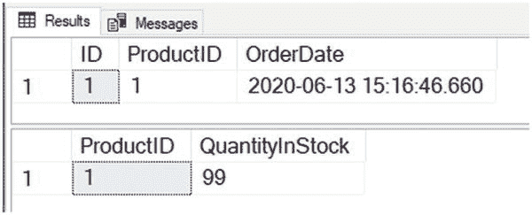

图 7-1：成功事务结果

现在，我们更改产品的库存数量并将其设置为零，因为我们要测试库存耗尽时会发生什么，然后我们尝试再次运行该事务：

```sql
UPDATE dbo.Inventory SET QuantityInStock=0 WHERE ProductID=1
```

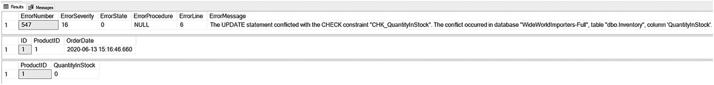

图 7-2：事务回滚结果

在这种情况下，执行 `UPDATE Inventory` 语句时将抛出错误，因为我们违反了 `QuantityInStock` 属性上的 `CHECK` 约束。控制权将从 `BEGIN TRY` 块传递到 `BEGIN CATCH` 块。在该块中，我们检索有关该会话中发生的最新错误的所有详细信息，但我们还显式调用 `ROLLBACK TRANSACTION` 以确保作为同一事务一部分对其他表所做的修改（在示例中是 `INSERT INTO Orders` 命令）不会持久化，系统状态将保持一致。


让我们看看如何使用 Python 开发一个示例应用程序来实现相同的行为。

```python
import os
import pyodbc
from decouple import config
server = config('server')
database = config('database')
username = config('username')
password = config('password')
driver= '{ODBC Driver 17 for SQL Server}'
