# Connecting to Azure SQL Database with autocommit=True
cnxn = pyodbc.connect('DRIVER='+driver+';SERVER='+server+';PORT=1433;DATABASE='+database+';UID='+username+';PWD='+ password,autocommit=True)
def prepare_database():
    try:
        # Executing database preparation tasks
        cursor = cnxn.cursor()
        cursor.execute("""IF (EXISTS (SELECT *  FROM INFORMATION_SCHEMA.TABLES
            WHERE TABLE_SCHEMA = 'dbo'
            AND  TABLE_NAME = 'Orders'))
        BEGIN
            DROP TABLE [dbo].[Orders];
        END
        IF (EXISTS (SELECT *  FROM INFORMATION_SCHEMA.TABLES
            WHERE TABLE_SCHEMA = 'dbo'
            AND  TABLE_NAME = 'Inventory'))
        BEGIN
            DROP TABLE [dbo].[Inventory];
        END
        CREATE TABLE [dbo].[Orders] (ID int PRIMARY KEY, ProductID int, OrderDate datetime);
        CREATE TABLE [dbo].[Inventory] (ProductID int PRIMARY KEY, QuantityInStock int
            CONSTRAINT CHK_QuantityInStock CHECK (QuantityInStock>-1));
        -- Fill up with some sample values
        INSERT INTO dbo.Orders VALUES (1,1,getdate());
        INSERT INTO dbo.Inventory VALUES (1,0);
        """)
    except pyodbc.DatabaseError as err:
        # Catch if there’s an error
        print("Couldn't prepare database tables")
def execute_transaction():
    try:
        # Switching to autocommit = False, our app can now control transactional behavior
        cnxn.autocommit = False
        cursor = cnxn.cursor()
        cursor.execute("INSERT INTO Orders VALUES (2,1,getdate());")
        cursor.execute("UPDATE Inventory SET QuantityInStock=QuantityInStock-1 WHERE ProductID=1")
    except pyodbc.DatabaseError as err:
        # If there’s a database error, roll back the transaction
        cnxn.rollback()
        print("Transaction rolled back: " + str(err))
    else:
        # If database commands were successful, commit the transaction
        cnxn.commit()
        print("Transaction committed!")
    finally:
        cnxn.autocommit = True
prepare_database()
execute_transaction()
Listing 7-1
在 Python 中使用事务的示例
```

在这个例子中，你可以看到 `自动提交` 属性在 Python 中使用 `pyodbc` 控制事务时扮演着多么重要的角色。我们以 `autocommit=True` 打开连接，这意味着每条命令执行后都会自动提交。在 `prepare_database()` 方法中，我们实际上是在数据库中执行一些准备工作，这些工作将作为单个事务执行。然而，在 `execute_transaction()` 方法中，我们显式地切换到 `autocommit=False`，这样我们就可以通过程序控制何时提交或回滚我们的逻辑工作单元。请记住，我们的应用逻辑是通过一个 `CHECK` 约束来强制执行的，该约束在给定产品缺货时阻止下新订单。

执行此代码示例时，你将收到此错误消息，并且由于事务被回滚，数据库表不会被修改：

```
Transaction rolled back: ('23000', '[23000] [Microsoft][ODBC Driver 17 for SQL Server][SQL Server] The UPDATE statement conflicted with the CHECK constraint "CHK_QuantityInStock". The conflict occurred in database "WideWorldImporters-Full", table "dbo.Inventory", column 'QuantityInStock'. (547) (SQLExecDirectW)')
```

在这个非常简单的例子中，我们对执行数据库操作出错时引发的异常做出反应，但还有其他场景，我们的应用逻辑需要检查数据库中给定实体的特定状态（通过查询表），然后决定是提交还是整体回滚整个工作单元。

为事务命名是一种有用的做法，可以提高代码的可读性，并且，可能更重要的是，会反映在各种与事务相关的系统视图中，简化调试过程。`BEGIN TRANSACTION [transaction_name]` 开始一个本地事务，但在进一步的诸如 `INSERT`、`UPDATE` 或 `DELETE` 等数据操作操作触发日志更新之前，实际上不会写入事务日志（尽管也可能发生其他活动，比如为保护 `SELECT` 语句的事务隔离级别而获取锁）。

应用程序或脚本可以在另一个事务已经存在的情况下开始，甚至提交或回滚一个事务。Azure SQL 并不真正提供对嵌套事务的直接支持，提交在另一个事务内打开的事务完全没有任何效果。只有外部事务才会真正控制其间在各个事务上执行的各种数据操作活动的结果，提交或回滚所有内容。作为应用程序开发人员，我们不应该使用这种方法，以避免误导性的行为和后果。

那么为什么允许嵌套事务呢？嗯，一个常见的使用场景是当你编写包含事务逻辑的存储过程时，这些过程可以单独调用，也可以从可能自身已经启动了事务的外部过程调用。一个好的做法是始终使用 `@@TRANCOUNT` 系统变量检查该连接上是否已经存在一个打开的事务，然后决定是启动一个新的事务，还是仅仅参与外部过程启动的事务，并用 `SAVE TRANSACTION savepoint_name` 标记事务内部部分的开始。

每次执行一个新的 `BEGIN TRANSACTION`，`@@TRANCOUNT` 将增加 1。同样，每次执行 `COMMIT TRANSACTION`，它将减少 1。如果是 `ROLLBACK TRANSACTION`，所有事务都将被回滚，`@@TRANCOUNT` 将被重置为零，唯一的例外是 `ROLLBACK TRANSACTION savepoint_name`，它不会以任何方式影响 `@@TRANCOUNT` 计数器。

事实上，当需要更复杂的事务逻辑时，开发人员可以在事务流中定义一个位置，以便在事务的一部分被条件性取消或回滚时返回：这通常被称为 *保存点*。如果事务回滚到一个保存点，使用 `ROLLBACK TRANSACTION savepoint_name`，那么控制流必须继续完成，可选择地根据需要执行更多的 T-SQL 语句，并使用 `COMMIT TRANSACTION` 语句来成功完成它。否则，它必须通过将事务回滚到其开始位置来完全取消。要取消整个事务，请使用 `ROLLBACK TRANSACTION transaction_name` 形式。

一个总结了所有这些概念的 T-SQL 示例如下。


```
USE AdventureWorks2012;
GO
IF EXISTS (SELECT name FROM sys.objects
WHERE name = N'SaveTranExample')
DROP PROCEDURE SaveTranExample;
GO
CREATE PROCEDURE SaveTranExample
@InputCandidateID INT
AS
-- 检测该过程是否被调用
-- 于一个活动事务中，并保存
-- 该信息供后续使用。
-- 在过程中，`@TranCounter` = 0
-- 表示没有活动事务
-- 并且过程自己启动了一个。
-- `@TranCounter` > 0 表示在
-- 过程被调用前已存在一个
-- 活动事务。
DECLARE @TranCounter INT;
SET @TranCounter = @@TRANCOUNT;
IF @TranCounter > 0
-- 过程在有一个
-- 活动事务时被调用。
-- 创建一个保存点，以便
-- 在出现错误时仅回滚
-- 过程中执行的工作。
SAVE TRANSACTION ProcedureSave;
ELSE
-- 过程必须启动自己的
-- 事务。
BEGIN TRANSACTION;
-- 修改数据库。
BEGIN TRY
DELETE HumanResources.JobCandidate
WHERE JobCandidateID = @InputCandidateID;
-- 如果没有错误则执行到这里；必须提交
-- 过程中启动的任何事务，
-- 但不提交在过程调用前启动的事务。
IF @TranCounter = 0
-- `@TranCounter` = 0 表示在过程调用前
-- 没有启动事务。
-- 过程必须提交它自己
-- 启动的事务。
COMMIT TRANSACTION;
END TRY
BEGIN CATCH
-- 发生错误；必须确定
-- 哪种回滚方式能够仅回滚
-- 过程中执行的工作。
IF @TranCounter = 0
-- 事务在过程中启动。
-- 回滚整个事务。
ROLLBACK TRANSACTION;
ELSE
-- 事务在过程调用前启动，
-- 不要回滚在过程调用前
-- 做的修改。
IF XACT_STATE() <> -1
-- 如果事务仍然有效，只需
-- 回滚到存储过程开始时
-- 设置的保存点。
ROLLBACK TRANSACTION ProcedureSave;
-- 如果事务是不可提交的，则
-- 回滚到保存点是不被允许的，
-- 因为保存点回滚会写入日志。
-- 只是返回到调用者，调用者应
-- 回滚外层事务。
-- 在适当的回滚之后，向调用者
-- 输出错误信息。
DECLARE @ErrorMessage NVARCHAR(4000);
DECLARE @ErrorSeverity INT;
DECLARE @ErrorState INT;
SELECT @ErrorMessage = ERROR_MESSAGE();
SELECT @ErrorSeverity = ERROR_SEVERITY();
SELECT @ErrorState = ERROR_STATE();
RAISERROR (@ErrorMessage, -- 消息文本。
@ErrorSeverity, -- 严重性。
@ErrorState -- 状态。
);
END CATCH
GO
```

## 清单 7-2
### 在 T-SQL 脚本中使用事务的示例

此处的逻辑是在修改数据库之前检查是否已存在一个事务。如果是这样，则首先创建一个保存点，如果数据修改失败，则仅回滚到该保存点，而不涉及在外层事务中执行的任何先前活动。

并非所有数据库驱动程序都提供对事务名称或保存点的直接控制：例如，`pyodbc` 没有提供调用事务开始（无论是否有名称）或保存点的方法，但您始终可以通过简单地执行等效的 T-SQL 语句来访问这些功能。

在其他语言如 C# 和 .NET Core 中，您可以控制事务逻辑的所有方面，如下例所示。

```csharp
using (SqlConnection connection = new SqlConnection(connectionString))
{
    connection.Open();
    SqlCommand command = connection.CreateCommand();
    SqlTransaction transaction;

    // 启动一个本地事务。
    transaction = connection.BeginTransaction("SampleTransaction");

    // 必须将事务对象和连接
    // 都分配给 Command 对象以用于挂起的本地事务
    command.Connection = connection;
    command.Transaction = transaction;

    try
    {
        command.CommandText =
            "Insert into Region (RegionID, RegionDescription) VALUES (100, 'Description')";
        command.ExecuteNonQuery();
        transaction.Save("FirstRegionInserted");

        command.CommandText =
            "Insert into Region (RegionID, RegionDescription) VALUES (101, 'Description')";
        command.ExecuteNonQuery();

        // 回滚到保存点
        transaction.Rollback("FirstRegionInserted");
        // 只有第一次插入会被考虑

        // 尝试提交事务。
        transaction.Commit();
        Console.WriteLine("Only first insert is written to database.");
    }
    catch (Exception ex)
    {
        Console.WriteLine("Commit Exception Type: {0}", ex.GetType());
        Console.WriteLine("  Message: {0}", ex.Message);

        // 尝试回滚事务。
        try
        {
            transaction.Rollback("SampleTransaction");
        }
        catch (Exception ex2)
        {
            // 此 catch 块将处理服务器上可能发生的
            // 任何会导致回滚失败的错误，例如
            // 连接关闭。
            Console.WriteLine("Rollback Exception Type: {0}", ex2.GetType());
            Console.WriteLine("  Message: {0}", ex2.Message);
        }
    }
}
```

## 清单 7-3
### 在 .NET Core 应用中使用事务的示例

Azure SQL 提供了多个动态管理视图（DMV）来监控在给定数据库实例中运行的事务。它们以 `sys.dm_tran_*` 前缀开头。以下示例返回有关数据库级别打开的事务的详细信息：

```sql
SELECT * FROM sys.dm_tran_database_transactions WHERE database_id = db_id()
```


## 跨云数据库的分布式事务

传统上，关系数据库管理系统一直支持跨多个数据库乃至多个服务器的事务，通常称为**分布式事务**。这些功能通过特定组件实现，例如分布式事务协调器和监视器（如 Microsoft 分布式事务协调器，或 `MS DTC`），以及两阶段提交协议（如 `XA`）。一般来说，这些底层技术是为在传统数据中心环境中运行而设计的，具有低延迟、紧密耦合的本地连接以及特定的硬件配置。然而，在高度分布式和标准化的云环境中，设计模式已经演进，以消除对这些传统方法的依赖，转而采用更解耦、异步的模式，如 `Saga`，这些模式通常在数据库层之外进行管理。

截至撰写本文时，`MS DTC` 仅在 `Azure SQL 托管实例`中受支持，您可以充分利用其功能。但如果您需要在 `Azure SQL 数据库`中获得分布式事务支持怎么办？您会很高兴地了解到，通过 `弹性事务`，仍然可以跨多个 `Azure SQL 数据库`实例实现分布式事务，该功能适用于基于 `.NET`的应用程序。

通过这种方法，`Azure SQL 数据库`将有效地代表 `MS DTC` 协调分布式事务，应用程序可以连接到多个实例，并通过 `System.Transaction` 类来控制执行事务，其强制性要求是 `.NET 4.6.1` 或更高版本，但遗憾的是，在撰写本文时，`.NET Core` 尚不支持此功能。下图展示了各个组件如何交互以支持此场景。

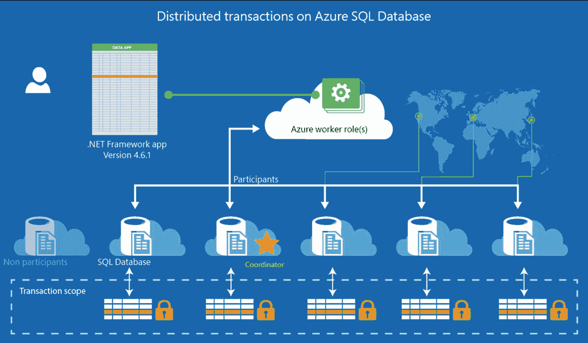

图 7-3 Azure SQL 数据库上的分布式事务

让我们通过一个简单的例子来看看如何在应用程序中实现这一点：

```csharp
using (var scope = new TransactionScope())
{
    using (var conn1 = new SqlConnection(connStrDb1))
    {
        conn1.Open();
        SqlCommand cmd1 = conn1.CreateCommand();
        cmd1.CommandText = string.Format("insert into T1 values(1)");
        cmd1.ExecuteNonQuery();
    }
    using (var conn2 = new SqlConnection(connStrDb2))
    {
        conn2.Open();
        var cmd2 = conn2.CreateCommand();
        cmd2.CommandText = string.Format("insert into T2 values(2)");
        cmd2.ExecuteNonQuery();
    }
    scope.Complete();
}
```

如您所见，用法非常直接：`TransactionScope` 通过建立一个环境事务（环境事务是指存在于当前线程中的事务）来完成所有繁重的工作，所有在该范围内打开的连接都将参与该事务。如果这些连接指向多个数据库，则该事务会自动升级为分布式事务。当范围完成时，事务将提交。

`弹性事务`也可以涉及属于多个逻辑服务器的数据库，但为了启用此功能，需要首先通过调用 `PowerShell` 命令 `New-AzSqlServerCommunicationLink` 将这些服务器建立为互信通信关系。

我们可以使用与本地事务相同的 `DMV`（动态管理视图）来监控分布式事务的状态（例如，`SELECT * FROM sys.dm_tran_active_transactions`），但对于分布式事务，`UOW`（工作单元）列将标识属于同一分布式事务的不同子事务。同一分布式事务内的所有事务都具有相同的 `UOW` 值。

## 锁定与非锁定选项

数据库引擎通常是多用户系统，特定用户执行的操作可能会影响也可能不会影响并发使用的其他用户正在使用的表和行。通过为单个事务命令指定隔离级别，或将其设置为会话或数据库中所有会话的默认值，我们可以定义一个事务必须与其他事务对资源或数据的修改隔离的程度。隔离级别定义了哪些并发副作用是被允许的，例如脏读（读取被另一个尚未提交的运行中事务修改的行的数据）或幻读（另一个事务在正在读取的记录中添加或删除了行）。它们控制诸如读取数据时是否加锁、请求何种类型的锁以及读取锁保持多长时间等事项。如果不使用锁来提供一致性，隔离级别则帮助引擎理解何时可以删除同一行的不同版本，因为没有其他事务在使用它。当读取操作引用被另一个事务修改的行时，隔离级别定义了它们是被阻塞直到该行上的排他锁被释放，还是在不使用锁的情况下，定义应检索在语句或事务开始时存在的该行的哪个已提交版本；如果隔离级别设置得足够低，您甚至可以读取未提交的数据。虽然这是被允许的，但您几乎永远不应该使用此功能。读取未提交的数据意味着您正在读取一些可能被回滚的内容；这意味着您的应用程序可能会开始基于这些数据执行操作，而这些数据可能是由于输入错误等原因而被撤销的。

一个需要理解的重要概念是，更改事务隔离级别并不会影响为保护数据修改而获取锁的方式。无论为该事务设置了何种隔离级别，事务总是对任何修改的数据获取排他锁，并在事务完成前一直持有该锁。锁不仅是一种同步机制，而且携带元数据，这对于数据库引擎在需要时了解情况非常有用。可以改变的是锁的使用方式。幸运的是，我们不必深入繁琐的细节，因为我们能够以一致性和并发性为考量，表达我们期望的行为，而 `Azure SQL` 会为我们使用正确的锁。

对于读取操作，隔离级别定义了免受其他事务修改影响的保护级别。较低的隔离级别提高了更多并发访问数据的能力，但增加了潜在的并发问题，如脏读和数据不一致。较高的隔离级别提高了数据一致性，但通过使用锁（这也会消耗系统资源，即内存）增加了阻塞其他事务的可能性。应用程序逻辑和需求将决定哪个隔离级别更为合适。


# Azure SQL 事务隔离级别与并发控制

## 标准隔离级别

| **隔离级别** | **定义** |
| --- | --- |
| 读取未提交 | 最低的隔离级别；允许脏读。一个事务可能看到其他事务尚未提交的更改。 |
| 读取已提交 | 一个事务可以访问由其他事务创建或修改并提交的数据。如果数据被修改，Azure SQL 会保留写入锁（在选定数据上获取），直到事务结束。读取锁在执行 `SELECT` 操作后即释放。 |
| 可重复读 | Azure SQL 会在选定数据上保留读取锁和写入锁，直到事务结束。不管理范围锁，因此可能出现幻读。范围锁用于保护范围内所有待修改的数据，包括由 `INSERT` 或 `DELETE` 语句进行的修改。 |
| 可序列化 | 最高级别，事务彼此完全隔离。Azure SQL 在选定数据上保留读取锁和写入锁，并在事务结束时释放。当 `SELECT` 操作使用带范围的 `WHERE` 子句时，会获取范围锁，特别是为了避免幻读。 |

除了这些作为 ISO 标准定义给所有数据库管理系统的隔离级别外，Azure SQL 还支持两个使用行版本控制的附加事务隔离级别。

## 行版本控制隔离级别

| **行版本控制隔离级别** | **定义** |
| --- | --- |
| 读取已提交快照 (RCSI) | 在 Azure SQL Database 中，这是新创建数据库的默认隔离级别，`读取已提交` 隔离使用行版本控制来提供*语句级*读取一致性。读取操作只需要 SCH-S（共享架构锁，仅用于防止在读取表时更改表架构），而不需要页锁或行锁。Azure SQL 使用行版本控制，为每个语句提供该语句开始时存在的数据的一致性事务快照。不使用锁来保护数据免受其他事务的更新。使用此隔离级别，写入者和读取者不会相互阻塞。 |
| 快照 | 快照隔离级别使用行版本控制来提供*事务级*读取一致性。读取操作不获取页锁或行锁；仅获取 SCH-S 表锁。当读取由另一事务修改的行时，它们检索该事务开始时存在的行版本。只有在 `ALLOW_SNAPSHOT_ISOLATION` 数据库选项设置为 ON 时，才能对数据库使用快照隔离，这在 Azure SQL 中是默认设置。 |

## 术语澄清：锁

在深入之前，让我们澄清一下刚才使用的一些术语，特别是关于锁的部分。

一个共享架构锁 (`SCH-S`) 用于确保在您使用表时没有人可以更改表定义。在高度并发的系统中，可能发生有人试图在您运行 `SELECT` 时 `DROP` 或 `ALTER` 一个表。Azure SQL 会通过放置一个 `SCH-S` 锁来保护您的 `SELECT`，这样那些想要更改架构的命令就必须等到您的 `SELECT` 完成。

一个范围锁用于保护正在运行的事务免受尚不存在的数据的影响，如果允许这些数据被创建，可能会干扰正在运行的事务。

## 锁管理机制

Azure SQL 引擎通过请求数据上的锁来管理多个用户针对数据库执行事务的并发性。锁具有不同的模式，例如共享或独占。锁模式定义了事务对数据的依赖程度。如果锁类型会与已授予给另一事务的同类锁冲突，则无法为事务授予该锁。如果事务请求的锁类型与同一数据上已授予的锁冲突，Azure SQL 将暂停请求事务，直到第一个锁释放。当事务修改数据时，它会持有保护该修改的锁直到事务结束。事务持有锁以保护读取操作的时间长短取决于事务隔离级别的设置。事务持有的所有锁都会在事务完成时（无论是提交还是回滚）释放。

应用程序通常不直接请求锁；相反，锁由 Azure SQL 引擎的一个内部部分管理，称为锁管理器。在处理 Transact-SQL 语句时，Azure SQL 会确定要访问的资源。查询处理器根据访问类型和事务隔离级别的设置，确定保护每个资源所需的锁类型。然后，查询处理器向锁管理器（Azure SQL 引擎内的一个子系统）请求适当的锁。如果没有其他事务持有冲突的锁，锁管理器就会授予这些锁。

## 多粒度锁

Azure SQL 具有多粒度锁，允许事务锁定不同类型的资源。为了最小化锁的成本（锁结构保存在内存中），Azure SQL 锁资源会自动以适合任务的级别工作。在较小的粒度（如行）上锁定会增加并发性，但如果锁定了许多行，则必须持有更多锁，因此开销较高。在较大的粒度（如表）上锁定在并发性方面代价高昂，因为锁定整个表会限制其他事务访问表的任何部分。然而，它的开销较低，因为维护的锁更少。Azure SQL 根据需要锁定的数据量自动选择最佳锁粒度，试图在资源成本和并发影响之间取得平衡。

Azure SQL 通常必须在多个粒度级别获取锁才能完全保护资源。这组位于多个粒度级别的锁称为锁层次结构。例如，为了完全保护对索引的读取，Azure SQL 实例可能必须在行上获取共享锁，并在页和表上获取意向共享锁。意向锁用于指示将来可能在该资源上获取锁。此信息有助于锁管理器避免未来的冲突。

## 开发者控制与参考

如您所见，事务和锁管理是相当复杂的主题。关于锁在内部如何工作，以及不同的锁类型和级别如何影响底层数据的并发性的更多见解，可以在 Azure 文档的“事务锁定和行版本控制指南”中找到：`https://aka.ms/sstlarv`。

作为开发人员，我们可以通过特定的 T-SQL 语句和客户端驱动程序 API（如 `Microsoft.Data.SqlClient` 或 SQL Server JDBC Driver）来控制我们的应用程序如何处理不同的隔离级别和并发性。

在 T-SQL 脚本或存储过程中，您可以使用 `SET TRANSACTION ISOLATION LEVEL isolation_level` 来控制该连接上后续所有语句的锁定和行版本控制行为：

```sql
SET TRANSACTION ISOLATION LEVEL REPEATABLE READ;
GO
BEGIN TRANSACTION;
GO
SELECT * FROM HumanResources.EmployeePayHistory;
GO
SELECT * FROM HumanResources.Department;
GO
COMMIT TRANSACTION;
GO
```


不同的客户端驱动程序 API 在处理事务时的隔离级别管理方面，提供了略有不同的行为和语义。第一个例子与 Microsoft.Data.SqlClient 驱动相关，你可以在调用 `BeginTransaction()` 方法时指定隔离级别：

```
// Start a local transaction.
transaction = connection.BeginTransaction(
IsolationLevel.ReadCommitted, "SampleTransaction");
```

而在 Microsoft SQL Server JDBC 驱动中，你通过 `Connection` 类的 `setTransactionIsolation()` 方法来指定隔离级别：

```
con.setTransactionIsolation(Connection.TRANSACTION_READ_COMMITTED);
```

除了驱动程序 API 和连接级别的隔离设置，`表提示` 也可以在数据操作语言 (DML) 语句执行期间覆盖 Azure SQL 引擎的默认行为，并通过指定锁定方法让你控制诸如锁类型、粒度等事项。例如，使用 `HOLDLOCK` 类型（或其等效项 `SERIALIZABLE`）的表提示会使共享锁更具限制性，将其保持到事务完成，而不是在所需的表或数据页不再需要时立即释放共享锁。`ROWLOCK` 指定在通常获取页锁或表锁时获取行锁（与 `TABLOCK` 或 `PAGLOCK` 相对）。

表提示在 DML 语句的 `FROM` 子句中指定，并且仅影响该子句中引用的表或视图；以下是如何使用它们的示例：

```
FROM t (ROWLOCK, XLOCK)
```

请注意，并非所有提示都与所有类型的 DML 命令兼容，要获取有关这个有趣主题的所有详细信息，你可以访问官方产品文档中的此链接：[`https://aka.ms/uathaaqh`](https://aka.ms/uathaaqh)。

注意

运行缓慢或长时间运行的查询可能导致资源过度消耗，并可能是查询被阻塞的结果。阻塞的原因可能是糟糕的应用程序设计、不良的查询计划、缺少有用的索引等等。你可以使用 `sys.dm_tran_locks` 动态管理视图来获取有关数据库中当前锁活动的信息。

正如我们提到的，Azure SQL 的默认隔离级别是**已提交读快照隔离 (RCSI)**，这在并发性和数据完整性之间提供了最佳权衡，在大多数场景下让读者和写者不会相互阻塞。作为最佳实践，你应将其他事务隔离级别或语句级表提示的使用限制在非常特定的、需要特定行为的用例中。在所有其他情况下，默认设置即可完美工作。同时，请放心，如果你需要深入细节，甚至微调单个语句，这也是可以做到的。这种令人惊叹的灵活性在数据库云市场中是独一无二的！

## 原生编译存储过程

原生编译存储过程是编译为机器代码的 T-SQL 存储过程，而不是像常规存储过程那样由查询执行引擎解释执行。它们与 Azure SQL 中的内存优化表协同工作，为应用程序中性能关键部分频繁执行的查询提供极快的响应时间。使用原生编译存储过程带来的性能优势随着过程处理的行数和逻辑量的增加而提升，并且在执行聚合操作、对大量行的嵌套循环连接、多语句的 select、insert、update 和 delete 操作，或复杂的程序逻辑（如条件语句和循环）时效果最佳。

当我们使用传统的解释型 Transact-SQL 语句访问内存优化表时，查询处理流水线看起来与基于磁盘的表非常相似，除了行不是从传统的缓冲池检索，而是从内存引擎中检索：

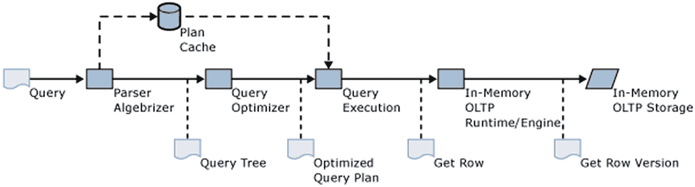

当使用原生编译存储过程时，过程被分成两部分。首先，解析器、代数器和优化器为存储过程中的所有查询创建优化的查询执行计划，然后存储过程被编译为原生代码并存储在 .dll 文件中：

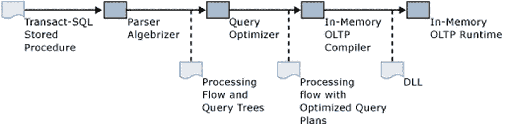

当调用存储过程时，内存优化 OLTP 运行时定位到该存储过程的 DLL 入口点，执行 DLL 中的机器代码，并将结果返回给客户端：

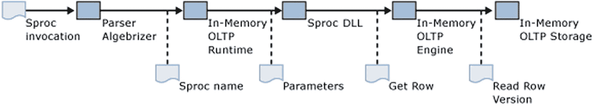

创建原生编译存储过程的语法非常简单，如下例所示（该示例测试了在充当键值存储缓存的表上执行 100,000 次 GET + PUT 操作的速度）：

```
create or alter procedure cache.[Test]
with native_compilation, schemabinding
as
begin atomic with (transaction isolation level = snapshot, language = N'us_english')
declare @i int = 0;
while (@i < 100000)
begin
declare @r int = cast(rand() * 10000 as int)
declare @v nvarchar(max) = (select top(1) [value] from dbo.[MemoryStore] where [key]=@r);
if (@v is not null) begin
declare @c int = cast(json_value(@v, '$.counter') as int) + 1;
update dbo.[MemoryStore] set [value] = json_modify(@v, '$.counter', @c) where [key] = @r
end else begin
declare @value nvarchar(max) = '{"value": "' + cast(sysdatetime() as nvarchar(max)) + '", "counter": 1}'
insert into dbo.[MemoryStore] values (@r, @value)
end
set @i += 1;
end
end
go
```

一旦创建，这个存储过程可以像任何其他存储过程一样被我们的应用程序调用：

```
EXEC cache.[Test];
```

原生编译存储过程内部支持的操作符有一些限制。例如，语法 `SELECT * FROM table` 不受支持，你需要指定完整的列列表。有关这些细节的更多信息，你可以查看产品文档：[`https://aka.ms/ncsp`](https://aka.ms/ncsp)。

注意

作为最佳实践，你不应考虑对点查找这类查询模式使用原生编译存储过程。事实上，如果你只需要处理单行数据，使用原生编译存储过程可能不会比传统的解释型存储过程带来性能优势。

## 优化数据库往返次数

减少应用程序层与数据库层之间的往返次数，可能是在设计或排查使用 Azure SQL 的应用程序时可以考虑的**最重要的优化措施**。只要你的应用程序逻辑允许，将操作**批处理**到 Azure SQL 数据库和 Azure SQL 托管实例可以显著提高应用程序的性能和可伸缩性。将调用批处理到远程服务是提高性能和可伸缩性的众所周知策略。与远程服务的任何交互都有固定的处理成本，例如序列化、网络传输和反序列化。将许多单独的事务打包成一个批次可以最小化这些成本。

Azure SQL 的多租户特性意味着数据访问层的效率与数据库的整体可伸缩性相关。为响应超过预定义配额的使用情况，Azure SQL 可能会降低吞吐量或以限流异常进行响应。像批处理这样的效率提升手段，可以让你在达到这些限制之前做更多的工作。

我们可以采用几种批处理技术来使我们的应用程序更高效，这些技术适用于大多数编程语言和框架。让我们从你应该考虑的各种批处理策略开始，详细阐述这些技术。


### 利用事务

在讨论批处理时，以事务作为开头似乎有些奇怪。但使用客户端事务具有一种微妙的服务器端批处理效果，能提升性能。而且添加事务只需几行代码，因此它们提供了一种快速提升顺序操作性能的方法。

将作为隐式事务执行的单个调用，转变为将多个调用包装在一个事务中，可以有效地延迟对事务日志的写入，直到事务提交，从而降低了 Azure SQL 引擎与事务日志存储之间延迟的影响。

根据具体的表结构和要包装在事务中的操作数量，此技术可为数据修改任务提供高达 10 倍的性能提升。

### 表值参数

表值参数支持在 Transact-SQL 语句、存储过程和函数中使用用户定义的表类型作为参数。这种客户端批处理技术允许您在表值参数内发送多行数据。要使用表值参数，首先需要定义一个表类型。以下 Transact-SQL 语句创建了一个名为 `MyTableType` 的表类型：

```
CREATE TYPE MyTableType AS TABLE (
mytext NVARCHAR(MAX),
num INT
);
```

在应用程序代码中，您可以创建一个与表类型结构完全相同的内存数据结构，并将此数据结构作为参数传递给文本查询或存储过程调用。以下示例展示了此技术在 .NET Core 应用程序中的实现：

```
using (SqlConnection connection = new SqlConnection(connString))
{
    connection.Open();
    DataTable table = new DataTable();
    // 添加列和行。以下是一个简单示例。
    table.Columns.Add("mytext", typeof(string));
    table.Columns.Add("num", typeof(int));
    for (var i = 0; i < 10; i++)
    {
        table.Rows.Add(DateTime.Now.ToString(),
                       DateTime.Now.Millisecond);
    }
    SqlCommand cmd = new SqlCommand(
        "INSERT INTO MyTable(mytext, num) SELECT mytext, num FROM @TestTvp", connection);
    cmd.Parameters.Add(
        new SqlParameter()
        {
            ParameterName = "@TestTvp",
            SqlDbType = SqlDbType.Structured,
            TypeName = "MyTableType",
            Value = table,
        });
    cmd.ExecuteNonQuery();
}
```

为了进一步改进上面的示例，可以使用存储过程代替基于文本的命令。以下 Transact-SQL 命令创建了一个接受 `SimpleTestTableType` 表值参数的存储过程：

```
CREATE PROCEDURE [dbo].[sp_InsertRows]
    @TestTvp as MyTableType READONLY
AS
BEGIN
    INSERT INTO MyTable(mytext, num)
    SELECT mytext, num FROM @TestTvp
END
GO
```

然后，我们只需修改前面示例中的几行代码来调用该存储过程：

```
SqlCommand cmd = new SqlCommand("sp_InsertRows", connection);
cmd.CommandType = CommandType.StoredProcedure;
```

在大多数情况下，表值参数的性能与其他批处理技术相当或更优。表值参数通常更受青睐，因为它们比其他选项更灵活。使用表值参数，您可以在存储过程中使用逻辑来确定哪些行是更新，哪些是插入。表类型也可以修改以包含一个“操作”列，用于指示指定行应进行插入、更新还是删除。

对于更复杂的应用场景，使用表值参数可以在整体性能和简化实现方面带来巨大收益，您可以参考此产品文档链接：[`https://aka.ms/piubbs`](https://aka.ms/piubbs)。

### 批量复制

Azure SQL 为从应用程序向表中大批量加载记录提供了专门的支持。这种支持从 TDS 纵向协议延伸到许多客户端驱动程序（例如 `SqlClient`、`JDBC` 或 `ODBC`）中可用的各种 API。

例如，.NET 应用程序可以使用 `SqlBulkCopy` 类来执行批量插入操作。`SqlBulkCopy` 在功能上类似于命令行工具 `Bcp.exe` 或 Transact-SQL 语句 `BULK INSERT`。以下代码示例展示了如何将源 `DataTable`（由 `table` 变量表示）中的行批量复制到目标表 `MyTable`：

```
using (SqlConnection connection = new SqlConnection(connString))
{
    connection.Open();
    using (SqlBulkCopy bulkCopy = new SqlBulkCopy(connection))
    {
        bulkCopy.DestinationTableName = "MyTable";
        bulkCopy.ColumnMappings.Add("mytext", "mytext");
        bulkCopy.ColumnMappings.Add("num", "num");
        bulkCopy.WriteToServer(table);
    }
}
```

您可能现在想知道应该在什么时候使用表值参数，什么时候使用批量复制 API 更合适。使用表值参数与其他使用基于集合的变量的方式相当；然而，对于大型数据集，频繁使用表值参数可能更快。与启动成本高于表值参数的批量操作相比，表值参数在插入多达几千行时表现良好。如果您要批处理的是 10000 行或更多数据，那么批量复制无疑将是向 Azure SQL 加载数据最高效的方式。

### 多行参数化 INSERT 语句

对于小批量操作，另一种选择是构建一个插入多行的大型参数化 `INSERT` 语句。T-SQL 语言通过以下语法直接支持此用例：

```
INSERT INTO [MyTable] ( mytext, num ) VALUES (@p1, @p2), (@p3, @p4), (@p5, @p6), (@p7, @p8), (@p9, @p10)
```

然后，从您选择的编程语言出发，您可以使用特定驱动程序的 API 来利用这些功能。例如，您可以看一下这段 Python 代码片段：

```
params = [ ('A', 1), ('B', 2) ]
cursor.fast_executemany = True
cursor.executemany("insert into t(name, id) values (?, ?)", params)
```

基本上，通过将 `fast_executemany` 游标属性设置为 `True`，`pyodbc` 驱动程序会将多个参数元组打包成一个批次，从而显著减少应用程序代码与后端数据库之间的往返次数。

更高级别的框架，如 `EntityFramework` `Core` 或 `SQLAlchemy`，正在利用底层客户端驱动程序的能力，并提供等效的批处理选项。始终建议检查您自己使用的编程语言和框架组合是否支持这些功能。


### 建议与最佳实践

理解批处理/缓冲与弹性之间的权衡非常重要。如果数据库操作失败，丢失一批未处理的关键业务数据的风险可能超过批处理的性能优势。因此，在采用批处理时，实现前几章介绍的适当重试逻辑技术就更为重要。

如果选择单一的批处理技术，`表值参数`能提供最佳的性能和灵活性。要获得最快的插入性能，请遵循以下通用准则，但务必在你的场景中进行测试：

*   对于少于 100 行，使用单参数化的 `INSERT` 命令。
*   对于少于 1000 行，使用`表值参数`。
*   对于大于等于 1000–2000 行，在 .NET 中使用 `SqlBulkCopy`，或在其他语言中使用等效的批量复制技术（例如 Java 中的 `SQLServerBulkCopy`）。

对于更新和删除操作，请将`表值参数`与`存储过程`逻辑结合使用，该逻辑用于确定对表参数中每一行执行的正确操作。使用对你的应用程序和业务需求来说合理的大批次大小。

测试最大的批次大小，以验证 `Azure SQL` 不会拒绝它。创建用于控制批处理的配置设置，例如批次大小或缓冲时间窗口。这些设置提供了灵活性：你可以在生产环境中更改批处理行为，而无需重新部署云服务。

避免并行执行在单个数据库的单个表上操作的批次。如果确实选择将单个批次分配给多个工作线程，请运行测试以确定理想的线程数量。这个数量取决于几个因素，包括每个服务层级和计算大小的日志生成速率限制、对目标表上的数据和索引页的锁定影响等。最终效果是，更多的线程实际上可能会降低性能而不是提高它，因此测试你自己的工作负载并可能调整线程数量非常重要。

## 如果你想了解更多

管理数据一致性是一项艰巨的任务。在并发和大规模场景下执行此任务则更具挑战性。正如本章引言所述，几乎所有最常用的数据库都提供对事务的支持并非偶然。在应用程序代码中管理一切将非常困难且效率低下。如今，关于可扩展性与一致性的争论几乎已不复存在。这要归功于新型的云原生架构，例如用于构建 `Azure SQL DB Hyperscale` 的架构，让你可以两者兼得。`Azure SQL Hyperscale` 数据库背后的技术令人惊叹。如果你想了解更多，以下列表将为你提供一个起点：

*   工作单元 – [`https://martinfowler.com/eaaCatalog/unitOfWork.html`](https://martinfowler.com/eaaCatalog/unitOfWork.html)
*   Spanner：成为一个 SQL 系统 – Google Research – [`https://static.googleusercontent.com/media/research.google.com/en//pubs/archive/46103.pdf`](https://static.googleusercontent.com/media/research.google.com/en//pubs/archive/46103.pdf)
*   Socrates：云端的全新 SQL Server – [`www.microsoft.com/research/publication/socrates-the-new-sql-server-in-the-cloud/`](http://www.microsoft.com/research/publication/socrates-the-new-sql-server-in-the-cloud/)
*   SQL 正在击败 NoSQL 吗？ – [`https://dzone.com/articles/is-sql-beating-nosql`](https://dzone.com/articles/is-sql-beating-nosql)
*   微服务的 6 种数据管理模式 – [`http://progressivecoder.com/6-data-management-patterns-for-microservices/`](http://progressivecoder.com/6-data-management-patterns-for-microservices/)
*   事务锁定与行版本控制指南 – [`https://docs.microsoft.com/sql/relational-databases/sql-server-transaction-locking-and-row-versioning-guide`](https://docs.microsoft.com/en-us/sql/relational-databases/sql-server-transaction-locking-and-row-versioning-guide)
*   如何使用批处理提升 Azure SQL 数据库和 Azure SQL 托管实例的应用程序性能 – [`https://docs.microsoft.com/azure/azure-sql/performance-improve-use-batching`](https://docs.microsoft.com/azure/azure-sql/performance-improve-use-batching)

# 8. 多模型能力

`Azure SQL` 并非一个传统的关系型数据库平台。每个现代数据库都必须使你能够使用各种数据格式来应对不同场景。尽管传统的规范化关系型格式经过实战检验，并被证明是适用于广泛不同场景的优化技术，但在某些情况下，你可能会发现其他格式可能更适合你正在解决的问题。

一个常见的例子是反规范化。传统上，你将领域对象表示为一组表，采用前几章所述的所谓*范式*形式。这是一种众所周知的数据库设计技术，其中每个复杂的领域结构，如列表或数组，都被放置在一个单独的表中。规范化模型对于高度并发的工作负载是优化的，在这种情况下，许多线程同时更新和读取领域对象的不同部分，而不影响正在更新其他部分的线程。然而，如果你的工作负载中，一个线程一次只访问一个对象，那么高度规范化的数据库可能会迫使你连接大量表来从物理部分重建领域对象。在这种情况下，你可以考虑将对象序列化为一个单一单元，而不是对其进行分解。

`Azure SQL` 使你能够在同一个物理数据模型中同时使用关系型和非关系型结构。

能够处理关系型、结构化或几种类型的半结构化格式，将 `Azure SQL` 归类为多模型数据库。如果你访问 [`https://db-engines.com/en/ranking`](https://db-engines.com/en/ranking) 这个为数据库流行度评分的网站，你可能会注意到所有排名靠前的关系型数据库也被归类为多模型数据库，因为支持各种数据格式是所有现代数据库系统的必备要求。


## 在数据库设计中利用多模型能力

在我们深入探讨 Azure SQL 的多模型能力之前，让我们先看看何时应该在应用程序中使用它们。一些软件工程师喜欢 NoSQL 概念，因为它们使数据库更易于使用，并且（显然）不需要前期进行大量设计，因此你可以立即开始使用它，而无需付出太多努力，也不需要表之间复杂的连接。另一些人则偏爱关系模型，因为它经过实战检验，并保证无论复杂度如何，你都可以对任何领域进行建模。作为一个成熟的软件工程师，你不应该基于某些武断的偏好来做教条式的架构决策。在关系型和非关系型模型之间或其组合的选择，应该基于你应用程序的领域模型。

如果你使用类似领域驱动开发（DDD）的方法，你可能会在你的领域中识别聚合（Aggregates）。DDD 中的聚合对象是你领域模型中的核心实体，它们代表了数据的主要访问点，并引用其他实体和值对象。例如，`Customer` 可能是你在销售管理模块中使用的主要实体。这个实体有一些值对象，并引用了其他实体，如 `Order` 或 `Invoice`。如果你知道客户端代码将通过 `Customer` 对象访问客户订单和发票，那么 `Customer` 就是一个聚合，它绑定属于它的其他实体，并为引用其中任何实体的任何外部组件提供主要的访问点。

```
注意！

不要将 DDD 中的聚合（Aggregates）与 SQL 术语中的聚合函数（SUM、AVG、MAX）混淆。
```

教条式的 NoSQL 方法是将整个 `Customer` 聚合及其所有相关实体（`Orders`、`Invoices`）序列化为一个包含应用程序层所需一切的大型集合。这对于可以通过单次数据访问操作获取所有必要数据的应用程序来说是完美的选择。教条式的关系方法则是将每个实体分解成一个独立的高度规范化的表，以便应用程序中的不同服务只能访问它们所需的最小信息集。这对于高度并发的应用程序来说是完美的选择，不同的线程同时访问和修改实体或聚合的不同部分。

教条式决策的缺点在于，在这两种情况下，人们都是假设访问模式，而不是分析业务领域中的使用模式。正确的方法是分析将使用的数据访问模式，并为领域选择最合适的方案。以下是一些可能影响你数据设计决策的数据访问模式示例：

*   如果你有一个庞大而复杂的表单，在获取 `Customer` 根聚合后需要预加载 `Order` 和 `Invoice` 实体，并且在表单上保存数据后需要更新 `Customer`、`Invoice` 和 `Order` 实体中的信息，那么将相关实体存储为非规范化集合是合理的。这样，你可以通过单次数据访问读取和持久化所有数据，并避免收集数据的复杂连接以及跨越多个表的事务。
*   如果你知道应用程序中的不同表单和服务可能会同时更新属于同一 `Customer` 聚合的 `Invoice` 或 `Order` 实体，或者你经常使用延迟加载技术，那么将实体拆分到单独的表中是合理的。这样，你可以实现细粒度的服务，只写入和读取所需的对象。将实体拆分到单独的表中提高了系统的并发性，因为不同的事务可以操作实体的不同部分而不会相互阻塞。否则，它们将被同步，并可能相互阻塞。

应用程序的访问模式是指导你决定使用规范化或非规范化模型的关键因素。

### 领域模型的分类

对服务行为的分析和数据访问模式的识别将使你能够确定领域模型的最佳存储设计。根据应用程序中的数据访问模式，你可以将数据模型分类为：

*   `高度规范化的关系模型`，其中实体之间存在依赖关系和关系（如 UML 图中的类）。该模型对于高度并发的应用程序和服务更新或加载实体的不同部分来说是完美的选择。
*   `图模型`是一种特殊类型的模型，其中节点通过边相互连接，形成逻辑图结构。这种结构对于经常断开或建立实体间边界，并通过关系遍历以查找最佳路径或进行“朋友的朋友”类型分析的服务来说是完美的选择。
*   `非关系型数据`，其中信息被自包含在孤立的、彼此之间关系非常弱或不存在的数据实体中。这种结构对于将领域对象作为一个单一单元进行读取和保存的服务来说是完美的选择。

### 根据数据实体的结构，你的模型可以分类为：

*   `结构化`，所有数据实体都具有统一或固定的模式。这些类型的实体可以轻松地可视化为 Excel 表中的行和列，或序列化为 CSV 格式。
*   `半结构化`，数据实体具有一些结构，但并非总是严格或统一的。数据实体具有一些在所有实体中重复的共同属性，以及一些变化的属性。想象一个在不同实体中具有不同键的键值集合，或者一个具有缺失值和子对象的分层组织文档。这些对象通常序列化为 JSON 格式。
*   `非结构化`数据，其中数据实体之间的模式差异很大，很难找到共同的结构。典型的例子可以是文本文档、图像或视频——存在一种定义良好的格式使你能够读取信息，但图像中信息的组合使它们彼此差异很大。

Azure SQL 是关系型结构化数据的最佳选择，也是关系型半结构化数据的良好选择。SQL 语言的查询功能使你能够对大量结构化和半结构化数据应用相同的处理规则，并轻松遍历外键和边关系。

没有关系的结构化信息可能更高效地存储为 CSV 或 Excel 文件，特别是如果你需要在 Azure Data Lake 或 Azure Blob Storage 上存储大量数据时。这并不意味着你失去了查询能力，因为 Azure SQL 仍然使你能够轻松地从外部存储加载这些文件，并将它们查询为数据库中的行。与其他实体无关的半结构化和自包含文档可能更高效地存储在专门的文档数据库中，例如 Azure Cosmos DB。Azure Cosmos DB 提供了许多专门用于查询和索引自包含文档的功能，如果你不需要交叉关联实体或实现某些复杂报告，你可以加以利用。

## 为何要为非关系型模型选择 Azure SQL？

Azure SQL 是一个多模型数据库，它使您能够结合不同的关系型和非关系型模型，为您的场景找到最合适的方案。

与传统的关系型和 NoSQL 数据库不同，后者需要您预先决定要使用哪种物理模型，而 Azure SQL 使您能够结合这些关系型和非关系型概念，找到最适合您需求的模型。

Azure SQL 中多模型支持的一个关键优势是数据模型并非互斥。Azure SQL 使您能够无缝结合多个模型，并充分利用所有模型的优点。您可以创建一个经典的关系模型，其中某些列包含 JSON 或空间数据，将某些表声明为图节点并通过边连接它们，将 JSON 列置于内存优化表中以利用其速度和无锁行为。多模型功能可以利用 Azure SQL 提供的所有高级语言和存储特性。您可以使用相同的 T-SQL 语言来查询结构化和半结构化数据，这使得各种应用程序和库能够使用您存储在 Azure SQL 数据库中的任何数据格式。

您选择 Azure SQL 多模型功能的主要原因是，它们无缝集成在经过实战检验的关系数据库核心功能中。将 JSON、图功能与高级查询能力、使用所有排序规则处理 JSON 文档中的字符串的可能性、列存储索引、可提供极致性能的内存优化对象、以及结合 Python/R 的数据库内机器学习相结合，将为您提供高级的数据处理体验，这种体验即使是完全专业的 NoSQL 数据库也可能无法提供。

Azure SQL 使您能够使用以下非关系型概念来表示您的模型：

*   `JSON`：使您能够将数据库与广泛的 Web/移动应用程序和日志文件格式集成，甚至可以对关系型模式进行反规范化和简化。JSON 功能也大大简化了开发人员与 Azure SQL 通信所需完成的大量工作。如果这样做可以简化您的代码，您实际上可以要求 Azure SQL 以 JSON 文档而非包含列和行的表的形式返回结果。

*   `图` 功能：使您能够将数据模型表示为一组节点和边。在领域实体以网络结构组织、并且您可以利用专门的查询语言来查询图数据的领域中，这种结构是理想的选择。

*   `空间` 支持：使您能够在数据库中存储几何和地理信息，使用专门的空间索引对它们进行索引，并使用高级空间查询来检索数据。

*   `XML` 支持：使您能够在表中存储 XML 文档，使用专门的 XML 索引对 XML 信息进行索引，使用 T-SQL 或 XQuery 语言查询 XML 数据，并将您的关系数据与 XML 格式相互转换。

在以下部分中，您将了解 Azure SQL 数据库中存在的核心多模型功能。

### JSON 支持

JSON（JavaScript 对象表示法）是一种流行的数据格式，最初用作在 Web 客户端和浏览器之间传输数据的交换格式，但它也用于存储半结构化信息，如设置和日志信息。这是表示自包含对象的主流格式，尤其是在现代 NoSQL 数据库中，如 Azure Cosmos DB、MongoDB 等。

Azure SQL 使您能够解析 JSON 文本并从 JSON 文档中提取信息，像存储任何其他类型一样在表中存储 JSON 文本，并根据一组行生成 JSON 文本。

核心 JSON 功能如图 8-1 所示。

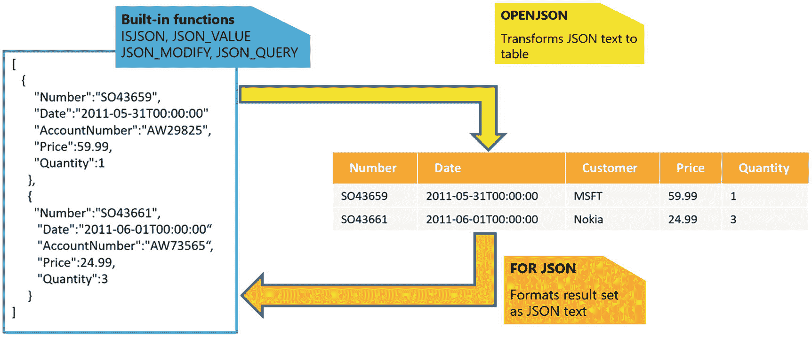

图 8-1

Azure SQL 中的 JSON 功能

Azure SQL 使您能够通过应用内置函数 `JSON_VALUE`、`JSON_QUERY`、`ISJSON` 和 `JSON_MODIFY` 来处理存储在表中或从应用程序发送的 JSON 文本。这些函数使您能够从文本中解析 JSON，并提取和修改 JSON 文档中的信息。

如果您想转换以 JSON 格式表示的半结构化数据，并将 JSON 文档加载到表中，可以使用 `OPENJSON` 函数。`OPENJSON` 函数接受 JSON 格式的对象数组，并将它们拆分为一组行。您可以使用此表值函数将 JSON 转换为表，并以关系格式加载数据。

Azure SQL 还使您能够将 SQL 查询的结果格式化为 JSON 格式。有一个 `FOR JSON` 子句，可以指定查询的结果应以 JSON 格式返回，而不是一组行。

这些功能将使您能够在需要处理 JSON 数据的应用程序中实现大部分所需的功能。除了内置的 JSON 函数和运算符之外，您还可以将 Azure SQL 的其他功能（如索引、排序规则和高级查询功能）与 JSON 数据结合使用。得益于 JSON 支持，将 Azure SQL 集成到全栈或后端解决方案中非常容易，因为从开发者的角度来看，您只需从 Azure SQL 发送和接收 JSON。以下是一些利用 JSON 和 Azure SQL 来简化开发工作的、使用各种语言实现的后端 API 列表：

*   [`https://github.com/Azure-Samples/azure-sql-db-node-rest-api`](https://github.com/Azure-Samples/azure-sql-db-node-rest-api)

*   [`https://github.com/Azure-Samples/azure-sql-db-python-rest-api`](https://github.com/Azure-Samples/azure-sql-db-python-rest-api)

*   [`https://github.com/Azure-Samples/azure-sql-db-dotnet-rest-api`](https://github.com/Azure-Samples/azure-sql-db-dotnet-rest-api)

这是一个使用 NodeJS、Azure Functions 和 Azure SQL 实现的、以 JSON 作为传输格式的 ToDoMVC 示例应用的全栈示例：

[`https://github.com/Azure-Samples/azure-sql-db-todo-mvc`](https://github.com/Azure-Samples/azure-sql-db-todo-mvc)

## 将查询结果格式化为 JSON 文档

现代应用程序通常被实现为分布式服务，它们通过 HTTP 端点交换数据。在大多数情况下，数据交换采用 JSON 格式。

后端开发人员花费大量时间从数据库获取数据，并将结果序列化为 JSON 文本，以返回给调用方（例如，前端代码）。你可能会在 REST API 中发现大量的后端代码仅仅是对 SQL 查询的封装。有些模型类仅用于临时将作为 SQL 查询结果返回的一组行加载到内存中，然后立即把这些内存对象序列化为将返回给调用方的 JSON 文本。这就是所谓的 DTO（数据传输对象）模式，其中模型类仅在应用层之间传输数据。许多类似 DTO 的模型类甚至不被后端代码使用，它们仅代表一个模板，数据访问框架将使用该模板加载数据并将其序列化为 JSON 结果。这可能会影响性能，特别是内存消耗，因为查询返回的数据首先被复制到模型内存对象中，然后再次复制为将作为结果返回的 JSON 文本。除了资源消耗外，这种方法可能会增加服务中的延迟，更不用说这类代码只是附加值非常低的“粘合剂”代码这一事实了。每次转换都是阻塞式的，查询返回的结果必须完全加载到一个内存对象集合中，然后由某个序列化器（如.NET 语言中的 JSON.Net）将整个集合序列化为 JSON 文本。

Azure SQL 使你能够极大地简化此过程。`FOR JSON` 查询子句使你能够指定查询结果应作为 JSON 字符串返回，而不是作为行集合返回。这样，你可以直接将查询结果流式传输到客户端，而无需构建那些仅仅将参数从客户端传递到查询并将结果转换为 JSON 结果的封装层。

以下示例展示了一个简单的 ASP.NET MVC 操作方法，当用户向 URL `http://<web-application-domain>/LogAnalytic/CountBySeverity` 发送 HTTP GET 请求时，该方法将被执行。该操作方法将查询结果获取为 JSON 文本，并直接将其流式传输到 HTTP 响应体中：

```
public class LogAnalyticController {
    [HttpGet]
    public void CountBySeverity(){
        var QUERY = @"SELECT severity, total = COUNT(*)
                      FROM WebSite.Logs
                      GROUP BY severity
                      FOR JSON PATH";
        connection.QueryInto(Response.Body, QUERY);
    }
}
```

这个操作方法使用了.NET、微 ORM `Dapper` 和 `Dapper.Stream` 扩展，后者使你能够通过连接在 Azure SQL 上执行 SQL 查询。该查询具有 `FOR JSON` 子句，指示 Azure SQL 以 JSON 格式而非表格格式返回结果。来自 `Dapper.Stream` 扩展的 `QueryInto` 方法会将 JSON 结果流式传输到 HTTP 响应的正文中。这样，你只需要两行 C#代码就能将查询转换为一个 JSON Web 服务。`FOR JSON` 子句让你能够轻松地通过几行代码，从任何 SQL 查询出发，最终实现一个功能齐全的 REST API。

## 存储 JSON 文档

在某些情况下，你将处理具有高度多样性的数据结构，而这些结构无法有效地表示为规范化模式。在这种情况下，你可以遵循 NoSQL 方法，将复杂结构序列化为 JSON 文本。

根据定义，JSON 是一种 Unicode 文本格式，因此在 Azure SQL 中使用 `NVARCHAR` 类型表示。在你的应用程序中，不需要使用专门的类型、特殊的客户端驱动程序或 API 来发送或检索 JSON 数据。大多数编程语言中的任何字符串类型都可以用来读写 JSON 列中的内容。以下示例展示了一个简单的表，用于存储网站日志消息，该表包含少量所有日志消息共有的固定列（`logDate` 和 `severity`），以及一个 `log` 列，其中包含日志中可能找到的所有可变信息：

```
create table WebSite.Logs (
    _id bigint identity,
    logDate datetime2,
    severity tinyint,
    log nvarchar(max)
);
```

通过这种方式，你可以存储半结构化数据或结构易变的数据，而无需为每一个新变体创建一组自定义的表。在此场景中，日志消息是写入一次、读取多次，因此我们无需担心 JSON 日志列中半结构化值的高效更新问题。

如果你决定将数据存储在表中，你需要了解如何从 JSON 列中解析值并在查询中使用它们，如何使用索引加快查询速度，以及如何确保 JSON 内容有效。

## 查询 JSON 数据

Azure SQL 使你能够运行标准的 SQL 查询，这些查询可以同时使用经典的标量列和从 JSON 文本中提取的值。Azure SQL 提供了四个简单的函数来处理 JSON 文本：

*   `JSON_VALUE(json, path_to_value)` 函数将根据指定路径从 JSON 文档中返回一个标量值。
*   `JSON_QUERY(json, path_to_object)` 函数将根据指定路径从 JSON 文档中返回一个复杂对象或数组。
*   `JSON_MODIFY(json, path_to_object, json_object)` 将接受作为第一个参数提供的 JSON 文档，在第二个参数指定的路径上定位值或对象，然后注入作为第三个参数提供的值来替换此值。第一个参数不会被修改，而是返回修改后的 JSON 文本。如果你提供 `NULL` 值作为第三个参数，则该路径上的值将被删除。
*   `ISJSON(json_string)` 如果作为参数提供的字符串是格式正确的 JSON，则返回值 1，否则返回 0。

使用这些简单的函数，你可以在列、参数或变量中解析任何 JSON 文本，并在任何查询子句中提取值。这些函数中的路径表示 JSON 文档中的值位置。路径中使用的语法易于理解，因为它类似于大多数现代面向对象语言中引用对象内字段的方式（例如，`$.info[3].name.firstName`）。

以下查询创建了一个报告，该报告使用了上一节所示的 `WebSite.Logs` 表中的标准列和 JSON 列：

```
SELECT
    severity,
    ip = JSON_VALUE(log, '$.ip'),
    duration = AVG(CAST(JSON_VALUE(log,'$.duration') as int))
FROM
    WebSite.Logs
WHERE
    CAST(JSON_VALUE(log,'$.date') as datetime) > @datetime
GROUP BY
    severity, JSON_VALUE(log, '$.ip')
HAVING
    AVG(CAST(JSON_VALUE(log,'$.duration') as int) ) > 100
ORDER BY
    AVG(CAST(JSON_VALUE(log,'$.duration') as int) )
```

来自 `severity` 列的标量值被直接引用，而来自 JSON 列的标量值则使用 `JSON_VALUE` 函数提取。在这个查询中，你可以注意到 Azure SQL 多模型功能的真正优势。你只需使用一种 SQL 语言和几个附加函数，即可处理与标量关系列混合的半结构化数据。如果你熟悉标准 SQL 语言，学习 JSON 扩展将是一件容易的事。


### JSON 路径

在之前的示例中，你已经看到所有 JSON 函数都使用一个路径，该路径引用了将被解析的 JSON 中的属性。Azure SQL 中的 JSON 路径可以包含以下元素：

*   `$` 代表当前作为 JSON 函数第一个参数提供的 JSON 文档。
*   字段引用以点号（.）开头，引用上下文中的子属性。例如，`$.info.name.firstName` 将找到一个 `info` 属性，然后在该对象中找到 `name` 属性，再在 `name` 中找到 `firstName` 对象。
*   数组引用可应用于数组，并通过索引引用元素。例如，`$.children[2].name` 将找到一个 `children` 数组，获取索引为 2 的元素，然后在该对象中找到 name 属性。数组引用中的索引是从零开始的。

通过这种 JSON 路径语法，你可以使用面向对象语言中相同的样式来引用 JSON 文档中的任何属性。

### 排序规则意识

Azure SQL 中的排序规则是定义查询处理器如何比较和排序值的规则。例如，在法语中，每个单词中的最后一个重音符号决定了排序顺序，因此以下四个单词将按如下方式排序：

1.  cote
2.  côte
3.  coté
4.  côté

JSON 标准并未定义文档中的值应如何被比较和排序；但是，你可以利用 Azure SQL 的排序规则，在处理 JSON 数据时应用一些自定义的语言规则。如果你在包含 JSON 文档的 `NVARCHAR` 列上指定了排序规则 `French_100_CS_AS`，Azure SQL 将使用法语规则来比较和排序基于从此列的 JSON 内容中提取的值的结果。即使列上未指定排序规则，我们也可以在查询中显式应用所需的排序规则：

```sql
SELECT JSON_VALUE(log,'$.msg')
FROM WebSite.Logs
ORDER BY JSON_VALUE(log,'$.msg') COLLATE French_100_CS_AS
```

排序规则意识是一项重要特性，尤其对于国际应用而言。JSON 函数能够利用这一特性，使其成为 Azure SQL 多模型能力的一个强大补充。

### 确保 JSON 文档的数据完整性

Azure SQL 不会检查你是否在 `NVARCHAR` 列中放置了有效的 JSON 文档。如果你确信你总是将 JSON 文档存入表中，或者你的应用逻辑中有验证来确保这一点，这就不是问题。验证 JSON 格式需要一些时间和资源，因此 Azure SQL 不会拖慢插入和更新操作的速度。如果你想确保你的 JSON 文档始终有效，可以显式添加一个 `CHECK CONSTRAINT` 来执行此验证：

```sql
ALTER TABLE Webite.Logs
ADD CONSTRAINT [Data should be formatted as JSON]
CHECK (ISJSON(log) = 1);
```

这样，你就能完全控制存储过程，并选择何时验证 JSON 数据。在此示例中，使用了一条简单的规则来确保插入 `log` 列的值是有效的 JSON 文档。你可以创建自定义规则，使用 `JSON_VALUE` 函数从 JSON 文档中提取值，并在单独的 `CHECK CONSTRAINT` 中比较返回的值。

### 为 JSON 值建立索引

索引通常有助于提升查询性能。Azure SQL 没有针对 JSON 文档的专用索引，但你可以有效地使用以下标准索引来提高 JSON 查询的性能：

*   聚集列存储索引会压缩 JSON 文档，并支持对 JSON 值进行高性能分析。
*   B-Tree 索引使你能够快速找到 JSON 列中具有某个值的行。

聚集列存储索引是 Azure SQL 中的核心分析技术，提供数据的高压缩率和快速分析能力。如果你的表中有大量文档，聚集列存储索引可能是一个很好的解决方案，因为它可以高效地压缩 JSON 文档，减少加载文档所需的 IO，并提升你可能对文档运行的分析报告的性能。以下代码可以在包含 JSON 文档的表上添加聚集列存储索引：

```sql
CREATE CLUSTERED COLUMNSTORE INDEX cci ON WebSite.Logs;
```

如果需要对 JSON 文档进行分析，在包含 JSON 文档的表上创建聚集列存储索引是一个不错的选择。列存储索引将应用所谓的批处理模式，利用向量处理和 SIMD 指令，这可以提升对 JSON 数据分析查询的性能。

在需要使用 JSON 文本中的某个特定属性来筛选或排序文档的场景中，你还可以利用标准的 SQL 语言特性，例如计算列和索引。计算列可以通过 `JSON_VALUE` 函数公开 JSON 内容中的某个值，然后你可以在此计算表达式上创建标准的 B-tree 索引，如以下代码所示：

```sql
alter table WebSite.Logs
add [$severity] AS JSON_VALUE(log, '$.severity');
go
create index ix_severity on WebSite.Logs ([$severity]);
```

计算列 `$severity` 只是一个命名表达式，用于公开存储在 `log` 列中的 JSON 内容的值。除非你想通过添加 `PERSISTED` 关键字来显式预计算提取的值，否则它不会占用额外空间。每当使用 `JSON_VALUE(log, '$.severity')` 表达式筛选或排序行时，Azure SQL 都会知道存在匹配的索引，并使用它来加速你的查询。


### 导入 JSON 文档

现代服务以 JSON 格式发送数据，在许多情况下，你需要将这些 JSON 值存储在 Azure SQL 表中。Azure SQL 提供了 `OPENJSON` 表值函数，该函数接受一个包含 JSON 文本的文本参数，对其进行解析，并以表格格式返回 JSON 文档中的值。如果你想通过将对象数组作为参数传递给存储过程来导入它们，可以使用类似以下的代码将传入的 JSON 消息插入到表中：

```sql
CREATE OR ALTER PROCEDURE InsertDeviceLog (@msg nvarchar(max))
AS
INSERT INTO WebApi.Logs(logDate, severity, log)
SELECT *
FROM OPENJSON(@msg)
WITH (
logDate datetime2 '$.properties.DeviceTime',
severity tinyint '$.properties.severity',
log nvarchar(max) '$.info' AS JSON
);
GO
```

`OPENJSON` 函数的第一个参数是一个包含要解析的 JSON 数组的文本。该函数期望接收一个 JSON 对象数组，其中每个对象将被转换为结果集中的一行。如果要转换的数组位于文档中的某个位置，你可以提供第二个参数，该参数表示一个 JSON 路径，`OPENJSON` 函数应在此路径下找到要转换为结果集的对象数组。引用数组中的每个对象都将成为返回结果集中的一个对象。

`WITH` 子句用于定义输出模式，并将 JSON 数组中对象的属性映射到输出列。此部分将包含每个输出列的一个条目，其中包含以下信息：

*   输出列的名称。如果未提供可选的 JSON 路径，则此名称也用作应在此列中作为结果值返回的 JSON 属性的键。
*   输出列的 SQL 类型。`OPENJSON` 将使用 `CONVERT` T-SQL 函数的语义，将解析后的 JSON 文本中的文本值转换为 SQL 值。
*   可选的 JSON 路径，用于引用 JSON 对象中包含要返回的值的属性。如果未指定此路径，则将使用列名来引用属性。例如，如果列名为 `severity` 且未指定 JSON 路径，则 `OPENJSON` 将尝试在 `$.severity` 路径上查找值。
*   可选的 `AS JSON` 子句。默认情况下，`OPENJSON` 将使用 `JSON_VALUE` 函数从当前正在转换的对象中获取值。因此，它无法返回子对象或子数组。如果该路径上存在 JSON 对象或数组，则除非你指定 `AS JSON` 子句，否则不会返回。

`OPENJSON` 函数的结果将是一个可以插入到表中的结果集。

## 图结构

图是复杂的结构，包含通过关系（边）连接的对象（节点）。你可能会使用图的场景包括：

*   社交网络，其中人员通过朋友、家人、合作伙伴或同事等关系连接
*   交通地图，其中城镇和地点通过道路、河流和航线连接
*   物料清单解决方案，其中部件连接到其他部件，而这些部件又连接到其他部件，依此类推

在某些场景下，图结构可以表示为表和外键关系。你选择图模型而非关系模型的关键原因在于，当你正在处理一个关系占主导地位，并且少量实体以多种不同、直接和间接方式相互连接的项目时。实际上，在该领域中的关键区别是关系的传递性。此处使用的“传递”一词取其数学含义：如果 `a` 连接到 `b`，并且 `b` 连接到 `c`，那么 `a` 就连接到 `c`。在这些情况下，你不仅对单跳关系（例如通过外键关系为订单获取订单行）感兴趣，而且对从一个节点移动到另一个节点所需的所有跳跃都感兴趣。为了有效地做到这一点，你需要利用图特有的查询处理语义。例子包括查找传递闭包（`a` 是否连接到 `z`？）、查找两个对象之间的最短路径，或从指定对象开始递归遍历所有关系。

在 Azure SQL 中，节点和边使用特殊的表来表示。你可能会好奇为什么选择关系表来实现表示图元素，以及这是否是一个好主意。

首先，将信息绑定到节点和边是很常见的，而表是保存这些信息的完美结构。使用表的第二个好处是，可以利用 Azure SQL 查询优化器来提高整体查询性能。这一选择的第三个好处是，由于它们只是表，因此可以使用列存储索引和索引来进一步提高性能。

例如，让我们看一下模拟机场以及代表它们之间连接的航线的简单结构。这个领域可以使用以下结构建模：

```sql
CREATE TABLE Airport (
AirportID int PRIMARY KEY,
Name NVARCHAR(100),
CityID int FOREIGN KEY REFERENCES Application.Cities(CityID)
) AS NODE
GO
CREATE TABLE Flightline (
Name NVARCHAR(10)
) AS EDGE;
```

`Airport` 是图的一个节点，但它的行为类似于常规表。我们可以添加任何列、索引或约束来描述此节点中的信息。这是 Azure SQL 多模型功能如何使你能够在新场景中结合经过实战检验的高级数据库功能的另一个例子。节点表有一个隐藏列，用于表示节点的唯一标识符，稍后将对此进行解释。

`Flightline` 是一个边表，它连接两个 `Airport` 表。此表中的列表示描述两个节点之间关系的附加信息。此示例中显示的边表是一个通用边，没有指定它旨在连接两个 `Airport` 而不是其他节点。为了明确指定 `Flightline` 连接 `Airport`，我们需要引入以下边约束：

```sql
ALTER TABLE Flightline
ADD CONSTRAINT [Connecting airports]
CONNECTION (Airport TO Airport)
ON DELETE CASCADE;
```

此约束指定你不能使用 `Flightline` 边来连接 `Airport` 以外的节点。此约束还定义了节点被删除时边会发生什么。


## 加载图数据

节点表是经典的表，可以像加载或读取任何其他经典表一样操作。每个节点表都有一个名为`$NODE_ID`的隐藏列，您只会在某些特殊场景中使用它。边表具有隐藏的“外键关系”列，这些列在底层用于使用`$NODE_ID`值将边与关联的节点连接起来。在将数据导入边中时，了解这一点非常重要，因为您需要获取相关节点的`$NODE_ID`值来绑定它们。让我们假设`Airport`节点已经加载，并且我们正在使用`OPENROWSET`函数从 blob 存储导入一组边。为了将数据加载到边表中，我们需要将加载的记录与节点进行联接，找到`$NODE_ID`值，并将它们与导入的航空公司名称一起插入到边表中：

```
INSERT INTO Flightline ($from_id, $to_id, Name)
SELECT f.$NODE_ID, t.$NODE_ID, a.Name
FROM OPENROWSET(
BULK 'data/flightlines.csv',
DATA_SOURCE = 'MyAzureBlobStorage',
FORMATFILE='data/flightlines.fmt',
FORMATFILE_DATA_SOURCE = 'MyAzureBlobStorage') as a
JOIN Airport f ON f.Name = a.FromAirport
JOIN Airport t ON t.Name = a.ToAirport;
```

Flightlines CSV 文件包含有关源和目的机场以及它们之间航线名称的信息。我们需要通过`Name`列将此数据与机场进行联接，并获取应该导入的`$NODE_ID`值。

## 查询图数据

一旦我们加载了数据，就可以使用 Cypher 表达式（[`www.opencypher.org/`](http://www.opencypher.org/)）——一种最常见的图数据查询方式。以下查询将遍历从源机场节点通过航线边到另一个机场节点的所有路径：

```
SELECT
src.Name, line.Name, dest.Name
FROM
Airport src, Flightline line, Airport dest
WHERE
MATCH(src-(line)->dest)
AND
src.Name='Belgrade';
```

此查询将返回从贝尔格莱德到所有其他城镇的目的地。`MATCH`子句定义了一条从源机场（`src`）到目的机场（`dest`）的路径应通过航线表（`line`）建立。

Azure SQL 中图处理支持的主要优势在于能够跨节点的边进行查询。例如，`SHORTEST_PATH`谓词使您能够查找两个节点之间的最短路径。您可以利用此功能来查找两个城镇之间的最短路线，如以下代码所示：

```
WITH routes AS (
SELECT
src.Name,
STRING_AGG(dest.name, '->')
WITHIN GROUP (GRAPH PATH) AS path,
COUNT(dest.name)
WITHIN GROUP (GRAPH PATH) AS stops,
LAST_VALUE(line.name)
WITHIN GROUP (GRAPH PATH) AS lastFlight,
LAST_VALUE(dest.name)
WITHIN GROUP (GRAPH PATH) AS destination
FROM
Airport src,
Flightline FOR PATH line,
Airport FOR PATH dest
WHERE
MATCH(SHORTEST_PATH(src(-(line)->dest)+))
AND
src.Name='BEG'
)
SELECT TOP (10) path, stops, lastFlight, destination
FROM routes
WHERE destination IN ('JFK', 'SEA');
```

`MATCH`子句中的`SHORTEST_PATH`子句将查找起点和终点位置之间未直接连接的最短路径。聚合函数`STRING_AGG`将连接路径上的所有机场名称，并使用箭头`->`分隔符显示它们。`COUNT`和`LAST_VALUE`将显示行程上的停靠次数以及最短路线上的结束航班和城镇。一旦最短路径探索完成，我们需要在最终查询中选择目的城镇。

Azure SQL 中的图处理功能使您能够降低模型和查询的复杂性，这些模型和查询需要分析表之间的不同路径和关系。

## 空间数据

表示空间对象（地点、道路、国家边界）并不完全适合规范化形式的结构化关系模型。尽管您可以将一条道路或边界表示为一组小的直线段，其中每条线段存储在单独的行中，并将端点连接到继续道路的线段，但这不是一种高效的表示方式。

您针对空间对象运行的查询通常具有诸如“这个地方是否在这个形状内”或“这个地方离道路有多远”这样的条件。这些不是您使用标准 SQL 语言描述的典型查询。

Azure SQL 具有符合开放地理空间联盟（OGC）标准的专门功能，使您能够实现处理空间数据的应用程序：

*   可用于表示复杂几何和地理对象及形状的专门类型（`Point`、`Line`、`Polygon`）。所有形状都可以表示为 geometry 或 geography 模型，稍后将更详细地描述。

*   专门用于空间查询的功能，例如查找两点之间的距离（`ST_DISTANCE`）、确定一个区域是否包含指定的点（`ST_CONTAINS`）等。

*   针对空间类型查询优化的专门索引。

这组功能使您能够创建特定于空间领域的高级查询。

回想一下上一节中描述的机场和航线模型。使用航线（边）连接机场（节点）的图模型对于查找两个城镇之间的最短路线可能是完美的。但是，想象一下，您需要查找所有穿过内布拉斯加州的航线或两条高速公路交叉的无名十字路口。如果高速公路与所有十字路口或国家之间没有明确的关系，就不可能回答这些问题。

为了解决这些问题，我们需要用地理数据扩展图模型，如以下脚本所示：

```
CREATE TABLE Airport (
AirportID int PRIMARY KEY,
Name NVARCHAR(100),
Location GEOGRAPHY,
CityID int FOREIGN KEY REFERENCES Application.City(CityID)
) AS NODE
GO
CREATE TABLE FlightLine (
Name NVARCHAR(10),
Route GEOGRAPHY
) AS EDGE;
```

Azure SQL 有两种主要的基类型，可用于表示几何和地理图形：

*   `GEOMETRY`类型在欧几里得（平面）坐标系中表示数据。

*   `GEOGRAPHY`类型在圆球坐标系中表示数据。

Geometry 非常适合表示相对较小的对象，如建筑物或室内；Geography 更适合表示更大的形状，如河流、城市或国家边界，以及通常任何需要在地球表面的近似值上工作以避免误差的事物。

在这两种类型中，按照开放地理空间联盟的规定，您可以创建更具体的类型：

*   `Point`用于表示 2D 地点，如城镇

*   `LineString`和`CircularString`可以表示开放或封闭的线，如道路或边界

*   `Polygon`和`CurvePolygon`用于表示区域，如国家

*   `MultiPoint`、`MultiLine`和`MultiPolygon`表示一组逻辑上属于同一整体的不连续地理对象（例如，一个群岛可以用`MultiPolygon`表示）

在 Azure SQL 中，一旦在表中创建了 Geometry 或 Geography 列，您就可以使用这些类型中的任何一种来构建所需的形状。您甚至可以同时使用多个类型，使用 Collections 或“Multi”类型。


### 查询空间数据

Azure SQL 中的空间数据类型具有内置方法，使您能够轻松查询空间数据。假设所有关于航线和机场的信息都已填充，我们可以轻松找出穿过内布拉斯加州的航线：

```sql
DECLARE @nebraska GEOGRAPHY = (
SELECT TOP (1) Border FROM Application.StateProvinces
WHERE StateProvinceName = 'Nebraska'
);
SELECT *
FROM FlightLine
WHERE Route.STIntersects(@nebraska) = 1;
```

`STIntersects` 方法用于确定两个形状是否在某处相交。如果一个地理实例与另一个地理实例相交，则此方法返回 1，否则返回 0。

`STDistance` 方法测量两个对象之间的距离，使您能够找到更接近某个特定坐标的对象。以下查询返回距离某个对象当前位置最近的五个机场：

```sql
DECLARE @currentLocation GEOGRAPHY = 'POINT(-121.626 47.8315)';
SELECT TOP(5) *
FROM Airports
ORDER BY Location.STDistance(@currentLocation) ASC;
```

空间查询使您能够轻松执行特定分析，以解决那些需要花费大量时间处理特定数学变换的问题，而无需您自己编写这些变换或使用其他更专业的解决方案来进行计算，这样您就不必移动数据，从而使您的解决方案更加高效。

### 空间索引

理论上，`STIntersects` 方法可以实现为一个包含复杂数学计算的独立函数，这些计算试图确定图形之间的关系。然而，由于计算的复杂性，在大量对象上运行这种函数将非常耗时且消耗 CPU。为了高效处理，Azure SQL 使用一种特殊类型的索引，即空间索引。

空间索引在内部创建一个网格（如图 8-2 所示），其中的单元格可能与被索引图形的部分区域重叠，也可能不重叠。

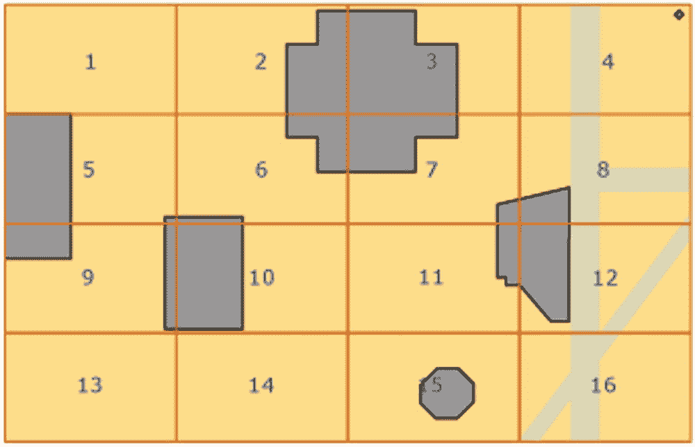

图 8-2

在 4x4 网格中对空间对象进行索引

Azure SQL 创建一个网格，并为每个需要索引的空间对象记录该对象是完全重叠、部分重叠还是完全不重叠于网格中的单元格。这个过程被称为 `tessellation`（网格化）。使用这种技术，需要确定两个对象是否重叠的 `STOverlaps` 方法，就不必立即应用复杂的数学计算来判断对象间是否存在交集。如果有索引可用，它会首先使用索引来检查是否存在至少一个单元格同时属于这两个空间对象，或者属于一个对象的单元格是否也与另一个对象部分重叠。如果为真，则它们重叠，这是判断是否存在交集的更快方式。如果没有单元格与两个对象都至少部分重叠，则这些对象不重叠。如果有些单元格与两个对象都部分重叠，则这些对象可能重叠，也可能不重叠。只有在这种情况下，Azure SQL 才会应用复杂的空间计算，但不是在整个对象区域上，而只是在它们可能潜在重叠的较小单元格上进行计算。尽管这可能是一个消耗 CPU 的操作，但它是在一个小单元格上执行的，并且可能只涉及对象位于该单元格内的一小部分区域。因此，这种操作会比比较对象所有部分的朴素方法快几个数量级。

空间索引使用特殊的 `CREATE SPATIAL INDEX` 语法创建：

```sql
CREATE SPATIAL INDEX SI_Flightline_Routes
ON Flightline(Route)
USING GEOGRAPHY_GRID
WITH (
GRIDS = ( MEDIUM, LOW, MEDIUM, HIGH ),
CELLS_PER_OBJECT = 64 );
```

除了要索引的空间列之外，您还可以指定为索引空间值而创建的网格的特征，例如应覆盖的区域或用于索引的网格化密度。粒度更细的索引会更大，需要更多时间来扫描所有网格单元格并确定航线的部分是否与每个单元格重叠。然而，更大的网格密度使得对象部分重叠的最坏情况阶段处理速度更快，因为只有对象的较小部分需要使用复杂数学规则进行处理。索引的合适大小和参数取决于您的数据，您可能需要进行试验，并用不同的参数重建索引，以找到最适合您数据的配置。

如果您一开始不确定，可以避免指定边界框，Azure SQL 会尝试为您猜测最佳的边界框和网格划分。当然，自动定义的值在您的场景中可能不是完美的，但重要的是要知道，如果需要，您可以手动指定它们。


### 几何 vs. 地理

如前所述，Azure SQL 针对不同场景提供了两类空间数据类型：

*   `几何数据类型` 用于表示经典二维坐标系中的平面数学形状。
*   `地理数据类型` 用于表示投影到二维平面上的球体对象和形状。

理解几何与地理类型之间的差异，是开发空间应用所需掌握的**最关键**要点之一。

地理类型用于表示置于经典二维坐标系中的对象，你可以将其想象为可以绘制在一张纸上的物体。对象距离和大小的测量方式，与在纸或板上绘制物体后测量距离的方式相同。如果你拿一张地图，想找出从塞尔维亚贝尔格莱德到美国华盛顿州西雅图之间的最短飞行轨迹，你可能会使用一条经过法国和美国东海岸的直线水平线。从几何上看，这是它们之间最短的线。然而，由于地球的球形形状，最短轨迹（称为 `geodesic`）实际上是经过冰岛、格陵兰岛和加拿大的路径。地理数据模型考虑了地球的实际形状，并能够找到现实世界中的最短距离和路径。

将地球表面映射到二维平面是最困难的空间问题。著名数学家卡尔·高斯在其 `绝妙定理`（拉丁语 "Theorema Egregium"）中证明，球面在不产生失真的情况下无法映射到二维平面。你可能在一些地图上注意到，靠近两极的区域，如格陵兰岛、南极洲、加拿大北部和俄罗斯，看起来被拉伸或有时比实际更大。这是因为靠近两极的密集坐标必须被“拉伸”才能投影到二维坐标中。更困难的是，地球表面并非球体，甚至也不是椭球体。地球的不规则形状和靠近两极的地理位置迫使人们采用不同的二维平面映射策略。存在一些映射规则可以保持正确的距离最短路径、形状等，但在每种策略中，某些方面都会失真。这就是为什么每个地理对象都关联一个 `空间参考标识符 (SRID)`，它描述了用于将对象从地球仪转换到二维平面所采用的空间转换策略。`SRID` 描述了使用的坐标（纬度/经度、东向/北向）、计量单位、坐标原点位置等。Azure SQL 将根据 `SRID` 获取信息以比较对象的位置。

在以下示例中，你可以看到如何通过指定使用 `SRID 4326` 的世界大地测量系统 1984 (WGS84) 来转换坐标，从而构造一条地理线：

```
DECLARE @g GEOGRAPHY;
SET @g = GEOGRAPHY::STGeomFromText('LINESTRING(-122.360 47.656, -122.343 47.656)', 4326);
SELECT @g.STSrid;
```

一些国家，特别是像智利那样南北边界相距很远的国家，需要在其领土内使用多个 `SRID`。在这些情况下，比较地理位置对象之前，你需要对齐 `SRID`。指定不同的 `SRID` 会导致位置或形状不同。测量使用不同 `SRID` 确定的空间对象之间的差异，将会导致错误的结果。因此，在 Azure SQL 中，无法在具有不同 `SRID` 的空间对象之间执行空间操作。

WGS84 是最常用的标准，也是我们手机或汽车中 GPS 系统所使用的标准。如果你不确定使用哪个 `SRID`，那么 WGS84 极有可能非常适合你。

对你来说好消息是，所有这些复杂的转换功能都已内置于 Azure SQL 中。你需要做的只是利用这些功能，并学习帮助你理解如何使用空间特性的基本原理。

## XML 数据

`XML 数据类型` 是 `JSON` 的前辈。此功能在 2000 年至 2005 年之间被引入 SQL Server 数据库引擎，当时 XML 是不同应用程序之间数据交换的主流格式。

Azure SQL 中的 XML 支持与前面章节描述的 JSON 支持类似。如果你需要解析 XML 数据或将查询结果格式化为 XML，可以使用以下功能：

*   `OPENXML` 表值函数，可用于解析 XML 文档
*   `FOR XML` 子句，可用于将查询结果格式化为 XML 文档
*   `XML` 类型及其用于处理 XML 文档中值的方法

如果你已经理解了 JSON 支持章节中解释的 `OPENJSON` 函数和 `FOR JSON` 子句，那么你可能也就理解了 `OPENXML` 函数和 `FOR XML` 子句的用途。这些 XML 功能与对应的 JSON 功能之间的差异微不足道，因此不再详细解释。

Azure SQL 中 JSON 和 XML 支持的关键区别在于原生的 `XML` 类型。与 JSON 支持（JSON 文本存储在原生的 `NVARCHAR` 类型中）不同，XML 有专门的 SQL 类型。XML 在许多语言中都是标准化的类型（例如，.NET 框架中的 `System.Xml.Document`），因此在 SQL 类型中保持对等是合理的。关键区别在于，在 JSON 情况下，你使用类字符串函数来解析 JSON，而 XML 内容则表示为一个对象，你可以使用各种方法来提取数据。


# 查询 XML 数据

XML 类型具有以下成员方法，可用于从 XML 中提取值并进行操作：

*   `value(path, type)` 方法从 XML 对象返回一个节点或属性，并自动将其转换为 SQL 类型。你需要指定一个标准的 XPath 表达式，该表达式需指向 XML 文档中的单个值。
*   `query(path)` – 此方法根据指定的 XPath 表达式从 XML 文档返回一个对象。
*   `nodes(path)` 与 `OPENXML`/`OPENJSON` 函数非常相似，用于将指定路径上的 XML 元素数组转换为一组行，这些行可以在 `FROM` 子句中使用。
*   `exists(path)` 是一个检查指定路径上是否存在元素的方法。
*   `modify(path, type)` 方法使你能够在 XML 文档中插入、删除或替换某些节点的值。

将通过以下示例解释 XML 查询功能：

```sql
DECLARE @i INT = 47;
DECLARE @x xml;
SET @x='
<Family id="1">
    <row id="81"><name>Robin</name></row>
    <row id="123"><name>Lana</name></row>
    <row id="7"><name>Merriam</name></row>
</Family>
';
SELECT
    family_id = @x.value('(/Family/@id)[1]', 'int'),
    family_81_name = @x.value('(//row[@id=81]/name)[1]', 'varchar(20)'),
    family_name = @x.query('//row[@id=sql:variable("@i")]/name')
SELECT
    family_member = xrow.value('name[1]', 'varchar(20)'),
    family_member_id = xrow.value('@id[1]', 'varchar(20)'),
    family_member_xml = xrow.query('.')
FROM
    @x.nodes('/Family/row') AS Members(xrow)
WHERE
    xrow.value('@id[1]', 'int') < 50 and xrow.exist('name[. > 5]') = 1
```

第一个查询使用 `@x` 变量的 `value` 成员函数提取家庭标识符、ID 为 81 的家庭成员姓名，以及标识符值等于变量 `@i` 的成员姓名。

第二个查询将 XML 文档中的所有 `/Family/row` 节点作为行集获取，条件是每一行的 `id` 属性小于 50 且大于 5。满足此条件的每个节点都作为名为 `xrow` 的列返回。方法 `value()` 用于提取将与 SQL 运算符 50 进行比较的值，而 `exist()` 方法用于直接将谓词下推至 XML 变量。最后，使用 `value()` 和 `query()` 方法从每个返回的行中获取名称、标识符和 XML 内容。

另一个有趣的功能是能够在 XPath 表达式中绑定 SQL 变量或列的值。在前面的示例中，你可以看到第一个 `SELECT` 子句中的第三个表达式使用了外部脚本中的 SQL 变量 `@i`。这可能是一种指定如何查找数据的灵活方式。

另一个可能很方便的功能是能够直接更新 XML 文档，而无需解析它、将其转换为关系格式，然后使用 `FOR XML` 子句重新构建 XML。Azure SQL 提供了 `modify()` 方法，你可以在其中指定将在 XML 文档中插入、删除或替换值的表达式：

```sql
SET @x.modify('insert <row id="555"><name>Danica</name></row>
into (/Family)[1]') ;
SELECT @x;
```

尽管 Azure SQL 中的 XML 功能并非你会频繁使用的核心场景（因为 XML 已不再是主流格式），你仍然可以使用它们来解决需要查询和转换 XML 数据的各种问题。

# XPath 和 XQuery 语言

Azure SQL 支持 XML 标准，使你能够在 XML 文档上实现复杂的处理和查询。Azure SQL 中的 XML 支持基于以下语言：

*   XPath（XML 路径语言）是一种用于从 XML 文档中选择节点的查询语言。
*   XQuery（XML 查询）是一种查询和函数式编程语言，用于查询和转换 XML 数据集合。

XPath 是一种基于表达式的语法，用于 `value()`、`nodes()` 和 `query()` 方法中，以指定应定位的 XML 文档中的元素：

*   **层次结构表达式** – 使用 XPath 指定从 XML 文档根节点到文档中所需元素的路径。例如，XPath `/Family/row/name` 用于引用位于 `<row>` 元素下的 `<name>` 元素，而 `<row>` 元素又位于作为 XML 文档根节点的 `<Family>` 元素下。可能有多个元素匹配相同的 XPath 表达式，因此你应该使用索引运算符 `[]` 来指定应引用的匹配元素。
*   **节点和属性引用** – XPath 使你能够引用节点或其属性。任何不以 `@` 开头的名称将被视为 XML 节点的名称，而以 `@` 开头的名称（例如前面示例中的 `@id`）将被视为属性。
*   **递归表达式** – 在某些情况下，你不想或无法引用从根节点开始的完整路径，或者你需要查找位于文档不同位置的元素。递归运算符 `//` 使你能够指定一个“分离路径”，XML 函数将尝试查找与递归运算符右侧表达式匹配的任何路径。例如，`//row/name` 将查找位于 XML 文档中任何位置的 `<row>` 元素内的任何 `<name>` 元素。
*   **谓词** 使你能够指定元素必须满足的某些条件才能与 XPath 表达式匹配。例如，`//row[@id=17]/name` 指定 XML 方法应查找 `id` 属性值为 17 的 `<row>` 元素内的任何 `<name>` 元素。谓词是过滤掉不满足某些条件的节点的简单方法。

XPath 可以是一种非常强大的语言，你可以用它以声明方式指定从 XML 文档中选择信息的条件。

你还可以使用其他 XPath 功能，例如 **命名空间**（使你能够定义名称的作用域并仅匹配相同命名空间内的名称）；**七方向轴**（使你能够引用父节点、同级节点和后代节点）；或**内置函数**（可以帮助你在表达式中转换结果）。

Azure SQL 中也支持 XQuery 语言，它是对 XPath 的补充。XQuery 是一种用于查询和处理 XML 文档中元素集合的标准化语言。XQuery 定义了一种类似 SQL 的语法，称为 **FLWOR**（发音为“flower”），它代表 `FOR`、`LET`、`WHERE`、`ORDER BY` 和 `RETURN` 运算符，可用于转换 XML 节点。这些运算符使你能够根据现有数据选择、转换和返回新对象。XQuery 使你能够使用花括号 (`{...}`) 模板来插入正在处理的节点的值。下面的列表展示了一个在 XML `query()` 方法中使用 **FLWOR** 操作的示例，该操作从 XML 变量中选择节点并将内容转换为新的 XML 结构：

```sql
SELECT xrow.query(
'let $r := self::node()
return <Member id="{$r/@id}">{$r/name/text()}</Member>')
FROM @x.nodes('/Family/row') AS Members(xrow);
```

```xml
<Member id="81">Robin</Member>
<Member id="123">Lana</Member>
<Member id="7">Merriam</Member>
```

XML `nodes()` 方法从前面示例中使用的变量 `@x` 生成三个 XML 行，然后 `query` 方法使用 XQuery 表达式处理它们。在 XQuery 表达式的主体中，当前节点被赋值给变量 `$r`，return 语句创建一个新的 XML 节点，其中 `id` 属性和 `name` 节点的内容被注入到模板中。结果，此 XQuery 表达式将返回如查询下方所示的转换后的 XML。如你所见，XQuery 具有强大的功能，可用于实现 XML 元素的复杂处理。


## XML 索引

由于 XML 查询的特殊性，标准的 B 树索引可能无法提供足够的查询性能提升。Azure SQL 提供了几种专门的索引类型，以实现 XPath/XQuery 表达式的高效处理。Azure SQL 中可用的索引类型如下：

*   `主 XML 索引`是一个预计算结构，包含从 XML 列分解出的值和节点。Azure SQL 使用主索引中的值，而不是通过`value()`、`nodes()`或`query()`方法来调用昂贵的 XML 类型解析。这非常类似于 Azure Cosmos DB 对 JSON 文档使用的自动索引。

*   `辅助 XML 索引`可提升使用`exists()`方法搜索或筛选 XML 文档，或使用`value()`方法从 XML 文档返回多个值的查询性能。

*   `选择性 XML 索引`仅对 XML 列中指定的路径进行索引。这非常类似于在预定义的 XML 表达式上创建多个 B 树索引。

选择性 XML 索引是基于 SQL Server 中多种 XML 场景经验总结得出的推荐索引方法。SQL Server 团队发现，对所有可能的字段进行自动索引会导致 XML 索引体积庞大，而另一方面，大多数被索引的路径并未被使用。因此，选择性 XML 索引成为在可用性、性能和大小之间取得平衡的最佳选择。

在以下示例中，您可以看到如何在一个简单表上创建选择性 XML 索引：

```sql
CREATE TABLE XmlDocs (
id INT IDENTITY PRIMARY KEY,
doc XML
);
GO
CREATE SELECTIVE XML INDEX sxi_docs
ON XmlDocs(doc)
FOR (
path_price = '/row/info/price' AS SQL INT,
path_name = '/row/info/name' AS SQL NVARCHAR(100)
)
```

在选择性索引中，您可以选择应包含在索引中的路径并指定其类型。在`doc`列上使用`value()`函数，且 XPath 查询与索引规范中定义的路径相匹配的查询，将能够利用`sxi_doc`索引，从而获得巨大的性能提升，即使索引本身非常小。

## 键值对

Azure SQL 没有专门用于保存键值对的结构。原因很简单：键值映射可以使用简单的两列表来实现。

Azure SQL 允许您自定义两列表，并使用各种索引对键列进行索引。借助内存优化表（下一章将详细讨论），您可以使用 B 树或哈希索引对键列进行索引。在以下示例中，您可以看到一个内存优化的、无锁的、原生编译的键值表，它使用`HASH`索引来实现对键的更快访问：

```sql
CREATE TABLE [Cache] (
[key] BIGINT IDENTITY,
value NVARCHAR(MAX),
INDEX IX_Hash_Key HASH ([key]) WITH (BUCKET_COUNT = 100000)
) WITH (MEMORY_OPTIMIZED = ON, DURABILITY = SCHEMA_ONLY);
```

此结构利用哈希索引实现了键的快速检索，这对于基本的 get/put 操作是最优的。内存优化表采用乐观的无锁数据访问，而`SCHEMA_ONLY`持久性确保了更快的更新速度，因为数据不会持久化到磁盘。此外，如果值的格式是 JSON 格式，我们可以使用原生 JSON 函数直接在数据库中筛选和处理数据，正如您在本章开头所学。

Azure SQL 中键值结构的使用场景之一是集中式缓存。SQL Server 2016 中有一个著名的案例研究，展示了客户如何将一个分布式缓存机制（该机制在 19 个分布式 SQL Server 节点上达到了每秒 15 万个请求的性能）替换为单台服务器上的内存优化表，从而将性能提升至每秒 120 万个请求。目标场景是实现 ASP.NET Session 缓存。Azure SQL 使用与 SQL Server 相同的技术，相同的技术也可用于 Azure 云中的缓存。

在许多实际项目中，使用专用引擎进行缓存通常是首选方案，但这意味着你需要掌握另一门技术，并需要弄清楚如何将其最佳地集成到你的解决方案中。通常，由于缓存解决方案比完整的 Azure SQL 数据库便宜得多，这种努力是一个不错的选择；但如果你本来就在使用 Azure SQL，那么知道你在数据库中就拥有这种能力，可以为你提供一个你可能想要评估的额外选项，以简化整体架构。

## 如何处理非结构化文本？

最难处理但也并非罕见的情况是非结构化文本数据。在某些情况下，你拥有的文本数据无法很好地组织成 JSON 或 XML 格式，但你需要对该文本实现一些搜索。一个常见的例子是存储在数据库中的 HTML 代码。理想情况下，如果 HTML 符合 XHTML 规范，它应该与 XML 相同，但在许多情况下，HTML 可能存在某些变体，破坏了严格的 XML 结构。

Azure SQL 允许你使用`LIKE`子句来确定文本列是否匹配某个模式。以下查询查找所有`SearchDetails`和`Tags`列中包含用户界面中某个搜索文本框输入的文本的库存项目：

```sql
SELECT si.StockItemID, si.StockItemName, si.Tags
FROM Warehouse.StockItems AS si
WHERE si.SearchDetails LIKE N'%' + @SearchText + N'%'
OR si.Tags LIKE N'%' + @SearchText + N'%'
```

`LIKE`谓词使用百分号（`%`）匹配零个或多个任意字符，使用下划线（`_`）匹配任意一个字符。`LIKE`运算符右侧模式表达式中的这些特殊字符，使你能够定义各种模式，例如以某些文本序列开头或结尾的文本。`LIKE`运算符是一个非常方便的工具，通常用于小型数据集上的文本搜索。Azure SQL 甚至可以在使用`LIKE`运算符时进行优化和使用索引，特别是当你使用`LIKE`搜索所有以某个前缀`开头`的文本时。在这种情况下，索引和`LIKE`运算符可以提供非常好的性能。相反，如果你需要进行更复杂的搜索，例如，查找`包含`在文本某处的特定单词，特别是在处理大型文本集时，你可能需要考虑下一节中描述的一些文本索引解决方案，以进一步提高性能。

### 索引非结构化文本

如果你需要搜索大量的非结构化文本数据，你将需要使用某种特定的索引技术。Azure 提供了一个通用的 Azure 认知搜索索引服务，使你能够索引各种数据源。但是，使用外部服务会给你的解决方案增加一些复杂性。虽然 Azure 认知搜索提供了一套强大的专业功能，但如果你不需要所有这些功能，你可能会很高兴知道 Azure SQL 使用了一个类似的本地化文本搜索索引，称为全文搜索（FTS）索引。FTS 索引是一种对指定表中非结构化文本字段进行索引的结构。以下清单展示了在`StockItems`表的三个文本字段上创建的 FTS 索引示例：

```sql
CREATE FULLTEXT CATALOG [Main] AS DEFAULT;
GO
CREATE FULLTEXT INDEX
ON Warehouse.StockItems (SearchDetails, CustomFields, Tags)
KEY INDEX PK_Warehouse_StockItems
WITH CHANGE_TRACKING AUTO;
GO
```

一个`FTS`索引包含一组使用一组分词器划分的文本片段（令牌）。FTS 索引中的令牌带有它们来源行的键。`FTS`允许你提供文本模式的简单描述，并返回符合该条件的行的键。


### 查询非结构化文本

一旦建立了全文搜索（FTS）索引，就可以使用以下功能通过文本匹配来搜索行：

*   `CONTAINS` 和 `FREETEXT`：用于检查某些列中的值是否符合文本谓词中定义的条件。
*   表值函数 `CONTAINSTABLE` 和 `FREETEXTTABLE`：返回符合文本匹配条件的行的标识符。

以下示例展示了如何从 `Warehouse.StockItems` 表中查找所有 `SearchDetails` 列包含的文本符合 `@SearchCriterion` 变量中定义的搜索条件的键：

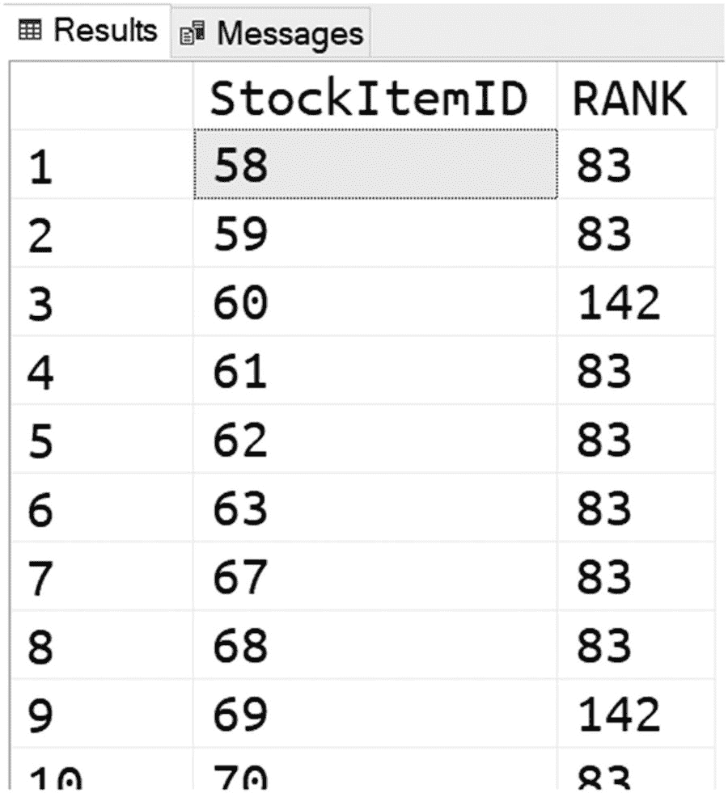

```sql
DECLARE @SearchCondition NVARCHAR(200) = 'blue car';
SELECT StockItemID = ft.[KEY], ft.[RANK]
FROM FREETEXTTABLE(Warehouse.StockItems, SearchDetails, @SearchCondition) AS ft
```

`KEY` 列是 `StockItems` 表中某行的标识符，该行用于 FTS 索引，并代表由 `FREETEXTTABLE` 或 `CONTAINSTABLE` 函数返回的记录。`RANK` 列描述该行与选择条件的匹配程度。可以使用 `KEY` 列将此结果集与原始表连接（`JOIN`），以获取更多结果。以下示例展示了如何查找 FTS 函数返回的键对应的所有库存项：

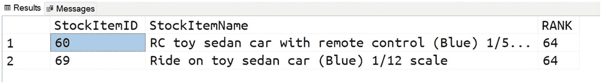

```sql
DECLARE @SearchCondition NVARCHAR(200) = 'blue AND car';
SELECT
si.StockItemID,
si.StockItemName,
ft.[RANK]
FROM
Warehouse.StockItems AS si
INNER JOIN
CONTAINSTABLE(Warehouse.StockItems, SearchDetails, @SearchCondition) AS ft ON si.StockItemID = ft.[KEY]
ORDER BY
ft.[RANK];
```

表值函数 `CONTAINSTABLE` 和 `FREETEXTTABLE` 基于精确匹配或模糊匹配来匹配文本。这些函数的一个区别是，`CONTAINSTABLE` 进行更精确的匹配，而 `FREETEXTTABLE` 则使用同义词库、同义词和词形变化进行模糊匹配。如果以单词 `"children"` 作为搜索条件，`FREETEXTTABLE` 也会匹配包含 `"child"` 的行，但 `CONTAINSTABLE` 则不会。在 `CONTAINSTABLE` 中，需要显式指定表达式 `FORMSOF(INFLECTIONAL,children)` 来指示 Azure SQL 包含该单词的词形变化形式。

另一个区别是，`CONTAINSTABLE` 允许指定 `AND`、`OR` 或 `NEAR` 等运算符来定义如何搜索文本。在前面的示例中，你可能看到我们向 `FREETEXTTABLE` 提供了单词集合 `"blue car"`，该函数将返回包含这些单词中任何一个的所有行，类似于大多数网络搜索引擎的行为。而在 `CONTAINSTABLE` 示例中，我们需要显式指定诸如 `AND`、`OR` 或 `NEAR` 之类的运算符来指定应搜索的内容，例如 `"blue AND car"` 或 `"blue OR car"`。

除了函数 `FREETEXTTABLE` 和 `CONTAINSTABLE`，你还可以使用等效的谓词 `FREETEXT` 和 `CONTAINS`。这些谓词可以在查询的 `WHERE` 子句中使用，它们在功能上等同于显式地与 `FREETEXTTABLE` 和 `CONTAINSTABLE` 进行 `JOIN` 操作，区别在于你无法使用 `RANK` 列：

```sql
DECLARE @SearchCondition NVARCHAR(200) =
'FORMSOF(INFLECTIONAL,children) OR car';
SELECT
si.StockItemID,
si.StockItemName,
si.SearchDetails
FROM
Warehouse.StockItems AS si
WHERE
CONTAINS(SearchDetails, @SearchCondition);
```

如果存在包含单词 `'cars'` 的库存项，它不会出现在结果中，因为 `CONTAINS` 使用单词 `'car'` 进行精确匹配。但是，如果我们在搜索表达式 `'children cars'` 中使用 `FREETEXT`，该谓词将使用这两个单词的词形变化形式。

全文搜索是一个非常强大的工具，可以通过简单的表达式帮助你实现非常复杂的搜索。

### 如何在半结构化数据上利用非结构化索引？

全文搜索不仅限于非结构化文本。你可以使用 FTS 索引来提高某些 JSON 搜索查询的性能，尤其是在需要筛选具有客户端定义的键值对的文档时。毕竟，FTS 索引与许多数据库中用于索引 JSON 数据的 *广义倒排索引（GIN）* 非常相似。

想象一下，我们需要实现一个功能，使用任意的键值组合来搜索大量的 JSON 文档。为每个可能的键添加 B-Tree 索引效率低下，而对 JSON 数据使用 `CLUSTERED COLUMNSTORE` 索引是为分析用例设计的，因此不是筛选的理想解决方案。

如果我们知道值是一个单词，并且可以利用 JSON 存储为文本且键和值彼此靠近这一事实。在这种情况下，筛选所有具有所需键和值彼此靠近的 JSON 文本的 FTS 可能会提供正确的结果。以下查询用于查找包含键值对的 JSON 文档：

```json
{"Color":"Silver","MakeFlag":true,"SafetyStockLevel":100}
```

```sql
SELECT si.StockItemID, si.StockItemName, si.Tags
FROM Warehouse.StockItems AS si
WHERE CONTAINS(CustomFields, 'NEAR((Color,Silver),1)
AND NEAR((MakeFlag,true),1)
AND NEAR((SafetyStockLevel,100),1)')
```

`CONTAINS` 谓词中的 `NEAR` 运算符是 JSON 场景（其中 JSON 属性的键靠近其值）的一个良好选择。此类谓词将快速查找所有包含彼此靠近的单词 `"Color"` 和 `"Silver"` 的文本单元，这在 JSON 结构中正是如此。此外，`CONTAINS` 子句使我们能够使用 `AND`、`OR` 和其他关系谓词来指定复杂的谓词。然而，FTS 不能保证 `"Color"` 是键且 `"Silver"` 是文本中的值，因为它不理解 JSON 结构中文本部分的语义。如果你有一个包含文本 `"color silver"` 的 JSON 文档，它也会被 `CONTAINS` 谓词返回，尽管这不是键值对。

为了消除误报结果，我们可以应用标准的 JSON 谓词来双重检查条件并保证结果的正确性：

```sql
SELECT ProductID, Name
FROM ProductCatalog
WHERE CONTAINS(Data, 'NEAR((Color,Silver),1)
AND NEAR((MakeFlag,true),1)
AND NEAR((SafetyStockLevel,100),1)')
AND JSON_VALUE(Data,'$.Color') = 'Silver'
AND JSON_VALUE(Data,'$.MakeFlag') = 'true'
AND JSON_VALUE(Data,'$.SafetyStockLevel') = '100'
```

该查询充分利用了 FTS 和 JSON 功能的优势来返回所需结果：

*   `CONTAINS` 将快速筛选掉大部分不符合条件的条目，可能显著减少可能包含所需数据的候选行数量。如果没有这一部分，我们将不得不进行全表扫描并对每一行应用 JSON 函数。
*   `JSON_VALUE` 将对由 FTS 返回的较小候选集执行精确检查。这些谓词保证返回正确的结果，并且我们确信无需将它们应用于每个文档。

此示例再次展示了 Azure SQL 功能如何很好地协同工作，使你能够实现各种场景。

# Azure SQL 中的多模型：为何以及何时使用

Azure SQL 是一个现代化的多模型数据库平台，它使您能够使用不同的数据格式并将它们组合起来，从而设计出最符合您领域需求的最佳数据模型。根据您的具体场景，您可以将关系表示为经典的外键关系或图的节点/边。半结构化数据可以存储在 `JSON`、`空间` 或 `XML` 列中。

你刚刚了解了如何使用所有这些功能。现在是时候讨论**为什么**以及**何时**使用了。

Azure SQL 最大的优势之一是其核心数据库功能与多模型能力之间的互操作性。您可以轻松地将 `列存储` 与图或 `JSON` 数据结合，从而获得对图/`JSON` 数据的高性能分析能力，利用内置的语言处理规则为任何市场定制应用程序，使用 `T-SQL` 语言提供的所有功能来创建任何查询或强大的报告，并将其与理解 `T-SQL` 的各种工具集成。

通过 Azure SQL，您不仅能获得其他 `NoSQL` 数据库提供的核心功能，还能获得大量标准的数据库功能，这些功能可以轻松地与 `NoSQL` 特性集成。这是您应该选择 Azure SQL 多模型功能的最重要原因。

那么，您应该选择具备多模型能力的 Azure SQL，还是选择在这些领域具有更高级功能的专用 `NoSQL` 数据库引擎呢？这是一个非常有趣——并且不容易——回答的问题。

Azure SQL 并非一个 `NoSQL` 数据库。如果您有一个经典的 `NoSQL` 场景，需要高级的图或文档支持，并且您不期望需要处理其他更适合存储在表中的数据，那么您当然应该评估成熟的图或文档数据库，例如 Azure Cosmos DB、MongoDB、Neo4j 等。这些数据库引擎完全面向 `NoSQL` 场景，并实现了更丰富、更高级的 `NoSQL` 功能。它们针对一个非常特定的领域，并且在这方面表现得极其出色。

您需要问自己的最重要问题是，您的应用程序需要哪些额外的 `NoSQL` 功能。Azure SQL 和 `NoSQL` 数据库引擎都提供类似级别的基本图和文档处理功能（例如，插入、修改、索引和搜索）。如果您需要的不仅仅是这些基础功能，Azure SQL 让您能够利用 `T-SQL` 进行高级查询，使用 `列存储` 技术进行分析，通过 `R`/`Python` 支持利用内置机器学习功能，以及使用排序规则、复制机制和其他在大多数现实世界应用中被证明必要的功能。如果您认为这些功能对您的应用程序可能很重要，那么 Azure SQL 是您的正确选择。

## 想了解更多

本章讨论了许多概念和技术。一如既往，如果您想了解更多，可以在这里找到更多精神食粮：

*   Azure SQL 数据库和 SQL 托管实例的多模型功能 – [`https://docs.microsoft.com/azure/azure-sql/multi-model-features`](https://docs.microsoft.com/azure/azure-sql/multi-model-features)
*   `Dapper.Stream` – [`https://github.com/JocaPC/Dapper.Stream/`](https://github.com/JocaPC/Dapper.Stream/)
*   SQL Server 中的 `JSON` 数据 – [`https://docs.microsoft.com/sql/relational-databases/json/json-data-sql-server`](https://docs.microsoft.com/sql/relational-databases/json/json-data-sql-server)
*   Azure SQL 中的 `JSON` 功能入门 – [`https://docs.microsoft.com/azure/azure-sql/database/json-features`](https://docs.microsoft.com/azure/azure-sql/database/json-features)
*   使用 SQL Server 和 Azure SQL 进行图处理 – [`https://docs.microsoft.com/sql/relational-databases/graphs/sql-graph-overview`](https://docs.microsoft.com/sql/relational-databases/graphs/sql-graph-overview)
*   空间数据 – [`https://docs.microsoft.com/sql/relational-databases/spatial/spatial-data-sql-server`](https://docs.microsoft.com/sql/relational-databases/spatial/spatial-data-sql-server)
*   空间索引概述 – [`https://docs.microsoft.com/sql/relational-databases/spatial/spatial-indexes-overview`](https://docs.microsoft.com/sql/relational-databases/spatial/spatial-indexes-overview)
*   世界大地测量系统 (`WGS84`) – [`https://gisgeography.com/wgs84-world-geodetic-system/`](https://gisgeography.com/wgs84-world-geodetic-system/)
*   全文搜索 – [`https://docs.microsoft.com/sql/relational-databases/search/full-text-search`](https://docs.microsoft.com/sql/relational-databases/search/full-text-search)

# 9. 不仅仅是表格

在上一章中，我们学习了 `Hobits` (`HoBT`，堆或 B 树)——关系数据库中最常见的对象：经典表和索引。在本章中，您将学习一些特殊类型的表和索引，它们可以帮助您为特定场景构建更好的设计。本章将要解释的对象包括：

*   `列存储` 结构，可以提升您的报告和分析工作负载的性能
*   内存优化表，可以通过类似 `CRUD` 的操作提升您的 `OLTP` 工作负载性能
*   时态表，可以保存您所做更改的完整历史记录，并使您能够对数据进行历史和时间旅行分析

# 列存储格式

行存储格式是 Azure SQL 中表的默认存储格式，它已被证明是大多数通用工作负载的理想结构。在行存储格式中，属于单行的单元格值在称为 `页面` 的固定大小 8KB 结构中物理上彼此靠近放置。^(²) 如果你需要执行选择或更新整行或一组行的查询，这是一个很好的解决方案。如果你运行类似 `SELECT * FROM <table> WHERE <condition>` 的查询，其中 `<condition>` 谓词将选择单行或一小部分行，那么行存储格式是一个极佳的选择。一旦数据库引擎定位到放置该行的 8KB 页面，大部分数据都将位于该页面上，并通过单次数据页面访问加载。

然而，在分析和报告查询需要扫描许多行时，这并非最佳解决方案，如下列查询所示：

```sql
SELECT State, AVG(Price)
FROM Sales.Products
GROUP BY State
```

在这类分析和报告查询中，我们需要从所有行中仅访问两列来计算结果。即使存在有助于使相关数据在物理上彼此靠近的聚集索引，加载来自不需要的列的数据也会消耗大量资源：显然，这对查询性能会产生负面影响。

必须强调的是，由于数据库通常是一个高度并发的系统，Azure SQL 将实际上不需要的数据加载到内存中未必是一件坏事，因为这将有助于其他查询直接使用已存在于内存中的数据，从而获得更好的性能。由于内存是相比磁盘空间非常有限的资源，理解系统典型的工作负载模式至关重要，这样任何建议或最佳实践才能结合你的系统具体情况来应用。特别是对于不能仅针对读取或写入进行优化的数据库，找到最佳平衡是开发者和数据库管理员的关键目标。

列存储格式在许多分析系统中用于提高这些场景下的性能。在列存储格式中，单元格在物理上按列分组为 `段`。列段是来自单个列的所有值的一个物理上连续的集合。表在物理上表示为一组列段，而不是一组行。行存储和列存储格式之间的差异如图 9-1 所示。


图 9-1

当查询需要访问单行或少数行的所有值时（左图），行存储格式是最优的；而当查询访问单列或少数列的所有值时（右图），列存储格式是最优的。

在左侧所示的行存储格式中，一个报告查询需要遍历表中的所有行，读取每个页面，并从每行的十列中取出两列来计算结果。这意味着，一个使用十列中两列的查询大约只使用了需要读取的内存页面的 20%。如果你有一个表，其中仅使用较小的列进行分析，但行中存在大的 `NVARCHAR` 列，而这些列在特定查询中不会被使用而被丢弃，那么效率会更差，因为必须获取并丢弃的 `NVARCHAR` 列会占用更多内存页面空间。

这在内存缓存架构中可能是个问题，因为底层硬件需要将页面从较低级别的缓存（或存储）移动到较高级别的内存缓存，而大部分数据移动都是徒劳的。尽管这看起来像是微小的优化，但如果你尝试在数十万行上运行这类查询，可能会看到巨大的性能问题。多年的分析和实践经验表明，行存储技术不适用于高性能的分析和报告。

现在，让我们关注图 9-1 右侧的行的列表示。每列的所有值在物理上分组在一起。这意味着报告查询可以轻松拾取计算结果所需的两列，并且只读取这些值。其他不同列中的值根本不会被使用，甚至可能不在内存中。由于全表扫描查询需要读取所有或大部分行的所有值，内存读取的效率接近 100%。同一列中的所有值在物理上彼此靠近放置，查询将读取并使用所有这些值。这显著提升了分析查询的性能。实际上，经常可以看到性能比基于行存储的原始时间提升 10 倍甚至 100 倍。

在这种情况下，还有另一种优化可以利用。所有现代处理器都支持 `SIMD`（单指令多数据）操作，可以极其高效地对内存数组中的所有元素应用单一操作。如果存储组织能够提供需要处理的连续单元格数组，那么 `SIMD` 指令可以对列段中的所有值应用单一操作。这被称为 `批处理模式执行`，它比经典的逐行处理效率高得多。

高压缩率是列存储格式的另一个非常便利的特性。列存储结构可以利用存储在列段中的单元格值相似这一事实。这一特性使得列存储能够对单元格应用各种压缩算法，例如：

-   NULL 值消除——如果单元格中有很大比例的缺失值，列存储将直接避免存储这些行。
-   重复值消除——如果一列有许多相同的值，列存储可以只记录一个值，并标记该值出现的行范围。这种技术也称为游程编码。
-   字典标准化——字符串和其他离散值被放置在每个列段的内部键值字典中。键被放置在列段中，而不是实际值。

除了这些策略之外，整个段也可以被压缩，从而进一步节省空间。这是对不常用但必须保留在数据库中的数据进行归档的常用技术。

以上是列存储格式的通用特性和优势。在接下来的章节中，你将了解 Azure SQL 中列存储格式的具体实现。

### Azure SQL 中的列存储

Azure SQL 并未使用前一节描述的经典列存储组织结构。理论上，我们可以创建大型列段，每个列段包含来自单表列的所有值并进行压缩。然而，在任何更新操作时，我们需要解压整个列段以插入、更新或删除单个值，然后再次压缩。为避免这种开销，更好的做法可能是将唯一的列区域划分为多个列段，并仅对包含需要更新单元的段执行所需操作。此外，大多数查询无需扫描所有行，因此大多数被解压的单元不会被使用。如果将列拆分为多个列段，我们或许能够只选取查询所需的段。这个想法与分区技术非常相似，但仅应用于列段内部，并且对用户完全透明。

Azure SQL 对原始列存储结构进行了一些增强以解决这些问题。两个主要的修改是：

*   列段不跨越整个表。Azure SQL 会将表行分组，每组最多包含 100 万行。这些 `行组` 以列存储格式组织，每个列段最多包含一百万行的值。
*   所有新行都插入到一个使用行存储格式组织的缓冲行组中。行存储格式是面向行操作的理想选择，因此将其作为插入新行的区域是合理的。这些行组被称为 `增量存储`。一旦这些行组达到一百万条记录，它们会在后台透明地转换并压缩为列存储格式。

Azure SQL 中列存储结构的组织如图 9-2 所示。

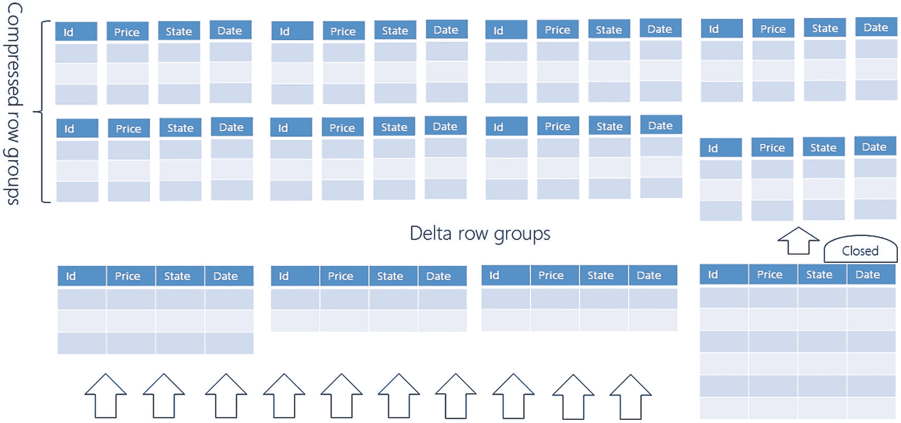

图 9-2：列存储结构包含一个采用列存储格式的压缩区域和一个采用行存储格式的输入区域（增量）

在 Azure SQL 中，列存储结构中的数据行被划分为行组，每个行组最多包含一百万行。一百万行提供了足够的值以实现良好的压缩效果，同时行数也不会过多，便于将行组作为独立单元进行操作。行组可以放置在两个区域：

*   **压缩区域**：包含许多以列存储格式组织的行组，这些行组中的列段被高度压缩。理想情况下，所有行组都应压缩在此区域。
*   **增量存储区域**：包含一个或多个以行存储格式组织的行组。这是一个临时缓冲区域，用于存放等待被压缩并移动到压缩区域的行。

如果你的数据库中已有列存储索引，可以使用以下系统视图查找行组：

```sql
SELECT * FROM sys.columnstore_rowgroups;
```

压缩行组中的列被组织成列段，该段包含行组中指定列的所有值。此段被高度压缩，所有值存储在一个连续的物理位置。每个列段都包含描述段中最小和最大值的统计信息。这是 Azure SQL 引擎可用于优化列存储结构上的报表和分析查询性能的重要信息。我们可以使用以下视图轻松查找 Azure SQL 数据库中现有的列段：

```sql
SELECT * FROM sys.columnstore_segments;
```

压缩区域应包含超过 95% 的数据，并且压缩后的数据不应被更改。修改压缩区域中的数据是不可取的，因为 Azure SQL 需要解压段中的所有值以更新其中一个值，然后再次压缩所有内容。

列存储结构中还有一个称为增量存储的区域。增量存储包含少量以经典行存储格式（或前一章描述的 Hobit）组织的行组。该区域的主要目的是在数据被压缩之前缓冲新输入和更改。将每个新行拆分到每一列并重新分配值到相应的列段是一种低效的数据插入策略。因此，所有新行都插入到行存储增量区域，它们会一直保留在那里，直到行组达到一百万行。一旦增量存储中的行组被填满，它就会 `关闭` 新的更改，后台进程将开始将此行组转换为列存储格式并移动到压缩区域。目标是将尽可能多的行组从增量存储移动到压缩存储，而增量存储应包含少于 5% 的行。

理论上，我们可以在增量存储中只有一个行组。然而，单个行组可能会影响并发性，因为一个正在插入数据的事务可能会锁定该行组，其他试图插入数据的请求将需要等待第一个事务释放锁。因此，列存储结构会创建新的行组以方便并发插入。

### 在列存储中更新值

如前所述，更新压缩的列存储数据并非理想操作。列存储格式并非只读，但与经典的行存储相比，更新操作有更大的性能损耗。Azure SQL 进行了一些增强以优化压缩数据的更新。

其中一个优化是前一节描述的增量存储。增量行组缓冲传入的行，直到有足够的行可以成功压缩它们。但增量存储并不总是被使用：Azure SQL 会决定传入数据是进入增量存储，还是直接压缩而无需缓冲。Azure SQL 使用以下规则：

*   如果插入少量（少于 102,400 行）的行，所有行都将进入某个增量行组。
*   如果使用单个 `BULK INSERT` 或 `SELECT INTO` 语句插入超过 102,400 行，Azure SQL 会将这些值直接流式传输到新的压缩行组中。

另一个需要解决的问题是如何高效地从列存储中删除行。解压 1,000,000 行以删除一行，然后压缩 999,999 行，并非可取的技术。Azure SQL 使用所谓的 `删除索引` 和 `删除位图` 来“虚拟”删除行。当你需要从压缩行组中删除一行时，Azure SQL 只会“标记该行位置”为已删除。当你从压缩列段读取行时，Azure SQL 在运行时只会忽略标记为已删除的行。这样，从列段读取数据的查询只获取存在的行，并且无需感知已删除的行在行组解压时被透明地排除。

现在只剩下一个操作需要处理：更新数据。这是最复杂的操作，因为 Azure SQL 不能仅仅将一个更新值注入到现有的、高度压缩的列段中，而不需要解压并重新压缩所有其他内容。因此，每次行更新都被表示为删除和插入操作的组合。压缩行组中旧行的值被标记为已删除，新值则插入到增量存储中。

仅当受影响的行位于压缩区域时，才会使用标记已删除行并将更新表示为删除和插入操作对的方式。如果该行位于增量存储中，它将像常规 Hobits 中的任何其他行一样被更新或删除。

### 查询列存储结构

列存储结构是处理报告查询的理想选择，这类查询使用较少的列子集，但需要扫描表中的大部分数据。以下示例展示了一个可能获得巨大性能提升的查询：

```sql
SELECT State, AVG(Price)
FROM Products
WHERE State IN ('Available', 'In Stock')
GROUP BY State
```

假设示例中的表有六个压缩行组，每个行组包含五列（即每个行组有五个列段）。

列存储格式实现的最重要优化是列段消除。Azure SQL 可以在查询处理开始之前，使用以下规则确定哪些列段对查询处理是不必要的：

*   查询中未使用的列所对应的列段将被忽略。
*   不包含查询所需值的列段将被忽略。

利用这些规则，Azure SQL 可能会丢弃大部分列段，如图 9-3 所示。

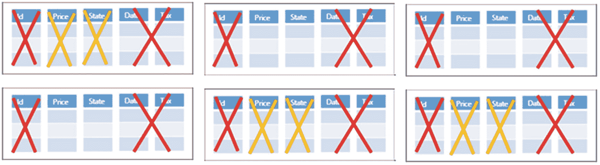

图 9-3

列存储将丢弃查询不需要的列段（红色）以及不包含查询所需数据的列段（橙色）

列 `Id`、`Date` 和 `Tax` 未在查询中使用，因此如果它们仍在磁盘上，Azure SQL 甚至不会将其加载到内存中。通过这种方式，我们将所需的 I/O 和内存占用减少到 40%，因为五个列段中有三个被忽略了。

每个列段都包含有关段中值的一些统计信息（例如，最小值-最大值）。Azure SQL 知道哪些列段包含值 `Available` 和 `In Stock`。假设这些值仅出现在六个行组中的三个行组中。Azure SQL 将丢弃不包含查询所用值的 `State` 列段，以及来自相同行组的相关 `Price` 列段。这样，Azure SQL 甚至在开始查询之前就又丢弃了一半的数据。如果大部分数据存储在压缩的列段中而不是增量存储中，这些优化将产生巨大效果。

假设此示例中使用的数据集初始大小为 100GB。假设列存储结构可以实现 10 倍压缩，并且列段消除可以在查询开始前丢弃 80% 的数据，那么我们需要处理的数据量为 2GB，而不是全表扫描。对于查询来说，这是所需的 I/O 和内存的大幅减少，可以将性能提升高达 50 倍。

另一个重要的优化是批处理查询。Azure SQL 将利用底层硬件的 SIMD 指令，对大量数据向量应用少量操作。这些数据向量是包含连续值范围的列段。这种硬件加速的批处理模式显著提高了查询性能，并且对查询以及使用它的应用程序是完全透明的。查询只会运行得更快。

### 聚集列存储索引

聚集列存储索引 (`CCI`) 是以列存储格式组织的表。我们可以在创建表时直接创建列存储索引：

```sql
CREATE TABLE Sales.Orders (
    INDEX cci CLUSTERED COLUMNSTORE
)
```

甚至可以在现有表上创建：

```sql
CREATE CLUSTERED COLUMNSTORE INDEX cci ON Sales.Orders
```

我们使用 `CCI` 来存储高度压缩的数据，其工作负载模式以读取和大量（批量加载）插入为主。这种工作负载模式在数据仓库中非常常见，因此 `CCI` 是现代数据仓库场景中非常常见的结构。然而，`CCI` 适用于任何需要追加和分析数据的场景，例如物联网场景。

`CCI` 利用压缩和批处理模式执行来提升报告和分析查询的性能，这是列存储格式的主要优势。

`CCI` 特有的一个优化对提高批量加载性能非常有帮助：前文提到，加载 102,400 行将得到特殊处理，并直接压缩所有传入数据。这种直接压缩可以提升数据加载过程的性能，因为任何需要保存到磁盘的数据页都会立即被压缩。较小的插入操作会进入增量存储，在那里缓冲，然后被压缩并移动到压缩的列存储区域。如果您的工作负载产生了许多不符合关闭标准的打开行组，可以使用以下语句合并它们：

```sql
ALTER INDEX cci ON Sales.Orders REORGANIZE
```

`CCI` 重组操作是一种轻量级的非阻塞操作，它将合并和压缩打开的增量行组，而不会对您的工作负载产生重大影响。

### 非聚集列存储索引

非聚集列存储索引 (`NCCI`) 是在 Hobits 之上创建的、以列存储格式组织的索引。这使得 Azure SQL 在市场上相当独特，因为它允许在同一张表上同时存在列存储和行存储索引。图 9-4 展示了一个经典的行存储表，包含七列，以及一个额外的列存储结构，其中我们提取了三列的值并将其压缩为列式格式。

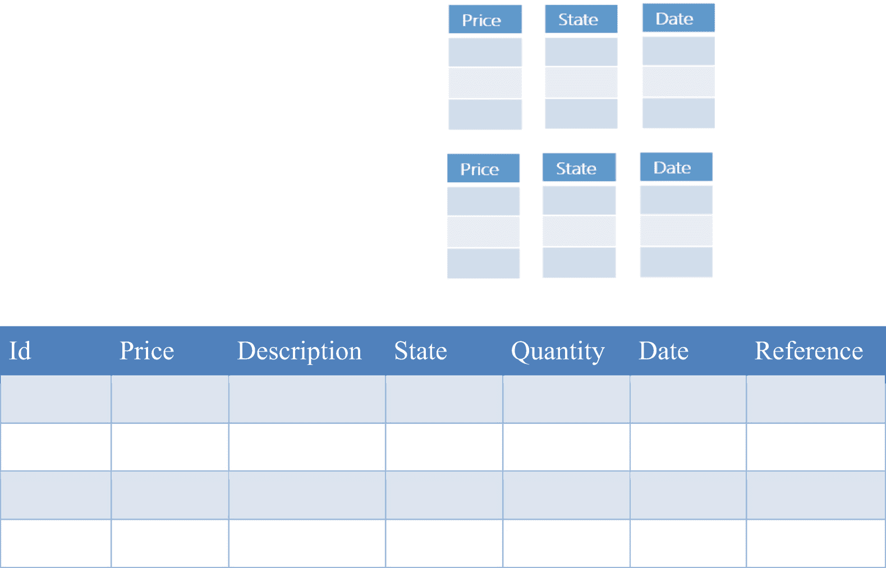

图 9-4

带有额外列存储索引 (`NCCI`) 的经典行存储表，该索引建立在此表的三列之上

`NCCI` 的主要目的是优化现有行存储表中列子集上的分析和报告查询，而无需更改原始表结构。

可以使用以下定义在表中创建 `NCCI`：

```sql
CREATE TABLE dbo.Sales (
    INDEX ncci NONCLUSTERED COLUMNSTORE (Price, Quantity, SalesID)
)
```

通过在经典表上创建 `NCCI`，您可以让 Azure SQL 为事务型或分析型查询选择最佳格式：

*   如果运行选择单行或少量行的查询，Azure SQL 将使用底层的行存储表。数据库将利用索引查找或范围扫描操作，这非常适合此场景。
*   如果运行扫描整个表并聚合数据的报告，Azure SQL 将从 `NCCI` 索引中读取信息，利用列段消除和批处理模式执行来快速处理整个表。

任何更新、删除或插入操作都会立即反映在底层的行存储表中，而 `NCCI` 将通过增量存储进行更新。这种双重更新可能会减慢您的事务型工作负载，但如果需要在提升表的报告能力和事务型语句速度之间做出权衡，这应该是可以接受的。

## 内存优化表

Azure SQL 提供了内存优化表功能，可极大地提升您的 OLTP 工作负载性能与可扩展性。内存优化表的主要用途是加速类似 CRUD 的操作，例如选择少量行或更新、删除现有行。

有些人认为，将行数据始终保留在内存中是提升性能的关键因素。然而，这种想法过于天真，在许多情况下，这远非真正的原因。

Azure SQL 本来就是与存储在内存中的行数据协同工作的。它拥有一套出色的数据内存缓存机制（称为 `缓冲池`），能够智能地选取应从磁盘获取的最重要数据，并巧妙地淘汰近期不太需要的行，以便为更可能使用的行腾出空间。如果您的数据库小于可用内存，所有行很可能都常驻于内存中，那么您已经拥有一个“内存数据库”了。那么，问题在于：与内存优化表相比，我们获得的是何种额外的“内存优化”呢？

让我们首先了解常规表的工作方式，以及在查询处理过程中磁盘和内存是如何使用的。核心的查询处理假设基于以下前提：

*   如前所述，数据库中存储的所有数据都使用称为“页”的 `8KB` 数据结构记录在磁盘上。一个 `10GB` 的未压缩数据库最少会有大约一百万个数据页。
*   每当访问一行时，相关的数据页会被加载到内存中。Azure SQL 会尝试将尽可能多的数据页保留在内存中。这个内存区域称为 `缓冲池`。
*   如果数据库大于可用内存，`缓冲池` 将无法缓存所有数据，因此页必须从磁盘获取，如果被修改，则需写回磁盘。每个页都作为一个原子性的 `8KB` 单位进行读写。有时，数据库可以通过单次 IO 操作读取更大的磁盘块（即所谓的预读操作）来优化 IO 性能。
*   查询中最昂贵的操作是在内存和磁盘之间传输 `8KB` 页。
*   应最小化内存与磁盘之间的数据传输。数据库引擎应尽其所能避免不必要的 IO 交互。

Azure SQL 必须协调工作负载，以最小化 IO 操作的次数。让我们来看看两个线程/查询更新两个 `8KB` 页上的行的情况。我们需要决定在更改被确认（提交）之前，如何将其与其他查询隔离。我们有两种处理并发的方法：

*   *悲观*：我们会阻塞其他希望访问已被另一线程修改的行的线程，直到修改线程决定保存或放弃更改。
*   *乐观*：我们允许其他线程访问被修改行的原始版本。我们需要为将被修改的行创建一个副本，该副本将成为仅对当前线程可用的“私有版本”，而其他线程则访问原始行。

理想情况下，我们应该持乐观态度，因为悲观方法会阻塞其他线程，这意味着更低的性能、并发性和可扩展性。但我们需要了解两种方法的优缺点。

### 一个关于乐观并发的故事

让我们看看数据库如何通过乐观并发处理更新。图 9-5 展示了位于同一 `8KB` 页上的两行分别被两个线程（或事务）`Tx[1]` 和 `Tx[2]` 修改，以及另一个具有乐观并发的线程 `Tx[3]` 的示例。对于每次更改，我们都需要创建一个行的新版本，该版本将成为进行修改的线程的私有副本。在事务提交更改并使更新后的版本对所有其他事务可用之前，这些副本将保持私有。在此期间，其他事务应继续使用原始页中可用的行原始版本。

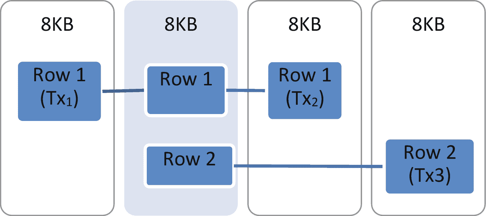

图 9-5

为每个进行更改的事务创建已更新行的新版本

一旦 `Tx[1]` 提交了对行 1 的更改，Azure SQL 能做的最简单的事情就是声明旧数据页无效并使用新页。因为将部分页的内容复制回原始的 `8KB` 页会非常困难。`Tx[2]` 同样在处理行 1 的私有副本，它将无法提交自己的更改，因为它更新的版本已不再有效。一旦 `Tx[2]` 尝试提交更改，它将被回滚，并且需要用最新的有效数据重试该操作。这可能是预期的结果，因为两个事务都试图在未独占锁定行的情况下更新行。如果发生冲突，重试是唯一的解决方案。除此之外，还有另一个可能意想不到的副作用。`Tx[3]` 将无法提交自己对行的更改，即使这些更改是在与行 1 不同的行上进行的，因此并未与 `Tx[1]` 更新的行 1 发生冲突。因为二进制内容已更改，并且页面可能被拆分为两个新页面，Azure SQL 无法轻易从新的有效页中获取已更改行的二进制内容。因此，该事务也将被回滚。

此外，创建带有临时行的新页面也会对性能产生影响。Azure 有一个称为“`检查点写入器`”的后台进程，负责将修改过的内存页保存到底层存储。如果我们生成了大量临时页面，它们将被保存到磁盘，然后在回滚后，原始内容必须再次保存。在这种情况下，临时生成的页面会造成更大的损害，我们可能需要阻止这种情况发生。

### 我们应该成为悲观主义者吗？

由于 `8KB` 页是数据传输的主要单位，更新行的事务可能会对整个页加锁，防止其他事务进行更改，因为这些更改很可能被回滚并导致额外的 IO。锁机制是一种悲观方法，有助于防止由于*竞争条件*而可能对单个页面造成的损害。

正如您在第 7 章所学，通常数据库通过使用悲观并发控制来防止过多 IO 操作的风险。每个事务都会获取锁或闩锁（闩锁只是锁的一个更轻量级的版本），以确保一个潜在共享的行或数据页的某个版本专门用于正在修改它的线程。其他希望修改同一页面上数据的线程会暂时被行锁或页闩锁阻塞，直到另一个线程完成修改。线程无法修改相同的行，它们会被阻塞。这样，我们避免了创建新页面和导致额外 IO 的需要，但我们降低了并发性并影响了性能。

现在，让我们想象一下，我们可以忽略磁盘 IO，并且没有需要为临时更改也持久化存储的 `8KB` 页面。我们可以采用高级的乐观并发，仅使用廉价的内存复制操作轻松生成新的行版本。这只有在我们能确保表数据将放置在内存中，无需在 `缓冲池` 和磁盘存储之间进行数据传输，并且没有 `8KB` 容器导致行之间存在依赖关系时，才可能实现。内存优化表提供了这些保证。

内存优化表是我们知道数据将位于内存中的表，因此我们可以应用乐观并发，并允许大量的并发更新。这是内存优化技术的主要优势，也是与经典（传统）表的关键区别。


## 内存优化表

现在你已经理解了内存优化技术的主要优势，我们可以开始使用它们了。你可以通过将表标记为内存优化来利用其功能：

```
CREATE TABLE dbo.Cache
(
[key] INT IDENTITY PRIMARY KEY NONCLUSTERED,
data NVARCHAR(MAX)
)
WITH (MEMORY_OPTIMIZED=ON)
```

你唯一需要做的更改是添加一个包含属性 `MEMORY_OPTIMIZED=ON` 的 `WITH` 子句。启用此属性后，数据行将始终保留在内存中，不再使用数据页，并且会在表数据上启用乐观并发等内存优化功能。

内存优化表有三种类型：

*   内存优化非持久仅限架构的表。这些表与临时表非常相似。表架构在重启或可能的系统崩溃后将被保留。Azure SQL 会在重启后重新创建表结构，但不会保留内容。这些表的主要用途是缓存场景（如 ASP.NET 会话状态）、作为复杂数据处理的中间存储以及数据的快速加载（即所谓的暂存表）。

*   内存优化持久表，其架构和数据即使在进程崩溃或故障转移后也会被保留。Azure SQL 将确保将最小信息集发送到日志并持久化，因此数据能在系统崩溃后得以保留。这些表在逻辑上等同于带有内存优化增强功能的经典表，用于提升现有行存储表的性能。

*   内存优化列存储表是列存储结构与内存优化表的结合。其主要场景是在同一张表上结合分析型和事务型负载。这种组合被称为混合事务分析处理。

在下面的示例中，你可以看到如何创建一个用作缓存的内存优化表：

```
CREATE TABLE dbo.Cache
(
[key] INT IDENTITY PRIMARY KEY NONCLUSTERED,
data NVARCHAR(MAX)
)
WITH (MEMORY_OPTIMIZED=ON, DURABILITY=SCHEMA_ONLY)
```

你可能会疑惑，既然有其他专门的解决方案（如 Redis 或 Cosmos DB）通常更适合缓存，为何还要使用 Azure SQL 内存优化表来创建缓存解决方案。请记住，软件开发中最好的建议之一就是保持简单。如果你的项目已经在使用 Azure SQL，能够直接在数据库中创建自定义的事务性缓存机制，而无需借助其他技术，可以大大简化你的解决方案，同时降低维护成本，因为你无需学习和维护另一门技术。除此之外，内存优化表还与 Azure SQL 的所有其他功能深度集成。例如，你可以结合行级安全和内存优化表来创建安全的缓存解决方案。

你可以使用两个 `WITH` 选项来定义数据是否即使在数据库崩溃时也会被持久化：

*   `DURABILITY=SCHEMA_ONLY` 定义非持久表，如果 Azure SQL 数据库重启，只有表结构会被重新创建。

*   `DURABILITY=SCHEMA_AND_DATA` 定义持久表，表结构和数据在故障转移或崩溃后都会保留。

内存优化表的列存储格式必须通过在内存优化表内定义聚集列存储索引来指定，如下例所示：

```
CREATE TABLE Accounts (
AccountKey int NOT NULL PRIMARY KEY NONCLUSTERED,
Description nvarchar (50),
Type nvarchar(50),
UnitSold int,
INDEX cci CLUSTERED COLUMNSTORE
) WITH (MEMORY_OPTIMIZED = ON, DURABILITY = SCHEMA_AND_DATA)
```

列存储内存优化表结合了双方的优势——能够将数据放入内存的极快分析和压缩能力，以及内存优化表提供的高并发和极快的数据摄入与更新能力。这里唯一的风险是你可以处理的数据量。经典的列存储索引在内存中分析所有数据；但是，如果列段无法放入内存，它允许你将它们保留在磁盘上。而内存优化列存储则要求所有数据必须驻留在内存中。由于 Azure SQL 会为内存优化数据保留大约 60% 的可用内存，你需要确保你的数据能够放得下。考虑到在列存储分析场景中我们讨论的是大量数据，如果你不确定数据能否全部放入内存，请使用基于磁盘的表。

因此，内存优化聚集列存储索引覆盖的是一个特定的利基场景。事实上，对于 HTAP 场景，通用方法通常是使用带有 NCCI 索引的经典行存储表，而内存优化聚集列存储索引仅用于对性能要求极高的负载。例如，如果你需要能够每秒处理多达 500 万行数据，就像本章最后引用的文章《使用 M 系列 Azure SQL 数据库扩展 IoT 工作负载》中所描述的那样，你将肯定需要用到内存优化聚集列存储索引。

当我们讨论内存优化存储时，无法将索引排除在这个讨论之外。内存中的行是分散在内存空间中的对象，需要一些结构将它们绑定在一起。这些结构就是索引。每当你创建一个内存优化表时，你至少需要拥有一个索引。

在前面的例子中，你看到了 `NONCLUSTERED` B 树索引和 `CLUSTERED COLUMNSTORE` 索引。还有另一种特定于内存优化表的索引类型，即 `NONCLUSTERED HASH` 索引，如下例所示：

```
CREATE TABLE [dbo].Employees WITH (BUCKET_COUNT = 100000),
[EmpName] varchar NOT NULL,
[EmpAddress] varchar NOT NULL,
[EmpDEPID] [int] NOT NULL,
[EmpBirthDay] [datetime] NULL
) WITH (MEMORY_OPTIMIZED = ON, DURABILITY = SCHEMA_AND_DATA)
```

`NONCLUSTERED HASH` 索引是一个内存中的哈希表，它使用列值作为键（本例中是 `EmpID`），并包含一个指向表中实际行的指针列表。每个哈希表由固定数量的槽（哈希桶）组成，每个槽包含一个指向实际行的指针数组。具有相同哈希值的行指针被链接成一个列表，代表它自己的哈希桶。

桶计数必须在创建索引时指定，并影响每个桶中指针列表的长度。不同键值的数量与哈希桶数量的比率代表了预期的平均桶链表长度。链表越长，基于键查找行所需的操作就越多。

桶计数应在索引键中不同值数量的 1 到 2 倍之间。实际上，很难估算列中不同值的数量；但是，如果 `BUCKET_COUNT` 的值在索引列中实际值数量的 10 倍以内，你将获得良好的性能。请注意，高估通常比低估要好。如果一段时间后你发现比率不佳，你可以随时用新的桶计数重建索引。


### 访问内存优化表

内存优化表的另一个优势在于，它们可以像任何其他经典表一样被访问。你可以使用相同的 Transact-SQL 查询来连接内存优化表、列存储表和经典的 Hobbits 表。

列存储、内存优化表、JSON 和图形等功能之间的互操作性是 Azure SQL 的核心价值主张之一。任何针对特定场景进行专门设计或优化的功能都将提供相同或相似的访问方法。

内存优化表采用乐观并发控制，每当某个事务更新行时，它都会快速创建该行的新版本。这样，更新数据的事务可以获得其私有的行版本，而不会被读取器阻塞，也不会阻塞其他写入器。

图 9-6 显示了三行：`r1` 有三个版本，`r2` 有两个版本，`r3` 有四个版本。每个版本都是由某个更新该行的事务创建的。注意，行周围没有 8KB 边界，因此更新一行不会影响其他行的风险。

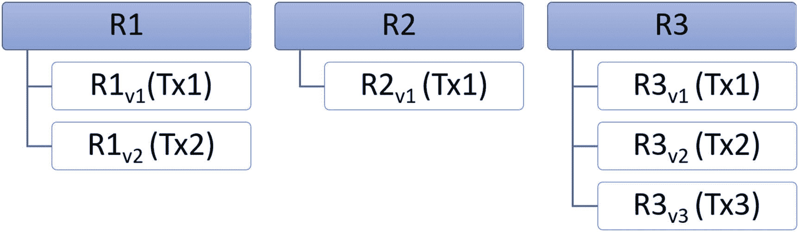

图 9-6

每当某个事务更新行时，就会创建新的行版本

这种行版本控制对 Azure SQL 中使用的一些事务隔离级别有影响。基于磁盘的表允许你在确定这是你想要的操作时，读取行的临时未提交值，并绕过锁。这在内存优化表中是不可能的，因为同一行可能存在多个未提交的副本，而 Azure SQL 不知道你想使用哪个版本。

此外，读取已提交的行也不像使用常规表那样简单。如果你想读取已提交的行，你的事务总是需要检查当前行是否确实是最新版本，或者是否有某个事务已经提交了一个新的公开版本。这可能会带来巨大的性能开销，而你肯定希望避免这种情况。

解决方案是在事务开始时使用行的已提交版本，这看起来像是表数据的快照。在事务开始时与数据快照配合工作的事务隔离级别称为 `SNAPSHOT` 隔离级别。

如果你需要使用 `READ COMMITTED` 或 `READ UNCOMMITTED` 事务隔离级别，你应该显式地在内存优化表上放置快照隔离提示，以仅针对该表覆盖它：

```sql
SET TRANSACTION ISOLATION LEVEL READ COMMITTED;
GO
BEGIN TRANSACTION;  -- 显式事务。
-- Employees 是一个内存优化表。
SELECT * FROM
dbo.Employees  as o  WITH (SNAPSHOT)  -- 表提示。
COMMIT TRANSACTION;
```

`WITH(SNAPSHOT)` 提示指示 Azure SQL 将表中的值解释为执行时数据状态的快照。此隔离级别忽略期间可能发生的更改。在其他隔离模式下，此提示将防止出现代码为 `41368` 的错误。

作为查询提示的替代方法，你可以使用数据库选项，该选项会在需要时自动将内存优化表的隔离级别提升为快照：

```sql
ALTER DATABASE current
SET MEMORY_OPTIMIZED_ELEVATE_TO_SNAPSHOT = ON;
```

如果你正确设置了事务隔离级别，那么在查询内存优化表时，可以在 DML 语句中使用，没有太多限制。

### 本机编译代码

Azure SQL 解释用于处理数据的 T-SQL 代码批处理。这意味着查询批处理（一个或多个 T-SQL 语句）会被解析，然后批处理中的每个查询都被编译成一个执行计划，该计划被分解为运算符（例如，扫描、连接、排序），然后执行这些运算符来获取或更新行。这种查询处理策略在处理内存优化数据时可能是一个巨大的瓶颈。尽管你将数据保存在内存中并使用了最少的锁，但运算符链仍将使用经典机制逐行获取和处理数据。

Azure SQL 允许你使用本机编译模块来提高 T-SQL 代码的性能。你可以将 Azure SQL Database 中的本机编译模块想象为定制的 C 程序——是的，没错，就是 C 程序！——它们处理你的数据。Transact-SQL 代码将被预编译为本地 .dll（动态链接库），然后由 Azure SQL 引擎执行以操作数据。想象一下，你有一个将内存行作为列表或迭代器访问的 API，并且你想创建一些 C 代码来遍历这些行并应用某些处理（类似于 .NET 技术中的 LINQ 查询）。这可能是处理数据最快的方式，但编写起来可能很困难。

由于编写 C 模块来操作数据并非易事，为了消除复杂性同时仍让你能够提升性能，Azure SQL Database 允许你以声明方式编写访问内存优化表中行的标准 T-SQL 代码。这段 T-SQL 代码将被转换为使用内部 API 访问表行的等效 C 代码，并编译成本地可执行文件，在 Azure SQL 数据库进程中执行。这样，你仍然使用 T-SQL 代码来表达你想要做什么，而 Azure SQL Database 处理了通过 C 语言访问 API 的所有复杂性，从而释放了极致性能。

Azure SQL 允许你编写将被编译成本地可执行文件的 SQL 存储过程、函数和触发器。本机编译代码可能比经典对应物快几个数量级。唯一的限制是它们只能访问内存优化表并使用 T-SQL 语言的一个子集。

本机编译存储过程是访问和修改内存优化表数据的常用方法。以下示例展示了一个表示本机编译存储过程的模板：

```sql
CREATE PROCEDURE myProcedure(@p1 int NOT NULL, @p2 nvarchar(5))
WITH NATIVE_COMPILATION, SCHEMABINDING
AS BEGIN ATOMIC WITH
(TRANSACTION ISOLATION LEVEL = SNAPSHOT,
LANGUAGE = N'us_english')
/* 过程代码放在这里 */
END
```

放置在此过程主体中的任何 T-SQL 代码都将被解析，生成等效的 C 代码，并编译成一个小的动态链接库 (.dll) 文件。

本机编译过程的两个主要组成部分是：

*   `WITH` 子句：定义过程属性，例如将过程标记为本机编译并指定架构绑定。架构绑定意味着只要存储过程存在，就不能更改它引用的表。这些是唯一必需的选项，但你也可以指定其他选项，例如 `EXECUTE AS` 等。

*   `ATOMIC` 块：代表一个工作单元，该单元将被处理或取消。在原子块中，你需要指定选项，如隔离级别或语言，因为这些设置将被编译到动态链接库中。

Azure SQL 允许你编写本机编译函数和触发器。以下清单显示了一个本机编译函数的示例。此函数获取格式化为 JSON 文本的字符串，对其进行解析，并将 JSON 对象中的属性作为表列返回：


## 时态表

我们在第 8 章中已经看到，Azure SQL 不使用原生 JSON 类型。JSON 被存储为 `NVARCHAR` 字符串，需要在查询时进行解析。通过使用本机编译函数，我们可以明确定义要使用的解析规则，并创建一个内置的原生 JSON 解析器。

```sql
CREATE FUNCTION PeopleData(@json nvarchar(max))
RETURNS TABLE
WITH NATIVE_COMPILATION, SCHEMABINDING
AS RETURN (
SELECT Title, HireDate, PrimarySalesTerritory,
CommissionRate, OtherLanguages
FROM OPENJSON(@json)
WITH(Title nvarchar(50),
HireDate datetime2,
PrimarySalesTerritory nvarchar(50),
CommissionRate float,
OtherLanguages nvarchar(max) AS JSON)
)
```

本机编译函数的调用方式与其他任何函数相同。我们可以使用标准的 `CROSS APPLY` 运算符来提供一个值作为函数的参数，并将结果与主行进行连接：

```sql
select p.FullName, p.EmailAddress, j.Title, j.CommissionRate
from Application.People p
cross apply PeopleData(p.CustomFields) j
```

使用本机编译代码访问内存优化表是推荐的方式，因为它提供了最佳的性能和可扩展性。

数据库中的常规表包含数据行的最新版本。每当某个查询更新值时，旧值就会被覆盖。这通常是预期且期望的行为，但在某些情况下，您可能希望能够访问旧值。一些例子可能是

*   错误更正 – 有人意外更改或删除了表中的某一行，您需要纠正或撤销此更改。
*   历史分析 – 您需要分析表中随时间发生的变化。
*   审计 – 您需要查明谁在何时更改了哪些值。

时态表为您的数据添加了时间维度，因此它们可以保留所有已更改数据以及更改发生时间的信息。这完全是自动且透明地完成的，这要归功于一个系统管理的 `History Table`（历史表）。`History Table` 是一个影子表，其列结构与主表完全相同。每当主表中的某些行（如图 9-7 所示）被更改（删除或更新）时，旧版本就会连同跟踪这些行生命周期的附加信息一起写入历史表。

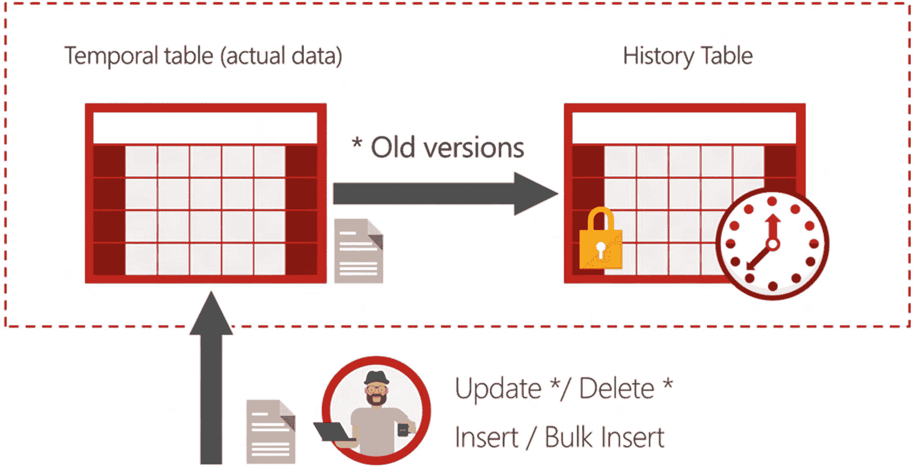

图 9-7

时态表自动将将要更新或删除的行发送到单独的历史表中

仅插入或选择数据的查询将只操作主时态表（其中存储的是数据的当前版本），并且不会影响历史表。时态表会修改那些更新或删除数据的查询行为，在主表中的行被更新之前，静默地将当前行值发送到历史表。这个过程完全透明，您可以继续使用标准的 T-SQL 查询来访问数据。

在更改之前将旧行移动到历史表中，是触发器最常见的应用场景之一。时态表通过自动移动行，为此行为提供了原生支持。在大多数情况下，时态表中使用的方法应比等效的触发器快得多。

### 查询时态数据

将旧行从时态表自动移动到历史表很重要，但这并不是时态表带来的唯一好处。即使您在历史表中拥有所有必需的行版本及其有效期范围，查询历史数据仍然不容易。如果您想查看表在过去某个时间点的样子，您需要从历史表中获取一些旧行值，同时也需要从主表中获取一些行，因为它们可能在当前时间仍然有效。

Azure SQL 使您能够使用特殊语法来选择某个时间点的数据，并为您处理时态查询的复杂性。除了标准的 `SELECT` 查询（将从主表读取当前行）之外，Azure SQL 还允许您使用时态运算符（如图 9-8 所示），这些运算符可用于获取过去某个时间点、特定时间段内、某行的所有版本等的行版本。

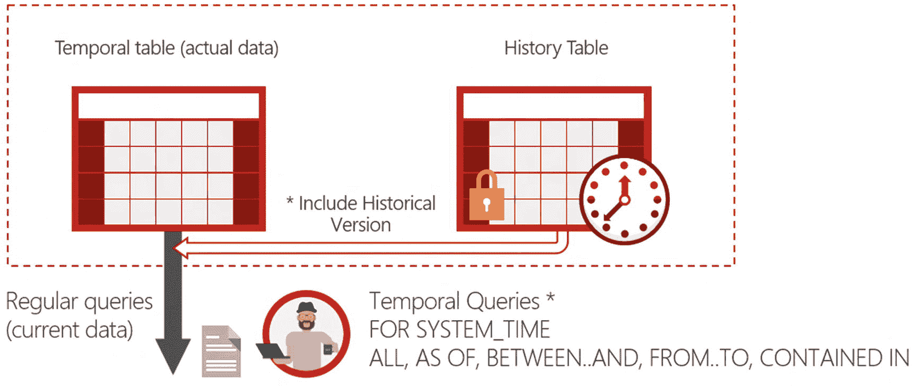

图 9-8

时态表使您能够为时态查询获取历史数据

Azure SQL Database 提供了几个可应用于时态表的运算符。最常见的是

*   `FOR SYSTEM_TIME AS OF <datetime>` – 查询将读取表在指定过去日期时间的内容。
*   `FOR SYSTEM_TIME ALL` – 查询将读取过去任何时间点存在的所有行。

还有更多可用的运算符，您可以在本章末尾的参考资源中找到更多细节。根据时态运算符和提供给运算符的值，Azure SQL 将决定数据是从主表读取，还是需要从两个表读取，并创建正确的计划来获取和合并来自两个表的结果集。

例如，以下查询将获取在指定时间点具有指定主键值的 `Employee`：

```sql
SELECT *
FROM Employee FOR SYSTEM_TIME AS OF @asOf AS History
WHERE EmployeeID = @EmployeeID
```

Azure SQL 会将 `@asOf` 变量的日期时间值与 `Employee` 行被更改的日期进行比较。如果最后一次更改发生在该日期之前，它将从主表获取数据。否则，它将在历史表中找到在指定时间有效的行。

假设有人意外更新了某个 `Employee` 行。我们需要通过获取在值正确的那个时间点的版本中的值，并覆盖当前值来纠正这个错误。以下查询可以执行此更正：

```sql
UPDATE
E
SET
Position = History.Position,
Department = History.Department,
Address = History.Address,
AnnualSalary = History.AnnualSalary
FROM
Employee AS E
JOIN
Employee FOR SYSTEM_TIME AS OF @asOf AS History
ON E.EmployeeID = History.EmployeeID
WHERE
E.EmployeeID = @EmployeeID
```

我们正在更新 `Employee` 表中具有指定 `Employee` 主键值 (`@EmployeeID`) 的一行。我们使用 `FOR SYSTEM_TIME AS OF` 子句，将该行与同一主键值在指定时间 (`@asOf`) 的行版本进行连接。然后，我们只是用有效版本中的值覆盖了最近版本中的值。请注意，错误的值在被覆盖时并非没有留下痕迹。当错误被纠正后，错误的值会被移入历史表，您可以追踪它们是何时被纠正的，以及错误是什么。历史表是可信的单一来源，您可以在其中找到关于时态表上所做任何更改的信息。


### 配置时态表

时态表与历史表是相互独立的。你可以通过添加不同的索引来分别配置和优化它们。可用于提升时态表性能的最佳配置方案是：

*   包含当前数据的表，如有可能，应实现为内存优化的架构和数据表。
*   历史表应使用 `聚集列存储索引` 实现。

如果你使用的是 `业务关键型` 服务层级，内存优化表将在插入、更新和删除数据的工作负载中为你提供最佳性能，而这正是包含当前行的表的主要应用场景。如果你认为所有行无法全部装入内存，则不应使用内存优化表，因为如前面章节所述，将所有行保留在内存中是内存优化表的要求。

`列存储` 格式是历史表的最优解决方案，因为你可以拥有许多具有相同值的列单元格。在很多情况下，你可能只更新少数几列，而其他单元格保持不变。时态表会将整个前一行物理复制到历史表中，这意味着历史表中不同版本行里的未更改单元格将具有相同的值。如果 `列存储` 格式能够用一个描述该值出现行范围的单一标记来替换一组具有相同值的单元格，那么它就能实现最高效的压缩。在此场景下，在历史表上创建的 `聚集列存储索引` 可以提供极高的压缩率，并提升时态表上的历史分析性能。

假设你有一个用于存储历史数据的 `DepartmentHistory` 表，以下索引可能会提升在时态历史表上运行的查询性能：

```
CREATE CLUSTERED COLUMNSTORE INDEX cci_DepartmentHistory
ON DepartmentHistory;
CREATE NONCLUSTERED INDEX IX_DepartmentHistory_ID_PERIOD_COLUMNS
ON DepartmentHistory (SysEndTime, SysStartTime, DeptID);
```

`聚集列存储索引` 将在查询扫描大量历史数据时，提供高压缩率并增强分析能力。在范围列和主键上创建非聚集索引，对于提升那些访问历史中特定时间点某些行值的查询性能（例如，使用 `FOR SYSTEM_TIME AS OF` 子句）将非常有帮助。根据你运行的历史查询类型，你可能需要添加第一个、第二个或同时添加这两个索引。

另一项重要的优化是数据库历史记录保留策略。你可以定义历史数据应保存在历史表中的时长。时态表允许你使用 `HISTORY_RETENTION_PERIOD` 设置来定义历史记录的生存期：

```
ALTER TABLE dbo.WebsiteUserInfo
SET (SYSTEM_VERSIONING = ON (HISTORY_RETENTION_PERIOD = 9 MONTHS));
```

此设置意味着，历史表中所有超过 9 个月的记录将被自动删除，以避免无限增长。你还可以使用以下数据库属性全局启用或禁用这些规则：

```
ALTER DATABASE current
SET TEMPORAL_HISTORY_RETENTION ON
```

此数据库级选项使你能够为数据库中的所有表开启或关闭保留策略。

## 如果你想了解更多

本章描述的 `列存储` 表和索引、内存优化表以及时态表，使你能够从数据库中获取更多价值。前一章描述的通用型解决方案适用于大多数场景；然而，如果你能识别出工作负载的具体特性，本章所述的表和索引将使你能够将应用程序的性能提升数个数量级：

*   列存储索引：概述 – [`https://docs.microsoft.com/sql/relational-databases/indexes/columnstore-indexes-overview`](https://docs.microsoft.com/sql/relational-databases/indexes/columnstore-indexes-overview)
*   列存储索引 - 数据加载指南 – [`https://docs.microsoft.com/sql/relational-databases/indexes/columnstore-indexes-data-loading-guidance`](https://docs.microsoft.com/sql/relational-databases/indexes/columnstore-indexes-data-loading-guidance)
*   开始使用列存储实现实时操作分析 – [`https://docs.microsoft.com/sql/relational-databases/indexes/get-started-with-columnstore-for-real-time-operational-analytics`](https://docs.microsoft.com/sql/relational-databases/indexes/get-started-with-columnstore-for-real-time-operational-analytics)
*   Niko Neugebauer 博客列存储系列 – [`www.nikoport.com/columnstore/`](http://www.nikoport.com/columnstore/)
*   内存中 OLTP 与内存优化 – [`https://docs.microsoft.com/sql/relational-databases/in-memory-oltp/in-memory-oltp-in-memory-optimization`](https://docs.microsoft.com/sql/relational-databases/in-memory-oltp/in-memory-oltp-in-memory-optimization)
*   内存优化的 tempdb 元数据 – [`https://docs.microsoft.com/sql/relational-databases/databases/tempdb-database#memory-optimized-tempdb-metadata`](https://docs.microsoft.com/sql/relational-databases/databases/tempdb-database%2523memory-optimized-tempdb-metadata)
*   使用内存中 OLTP 优化 JSON 处理 – [`https://docs.microsoft.com/sql/relational-databases/json/optimize-json-processing-with-in-memory-oltp`](https://docs.microsoft.com/sql/relational-databases/json/optimize-json-processing-with-in-memory-oltp)
*   时态表 – [`https://docs.microsoft.com/sql/relational-databases/tables/temporal-tables`](https://docs.microsoft.com/sql/relational-databases/tables/temporal-tables)
*   查询系统版本化时态表中的数据 – [`https://docs.microsoft.com/sql/relational-databases/tables/querying-data-in-a-system-versioned-temporal-table`](https://docs.microsoft.com/sql/relational-databases/tables/querying-data-in-a-system-versioned-temporal-table)
*   使用 M 系列 Azure SQL 数据库扩展 IoT 工作负载 – [`https://techcommunity.microsoft.com/t5/azure-sql-database/scaling-up-an-iot-workload-using-an-m-series-azure-sql-database/ba-p/1106271#`](https://techcommunity.microsoft.com/t5/azure-sql-database/scaling-up-an-iot-workload-using-an-m-series-azure-sql-database/ba-p/1106271)

脚注 1   2


# 10. 监控与调试

Azure SQL 及其底层的 SQL Server 查询引擎在业界广为人知，通常需要较低的管理门槛，即可让应用程序在大多数条件下、面对不同规模和形态的数据时，获得良好的性能和可靠性。

尽管如此，应用开发人员理解 Azure SQL 中查询处理的基础知识和内部机制，以及了解在开发和生产阶段可用于监控和排查性能问题的工具与功能，仍然非常重要。一般来说，掌握这些功能在两大主要场景中对我们至关重要：

1.  **理解系统在给定工作负载下的行为**：这意味着在负载测试或生产期间，观察主要的性能和可用性指标，以确保系统正常运行并能处理给定的工作负载。
2.  **深入调查可能已发生或正在发生的特定活动**：如果上一项的结果显示出某些关键行为，则需要进行深入调查。

前者是一个持续的、长期的监控场景，对于确保您的解决方案能“保持灯火通明”（稳定运行）至关重要，通常需要特定的特性，比如存储和分析海量数据点的能力，以及在关键指标超过某些阈值时触发警报的能力。在 Azure 平台上，所有服务都有一个共同的骨干用于收集给定解决方案所有组件发出的诊断信息，称为**Azure Monitor**。所有服务都可以配置为异步地将日志和指标发送到 Azure Monitor，然后 Azure Monitor 可以根据您的需求，将这些信息重定向到近实时选项（通过在 Azure 门户中可视化指标或将数据推送到 Azure Event Hub 实例进行进一步处理和警报）和更长期的分析选项（如 Azure Blob Storage 或 Log Analytics）。

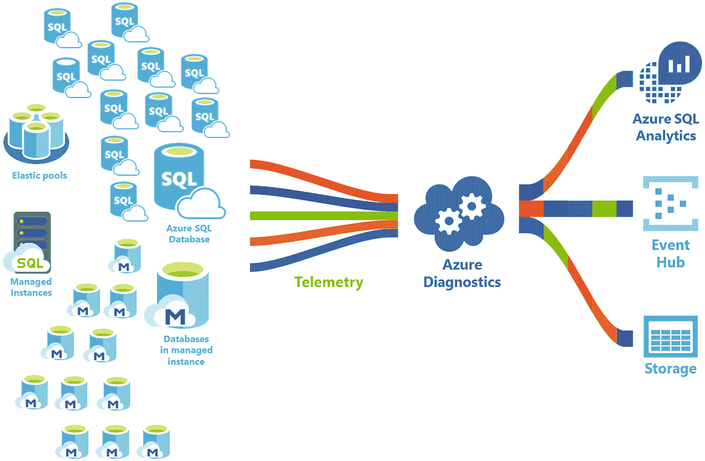

您可以通过查看此链接的官方文档获取有关此特定场景的更多详细信息：[`https://aka.ms/asdbmto`](https://aka.ms/asdbmto)。

另一个主要场景则与即时诊断和故障排查调查相关，当特定问题发生时，您可以执行这些调查，这得益于 Azure SQL 引擎提供的广泛检测能力。事实上，从连接和会话管理，到查询处理和存储引擎，服务的每一个内部子系统都在发出丰富而详细的诊断信息集，我们作为开发人员可以利用这些信息来理解单个查询是如何执行的，或者像内存管理或资源治理这样的子系统是如何运行的。

作为开发人员，我们不一定需要理解服务内部运作的每一个细节，但了解可用的基本工具和技术以确保我们能够调查查询和工作负载的性能，以及了解在使用 Azure SQL 时如何使我们的应用程序更高效，是相当重要的。

## 动态管理视图 (DMV)

动态管理视图（和函数）是一种针对 Azure SQL 端点执行 T-SQL 查询并返回状态信息的方式，这些信息可用于监控 Azure SQL 服务器或数据库实例的健康状况、诊断问题以及调整性能。

如前所述，SQL Server 引擎具有高度的可检测性，捕获了关于各种子系统如何工作的海量信息，从与底层操作系统和硬件的集成，到查询如何执行。所有这些细节都维护在数据库进程空间内的内存结构中（我们将在本章后面讨论最近随着查询存储的出现而发生的变化），并通过一层系统视图和函数提供前端访问，可以通过常规 T-SQL 命令进行查询。执行查询的登录名需要对选定的 DMV 具有`SELECT`权限，并且具有`VIEW SERVER STATE`（对于 Azure SQL 托管实例）或`VIEW DATABASE STATE`（对于 Azure SQL 数据库）权限。我们可以通过执行以下命令来授予对给定实例的访问权限：

```
GRANT VIEW DATABASE STATE TO database_user;
```

Azure SQL 支持一部分动态管理视图来诊断性能问题，这些问题可能由阻塞或长时间运行的查询、资源瓶颈、不良的查询计划等引起。在 SQL Server 实例和 Azure SQL 托管实例中，动态管理视图返回服务器状态信息。在 Azure SQL 数据库中，它们仅返回有关您当前逻辑数据库的信息。

虽然有数百个这样的视图和函数可用，但我们应该真正关注三个主要类别：

*   与数据库相关的动态管理视图（前缀为 `sys.dm_db_*`）
*   与执行相关的动态管理视图（前缀为 `sys.dm_exec_*`）
*   与事务相关的动态管理视图（前缀为 `sys.dm_tran_*`）

让我们从一些基本用例开始，这些用例在调查数据库实例情况时可能很常见。首先，您可能想了解正在运行应用程序的给定实例的当前资源利用率。您可以打开您首选的客户端工具（例如，Azure Data Studio 或 SQL Server Management Studio），指向您的数据库，并执行此查询：

```
SELECT * FROM sys.dm_db_resource_stats ORDER BY end_time DESC;
```

您将得到的结果类似于以下内容：

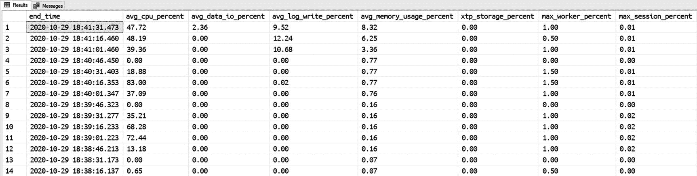

基本上，此视图返回过去一小时内数据库实例资源消耗的关键指标，粒度为 15 秒。如果这些指标中任何一个接近 100%，您通常可以选择扩展数据库服务或计算层，或者更可能的是，更深入地研究资源利用率，以了解是否有办法使您的工作负载更高效。

假设，例如，您的 CPU 利用率达到了上限：一个好的下一步是查看哪些是消耗 CPU 最多的查询，以了解是否有任何方式可以改进它们。

出于演示目的，我们将清除测试实例的过程缓存，以免被过去可能运行过的数百个其他查询干扰，并将使用此脚本执行一个简单的查询：

```
--!!! 仅用于测试目的，请勿在生产环境中执行!!!--
ALTER DATABASE SCOPED CONFIGURATION CLEAR PROCEDURE_CACHE;
-- 执行一个简单查询
SELECT * FROM [Sales].[Orders] WHERE CustomerID=832
```

在同一连接或不同的连接上，我们现在可以运行以下诊断查询，针对几个 `sys.dm_exec_*` DMV：


# 使用动态管理视图监控 Azure SQL 查询性能

```sql
--- 返回此数据库中消耗 CPU 时间最多的前 25 个查询
SELECT TOP 25
qs.query_hash,
qs.execution_count,
REPLACE(REPLACE(LEFT(st.[text], 512), CHAR(10),''), CHAR(13),'') AS query_text,
qs.total_worker_time,
qs.min_worker_time,
qs.total_worker_time/qs.execution_count AS avg_worker_time,
qs.max_worker_time,
qs.min_elapsed_time,
qs.total_elapsed_time/qs.execution_count AS avg_elapsed_time,
qs.max_elapsed_time,
qs.min_logical_reads,
qs.total_logical_reads/qs.execution_count AS avg_logical_reads,
qs.max_logical_reads,
qs.min_logical_writes,
qs.total_logical_writes/qs.execution_count AS avg_logical_writes,
qs.max_logical_writes,
CASE WHEN CONVERT(nvarchar(max), qp.query_plan) LIKE N'%%' THEN 1 ELSE 0 END AS missing_index,
qs.creation_time,
qp.query_plan,
qs.*
FROM
sys.dm_exec_query_stats AS qs
CROSS APPLY
sys.dm_exec_sql_text(plan_handle) AS st
CROSS APPLY
sys.dm_exec_query_plan(plan_handle) AS qp
WHERE
st.[dbid]=db_id() and st.[text] NOT LIKE '%sys%'
ORDER BY
qs.total_worker_time DESC
OPTION (RECOMPILE);
```

该查询返回消耗 CPU 时间最多的前 25 个查询（在我们的示例中只有一个），包含多个属性，如下图所示：

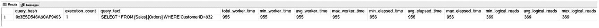

具体来说，我们获取了一个二进制哈希值，用于标识所有具有相同“形状”的查询（可能仅参数值等有所不同），一个指示该查询执行次数的值，然后是查询文本本身。接下来是一长串非常重要的指标，显示了对关键资源（如 CPU（工作线程）时间、数据页读写等）的总计、最小、平均和最大使用情况。通过更改排序列，我们可以查看哪些查询执行得更频繁（通过 `execution_count`），或者哪些查询读取或写入了更多的数据页，等等。

这个例子仅仅触及了我们可以使用动态管理视图所做事情的冰山一角，还有更多功能。我们可以调查和识别因表或索引结构设计不佳导致的性能瓶颈，监控数据库和对象大小，或者解决并发用户之间的锁定和阻塞问题等等。有关可能实现的更多详细信息，我们建议您查阅 Azure SQL 官方文档：[`https://aka.ms/asdbmwd`](https://aka.ms/asdbmwd)。

## 执行计划

在我们之前的例子中，通过这些动态管理视图检索到的列之一是返回查询执行计划的 XML 片段：

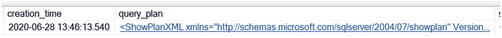

在 SQL Server Management Studio 中单击该列，会打开一个新窗口，显示类似以下内容：

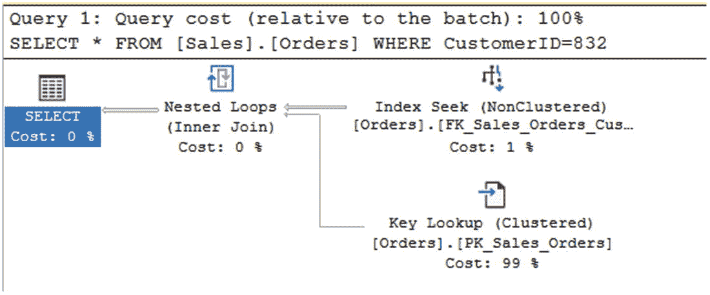

这是用于解析该特定查询的查询执行计划的图形化表示，显示了 Azure SQL 引擎为向客户端返回结果所采取的所有详细步骤。Azure SQL 有一个内存池，用于存储执行计划和数据缓冲区。当执行任何 Transact-SQL 语句时，数据库引擎首先会在计划缓存中查找，以验证是否存在针对同一 Transact-SQL 语句的现有执行计划。如果 Transact-SQL 语句在字符级别上与之前执行的、具有缓存计划的 Transact-SQL 语句完全匹配，则视为存在。Azure SQL 会重用它找到的任何现有计划，从而节省了重新编译 Transact-SQL 语句的开销。如果不存在执行计划，Azure SQL 会为查询生成一个新的执行计划，尝试在合理的时间间隔内找到资源利用率成本最低的计划。

理解此执行计划是如何创建和执行的，对于确保我们应用程序生成的工作负载针对我们的数据模型和索引策略进行了优化，或者识别出需要进行的优化至关重要。

> **注意**
> 许多现代数据库使用更专业的术语 DAG（有向无环图）而非用户友好的术语“执行计划”。例如，如果您已有使用 Apache Spark 的经验，那么 DAG 和执行计划基本上是同一回事。

根据经验法则，通过 Management Studio 可视化的执行计划应按*从右到左、从上到下*的顺序解释，以确定它们的执行顺序。在我们前面的例子中，第一步是一个 Seek 操作符，它使用在 `Orders` 表的 `CustomerID` 列上创建的非聚集索引来查找一个或多个值为 832 的行。由于查询引擎使用的索引可能不包含 select 列表中的所有列（我们在那里错误地使用了星号而不是完整的列列表），执行计划中的下一步是循环遍历第一个操作符检索到的所有行，并对每一行执行一个 Lookup 操作符，该操作符将使用 Seek 操作符检索到的聚集索引键，从 `Orders` 表上的聚集索引（`PK_Sales_Orders`）中读取所有其他列。

通过将鼠标悬停在给定的操作符上，我们可以获得有关该步骤的大量信息，例如执行模式（行模式或批处理模式）或该对象的底层存储类型（行存储 vs. 列存储），以及与之关联的 CPU 和 I/O 成本的详细描述。

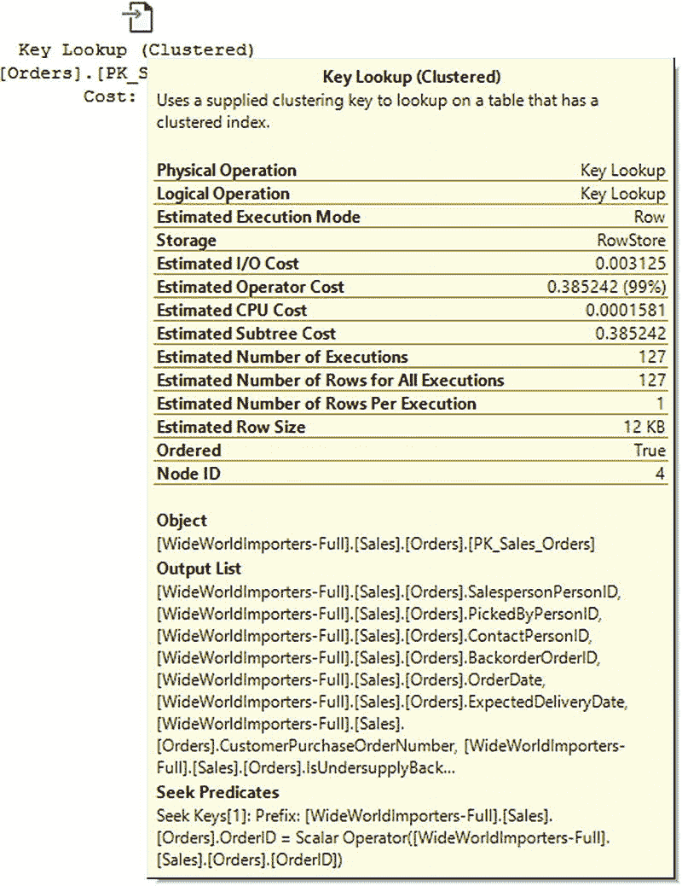

例如，我们可以看到 Key Lookup 操作符占整个查询成本的 99%，并且它被执行了 127 次（与第一个 Seek 操作符过滤的行数相同）。


## 查询优化与执行计划分析

作为开发者，我们可以开始思考如何通过仅选择真正需要的列来提高查询效率，并可能将这些列作为包含列添加到第一个操作符使用的非聚集索引中。这基本上可以完全消除这个昂贵的操作符，从而降低整体查询成本。让我们试试看！通过精确执行我们刚才描述的步骤，新的查询计划确实不再包含 `Key Lookup` 操作符，而且查看整体子树成本，它显然降到了原来的百分之一：

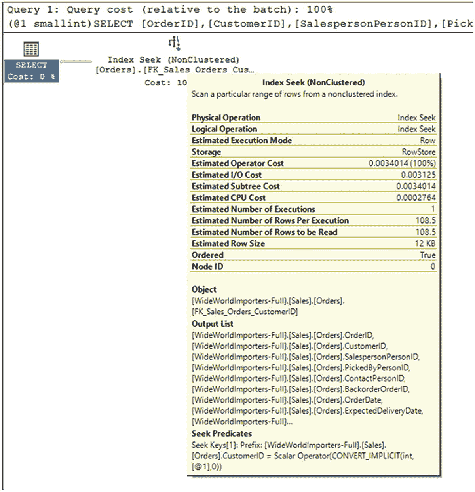

通过从 DMV 提取的指标，我们可以注意到执行时间不到原始查询的一半，逻辑页读取次数从 369 次减少到 5 次，这表明从存储读取所需的 I/O 操作更少，缓冲池中占用的空间也更少：

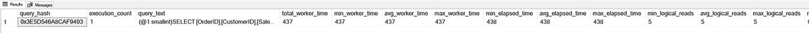

逻辑页不过是我们之前章节讨论过的页概念。每次 Azure SQL 需要读取处理查询或将结果返回给最终用户所需的数据时，它都会使用一次 I/O 操作来读取整个 8KB 的页。物理读取是指对尚未在内存中的页执行的读取操作——因此相当昂贵。逻辑读取是指对已在缓冲池（内存缓存）中的页执行的读取操作。如果一个页不在缓冲池中，它将从磁盘读取并添加到池中。因此，逻辑读取次数总是大于或等于物理读取次数。由于一个页可能被读取多次，逻辑页读取次数是衡量查询总体 I/O 消耗的良好指标。由于 I/O 是数据库中最昂贵的操作，您通常希望尽可能减少 I/O，在读写性能之间找到适合您的完美平衡。

使用 DMV 提取影响 Azure SQL 数据库的最昂贵查询的执行计划，是研究应用程序性能的好方法。在 SQL Server Management Studio 或 Azure Data Studio 等客户端工具中，您也可以在运行查询时通过选择 Management Studio 中的“包含实际执行计划”工具栏按钮（或使用 `Ctrl+M` 快捷键）或单击 Data Studio 中的“解释”按钮来获取相同的信息。

我们在此描述的内容代表了您可以采取的基础方法，用以理解 Azure SQL 引擎如何执行您的查询，以及如何优化工作负载以减少无用的资源消耗并提高整体性能。

Azure SQL 引擎创建和执行查询计划的方式是一个复杂而迷人的主题；如果您想了解更多，请阅读此处的官方文档：[`https://aka.ms/qpag`](https://aka.ms/qpag)。

## 查询存储

我们之前提到过，表示 Azure SQL 数据库状态并作为动态管理视图和函数数据来源的所有内部数据结构都保存在数据库进程内存中，因此当实例重启或发生计划内或计划外故障转移时，所有诊断信息都会丢失。自 SQL Server 2016 引入查询存储功能后，现在 Azure SQL 默认可以在重启后持久化大部分诊断信息，因为查询存储已在整个云数据库舰队中启用。此功能实际上为您提供了有关查询计划选择和性能的洞察，并通过帮助您快速找到由查询计划更改引起的性能差异来简化性能故障排除。查询存储自动捕获查询、计划和运行时统计信息的历史记录并保留以供您审查。它按时间窗口分离数据，因此您可以查看数据库使用模式并了解服务器上查询计划更改发生的时间。查询存储有效地就像一个飞行数据记录器，不断收集与查询和计划相关的编译和运行时信息。查询相关数据持久保存在内部表中，并通过一组视图呈现给用户。

它基本上包含三个主要存储桶：
*   **计划存储**，包含执行计划详细信息
*   **运行时统计信息存储**，其中保存执行统计信息
*   **等待统计信息存储**，包含有关等待统计信息的历史数据

正如我们之前讨论的，一旦创建，Azure SQL 中任何特定查询的执行计划都可能因统计信息更改、架构更改、索引更改等随时间而变化。过程缓存存储最新的执行计划，在内存压力下，计划也可能被逐出缓存。如果新创建的执行计划由于某种原因被证明是次优的，通常很难理解是什么导致了这种更改。通过为给定查询保留多个执行计划版本，查询存储可以帮助弄清楚发生了什么，并且还可以强制执行策略以指示查询处理器使用特定的执行计划。这被称为计划强制，其中应用诸如 `USE PLAN` 查询提示之类的机制，而无需更改应用程序中的查询语法。

查询存储收集 DML 语句（如 `SELECT`、`INSERT`、`UPDATE`、`DELETE`、`MERGE` 和 `BULK INSERT`）的计划。

性能故障排除期间的另一个重要信息来源是与系统等待状态相关的统计信息的可用性，基本上是收集 Azure SQL 响应用户查询所花费特定时间的底层原因。在查询存储之前，等待统计信息通常仅在数据库实例级别可用，并且很难将其与特定查询关联起来。

让我们看看查询存储如何收集其数据：当查询首次编译时，查询文本和初始计划会发送到查询存储；如果查询被重新编译，则会更新。如果创建了新计划，则会将其作为该查询的新条目添加，并保留之前的计划及其运行时执行统计信息。每次查询执行时，运行时统计信息都会发送到查询存储，并在当前活动时间间隔内在计划级别进行聚合。

在编译和检查重新编译阶段，Azure SQL 会检测查询存储中是否存在应用于当前运行查询的计划，以及是否存在与缓存中计划不同的强制计划，查询将被重新编译（这与对查询应用 `USE PLAN` 提示的方式相同）。这对用户应用程序是完全透明的。下图描述了查询处理器和查询存储之间的交互：
（此处应插入交互图描述）


# Azure SQL 中的查询存储功能

## 概述

如前所述，查询存储在 Azure SQL 中默认启用且无法关闭。其默认配置针对持续数据收集进行了优化，但你仍然可以控制一些配置参数，例如最大存储大小（默认 100MB）或用于聚合查询执行统计信息的时间间隔长度（默认 60 分钟）。如果没有特定需求，例如在希望加速处理的短期故障排除会话期间，我们建议在大多数使用场景中保留默认设置。

查询存储的内部信息通过一系列视图呈现，这些视图可用于你的诊断查询，以了解 Azure SQL 在你的特定工作负载下的行为。下图展示了查询存储视图及其逻辑关系，其中编译时信息以蓝色实体显示：

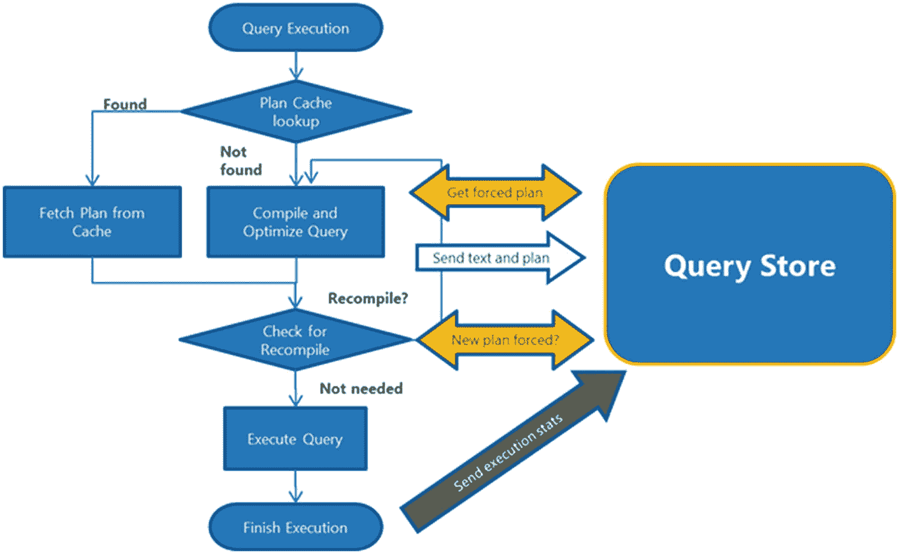

## 查询存储视图

视图名称是直观的，但让我们浏览一些主要视图，看看它们如何有助于监控和排查我们的工作负载：

*   `sys.query_store_query_text` 报告针对数据库执行的唯一查询文本，其中批处理中的每个语句都会生成一个单独的查询文本条目。
*   `sys.query_context_settings` 呈现查询执行时影响执行计划的唯一设置组合。
*   `sys.query_store_query` 显示在查询存储中被单独跟踪和强制的查询条目。
*   `sys.query_store_plan` 返回带有编译时统计信息的查询估计计划。存储的计划等同于使用 `SET SHOWPLAN_XML ON` 获取的计划。
*   `sys.query_store_runtime_stats_interval` 显示为每个执行计划在自动生成的时间窗口（时间间隔）中聚合的运行时统计信息。我们可以使用 `ALTER DATABASE SET` 语句中的 `INTERVAL_LENGTH_MINUTES` 来控制时间间隔的大小。
*   `sys.query_store_runtime_stats` 报告已执行计划的聚合运行时统计信息。捕获的指标以四种统计函数的形式呈现：平均值、最小值、最大值和标准差。

通过查询这些视图，你可以快速获取有关工作负载执行情况的详细信息；以下是一些示例。

## 查询示例

此查询返回数据库上最后执行的十个查询：

```sql
SELECT TOP 10 qt.query_sql_text, q.query_id,
qt.query_text_id, p.plan_id, rs.last_execution_time
FROM sys.query_store_query_text AS qt
JOIN sys.query_store_query AS q
ON qt.query_text_id = q.query_text_id
JOIN sys.query_store_plan AS p
ON q.query_id = p.query_id
JOIN sys.query_store_runtime_stats AS rs
ON p.plan_id = rs.plan_id
ORDER BY rs.last_execution_time DESC;
```

这些是在过去一小时内执行时间最长的查询：

```sql
SELECT TOP 10 rs.avg_duration, qt.query_sql_text, q.query_id,
qt.query_text_id, p.plan_id, GETUTCDATE() AS CurrentUTCTime,
rs.last_execution_time
FROM sys.query_store_query_text AS qt
JOIN sys.query_store_query AS q
ON qt.query_text_id = q.query_text_id
JOIN sys.query_store_plan AS p
ON q.query_id = p.query_id
JOIN sys.query_store_runtime_stats AS rs
ON p.plan_id = rs.plan_id
WHERE rs.last_execution_time > DATEADD(hour, -1, GETUTCDATE())
ORDER BY rs.avg_duration DESC;
```

这些是在过去 24 小时内执行了更多 I/O 读取的查询：

```sql
SELECT TOP 10 rs.avg_physical_io_reads, qt.query_sql_text,
q.query_id, qt.query_text_id, p.plan_id, rs.runtime_stats_id,
rsi.start_time, rsi.end_time, rs.avg_rowcount, rs.count_executions
FROM sys.query_store_query_text AS qt
JOIN sys.query_store_query AS q
ON qt.query_text_id = q.query_text_id
JOIN sys.query_store_plan AS p
ON q.query_id = p.query_id
JOIN sys.query_store_runtime_stats AS rs
ON p.plan_id = rs.plan_id
JOIN sys.query_store_runtime_stats_interval AS rsi
ON rsi.runtime_stats_interval_id = rs.runtime_stats_interval_id
WHERE rsi.start_time >= DATEADD(hour, -24, GETUTCDATE())
ORDER BY rs.avg_physical_io_reads DESC;
```

你可能已经开始理解这个特性在监控和故障排除方面开启了哪些可能性，对吧？现在，让我们来看一些更复杂的场景，在这些场景中，使用查询存储特性可以在我们的性能调查中提供帮助。


# 工作中的查询存储

假设你的应用程序性能在过去一周内有所下降，你想了解这是否可能与数据库中的某些更改有关。

借助查询存储，你可以基于不同的时间窗口（例如近期时段（过去 4 小时）与上周一切性能表现良好时的情况）来比较查询执行情况：

```sql
--- "近期"工作负载 - 过去 4 小时
DECLARE @recent_start_time datetimeoffset;
DECLARE @recent_end_time datetimeoffset;
SET @recent_start_time = DATEADD(hour, -4, SYSUTCDATETIME());
SET @recent_end_time = SYSUTCDATETIME();
--- "历史"工作负载 – 上周
DECLARE @history_start_time datetimeoffset;
DECLARE @history_end_time datetimeoffset;
SET @history_start_time = DATEADD(day, -14, SYSUTCDATETIME());
SET @history_end_time = DATEADD(day, -7, SYSUTCDATETIME());
WITH
hist AS
(
SELECT
p.query_id query_id,
ROUND(ROUND(CONVERT(FLOAT, SUM(rs.avg_duration * rs.count_executions)) * 0.001, 2), 2) AS total_duration,
SUM(rs.count_executions) AS count_executions,
COUNT(distinct p.plan_id) AS num_plans
FROM sys.query_store_runtime_stats AS rs
JOIN sys.query_store_plan AS p ON p.plan_id = rs.plan_id
WHERE (rs.first_execution_time >= @history_start_time
AND rs.last_execution_time < @history_end_time)
OR (rs.first_execution_time < @history_end_time)
GROUP BY p.query_id
),
recent AS
(
SELECT
p.query_id query_id,
ROUND(ROUND(CONVERT(FLOAT, SUM(rs.avg_duration * rs.count_executions)) * 0.001, 2), 2) AS total_duration,
SUM(rs.count_executions) AS count_executions,
COUNT(distinct p.plan_id) AS num_plans
FROM sys.query_store_runtime_stats AS rs
JOIN sys.query_store_plan AS p ON p.plan_id = rs.plan_id
WHERE  (rs.first_execution_time >= @recent_start_time
AND rs.last_execution_time < @recent_end_time)
OR (rs.first_execution_time < @recent_end_time)
GROUP BY p.query_id
)
SELECT
results.query_id AS query_id,
results.query_text AS query_text,
results.additional_duration_workload AS additional_duration_workload,
results.total_duration_recent AS total_duration_recent,
results.total_duration_hist AS total_duration_hist,
ISNULL(results.count_executions_recent, 0) AS count_executions_recent,
ISNULL(results.count_executions_hist, 0) AS count_executions_hist
FROM
(
SELECT
hist.query_id AS query_id,
qt.query_sql_text AS query_text,
ROUND(CONVERT(float, recent.total_duration/
recent.count_executions-hist.total_duration/hist.count_executions)
*(recent.count_executions), 2) AS additional_duration_workload,
ROUND(recent.total_duration, 2) AS total_duration_recent,
ROUND(hist.total_duration, 2) AS total_duration_hist,
recent.count_executions AS count_executions_recent,
hist.count_executions AS count_executions_hist
FROM hist
JOIN recent
ON hist.query_id = recent.query_id
JOIN sys.query_store_query AS q
ON q.query_id = hist.query_id
JOIN sys.query_store_query_text AS qt
ON q.query_text_id = qt.query_text_id
) AS results
WHERE additional_duration_workload > 0
ORDER BY additional_duration_workload DESC
OPTION (MERGE JOIN);
```

此查询主要计算哪些查询相比于之前的执行时段引入了额外的持续时间，并返回诸如近期与历史的执行次数和总持续时间等信息。

## 比较与强制执行计划

对于显示出性能回退的查询，你应该检查这些查询近期是否使用了与之前执行更快时不同的查询计划。你可以通过以下存储过程，尝试为该查询强制指定一个特定的执行计划来修复问题：

```sql
EXEC sp_query_store_force_plan @query_id = 48, @plan_id = 49;
```

如果你希望撤销此强制操作，并让 Azure SQL 重新计算执行计划，可以通过调用以下命令来取消强制：

```sql
EXEC sp_query_store_unforce_plan @query_id = 48, @plan_id = 49;
```

需要注意的是，对于这类优化，你无需以任何方式更改你的应用程序代码。

## 使用可视化工具

如果你更喜欢使用可视化工具而非运行 T-SQL 查询来进行这些调查，SQL Server Management Studio 提供了一系列用户界面页面来与查询存储信息进行交互。你可以展开数据库中的 `查询存储` 节点来查看支持的场景：

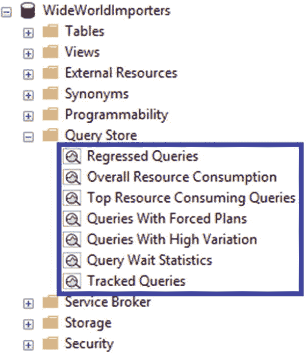

例如，如果你点击 `性能回退的查询`，默认将显示过去一小时内性能回退最严重的前 25 个查询列表，并且你可以根据 CPU 时间、IO 和内存等多个维度对数据进行切片和切块分析，以找到所需信息。从同一用户界面中，你还可以查看给定查询的可用查询计划，并通过点击 `强制计划` 按钮来强制使用最优的计划。就是这么简单！

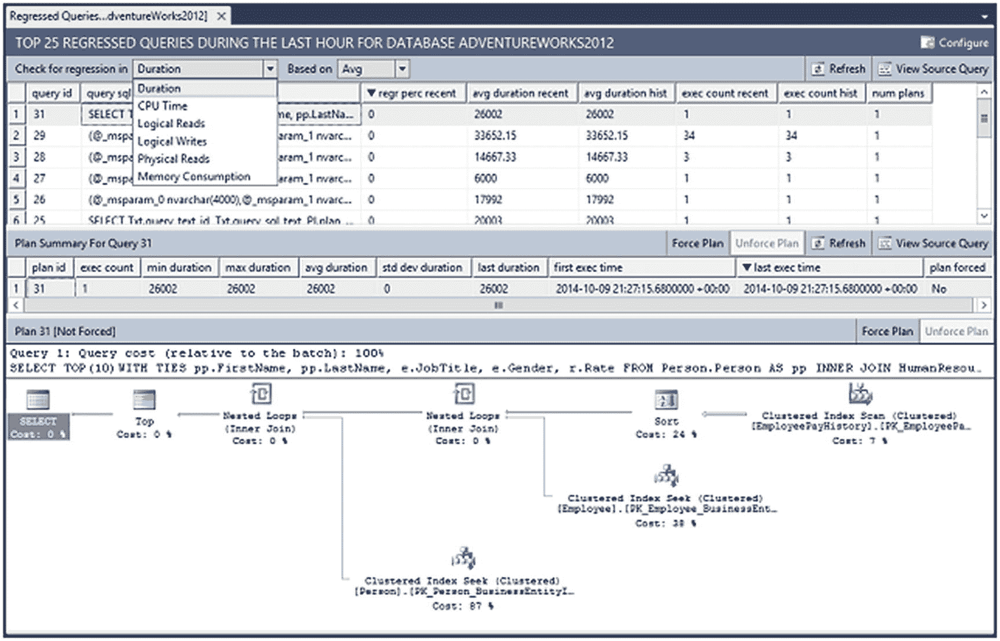

## 分析等待统计

调查应用程序整体性能的另一个有趣场景是查看给定数据库的 `查询等待统计信息`。

在数据库树中点击该选项将弹出一个新窗口，其中最重要的等待状态类别会按总等待时间排序显示在图表中，如下图所示：

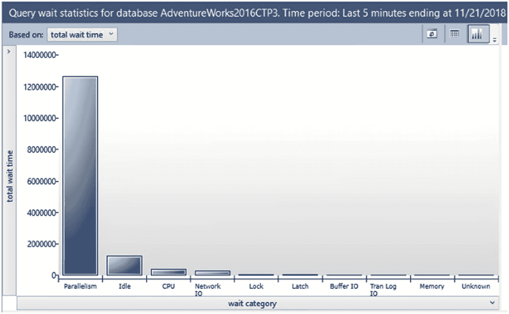

然后，你可以深入分析影响最大的类别，系统将显示导致这些等待状态的前几个查询及其相关的查询计划，这样你就能够为你的特定工作负载强制使用那些优化程度更高的计划：

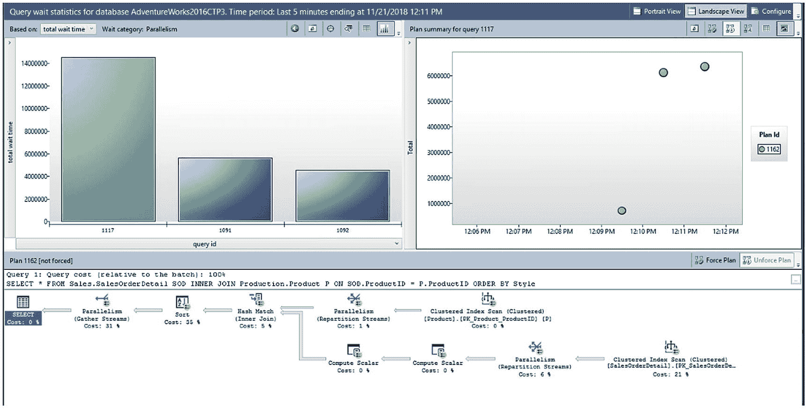

其他类似的场景包括 `资源消耗最高的查询` 或 `变化幅度最大的查询`，你可以遵循类似的路径进行分析。

## 云平台集成：查询性能见解

最后但同样重要的是，Azure SQL 还提供了查询性能见解，它是 Azure 门户体验的一部分，基于查询存储数据为单一数据库和池化数据库提供智能查询分析工具。它有助于识别工作负载中资源消耗最高和运行时间最长的查询。这有助于你找到需要优化的查询，以提高整体工作负载性能，并高效利用你所付费的资源。虽然 SQL Server Management Studio 和 Azure Data Studio 可用于获取所有查询的详细资源消耗情况，但查询性能见解为你提供了一种从 Azure 门户直接出发的快捷高效方式，来确定这些查询对数据库整体资源使用的影响。

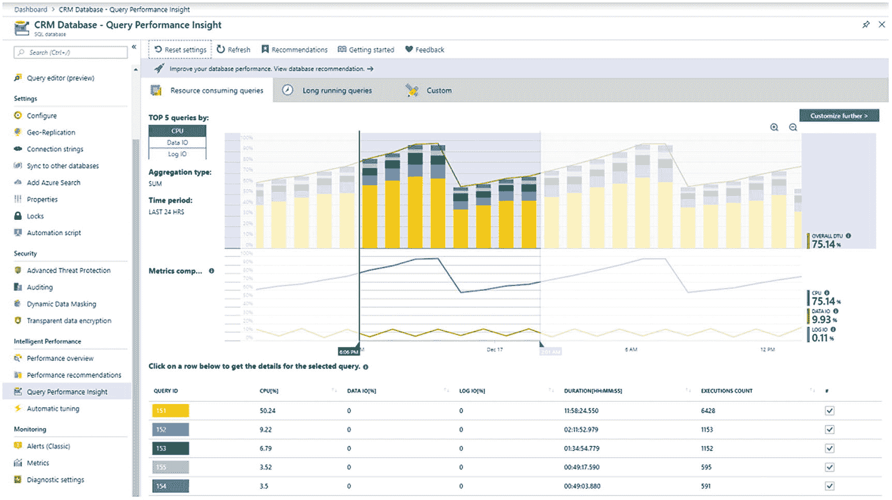

你仍然可以深入到单个查询级别，获取诸如资源消耗或查询在给定时间窗口内执行次数等详细信息，但你也可以与 `数据库顾问` 提供的性能建议进行交互。`数据库顾问` 是 Azure SQL 中的一项功能，它会学习你的数据库使用情况并提供定制化的建议，以实现性能最大化。这些建议涵盖查询计划强制、索引创建和删除等方面。通过在以下页面中点击 `自动化` 按钮，你还可以自动化执行这些建议，让 Azure SQL 始终保持你的数据库处于最佳状态：

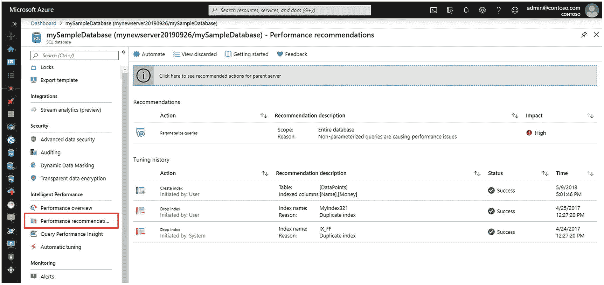

要了解更多关于 Azure SQL 这些有趣功能的详细信息，我们建议你查看官方文档：[`https://aka.ms/daipr`](https://aka.ms/daipr)。


## 在 SQL 中引发和捕获异常

Transact-SQL 中的错误处理与传统编程语言中的异常处理类似。你可以将一组 Transact-SQL 语句包装在 `TRY` 块中，如果发生错误，控制权会传递给后续的 `CATCH` 块，其他语句将在那里执行。Azure SQL 中的每个错误都与一个给定的严重性级别相关联，`TRY...CATCH` 构造会捕获所有严重性高于 10 且不会关闭数据库连接的执行错误。如果 `TRY` 块中没有发生错误，控制权会传递到关联的 `END CATCH` 语句之后的语句。在 `CATCH` 块中，你可以使用多个系统函数来获取导致 `CATCH` 块执行的错误详情：这些函数名都非常直观（`ERROR_NUMBER()`, `ERROR_SEVERITY()`, `ERROR_STATE()`, `ERROR_PROCEDURE()`, `ERROR_LINE()`, `ERROR_MESSAGE()`）。如果在 `CATCH` 块的作用域之外调用它们，它们将返回 `NULL`。

以下示例展示了一个包含错误处理函数的脚本：

```sql
BEGIN TRANSACTION;
BEGIN TRY
-- 生成一个约束违规错误。
DELETE FROM Production.Product
WHERE ProductID = 980;
END TRY
BEGIN CATCH
SELECT
ERROR_NUMBER() AS ErrorNumber
,ERROR_SEVERITY() AS ErrorSeverity
,ERROR_STATE() AS ErrorState
,ERROR_PROCEDURE() AS ErrorProcedure
,ERROR_LINE() AS ErrorLine
,ERROR_MESSAGE() AS ErrorMessage;
IF @@TRANCOUNT > 0
ROLLBACK TRANSACTION;
END CATCH;
IF @@TRANCOUNT > 0
COMMIT TRANSACTION;
GO
```

当我们在 `CATCH` 块中捕获错误时，这些错误不会返回给调用应用程序。如果我们想用 `CATCH` 块捕获错误详情，但也想将全部或部分这些详情报告回调用应用程序，我们可以调用 `RAISERROR` 或 `THROW` 将异常冒泡给调用者，或者简单地通过 `SELECT` 语句返回一个结果集。

我们可以通过嵌套多个 `TRY...CATCH` 构造来创建复杂的错误管理逻辑。当 `CATCH` 块中发生错误时，它会像其他任何错误一样被处理，因此如果该块包含一个嵌套的 `TRY...CATCH` 构造，嵌套 `TRY` 块中的任何错误都会将控制权传递给嵌套的 `CATCH` 块。如果没有嵌套的 `TRY...CATCH` 构造，错误将被传递回调用者。

如果我们的代码正在调用其他存储过程或触发器，这些外部模块引发的错误可以在它们自己的代码中捕获（如果它们包含 `TRY` 块），也可以由调用代码中的 `TRY...CATCH` 构造捕获。但是，用户定义函数不能包含 `TRY...CATCH` 构造。

在处理 T-SQL 代码中的错误时，我们需要牢记一些例外情况：

*   如果错误的严重性等于或低于 10，则它们不会被我们的 `TRY...CATCH` 块捕获（因为它们不被视为错误，而只是警告）。
*   一些严重性等于或高于 20 的错误将导致 Azure SQL 停止处理该会话上的其他任务，因此 `TRY...CATCH` 同样无法捕获这些错误。
*   编译错误，例如阻止批处理运行的语法错误，将不会被我们的 `TRY...CATCH` 块捕获，因为此类错误发生在编译时而非运行时。
*   语句级重新编译或对象名称解析错误（例如，尝试使用已删除的视图）同样不会被捕获。

当 `TRY` 块中发生的错误使当前事务的状态无效时，则该事务被分类为不可提交事务。不可提交事务只能执行读操作或 `ROLLBACK TRANSACTION`。我们可以调用 `XACT_STATE` 函数来验证当前事务是否已被分类为不可提交。如果函数返回 -1，则是这种情况。在批处理结束时，Azure SQL 会回滚不可提交的事务，并向应用程序发送错误消息。

这是一个结合使用 `TRY…CATCH` 和 `XACT_STATE` 的更复杂示例：

```sql
-- 检查此存储过程是否存在。
IF OBJECT_ID (N'usp_GetErrorInfo', N'P') IS NOT NULL
DROP PROCEDURE usp_GetErrorInfo;
GO
-- 创建存储过程以检索错误信息。
CREATE PROCEDURE usp_GetErrorInfo
AS
SELECT
ERROR_NUMBER() AS ErrorNumber
,ERROR_SEVERITY() AS ErrorSeverity
,ERROR_STATE() AS ErrorState
,ERROR_LINE () AS ErrorLine
,ERROR_PROCEDURE() AS ErrorProcedure
,ERROR_MESSAGE() AS ErrorMessage;
GO
-- SET XACT_ABORT ON 将在发生约束违规时导致事务不可提交，
-- 因为它会自动回滚事务
SET XACT_ABORT ON;
BEGIN TRY
BEGIN TRANSACTION;
-- 此表上存在 FOREIGN KEY 约束。此
-- 语句将生成约束违规错误。
DELETE FROM Production.Product
WHERE ProductID = 980;
-- 如果 DELETE 语句成功，则提交事务。
COMMIT TRANSACTION;
END TRY
BEGIN CATCH
-- 执行错误检索例程。
EXECUTE usp_GetErrorInfo;
-- 测试 XACT_STATE:
-- 如果为 1，事务可提交。
-- 如果为 -1，事务不可提交，应
--     被回滚。
-- XACT_STATE = 0 表示没有事务，
--     提交或回滚操作将产生错误。
-- 测试事务是否不可提交。
IF (XACT_STATE()) = -1
BEGIN
PRINT
N'The transaction is in an uncommittable state.' +
'Rolling back transaction.'
ROLLBACK TRANSACTION;
END;
-- 测试事务是否可提交。
IF (XACT_STATE()) = 1
BEGIN
PRINT
N'The transaction is committable.' +
'Committing transaction.'
COMMIT TRANSACTION;
END;
END CATCH;
GO
```

正如你所见，Azure SQL 提供了非常完整且强大的异常处理功能，这是任何现代应用程序所必需的，因为管理异常对于提供卓越的用户体验至关重要。

### 保持简单！

请记住，除了 T-SQL，.NET 或 Python（或任何你偏好的语言）代码也具有出色的异常支持，当它们作为团队协同工作时，通常能获得最佳的用户体验。

考虑到这一点以及保持解决方案尽可能简单的想法，你选择的编程语言与 T-SQL 配合得非常好的一个非常常见的模式就是使用 `XACT_ABORT ON`。

使用 `XACT_ABORT ON`，事务中的任何内容都必须正确（精确）执行，否则 Azure SQL 将中止事务并终止当前代码执行。

如果你计划在应用程序中处理失败逻辑，这个命令可以帮助你拥有精简和干净的代码：

```sql
SET XACT_ABORT ON
BEGIN TRAN
INSERT INTO Orders VALUES (2,1,getdate());
UPDATE Inventory SET QuantityInStock=QuantityInStock-1
WHERE ProductID=1
COMMIT TRAN
```

由于 `XACT_ABORT` 被设置为 on，在前面的代码中，要么 `INSERT` 和 `UPDATE` 都无错误运行，从而 `COMMIT` 将被执行；要么如果在执行 `INSERT` 或 `UPDATE` 期间有任何错误，整个事务将自动回滚（即使代码中没有 `ROLLBACK TRAN`）。代码执行也将被中断，引发的错误将被返回给调用者（在我们的示例中是应用程序代码）。

如你所见，在决定如何处理异常和错误时，你拥有全方位的选项。你可以决定最好在 Azure SQL 内部处理它，也可以将其冒泡到应用程序。在两种情况下，你都掌控全局，因此可以为你的解决方案实施最佳选项。


## 与 Application Insights 集成

作为构建云端解决方案的应用程序开发者，理解这一点至关重要：为了对应用程序进行故障排查和调试，在大多数情况下，我们无法像在传统本地环境中那样连接到特定的服务器。这对于那些利用平台即服务组件和服务的应用程序来说尤其如此，因为在这种场景下，你甚至没有可供连接的物理或虚拟服务器的概念。这就是为什么在代码库中规划好适当的**检测插桩**以发出远程深入分析应用程序行为所需的所有诊断信息如此重要。自行构建所有这些基础设施可能是一项具有挑战性的任务；这就是为什么在过去的几年里，专注于解决检测插桩挑战的多种原生和第三方解决方案变得相当成功。

Application Insights 是 Azure Monitor 的一项功能，是一个面向开发者和 DevOps 专业人员的可扩展应用程序性能管理服务，他们可以用它来监控部署在 Azure 平台上的实时应用程序。它将帮助检测性能异常，并包含强大的分析工具来帮助你诊断问题并了解用户如何使用应用程序。它旨在帮助你持续改进性能和可用性。它适用于多种平台上的应用程序，包括在本地、混合环境或任何公共云上托管的 `.NET`、`Node.js`、`Java` 和 `Python`。它与你的 DevOps 流程集成，并连接到各种开发工具和服务。

你可以在应用程序中安装一个轻量的检测插桩包（作为 SDK 提供），或者在支持的情况下（如 Azure 虚拟机）使用 `Application Insights Agent` 来启用 Application Insights。该检测插桩会监控你的应用程序，并通过一个我们称为 Instrumentation Key 的唯一 GUID，将遥测数据导向 Azure Application Insights 资源。你不仅可以对 Web 服务应用程序或虚拟机进行插桩，还可以对任何后台组件以及网页本身的 JavaScript 进行插桩。应用程序及其组件可以在任何地方运行——它不一定必须托管在 Azure 中。

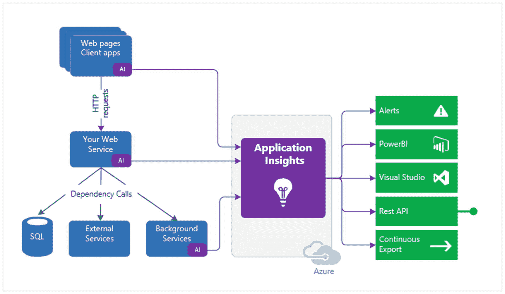

Application Insights 将让你了解应用程序组件性能的各种洞察，例如*请求速率*、*响应时间*和*失败率*。它还会捕获依赖项以及与 Azure 服务（如 Azure SQL）的交互，外加一堆其他附加功能。然后，你可以基于收集的数据创建实时仪表板，用于常规的生产级监控，也可以深入钻研发生的具体问题或异常，或者将诊断数据导出到其他服务。

从你的应用程序中，一旦你从门户中获取了 Application Insights 实例的 Instrumentation Key，你只需根据你的编程语言和框架将正确的 SDK 版本添加到你的项目中，并添加一些配置信息。让我们看一个使用 Java Spring Boot 的例子；我们需要先为 SDK 添加一个 Maven 依赖项：

```
com.microsoft.azure
applicationinsights-spring-boot-starter
2.5.1
```

下一步是通过传递 Instrumentation Key 来配置应用程序属性：

```
