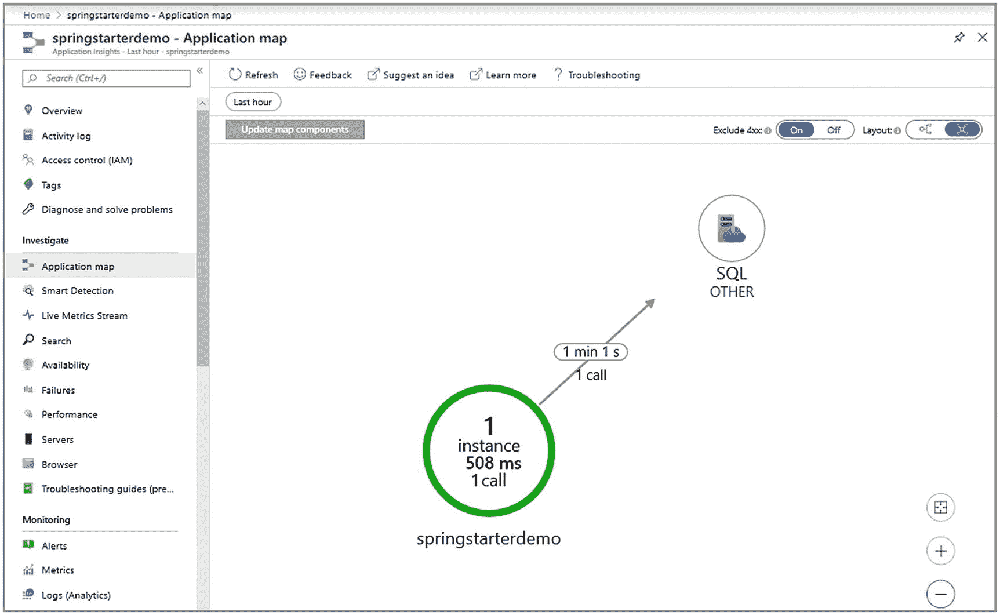
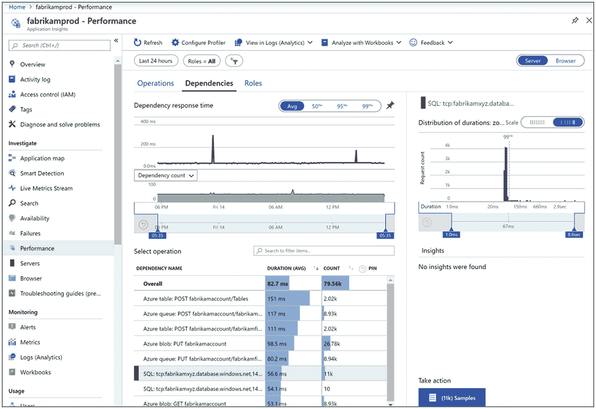
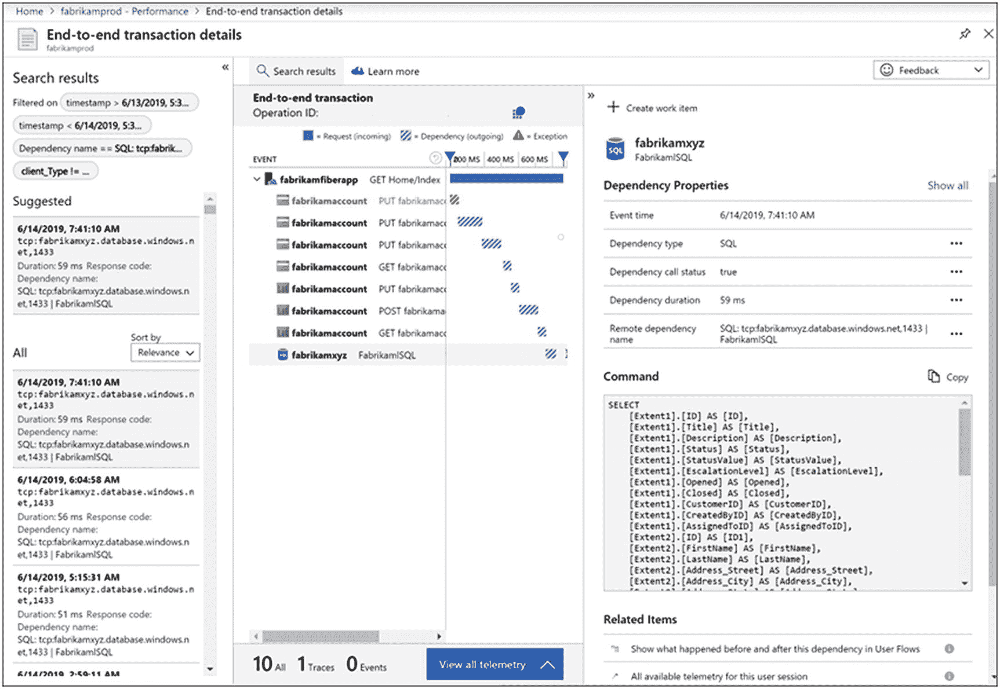
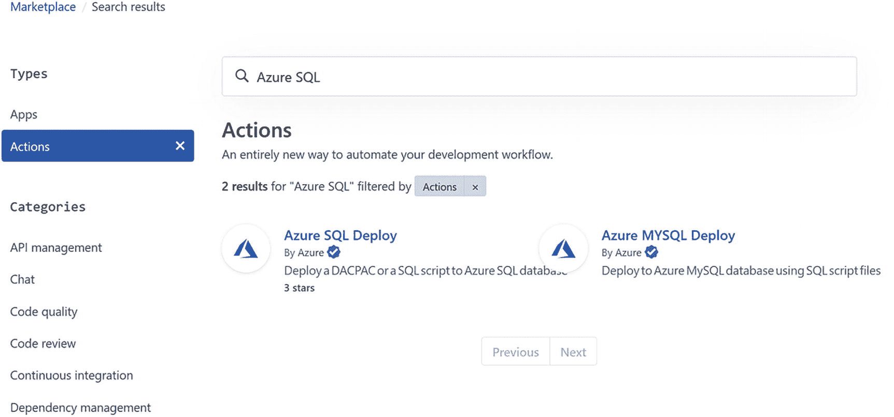
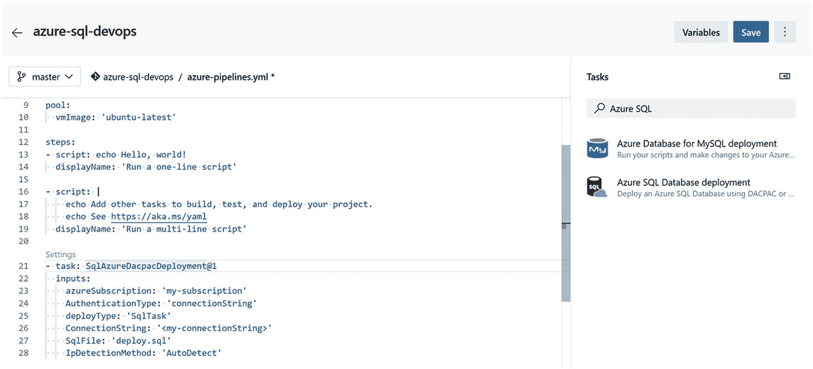
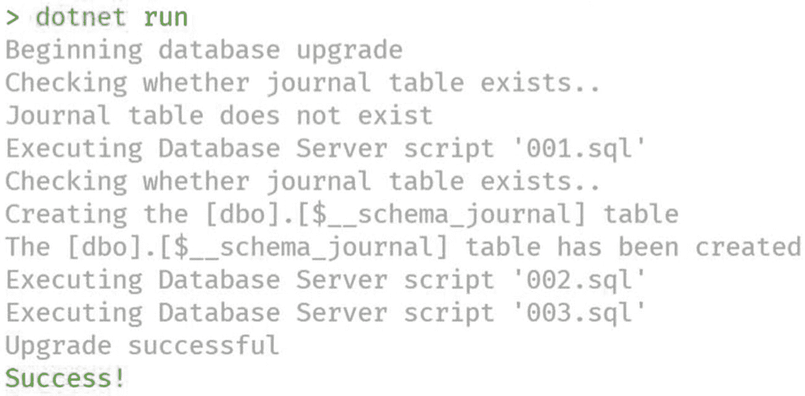
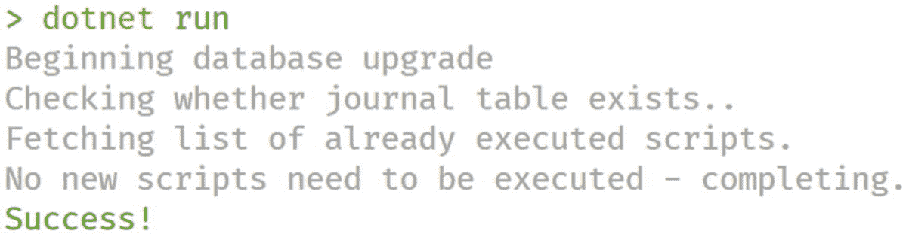

# 指定你的 Spring Boot 应用程序名称。这可以是你希望给你的应用程序取的任何逻辑名称。
spring.application.name=SpringBootInAzureDemo
```

然后，我们可以使用合适的类，如 `TelemetryClient` 来持续跟踪指标，例如 Azure SQL 调用的响应时间，如下面这个简单示例所示：

```
@RestController
@RequestMapping("/")
public class Controller {
    @Autowired
    UserRepo userRepo;
    @Autowired
    TelemetryClient telemetryClient;
    @GetMapping("/greetings")
    public String greetings() {
        // 发送事件
        telemetryClient.trackEvent("URI /greeting is triggered");
        return "Hello World!";
    }
    @GetMapping("/users")
    public List users() {
        try {
            List users;
            // 测量数据库查询基准
            long startTime = System.nanoTime();
            users = userRepo.findAll();
            long endTime = System.nanoTime();
            MetricTelemetry benchmark = new MetricTelemetry();
            benchmark.setName("DB query");
            benchmark.setValue(endTime - startTime);
            telemetryClient.trackMetric(benchmark);
            return users;
        } catch (Exception e) {
            // 发送异常信息
            telemetryClient.trackEvent("Error");
            telemetryClient.trackTrace("Exception: " + e.getMessage());
            throw new ResponseStatusException(HttpStatus.INTERNAL_SERVER_ERROR, e.getMessage());
        }
    }
}
```

然后，你就可以开始通过各种监控页面和可以创建的自定义仪表板，在你的 Application Insights 实例中看到这些指标。下图显示了应用程序地图，你可以看到你的应用程序以及它如何与其他服务（如 SQL）交互，并显示调用次数和响应时间：



### .NET/.NET Core 集成

对于 `.NET/.NET Core`，Application Insights SDK 和 Azure SQL 客户端库（如 `Microsoft.Data.SqlClient`）之间还有更深入的集成。你可以通过初始化 `Microsoft.ApplicationInsights.DependencyCollector` Nuget 包中的这个类，来自动跟踪应用程序与其他服务之间的依赖关系：

```
DependencyTrackingTelemetryModule depModule = new DependencyTrackingTelemetryModule();
depModule.Initialize(TelemetryConfiguration.Active);
```

然后，你可以通过只需在服务级别启用遥测，来配置你的 ASP.NET 应用程序以跟踪数据库交互，直至执行的 SQL 命令：

```
services.ConfigureTelemetryModule((module, o) => { module. EnableSqlCommandTextInstrumentation = true; });
```

你还必须在 *applicationInsights.config* 配置文件中显式选择启用 SQL 命令收集：

```
<Add Type="Microsoft.ApplicationInsights.DependencyCollector.DependencyTrackingTelemetryModule, Microsoft.AI.DependencyCollector">
  <Add Name="EnableSqlCommandTextInstrumentation" Value="true" />
</Add>
```

由于此配置，你将能够调查应用程序代码调用的外部服务的性能，并看到以“SQL:”为前缀的数据库调用和响应时间，如本截图所示：



深入研究单个样本，你将能够看到该请求的端到端事务流，并看到 Azure SQL 数据库调用的贡献，包括 T-SQL 查询的文本：



这是一个非常完整且有用的工具，将在开发和生产阶段协助你进行监控、调试和故障排除。

你可以在官方的 Application Insights 文档中获取我们在此讨论的所有细节以及更多信息：[`https://aka.ms/amaio`](https://aka.ms/amaio)。


## 如果您想了解更多

监控应用程序是一个关键步骤，就像调试一样，它很多时候被忽视了。当您遇到需要解决的问题时，其价值才会显现出来，而那时，拥有的数据越多越好。通常，系统越*透明*越好，因为您可以透过其各个层级看到问题所在。Azure SQL 是迄今为止最透明的可用数据库之一。动态管理视图 (DMV) 提供了大量细节，如果需要，甚至可以深入到单个执行线程。这具有巨大的价值，因为它就像是您的保障：如果事情不如预期顺利，您或微软的客户支持服务 (CSS) 可以拥有所有必要信息来发现并解决问题。这是 Azure SQL 原生提供给开发者的巨大价值，并与端到端检测工具（如 Application Insights）实现了卓越集成。这对开发者来说简直是梦想！如果您想了解更多，照例，这里列出了一些有趣的资源：

*   SQL Server 2019 的查询存储：识别和修复性能不佳的查询 – [`www.amazon.com/Query-Store-SQL-Server-2019/dp/1484250036`](http://www.amazon.com/Query-Store-SQL-Server-2019/dp/1484250036)
*   SQL Server 2019 专家级性能索引：迈向更快的结果和更低的维护成本 – [`www.amazon.com/Expert-Performance-Indexing-Server-2019/dp/1484254635`](http://www.amazon.com/Expert-Performance-Indexing-Server-2019/dp/1484254635)
*   精通 SQL Server 2019 等待统计：分析 SQL Server 性能的实用指南 – [`www.amazon.com/Pro-Server-2019-Wait-Statistics/dp/1484249151`](http://www.amazon.com/Pro-Server-2019-Wait-Statistics/dp/1484249151)
*   SQL Server 2017 查询性能调优：故障排除与优化查询性能 – [`www.amazon.com/Server-2017-Query-Performance-Tuning-ebook/dp/B07H49LN75`](http://www.amazon.com/Server-2017-Query-Performance-Tuning-ebook/dp/B07H49LN75)

以下是一些深入研究 Azure SQL DMV 的资源：

*   Glenn Berry 的 DMVs – [`https://glennsqlperformance.com/resources/`](https://glennsqlperformance.com/resources/)
*   `sp_WhoIsActive` – [`http://whoisactive.com/`](http://whoisactive.com/)
*   `sp_Blitz` – [`www.brentozar.com/blitz/`](http://www.brentozar.com/blitz/)
*   Tiger 工具箱 – [`https://github.com/Microsoft/tigertoolbox`](https://github.com/Microsoft/tigertoolbox)

# 11. 与 Azure SQL 实现 DevOps

DevOps 是一门将人员、流程和产品结合起来的学科，旨在实现向终端用户持续交付价值。它通过帮助弥合开发、运维和管理之间的鸿沟来实现这一目标。从开发者的角度来看，DevOps 学科最重要的方面可能在于专注于拥有一个健康的 CI/CD 管道。*持续集成* (CI) 和 *持续部署* (CD) 是两个流程，有助于支持开发敏捷性，同时确保产品质量和稳定性。

## CI/CD：定义与概念

持续集成意味着您持续地将所做的更改推送并合并到正在处理的解决方案的代码库中，以便它们能够与团队中其他开发者的更改集成、测试和验证。构建和测试解决方案的自动化工具是此流程的一部分，目的是使其尽可能无缝和自动化。目标是拥有一个健康且经过测试的代码库，几乎可以随时发布到生产环境。

持续部署则是一个处理将新代码部署到生产环境的流程，它有助于使这一非常微妙且关键的过程更加自动化、可重复且不易出错。此处的目标与前一个相同，但从不同的角度——部署过程——来切入。即使您的代码库中有完美运行的代码，将其部署到生产环境也是一项不简单的任务。持续部署有助于确保组织能够随时将最新可用、经过测试、可运行的代码部署到生产环境。

正如您可能已经想到的，DevOps 和 CI/CD，连同敏捷原则，是现代开发的基石。事实上，对于现代开发者来说，从一开始就采用 DevOps 学科无疑是一种最佳实践，并且在当今已成为一种成熟的行为。

## CI/CD 与 Azure SQL

将 DevOps 学科应用于数据库肯定更具挑战性，因为数据库只部分是代码：数据库的最大部分实际上是数据。测试数据库意味着什么？如何处理数据？如何在持续部署和演进数据库的同时，不损害现有数据的完整性和性能？目前还没有明确且全球公认的的答案。DevOps 学科相对较年轻（首次正式提及是在 2009 年！），而它在数据领域的应用则更年轻，因此在能够定义一套全球公认的最佳实践之前，还有很多需要学习的地方。但明确的是，这件事必须做。幸运的是，有一些工具可以在过程中提供帮助。在本章中，我们将讨论其中的两个工具：`GitHub Actions` 和 `Azure DevOps`，以及它们如何在 Azure SQL 的上下文中使用。它们都具有图形用户界面，但也支持基于代码（通过 `YAML`）的配置和定义，以实现最大的灵活性。一旦我们了解了这两个工具能为我们做什么，以及它们如何允许创建 CI/CD 管道，我们将更深入地探讨处理数据库和数据复杂性的具体原则和解决方案。

我们假设您已经熟悉源代码控制管理和 `git` 的概念。如果不熟悉，您可以使用免费的 `git` 电子书 `Pro Git` 开始学习这项基本的开发技能，链接：[`https://aka.ms/gitbookv2`](https://aka.ms/gitbookv2)。

### GitHub Actions

`GitHub` 是最流行且使用最广泛的代码仓库。它免费提供了广泛的功能，其中一项名为 `GitHub Actions` 的功能是最近发布的，专门设计用于帮助实现 DevOps。更具体地说，它允许您直接从代码仓库实现 CI/CD 管道。`GitHub Actions` 允许通过使用一系列称为 `action` 的小任务来创建自定义的软件开发生命周期。这些 `action` 可以通过自定义定义的工作流进行组合和编排，以覆盖构建、测试和部署解决方案的所有方面。

除了 `GitHub` 提供的原生 `action` 外，还有一个 `Marketplace`，`GitHub` 社区构建的 `action` 可以在这里发布，并被任何人用来支持最多样化的需求。微软发布了一个免费的、专为 Azure SQL 设计的 `action`，允许开发者作为自动化工作流的一部分，将更新部署到目标 Azure SQL 数据库。



*`GitHub Actions Marketplace`*

`GitHub` `action` `marketplace` 可通过此链接访问：[`https://aka.ms/ghmas`](https://aka.ms/ghmas)。

借助 Azure SQL 部署 `action`，您可以创建一个 `workflow`，在有人将代码推送到仓库后，该工作流会将脚本部署到目标 Azure SQL 数据库，运行您可能使用首选测试框架配置的任何测试，并通知您结果。


### Azure DevOps

Azure DevOps 是一套功能全面的产品套件，能够支持团队在所有 DevOps 方面的需求。它包含一个与 Git 兼容的代码仓库、一个用于构建和发布生成的解决方案的管道、一组用于自动化测试的测试工具、一个用于本地化管理软件包的制品存储，以及一个用于确保工作能够被正确跟踪、分配和监控的敏捷规划和问题跟踪系统。

如果你正在启动一个新项目且团队规模较小，Azure DevOps 是一个绝佳的选择，因为它的前五个用户是免费的。

在将你的代码推送到 Azure DevOps 源代码仓库后，你可以配置构建管道，将 Azure SQL 代码作为部署的一部分部署到指定的 Azure SQL 数据库中。

管道可以使用不同的 `任务` 来定义代码推送到仓库时将执行的步骤。`Azure SQL Database deployment` 任务可用于将提供的 T-SQL 脚本部署到目标 Azure SQL 数据库。



## 数据库迁移

既然你已经知道在哪里可以创建 CI/CD 管道，那么现在是时候开始弄清楚数据库如何也能成为该管道的一部分了。主要的挑战在于，当你想要在现有数据库中部署变更时，你可能需要保留已存储在数据库中的现有数据。如果该数据库是生产数据库，通常“可能”会变成“必须”。所有的挑战都始于数据库的这一关键方面，并且对于任何数据库（无论是关系型还是非关系型）都是如此。通过添加新列来扩展模式通常很简单，不会带来任何特别的复杂性。当你需要更改现有数据所使用的模式时，挑战就出现了。而且，无论你是采用读时模式还是写时模式，这个挑战始终存在。采用写时模式时，你需要更改数据库，以便所有现有数据都将更新以适应新模式。采用读时模式时，例如，如果你将数据存储在 JSON 文档中，你可能能够大幅降低需要在数据库上执行的操作的复杂性，但你会将这种复杂性转移到应用程序逻辑中，而该逻辑需要能够处理不同版本的模式。

不存在所谓的无模式解决方案。Martin Fowler 在其 *隐含模式* 演讲中一劳永逸地澄清了这个概念，该演讲可免费在线获取：[`www.martinfowler.com/articles/schemaless/`](http://www.martinfowler.com/articles/schemaless/)。他引入了隐含模式的概念，这是对被称为“无模式”的事物的正确命名方式。“无模式”作为一个通俗术语仍然存在，因为它如此广泛流传，但要让某物能够被操作，模式必须存在。除非有特定原因要避免，否则显式模式是更可取的。

实际上，在 CI/CD 管道中处理数据库变更的挑战在于，通常你有一个源数据库，其中包含你的更新应用程序所使用的已演进模式，以及一个目标数据库，其中包含需要更新的现有模式以成为新模式。问题在于，你如何创建能够将目标数据库从现有模式带到新模式所需的 T-SQL 脚本？而且，除了如何操作，谁将执行这项工作？如果目标数据库不为空，执行该更新操作的性能影响是什么？此外，如果出现问题，我们如何确保数据能被正确保留？是的，你总是有可以回滚的事务，在最坏的情况下，Azure SQL 为你提供了可用的数据库备份，所以至少在这方面你是有保障的。但恢复数据库可能涉及几分钟或几小时，而离线那么长时间可能不是一个可选项。

为了解决这个挑战，最好将其分成两部分，对于 CI/CD 管道也采取同样的做法。创建两个管道来针对两种不同的用例是非常有帮助的。

### 合成环境

第一个管道将用于确保应用于数据库的所有变更都在一个 `合成环境` 中得到测试：在这个环境中，数据库每次都是从头开始创建的，并且包含在该数据库中的数据是一组众所周知的数据，代表我们预期将要管理的数据，加上我们随着时间的推移了解到必须处理的、可能产生意外和不良状况的所有数据。例如，你可能不期望计算产品更新成本的存储过程的结果是负数，但如果从几个不同表读取的输入数据具有某些特定值，这种情况就会发生。除了你期望在数据库中拥有的常规、正确的数据外，你还应确保生成这种情况的数据集存在于这个合成环境数据库中，以便你能正确验证这种情况是否随时间推移得到了正确处理。

这些值，包括正确的和问题相关的，将随着时间的推移而增长，因为你应该在收到测试人员或用户的反馈和问题后尽快向此集添加新数据。通过这样做，你将拥有一个随着时间的推移而增长的有价值的参考数据集，这对于保持你的解决方案没有回归错误和问题将非常有帮助。

以下步骤将构成此管道的一部分：
*   创建一个新数据库。
*   部署模式和对象。
*   加载参考数据集。
*   运行测试。

### 集成环境

如果合成环境中的所有测试都成功执行且没有错误，那么你就可以开始执行更复杂的管道了。既然你知道你的变更能产生期望的结果，你需要确保可以安全地将它们部署到生产数据库。这里的主要目标是确保用于将现有模式和数据更新到新模式的脚本是正确的，并且能在期望的时间内运行。

这意味着需要生产数据库的一个副本。出于安全原因，你可能无法访问它，因为它可能包含敏感数据。你有两个选择来解决这个新挑战。你可以请求一份带有 `混淆数据` 的生产数据库副本，以便移除任何个人可识别信息或高安全数据，或者如果你工作在一个高度安全的环境中，你只需要一个可以用模拟数据填充的空生产数据库。有几种工具可以生成模拟的、但真实的数据。如果你确实需要创建一些高度定制的内容，也有适用于 Python、Node 和 .NET 的库：
*   `Faker` 同时适用于 .NET 和 Python（如果你想用一些冷门语言，也支持 PHP、Perl 和 Ruby）。
*   `Mimesis` 是一个 Python 库。
*   `MockNeat` 适用于 Java。
*   `Faker.js` 适用于 Node。
*   `Bogus` 是 Faker.js 移植到 .NET 的版本。

一旦你有了这个参考数据库，你需要决定如何更新现有数据库，使其具有新模式、对象以及——如果需要的话——数据。这是一个相当广泛的话题，我们将在下一节深入讨论。无论你选择如何生成和应用变更到目标数据库，你的这个集成环境的 CI/CD 管道看起来会像下面这样：
*   恢复参考数据库。
*   生成将参考数据库迁移到目标模式、更新现有对象并保留现有数据所需的 T-SQL 代码。
*   运行生成的脚本。
*   运行测试以验证结果。


## 数据库迁移工具

生成用于将数据库从现有架构迁移到另一架构的脚本，可能涉及不同的步骤和技术，具体取决于你所采用的开发理念：**代码优先**还是**数据库优先**？

### 代码优先

代码优先意味着你决定直接通过应用程序代码来驱动数据库的创建、更改和演化。无需手动执行 `T-SQL` 脚本，也无需使用像 `SQL Server Management Studio` 或 `Azure Data Studio` 这样的独立工具。

这种方法的一个例子是 `Django`，一个广泛使用的 Python Web 应用程序框架：数据模型的定义完全在 Python 中进行。以下是直接取自 `Django` 官方文档的代码示例：

```
class Member(models.Model):
    """A model of a rock band member."""
    name = models.CharField("Member's name", max_length=200)
    instrument = models.CharField(choices=(
        ('g', "Guitar"),
        ('b', "Bass"),
        ('d', "Drums"),
    ),
    max_length=1
    )
    band = models.ForeignKey("Band")
```

要创建数据库，你有一个 `migrate` 命令，负责执行所有必要的步骤，以使现有数据库与模型定义保持同步。对于 `Django`，该命令是：

```
python manage.py makemigrations
python manage.py migrate
```

它将应用所有迁移。请记住，这种方法假设*没有手动在数据库外部进行更改*。例如，如果有人在没有使用提供工具的情况下手动向迁移目标数据库添加了一列，迁移可能会失败，因为它不检查对象的当前状态；它只是假设数据库在模式方面与上次应用迁移时的状态完全相同。

`Django` 是一个功能齐全的 Web 框架：如果你只需要一个可以在任何 Python 应用程序中使用的对象关系映射器（`ORM`），`SQLAlchemy` 也通过 `Alembic` 包支持迁移。

`.NET Core` 也通过 `Entity Framework` 支持代码优先和迁移，这是随 `.NET Core` 一起提供的原生工具。

一旦你创建了你的 `.NET` 模型

```
namespace AzureSQLForDevelopers
{
    public class BloggingContext : DbContext
    {
        public DbSet<Blog> Blogs { get; set; }
        public DbSet<Post> Posts { get; set; }
        [...]
    }
    public class Blog
    {
        public int BlogId { get; set; }
        public string Url { get; set; }
        public int Rating { get; set; }
        public List<Post> Posts { get; set; }
    }
}
```

你必须生成并应用迁移步骤，就像为 `Django` 所做的那样：

```
dotnet ef migrations add FirstMigration
dotnet ef database update
```

如果你需要或希望手动干预迁移过程以确保它能满足你的需求怎么办？自动化很棒，但通常需要一些手动干预来处理一些比自动化工具单独处理更复杂的情况。

幸运的是，所有最常见的代码优先解决方案都提供了一种自定义迁移步骤的方法。根据你使用的语言和框架，将有不同的策略来应用你需要的定制，但例如，如果你需要使用一些必须存在于数据库中的数据来初始化数据库，以使你的应用程序正常工作，或者甚至进行更复杂的更改，你都可以实现。

`ORM` 和数据库迁移工具几乎可用于任何平台，作为独立对象或嵌入在框架中；无论你想用什么语言或平台进行编码，如果你喜欢使用代码优先方法开发数据库的想法，你几乎可以肯定你会找到一个能帮助你的工具。

将迁移作为 `CI/CD` 管道的一部分执行非常简单，因为你只需在管道工具中执行用于生成和应用迁移的相同工具。

在这种情况下，你不需要在 `CI/CD` 管道中有任何专门的 `Azure SQL` 操作或任务，因为你不需要执行任何 `T-SQL` 脚本。你只需要能够调用迁移工具（这通常是一个命令行应用程序），为此，你只需使用在 `GitHub Actions` 或 `Azure DevOps` 中运行任意命令的原生支持（只需记住你可能需要在 `CI/CD` 环境中安装所选工具）。

### 数据库优先

数据库优先意味着你希望独立于使用它的应用程序来建模和演化数据库。这个术语通常与 `ORM` 的使用相关联。在 `ORM` 的上下文中，它意味着你将有一些工具根据现有的数据库表和对象创建你将在应用程序中使用的一些类。正如你所看到的，这与代码优先方法完全相反，代码优先是让代码负责创建数据库及相关对象。

如果我们把“数据库优先”的概念从 `ORM` 上下文中拿出来，在一个更通用和广泛的意义上使用它，它只是意味着你希望手动处理数据库，使用它自己的工具和语言来创建和演化它。在 `Azure SQL` 的情况下，这意味着你希望编写和使用 `T-SQL`，并且你将负责将应用程序和数据库连接在一起，可能使用 `ORM`，可能使用 `Micro-ORM`，或者可能只是完全手动完成。

这个选项给了你尽可能多的自由。一旦你对开发数据库进行了所有更改，你必须创建脚本，以便它们可以应用于目标数据库，使其也演化到所需的架构。同样，你在这里有很大的自由：你可以选择让工具自动为你生成脚本，或者你自己提供脚本。

#### DACPAC

如果你更愿意使用一个工具，该工具获取你已处理的开发数据库，将其与目标数据库进行比较，计算差异，生成将目标数据库迁移到新架构所需的脚本（而不丢失任何数据），并最终为你应用这些脚本，那么你很幸运，因为这样的工具存在、免费，并且与你已用于在 `Azure SQL` 中还原数据库的工具是同一个：`SqlPackage`。

使用 `SqlPackage`，你可以将现有数据库的架构提取到一个 `.dacpac` 文件中，然后将其用于目标数据库，让 `SqlPackage` 生成包含所有将目标数据库的架构与 `.dacpac` 中定义的架构同步所需命令的脚本。以下代码将提取名为 `blogs` 的、托管在 `Azure` 中的数据库中存在的架构和所有对象（但不包括数据）到 `blogs-v1.dacpac` 文件中：

```
sqlpackage.exe
    /a:Extract
    /ssn:"<server-name>.database.windows.net"
    /su:"<username>"
    /sp:"<password>"
    /sdn:"blogs"
    /tf:"blogs-v1.dacpac"
```

一旦你有了 `.dacpac` 文件，你可以通过 `Publish` 操作立即用它来更新目标数据库：

```
sqlpackage.exe
    /a:Publish
    /sf:"blogs-v1.dacpac"
    /tsn:"<server-name>.database.windows.net"
    /tu:"<username>"
    /tp:"<password>"
    /tdn:"blogs-prod"
```

或者创建稍后可用于通过同名操作更新数据库的脚本：

```
sqlpackage.exe
    /a:Scripts
    /sf:"blogs-v1.dacpac"
    /tsn:"<server-name>.database.windows.net"
    /tu:"<username>"
    /tp:"<password>"
    /tdn:"blogs-prod"
    /op:"blogs-db-v1.sql"
```

生成脚本的能力很有用，如果你想自定义它以添加一些初始化数据（就像在代码优先场景中发生的那样），或者只是想将脚本保存到你的代码仓库中，以便确切知道在 `CI/CD` 管道中将执行什么。在这种情况下，你可能希望使用 `GitHub` 或 `DevOps` 中的 `Azure SQL` 操作或任务来执行该脚本。

另一个选择是直接在 `CI/CD` 管道中执行 `SqlPackage`，使用专门的 `Azure SQL` 操作或任务来应用更改，甚至不生成脚本。这种方法可能风险更高，因为你无法完全控制正在发生的事情，因此平均而言不是推荐的方法，但它确实是最灵活的，因为它会自动计算出将目标数据库带到所需状态所需的更改。


## 比较工具

除了 `SqlPackage`，还有几款第三方工具可以帮助你找出两个现有数据库之间的差异，从而生成脚本，将目标数据库与另一个参考数据库同步。最常见和知名的是

*   SQL Server Data Tools（Visual Studio 工作负载扩展）
*   Redgate SQL Compare（商业软件）
*   ApexSQL SQL Compare（商业软件）

## DbUp

DbUp ([`https://dbup.github.io/`](https://dbup.github.io/)) 是一个开源的 .NET 库，它有助于在数据库中部署脚本，确保同一个脚本不会被部署两次。如果你想完全控制部署到数据库的脚本，并且维护一个必须按顺序执行的脚本列表，那么这个小工具就极其有用。这样，你编写的更改将按正确顺序应用，从而将数据库更新到最新的演进状态。这种方法为你提供了最高级别的控制，如果你更喜欢自己编写迁移脚本，它会非常有效。在复杂且关键的系统中，情况通常都是如此。

使用它非常简单。你只需将 NuGet 包添加到你的项目中（建议为此创建一个专用项目），然后使用 `DeployChanges` 对象，并指向存放待部署脚本的文件夹，例如项目结构中的 `sql` 文件夹：

```csharp
var connectionString = ""
var upgrader = DeployChanges.To
.SqlDatabase(connectionString)
.JournalToSqlTable("dbo", "$__schema_journal")
.WithScriptsFromFileSystem("./sql")
.LogToConsole()
.Build();
var result = upgrader.PerformUpgrade();
```

前面的代码在执行时，将会：

*   连接到目标数据库。
*   如果尚未存在，则创建一个名为 `$__schema_journal` 的表，用于跟踪已部署的脚本。
*   读取 `sql` 文件夹中所有可用的 T-SQL 脚本。
*   将日志发送到控制台。
*   运行脚本，并将已执行的脚本信息保存到日志表中。

如果你针对一个空数据库编译并运行此应用程序，你将看到类似下面的输出：



如果你尝试再次运行同一个应用程序，且没有向 `sql` 文件夹添加任何新脚本，那么什么都不会发生，因为所有脚本都已执行完毕：



由于这是一个常规的 .NET 应用程序，将其部署到 CI/CD 流水线中不需要任何特殊的 Task 或 Action，除了那些流水线中已有的、用于确保 .NET 框架可用的任务。

## 数据库测试

如何正确地测试数据库？这是另一个庞大的话题，坦率地说，目前还没有很好的答案。测试数据库是一个复杂的挑战，因为测试结果将完全取决于存储在数据库中的数据。此外，目前还没有广泛采用的专注于这个特定问题的测试框架。

有一个社区支持的单元测试框架支持 Azure SQL：`tSQLt`。使用 `tSQLt`，你可以仅用 T-SQL 代码来定义测试。它支持对标量结果和表格式结果进行断言，并且还可以创建一些模拟对象来帮助你隔离依赖关系。

但作为一名开发人员，我最喜欢的数据库测试方法是使用常见的测试框架（如 .NET 的 `NUnit` 或 `XUnit`、Python 的 `pytest` 或 Node 的 `Mocha`）创建一个测试类，并利用这些工具的灵活性来获得良好的测试体验。

众所周知，测试必须是自包含、独立且幂等的。上述测试框架都允许在运行测试前后执行自定义代码，以便准备和清理测试数据及环境。

我知道纯粹的单元测试不应该有任何外部依赖，而测试数据库实际上引入了对数据库本身的依赖。尽管如此，我认为使用现有的单元测试框架是一个很好的折中方案，它以对完美方法的微小偏离为代价，提供了所需的灵活性。鉴于目前没有普遍接受的数据库单元测试框架，我们只能在现有条件下尽力而为。

以下是一个使用 .NET 和 `NUnit` 进行数据库单元测试的示例：

```csharp
[Test]
public void CheckExpectedTotal()
{
using(var conn = new SqlConnection(ConnectionString))
{
var result = conn.QuerySingle(
"ConfirmOrder",
new { OrderId = 38923 },
commandType: CommandType.StoredProcedure);
Assert.AreEqual("ConfirmedTotal", 10000);
}
}
```

理想情况下，对于你想创建的每个测试，你会生成一个或多个数据集，以覆盖你想要测试的查询或存储过程可能被使用的场景。

通常，为了检查查询是否返回预期结果，你可以使用一个小的数据样本，甚至可能是完全用模拟值创建的，这样就不必处理个人可识别信息以及随之而来的所有安全问题。在最复杂的情况下，在运行测试之前，你可能需要恢复一个参考数据集甚至整个数据库，以便拥有一个明确的起始点来运行测试，从而获得确定性的结果。

一旦你创建了测试，从而拥有一个坚实的流水线来部署和测试针对一个小型但具有代表性的数据集的更改，你就可以指示流水线将你的代码部署到一个更大的数据库上（可能包含一个经过适当混淆的、具有代表性的生产数据子集），以运行集成和性能测试。在这个阶段，你将专注于查询性能。一些框架还允许你指定测试必须在规定的时间内执行，才被认为是成功的。

此时，通常你的团队将执行集成和性能测试，其中数据库和所有需要与之交互的代码将作为一个整体进行测试。如果你正在创建一个 API 解决方案，你可能已经在使用像 `Locust.io` 或 `K6` 这样的工具来进行压力测试，并验证你刚刚完成的更改在性能、可扩展性和资源消耗方面是否也符合预期。

## 整合所有内容

第一次创建一个完整、端到端的 CI/CD 流水线可能有点复杂。因此，在本书附带的代码中，你可以找到一个端到端的示例，展示了如何创建一个简单的 C# REST API，以 Azure SQL 数据库为后端，并使用 Azure Web App 部署在 Azure 上。CI/CD 流水线使用 GitHub 和 DbUp 创建，使用的测试框架是 `NUnit`。


## 如果你想了解更多

DevOps 是一个非常广泛的主题，在本章中我们只是浅尝辄止。正如开头提到的，DevOps 也是一个相对年轻且发展非常迅速的学科，因此及时掌握最新信息至关重要：毫无疑问，DevOps 是现代开发者的必备技能，因此必须对其及工具有一定的熟悉程度。以下是一些链接和资源，可帮助你了解更多细节：
*   数据库 DevOps 年度状况报告 – [`www.red-gate.com/solutions/overview`](http://www.red-gate.com/solutions/overview)
*   演进式数据库设计 – [`www.martinfowler.com/articles/evodb.html`](http://www.martinfowler.com/articles/evodb.html)
*   敏捷数据库技术 – [`www.amazon.com/Agile-Database-Techniques-Effective-Strategies/dp/0471202835`](http://www.amazon.com/Agile-Database-Techniques-Effective-Strategies/dp/0471202835)
*   DevOps 简介：DevOps 与数据库 – [`www.red-gate.com/simple-talk/sql/database-devops-sql/introduction-to-devops-devops-and-the-database/`](http://www.red-gate.com/simple-talk/sql/database-devops-sql/introduction-to-devops-devops-and-the-database/)
*   Azure SQL 数据库部署任务 – [`https://docs.microsoft.com/azure/devops/pipelines/tasks/deploy/sql-azure-dacpac-deployment`](https://docs.microsoft.com/en-us/azure/devops/pipelines/tasks/deploy/sql-azure-dacpac-deployment)
*   用于将更新部署到 Azure SQL 数据库的 GitHub Action – [`https://github.com/marketplace/actions/azure-sql-deploy`](https://github.com/marketplace/actions/azure-sql-deploy)
*   Django：迁移 – [`https://docs.djangoproject.com/en/3.0/topics/migrations/`](https://docs.djangoproject.com/en/3.0/topics/migrations/)
*   Django：编写迁移 – [`https://docs.djangoproject.com/en/3.0/howto/writing-migrations/`](https://docs.djangoproject.com/en/3.0/howto/writing-migrations/)
*   Entity Framework Core – [`https://docs.microsoft.com/ef/core/`](https://docs.microsoft.com/en-us/ef/core/)
*   代码优先迁移 – [`https://docs.microsoft.com/ef/ef6/modeling/code-first/migrations/`](https://docs.microsoft.com/en-us/ef/ef6/modeling/code-first/migrations/)
*   通过 SQLPackage.exe 和 PowerShell 进行同步 – [`www.mssqltips.com/sqlservertip/4759/sql-server-database-schema-synchronization-via-sqlpackageexe-and-powershell/`](http://www.mssqltips.com/sqlservertip/4759/sql-server-database-schema-synchronization-via-sqlpackageexe-and-powershell/)
*   .NET Core 和 .NET Standard 中的单元测试 – [`https://docs.microsoft.com/dotnet/core/testing/`](https://docs.microsoft.com/en-us/dotnet/core/testing/)


# 索引

A
*`AddRange()`*方法
*`高级数据安全`* (ADS)
高级威胁防护
Apache Spark
Application Insights Agent
应用映射
应用性能管理 (APM) 服务
AVX 和 SIMD 指令
Azure Blob
Azure 认知搜索索引服务
Azure Cosmos DB
Azure Data Studio (ADS)
Azure Kubernetes Service
Azure Monitor 日志和指标长期分析选项
Azure 门户
Azure 门户体验
Azure SQL 抽象与访问级别

## 添加数据

ADS 优势
聚合对数据进行分组
多重分组
窗口函数
批量复制 API
云原生实体排序规则感知
排序规则
将计算推向数据
连接方法
创建数据库
Cypher 表达式
数据资产保护
“始终加密”功能
动态数据屏蔽功能
权限管理
行级安全性 (RLS)

## 数据监控

变更数据捕获
变更跟踪示例
声明式 vs. 命令式
数据库事务单元 (DTU) 或虚拟核心 (vCores)

*`弹性池`*

## 飞行数据线

CSV 文件
函数
几何 *vs*. 地理
图功能
图处理支持
图结构
硬件代次
标识和序列
实例级功能

*`实例池`*

## JSON

B 树索引
内置函数
数据交换格式
数据完整性
双重检查条件
`FOR JSON`子句
格式化查询结果
功能
导入文档
索引值
`NEAR`运算符
`OPENJSON`函数
路径
查询数据
存储文档
提取文本信息
XML 数据
键值对

## 合并数据

修改数据
多模型能力
网络
节点表
非标量参数
CSV
JSON
表值参数 (TVP)
NoSQL 场景
`OFFSET/FETCH`
开放地理空间联盟 (OGC)
输出子句

*`主 XML 索引`*

## Python/R

查询 XML 数据
关系型
半结构化数据
删除数据
检索数据

*`别名`*
`COLLATION`
公用表表达式 (CTE)
筛选
联接
引号标识符
`Sales.Invoices`表
示例 `SELECT` 结果
`SELECT`命令
分号
子查询
T-SQL 语句
双部分名称
Unicode 字符串
`UNION`语句
读时模式 (schema-on-read)

*`辅助 XML 索引`*
*`选择性 XML 索引`*
半结构化数据
服务层级
更小的最小配置
空间数据
空间数据类型
空间索引
空间支持
`STIntersects`方法
存储过程
`STOverlaps`方法
结构化信息

## 表设计

参见 *`表设计`*
临时表

*`网格化`*

*`时区`*设置
工具
触发器
非结构化文本
HTML 代码索引
`LIKE`运算符
使用示例数据库进行查询
变量
视图
XML 支持
XPath 和 XQuery 语言

# B

`BeginTransaction()`方法
B 树索引
批量复制 API
业务规则

# C

检查点
基于云的解决方案
聚集列存储索引 (CCI)
聚集索引
列存储
列存储格式用于分析和报表查询

*`批处理模式执行`*

聚集列存储索引 (CCI)
聚集索引列*`段`*
压缩区域
压缩算法
增量存储区域
全扫描查询
高数据压缩
内存缓存架构
修改
非聚集列存储索引 (NCCI)
NVARCHAR 列
组织*`页`*
分区技术
查询结构
行存储格式
SIMD 操作
更新值
列存储索引
命令查询职责分离 (CQRS)
逗号分隔值 (CSV)

## 连接与查询

全新的物理连接
云环境
连接池
自定义代码或可重用库
数据访问框架
默认连接策略
驱动程序和库
框架、ORM 和 MicroORM
*`.NET Framework`*
Java 应用程序
MicroORM
.NET Core 应用程序
Node.JS 函数
ORM
*`pof.xml`*
私有虚拟网络 (VNET)
编程语言
代理
公共连接性

*`pyodbc`*
*`Python`*
Pythonic 精神
`RAISERROR`函数
重定向
重试逻辑
数据库往返
服务器级和数据库级防火墙规则
服务间交互
简单的 Python 应用程序
瞬态和持久性错误
T-SQL 语言
使用 Entity Framework Core
使用只读副本
使用 SQLAlchemy
VNET 服务终端节点

## 持续集成 (CI)/持续部署 (CD)

Azure DevOps
挑战
Code First 方法
比较工具
`dacpac`文件
数据完整性和性能
DbUp
定义
GitHub Actions
集成环境
ORM 使用
合成环境

# D

数据库顾问
数据库
数据库事务单元 (DTU)
数据定义语言 (DDL)
数据操作
数据操作语言 (DML)

*`数据迁移助手`* (DMA) 工具

*`删除位图`*
*`删除索引`*
反规范化
DevOps
CI/CD
Azure DevOps
挑战
Code First 方法
比较工具
`dacpac`文件
数据完整性和性能
DbUp
定义
GitHub Actions
集成环境
ORM 使用
合成环境
数据库测试
领域驱动设计 (DDD) 理论
领域驱动开发 (DDD)
动态管理视图 (DMV)
首选客户端工具
数据库顾问
诊断性能问题
诊断查询
执行计划
查询性能洞察
查询计划
查询存储

*`查询等待统计信息`*
*`性能回退的查询`*
T-SQL 命令
`VIEW DATABASE STATE`
视图和函数
`VIEW SERVER STATE`

# E

编码模式
`EVENTDATA`函数

# F

固定型思维
飞行数据线
外键
全文搜索 (FTS) 索引

# G

*`广义倒排索引 (GIN)`*
*`getorders()`*
全局唯一标识符 (GUID) 值
图形用户界面 (GUI)
成长型思维

# H

堆表
*`高度规范化的关系模型`*
HikariCP

# I

基础设施即服务 (IaaS)
内联表值函数
进程间通信 (IPC) 机制
隔离级别

# J

JSON

# K

键列

# L

语言集成查询 (LINQ)
锁层次结构
锁定机制
锁管理器

# M

内存优化表
优势
`CLUSTERED COLUMNSTORE`索引
列存储格式
列存储索引
列存储表
持久表
互操作性
新行版本
`NONCLUSTERED B-Tree`索引
`NONCLUSTERED HASH`索引
非持久的仅架构表
`READ COMMITTED`或`READ UNCOMMITTED`事务隔离级别
Redis 或 Cosmos DB
行版本控制
`WITH`子句
`WITH`选项
`WITH(SNAPSHOT)`提示
MicroORM
Microsoft.Data.SqlClient
*`Microsoft JDBC Driver 8.2`*
多粒度锁定
多模型数据库
Azure SQL, 193, 197 参见 *`Azure SQL`*
教条式的架构决策
教条式的决策
领域驱动开发 (DDD)
图模型
高度规范化的关系模型
延迟加载技术
非关系型数据
NoSQL 方法
订单和发票实体
半结构化数据实体
结构化数据实体
非结构化数据实体
多语句表值函数
多版本并发控制 (MVCC)

# N

.NET/.NET Core
.NET/ Python 代码
网络安全
非聚集列存储索引 (NCCI)
非聚集索引
无损分解过程

*`范式`*

规范化过程

# O

对象关系映射器 (ORM)
*`OnModelCreating`*方法
开放地理空间联盟 (OGC)
乐观并发
ORM

# P

持久化计算列
平台即服务 (PaaS)
PolyBase
多语言持久性
PostalCityID 列
主键
采购模型
*`pyodbc`*方法
*`Python`*
Python/R

# Q

查询存储

# R

*`竞态条件`*
已提交快照隔离 (RCSI)
参照完整性
*`性能回退的查询`*
关系模型
*`资源组`*
行级安全性 (RLS)
行版本控制

# S

*`读时模式`*方法
`SELECT`语句
服务级别协议 (SLA)
服务层级
`setTransactionIsolation()`方法
共享架构锁 (SCH-S)
单指令多数据 (SIMD) 操作
*`SKU 推荐工具`*
*`软件即服务`* (SaaS)
空间列
`SqlBulkCopy`类
*`SqlCommand`*
*`SqlConnection`和*`SqlCommand`类*
*`SqlDataReader`*
*`SQL Server Data Tools`* (SSDT)
*`SQL Server Management Studio`* (SSMS)

# T

## 表设计

`CREATE TABLE`语句
声明式约束
领域模型
实体
限界上下文
高级指导原则
规范化
冗余
`fn_my_permissions`函数
索引
B 树索引
聚集索引
创建
堆表
维护操作
性能问题
建议
正确的列类型
排序规则
复杂类型列
计算列
定义
SQL 列类型
`SalesMicroservice`
表值函数 (TVF)
表值参数 (TVP)
表格数据流 (TDS)
`TelemetryClient`
时态表
审计
配置
错误更正
历史分析
*`历史表`*
查询时态数据
事务性系统
自动提交
`BeginTransaction()`方法
博客
并发设置
数据库往返
优化
批处理调用
批量复制
利用事务
参数化 `INSERT` 语句
建议
表值参数
描述
分布式事务
示例
显式
隐式
隔离级别
本地事务
自动提交属性
`BEGIN TRANSACTION`
`BEGIN TRY`块
代码可读性
DMV
错误消息和数据库表
嵌套事务
.NET Core
订单和库存表
Python
回滚
结果
保存点
存储过程
T-SQL 示例
锁
本机编译存储过程
RCSI
行版本控制
`setTransactionIsolation()`方法
表提示
Transact-SQL 命令
预写日志 (WAL)
Transact-SQL 命令
瞬态错误处理 (TFH)
应用块
透明数据加密
T-SQL 代码
T-SQL 语言

# U

Unicode 标准
用户定义函数 (UDF)

# V

虚拟核心 (vCore) 模型
虚拟机 (VM)
虚拟网络 (VNet)
VNET 网络安全组 (NSG)

# W

WideWorldImporters
世界大地测量系统 1984 (WGS84)
预写日志 (WAL)
*`WWImportersContext`*类

# X, Y, Z

`XACT_ABORT ON`
