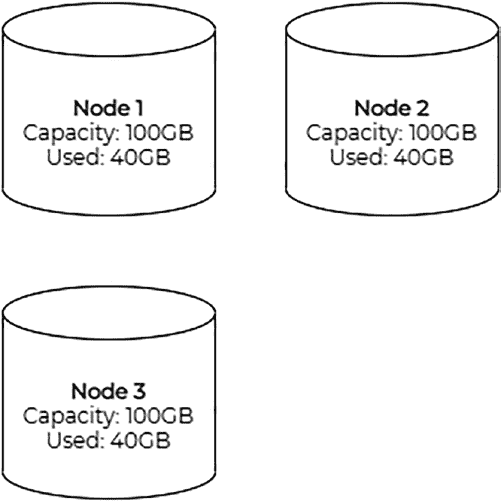
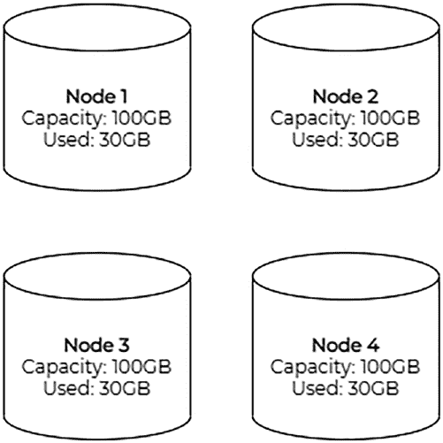

# 实战 CockroachDB

## 构建容错的分布式 SQL 数据库

### Rob Reid

*《实战 CockroachDB：构建容错的分布式 SQL 数据库》*

Rob Reid

Liss, Hampshire, UK

ISBN-13 (平装): 978-1-4842-8223-6

ISBN-13 (电子): 978-1-4842-8224-3

[`doi.org/10.1007/978-1-4842-8224-3`](https://doi.org/10.1007/978-1-4842-8224-3)

版权所有 © 2022 Rob Reid

本作品受版权法保护。出版者保留所有权利，无论涉及材料的全部或部分，特别是翻译、转载、图表重用、朗诵、广播、缩微胶片或其他任何物理方式的复制，以及信息存储和检索、电子改编、计算机软件，或当前已知或未来开发的任何类似或不同的方法。

本书中可能出现商标名称、标识和图像。我们仅以编辑方式且为了商标所有者的利益使用这些名称、标识和图像，无意侵犯商标权。

本书中使用的商品名称、商标、服务标识和类似术语，即使未特别标识，也不应被视为表达其是否受专有权利约束的意见。

尽管本书中的建议和信息在出版时被认为是真实和准确的，但作者、编辑或出版商对可能存在的任何错误或遗漏不承担任何法律责任。出版商对本出版物所含材料不作任何明示或暗示的保证。

Apress Media LLC 总经理: Welmoed Spahr

组稿编辑: Jonathan Gennick

策划编辑: Laura Berendson

协调编辑: Jill Balzano

封面图片由 Maximalfocus 拍摄于 Unsplash

本书通过 Springer Science+Business Media LLC 全球发行，地址：1 New York Plaza, Suite 4600, New York, NY 10004。电话 1-800-SPRINGER，传真 (201) 348-4505，电子邮件 orders-ny@springer-sbm.com，或访问 www.springeronline.com。Apress Media, LLC 是加利福尼亚州的有限责任公司，其唯一成员（所有者）是 Springer Science + Business Media Finance Inc (SSBM Finance Inc)。SSBM Finance Inc 是一家 `特拉华州` 公司。

有关翻译事宜，请发送电子邮件至 booktranslations@springernature.com；有关转载、平装或音频版权事宜，请发送电子邮件至 bookpermissions@springernature.com。

Apress 的图书可批量购买用于学术、企业或促销用途。大多数图书也提供电子书版本和许可证。更多信息，请参考我们的印刷版和电子书批量销售网页：http://www.apress.com/bulk-sales。

作者在书中引用的任何源代码或其他补充材料均可在 GitHub 上获取。

采用无酸纸印刷

*献给 Emily、Ruby 和我们即将出生的小宝贝。*

*感谢你们给予我的空间和耐心，*

*让我能够完成这个精彩的项目。*

## 目录

**关于作者**

**关于技术审校者**

**致谢**

**前言**

**第 1 章：CockroachDB 的缘起**

[什么是 CockroachDB？](https://doi.org/10.1007/978-1-4842-8224-3_1#Sec1)

[CockroachDB 的架构](https://doi.org/10.1007/978-1-4842-8224-3_1#Sec2)

[CockroachDB 解决什么问题？](https://doi.org/10.1007/978-1-4842-8224-3_1#Sec3)

[CockroachDB 适用于谁？](https://doi.org/10.1007/978-1-4842-8224-3_1#Sec4)

**第 2 章：安装 CockroachDB**

[许可证](https://doi.org/10.1007/978-1-4842-8224-3_2#Sec1)

[免费选项](https://doi.org/10.1007/978-1-4842-8224-3_2#Sec2)

[付费选项](https://doi.org/10.1007/978-1-4842-8224-3_2#Sec3)

[CockroachDB Core](https://doi.org/10.1007/978-1-4842-8224-3_2#Sec4)

[本地安装](https://doi.org/10.1007/978-1-4842-8224-3_2#Sec5)

[二进制安装](https://doi.org/10.1007/978-1-4842-8224-3_2#Sec6)

[Docker 安装](https://doi.org/10.1007/978-1-4842-8224-3_2#Sec7)

[Kubernetes 安装](https://doi.org/10.1007/978-1-4842-8224-3_2#Sec8)

[多节点集群](https://doi.org/10.1007/978-1-4842-8224-3_2#Sec14)

[多区域集群](https://doi.org/10.1007/978-1-4842-8224-3_2#Sec15)

[demo 命令](https://doi.org/10.1007/978-1-4842-8224-3_2#Sec19)

[CockroachDB Serverless/Dedicated](https://doi.org/10.1007/978-1-4842-8224-3_2#Sec20)

[创建集群](https://doi.org/10.1007/978-1-4842-8224-3_2#Sec21)

[连接到集群](https://doi.org/10.1007/978-1-4842-8224-3_2#Sec22)

[小结](https://doi.org/10.1007/978-1-4842-8224-3_2#Sec23)

**第 3 章：核心概念**

[数据库对象](https://doi.org/10.1007/978-1-4842-8224-3_3#Sec1)

[数据类型](https://doi.org/10.1007/978-1-4842-8224-3_3#Sec2)

[UUID](https://doi.org/10.1007/978-1-4842-8224-3_3#Sec3)

[ARRAY](https://doi.org/10.1007/978-1-4842-8224-3_3#Sec4)

[BIT](https://doi.org/10.1007/978-1-4842-8224-3_3#Sec5)

[BOOL](https://doi.org/10.1007/978-1-4842-8224-3_3#Sec6)

[BYTES](https://doi.org/10.1007/978-1-4842-8224-3_3#Sec7)

[DATE](https://doi.org/10.1007/978-1-4842-8224-3_3#Sec8)

[ENUM](https://doi.org/10.1007/978-1-4842-8224-3_3#Sec9)

[DECIMAL](https://doi.org/10.1007/978-1-4842-8224-3_3#Sec10)

[FLOAT](https://doi.org/10.1007/978-1-4842-8224-3_3#Sec11)

[INET](https://doi.org/10.1007/978-1-4842-8224-3_3#Sec12)

[INTERVAL](https://doi.org/10.1007/978-1-4842-8224-3_3#Sec13)

[JSONB](https://doi.org/10.1007/978-1-4842-8224-3_3#Sec14)

[SERIAL](https://doi.org/10.1007/978-1-4842-8224-3_3#Sec15)

[STRING](https://doi.org/10.1007/978-1-4842-8224-3_3#Sec16)

[TIME/TIMETZ](https://doi.org/10.1007/978-1-4842-8224-3_3#Sec17)

[TIMESTAMP/TIMESTAMPTZ](https://doi.org/10.1007/978-1-4842-8224-3_3#Sec18)

[GEOMETRY](https://doi.org/10.1007/978-1-4842-8224-3_3#Sec19)

[函数](https://doi.org/10.1007/978-1-4842-8224-3_3#Sec20)

[地理分区数据](https://doi.org/10.1007/978-1-4842-8224-3_3#Sec21)

[REGION BY ROW](https://doi.org/10.1007/978-1-4842-8224-3_3#Sec22)

[REGION BY TABLE](https://doi.org/10.1007/978-1-4842-8224-3_3#Sec23)

**第 4 章：通过命令行管理 CockroachDB**

[Cockroach 二进制文件](https://doi.org/10.1007/978-1-4842-8224-3_4#Sec1)

[start 和 start-single-node 命令](https://doi.org/10.1007/978-1-4842-8224-3_4#Sec2)

[demo 命令](https://doi.org/10.1007/978-1-4842-8224-3_4#Sec3)

[cert 命令](https://doi.org/10.1007/978-1-4842-8224-3_4#Sec4)

[sql 命令](https://doi.org/10.1007/978-1-4842-8224-3_4#Sec5)

[node 命令](https://doi.org/10.1007/978-1-4842-8224-3_4#Sec6)

[import 命令](https://doi.org/10.1007/978-1-4842-8224-3_4#Sec7)

[sqlfmt 命令](https://doi.org/10.1007/978-1-4842-8224-3_4#Sec8)

[workload 命令](https://doi.org/10.1007/978-1-4842-8224-3_4#Sec9)

**第 5 章：与 CockroachDB 交互**

[连接到 CockroachDB](https://doi.org/10.1007/978-1-4842-8224-3_5#Sec1)

[使用工具连接](https://doi.org/10.1007/978-1-4842-8224-3_5#Sec2)

[通过编程连接](https://doi.org/10.1007/978-1-4842-8224-3_5#Sec3)

[设计数据库](https://doi.org/10.1007/978-1-4842-8224-3_5#Sec9)

[数据库设计](https://doi.org/10.1007/978-1-4842-8224-3_5#Sec10)

[模式设计](https://doi.org/10.1007/978-1-4842-8224-3_5#Sec11)

[表设计](https://doi.org/10.1007/978-1-4842-8224-3_5#Sec12)

[视图设计](https://doi.org/10.1007/978-1-4842-8224-3_5#Sec16)

[移动数据](https://doi.org/10.1007/978-1-4842-8224-3_5#Sec19)

[导出和导入数据](https://doi.org/10.1007/978-1-4842-8224-3_5#Sec20)

[监视数据库变更](https://doi.org/10.1007/978-1-4842-8224-3_5#Sec21)

**第 6 章：数据隐私**

[全球法规](https://doi.org/10.1007/978-1-4842-8224-3_6#Sec1)

[特定地点的考量](https://doi.org/10.1007/978-1-4842-8224-3_6#Sec2)

[拥有英国和欧洲客户的英国公司](https://doi.org/10.1007/978-1-4842-8224-3_6#Sec3)

[拥有欧洲和美国客户的欧洲公司](https://doi.org/10.1007/978-1-4842-8224-3_6#Sec4)

[拥有美国客户的美国公司](https://doi.org/10.1007/978-1-4842-8224-3_6#Sec5)

[拥有美国和欧洲客户的美国公司](https://doi.org/10.1007/978-1-4842-8224-3_6#Sec6)

[拥有中国客户的非中国公司](https://doi.org/10.1007/978-1-4842-8224-3_6#Sec7)

[个人身份信息](https://doi.org/10.1007/978-1-4842-8224-3_6#Sec8)

[加密](https://doi.org/10.1007/978-1-4842-8224-3_6#Sec9)

[传输中](https://doi.org/10.1007/978-1-4842-8224-3_6#Sec10)

[静态存储](https://doi.org/10.1007/978-1-4842-8224-3_6#Sec11)

**第 7 章：部署拓扑**

[单区域拓扑](https://doi.org/10.1007/978-1-4842-8224-3_7#Sec1)

[开发环境](https://doi.org/10.1007/978-1-4842-8224-3_7#Sec2)

[基础生产环境](https://doi.org/10.1007/978-1-4842-8224-3_7#Sec3)

[多区域拓扑](https://doi.org/10.1007/978-1-4842-8224-3_7#Sec4)

[区域表](https://doi.org/10.1007/978-1-4842-8224-3_7#Sec5)

[全局表](https://doi.org/10.1007/978-1-4842-8224-3_7#Sec6)

[跟随者读取](https://doi.org/10.1007/978-1-4842-8224-3_7#Sec7)

[跟随工作负载](https://doi.org/10.1007/978-1-4842-8224-3_7#Sec8)

[反模式](https://doi.org/10.1007/978-1-4842-8224-3_7#Sec9)

[小结](https://doi.org/10.1007/978-1-4842-8224-3_7#Sec10)

**第 8 章：测试**

[结构测试](https://doi.org/10.1007/978-1-4842-8224-3_8#Sec1)

[功能测试](https://doi.org/10.1007/978-1-4842-8224-3_8#Sec2)

[黑盒测试](https://doi.org/10.1007/978-1-4842-8224-3_8#Sec3)

[白盒测试](https://doi.org/10.1007/978-1-4842-8224-3_8#Sec7)

[非功能测试](https://doi.org/10.1007/978-1-4842-8224-3_8#Sec10)

[性能测试](https://doi.org/10.1007/978-1-4842-8224-3_8#Sec11)

[韧性测试](https://doi.org/10.1007/978-1-4842-8224-3_8#Sec13)

**第 9 章：生产环境**

[最佳实践](https://doi.org/10.1007/978-1-4842-8224-3_9#Sec1)

[SELECT 性能](https://doi.org/10.1007/978-1-4842-8224-3_9#Sec2)

[INSERT 性能](https://doi.org/10.1007/978-1-4842-8224-3_9#Sec3)

[UPDATE 性能](https://doi.org/10.1007/978-1-4842-8224-3_9#Sec4)

[集群维护](https://doi.org/10.1007/978-1-4842-8224-3_9#Sec5)

[迁移集群](https://doi.org/10.1007/978-1-4842-8224-3_9#Sec6)

[备份和恢复数据](https://doi.org/10.1007/978-1-4842-8224-3_9#Sec7)

[全量备份](https://doi.org/10.1007/978-1-4842-8224-3_9#Sec8)

[增量备份](https://doi.org/10.1007/978-1-4842-8224-3_9#Sec9)

[加密备份](https://doi.org/10.1007/978-1-4842-8224-3_9#Sec10)

[ locality-aware 备份](https://doi.org/10.1007/978-1-4842-8224-3_9#Sec11)

[计划备份](https://doi.org/10.1007/978-1-4842-8224-3_9#Sec12)

[集群设计](https://doi.org/10.1007/978-1-4842-8224-3_9#Sec13)

[集群规模规划](https://doi.org/10.1007/978-1-4842-8224-3_9#Sec14)

[节点规模规划](https://doi.org/10.1007/978-1-4842-8224-3_9#Sec15)

[监控](https://doi.org/10.1007/978-1-4842-8224-3_9#Sec16)

**索引**

## 关于作者

**Rob Reid** 是一位来自英国伦敦的软件开发者。在他的职业生涯中，他曾为警察、旅行、金融、大宗商品、体育博彩、电信、零售和航空航天行业编写后端、前端和消息软件。他是 CockroachDB 的热心用户，近年来一直与 Cockroach Labs 团队合作，推广该数据库并将其嵌入美国和英国的开发团队。

## 关于技术审校者

**Fernando Ipar** 自 2000 年以来一直从事开源数据库的工作，专注于性能、扩展和高可用性。他目前在 Life360 担任数据库可靠性工程师。在此之前，他曾在 Perceptyx、Pythian 和 Percona 等公司工作。工作之余，Fernando 喜欢和妻子一起去植物苗圃，与孩子们一起演奏音乐，并为家里的猫提供良好的服务。

## 致谢

我非常感谢以下人士。他们对本书的贡献对我来说是无价的。

Kai Niemi（Cockroach Labs 解决方案工程师（EMEA））—— 我是在 Kai 成为 Cockroach Labs 的客户时认识他的，并见证了他从一家公司的 CockroachDB 专家转变为全球 CockroachDB 社区值得感激的专家。

Daniel Holt（Cockroach Labs 国际销售工程总监（EMEA 和 APAC））—— 从 Daniel 加入 Cockroach Labs 起，我就与他密切合作，并经常惊叹于他对数据库的全面了解。

Katarina Vetrakova（GoCardless 隐私计划经理）—— Katarina 可能是你所能遇到的最热情的数据隐私专家。她完全致力于这门艺术，自从在 Lush 与她共事以来，她的热情和知识一直激励着我。

Jonathan Gennick（Apress 数据库编辑助理总监）—— 我要感谢 Jonathan Gennick 邀请我写这本书。没有他，这个令人惊叹（且令人恐惧）的机会就不会降临到我身上。在整个写书过程中，他都非常出色，他耐心的知识分享让这位首次写书的作者真正找到了立足点并享受写作的乐趣。

Cockroach Labs 团队 —— Cockroach Labs 团队是我见过的最聪明的人之一。他们对他们的数据库及其客户非常投入，这也是我对 CockroachDB 产生喜爱的重要原因。我要感谢 Cockroach Labs 的以下人士（过去和现在）的帮助、灵感、热情款待和友谊：Jim Walker, Jeff Miller, Carolyn Parrish, Jordan Lewis, Bram Gruneir, Kai Niemi, Daniel Holt, Glenn Fawcett, Tim Veil, Jessica Edwards, Dan Kelly, Lakshmi Kannan, Spencer Kimball, Peter Mattis, Ben Darnell, Nate Stewart, Jesse Seldess, Andy Woods, Meagan Goldman, Megan Mueller, Andrew Deally, Isaac Wong, Vincent Giacomazza, Maria Toft, Tom Hannon, Mikael Austin, Eric Goldstein, Amruta Ranade, Armen Kopoyan, Robert Lee, Charles Sutton, Kevin Maro, James Weitzman, 以及任何我未能提及的人。

## 前言

技术社区时不时会受益于真正具有颠覆性的技术。

我们见过用于编排的 Kubernetes、用于流处理的 Kafka、用于远程过程调用的 gRPC，以及用于基础设施的 Terraform。CockroachDB 在数据领域扮演着这些技术在其各自用例中所扮演的角色；它改变了游戏规则。

我于 2016 年首次发现 CockroachDB，当时我在当时的雇主公司举办 Hackathon 期间使用它来创建快速原型。它立刻让人感到熟悉，仿佛是为开发者设计的，以便他们无需一大群数据库专家的帮助就能构建可靠且可扩展的软件。

在本书中，我将分享我对这款数据库的热情，以及我从它在许多不同用例中的使用中所获得的经验。

### 本书适合谁阅读

本书面向开发者、数据库专家和企业所有者。因此，无论你是处于说服他人使用 CockroachDB 的位置，还是正在寻找工具来补充你的企业技术栈，本书都会对你有所裨益。

你不需要具备 CockroachDB 的现有知识，因为我们将从基础开始，并快速提升到实际示例。任何关系型数据库（尤其是 Postgres）的经验都会有所帮助，但不是必需的。

### 本书导航

本书既是 CockroachDB 的入门指南，也是参考手册。它从 CockroachDB 的“为什么”开始——为什么创建它以及它解决了什么问题。然后深入探讨“是什么”——数据库的数据类型、结构和基础。最后，它涵盖了“如何做”——如何运用你所学的知识来解决现实世界的扩展性、安全性和性能挑战。

本书旨在保持实用性，因此它停留在数据库内部细节之上。要继续你的旅程，我建议阅读 Cockroach Labs 网站上提供的优秀文档和博客文章：[www.cockroachlabs.com.](http://www.cockroachlabs.com)

### 使用代码示例

代码示例可以在 GitHub 上找到，并按章节组织，以帮助你在阅读本书时找到所需内容。

[`github.com/codingconcepts/practical-cockroachdb`](https://github.com/codingconcepts/practical-cockroachdb)

代码在章节内是自包含的，这意味着你不必阅读整本书就能让某些东西运行起来。在某些情况下，代码示例会分布在相邻的代码块中，但这会被明确标出。

我针对 CockroachDB 的 `v21.1.7` 版本执行了所有代码示例，这是撰写本文时该数据库的当前稳定版本。

### 联系方式

**CockroachDB**

info@cockroachlabs.com

53 W 23rd Street

8th Floor

New York, NY

[www.cockroachlabs.com](http://www.cockroachlabs.com)

[`forum.cockroachlabs.com`](https://forum.cockroachlabs.com)

**Rob Reid**

hello@robreid.io

[`robreid.io`](https://robreid.io)

[`twitter.com/robreid_io`](https://twitter.com/robreid_io)

[`github.com/codingconcepts`](https://github.com/codingconcepts)

[www.linkedin.com/in/rob-reid](http://www.linkedin.com/in/rob-reid)

## 第 1 章：CockroachDB 的缘起

数据库是几乎所有有状态系统的关键部分。然而，正确运行它们可能具有挑战性，尤其是在价格、可用性和不断变化的国际数据隐私法规方面。CockroachDB 使得驾驭这一棘手领域不仅更容易，而且令人愉悦。

在本章中，我们将探讨 CockroachDB 的 *为什么*——它为何诞生，以及你可能想考虑将其用于你的数据的原因。

### 什么是 CockroachDB？

CockroachDB 是一个云原生的关系数据库管理系统（`RDBMS`）。它属于“NewSQL”或“DistSQL”（分布式 SQL）数据库类别，旨在提供 NoSQL 数据库的可扩展性，同时为用户提供传统 SQL 数据库的体验和功能。它在协议上与 Postgres 兼容，这意味着你可以使用大多数 Postgres 工具和驱动程序连接到 CockroachDB 集群。要了解哪些驱动程序可用，请访问 [www.cockroachlabs.com/docs/stable/install-client-drivers.html.](http://www.cockroachlabs.com/docs/stable/install-client-drivers.html)

理论上，CockroachDB 是“CP”，在 `CAP 定理` 的语境下，意味着它在面对网络 **P** 分区时，更倾向于数据的 **C** 一致性而非 **A** 可用性。然而在现实中，正如其名所示，CockroachDB 在构建时也考虑了可用性。

实际上，如果你丢失了 CockroachDB 集群中的大多数副本，为了维护数据的完整性，请求将被阻塞，直到节点恢复。因此，调整集群规模以确保在节点丢失时 CockroachDB 能继续运行，是保障可用性的基本要素。

Cockroach Labs——CockroachDB 背后的公司——由 Spencer Kimball、Peter Mattis 和 Ben Darnell 于 2015 年创立。受 Google 的 Spanner 数据库的启发，团队致力于将 Spanner 级别的可扩展性带给大众，消除 Spanner 对原子钟的依赖，并使用高效、现代且日益普及的 Go 编程语言进行编写。

它让你无需数据库部门即可创建多区域数据库。重要的是，它也是一个安全网，使得错误创建这种多区域数据库变得更加困难。

### CockroachDB 的架构

CockroachDB 使用 `Raft 共识` 算法为用户提供一个多活系统，这意味着每个节点都是相同的。没有特殊的“活动”、“领导者”或“写入”节点。每个节点都可以接收不同数据分片（或“range”）的部分读写请求，这有助于 CockroachDB 进行水平扩展。

在底层，CockroachDB 是一个分布式键/值存储。但得益于其 SQL > 事务 > 分布式 > 复制 > 存储的分层架构，你可以像使用任何其他 `RDBMS` 一样丰富地与数据进行交互。

### CockroachDB 解决什么问题？

创建一个新的数据库相对容易，无论采用何种技术。你下载一个二进制文件，拉取一个 Docker 镜像，或开始一个订阅，然后就可以开始了。另一方面，你通常将传统数据库安装在单台机器上，当它无法满足需求时，需要对其进行垂直扩展、分片或添加读取副本。所有这些需求都带来了复杂性、可用性和一致性方面的挑战。

有了 CockroachDB，复杂性和可靠性的挑战就转移到了数据库本身。它负责处理分布式、扩展和复制，让你专注于你的数据。一般来说，如果一个集群需要更多容量，你只需向该集群添加一个节点。CockroachDB 会自动将数据均匀地重新分配到所有节点上。

图 1-1 描绘了一个三节点集群，每个节点容量为 100GB，共享 120GB 总数据中的 40GB。



***图 1-1.** 一个三节点集群*

在图 1-2 中，你会看到当我们添加一个节点时，集群中的数据将在所有四个节点上重新平衡，120GB 总数据中每个节点的份额变为 30GB。



***图 1-2.** 同一个集群，在四个节点上重新平衡*

### CockroachDB 适用于谁？

对于需要可扩展、可靠且分布式的在线事务处理（`OLTP`）数据库的任何人来说，CockroachDB 都是一个绝佳的选择。它专为现代、基于云的基础设施和工作负载而构建，无论是在云中、本地还是两者的混合环境中，它都能很好地适应。

如果你不确定数据库存储需求，它也是一个很好的选择。你可以从小规模开始，随着数据的增长逐个节点地扩展集群。CockroachDB 将确保你的数据在不断增长的集群中均匀且安全地分布。

如果你熟悉 `RDBMS`，CockroachDB 会让你感到熟悉。对于 Postgres 用户，你甚至可能会发现 CockroachDB 可以直接替换你的数据库。

正如你将很快看到的，无论你是想创建一个本地开发数据库还是分布式生产数据库，CockroachDB 的安装都几乎没有麻烦。

CockroachDB 被世界上一些最大的科技、金融、旅行、零售、电信、视频流媒体和游戏公司信任，用于运行关键的、全球分布式的工作流程。它在 [`db-engines.com/en/ranking`](https://db-engines.com/en/ranking) 上的排名也在不断提高。它现在比启发它的 Google Spanner 数据库更受欢迎。

## 第 2 章：安装 CockroachDB

CockroachDB 的众多优势之一就是安装简便。在本章中，我们将探讨 CockroachDB 的许可模式以及各种安装方法。

### 许可证

我们首先介绍 CockroachDB 的许可选项，以熟悉每个选项提供的内容。有免费和付费模式，你的模式选择将取决于你的需求以及每个选项中可用的功能。

#### 免费

有两种免费选项可供选择。一种是 CockroachDB Core 功能的本地安装，另一种是云服务：

*   **CockroachDB Core** —— 构建和弹性扩展分布式数据库，包含许多最关键的功能作为标准；如果你不需要 CockroachDB 的一些更高级功能，这是一个不错的选择。你需要将此选项安装到基于云或本地的硬件上。
*   **CockroachDB Serverless（免费层）** —— 注册并在云中创建一个免费的 CockroachDB 集群。在撰写本文时，此云选项提供与 CockroachDB Core 类似但略有局限的功能，将用户限制为多租户、单节点机器，配备 1 个 vCPU 和 5GB 存储。

#### 付费

为了解锁 CockroachDB 所提供的一切（并支持 Cockroach Labs 继续构建未来的数据库），提供以下付费模式：

*   **CockroachDB Self-Hosted** —— 完整的 CockroachDB 产品，用于基于云或本地的安装。具备地理分区和归档分区、增量备份、静态加密、变更数据捕获以及来自 Cockroach Labs 的直接支持等高级功能。
*   **CockroachDB Dedicated** —— 云中的完整 CockroachDB 产品。除了 CockroachDB Enterprise 外，它还提供 SLA 和特定于云的选项，如 VPC 对等连接。

使用上述任何许可证的决定将取决于你的需求。在以下每个安装选项中，我将提供许可模式的回顾，以帮助你决定哪个最适合你的需求。

### CockroachDB Core

从版本 19.2 开始，CockroachDB Core 受多种许可证约束。一些功能保留了原来的 Apache 2.0 许可证，这意味着它是完全开源的。其他功能受 Cockroach Community License 约束，该许可证保护 Cockroach Labs 免受公司使用其代码构建不使 Cockroach Labs 受益的产品的影响。

简而言之，如果你计划使用 CockroachDB Core 的免费功能来驱动自己的数据库，并且不打算向他人销售 CockroachDB 即服务，那么 CockroachDB Core 是你的不错选择。

### 本地安装

在本节中，我将向你展示如何在本地机器上安装 CockroachDB。对于每种安装方法，为了简洁起见，我们将以不安全配置运行 CockroachDB，这意味着**没有身份验证或加密**。这对于本地开发数据库是可以接受的，但对于其他任何情况则不行。一旦我们安装并测试了本地不安全部署，我们将转向一些真实世界的安全实现。

#### 二进制安装

根据你的操作系统，可以通过多种方式安装 `cockroach` 二进制文件。

对于 Linux 用户，运行以下命令开始：

```
$ curl https://binaries.cockroachdb.com/cockroach-v21.1.7.linux-amd64.tgz | tar -xz
$ sudo cp cockroach-v21.1.7.linux-amd64/cockroach /usr/local/bin/
```

对于 Mac 用户，运行以下命令开始：

```
$ brew install cockroachdb/tap/cockroach
```

对于 Windows 10 用户，运行以下命令开始：

```
$ curl -o cockroach-v21.1.7.windows-6.2-amd64.zip https://binaries.cockroachdb.com/cockroach-v21.1.7.windows-6.2-amd64.zip
$ powershell.exe -NoP -NonI -Command "Expand-Archive '.\cockroach-v21.1.7.windows-6.2-amd64.zip' '.'"
```

然后进入（`cd`）`cockroach-v21.1.7.windows-6.2-amd64` 目录，并在需要时调用 `cockroach` 可执行文件；或者将其所在目录添加到你的 `PATH` 中，从任何目录调用 `cockroach` 可执行文件。

现在 `cockroach` 可执行文件已可用，你可以使用以下命令启动 CockroachDB 的本地实例：

```
$ cockroach start-single-node --insecure --listen-addr=localhost
```

我们刚刚启动了一个单节点、不安全的集群，监听 `localhost`，SQL 连接的默认端口是 `26527`，HTTP 连接的端口是 `8080`。

要测试 CockroachDB 是否已启动并运行，请使用 `cockroach sql` 命令进入 CockroachDB SQL shell。注意，可以省略 `--host` 参数，因为默认值假设是本地运行的节点使用默认端口：

```
$ cockroach sql --insecure
#
# 欢迎使用 CockroachDB SQL shell。
# 所有语句必须以分号结尾。
# 退出，请输入: \q。
#
# 服务器版本: CockroachDB CCL v21.1.7 (x86_64-pc-linux-gnu, built 2021/09/01 14:32:57, go1.15.13)
# 集群 ID: d83a0740-4616-4b2a-8003-82ea5e394548
#
# 输入 \? 获取简要介绍。
#
root@localhost:26257/defaultdb> \q
```

你现在已经安装并启动了一个本地的单节点 CockroachDB 集群。我们将在本章后面介绍更复杂的集群配置。


