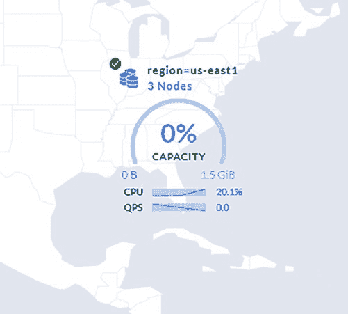
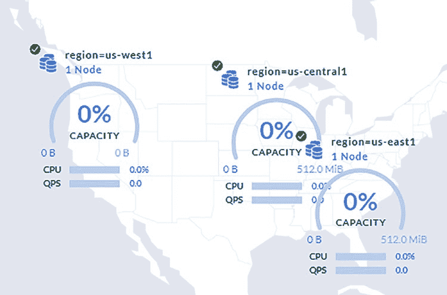

# 第二章 安装 CockroachDB

### 多节点集群

到目前为止，我们只创建了单节点的本地集群，但这**不建议**用于实际场景，因为此类集群无法提供**容错能力**。更好的做法是创建至少包含三个节点的集群，以承受单个节点故障；或至少包含五个节点的集群，以承受两个节点故障。

CockroachDB 文档提供了拓扑结构指南，帮助你应对从单节点到多区域故障的各种情况：
[www.cockroachlabs.com/docs/stable/disaster-recovery.html](http://www.cockroachlabs.com/docs/stable/disaster-recovery.html)

安装多节点 CockroachDB 集群有多种方式。Kubernetes `StatefulSet` 部署是较为简便的选项之一，它能自动处理管理多个应用实例时涉及的手动工作，例如服务发现和滚动更新。在上一节关于通过 Kubernetes 安装的内容中，如果我们操作的是多节点/区域集群，我们的 `StatefulSet` 会为每个节点部署一个 CockroachDB 实例。

在本节中，我们将使用 `cockroach` 二进制文件模拟一个三节点 CockroachDB 集群。

首先，使用以下命令启动三个节点：

```
$ cockroach start \
--insecure \
--store=node1 \
--listen-addr=localhost:26257 \
--http-addr=localhost:8080 \
--join=localhost:26257,localhost:26258,localhost:26259

$ cockroach start \
--insecure \
--store=node2 \
--listen-addr=localhost:26258 \
--http-addr=localhost:8081 \
--join=localhost:26257,localhost:26258,localhost:26259

$ cockroach start \
--insecure \
--store=node3 \
--listen-addr=localhost:26259 \
--http-addr=localhost:8082 \
--join=localhost:26257,localhost:26258,localhost:26259
```

接下来，通过向其中一个节点执行 `init` 命令来初始化集群：

```
$ cockroach init --insecure --host=localhost:26257
集群初始化成功
```

最后，通过向其中一个节点执行 `sql` 命令来连接集群：

```
$ cockroach sql --insecure --host=localhost:26257

#
# 欢迎使用 CockroachDB SQL shell。
# 所有语句必须以分号结尾。
# 输入 \q 退出。
#
# 服务器版本： CockroachDB CCL v21.1.7 (x86_64-apple-darwin19, built
2021/08/09 17:58:36, go1.15.14) (与客户端版本相同)
# 集群 ID： 689b7704-af5d-4527-a638-bad622fff923
#
```


### 多区域集群

如果你正准备在一组已知的机器上创建集群，并且希望避免使用像 Kubernetes 这样的编排工具，那么这对你来说可能是一个不错的选择。

对于许多使用场景，在云服务提供商的单个区域内的多个可用区中安装 CockroachDB，就能为你的数据库提供足够级别的弹性。

如果你需要比单区域部署所能提供的更高的弹性，CockroachDB 也能满足你的需求。在本节中，我们将使用 `cockroachdb` 二进制文件来模拟一个多区域部署。这个集群不仅能承受可用区故障，还能承受整个云服务提供商的*区域*故障。



#### 多区域部署

在前面的例子中，我们是在云服务提供商的单个区域*内部*进行操作。一个可用区的故障会使集群中的一个 CockroachDB 节点下线，剩下的两个节点会继续工作，直到故障节点恢复。从延迟的角度来看，由于其他节点位置接近，这种部署是可以接受的。

在地图上，我们的集群可能类似于图 2-1 中的集群。请注意，节点的地图视图仅对企业版集群可用：

**图 2-1.** 单区域、多节点集群

所有节点都位于某个给定的云服务提供商区域内（例如，如前所示的 `us-east1`）。

在下面的例子中，我们是在*跨*云服务提供商区域进行操作。这意味着区域之间的距离（和延迟）可能非常大。因此，在每个区域只创建一个节点的集群是个坏主意。考虑图 2-2，我们把三节点单区域集群安装到了跨区域而不是跨可用区的环境中。如果我们失去一个节点，集群将继续以两个节点运行。然而，如前所述，节点之间的延迟现在会大得多。



**图 2-2.** 多区域、单节点集群

除了停机问题，我们的集群还会花费大量时间在节点之间复制数据。在具有三个副本节点的集群中写入 CockroachDB 时，需要在 leaseholder 节点（某个数据范围的主要写入节点）与其至少一个 follower 节点之间达成共识。在跨区域集群中，这将耗费时间，导致写入非常缓慢。

我们需要一种新的拓扑结构。

在这个例子中，我们将按区域对数据进行分区，这样数据库的消费者（用户和应用程序等）将访问他们最近的区域来进行所有写入操作。要使这样的集群提供足够的区域和可用区弹性，我们现在需要九个节点。使用以下命令来创建它们：

```
$ cockroach start \
--insecure \
--store=node1 \
--listen-addr=localhost:26257 \
--http-addr=localhost:8080 \
--locality=region=us-east1,zone=us-east1a \
--join='localhost:26257, localhost:26258, localhost:26259'

$ cockroach start \
--insecure \
--store=node2 \
--listen-addr=localhost:26258 \
--http-addr=localhost:8081 \
--locality=region=us-east1,zone=us-east1b \
--join='localhost:26257, localhost:26258, localhost:26259'

$ cockroach start \
--insecure \
--store=node3 \
--listen-addr=localhost:26259 \
--http-addr=localhost:8082 \
--locality=region=us-east1,zone=us-east1c \
--join='localhost:26257, localhost:26258, localhost:26259'

$ cockroach start \
--insecure \
--store=node4 \
--listen-addr=localhost:26260 \
--http-addr=localhost:8083 \
--locality=region=us-central1,zone=us-central1a \
--join='localhost:26257, localhost:26258, localhost:26259'

$ cockroach start \
--insecure \
--store=node5 \
--listen-addr=localhost:26261 \
--http-addr=localhost:8084 \
--locality=region=us-central1,zone=us-central1b \
--join='localhost:26257, localhost:26258, localhost:26259'

$ cockroach start \
--insecure \
--store=node6 \
--listen-addr=localhost:26262 \
--http-addr=localhost:8085 \
--locality=region=us-central1,zone=us-central1c \
--join='localhost:26257, localhost:26258, localhost:26259'

$ cockroach start \
--insecure \
--store=node7 \
--listen-addr=localhost:26263 \
--http-addr=localhost:8086 \
--locality=region=us-west1,zone=us-west1a \
--join='localhost:26257, localhost:26258, localhost:26259'

$ cockroach start \
--insecure \
--store=node8 \
--listen-addr=localhost:26264 \
--http-addr=localhost:8087 \
--locality=region=us-west1,zone=us-west1b \
--join='localhost:26257, localhost:26258, localhost:26259'

$ cockroach start \
--insecure \
--store=node9 \
--listen-addr=localhost:26265 \
--http-addr=localhost:8088 \
--locality=region=us-west1,zone=us-west1c \
--join='localhost:26257, localhost:26258, localhost:26259'
```

接下来，通过向其中一个节点执行 `init` 命令来初始化集群：

```
$ cockroach init --insecure --host=localhost:26257
```

集群已成功初始化。

要以此方式对数据库进行分区，我们需要一个企业版许可证。你可以从 Cockroach Labs 网站获取免费的 30 天试用许可证。立即访问 [www.cockroachlabs.com/get-cockroachdb/enterprise/](http://www.cockroachlabs.com/get-cockroachdb/enterprise/) 页面并获取你的试用企业版许可证。

是时候将集群转换为企业版了！连接到集群中的一个节点并运行以下命令，将 `cluster.organization` 和 `enterprise.license` 的值替换为你在企业版试用邮件中收到的信息：

```
$ cockroach sql --insecure --host=localhost:26257
#
# 欢迎使用 CockroachDB SQL shell。
# 所有语句必须以分号结尾。
# 输入 \q 退出。
#
# 服务器版本: CockroachDB CCL v21.1.7 (x86_64-apple-darwin19, built 2021/08/09 17:58:36, go1.15.14) (与客户端版本相同)
# 集群 ID: 689b7704-af5d-4527-a638-bad622fff923
#
```


