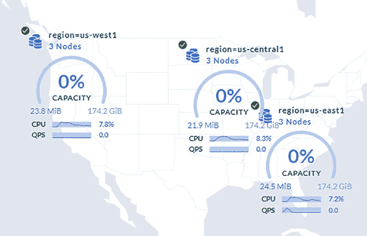

# 输入 `\?` 获取简要介绍。

#

`root@localhost:26257/defaultdb>` `SET CLUSTER SETTING cluster.organization = 'YOUR_ORGANISATION';`
`SET CLUSTER SETTING`

`root@localhost:26257/defaultdb>` `SET CLUSTER SETTING enterprise.license = 'YOUR_ENTERPRISE_LICENSE';`
`SET CLUSTER SETTING`

访问集群中某个节点的集群控制台（例如 `http://localhost:8080`），并将节点列表切换为节点地图视图。图 2-3 显示了此时在集群地图视图中查看企业集群时你将看到的内容。

