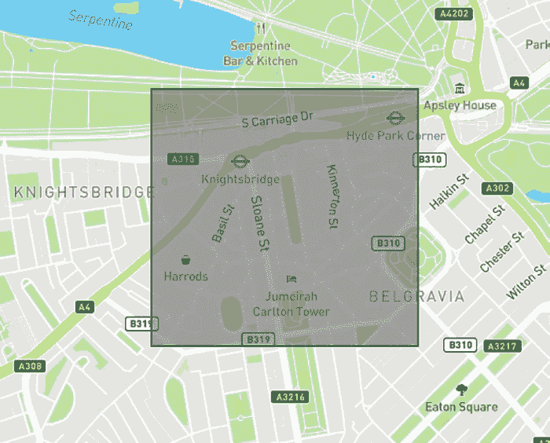
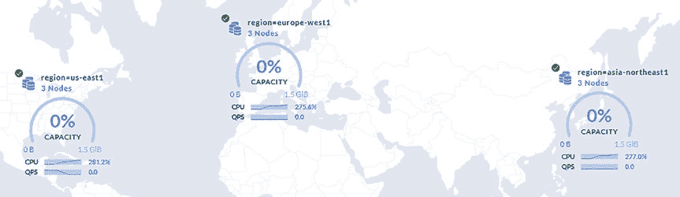

# 第 3 章 概念

是时候深入探索 CockroachDB 了！本章探讨 CockroachDB 的一些构建模块，包括数据类型、索引和地理分区。

首先，让我们探索构成 CockroachDB 的顶级对象。

### 数据库对象

如图 3-1 所示，CockroachDB 中的对象按层次结构排列。

**图 3-1.** CockroachDB 对象层次结构

在 CockroachDB 对象层次结构的顶层，是数据库。数据库包含模式，模式又包含模式对象，如表和视图。

每个 CockroachDB 集群启动时都会包含以下三个数据库：

*   **defaultdb** – 如果客户端在连接配置中未提供数据库名，将连接到 `defaultdb` 数据库。此数据库为空，不为其包含的模式对象提供任何上下文信息。因此，最好避免使用此数据库，而是显式创建和引用命名数据库。如果不需要此数据库，可以删除它。
*   **postgres** – `postgres` 数据库的存在是为了提供与 Postgres 客户端的兼容性。如果不需要此数据库，可以删除它。
*   **system** – `system` 数据库向 CockroachDB 集群提供核心信息，包括与作业、范围、复制、地理位置、用户等有关的信息。

在每个数据库中，都有模式。模式是 CockroachDB 的第二级对象。它们允许你将表和视图等对象分隔到逻辑区域中。例如，假设你有两个业务领域，每个领域都需要自己的表；为每个业务领域设置一个模式不仅可以将这些表逻辑分离，还可以解决命名冲突问题。例如，两个名为“employee”的表不可能存在于同一个模式中。有两个模式时，这就不是问题。

所有新数据库都存在以下默认模式（或“系统目录”）：

```sql
root@:26257/blah> show schemas;
  schema_name     |  owner
------------------+----------
  crdb_internal   | NULL
  information_schema | NULL
  pg_catalog      | NULL
  pg_extension    | NULL
  public          | admin
```

*   **crdb_internal** – `crdb_internal` 模式包含与数据库使用的内部对象相关的信息。这包括指标、作业、警报、租约以及 `CREATE` 操作的审计条目等内容。
*   **information_schema** – `information_schema` 模式包含用户定义对象的信息，如列、索引、表和视图。
*   **pg_catalog** – `pg_catalog` 模式提供与期望存在此模式的 Postgres 客户端的兼容性。它包含与数据库及其包含的对象相关的信息。
*   **pg_extension** – `pg_extension` 模式提供扩展信息。默认情况下，这包括来自“空间特性”扩展的信息，该扩展提供空间数据类型。
*   **public** – 与 `defaultdb` 数据库在未提供数据库名时使用的方式类似，`public` 模式是未提供用户定义模式时使用的默认模式。除非用户提供了其他模式，否则所有用户定义对象都将放入此模式中。

在模式之下是 CockroachDB 的第三级也是最后一级对象。这些包括索引、序列、表、视图和临时对象（如未持久化的临时表等对象）。

### 数据类型

CockroachDB 拥有构建丰富数据库所需的所有数据类型。在本节中，我将向你展示如何以及在何处使用这些数据类型。

#### UUID

`UUID` 数据类型存储 128 位 UUID 值。存储在此列中的值可以是任何 [UUID 版本 1](https://en.wikipedia.org/wiki/Universally_unique_identifier)，但都将使用 RFC 4122 标准进行格式化。让我们创建一个包含 UUID 列的表来了解更多相关信息。

首先，让我们创建一个包含 UUID 列的示例表：

```sql
CREATE TABLE person (id UUID);
```

接下来，我们向其中插入一些数据；请注意，UUID 在有或没有花括号的情况下都是有效的，可以作为统一资源名称（URN），或作为 16 字节字符串：

```sql
INSERT INTO person (id) VALUES ('a33c928b-a138-4419-9f1f-8d8a137235d3');
INSERT INTO person (id) VALUES ('{1800ebff-bf6d-52c0-842f-d8db25e15ced}');
INSERT INTO person (id) VALUES ('urn:uuid:f2c6408a-3c3f-4071-9bcf-1a669d40c07f');
INSERT INTO person (id) VALUES (b'1oqpb0zna$*k4al~');
```

从表中选择 UUID 会显示它们的存储表示形式，尽管我们以不同方式插入了它们：

```sql
SELECT * FROM person;
```

```
                   id
---------------------------------------
  a33c928b-a138-4419-9f1f-8d8a137235d3
  1800ebff-bf6d-52c0-842f-d8db25e15ced
  f2c6408a-3c3f-4071-9bcf-1a669d40c07f
  316f7170-6230-7a6e-6124-2a6b34616c7e
```

当你需要表的唯一 ID 时，UUID 列是一个很好的选择。与其自己提供 UUID，不如让 CockroachDB 在插入时为我们生成它们：

```sql
CREATE TABLE "person" (
    "id" UUID DEFAULT gen_random_uuid() PRIMARY KEY
);
```

CockroachDB 仅在未提供默认值时生成默认值，因此你仍然可以自己提供值。

#### ARRAY

`ARRAY` 数据类型存储另一种数据类型的扁平（或一维）集合。它可以使用为可分词数据（如数组的值或 JSON 对象中的键值对）设计的倒排索引进行索引。让我们创建一个包含 ARRAY 列的表来了解更多相关信息。

首先，我们将创建一个包含 ARRAY 列的表。数组使用 `TYPE[]` 语法或 `TYPE ARRAY` 语法创建，如下所示：

```sql
-- 使用 TYPE[] 语法创建：
CREATE TABLE person (
    id UUID DEFAULT gen_random_uuid() PRIMARY KEY,
    pets STRING[]
);

-- 使用 TYPE ARRAY 语法创建：
CREATE TABLE person (
    id UUID DEFAULT gen_random_uuid() PRIMARY KEY,
    pets STRING ARRAY
);
```

接下来，我们插入一些数据：

```sql
INSERT
INTO person (pets)
VALUES (ARRAY['Max', 'Duke']),
       (ARRAY['Snowball']),
       (ARRAY['Gidgit']),
       (ARRAY['Chloe']);
```

从表中选择值会显示它们在 CockroachDB 中的表示形式：

```sql
SELECT * FROM person;
```

```
                   id                   |    pets
---------------------------------------+-------------
  59220317-cc79-4689-b05f-c21886a7986d | {Max,Duke}
  5b4455a2-37e7-49de-bd6f-cdd070e8c133 | {Snowball}
  659dce69-03b8-4872-b6af-400e95bf43d9 | {Gidgit}
  f4ef9111-f118-4f66-b950-921d8c1c3291 | {Chloe}
```

你可以对 ARRAY 列执行许多操作。我们只介绍最常见的几种。

要返回 ARRAY 列中包含特定值的行，我们可以使用“包含”运算符。以下命令返回任何拥有名为 Max 的宠物的人的 ID：

```sql
SELECT id FROM person WHERE pets @> ARRAY['Max'];
```

```
                   id
---------------------------------------
  59220317-cc79-4689-b05f-c21886a7986d
```

要返回其 ARRAY 列在给定数组内的行，我们可以使用“被包含于”运算符。以下命令返回其完整宠物列表包含在给定数组中的任何人的 ID：

```sql
SELECT id FROM person WHERE pets <@ ARRAY['Max', 'Duke', 'Snowball'];
```

```
                   id
---------------------------------------
  59220317-cc79-4689-b05f-c21886a7986d
  5b4455a2-37e7-49de-bd6f-cdd070e8c133
```

如果你知道某人的一只宠物的名字但不是全部，可以使用重叠运算符查找其宠物包含在给定数组中的任何人的 ID：

```sql
SELECT id FROM person WHERE pets && ARRAY['Max', 'Snowball'];
```

```
                   id
---------------------------------------
  59220317-cc79-4689-b05f-c21886a7986d
  5b4455a2-37e7-49de-bd6f-cdd070e8c133
```

向数组添加一个元素（请注意，对于插入操作，你可以使用 `array_append` 或追加运算符 `||`）：

```sql
UPDATE person
SET pets = array_append(pets, 'Duke')
WHERE id = '59220317-cc79-4689-b05f-c21886a7986d';
```

从数组中移除一个元素：

```sql
UPDATE person
SET pets = array_remove(pets, 'Duke')
WHERE id = '59220317-cc79-4689-b05f-c21886a7986d';
```

要充分利用 ARRAY 列，你需要使用倒排索引，因为如果没有它，CockroachDB 将不得不执行全表扫描，如下所示：

```sql
EXPLAIN SELECT id FROM person WHERE pets @> ARRAY['Max'];
```

```
        info
------------------------
  distribution: full
  vectorized: true
  • filter
  │ estimated row count: 0
  │ filter: pets @> ARRAY['Max']
  │
  └── • scan
        estimated row count: 4 (100% of the table; stats collected 16 minutes ago)
        table: person@primary
        spans: FULL SCAN
```

你可以在新表中如下配置 ARRAY 列上的倒排索引：

```sql
CREATE TABLE person (
    id UUID DEFAULT gen_random_uuid() PRIMARY KEY,
    pets STRING[],
    INVERTED INDEX (pets)
);
```

你可以在现有表中如下配置 ARRAY 列上的倒排索引：

```sql
CREATE INVERTED INDEX [OPTIONAL_NAME] ON person (pets);
```

#### BIT

`BIT` 数据类型存储位数组。`BIT` 列可以存储不同数量的位，并且可以包含确切数量或可变数量的位：

```sql
CREATE TABLE bits (
    exactly_1 BIT,
    exactly_64 BIT(64),
    any_size  VARBIT,
    up_to_64  VARBIT(64)
);
```

可以如下将值插入 `BIT` 列（请注意，每个值前的 `B` 表示二进制字符串）：

```sql
INSERT
INTO bits (exactly_1, exactly_64, any_size, up_to_64)
VALUES (
    B'1',
    B'1010101010101010101010101010101010101010101010101010101010101010',
    B'10101',
    B'10101010101'
);
```

#### BOOL

`BOOL` 或 `BOOLEAN` 数据类型存储真或假值，并创建如下：

```sql
CREATE TABLE person (
    id                     UUID DEFAULT gen_random_uuid() PRIMARY KEY,
    wants_marketing_emails BOOL NOT NULL
);
```

使用布尔字面量或通过从整数类型转换来向 `BOOL` 列提供值：

```sql
INSERT
INTO person (wants_marketing_emails)
VALUES
    (1::BOOL),      -- True（任何非零数字）
    (true),         -- 字面量 true
    (12345::BOOL),  -- True（任何非零数字）
    (0::BOOL),      -- False（零值）
    (false);        -- 字面量 false
```

#### BYTES

`BYTES`、`BYTEA` 或 `BLOB` 数据类型存储 `TEXT` 字符串的等效字节数组，并可创建如下：

```sql
CREATE TABLE person (
    id       UUID DEFAULT gen_random_uuid() PRIMARY KEY,
    password BYTES NOT NULL
);
```

你可以通过多种方式插入 `BYTES` 值。`TEXT` 字符串将自动转换为 `BYTES`，CockroachDB 支持各种编码方法以进行细粒度的插入值控制：

```sql
INSERT
INTO person (password)
VALUES
    ('password'),                        -- 字符串值
    (b'password'),                       -- 字节数组字面量
    (x'70617373776f7264'),               -- 十六进制字面量
    (b'\x70\x61\x73\x73\x77\x6f\x72\x64'); -- 十六进制字符
```

前面插入的每个结果行都将具有相同的 `password` 列值。

#### DATE

`DATE` 数据类型存储日、月、年值，并创建如下：

```sql
CREATE TABLE person (
    id           UUID DEFAULT gen_random_uuid() PRIMARY KEY,
    date_of_birth DATE NOT NULL
);
```

向 `DATE` 列提供值作为字符串字面量、解释型字面量、时间戳（将被截断到日精度）或表示自纪元以来*天*数的数字：

```sql
INSERT
INTO person (date_of_birth)
VALUES
    ('1941-09-09'),               -- 字符串字面量
    (DATE '1941-09-09'),          -- 解释型字面量
    ('1941-09-09T01:02:03.456Z'), -- 时间戳（将被截断）
    (CAST(-10341 AS DATE));       -- 自纪元以来的天数
```

前面插入的每个结果行都将具有相同的 `date_of_birth` 列值。

#### ENUM

`ENUM` 数据类型提供一个在插入时进行验证的枚举，并创建如下：

```sql
CREATE TYPE planet AS ENUM (
    'mercury',
    'venus',
    'earth',
    'mars',
    'jupiter',
    'saturn',
    'uranus',
    'neptune'
);

CREATE TABLE person (
    id              UUID DEFAULT gen_random_uuid() PRIMARY KEY,
    favourite_planet planet NOT NULL
);
```

与 CockroachDB 的许多数据类型一样，`ENUM` 列可以从字符串字面量、解释型字面量或通过直接转换从字符串转换而来：

```sql
INSERT
INTO person (favourite_planet)
VALUES
    ('neptune'),            -- 字符串字面量
    (planet 'earth'),       -- 解释型字面量
    (CAST('saturn' AS planet)); -- 转换
```

#### DECIMAL

`DECIMAL`、`DEC` 或 `NUMERIC` 数据类型存储精确的定点[²]数字，大小可变，可以在指定或不指定精度的情况下创建。

让我们首先创建一个未指定精度和标度的 `DECIMAL` 列：

```sql
CREATE TABLE person (
    id              UUID DEFAULT gen_random_uuid() PRIMARY KEY,
    bitcoin_balance DECIMAL NOT NULL
);
```

向此表插入一些值将显示仅使用表示该数字所需的数字：

```sql
INSERT
INTO person (bitcoin_balance)
VALUES
    (0.000030),
    (0.80),
    (147.50);
```

```sql
SELECT * FROM person;
```

```
                   id                   | bitcoin_balance
---------------------------------------+------------------
  2880768d-802f-4096-933d-68be971b3a73 | 147.50
  975d5aa2-7769-48e1-99dc-693b6a3fc07f | 0.80
  f8a19a8f-c40c-4b6d-b186-18688f020f2b | 0.000030
```

现在，让我们重新创建表，这次为 `DECIMAL` 列提供精度和标度。`DECIMAL` 列类型现在接受两个参数：第一个定义值的精度，第二个定义标度。精度参数告诉 CockroachDB 整数位数（小数点左侧的数字）和小数位数（小数点右侧的数字）的最大值：

```sql
CREATE TABLE person (
    id              UUID DEFAULT gen_random_uuid() PRIMARY KEY,
    bitcoin_balance DECIMAL(16, 8) NOT NULL
);
```

向此表插入一些值将显示使用了所有八位小数位：

```sql
INSERT
INTO person (bitcoin_balance)
VALUES
    (0.000030),
    (0.80),
    (147.50);
```

```sql
SELECT * FROM person;
```

```
                   id                   | bitcoin_balance
---------------------------------------+------------------
  8de29c92-13f8-4f4c-abef-62c7ff3cdb87 | 0.00003000
  ee2e01fa-7ff0-4a10-9c09-f2e607e6ec49 | 0.80000000
  f9180229-d42f-45b5-b6fc-914396219da8 | 147.50000000
```

可以如下在 `DECIMAL` 列中插入无穷大和 `NAN`（非数字）值：

```sql
INSERT
INTO person (bitcoin_balance)
VALUES
    ('inf'), ('infinity'), ('+inf'), ('+infinity'),
    ('-inf'), ('-infinity'),
    ('nan');
```

无限大的比特币。人可以有梦想。

#### FLOAT

`FLOAT`、`FLOAT4`（`REAL`）和 `FLOAT8`（`DOUBLE PRECISION`）数据类型存储不精确的浮点数，精度高达 17 位，并创建如下：

```sql
CREATE TABLE person (
    id        UUID DEFAULT gen_random_uuid() PRIMARY KEY,
    latitude  FLOAT NOT NULL,
    longitude FLOAT NOT NULL
);
```

```sql
INSERT
INTO person (latitude, longitude)
VALUES
    (38.908200917747095, -77.03236828895616),
    (52.382578005867906, 4.855332269875395),
    (51.46112343492288, -0.11128454244911225),
    (51.514018690098645, -0.1267503331073194);
```

```sql
SELECT * FROM person;
```

```
                   id                   |      latitude      |     longitude
---------------------------------------+--------------------+----------------------
  19f0cfcc-a073-4d96-850c-e121f1e940b6 | 52.382578005867906 |   4.855332269875395
  78a03a7c-afe4-4196-bc0c-0e86841373e4 | 51.46112343492288  | -0.11128454244911225
  9c68004e-2265-4ebf-b14c-20fa6292dc6c | 38.908200917747095 | -77.03236828895616
  a9b502c0-8ffd-4e75-a796-4e87554a3ebd | 51.514018690098645 | -0.1267503331073194
```

#### INET

`INET` 数据类型存储有效的 IPv4 和 IPv6 地址以及 CIDR（无类别域间路由），并创建如下：

```sql
CREATE TABLE person (
    id UUID DEFAULT gen_random_uuid() PRIMARY KEY,
    ip INET NOT NULL
);
```

向此表插入一些值将显示 CockroachDB 理解正在插入的 IP 地址，并删除任何冗余掩码：

```sql
INSERT
INTO person (ip)
VALUES
    ('10.0.1.0/24'),
    ('10.0.1.1/32'),
    ('229a:d983:f190:75ef:5f06:a5a8:f5c2:8500/128'),
    ('229a:d983:f190:75ef:5f06:a5a8:f5c2:853f/100');
```

```sql
SELECT * FROM person;
```

```
                   id                   |                  ip
---------------------------------------+----------------------------------------
  29121f2e-e977-474b-9fb5-818399ed7b9f | 10.0.1.0/24
  5cce3936-9f27-4e00-b0dc-9866e621270f | 10.0.1.1
  9b53053d-ce6e-416a-9b63-9d0bc9bc9870 | 229a:d983:f190:75ef:5f06:a5a8:f5c2:8500
  d383ef34-b24d-48b8-b008-57f4e001faa3 | 229a:d983:f190:75ef:5f06:a5a8:f5c2:853f/100
```

请注意，`10.0.1.0/24` 地址保留了其掩码，因为此地址的 `/24` 掩码包括从 `10.0.1.0` 到 `10.0.1.255` 的地址。另一方面，`10.0.1.1/32` 地址的掩码为 `/32`，意思是“仅此 IP 地址”，这意味着我们有一个特定的 IP 地址，掩码是多余的。IPv6 地址也是如此，其中 `/128` 表示“仅此 IP 地址”。

#### INTERVAL

`INTERVAL` 数据类型存储从微秒到年不等的持续时间，并创建如下：

```sql
CREATE TABLE rodeo_records (
    id       UUID DEFAULT gen_random_uuid() PRIMARY KEY,
    duration INTERVAL NOT NULL
);
```

你可以将持续时间提供为 ISO 8601 字符串、时间字符串和秒数。从表中选择行会显示值的存储方式以及如何将它们转换为秒：

```sql
INSERT
INTO rodeo_records (duration)
VALUES
    ('10:45:00.0'), -- 时间字符串
    ('1h30m'),      -- ISO 8601 字符串
    (30::INTERVAL); -- 秒
```

```sql
SELECT id, duration, duration::INT FROM rodeo_records;
```

```
                   id                   | duration | duration
---------------------------------------+----------+-----------
  102cbbc8-6001-4642-b7e4-b4cbd9b03d35 | 10:45:00 | 38700
  665f4306-0407-4d48-ab1c-4c628cd3e1d3 | 01:30:00 | 5400
  7fbf8859-65fa-4100-ae61-f9bff76b89ec | 00:00:30 | 30
```

#### JSONB

`JSONB`、`JSON` 数据类型存储任意 JSON 对象，非常适合存储半结构化数据（其结构不适合或可能超出关系数据库表的数据）。`JSONB` 列可创建如下：

```sql
CREATE TABLE song (
    id      UUID DEFAULT gen_random_uuid() PRIMARY KEY,
    details JSONB NOT NULL
);
```

如果你计划对 JSON 列执行复杂查询，你将需要为该列创建倒排索引。我将在后续关于性能的章节中介绍这些。

要将数据插入 `JSONB` 列，只需提供一个 JSON 字符串，如下所示：

```sql
INSERT
INTO song (details)
VALUES
    ('{"label": "Century Media", "release_date": "2004-09-20"}'),
    ('{"label": "Season of Mist", "release_date": "2010-02-15"}'),
    ('{"label": "Season of Mist", "release_date": "2016-02-12"}');
```

JSON 列非常灵活。你可以查询其字段并选择特定值返回。让我们现在两者都做一下。以下查询将“Season of Mist”唱片公司发行的歌曲的发行日期作为字符串值返回：

```sql
SELECT
    details->>'release_date' AS release_date
FROM
    song
WHERE
    details @> '{"label": "Season of Mist"}';
```

```
  release_date
----------------
  2010-02-15
  2016-02-12
```

要将特定 JSON 字段作为常规列访问，创建索引，甚至从 JSON 文档中的 JSON 字段创建 `PRIMARY KEY`；使用 `JSON` 数据类型也可以做到这一点。

以下 `CREATE` 语句重新创建了表，但这次它的 `id` 和 `label` 列来自 `details` JSON 列中的字段：

```sql
CREATE TABLE song (
    id      UUID PRIMARY KEY AS ((details->>'id')::UUID) STORED,
    label   TEXT AS ((details->>'label')::TEXT) STORED,
    details JSONB NOT NULL,
    INDEX (label),
    INVERTED INDEX idx_details(details)
);
```

```sql
INSERT
INTO song (details)
VALUES
    ('{"id":"60d28ed4-ee97-43d5-98a7-ba42d478f4c7", "label": "Century Media", "release_date": "2004-09-20"}'),
    ('{"id":"4b158ac6-386d-4143-8281-ca6f0f9c9a93", "label": "Season of Mist", "release_date": "2010-02-15"}'),
    ('{"id":"c82dc39d-f310-45a4-9a31-805d923f1c8e", "label": "Season of Mist", "release_date": "2016-02-12"}');
```

我们现在可以像对待任何其他数据库列一样对待 *id* 和 *label* 列：

```sql
SELECT
    id,
    label,
    details->>'release_date' release_date
FROM
    song
WHERE
    label = 'Season of Mist';
```

#### SERIAL

`SERIAL` 数据类型严格来说不是一种数据类型，而是应用了默认值的 `INT`、`INT2`、`INT4` 或 `INT8`，结果是一个自动递增的数字。`SERIAL` 被引入 CockroachDB 是为了提供 Postgres 兼容性。因此，你应该考虑使用默认值为 `gen_random_uuid()` 的 `UUID` 数据类型，而不是 `SERIAL` 数据类型，因为这提供了 128 位的随机性，而 `SERIAL` 的最大随机性只有 64 位。

`SERIAL` 列可创建如下：

```sql
CREATE TABLE random (
    r1 SERIAL2,  -- 16 位，又名 SMALLSERIAL
    r2 SERIAL4,  -- 32 位
    r3 SERIAL8   -- 64 位，又名 SERIAL 或 BIGSERIAL
);
```

向此表插入数据将显示需要仔细阅读 [SERIAL 文档³] 才能完全理解此数据类型的细微差别：

```sql
INSERT
INTO random
DEFAULT VALUES;

SELECT * FROM random;
```

```
         r1         |         r2         |         r3
--------------------+--------------------+---------------------
  698584214451748865 | 698584214451781633 | 698584214451814401
  698584216070979585 | 698584216071012353 | 698584216071045121
  698584216921047041 | 698584216921079809 | 698584216921112577
  698584217849954305 | 698584217849987073 | 698584217850019841
```

从生成的值可以看出，无论数据类型定义提供的整数大小如何，生成这些值的默认模式（`unique_rowid()`）将始终产生一个 64 位整数。

#### STRING

`STRING`、`TEXT`、`CHARACTER`、`CHAR` 或 `VARCHAR` 数据类型存储固定或可变长度的 Unicode 字符串，并创建如下：

```sql
CREATE TABLE person (
    id         UUID DEFAULT gen_random_uuid() PRIMARY KEY,
    first_name TEXT NOT NULL,
    last_name  VARCHAR(50) NOT NULL,
    grade      CHAR NOT NULL
);
```

通过显示表的列，我们可以看到数据类型在底层解析为什么：

```sql
SELECT column_name, data_type
FROM [SHOW COLUMNS FROM person];
```

```
  column_name | data_type
--------------+--------------
  id          | UUID
  first_name  | STRING
  last_name   | VARCHAR(50)
  grade       | CHAR
```

请注意，`VARCHAR(n)` 实际上是 `STRING(n)` 的别名，但为了 Postgres 兼容性，此处仍表示为 `VARCHAR(n)`，因为 Postgres 没有 `STRING` 数据类型。

向此表插入数据将显示 CockroachDB 忠实地表示 Unicode 字符。与 Postgres 一样，如果你尝试插入不适合固定长度或有限可变长度列的数据，CockroachDB 将返回错误。

#### TIME/TIMETZ

`TIME` 和 `TIMEZ` 数据类型分别以 UTC 和带时区表示形式存储时间（减去日期）值。它们可以存储各种精度的时间值，从秒精度到微秒精度。

Cockroach Labs 建议使用 `TIME` 变体并在前端转换为本地时间。

```sql
CREATE TABLE schedule (
    name       STRING(50) NOT NULL,
    time_of_day TIME NOT NULL
);

INSERT INTO schedule (name, time_of_day)
VALUES
    ('Take dogs for walk', '10:30:00'),
    ('Make lunch', '12:00:00');

SELECT * FROM schedule;
```

```
         name         | time_of_day
---------------------+--------------
  Take dogs for walk | 10:30:00
  Make lunch         | 12:00:00
```

#### TIMESTAMP/TIMESTAMPTZ

`TIMESTAMP` 和 `TIMESTAMPTZ` 数据类型分别以 UTC 和带时区表示形式存储时间戳值，并*显示* UTC 和带时区的表示形式。

Cockroach Labs 建议使用 `TIMESTAMPTZ` 数据类型而非 `TIMESTAMP` 数据类型以使其更明确，因此我将演示 `TIMESTAMPTZ` 数据类型的用法，其创建如下：

```sql
CREATE TABLE episode_schedule (
    id             UUID DEFAULT gen_random_uuid() PRIMARY KEY,
    name           TEXT NOT NULL,
    next_show_time TIMESTAMPTZ(0) NOT NULL
);
```

如你所见，`TIMESTAMP` 数据类型允许提供可选的精度。此精度接受零（表示秒精度）到六（表示微秒精度）之间的值。`TIMESTAMP` 数据类型的默认精度为 6，因此在大多数情况下，你可以完全省略精度。

让我们向表中插入一些数据，以显示其在不同时区用户中的表示形式：

```sql
INSERT
INTO episode_schedule (name, next_show_time)
VALUES
    ('South Park - The Tail of Sc...', '2021-12-10 22:00:00+00:00'),
    ('South Park - Grounded Vinda...', '2021-12-10 22:30:00+00:00'),
    ('South Park - Make Love, Not...', '2021-12-10 23:00:00+00:00');
```

现在让我们从表中选择行，一次用于 UTC 时区用户，一次用于美国东部夏令时（EDT）时区用户：

```sql
SET TIME ZONE 'UTC';

SELECT next_show_time FROM episode_schedule;
```

```
      next_show_time
-------------------------
  2021-12-10 23:00:00+00
  2021-12-10 22:30:00+00
  2021-12-10 22:00:00+00
```

```sql
SET TIME ZONE 'America/New_York';

SELECT next_show_time FROM episode_schedule;
```

```
      next_show_time
-------------------------
  2021-12-10 18:00:00-05
  2021-12-10 17:30:00-05
  2021-12-10 17:00:00-05
```

如你所见，UTC 时区的用户看到的数据与其插入数据库时一样，而 EDT 时区的用户看到的是其本地时间，比 UTC 偏移 -05:00。

#### GEOMETRY

`GEOMETRY` 和 `GEOGRAPHY` 数据类型分别在可变平面[⁴]几何体上存储空间对象和在球体上存储地球位置，并创建如下：

```sql
CREATE TABLE property (
    id       UUID DEFAULT gen_random_uuid() PRIMARY KEY,
    location GEOMETRY NOT NULL,
    INVERTED INDEX (location)
);
```

`GEOMETRY` 和 `GEOGRAPHY` 数据类型都可以存储以下空间对象：

*   `GEOMETRYCOLLECTION` – 其他空间对象（包括其他 `GEOMETRYCOLLECTION` 对象）的集合
*   `LINESTRING` – 组成任意线的点集合，对道路和河流很有用
*   `MULTILINESTRING` – `LINESTRING` 对象的集合
*   `MULTIPOINT` – `POINT` 对象的集合
*   `MULTIPOLYGON` – `POLYGON` 对象的集合
*   `POINT` – 表示坐标（例如，经度和纬度）的两个点
*   `POLYGON` – 表示区域的点集合

让我们将一些 `GEOMETRY` 数据插入我们的表，并对其执行一些基本操作。在这个场景中，假设我们提供一项允许用户查找商店的服务。我们持有商店位置，用户绘制搜索区域来找到它们。

```sql
INSERT
INTO property (location)
VALUES
    ('POINT(-0.16197244907496533 51.50186005364136)'),
    ('POINT(-0.16139087662866003 51.498542352748814)'),
    ('POINT(-0.17528813494181622 51.48604279157454)');
```

一位非常富有的用户希望在伦敦的骑士桥区域搜索房产，并提供了以下坐标：

```sql
SELECT id FROM property
WHERE ST_CoveredBy(
    location,
    'POLYGON((-0.1642155647277832 51.496975050193456,
              -0.15342235565185544 51.496975050193456,
              -0.15342235565185544 51.50344015477113,
              -0.1642155647277832 51.50344015477113,
              -0.1642155647277832 51.496975050193456))'
);
```

```
                   id
---------------------------------------
  7a37b426-c87e-454e-9d67-2848e05f8326
  de7425c9-9939-4e3c-9f48-f9fabdfca9df
```

他们的查询只返回骑士桥的两处房产，将同样豪华的切尔西房产留给了另一位极其富有的用户。

Postgres 和 CockroachDB 的一个非常简洁的功能是能够将 `GEOMETRY` 数据转换为 GeoJSON；让我们将用户提供的搜索区域转换为 GeoJSON 并在 [`geojson.io`](https://geojson.io) 上可视化它：

```sql
SELECT ST_AsGeoJSON('POLYGON((-0.1642155647277832 51.496975050193456,
                               -0.15342235565185544 51.496975050193456,
                               -0.15342235565185544 51.50344015477113,
                               -0.1642155647277832 51.50344015477113,
                               -0.1642155647277832 51.496975050193456))');
```

```
{"type":"Polygon","coordinates":[[[-0.164215565,51.49697505],[-0.153422356,51.49697505],[-0.153422356,51.503440155],[-0.164215565,51.503440155],[-0.164215565,51.49697505]]]}
```

将此数据粘贴到 GeoJSON 网站将显示用户的搜索区域，如图 3-2 所示。



**图 3-2.** 在 [`geojson.io`](https://geojson.io) 上的 GeoJSON 多边形

### 函数

CockroachDB 提供内置函数以使某些操作更容易，并且有用于处理本章介绍的大多数数据类型的函数。

[内置函数⁵] 要么提供处理数据类型的功能，要么公开核心系统功能，例如处理流摄取和获取系统信息。

我将演示一小部分内置函数的用法，但为简洁起见，我将把其余函数的探索留给读者作为练习。以下代码示例显示了一些更常用的函数，每个函数前面的注释提供了简要说明。

```sql
-- 返回可变参数集合中最大的元素。
SELECT greatest(ARRAY[1, 2, 3], ARRAY[1, 2, 4], ARRAY[1, 2, 2]);
--> {1,2,4}

-- 返回可变参数集合中最小的元素。
SELECT least(ARRAY[1, 2, 3], ARRAY[1, 2, 4], ARRAY[1, 2, 2]);
--> {1,2,2}

-- 返回可变参数集合中非空项的数量。
SELECT num_nonnulls(NULL, 1, NULL, 'a', NULL);
--> 2

-- 返回可变参数集合中空项的数量。
SELECT num_nulls(NULL, 1, NULL, 'a', NULL);
--> 3

-- 从给定的字符串或二进制字符串创建 SHA256 哈希。
SELECT sha256('password');
--> 5e884898da28047151d0e56f8dc6292773603d0d6aabbdd62a11ef721d1542d8

-- 返回给定字符串的 Soundex 代码。
SELECT soundex('cockroachdb');
--> C262

-- 返回子字符串的起始位置。
SELECT strpos('cockroachdb', 'db');
--> 10

-- 将值编码为其十六进制表示形式。
SELECT to_hex('cockroachdb');
--> 636f636b726f6163686462

-- 从其编码表示形式解码值（从十六进制、转义和 base64）。
SELECT decode('636f636b726f6163686462', 'hex');
--> cockroachdb

-- 将 X、Y 坐标（或经度、纬度）转换为 POINT 几何体。
SELECT st_point(-0.667790874, 51.922472692);
--> 010100000054B68CF78A5EE5BFEACBCD9513F64940

-- 将 GEOMETRY 类型转换为其 GeoJSON 表示形式。
SELECT st_asgeojson('010100000054B68CF78A5EE5BFEACBCD9513F64940');
--> {"type":"Point","coordinates":[-0.667790874,51.922472692]}

-- 从 CIDR 返回主机位掩码。
SELECT hostmask('10.1.0.0/16');
--> 0.0.255.255

-- 从 CIDR 返回使用的网络位掩码。
SELECT netmask('10.1.0.0/16');
--> 255.255.0.0

-- 使用点表示法从 JSON 对象中获取值。
SELECT json_extract_path('{"first_name": "rob", "last_name": "reid"}', 'first_name');
--> "rob"

-- 使用点表示法在 JSON 对象中设置值。
SELECT json_set('{"first_name": "Rob", "last_name": "Reid"}', array['first_name'], '"Emily"');
--> {"first_name": "Emily", "last_name": "Reid"}

-- 使用点表示法确定值是否存在于 JSON 对象中。
SELECT jsonb_exists_any('{"foo": "bar"}', array['foo']);
--> true

-- 在给定精度之外截断日期。
SELECT date_trunc('hour', '2021-10-07 18:26:37.241363+00'::TIMESTAMP);
--> 2021-10-07 18:00:00

-- 返回两个日期之间的差值。
SELECT age(now(), '1941-09-09');
--> 80 years 28 days 18:30:15.845593
```

还有更多函数可供尝试；有关可用函数的完整列表，请访问 [www.cockroachlabs.com/docs/stable/functions-and-operators.html.](http://www.cockroachlabs.com/docs/stable/functions-and-operators.html)

### 地理分区数据

地理分区是 CockroachDB 最强大的企业功能之一，自 v21.1.10 起，处理地理分区数据变得更加简单直接。

要开始使用地理分区数据，你首先需要决定分区策略。例如，表中的所有行是否都需要保留在一个位置，或者该表中的特定行是否需要按位置分开？如果你需要表中的所有行都保留在一个位置，那么 `REGION BY TABLE` 表局部性就是你需要的。另一方面，如果你需要将行固定到不同的位置，`REGION BY ROW` 表局部性是一个不错的选择。

让我们创建一些数据库表来演示这两种局部性策略的地理分区。

在开始之前，让我们创建一个跨越多个大洲的集群。首先使用 CockroachDB 的 `demo` 命令创建一个临时企业集群：

```bash
$ cockroach demo \
    --no-example-database \
    --nodes 9 \
    --insecure \
    --demo-locality=region=us-east1,az=a:region=us-east1,az=b:region=us-east1,az=c:region=asia-northeast1,az=a:region=asia-northeast1,az=b:region=asia-northeast1,az=c:region=europe-west1,az=a:region=europe-west1,az=b:region=europe-west1,az=c
```

此命令创建一个不安全的、空的集群，包含九个节点。`--demo-locality` 参数允许我们指定节点要分布的区域和可用区：九个可用区，每个节点一个。此参数值的语法看起来很棘手，但实际非常简单；对于每个请求的局部性，我们只需提供一个由冒号分隔的区域和可用区对集合。

为了让 CockroachDB 在其节点地图视图中显示集群的地图，我们需要在 CockroachDB shell 中运行一个 SQL 命令。在撰写本文时，`system.locations` 表中只配置了少数位置；美国和欧洲都已配置，但亚洲没有。我们需要告诉 CockroachDB 在其节点地图上放置 `asia-northeast1` 集群的位置，以下语句正是如此：

```sql
INSERT into system.locations VALUES ('region', 'asia-northeast1', 35.689487, 139.691706);
```



打开浏览器访问 `http://localhost:8080/#/overview/map`，你将看到新集群的可视化表示，如图 3-3 所示。

**图 3-3.** 我们集群的 CockroachDB 节点地图视图

现在是创建一些分区表的时候了。

无论我们是固定表数据还是行数据，都需要让 CockroachDB 感知区域。以下语句在数据库中创建三个区域。它们与我们使用 `demo` 命令初始化集群时创建的三个区域相匹配。

```sql
ALTER DATABASE defaultdb PRIMARY REGION "europe-west1";
ALTER DATABASE defaultdb ADD REGION "us-east1";
ALTER DATABASE defaultdb ADD REGION "asia-northeast1";
```

如[第 2 章](https://doi.org/10.1007/978-1-4842-8224-3_2)所述，为数据库正确设置地区或区域容灾目标至关重要。虽然这对于地理分区不是必需的，但了解数据库在发生中断时如何运行会很有帮助。

```sql
ALTER DATABASE defaultdb SURVIVE REGION FAILURE;
```

#### REGION BY ROW

`REGION BY ROW` 表局部性确保表中的各个行根据特定字段设置的值固定到特定位置。用人话说，位置可以是洲、国家、州甚至特定的机器。用基础设施术语说，位置可以是区域、可用区或节点。

首先，我们将为此示例创建一个数据库并使其区域感知。以下代码语句创建一个数据库，并通过 `ALTER` 语句附加区域和主区域：

```sql
CREATE DATABASE my_app;
USE my_app;

ALTER DATABASE my_app PRIMARY REGION "europe-west1";
ALTER DATABASE my_app ADD REGION "us-east1";
ALTER DATABASE my_app ADD REGION "asia-northeast1";
```

在此示例中，我们不需要手动设置容灾目标，因为目前我们将坚持使用默认配置，该配置允许 CockroachDB 承受区域故障。

接下来，我们将创建一个表。该表将有两列，允许我们地理分区数据：

*   **country** – 与行关联的国家。
*   **crdb_region** – 描述 CockroachDB 将固定数据的区域。此列在插入时自动填充，其值源自 `country` 列。使用 case 语句，我们将确保当 `country` 列为“JP”（日本）、“KR”（韩国）或“TH”（泰国）时，`crdb_region` 列接收值“asia-northwest1”，依此类推。

以下代码创建了一个名为“person”的表，包含上述地理分区列。它确保表的局部性规则设置为 `REGIONAL BY ROW`，意味着每一行将被固定到不同的区域：

```sql
CREATE TABLE person (
    id          UUID DEFAULT gen_random_uuid() PRIMARY KEY,
    country     TEXT NOT NULL,
    crdb_region crdb_internal_region NOT NULL AS (
        CASE
            WHEN country IN ('JP', 'KR', 'TH') THEN 'asia-northeast1'
            WHEN country IN ('DE', 'FR', 'UK') THEN 'europe-west1'
            WHEN country IN ('BR', 'MX', 'US') THEN 'us-east1'
            ELSE 'europe-west1'
        END
    ) STORED
);

ALTER TABLE "person" SET LOCALITY REGIONAL BY ROW;
```

接下来，我们将向 person 表插入一些数据。我们将提供不同的国家代码，以确保数据存储在我们的三个区域中的每一个中。

```sql
INSERT into person (country)
VALUES
    ('JP'), ('KR'), -- 日本和韩国 -> asia-northeast1
    ('DE'), ('FR'), -- 德国和法国 -> europe-west1
    ('BR'), ('MX'); -- 巴西和墨西哥 -> us-east1
```

从 person 表中选择值会显示 `crdb_region` 列已按预期填充：

```sql
SELECT * FROM person;
```

```
                   id                   | country |    crdb_region
---------------------------------------+---------+------------------
  3a77bfcf-e289-4e47-8e11-7ca0b77ade72 | FR      | europe-west1
  bc5f5bef-72b4-4c7a-a7d8-0ece1345a7e1 | DE      | europe-west1
  74a1c95b-c5a4-46ae-bd8d-d049514fb728 | BR      | us-east1
  477cbdc6-fe0f-436c-99fd-0f28866d394a | KR      | asia-northeast1
  8c5e8b31-c361-4157-8671-b723cfcf0e06 | MX      | us-east1
  e8a6760f-9596-4b4c-838b-94eb2098a73e | JP      | asia-northeast1
```

默认情况下，CockroachDB 将对 person 表使用复制因子为 5。你可以通过查询表的 `RANGES` 来确认这一点（我修改了格式以便阅读）：

```sql
SELECT lease_holder_locality, replicas, replica_localities
FROM [SHOW RANGES FROM TABLE person]
WHERE start_key NOT LIKE '%Prefix%';
```

```
  lease_holder_locality |   replicas   |                            replica_localities
------------------------+--------------+--------------------------------------------------------------------------------------------
  region=asia-northeast1,az=c | {3,4,5,6,7}  | {"region=us-east1,az=c","region=asia-northeast1,az=a","region=asia-northeast1,az=b","region=asia-northeast1,az=c","region=europe-west1,az=a"}
  region=europe-west1,az=a   | {3,6,7,8,9}  | {"region=us-east1,az=c","region=asia-northeast1,az=c","region=europe-west1,az=a","region=europe-west1,az=b","region=europe-west1,az=c"}
  region=us-east1,az=b       | {1,2,3,5,7}  | {"region=us-east1,az=a","region=us-east1,az=b","region=us-east1,az=c","region=asia-northeast1,az=b","region=europe-west1,az=a"}
```

从前面的输出中，你会看到 person 表中的数据共享在五个节点上，符合 CockroachDB 的默认复制因子。复制因子为 5 在某个区域不可用时提供了额外的鲁棒性。

我现在将复制因子从 5 降低到 3，以展示 CockroachDB 如何将地理分区数据固定到 `crdb_internal_region` 列（在我们的例子中是 `crdb_region` 列）中指定的区域：

```sql
SET override_multi_region_zone_config = true;
ALTER TABLE person CONFIGURE ZONE USING num_replicas = 3;
```

前面的 `ALTER` 语句将被 CockroachDB 阻止，因为更新表或数据库中副本数量的任何请求都需要特殊权限。然而，如前面的语句所示，我们可以通过覆盖多区域区域配置标志来要求 CockroachDB 允许我们进行此更改。

在接下来的约 30 秒内，你会看到 CockroachDB 将 person 表的副本数从 5 减少到 3。副本现在被固定到各自的区域。

```sql
SELECT lease_holder_locality, replicas, replica_localities
FROM [SHOW RANGES FROM TABLE person]
WHERE start_key NOT LIKE '%Prefix%';
```

```
  lease_holder_locality | replicas |                          replica_localities
------------------------+----------+------------------------------------------------------------------------
  region=asia-northeast1,az=c | {4,5,6}  | {"region=asia-northeast1,az=a","region=asia-northeast1,az=b","region=asia-northeast1,az=c"}
  region=europe-west1,az=a   | {7,8,9}  | {"region=europe-west1,az=a","region=europe-west1,az=b","region=europe-west1,az=c"}
  region=us-east1,az=b       | {1,2,3}  | {"region=us-east1,az=a","region=us-east1,az=b","region=us-east1,az=c"}
```

#### REGION BY TABLE

`REGION BY TABLE` 表局部性确保表中的所有行都保留在特定位置。用人话说，位置可以是洲、国家、州甚至特定的机器。用基础设施术语说，位置可以是区域、可用区或节点。

`REGION BY TABLE` 表局部性是 CockroachDB 中表的默认配置。因此，当从数据库的主区域访问区域表时，访问速度会更快。

如果你希望将表中的所有数据固定到一个区域，请使用此选项。在以下示例中，我们将创建一个区域表。

首先，我们创建一个表。请注意，在此示例中，我没有向表的行提供任何区域信息；这是因为表本身是区域的。

```sql
CREATE TABLE american_scientists (
    id         UUID DEFAULT gen_random_uuid() PRIMARY KEY,
    first_name TEXT NOT NULL,
    last_name  TEXT NOT NULL
);

INSERT into american_scientists (first_name, last_name)
VALUES
    ('Grace', 'Hopper'),
    ('Barbara', 'McClintock'),
    ('Rachel', 'Carson');
```

假设数据库的主区域仍从 `REGION BY ROW` 示例设置为 `europe-west1`，如果我们此时选择表的范围，我们会看到基于欧洲的租约持有者目前管理着我们的美国科学家：

```sql
SELECT lease_holder_locality, replicas, replica_localities
FROM [SHOW RANGES FROM TABLE american_scientists];
```

```
  lease_holder_locality |   replicas   |                            replica_localities
------------------------+--------------+------------------------------------------------------------------------
  region=europe-west1,az=a   | {3,4,7,8,9}  | {"region=us-east1,az=c","region=asia-northeast1,az=a","region=europe-west1,az=a","region=europe-west1,az=b","region=europe-west1,az=c"}
```

要将此表移至 `us-east1` 区域，我们需要运行几个简单的语句。首先，将数据库的主区域设置为 `us-east1`，这将更新数据的租约持有者，但不会将所有副本物理定位到美国。CockroachDB 为新表设置的默认副本数为 5，因此由于我们在 `us-east1` 区域只有三个节点，CockroachDB 将使用其他区域的节点将副本数增加到 5：

```sql
ALTER DATABASE my_app PRIMARY REGION "us-east1";

SELECT lease_holder_locality, replicas, replica_localities
FROM [SHOW RANGES FROM TABLE american_scientists];
```

```
  lease_holder_locality |   replicas   |                            replica_localities
------------------------+--------------+------------------------------------------------------------------------
  region=us-east1,az=c       | {1,2,3,4,8}  | {"region=us-east1,az=a","region=us-east1,az=b","region=us-east1,az=c","region=asia-northeast1,az=a","region=europe-west1,az=b"}
```

接下来，将副本数减少到 3，以确保所有数据都移动到 `us-east1` 区域的三个节点：

```sql
SET override_multi_region_zone_config = true;
ALTER TABLE american_scientists CONFIGURE ZONE USING num_replicas = 3;

SELECT lease_holder_locality, replicas, replica_localities
FROM [SHOW RANGES FROM TABLE american_scientists];
```

```
  lease_holder_locality | replicas |                          replica_localities
------------------------+----------+------------------------------------------------------------------------
  region=us-east1,az=c       | {1,2,3}  | {"region=us-east1,az=a","region=us-east1,az=b","region=us-east1,az=c"}
```

在上一步中，我们将 `american_scientists` 表的副本数从 5 减少到 3。这样做会影响集群的弹性，因为 CockroachDB 现在将在更少的节点上复制数据。在后面的章节中，我将分享一些关于生产环境的集群大小和复制数量的建议。

