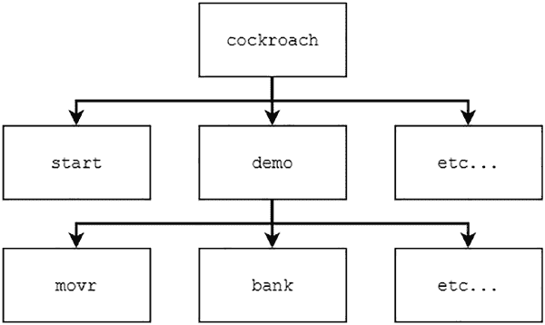
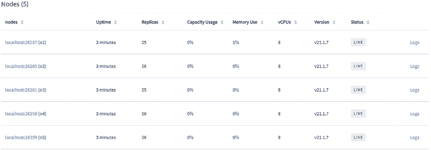
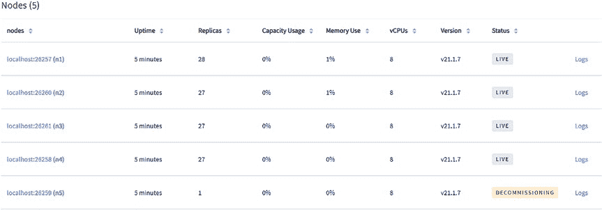
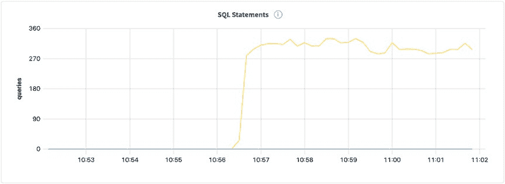

# 第 4 章 从命令行管理 CockroachDB

正如我们在[第 2 章](https://doi.org/10.1007/978-1-4842-8224-3_2)中发现的，CockroachDB 可以通过多种方式安装。在开发过程中创建数据库的一个好方法是使用 `cockroach` 二进制文件。在本章中，我们将探索 `cockroach` 二进制文件及其提供的功能。

### Cockroach 二进制文件

`cockroach` 二进制文件使用 [`github.com/spf13/cobra`](https://github.com/spf13/cobra) 库来管理命令和子命令。Cobra 是一个流行的用于创建丰富 CLI（命令行界面）的 Go 包，被许多流行的 CLI 使用，包括 docker 和 kubectl。这两者的用户都会感到熟悉。

`cockroach` 二进制文件中的命令是分层的，从 `cockroach` “根”命令本身开始。一组子命令以树状结构公开，如图 4-1 所示。



**图 4-1.** 表示 `cockroach` 二进制文件下命令的树

通过输入子命令并在每一级使用 `--help` 参数来导航命令树。例如：

```bash
$ cockroach -h
$ cockroach start -h
$ cockroach demo bank
```

### start 和 start-single-node 命令

CockroachDB 提供了单独的命令来启动单节点和多节点集群。使用 `start-single-node` 创建单节点集群，使用 `start` 创建多节点集群。

起初，有两个命令来启动集群可能看起来很笨拙。难道不应该使用 `start` 命令来完成两者吗？单节点与多节点集群的要求是不同的，因此使用两个命令可以防止你创建大小不合适的集群。

我们在前面的章节中已经创建了多个集群，因此这里不再赘述 `start` 和 `start-single-node` 命令。不过，我将演示它们的区别以及为什么需要正确使用它们。

使用 `cockroach` 二进制文件启动多节点集群是一个涉及 `start` 和 `init` 命令的两步过程。首先，你运行 `start` 命令来创建节点并配置它们。`start` 命令需要一个 `--join` 参数，该参数接受集群中其他节点的地址，迫使你考虑集群的基本拓扑以及节点如何相互查找。Cockroach Labs 建议在 `--join` 参数中配置三到五个节点，以确保节点的启动性能。

启动节点后，你运行 `init` 命令来初始化集群节点。简而言之，`init` 命令初始化每个节点上的数据库引擎，并确保它们运行相同版本的 CockroachDB。

要启动单节点 CockroachDB 集群，请使用 `start-single-node` 命令。此命令启动一个节点并初始化它，这意味着你不必像使用多节点集群那样运行 `init` 命令。与 `start` 命令不同，`start-single-node` 命令不允许你传递 `--join` 参数，从而强制你的集群保持为单节点。

### demo 命令

如[第 2 章](https://doi.org/10.1007/978-1-4842-8224-3_2)所述，`demo` 命令启动一个内存中的企业版集群，允许你在本地机器上试用 CockroachDB 企业版的所有功能。

`demo` 命令允许你创建一个空数据库，并附带一些预加载的示例数据库，以便你快速入门。调用带有 `-h` 或 `--help` 参数的 `cockroach demo` 命令将列出这些数据库：

```bash
$ cockroach demo --help
```

当前的示例数据库列表包括以下数据库：

*   **bank** – 一个示例数据库，包含一个账户和余额表
*   **intro** – 一个示例数据库，包含一个表，其中存储了跨多行的 cockroach 的 ASCII 表示
*   **kv** – 一个示例数据库，包含一个键值表
*   **movr** – 一个示例数据库，代表虚构的拼车应用程序的数据存储
*   **startrek** – 一个示例数据库，包含两个相关表：一个存储《星际迷航》剧集，另一个存储其中的名言
*   **tpcc** – 一个示例数据库，代表准备接受 [TPC-C¹] 基准测试的虚构商务业务的数据存储
*   **ycsb** – 一个示例数据库，包含一个用户数据表，准备接受 Yahoo! 云服务基准测试[²]

对于大多数用例，你会希望启动一个空数据库。我在[第 3 章](https://doi.org/10.1007/978-1-4842-8224-3_3)中正是这样做的，如下所示：

```bash
$ cockroach demo \
    --no-example-database \
    --nodes 9 \
    --demo-locality=region=us-east1,az=a:region=us-east1,az=b:region=us-east1,az=c:region=asia-northeast1,az=a:region=asia-northeast1,az=b:region=asia-northeast1,az=c:region=europe-west1,az=a:region=europe-west1,az=b:region=europe-west1,az=c
```

### cert 命令

`cockroach cert` 命令初始化运行和连接到 CockroachDB 集群所需的所有证书。有四个主要的子命令需要注意：

*   **create-ca** – 创建证书颁发机构（CA）证书，可用于创建节点和客户端证书。
*   **create-node** – 创建用于集群节点的证书和密钥。
*   **create-client** – 创建用于客户端连接的证书和密钥。
*   **list** – 列出给定证书目录（`--cert-dir`）或 `${HOME}/.cockroach-certs`（如果为空）中的证书。

我们将在[第 6 章](https://doi.org/10.1007/978-1-4842-8224-3_6)中探索 `cockroach cert` 命令的 `create-*` 子命令，以创建一个安全的集群。让我们看看这里的 `list` 子命令的作用：

```bash
$ cockroach cert list --certs-dir certs
Certificate directory: certs
Usage  | Certificate File |      Key File       |  Expires  |      Notes
---------+------------------+---------------------+------------+-----------------------
CA      | ca.crt           |                     | 2031/10/28 | num certs: 1
Node    | node.crt         | node.key            | 2026/10/24 | addresses: localhost
Client  | client.root.crt  | client.root.key     | 2026/10/24 | user: root
```

所有三种类型的证书（以及任何相关的密钥）都列在响应中，包括它们的到期日期和附带的注释。

### sql 命令

`cockroach sql` 命令创建一个到 CockroachDB 集群节点的 SQL shell。有许多有用的子命令；让我们现在探索它们。

要连接到 CockroachDB 集群的默认数据库，请对其某个节点执行以下命令：

```bash
$ cockroach sql --url "postgresql://localhost?sslmode=disable"
```

此命令省略了 URL 的用户、端口和数据库元素；以下命令将与上面完全相同：

```bash
$ cockroach sql --url "postgresql://root@localhost:26257/defaultdb?sslmode=disable"
```

要连接到不同的数据库，可以更改 URL 的数据库部分，或提供 `-d` 或 `--database` 参数，如下所示：

```bash
$ cockroach sql \
    -d defaultdb \
    --url "postgresql://root@localhost:26257?sslmode=disable"
```

你可能希望在不保持 SQL shell 打开的情况下对 CockroachDB 集群运行命令。这可以通过 `--execute/-e` 参数实现：

```bash
$ cockroach sql --url "postgresql://localhost/?sslmode=disable" \
    -e "SHOW DATABASES"
```

```
  database_name | owner | primary_region | regions | survival_goal
----------------+-------+----------------+---------+----------------
  defaultdb     | root  | NULL           | {}      | NULL
  postgres      | root  | NULL           | {}      | NULL
  system        | node  | NULL           | {}      | NULL
  yo            | root  | NULL           | {}      | NULL
```

你可以利用 `--execute` 参数对集群执行任何数据库操作。甚至可以通过将语句的输出通过管道传输到另一个命令来提取数据。以下语句使用 `--execute` 参数创建表、向其插入数据并将数据提取到 JSON 文件中，所有这些都无需打开长期运行的 SQL shell：

```bash
$ cockroach sql --url "postgresql://localhost/?sslmode=disable" \
    -e "CREATE TABLE person (first_name TEXT, last_name TEXT)"

$ cockroach sql --url "postgresql://localhost/?sslmode=disable" \
    -e "INSERT INTO person (first_name, last_name) VALUES ('Ben', 'Darnell'), ('Peter', 'Mattis'), ('Spencer', 'Kimball')"

$ cockroach sql --url "postgresql://localhost/?sslmode=disable" \
    -e "SELECT first_name, last_name FROM person" --format=csv > names.csv

$ cat names.csv
first_name,last_name
Ben,Darnell
Peter,Mattis
Spencer,Kimball
```

如果你想监视变化，可以将 `--watch` 参数与 `--execute` 参数一起传递。以下命令将每秒获取一次当前数据库时间：

```bash
$ cockroach sql --url "postgresql://localhost/?sslmode=disable" \
    -e "SELECT NOW()" --watch 1s
```

```
               now
-------------------------------
  2021-10-31 19:45:34.878551+00
(1 row)
Time: 1ms

               now
-------------------------------
  2021-10-31 19:45:35.882499+00
(1 row)
Time: 1ms
```

### node 命令

`node` 命令提供查看和管理 CockroachDB 集群中节点的功能。让我们现在创建一些节点并使用 `node` 命令来管理它们。

首先，我们需要一些节点；使用以下命令创建一个不安全的五节点集群（请注意，对于 `--join` 参数，传递五个节点中的三个就足够了，因为其他节点将通过八卦协议被发现）：

```bash
$ cockroach start \
    --insecure \
    --store=node1 \
    --listen-addr=localhost:26257 \
    --http-addr=localhost:8080 \
    --join=localhost:26257,localhost:26258,localhost:26259

$ cockroach start \
    --insecure \
    --store=node2 \
    --listen-addr=localhost:26258 \
    --http-addr=localhost:8081 \
    --join=localhost:26257,localhost:26258,localhost:26259

$ cockroach start \
    --insecure \
    --store=node3 \
    --listen-addr=localhost:26259 \
    --http-addr=localhost:8082 \
    --join=localhost:26257,localhost:26258,localhost:26259

$ cockroach start \
    --insecure \
    --store=node4 \
    --listen-addr=localhost:26260 \
    --http-addr=localhost:8083 \
    --join=localhost:26257,localhost:26258,localhost:26259

$ cockroach start \
    --insecure \
    --store=node5 \
    --listen-addr=localhost:26261 \
    --http-addr=localhost:8084 \
    --join=localhost:26257,localhost:26258,localhost:26259

$ cockroach init --insecure --host=localhost:26257
```

接下来，我们将使用 `ls` 子命令列出我们的集群节点：

```bash
$ cockroach node ls --insecure
```

```
  id
-----
  1
  2
  3
  4
  5
```

接下来，让我们使用 `status` 子命令从每个节点获取更多信息。请注意，由于返回的信息更多，我没有使用 `--format` 的默认值，而是以记录形式返回结果：

```bash
$ cockroach node status --insecure --format=records
```

```
-[ RECORD 1 ]
id             | 1
address        | localhost:26257
sql_address    | localhost:26257
build          | v21.1.7
started_at     | 2021-11-01 15:13:11.166798
updated_at     | 2021-11-01 15:15:39.681848
locality       |
is_available   | true
is_live        | true
-[ RECORD 2 ]
...
```

`status` 子命令提供的不只是顶层信息；使用以下命令可公开其他节点信息：

*   显示范围信息：

    ```bash
    $ cockroach node status --ranges --insecure
    ```

*   显示磁盘信息：

    ```bash
    $ cockroach node status --stats --insecure
    ```

*   显示与节点状态相关的信息（包括节点是否正在培训或已被停用）：

    ```bash
    $ cockroach node status --decommission --insecure
    ```

*   显示来自前述命令的组合信息：

    ```bash
    $ cockroach node status --all --insecure
    ```

对于前面的每个命令，你还可以通过传递节点 ID 来显示单个节点的状态信息，如下所示：

```bash
$ cockroach node status 1 --decommission --insecure
```



如果我们需要将节点从集群中取出进行维护，`drain` 子命令将阻止新客户端连接到该节点，并将其范围租约重新平衡到集群中的其他节点：

```bash
$ cockroach node drain --url "postgresql://localhost:26259?sslmode=disable"
```

使用 `--host` 参数也可以达到同样的效果：

```bash
$ cockroach node drain --host localhost:26259 --insecure
```

```
node is draining... remaining: 4
node is draining... remaining: 0 (complete)
ok
```

图 4-2 显示，我们排空的节点现在在管理控制台中显示为“dead”，表明它不再是集群中的功能节点：

**图 4-2.** 显示已排空节点的集群概览

一旦排空，节点就可以安全地停用了。这可以通过 `decommission` 子命令完成，如下所示；请注意，命令后跟有你希望停用的节点的 ID：

```bash
$ cockroach node decommission 5 --insecure
```

此命令的输出将显示副本减少，直到该节点上不再有副本。然后，该节点将从集群中移除，并且不再出现在管理控制台中。

图 4-3 显示了正在停用的节点的状态如何在停用过程中转换为“DECOMMISSIONING”。



**图 4-3.** 显示正在停用节点的集群概览

`recommission` 子命令可用于重新启用正在停用过程中的节点（由图 4-3 中捕获的节点 `n5` 的状态指示）。如果你允许节点完全停用，它将必须重新启动，因为它将不再有权限重新加入集群：

```bash
$ cockroach node recommission 5 --insecure
ERROR: can only recommission a decommissioning node; n5 found to be decommissioned
Failed running "node recommission"
```

如果我们中途终止了停用过程，我们可以发出以下命令来重新启用它：

```bash
$ cockroach node recommission 5 --insecure
```

如果节点已完全停用，你可以通过首先删除其旧存储目录并重新发出 `start` 命令来再次启动该节点，如下所示：

```bash
$ rm -rf node4
$ cockroach start \
    --insecure \
    --store=node4 \
    --listen-addr=localhost:26260 \
    --http-addr=localhost:8083 \
    --join=localhost:26257,localhost:26258,localhost:26259
```

生成的节点将有一个新的节点 ID，反映出这不是简单地重新启用旧节点。

### import 命令

`import` 命令可用于从本地的 `pgdump` 或 `mysqldump` 文件导入小型数据库（<15MB）或表。对于任何大于 15MB 的文件，Cockroach Labs 建议你使用 `IMPORT` 语句，我们将在[第 5 章](https://doi.org/10.1007/978-1-4842-8224-3_5)中介绍。

出于这个原因以及 `IMPORT`/`EXPORT` SQL 语句的对称性，我更喜欢使用 `IMPORT`/`EXPORT` SQL 语句，因此将在[第 5 章](https://doi.org/10.1007/978-1-4842-8224-3_5)中介绍使用这些语句导出和导入 CockroachDB、Postgres 和 MySQL 文件。

### sqlfmt 命令

`sqlfmt`（读作“SEQUEL FUMPT”）命令对 SQL 所做的事情，就像 `go fmt` 命令对 Go 代码所做的一样。如果你希望将 SQL 语句格式化为规范格式，这将非常有用。如果你团队中的每个人都使用相同的配置运行 `sqlfmt`，每个人的 SQL 看起来都会一样。

`sqlfmt` 命令配置了合理的默认值，因此可以在没有太多参数的情况下使用，但我将演示这些参数以向你展示它们如何影响生成的 SQL。

让我们将一个简单的 SQL 命令传递给 `sqlfmt`，看看默认设置如何更改我们的语句：

```bash
$ cockroach sqlfmt \
    -e "SELECT first_name, last_name, date_of_birth FROM person WHERE id = '1c448ac9-73a9-47c5-9e4d-769f8aab27fd';"
```

```
SELECT
    first_name, last_name, date_of_birth
FROM
    person
WHERE
    id = '1c448ac9-73a9-47c5-9e4d-769f8aab27fd'
```

由于该语句包含 160 个字符（比默认打印宽度 60 多 100 个），`sqlfmt` 会重新格式化命令，以使语句的打印宽度保持在 60 个字符以下。要更改打印宽度，请向 `--print-width` 参数传递一个值。

如果你更喜欢你的 SQL 逻辑与关键字（`FROM` 等）保持在同一行，请传递 `--align` 参数：

```bash
$ cockroach sqlfmt \
    -e "SELECT first_name, last_name, date_of_birth FROM person WHERE id = '1c448ac9-73a9-47c5-9e4d-769f8aab27fd';" \
    --align
```

```
SELECT first_name, last_name, date_of_birth
FROM person
WHERE id = '1c448ac9-73a9-47c5-9e4d-769f8aab27fd'
```

如果你的 SQL 语句包含引号，可以将其包装在三重引号中，如下所示：

```bash
$ cockroach sqlfmt \
    -e """SELECT p."first_name", p."last_name", p."date_of_birth", a."name" FROM "person" p JOIN "animal" a on p.id = a."owner_id" WHERE p."id" = '1c448ac9-73a9-47c5-9e4d-769f8aab27fd';"""
```

```
SELECT
    p.first_name, p.last_name, p.date_of_birth, a.name
FROM
    person AS p JOIN animal AS a ON p.id = a.owner_id
WHERE
    p.id = '1c448ac9-73a9-47c5-9e4d-769f8aab27fd'
```

请注意，`sqlfmt` 命令不考虑引号是必要的，因此它在输出结果之前会删除它们。它还会从输入语句中删除其他多余的字符，例如不必要的括号：

```bash
$ cockroach sqlfmt \
    -e "SELECT first_name, last_name, date_of_birth FROM person WHERE id IN (('1c448ac9-73a9-47c5-9e4d-769f8aab27fd'),('652cfbbc-52a9-42be-a73f-32fc7604b7e9'));" \
    --align \
    --use-spaces
```

```
SELECT first_name, last_name, date_of_birth
FROM person
WHERE id
    IN (
        '1c448ac9-73a9-47c5-9e4d-769f8aab27fd',
        '652cfbbc-52a9-42be-a73f-32fc7604b7e9'
    )
```

### workload 命令

`workload` 命令针对 `demo` 命令中可用的数据库生成负载场景。让我们创建一个示例数据库并对其运行不同级别的负载。请注意，你不需要使用 `demo` 命令启动数据库来使用 `workload` 命令。

首先，让我们启动一个节点：

```bash
$ cockroach start-single-node --insecure
```

接下来，我们将使用 `init` 子命令初始化工作负载：

```bash
$ cockroach workload init bank 'postgres://root@127.0.0.1:26257?sslmode=disable'
I211106 10:56:08.279758 1 workload/workloadsql/dataload.go:146 [-] 1 imported bank (0s, 1000 rows)
I211106 10:56:08.283417 1 workload/workloadsql/workloadsql.go:113 [-] 2 starting 9 splits
```

最后，我们将使用 `run` 子命令启动工作负载：

```bash
$ cockroach workload run bank \
    --duration=10m \
    'postgresql://root@localhost:26257?sslmode=disable'
```

```
I211106 10:56:37.308648 1 workload/cli/run.go:361 [-] 1 creating load generator...
I211106 10:56:37.312649 1 workload/cli/run.go:392 [-] 2 creating load generator... done (took 4.009ms)
```



```
_elapsed___errors__ops/sec(inst)___ops/sec(cum)__p50(ms)__p95(ms)__p99(ms)__pMax(ms)
  1.0s        0            69.7            70.0     35.7    436.2    872.4    973.1 transfer
  2.0s        0           169.0           119.5     46.1    385.9   1610.6   1879.0 transfer
  3.0s        0           227.5           155.6     41.9    151.0    738.2   2281.7 transfer
  4.0s        0           247.2           178.4     44.0    159.4    805.3    872.4 transfer
...
```

图 4-4 显示了在 CockroachDB 管理控制台中针对 `bank` 数据库生成的负载。

**图 4-4.** 正在执行的 SQL 语句

默认情况下，负载生成器将运行 16 个并发工作线程。这可以根据你的要求使用 `--concurrency` 标志进行更改。如果你想模拟更高的负载，请增加并发性。

