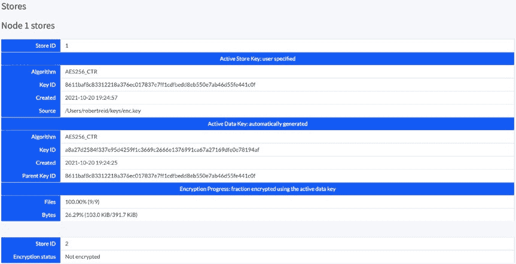

# 第六章 数据隐私

`ALTER TABLE product CONFIGURE ZONE USING CONSTRAINTS = '[+unencrypted]';`

在前面示例中创建每个表后，我设置区域配置，将表标记为`+encrypted`（需要加密）或`+unencrypted`（不需要加密）。这些约束条件与我们之前定义存储时使用的属性一致。

如果打开 CockroachDB 管理控制台并再次导航到数据源 URL，你会看到每个节点都有一个加密存储和一个未加密存储，如图 6-2 所示。

**图 6-2.** 节点 1 的数据存储

