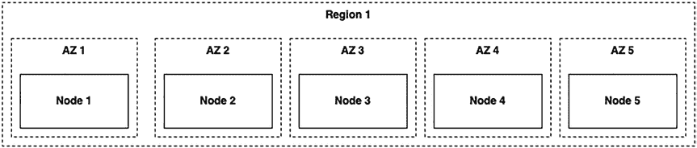
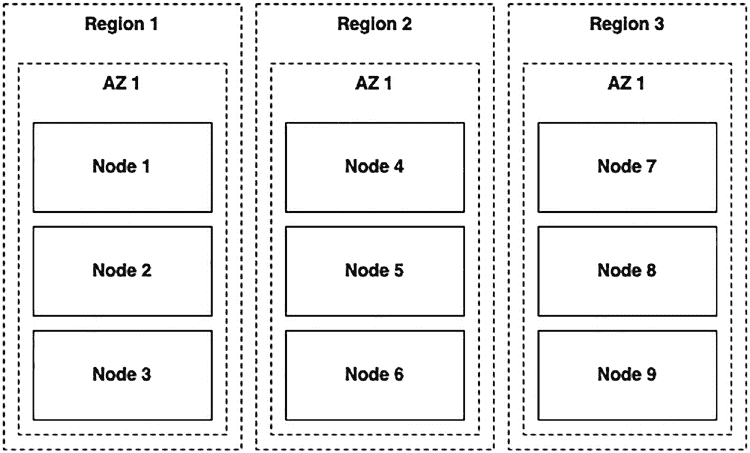

# 第七章 部署拓扑

在本章中，我们将探讨一些常见的集群部署拓扑。每种拓扑适用于不同的情况，具体取决于你的环境、延迟和生存能力要求。

我将为本章列出的许多拓扑创建一个示例集群，向你展示如何操作。为了在清晰性和简洁性之间取得平衡，我将手动为本章所有示例创建 CockroachDB 节点。根据你的基础设施以及偏好的部署和编排技术，你可能更倾向于使用 Kubernetes 部署或使用 Cockroach Cloud。另请注意，在本章中，我旨在仅展示节点之间的关系。我不会部署地理上分散的节点。

我将为所有集群复用一些生成的证书和密钥，以减少重复。我将使用以下命令创建这些证书和密钥：

```bash
mkdir certs
mkdir keys
cockroach cert create-ca \
    --certs-dir=certs \
    --ca-key=keys/ca.key
cockroach cert create-node \
    --certs-dir=certs \
    --ca-key=keys/ca.key \
    localhost
cockroach cert create-client \
    root \
    --certs-dir=certs \
    --ca-key=keys/ca.key
```

© Rob Reid 2022
R. Reid, *Practical CockroachDB*, [`doi.org/10.1007/978-1-4842-8224-3_7`](https://doi.org/10.1007/978-1-4842-8224-3_7)

### 单区域拓扑

我们从单区域拓扑开始。这些拓扑推荐用于为单个位置的用户提供服务的小型集群。例如，如果你是一家仅拥有英国客户的英国企业，这些拓扑将很适用。让我们来探索它们。

#### 开发拓扑

在开发过程中，你可能希望将成本降至最低。因此，Cockroach Labs 认可单节点集群在这种场景下表现良好，如果你愿意优先考虑成本节约和简单性而非弹性。开发拓扑正是定义了这一点：一个包含单个节点的 CockroachDB 集群。

我认为单节点集群具有以下特点：

**读取延迟** ★★★★★
网关节点也是所有数据的租约持有者节点，意味着无需节点间跳转。

**写入延迟** ★★★★★
不会产生复制延迟。

**弹性** ★
单节点集群无法防范机器或网络故障。

**设置简便性** ★★★★★
可以安装到本地网络上的机器或 E2C 服务器等。

像这样的开发集群将表现出与分布式集群不同的性能特征。在真实用户开始与你的应用程序交互之前，应仔细测试一个与你的生产集群准确相似的环境。

#### 基础生产拓扑

一旦你的应用程序有了依赖于可用数据库的用户，单节点集群就不再是一个可行的拓扑。基础生产拓扑定义了一个在单个区域内的多个可用区部署节点的 CockroachDB 集群。

你选择部署的节点数量取决于你自己，但为了在单个可用区发生故障时幸存下来，你至少需要三个节点，复制因子为三。为了在两个可用区发生故障时幸存下来，你至少需要五个节点，复制因子为五。



基础生产拓扑的架构通常类似于图 7-1。

**图 7-1.** 使用基础生产拓扑的集群架构

让我们看看使用此拓扑的集群的一些优点和缺点：

**读取延迟** ★★★★★
网关节点与租约持有者节点位于同一区域。

**写入延迟** ★★★★★
所有复制都发生在同一区域内，因此能快速达成共识。

**弹性** ★★★
根据你的架构、节点数量和复制策略，可以承受单个/多个可用区的故障。

**设置简便性** ★★★★
所有节点都存在于单个区域内，因此可以轻松地用 Kubernetes 进行编排，几乎不费力。

现在，让我们创建一个集群来模拟基础生产拓扑。让我们创建一个可以处理两个可用区故障的五节点集群：

```bash
cockroach start \
    --certs-dir=certs \
    --store=node1 \
    --listen-addr=localhost:26257 \
    --http-addr=localhost:8080 \
    --locality=region=us-east1,zone=a \
    --join=localhost:26257,localhost:26258,localhost:26259,localhost:26260,localhost:26261

cockroach start \
    --certs-dir=certs \
    --store=node2 \
    --listen-addr=localhost:26258 \
    --http-addr=localhost:8081 \
    --locality=region=us-east1,zone=b \
    --join=localhost:26257,localhost:26258,localhost:26259,localhost:26260,localhost:26261

cockroach start \
    --certs-dir=certs \
    --store=node3 \
    --listen-addr=localhost:26259 \
    --http-addr=localhost:8082 \
    --locality=region=us-east1,zone=c \
    --join=localhost:26257,localhost:26258,localhost:26259,localhost:26260,localhost:26261

cockroach start \
    --certs-dir=certs \
    --store=node4 \
    --listen-addr=localhost:26260 \
    --http-addr=localhost:8083 \
    --locality=region=us-east1,zone=d \
    --join=localhost:26257,localhost:26258,localhost:26259,localhost:26260,localhost:26261

cockroach start \
    --certs-dir=certs \
    --store=node5 \
    --listen-addr=localhost:26261 \
    --http-addr=localhost:8084 \
    --locality=region=us-east1,zone=e \
    --join=localhost:26257,localhost:26258,localhost:26259,localhost:26260,localhost:26261

cockroach init --certs-dir=certs --host=localhost:26257
```

接下来，我们将连接到集群并运行一些命令，以确保 CockroachDB 在五个节点之间复制我们的数据。

```sql
cockroach sql --certs-dir=certs
ALTER RANGE default CONFIGURE ZONE USING num_replicas = 5;
CREATE TABLE example();
SELECT lease_holder_locality, replicas FROM [SHOW RANGES FROM TABLE example];
```

```
  lease_holder_locality | replicas
------------------------+-----------
  region=us-east1,zone=e | {1,2,3,4,5}
```

副本数量从三个增加到五个可能需要一两分钟才能生效，但一旦生效，你会注意到 CockroachDB 使用所有五个节点作为 `example` 表数据的副本。如果我们丢失了五个节点中的两个，剩下的三个节点仍然能够达成法定人数。

### 多区域拓扑

多区域拓扑适用于需要更高容错能力的应用程序。我推荐这些拓扑用于需要跨越更大地理区域、客户分布在多个地点的集群。如果你的生存能力目标包括整个云区域发生故障，无论你的客户位于何处，我也推荐这些拓扑。例如，如果你是一家总部位于欧盟的企业，客户分布在欧洲和亚洲，这些拓扑将非常适用。让我们来探索它们。

#### 区域表拓扑

区域表拓扑是需要将数据固定到特定区域的场景的不错选择。在此配置中，你将确保特定区域用户的数据始终靠近他们，从而实现快速的本地区域读取和写入。


由于多区域集群不仅跨越可用区，而且覆盖整个区域，其节点数量通常会更多。一个能够承受不仅可用区故障、还能承受区域故障的集群，节点数量将从最低的三到五个跃升至九到十五个。图 7-2 展示了一个能够抵御区域停机但不能抵御可用区停机的多区域集群。在可用区停机的情况下，最接近现在不可用的`区域`的客户将被路由到另一个区域，从而导致延迟增加。



## 第 7 章 部署拓扑

**图 7-2.** 使用区域表拓扑的集群架构

让我们来看看使用此拓扑的集群的一些优缺点：

- **读取延迟**：如果数据固定在单个区域，从该区域读取数据会很快。如果数据未固定并来自多个区域，你将会产生区域间延迟。
- **写入延迟**：如果数据固定在单个区域，写入该区域会很快。如果数据跨区域复制（以获得更高的弹性），你将会产生区域间复制延迟。
- **弹性**：如果你跨区域复制数据，你将获得抵御区域故障的能力。如果你将数据固定到区域，并在该区域内的不同可用区拥有节点，你将获得抵御可用区故障的能力。
- **设置简便性**：设置多区域集群并非没有困难。如果你在 Kubernetes 中编排集群，你需要为每个区域设置一个集群，并且它们的网络需要进行对等连接。

## 第 7 章 部署拓扑

现在，让我们创建一个集群来模拟区域表拓扑。在此示例中，我们将创建一个能够抵御区域停机的九节点集群。我们将重用第 2 章“多区域集群”一节中的启动命令，以避免重复。

接下来，我们将设置数据库和区域（注意：地理分区需要企业许可证）：

```sql
CREATE DATABASE topologies_demo;

USE topologies_demo;

ALTER DATABASE "topologies_demo" PRIMARY REGION "us-east1";
ALTER DATABASE "topologies_demo" ADD REGION "us-central1";
ALTER DATABASE "topologies_demo" ADD REGION "us-west1";

ALTER DATABASE "topologies_demo" SURVIVE REGION FAILURE;
```

集群启动并运行后，让我们创建两个表：一个完全是区域性的（即所有数据保留在一个区域），另一个表的行将固定到不同的区域。首先，我们创建区域性表并向其中插入一行：

```sql
CREATE TABLE example_regional_table(
    id UUID PRIMARY KEY DEFAULT gen_random_uuid()
);

ALTER TABLE example_regional_table SET LOCALITY REGIONAL BY TABLE IN "us-central1";

INSERT INTO example_regional_table DEFAULT VALUES;
```

接下来，我们创建按行区域化的表，并向其中插入三行，每个区域一行：

```sql
CREATE TABLE example_regional_rows (
    id UUID PRIMARY KEY DEFAULT gen_random_uuid(),
    city TEXT NOT NULL,
    crdb_region crdb_internal_region NOT NULL AS (
        CASE
            WHEN city IN ('Charleston', 'Columbia', 'North Charleston') THEN 'us-east1'
            WHEN city IN ('Des Moines', 'Cedar Rapids', 'Davenport') THEN 'us-central1'
            WHEN city IN ('Portland', 'Eugene', 'Salem') THEN 'us-west1'
            ELSE 'us-central1'
        END
    ) STORED
);

ALTER TABLE example_regional_rows SET LOCALITY REGIONAL BY ROW;

INSERT into example_regional_rows (city)
VALUES
    ('Charleston'),
    ('Des Moines'),
    ('Portland');
```

给 CockroachDB 大约一分钟时间让复制完成，然后检查范围。以下语句经过格式化以便阅读：

```sql
SELECT lease_holder_locality, replicas, replica_localities
FROM [SHOW RANGES FROM TABLE example_regional_table];
```

```
region=us-central1,zone=us-central1b
{1,2,4,6,8}
{
  "region=us-east1,zone=us-east1a",
  "region=us-east1,zone=us-east1b",
  "region=us-central1,zone=us-central1c",
  "region=us-central1,zone=us-central1b",
  "region=us-west1,zone=us-west1b"
}
```


