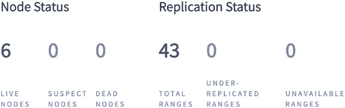

# 第 9 章 生产环境

现在，我们将创建一个多趟处理方案。这段代码比之前的即时示例包含了更多的逻辑，仅仅是因为我们执行了更多操作以实现更快的查询，从而减少索引争用。本示例中，我将展示三个函数。

##### updateMultiPassSelect

首先，是一个从表中选出 ID 的函数（注意，你可以选择任何能让你最高效获取数据的列）。该函数

*   创建一个 SQL 语句，如果我们已经运行过一次迭代并收集到了起始偏移 ID，它会注入一个额外的筛选条件，用于确定下一批待更新 ID 的起点 e5
*   使用时间旅行查询 6（一种容忍数据轻微过时，以换取更低的事务争用和更高性能的查询）来选取符合筛选条件的行的 ID
*   创建一个待返回的 ID 数组

我们将该函数命名为 `updateMultiPassSelect`：

```go
func updateMultiPassSelect(db *pgxpool.Pool, lastID string, selectLimit int) ([]string, error) {
	const selectStmtFmt = `SELECT sensor_id FROM sensor_reading
		AS OF SYSTEM TIME '-5s'
		WHERE date_trunc('decade', timestamp) =
		'1990-01-01'
		%s
		ORDER BY sensor_id
		LIMIT $1`
	args := []interface{}{}
	selectStmt := selectStmtFmt
	if lastID != "" {
		selectStmt = fmt.Sprintf(selectStmtFmt, "AND sensor_id > $2")
		args = append(args, selectLimit, lastID)
	} else {
		// 这通常被称为“游标分页”。
		// [www.cockroachlabs.com/docs/stable/as-of-system-time.html](http://www.cockroachlabs.com/docs/stable/as-of-system-time.html)
		selectStmt = fmt.Sprintf(selectStmtFmt, "")
		args = append(args, selectLimit)
	}

	// 批量获取 ID。
	rows, err := db.Query(context.Background(), selectStmt, args...)
	if err != nil {
		return nil, fmt.Errorf("fetching rows: %w", err)
	}

	// 将 ID 读入一个集合。
	ids := []string{}
	var id string
	for rows.Next() {
		if err = rows.Scan(&id); err != nil {
			return nil, fmt.Errorf("scanning row: %w", err)
		}
		ids = append(ids, id)
	}
	return ids, nil
}
```

##### updateMultiPassUpdate

下一个函数将更新与我们从上一个查询中获取的 ID 相匹配的所有行。该函数

*   创建传入 ID 的一个子集
*   基于该 ID 子集运行查询以更新行
*   更新 ID 子集以指向另一组 ID
*   一旦所有 ID 处理完毕，即返回

我们将该函数命名为 `updateMultiPassUpdate`：

```go
func updateMultiPassUpdate(db *pgxpool.Pool, ids []string, limit int) error {
	const updateStmt = `UPDATE sensor_reading
	SET reading = reading - 0.001
	WHERE sensor_id = ANY $1`

	updateIDs := ids
	for {
		idCount := min(len(updateIDs), limit)
		if idCount == 0 {
			return nil
		}
		if _, err := db.Exec(context.Background(), updateStmt,
			pq.Array(updateIDs[:idCount])); err != nil {
			return fmt.Errorf("updating rows: %w", err)
		}
		if idCount < limit {
			return nil
		}
		updateIDs = updateIDs[idCount:]
	}
}

func min(x, y int) int {
	if x < y {
		return x
	}
	return y
}
```

##### updateMultiPass

最后，是函数本身。该函数

*   通过 select 函数获取一批尚未处理的 ID，并将它们传递给 update 函数。
*   如果在任何时候没有更多 ID 可供处理，该函数即返回。

我们将此函数命名为 `updateMultiPass`：

```go
func updateMultiPass(db *pgxpool.Pool, selectLimit, updateLimit int) (d time.Duration, err error) {
	start := time.Now()
	var lastID string
	for {
		ids, err := updateMultiPassSelect(db, lastID, selectLimit)
		if err != nil {
			return 0, fmt.Errorf("fetching ids to update: %w", err)
		}
		if len(ids) == 0 {
			break
		}
		if err = updateMultiPassUpdate(db, ids, updateLimit); err != nil {
			return 0, fmt.Errorf("updating items: %w", err)
		}
		if len(ids) < 1000 {
			break
		}
```


## 第 9 章：生产环境

### 集群维护

你在上线第一天部署到生产环境的集群，不太可能与一年后（尤其是五年后）运行的集群相似。如果你提前数年规划 CockroachDB 集群，那么你

- 可能正在为未充分利用的资源付费
- 没有充分利用 CockroachDB 的扩展能力

在本节中，我们将创建一个小型节点集群，并执行以下集群范围的操作：

- 通过添加额外节点来扩展集群。
- 升级 CockroachDB 的版本。
- 将集群迁移到新节点。

我们将从扩展集群开始。如果你的 CockroachDB 部署是通过 Cockroach Cloud 运行的，这种场景会由平台处理；所有集群扩展都是自动的。如果你的集群托管在 Kubernetes 中，则操作非常简单：

```yaml
apiVersion: apps/v1
kind: StatefulSet
metadata:
  name: cockroachdb
spec:
  serviceName: "cockroachdb"
  replicas: 3 *# => 5*
  ...
```

对于本章的示例，我们将手动启动一个集群，以便完全控制每个节点。让我们从三个独立的命令行终端会话中启动三个节点开始，然后用第四个终端进行初始化。请注意，在此示例中我使用了不同的端口和存储，因为集群是运行在一台机器上的。

实际上，这个集群将运行在多台机器上，因此节点启动命令之间的唯一区别将是加入地址：

```bash
$ cockroach start \
--insecure \
--store=node1 \
--listen-addr=localhost:26257 \
--http-addr=localhost:8080 \
--join=localhost:26257,localhost:26258,localhost:26259

$ cockroach start \
--insecure \
--store=node2 \
--listen-addr=localhost:26258 \
--http-addr=localhost:8081 \
--join=localhost:26257,localhost:26258,localhost:26259

$ cockroach start \
--insecure \
--store=node3 \
--listen-addr=localhost:26259 \
--http-addr=localhost:8082 \
--join=localhost:26257,localhost:26258,localhost:26259

$ cockroach init --insecure --host=localhost:26257
```

是时候进行扩展了。CockroachDB 设计为可运行于任何地方，可扩展性和生存能力是其存在的根本原因。因此，扩展 CockroachDB 集群几乎简单得可笑：

```bash
$ cockroach start \
--insecure \
--store=node4 \
--listen-addr=localhost:26260 \
--http-addr=localhost:8083 \
--join=localhost:26257,localhost:26258,localhost:26259
```

在上面的命令中，我们以与启动三个初始（或“种子”）节点完全相同的方式启动了一个新节点。集群中的每个节点都将使用八卦协议[¹] 相互通信以组织扩展。三个种子节点就足以构成这个八卦网络的基础，它们不需要感知额外节点。这允许你继续扩展集群，而无需对种子节点的配置进行任何更改。

运行该命令会启动第四个节点，该节点立即加入集群，从而扩展其容量。

[¹]: [`en.wikipedia.org/wiki/Gossip_protocol`](https://en.wikipedia.org/wiki/Gossip_protocol)

在进入下一个示例之前，请停止节点并删除它们的数据目录（例如，`node1`、`node2` 和 `node3`）。

---

```sql
lastID = ids[len(ids)-1]
}
return time.Since(start), nil
}
```

现在来看结果。两种方法之间的差异不像 `INSERT` 示例那样明显，但考虑到减少了表锁，额外的性能提升是很好的：

| 测试名称 | 耗时 |
| :--- | :--- |
| `updateontheFly` | 3.69s |
| `updateMultipass (selectLimit = 10,000, updateLimit = 1,000)` | **2.04s** |

请查看 Cockroach Labs 网站，了解一个使用 Python 进行多遍批量更新操作的精彩示例。[2]

[2]: www.cockroachlabs.com/docs/stable/bulk-update-data

将英文文本翻译为中文，同时严格遵循您提供的 Markdown 格式规范。


将集群扩展到另一个区域需要多一点配置，但其直接程度与扩展单区域集群大致相同。首先，我们将在 `eu-central-1`（法兰克福）创建一个集群，然后再扩展到 `eu-west-3`（巴黎）：

```shell
cockroach start \
--insecure \
--store=node1 \
--listen-addr=localhost:26257 \
--http-addr=localhost:8080 \
--locality=region=eu-central-1,zone=eu-central-1a \
--join='localhost:26257, localhost:26258, localhost:26259'
```

```shell
cockroach start \
--insecure \
--store=node2 \
--listen-addr=localhost:26258 \
--http-addr=localhost:8081 \
--locality=region=eu-central-1,zone=eu-central-1a \
--join='localhost:26257, localhost:26258, localhost:26259'
```

```shell
cockroach start \
--insecure \
--store=node3 \
--listen-addr=localhost:26259 \
--http-addr=localhost:8082 \
--locality=region=eu-central-1,zone=eu-central-1a \
--join='localhost:26257, localhost:26258, localhost:26259'
```

```shell
cockroach init --insecure --host=localhost:26257
```

## 第 9 章 生产环境

法兰克福的节点启动并运行后，让我们使用 CockroachDB shell 来查询区域和可用区信息：

```shell
cockroach sql --insecure
```

```sql
SHOW regions;
```

```
  region   |    zones     | database_names | primary_region_of
-----------+--------------+----------------+--------------------
  eu-central-1 | {eu-central-1a} | {} | {}
```

现在，我们将启动位于巴黎集群的节点，并让它们加入现有的法兰克福集群节点：

```shell
cockroach start \
--insecure \
--store=node4 \
--listen-addr=localhost:26260 \
--http-addr=localhost:8083 \
--locality=region=eu-west-3,zone=eu-west-3a \
--join='localhost:26257, localhost:26258, localhost:26259'
```

```shell
cockroach start \
--insecure \
--store=node5 \
--listen-addr=localhost:26261 \
--http-addr=localhost:8084 \
--locality=region=eu-west-3,zone=eu-west-3a \
--join='localhost:26257, localhost:26258, localhost:26259'
```

```shell
cockroach start \
--insecure \
--store=node6 \
--listen-addr=localhost:26262 \
--http-addr=localhost:8085 \
--locality=region=eu-west-3,zone=eu-west-3a \
--join='localhost:26257, localhost:26258, localhost:26259'
```

## 第 9 章 生产环境

巴黎的节点启动并运行后，让我们再次运行区域查询，看看集群现在的状态：

```sql
SHOW regions;
```

```
  region   |    zones     | database_names | primary_region_of
-----------+--------------+----------------+--------------------
  eu-central-1 | {eu-central-1a} | {} | {}
  eu-west-3    | {eu-west-3a}    | {} | {}
```

接下来，我们将升级所有集群节点上的 CockroachDB 版本。为简单起见，我们先从法兰克福集群的节点开始，依次更新每个节点，实现零停机时间。

在我的机器上，法兰克福节点当前运行的是 CockroachDB `v21.2.0`：

```shell
cockroach version
```

```
Build Tag:        v21.2.0
Build Time:       2021/11/15 14:00:58
Distribution:     CCL
Platform:         darwin amd64 (x86_64-apple-darwin19)
Go Version:       go1.16.6
C Compiler:       Clang 10.0.0
Build Commit ID:  79e5979416cb426092a83beff0be1c20aebf84c6
Build Type:       release
```

撰写本文时，CockroachDB 的最新版本是 `v21.2.5`。升级 CockroachDB 后，我可以在命令行上确认：

```shell
cockroach version
```

```
Build Tag:        v21.2.5
Build Time:       2022/02/07 21:04:05
Distribution:     CCL
Platform:         darwin amd64 (x86_64-apple-darwin19)
Go Version:       go1.16.6
C Compiler:       Clang 10.0.0
Build Commit ID:  5afb632f77eee9f09f2adfa2943e1979ec4ebedf
Build Type:       release
```

## 第 9 章 生产环境

让我们将这个版本的 CockroachDB 应用到每个节点。在您手动配置了负载均衡的环境中，在将节点从集群中移除之前，需要先将它们从负载均衡器中移除。这将防止任何请求被路由到已停用的节点。对于 Kubernetes 用户，以下是安全的操作方式：

```yaml
apiVersion: apps/v1
kind: StatefulSet
...
containers:
- name: cockroachdb
  image: cockroachdb/cockroach:v21.2.5
  imagePullPolicy: IfNotPresent
```

Kubernetes 将对您的节点执行滚动升级，不会有任何停机时间，并且会在替换每个节点之前将其从负载均衡器中移除。

Cockroach Labs 提供了一些在执行版本间升级（包括像我们即将进行的这种小版本更新）时需要考虑的最佳实践。需要了解的一个关键点是自动最终化，以及在升级节点前它是否已启用。

如果升级集群节点有可能无意中损坏您的数据库（例如，在存在破坏性变更的版本之间升级），那么禁用自动最终化就很重要。可以通过以下方式实现：

```sql
SET CLUSTER SETTING cluster.preserve_downgrade_option = '21.2';
```

要重新启用自动最终化：

```sql
RESET CLUSTER SETTING cluster.preserve_downgrade_option;
```

在开始之前，我将运行前一章中的一条语句来获取集群中节点的基本信息：

```shell
cockroach node status --insecure
```

```
  id |    address     |    sql_address  |   build
-----+----------------+-----------------+-----------
   1 | localhost:26257 | localhost:26257 | v21.2.0
   2 | localhost:26258 | localhost:26258 | v21.2.0
   3 | localhost:26259 | localhost:26259 | v21.2.0
```

## 第 9 章 生产环境

如我们所见，所有节点都按预期运行着 `v21.2.0`。现在让我们从节点一开始执行滚动升级。首先，我们将停止该节点（目前只需 `ctrl-c` 进程）并检查它是否已变得不可用。请注意，在节点一关闭期间，我们需要连接到另一个节点来检查状态：

```shell
cockroach node status --insecure --url postgres://localhost:26258
```

```
  id |    address     |    sql_address  |  build  | is_available | is_live
-----+----------------+-----------------+---------+--------------+----------
   1 | localhost:26257 | localhost:26257 | v21.2.0 |     false    |  false
   2 | localhost:26258 | localhost:26258 | v21.2.0 |     true     |  true
   3 | localhost:26259 | localhost:26259 | v21.2.0 |     true     |  true
```

由于 `v21.2.0` 和 `v21.2.5` 之间没有破坏性变更，在获取到 `v21.2.5` 的二进制文件后，我们可以简单地再次运行启动命令；我们不需要删除节点的存储目录。

再次启动节点后，我们可以看到节点再次可用，并且其版本已经递增。我们也可以再次对节点一运行 `node` 命令：

```shell
cockroach node status --insecure
```

```
  id |    address     |    sql_address  |  build
-----+----------------+-----------------+---------
   1 | localhost:26257 | localhost:26257 | v21.2.5
   2 | localhost:26258 | localhost:26258 | v21.2.0
   3 | localhost:26259 | localhost:26259 | v21.2.0
```

我们现在将对节点二和节点三重复这些步骤。请注意，因为我们的集群只有三个节点，所以一次只对一个节点执行升级至关重要。如果我们同时从集群中移除两个节点，集群将变得不可用。

```shell
cockroach node status --insecure
```

```
  id |    address     |    sql_address  |  build
-----+----------------+-----------------+---------
   1 | localhost:26257 | localhost:26257 | v21.2.5
   2 | localhost:26258 | localhost:26258 | v21.2.5
   3 | localhost:26259 | localhost:26259 | v21.2.5
```

## 第 9 章 生产环境：迁移集群

让我们假设在本节的最后部分，我们需要将集群从一个位置迁移到另一个位置（例如，为了云提供商迁移，或者在本地场景中迁移到更新的硬件）。这里我不讨论负载均衡或 DNS 等主题，而是提供一个节点迁移的模式。

我们将为此示例启动一个全新的集群，从 AWS 的 `eu-central-1`（法兰克福）区域启动一个三节点集群，然后将它们迁移到 GCP 的 `europe-west1`（圣吉斯兰）区域。所有操作都将在本地运行，因此请注意，实际上并没有发生云迁移。


### 集群节点迁移操作指南

在开始之前，必须讨论添加和移除节点的顺序。我们有一个三节点集群，复制因子为三（可通过运行 `SHOW ZONE CONFIGURATION FROM DATABASE defaultdb` 查看），因此应始终保持一个三节点集群可用。这意味着在关闭一个节点之前先启动一个节点，并等待所有副本重新平衡到新节点后，再开始处理下一个节点。

#### 初始化三节点集群

首先，我们在法兰克福区域启动 `node1`、`node2` 和 `node3` 并初始化集群：

```
$ cockroach start \
--insecure \
--store=node1 \
--listen-addr=localhost:26257 \
--http-addr=localhost:8080 \
--locality=region=eu-central-1,zone=eu-central-1a \
--join='localhost:26257, localhost:26258, localhost:26259'
```

```
$ cockroach start \
--insecure \
--store=node2 \
--listen-addr=localhost:26258 \
--http-addr=localhost:8081 \
--locality=region=eu-central-1,zone=eu-central-1a \
--join='localhost:26257, localhost:26258, localhost:26259'
```

```
$ cockroach start \
--insecure \
--store=node3 \
--listen-addr=localhost:26259 \
--http-addr=localhost:8082 \
--locality=region=eu-central-1,zone=eu-central-1a \
--join='localhost:26257, localhost:26258, localhost:26259'
```

```
$ cockroach init --insecure --host=localhost:26257
```

#### 扩展至六节点集群

接下来，我们在圣吉斯兰区域启动 `node4`、`node5` 和 `node6` 并让它们加入集群。一旦任何副本不足的区间被重新平衡并解决，我们将开始拆除原始集群节点：

```
$ cockroach start \
--insecure \
--store=node4 \
--listen-addr=localhost:26260 \
--http-addr=localhost:8083 \
--locality=region=europe-west1,zone=europe-west1b \
--join='localhost:26257, localhost:26258, localhost:26259,
localhost:26260, localhost:26261, localhost:26262'
```

```
$ cockroach start \
--insecure \
--store=node5 \
--listen-addr=localhost:26261 \
--http-addr=localhost:8084 \
--locality=region=europe-west1,zone=europe-west1c \
--join='localhost:26257, localhost:26258, localhost:26259,
localhost:26260, localhost:26261, localhost:26262'
```

```
$ cockroach start \
--insecure \
--store=node6 \
--listen-addr=localhost:26262 \
--http-addr=localhost:8085 \
--locality=region=europe-west1,zone=europe-west1d \
--join='localhost:26257, localhost:26258, localhost:26259,
localhost:26260, localhost:26261, localhost:26262'
```

注意，我已将所有新旧主机都包含在 `--join` 参数中；这将防止在开始移除旧节点后集群变得不可用。

#### 检查集群状态

新节点就位且所有副本不足的区间都已解决后，让我们运行 `node` 命令查看集群状态：

```
$ cockroach node status --insecure --url postgres://localhost:26260
--format records
-[ RECORD 1 ]
id             | 1
address        | localhost:26257
locality       | region=eu-central-1,zone=eu-central-1a
is_available   | true
is_live        | true
-[ RECORD 2 ]
id             | 2
address        | localhost:26259
locality       | region=eu-central-1,zone=eu-central-1a
is_available   | true
is_live        | true
-[ RECORD 3 ]
id             | 3
address        | localhost:26258
locality       | region=eu-central-1,zone=eu-central-1a
is_available   | true
is_live        | true
-[ RECORD 4 ]
id             | 4
address        | localhost:26260
locality       | region=europe-west1,zone=europe-west1b
is_available   | true
is_live        | true

-[ RECORD 5 ]
id             | 5
address        | localhost:26261
locality       | region=europe-west1,zone=europe-west1c
is_available   | true
is_live        | true
-[ RECORD 6 ]
id             | 6
address        | localhost:26262
locality       | region=europe-west1,zone=europe-west1d
is_available   | true
is_live        | true
```

一切看起来很好。所有六个节点都在运行。一旦所有剩余的副本不足区间都已解决（健康的复制状态示例见图 9-1）并且你已完成任何必需的备份，就可以安全地从集群中移除原始的三个节点并完成迁移。

*图 9-1. 六个健康节点的复制状态*


让我们首先退役 `node1`、`node2` 和 `node3`。此过程将确保所有范围都从这些节点上复制出去，然后将它们从集群中移除。请注意，我是连接到 `node6`，但我本可以连接到集群中的任何节点来执行此操作：

```bash
$ cockroach node decommission 1 --insecure --url postgres://localhost:26262
```

```bash
$ cockroach node decommission 2 --insecure --url postgres://localhost:26262
```

```bash
$ cockroach node decommission 3 --insecure --url postgres://localhost:26262
```

## 第 9 章 生产环境

节点退役后，请检查仪表板中的复制状态是否仍如图 9-1 所示，然后关闭这些节点。

您刚刚将集群从 AWS 的法兰克福区域迁移到了 GCP 的圣吉斯兰区域！

### 备份与恢复数据

作为一个多活数据库，CockroachDB 不需要许多传统关系数据库的常规 DR（灾难恢复）架构。不幸的是，多活数据库并不能保护您免受恶意行为者或单纯的错误操作；一条 `TRUNCATE` 语句可能像在其他任何关系数据库中一样对 CockroachDB 造成严重破坏。

这就是备份发挥作用的地方。使用 CockroachDB，您可以通过以下任何一种方式备份集群：

*   **完整备份** – 完整备份包含集群中的所有数据（不含副本）。例如，假设您将 1GB 的数据复制到五个节点；您的备份将包含 1GB 的数据，而不是 5GB。所有集群都提供完整备份功能。
*   **增量备份** – 增量备份捕获自上次备份以来的更改。您始终需要至少一个完整备份，但可以按需进行任意多次增量备份。增量备份仅适用于企业版集群。
*   **加密备份** – 加密备份为您的数据库备份增加了一层额外的安全性。请注意，您可以通过简单地备份到加密的 S3 存储桶（或类似存储）来实现安全备份，而无需手动加密。加密备份仅适用于企业版集群。
*   **带修订历史的备份** – 带修订历史的备份不仅备份数据库中的最新数据，还备份尚未被垃圾回收的任何修订历史（默认情况下，您将拥有 25 小时的修订历史）。通过这些备份，您可以恢复最新数据或之前某个时间点的数据。此功能仅适用于企业版集群。
*   **地域感知备份** – 地域感知备份允许备份特定的数据库地域（例如，仅 `eu-central-1`），仅适用于企业版集群。

让我们逐一介绍每种备份方法，看看它们如何应对不同的用例。我将在演示集群（启用了企业版功能）中运行以下每个示例。要在常规集群中启用企业版功能，请配置以下设置：

```bash
$ cockroach sql --insecure --host=<YOUR_HOST>
```

```sql
$ SET CLUSTER SETTING cluster.organization = 'your_organisation';
$ SET CLUSTER SETTING enterprise.license = 'your_license_key';
```

在我们创建任何备份之前，我将创建一个小数据库和表来证明我们的备份和恢复操作是成功的。为此，我将创建一个新的 `sensor_reading` 表，它适用于所有的备份方法：

```sql
CREATE TABLE sensor_reading (
    sensor_id UUID PRIMARY KEY,
    country STRING NOT NULL,
    reading DECIMAL NOT NULL,
    timestamp TIMESTAMPTZ NOT NULL DEFAULT NOW()
);

INSERT INTO sensor_reading (sensor_id, country, reading, timestamp)
SELECT
    gen_random_uuid(),
    'DE',
    CAST(random() AS DECIMAL),
    '2022-02-18' - CAST(s * 10000 AS INTERVAL)
FROM generate_series(1, 1000) AS s;
```

在我们准备好备份之前，还差一步。与可以使用 HTTP 端点的 `IMPORT` 语句不同，备份和恢复需要使用云提供商的对象存储（例如，S3、Google Cloud Storage 和 Azure Storage）。让我们为备份示例创建几个 S3 存储桶：

```bash
$ aws s3api create-bucket \
    --bucket practical-cockroachdb-backups \
    --region eu-west-2 \
    --create-bucket-configuration LocationConstraint=eu-west-2
{
    "Location": "http://practical-cockroachdb-backups.s3.amazonaws.com/"
}
```

```bash
$ aws s3api create-bucket \
    --bucket practical-cockroachdb-backups-us-west \
    --region us-west-1 \
    --create-bucket-configuration LocationConstraint=us-west-1
{
    "Location": "http://practical-cockroachdb-backups-us-west.s3.amazonaws.com/"
}
```

```bash
$ aws s3api create-bucket \
    --bucket practical-cockroachdb-backups-us-east \
    --region us-east-1
{
    "Location": "/practical-cockroachdb-backups-us-east"
}
```

#### 完整备份

数据库、表和存储桶都已就绪，我们可以开始了！让我们首先对数据进行一次完整的备份和恢复：

```sql
BACKUP INTO 's3://practical-cockroachdb-backups?AWS_ACCESS_KEY_ID=****&AWS_SECRET_ACCESS_KEY=****&AWS_REGION=eu-west-2' AS OF SYSTEM TIME '-10s';
```

```
  job_id           |  status   | fraction_completed | rows | index_entries | bytes
-------------------+-----------+--------------------+------+---------------+--------
  742270852339073025 | succeeded |         1          | 1032 |       20      | 57311
```

请注意，在我们的备份请求中，我们告诉 CockroachDB 备份十秒钟前的数据库状态。这意味着它不会尝试备份正在为客户端提供服务的实时数据。这是 Cockroach Labs 推荐的性能优化建议，十秒钟是推荐的`最小`时间间隔；根据您的垃圾回收窗口（默认为 25 小时），您可能希望将其设置为更早的时间点。

让我们检查 S3 是否有我们的备份：

```bash
$ aws s3api list-objects-v2 \
    --bucket practical-cockroachdb-backups
{
    "Contents": [
        {
            "Key": "2022/03/06-190437.13/BACKUP-CHECKPOINT-742270852339073025-CHECKSUM",
            "LastModified": "2022-03-06T19:04:48+00:00",
            "ETag": "\"79f98a6fd4b39f02b7727c91707b71cd\"",
            "Size": 4,
            "StorageClass": "STANDARD"
        }
...
```

看起来不错！CockroachDB 备份存储在一个目录结构中，其目录表明了备份的日期和时间。

让我们通过运行恢复来确保我们的 `sensor_reading` 表已成功备份。由于所有数据都安全地复制在我们的三个节点上，目前进行恢复还无法证明什么；让我们来补救一下：

```sql
TRUNCATE sensor_reading;

SELECT COUNT(*) FROM sensor_reading;
```

```
  count
---------
     0
```

数据消失了（部门也陷入了恐慌），是时候运行恢复了。请注意备份对象的目录结构，我们现在需要用到它们：

```sql
RESTORE FROM '2022/03/06-190437.13' IN 's3://practical-cockroachdb-backups?AWS_ACCESS_KEY_ID=****&AWS_SECRET_ACCESS_KEY=****&AWS_REGION=eu-west-2';
```

```
ERROR: full cluster restore can only be run on a cluster with no tables or databases but found 4 descriptors: [sensors crdb_internal_region _crdb_internal_region sensor_reading]
```

哦，不！看来我们只能在空集群上进行恢复。如果我们有其他不需要恢复的数据库或表怎么办？幸运的是，CockroachDB 根据您的情况提供了替代的 `RESTORE` 命令。所有这些都可以从我们刚刚进行的完整备份执行：

*   **集群损坏了？** – 使用 `RESTORE FROM` 恢复整个集群。
*   **数据库损坏了？** – 使用 `RESTORE DATABASE {DATABASE} FROM` 仅恢复您的数据库。
*   **表损坏了？** – 使用 `RESTORE TABLE {DATABASE}.{TABLE} FROM` 仅恢复您的表。请注意，通过传入一个逗号分隔的表字符串，您可以一次性备份多个表。


## 第 9 章 生产环境

在恢复我们的表之前，还需要执行一个步骤。在运行恢复操作前，我们需要`DROP`（删除）或`RENAME`（重命名）它 11 b。由于我的`sensing_reading`表是空的，不需要归档任何内容，因此`DROP`最适合我：

```sql
DROP TABLE sensor_reading;
```

```sql
RESTORE TABLE sensors.sensor_reading FROM '2022/03/06-190437.13' IN 's3://practical-cockroachdb-backups?AWS_ACCESS_KEY_ID=****&AWS_SECRET_ACCESS_KEY=****&AWS_REGION=eu-west-2';
```

11 [www.cockroachlabs.com/docs/stable/restore.html#restore-a-cluster](http://www.cockroachlabs.com/docs/stable/restore.html#restore-a-cluster)

```
job_id | status | fraction_completed | rows | index_entries | bytes
---------------------+-----------+--------------------+------+---------------+-------
742274102397501441 | succeeded | 1 | 1000 | 0 | 52134
```

#### 增量备份

在此案例中，完整备份和恢复有效，因为数据库及其对象都很小。如果你的集群大小达到许多 GB，增量备份可能是更高效的选择。让我们来探索增量备份，看看它们是如何工作的。

首先，我们将在恢复的`sensor_reading`表中插入一些新数据，以模拟随时间推移添加到表中的数据。这将创建一个差异，该差异存在于我们在备份章节开始时插入的原始数据与现在之间。如果 CockroachDB 在增量备份与上一次备份（无论是完整备份还是增量备份）之间未检测到任何更改，你将看到一个空的备份目录：

```sql
INSERT INTO sensor_reading (sensor_id, country, reading, timestamp)
SELECT
  gen_random_uuid(),
  'DE',
  CAST(random() AS DECIMAL),
  '2022-02-18' - CAST(s * 10000 AS INTERVAL)
FROM generate_series(1, 500) AS s;
```

```sql
SELECT COUNT(*) FROM sensor_reading;
```

```
count
---------
1511
```

现在，让我们运行一次增量备份：

```sql
BACKUP INTO LATEST IN 's3://practical-cockroachdb-backups?AWS_ACCESS_KEY_ID=****&AWS_SECRET_ACCESS_KEY=****&AWS_REGION=eu-west-2' AS OF SYSTEM TIME '-10s';
```

```
job_id | status | fraction_completed | rows | index_entries | bytes
---------------------+-----------+--------------------+------+---------------+-------
742278826975625217 | succeeded | 1 | 1511 | 35 | 85097
```

行数表示上次备份操作备份的行数。请注意，由于我们尚未备份已恢复的数据集，此差异包含了表中的所有行。如果你现在再次运行备份，你将看到零行，因为没有任何新内容需要备份：

```sql
BACKUP INTO LATEST IN 's3://practical-cockroachdb-backups?AWS_ACCESS_KEY_ID=****&AWS_SECRET_ACCESS_KEY=****&AWS_REGION=eu-west-2' AS OF SYSTEM TIME '-10s';
```

```
job_id | status | fraction_completed | rows | index_entries | bytes
---------------------+-----------+--------------------+------+---------------+-------
742280265162588161 | succeeded | 1 | 0 | 0 | 0
```

请注意，由于我们正在对整个集群进行增量备份，任何其他数据库对象的更改都会被检测到（并备份）。要恢复我们的表，我们只需像之前一样重新运行恢复操作。所有增量备份都存在于 S3 中，并会自动被检索到：

```sql
RESTORE TABLE sensors.sensor_reading FROM '2022/03/06-190437.13' IN 's3://practical-cockroachdb-backups?AWS_ACCESS_KEY_ID=****&AWS_SECRET_ACCESS_KEY=****&AWS_REGION=eu-west-2';
```

#### 加密备份

要加密备份，你需要创建自己的加密密钥，并使用该密钥在备份持久化到云存储之前对其进行加密。让我们现在创建一个加密密钥并用它创建一个加密备份：

```bash
$ aws kms create-key \
  --key-spec=SYMMETRIC_DEFAULT \
  --tags TagKey=Purpose,TagValue="Encrypt CockroachDB backups" \
  --description "Practical CockroachDB Backups"
```

要使用加密密钥进行备份和恢复，只需将参数传递给`BACKUP`/`RESTORE`命令，如下所示：

```sql
BACKUP INTO 's3://practical-cockroachdb-backups?AWS_ACCESS_KEY_ID=****&AWS_SECRET_ACCESS_KEY=****&AWS_REGION=eu-west-2'
WITH kms = 'aws:///****?AUTH=implicit&REGION=eu-west-2';
```


