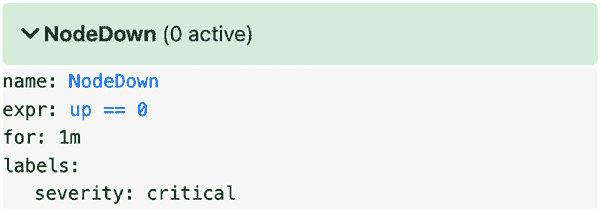
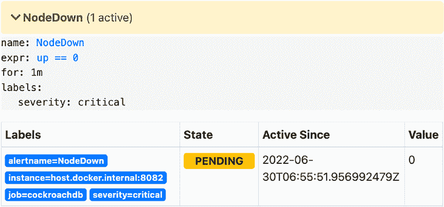
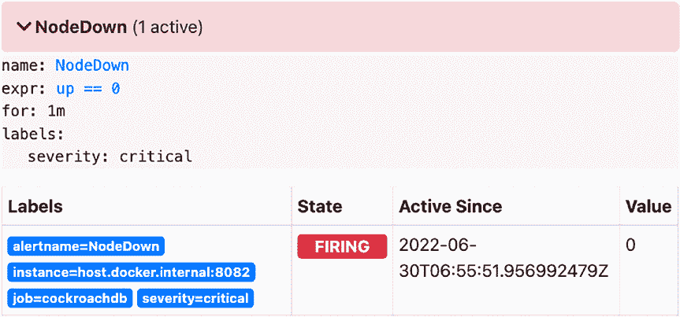

# 第九章 生产环境

#### Prometheus 配置

`prometheus.yml 文件`用于配置 Prometheus 的基本属性。它决定了 Prometheus 抓取指标数据的频率、从哪些主机抓取数据，以及这些主机通过哪些 URL 提供指标数据。请注意，由于我将使用 Docker 运行 Prometheus，因此我使用了 `host.docker.internal` 这个 DNS 名称，它可以从容器内部解析到我的主机：

```
global:
  scrape_interval: 10s

rule_files:
  - alert_rules.yml

scrape_configs:
  - job_name: cockroachdb
    metrics_path: /_status/vars
    static_configs:
      - targets:
        - host.docker.internal:8080
        - host.docker.internal:8081
        - host.docker.internal:8082
```

#### Alertmanager 配置

`alert_rules.yml 文件`用于配置包含指标规则的告警组。如果任何指标规则超过了配置的阈值，将为该告警组触发告警。在此示例中，我创建了一个告警，如果 CockroachDB 检测到某个节点离线超过一分钟，该告警就会触发：

```
groups:
  - name: node_down
    rules:
      - alert: NodeDown
        expr: up == 0
        for: 1m
        labels:
          severity: critical
```

接下来，我们将创建一个 Alertmanager 实例。它将接收来自 Prometheus 的告警，并将其发送给接收器。通过以下配置，我使用一个简单的 HTTP 接收器将通知发送到 `https://httpbin.org`：

```
global:
  resolve_timeout: 5m

route:
  group_by: ['alertname']
  group_wait: 5s
  group_interval: 5s
  repeat_interval: 1h
  receiver: api_notify
```



```
receivers:
  - name: api_notify
    webhook_configs:
      - url: https://httpbin.org/post
```

#### 启动服务并观察告警

现在让我们启动 Prometheus 和 Alertmanager：

```
$ docker run \
    --name prometheus \
    --rm -it \
    -p 9090:9090 \
    -v ${PWD}/prometheus.yml:/etc/prometheus/prometheus.yml \
    -v ${PWD}/alert_rules.yml:/etc/prometheus/alert_rules.yml \
    prom/prometheus
```

```
$ docker run \
    --name alertmanager \
    --rm -it \
    -p 9093:9093 \
    -v ${PWD}/alertmanager.yml:/etc/alertmanager/alertmanager.yml \
    prom/alertmanager
```

如果你访问 `http://localhost:9090/alerts`，你会看到 `NodeDown` 告警处于活动状态，并报告当前没有节点宕机：

如果我们现在终止一个节点，该告警将先进入“待处理”状态，然后变为“触发”状态。我将终止 `node3` 的 `cockroach` 进程来演示这些告警状态。




稍等片刻，告警将进入待处理状态：

再过一会儿，它将进入触发状态：

如果我们重启 `node3` 并稍等片刻，告警将清除，并报告我们的集群再次恢复健康。

## 索引

**A**

序列化，170
结合应用程序代码测试，179–184
反模式，152–156
`argPlaceholders`，212
可用区（`AZs`），21, 140, 141, 151

**B**

数据备份与恢复
带修订历史的备份，231
加密备份，231, 237–240
全量备份，231, 233–235
增量备份，231, 236
地域感知备份，232
计划备份，241, 242
备份方法，232
带修订历史的备份，231–232
基本生产拓扑，140, 141, 160
Bean About Town，161
黑盒测试
`API` 服务器监听，173
应用程序，166
应用程序测试，173
`Cockroach` 二进制文件，67
数据库内部结构，165
错误处理，174
`GET` 请求处理器，167, 169, 172
格式错误的客户 ID，176
机制，166
多语句事务，176
`POST` 请求端点，168
`POST` 请求处理器，167
`Product` 类，168
对不存在 ID 的请求，176

**C**

《加州消费者隐私法案》（`CCPA`），124, 126–128
证书颁发机构（`CA`），70, 130
变更数据捕获（`CDC`），6, 114, 116, 119, 120, 156
变更数据流，116
云提供商对象存储，232
集群设计
集群规模规划，243
节点规模规划，243, 244
集群维护
集群范围操作，220
法兰克福集群，223
`gossip` 协议，221
`Kubernetes` 用户，225
节点启动命令，220
扩缩容，221, 222
`cockroach cert` 命令，70, 71
命令树，68
演示命令，69
`import` 命令，78
`node` 命令，73–76
`recommission` 命令，77
示例数据库，69, 70
`sqlfmt` 命令，78, 79
`start` 和 `start-single-node` 命令，68, 69

© Rob Reid 2022


