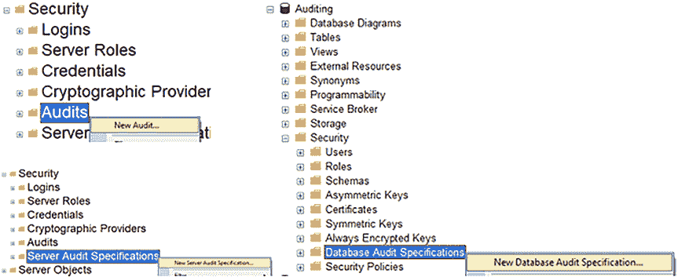
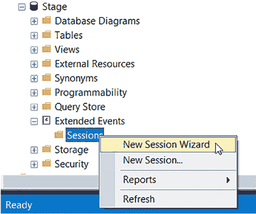

# 第一章 审计的重要性

## 法规与标准概述

**通用数据保护条例（GDPR）** – 该条例加强了对欧盟（EU）公民的数据保护。它于 2018 年颁布，要求企业为在欧盟成员国发生的任何交易保护欧盟公民的隐私。

**健康保险流通与责任法案（HIPAA）** – 该法案于 1996 年颁布，是保护敏感健康相关信息的标准。它要求任何持有医疗数据的人确保数据安全，防止意外泄露或黑客攻击。

**支付卡行业数据安全标准（PCI DSS）** – 这是一套确保持用卡数据安全的标准。它于 2004 年颁布，概述了支付数据的存储、传输和处理方式。

**萨班斯-奥克斯利法案（SOX）** – 该法案于 2002 年颁布，是一个会计和合规框架。上市公司必须遵守创建和维护安全计算系统的规定。

#### 什么是数据库审计？

**数据库审计**是指利用数据库工具和审计策略来记录数据库服务器上的更改。数据库审计通常用于：
* 收集特定数据库活动的数据
* 跟踪数据库服务器的更改
* 向审计员报告更改
* 调查可疑活动

你可以进行的数据库审计类型包括：
* **服务器级审计** – 包括跟踪链接服务器、`SQL Agent`作业或数据库的创建。
* **安全审计** – 包括创建登录名或修改用户权限。
* **数据定义语言（DDL）审计** – 包括创建或删除表等操作。
* **数据操作语言（DML）审计** – 包括从表中选择、插入、删除或更新等操作。

## 数据库审计能解决的问题

审计可以帮助你解决很多问题。以下列表概述了审计可以处理的一些场景：
* **谁弄坏了这个？** 人们来找你，说东西坏了，为什么？没有审计，你一无所知。如果你设置了审计，就可以看到谁更改了某个东西，这可能就是导致问题的更改。
* **谁在使用这个登录名？** 你还可以查看是否有人使用了某个东西，比如一个表或登录名。我们遇到过一个情况，`SQL Server`的系统管理员（`sa`）密码被随意分发。一个`SQL`登录名可能为特定目的设置，但现在被共享了，而我们绝对不希望不同用户使用同一个登录名。为此，我们必须知道谁在使用`sa`。你不能直接问：“你在这台服务器上使用`sa`吗？”要么得不到回应，要么对方不知道，要么说没时间查。我们审计了`sa`，得到了一个用户列表，然后联系了这些用户及其经理，告诉他们：“我们必须让你停用`sa`。我们看到你用`sa`做这些事，所以让我们为你设置一个用户名/密码，这样你就可以继续完成你需要做的工作。”
* **谁在使用这个数据库对象？** 还有一个案例，开发团队试图弄清楚是哪个登录名在向一个表写入数据。他们可以看到更新后的数据，但不知道来源，这是审计能帮助你的另一种方式。
* **用户需要什么权限？** 作为这次`sa`审计的一部分，我们还检查了人们在做什么，看看能否减少他们在生产系统中被授予的权限级别，目标是只授予所需的最小权限。大多数用户甚至没有意识到使用`sa`所拥有的权力，而且所有人都只是以符合他们自己工作的方式使用它。
* **用户是否在滥用数据库？** 我们确实抓到一个人共享他的域用户名和密码，以便在他不在办公室时让别人代行职责，这是绝对禁止的。
* **什么发生了更改？** 很多时候，内部或外部审计员需要……

第二章：数据库审计的类型

任何良好审计策略的起点，是了解你可用的审计选项。本章为你概述了本书涵盖的每种审计工具。

你需要证明在进行更改之前获得了批准，或者他们要求提供列出更改的报告。有了审计机制，提供这些文档就容易得多。

总而言之，你可以看到审计功能可以非常强大，并且在许多情况下是法律所要求的。审计并非你需要害怕或回避的东西。它可以帮助你确保数据库系统的使用符合法律法规。即使法律没有要求你审计数据库，你也可以将审计用作对自己和团队的一种合理性检查。此外，审计可以帮助你制定政策和程序，并帮助你确定每个人是否都在遵循这些程序。

#### SQL Server 审计

*SQL Server 审计* 是一个内置的 SQL Server 审计功能，可通过 SQL Server Management Studio (SSMS) 进行设置。你也可以使用 SQL 脚本来设置它，这使得将相同的审计策略应用于多台服务器变得更加容易。

此功能使你可以轻松查看 SQL Server 上正在更改的内容。你可以审计所有正在更改的内容，或这些更改内容的部分片段。

要使 SQL Server 审计工作，根据你想要审计的内容，你需要两到三样东西。你需要创建一个 *审计规范*。这将决定审计数据的存储位置。你还需要一个 *服务器规范* 和/或一个 *数据库审计规范*，以便审计数据写入该审计规范。服务器审计规范可以审计服务器活动，它也可以以相同方式审计所有数据库活动。每个审计规范可以有一个服务器和/或一个数据库审计。这些服务器和数据库审计彼此独立。

服务器审计规范通常适用于审计服务器级别的更改和/或同时审计所有数据库。数据库审计规范则适用于审计一个数据库或一个数据库中的部分活动。

图 2-1 显示了你可以通过 SQL Server Management Studio 设置 *SQL Server 审计* 的位置。

© Josephine Bush 2022
J. Bush, *Microsoft SQL Server 和 Azure SQL 实用数据库审计*, [`doi.org/10.1007/978-1-4842-8634-0_2`](https://doi.org/10.1007/978-1-4842-8634-0_2)

*图 2-1. 设置 SQL Server 审计*

第三章 “什么是 SQL Server 审计？” 提供了有关 SQL Server 审计的更多细节。第四章 “通过 GUI 实现 SQL Server 审计” 和第五章 “通过 SQL 脚本实现 SQL Server 审计” 将引导你完成实现 SQL Server 审计的过程。

#### 扩展事件

*扩展事件* 是一个内置的 SQL Server 审计功能，可通过 SQL Server Management Studio 设置审计。你也可以使用 SQL 脚本来设置它，这使得将相同的审计策略应用于多台服务器变得更加容易。

扩展事件使你可以轻松查看 SQL Server 上正在更改的内容。它的审计功能不像 *SQL Server 审计* 那样细致入微，因此，如果你希望审计某个用户或数据库的部分活动，那么最好使用 *SQL Server 审计*。

扩展事件非常擅长捕获特定用户执行的所有操作。它也非常擅长捕获数据库中发生的任何事件。

要使扩展事件工作，你需要设置一个会话。这是唯一需要的部分，不像 *SQL Server 审计* 需要两到三个部分。

此外，扩展事件有一个向导可以指导你完成设置过程，或者你也可以

