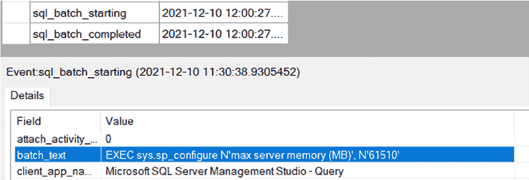
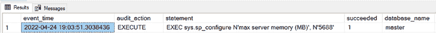
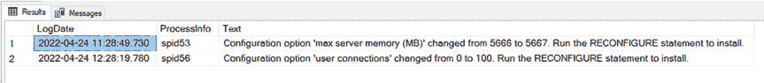
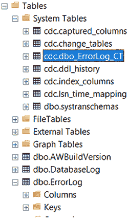
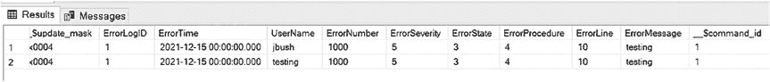
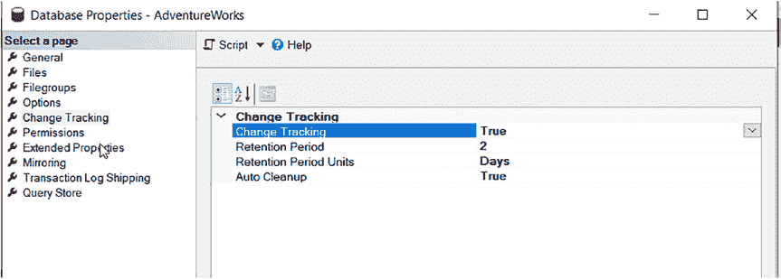
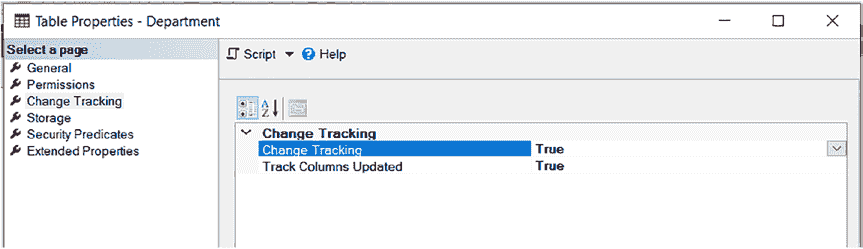

# 第 2 章 数据库审计的类型

在不使用向导的情况下创建会话。它还提供模板，帮助你设置会话，而无需了解所有使其正常工作的配置设置。

图 2-2 展示了如何通过 SQL Server Management Studio 设置扩展事件。

*图 2-2. 设置扩展事件*

第 6 章“什么是扩展事件？”提供了关于配置选项的更多细节。第 7 章“通过图形界面实现扩展事件”和第 8 章“通过 SQL 脚本实现扩展事件”将引导你完成扩展事件的实现过程。

#### 跟踪 SQL Server 配置更改

有多种方法可以跟踪 SQL Server 配置更改。这些更改是指你对服务器设置所做的更改，例如更改最大内存设置或显示高级选项。所有这些选项，包括附加选项，都将在第 9 章“跟踪 SQL Server 配置更改”中涵盖。

扩展事件是捕获此类更改的一种方式。图 2-3 展示了如果你通过 SQL Server Management Studio 图形界面查询，它是如何捕获配置更改的一个横截面视图。你也可以通过脚本来查询，这将在第 9 章“跟踪 SQL Server 配置更改”中介绍。

*图 2-3. 扩展事件捕获配置更改*

你还可以使用 SQL Server 审计来跟踪配置更改。图 2-4 展示了它是如何捕获配置更改的横截面视图。

*图 2-4. SQL Server 审计捕获配置更改*

最后，你也可以直接查询`SQL Server 日志`。`SQL Server 日志`包含系统事件。图 2-5 展示了此查询结果的一个示例。

*图 2-5. SQL Server 日志查询结果*

#### 变更数据捕获

*变更数据捕获*将允许你跟踪数据的更改，而不是谁在查询数据。它使用`SQL Server 代理`来记录在特定表中通过插入、更新或删除数据所做的数据更改。它从数据库的事务日志中读取更改。更改的详细信息存储在一个模仿原始表结构的变更表中。

配置有多个步骤，这些步骤将在第 10 章“附加的 SQL Server 审计和跟踪方法”中涵盖。图 2-6 展示了原始表及其 CDC 表。

*图 2-6. CDC 表结构*

当你查询`cdc.dbo_ErrorLog_CT`表（这是 CDC 存储对`dbo.ErrorLog`表更改的地方）时，你将看到类似于图 2-7 中的查询结果。图 2-7 是在对一行进行一次更新后截取的。

*图 2-7. CDC 结果*

#### 变更跟踪

*SQL Server 变更跟踪*是一种轻量级的方法，用于跟踪对 SQL Server 数据库表的 DML 更改。一旦 DML 语句提交到数据库，这些更改就会被跟踪。它与变更数据捕获的不同之处在于，它同步跟踪更改，而变更数据捕获从事务日志文件读取，这会导致读取更改时出现延迟。此外，与变更数据捕获不同，变更跟踪不需要启动`SQL 代理`。

图 2-8 展示了如何在数据库上启用变更跟踪。

*图 2-8. 在数据库上启用 SQL Server 变更跟踪*

