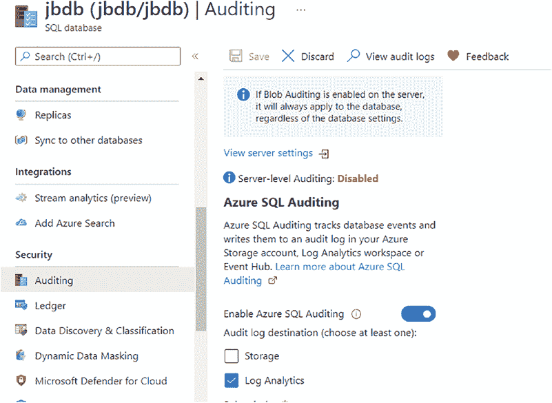

# 第二章 数据库审计的类型

为此可以使用 Server Management Studio。图 2-14 展示了如何在门户中启用类似于`SQL Server Audit`的审计功能。

*图 2-14. 在 Azure SQL 数据库上启用审计*

#### 审计 Azure SQL 托管实例

审计`Azure SQL 托管实例`与审计本地`SQL Server`非常相似。主要区别在于你无法访问数据库服务器底层的虚拟机，因此你需要设置云存储来保存审计或事件文件。请参考关于`SQL Server Audit`和`扩展事件`的章节，以帮助你理解它们的工作原理。`Azure SQL 托管实例`的审计将在[第 14 章，“审计 Azure SQL 托管实例”](https://doi.org/10.1007/978-1-4842-8634-0_14)中更详细地介绍。

## Amazon Web Services 和 Google Cloud 审计选项

*Amazon Web Services (AWS)* 提供了一项名为*关系型数据库服务 (RDS)* 的产品，你可以在其中托管你的`SQL Server`数据库。该产品允许你使用`SQL Server Audit`和`扩展事件`，其方式与在本地`SQL Server`中使用非常相似，但你需要设置云存储来保存文件；在这种情况下，它被称为`S3`。[第 15 章，“其他云供应商审计选项”](https://doi.org/10.1007/978-1-4842-8634-0_15)将更详细地介绍`AWS RDS`审计。

*Google Cloud* 的数据库审计工作方式更类似于`Azure SQL Database`审计，你需要通过`Google Cloud`门户启用它。[第 15 章，“其他云供应商审计选项”](https://doi.org/10.1007/978-1-4842-8634-0_15)将更详细地介绍`Google Cloud`数据库审计。

