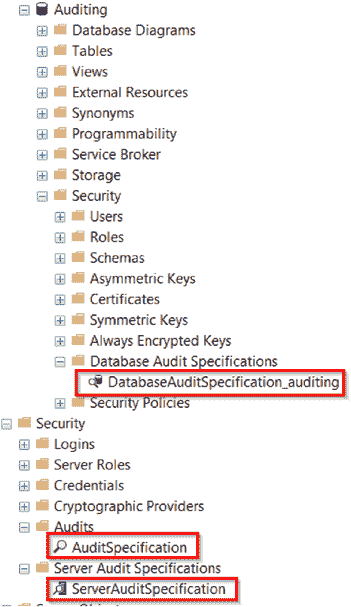

# 第三章 什么是 SQL Server Audit？

`SQL Server Audit`是内置的审计功能，可通过`SQL Server Management Studio` GUI 或`SQL`脚本使用。你可以设置并配置它来捕获`SQL Server`上发生的几乎所有事情。它非常灵活且易于设置。

## SQL Server Audit 的可用性

`SQL Server Audit`的第一个版本在`2008`年推出，并且仅包含在`Enterprise`版中。从`2012`版本开始，微软将其扩展到所有版本都支持服务器级别的审计，但数据库审计仍然仅限于`Enterprise`版。到了`2016`及之后的版本，你可以使用任何版本进行服务器和数据库审计，这要好得多，因为很多人并不只使用`Enterprise`版。表 3-1 概述了`SQL Server Audit`的可用性情况。

*表 3-1. 按版本划分的 SQL Server Audit 可用性*

| 版本 | 服务器审计可用性 | 数据库审计可用性 |
| :--- | :--- | :--- |
| 2008 | Enterprise | Enterprise |
| 2012, 2014, 和 2016 SP1 之前 | 所有版本 | Enterprise |
| 2016 SP1, 2017, 和 2019 | 所有版本 | 所有版本 |

© Josephine Bush 2022
J. Bush, *Practical Database Auditing for Microsoft SQL Server and Azure SQL*, [`doi.org/10.1007/978-1-4842-8634-0_3`](https://doi.org/10.1007/978-1-4842-8634-0_3#DOI)

## SQL Server Audit 要求

要使`SQL Server`审计工作，根据你想要审计的内容，你需要两到三样东西。你必须创建一个`audit`（审计）。这将决定审计数据的存储位置。你还需要一个`server`（服务器）和/或一个`database audit specification`（数据库审计规范），用于定义你想要捕获的内容。每个`audit`可以有一个`server specification`（服务器规范）和/或每个数据库一个`database specification`（数据库规范）。这些服务器审计和数据库审计彼此独立。

图 3-1 中的截图向你展示了审计的位置。

*图 3-1. SQL Server 审计*

请注意，图 3-1 中高亮显示的`SQL Server audits`默认并不存在。我创建它们是为了让你有个参考点，以便知道在哪里可以找到它们。

`audit specification`是你配置审计存储位置以及如何……的地方

