# 第四章 通过 GUI 实现 SQL Server 审计

要使 SQL Server 审计功能正常工作，根据你想要审计的内容，你需要两到三个组件。第三章“什么是 SQL Server 审计？”已介绍了这些组件各自是什么，以及与之相关的审计类别和组。

在本章中，你将学习如何在 SQL Server Management Studio (`SSMS`) 中设置审计。

#### 设置审计

简要回顾一下，要使 SQL Server 审计正常工作，根据你想要审计的内容，你需要两到三样东西。

*   你需要创建一个审计。这将决定审计数据的存储位置、保留多少审计数据以及与审计相关的若干其他设置。
*   你还需要一个服务器和/或一个数据库审计来收集审计数据。服务器和数据库审计必须与一个审计相关联。每个审计可以为每个数据库包含一个服务器审计和一个数据库审计。这些服务器和数据库审计彼此不依赖。服务器审计规范通常适用于审计服务器级别的更改和/或同时审计所有数据库。数据库审计规范则适用于审计单个数据库或单个数据库中的活动子集。

图 4-1 展示了如何在 `SSMS` 中通过右键单击`安全性`部分下的`审计`来创建审计。

© Josephine Bush 2022
J. Bush, *Practical Database Auditing for Microsoft SQL Server and Azure SQL*, [`doi.org/10.1007/978-1-4842-8634-0_4`](https://doi.org/10.1007/978-1-4842-8634-0_4#DOI)

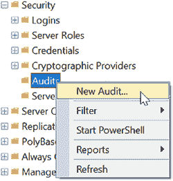
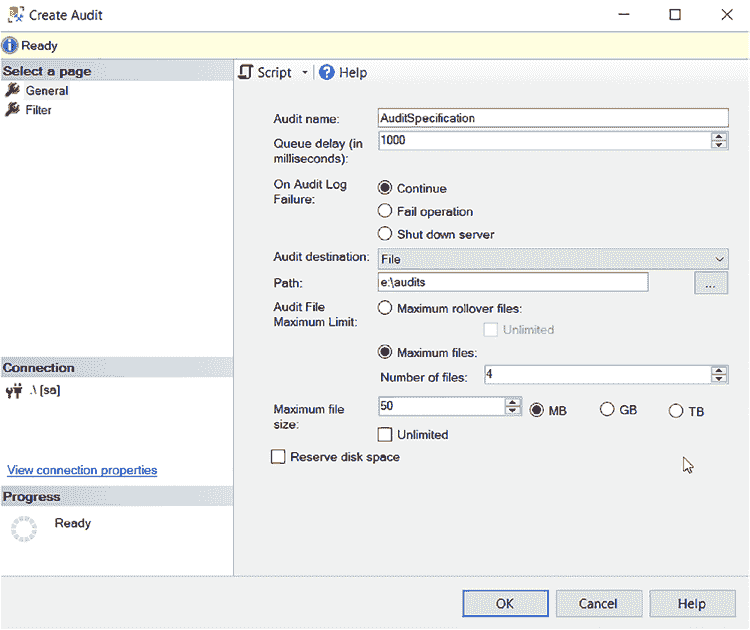

***图 4-1.** 创建审计*

选择`新建审计`后，你将看到一个对话框来选择审计选项，如图 4-2 所示。

***图 4-2.** 配置审计对话框*

以下是一些关于如何配置审计的建议：

*   **审计名称** – 我倾向于将其命名为 `AuditSpecification` 或 `AuditSpecification_servername`。这完全取决于你希望名称有多具描述性。不过，你可以创建多个审计，因此如果你计划添加其他审计，取一个更具描述性的名称可能是有意义的。
*   **队列延迟** – 这是审计前的等待时间（以毫秒为单位）。你可以将其设置为 `0`、`1000` 或大于 `1000` 的值。我将其保留为 `1000`。
*   **审核日志失败时**
    *   **继续** – 如果审计无法捕获语句，它会继续进行审计。你可能会偶尔错过个别语句，但我怀疑这种情况即使发生也不常出现。
    *   **失败操作** – 如果无法进行审计，它将导致语句

导致失败。执行该语句的用户或应用程序将收到错误。

*   **关闭服务器** – 如果无法进行审计，它将执行其声明的操作，即关闭服务器。所有用户和应用程序将无法再访问服务器。

我选择“继续”此选项。我认为“失败操作”和“关闭服务器”过于极端。如果我不选择“继续”，人们会因为服务器出问题而向我大喊大叫。如果审计在法律或财务数据库等环境中至关重要，你可能需要选择“失败操作”或“关闭服务器”。

## 第 4 章 通过图形用户界面实现 SQL Server 审计

*   **审计目标**

*   **文件** – 我总是选择写入文件，因为这对我来说最简单。我没有很多审计限制。是的，审计员想知道发生了什么，但他们不认为我们会偷偷进入那里删除审计文件或不报告审计数据。

*   **应用程序日志** – 如果你有一个像 `Splunk` 这样的日志收集应用程序，可以读取所有日志并将它们收集到一个中央存储库中，我认为可以将审计数据存储在应用程序日志中。

*   **安全日志** – 这比写入应用程序日志有更多的限制，但适用相同的概念。这是存储审计数据最安全的选择，因为最不可能有人篡改它。

*   **路径** – 如果你为 `审计目标` 选择了 `文件`，你需要选择一个路径。确保不要将审计文件放在 `C 盘` 上。尽管我们将在后续步骤中限制审计文件的大小，但你不希望它意外填满 `C 盘`。我也不建议将审计文件放在数据驱动器或日志驱动器上。我工作的地方有一个用于应用程序的 `E 盘`；那是存放审计文件的好地方。

*   **最大文件数** – 4

*   **最大文件大小** – 50 MB

我从不允许审计收集无限数量的文件或无限制的文件大小。这会使查询它们变得困难。我发现，当收集权限和架构更改时，4 个 50 MB 的文件很适合我的需求。你的文件数量和大小取决于你的需求。

*   **保留磁盘空间** – 由于我的文件相当小，我从不勾选此项。

`注意` 不要将 `SQL Server 审计` 设置为收集无限数量的文件或允许无限制的文件大小。它们会变得巨大，几乎无法查询。

如果你想将审计数据存储在应用程序日志中，你将按照 `图 4-3` 中的截图设置审计。

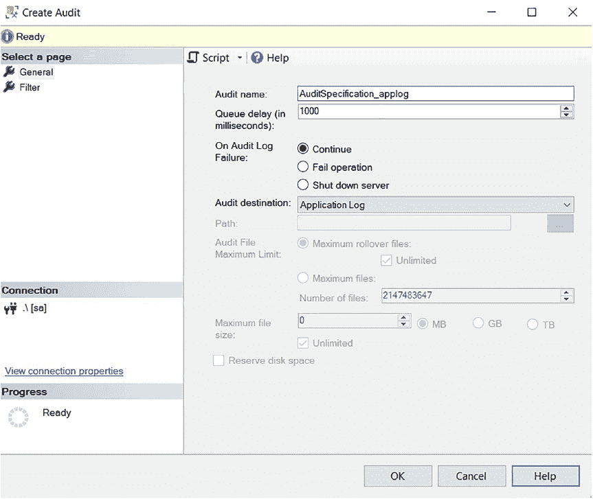

`图 4-3.` 配置写入应用程序日志的审计

安全日志也是如此，但你需要从 `审计目标` 下拉菜单中选择 `安全日志`，如 `图 4-4` 所示。

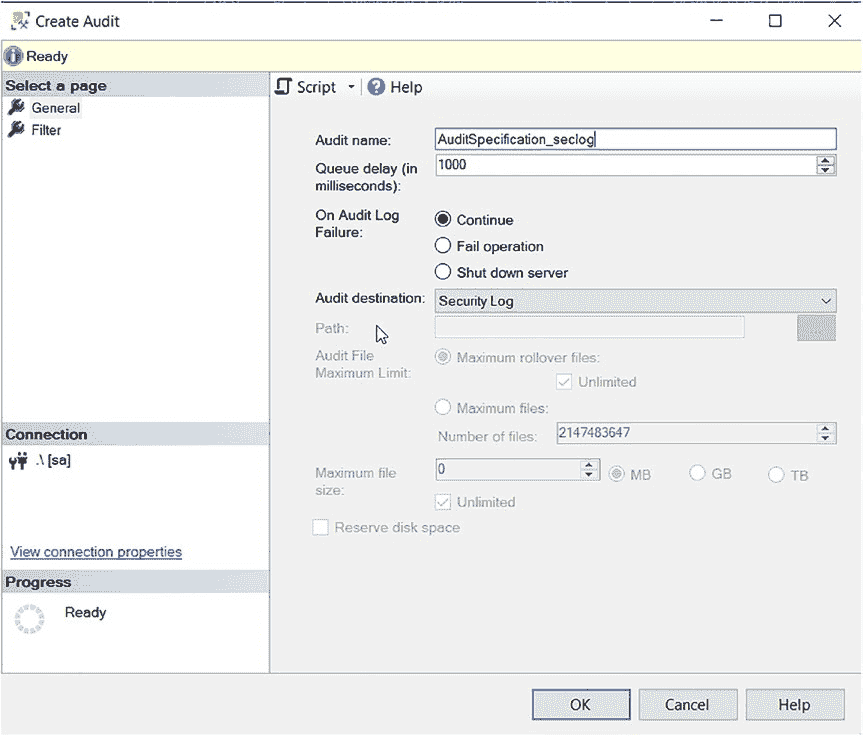

`图 4-4.` 配置写入安全日志的审计

`注意` 所有审计在初始创建时都是禁用的。

创建审计后，你需要启用它。你可以右键单击它并选择 `启用审计`，如 `图 4-5` 所示。如果你不启用它，它将不会收集任何数据。

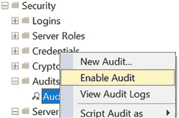
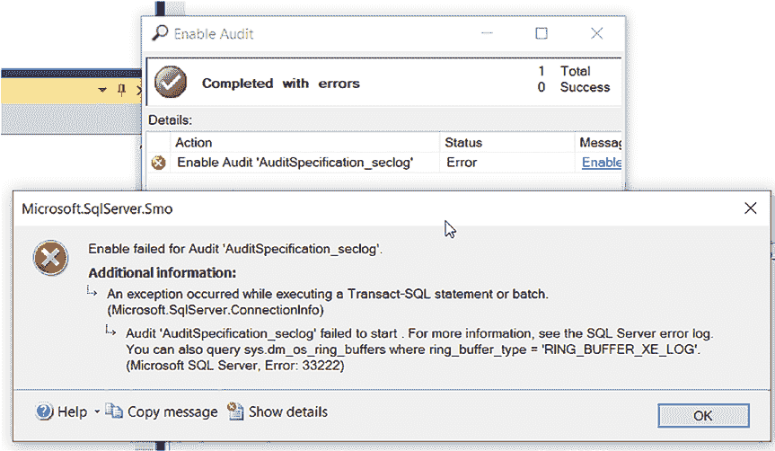

`图 4-5.` 启用审计

当你尝试启用配置为使用安全日志的审计时，会收到错误，如 `图 4-6` 所示。

`图 4-6.` 创建写入安全日志的审计时出现的错误

`SQL Server 日志` 将为你提供有关错误的额外信息，如 `图 4-7` 所示。

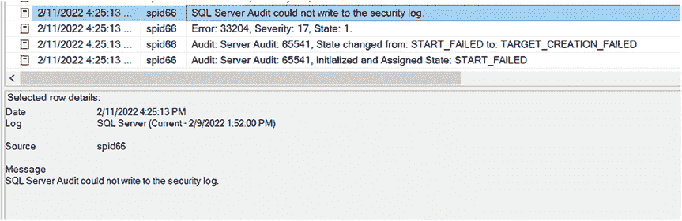
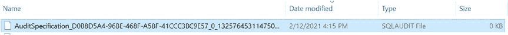

`图 4-7.` 创建写入安全日志的审计时错误的额外信息

要解决 `错误: 33204 SQL Server 审计无法写入安全日志`，你需要

需要基于以下 Microsoft 文档配置额外项目：[`docs.microsoft.com/en-us/sql/relational-databases/security/auditing/write-sql-server-audit-events-to-the-security-log?view=sql-server-ver15`](https://docs.microsoft.com/en-us/sql/relational-databases/security/auditing/write-sql-server-audit-events-to-the-security-log?view=sql-server-ver15)

如果您选择将文件作为审计目标，在启用审计后（如图 4-8 所示），一个审计文件将被放置在磁盘上。这里将存放与该审计关联的服务器和数据库审计的数据。

**图 4-8.** 磁盘上的审计文件

随着数据收集，此文件将增长至审计中指定的大小。然后，它将创建另一个新文件，直至达到配置中指定的文件数量。一旦最后一个文件被写满，系统将删除最旧的文件并创建另一个新文件。您需要了解文件被写满的速度，以便在它们被删除前不会错过收集其中的数据。

#### 设置服务器审计规范

两个可选审计组件中的第一个是服务器审计。您需要在服务器的安全性部分进行设置。右键单击以新建一个，如图 4-9 所示。

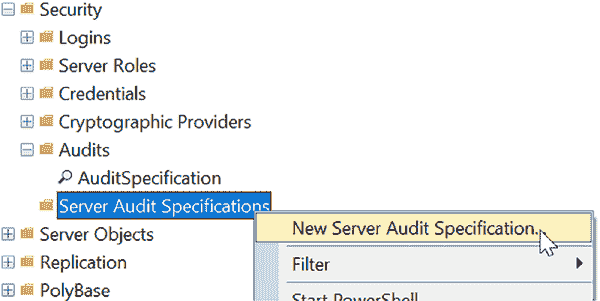

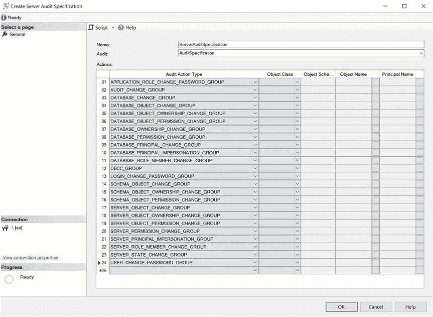

**图 4-9.** 创建服务器审计规范

这将弹出一个对话框来配置您的服务器审计规范，如图 4-10 所示。

**图 4-10.** 配置服务器审计规范

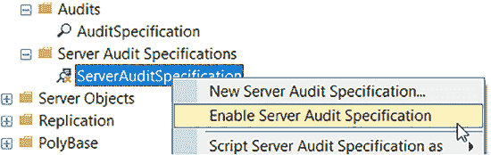

### 关于如何配置服务器审计规范的建议：

*   **名称 –** 我倾向于将其命名为 `ServerAuditSpecification` 或 `ServerAuditSpecification_servername`。这完全取决于您希望名称具有多大的描述性。不过，您可以创建多个服务器审计，因此如果您计划添加其他审计，起一个更具描述性的名称可能是有意义的。
*   **审计 –** 您需要将其与您的审计关联。这里有一个下拉列表，其中列出了您的审计。您需要建立此关联，因为这里是审计数据将存放的位置。
*   **操作 –** 我正在服务器级别以及服务器上的所有数据库中捕获权限和架构更改。我还在捕获是否有人更改了密码、更改了审计，或者是否有人执行了 `DBCC` 命令。您无需填写任何其他列，因为它们不适用于这些操作类型。例如，如果您只想捕获服务器更改，您可以移除所有以 `database` 和 `schema` 开头的操作。第 3 章“什么是 SQL Server 审计？”中有一个关于服务器审计操作组的小节，可帮助您确定每个操作所审计的内容。

服务器审计规范默认也是禁用的。您可以右键单击以启用它，如图 4-11 所示。如果处于禁用状态，它不会收集任何数据。

**图 4-11.** 启用服务器审计规范

#### 设置数据库审计规范

两个可选组件中的第二个是数据库审计。您必须进入每个数据库的安全性部分，然后右键单击，如图 4-12 所示。

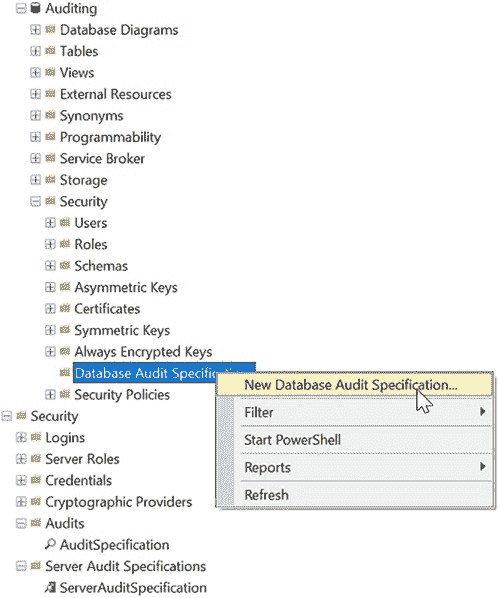

**图 4-12.** 创建数据库审计规范

这将弹出一个对话框来配置数据库审计规范，如图 4-13 所示。

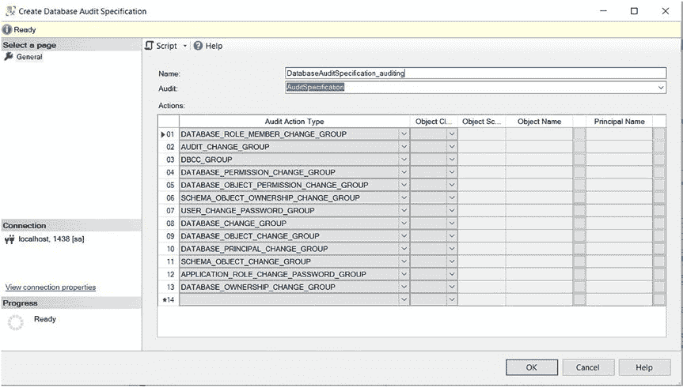

配置数据库审计规范的建议：

以下是如何配置数据库审计规范的建议：

• **名称** – 我总是将其命名为下划线加数据库名称，因为这有助于识别它正在审计哪个数据库，例如 `DatabaseAuditSpecification_Auditing`。这完全取决于您希望命名的描述性程度。您可以创建多个审计，因此如果您计划添加其他审计，使用更具描述性的名称可能更有意义。需要注意的一点是，如果在数据库审计名称中没有包含数据库名称，您将无法轻松查询存储审计信息的系统视图。如果您将审计命名得描述性强，这些视图会非常有帮助。查询系统视图将在第 5 章“通过 SQL 脚本实现 SQL Server 审计”中更详细地介绍。

• **审计** – 您需要将其与您的审计关联。有一个下拉列表，其中列出了您的审计。您需要此关联，因为这是您的审计数据将要存放的位置。

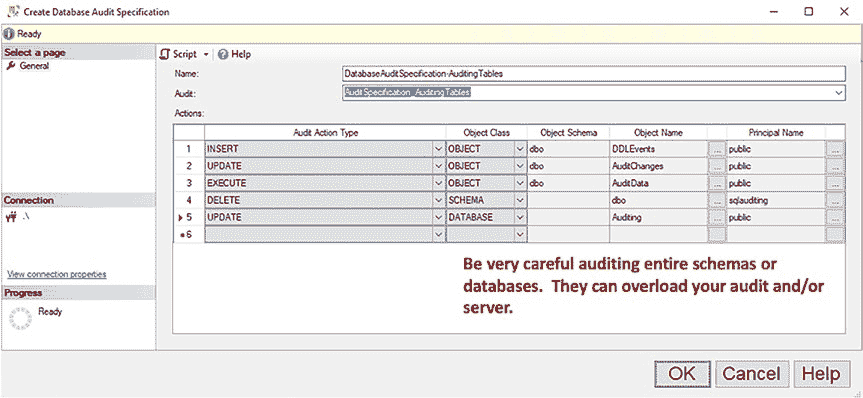

通过 GUI 实现 SQL Server 审计

• **操作** – 我在数据库级别捕获权限和架构更改。第 3 章“什么是 SQL Server 审计？”中有一个关于数据库审计操作组的部分，可帮助您确定每个操作审计的内容。**如果您已经在服务器审计级别获取权限和架构更改，请不要使用此设置。这将产生重复的审计记录。**

数据库审计的亮点在于如果您想审计对象。通过数据库审计，您可以审计对当前数据库中对象（如表、视图和存储过程）的插入、更新、删除、选择和执行语句。您还可以审计整个架构或数据库。这些操作类型需要您根据对象类填写审计操作的所有附加列，如图 4-14 所示。

配置数据库审计规范以捕获 DML 操作的建议：

当审计特定对象、架构或数据库时，配置数据库审计规范的建议：

• **名称** – 我总是将其命名为下划线加与其用途相关的描述性内容，因为这有助于识别其审计内容。

• **审计** – 您需要将其与您的审计关联。有一个下拉列表，其中列出了您的审计。您需要此关联，因为这是您的审计数据将要存放的位置。

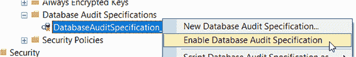

通过 GUI 实现 SQL Server 审计

• **审计操作类型** – 第 3 章“什么是 SQL Server 审计？”中有一个关于数据库审计操作组的部分，可帮助您确定每个操作审计的内容。

• **INSERT** – 审计谁向表、架构或数据库插入数据
• **UPDATE** – 审计谁更新了表、架构或数据库
• **EXECUTE** – 审计谁在存储过程、架构或数据库上执行
• **SELECT** – 审计谁从表、视图、函数、架构或数据库中选择数据
• **DELETE** – 审计谁从表、架构或数据库中删除数据
• **对象类**
    • **OBJECT** – 选择此项以查看对特定表、视图、存储过程或函数的查询。
    • **SCHEMA** – 选择此项以查看对架构中任何对象的查询。
    • **DATABASE** – 选择此项以查看对当前数据库中任何对象的查询。
• **对象架构** – 对 `OBJECT` 类是必需的
• **对象名称** – 对 `OBJECT`、`SCHEMA` 和 `DATABASE` 类是必需的
• **主体名称** – 对 `OBJECT`、`SCHEMA` 和 `DATABASE` 类是必需的。如果您想审计所有人，请使用 `public`。如果您想审计多个用户，则需要为每个用户单独设置一行。

创建数据库审计后，它默认也是禁用的。您可以右键单击启用它，如图 4-15 所示。禁用时，它不会收集数据。

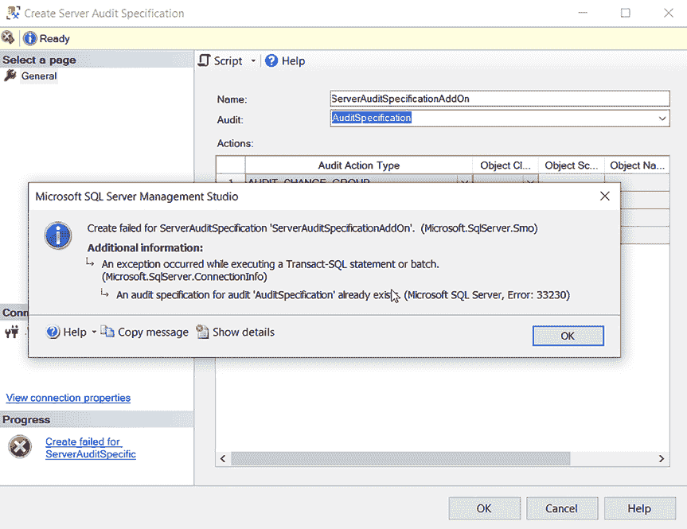

