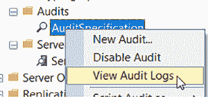
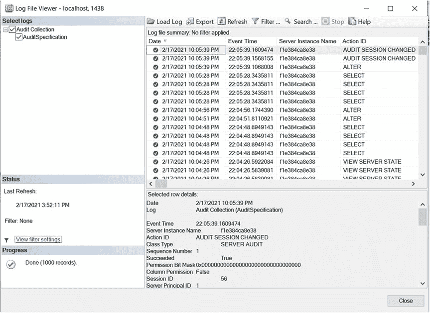
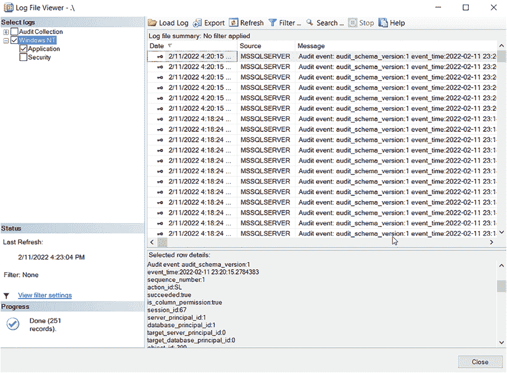
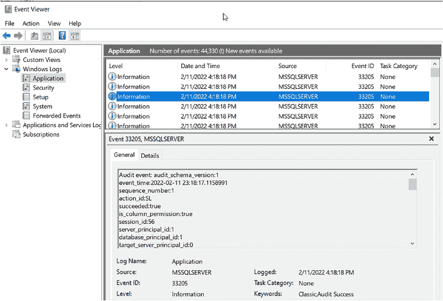
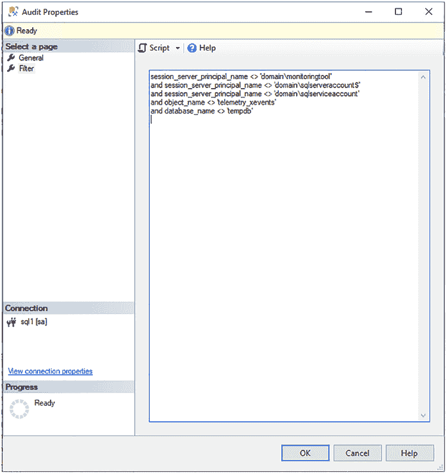
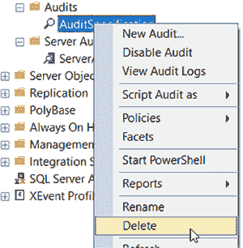
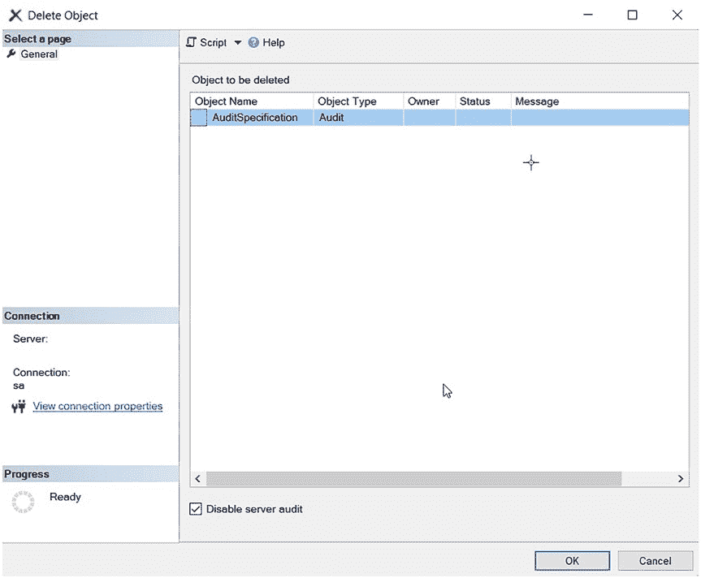
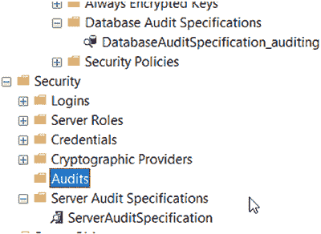
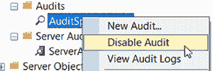

# 第 4 章 通过图形用户界面实现 SQL Server 审计

## 添加多个审计

如果你尝试为一个已包含服务器审计的现有审计再添加另一个服务器审计，操作将失败，并提示审计已存在，如图 4-16 所示。这意味着你无法为其添加另一个服务器审计。

**图 4-16.** 尝试向一个审计添加第二个服务器审计规格时出现的错误

但这并不妨碍你拥有多个服务器和数据库审计，因为你可以设置多个审计。第 3 章“什么是 SQL Server 审计？”中有一个关于多重审计设置的部分，并提供了一些你可以参考的示例场景。

#### 查询审计日志

你可以通过 `SSMS` 查询审计，方法是右键单击审计，如图 4-17 所示。

**图 4-17.** 查看审计日志

**图 4-18.** 审计日志结果

随后会弹出一个对话框，显示最近的 1000 个事件，如图 4-18 所示。

可能没有任何列表项，因为尚未发生任何可审计的事件。也可能有大量的审计数据，因为后台正在发生许多你并未意识到的事情。`SQL Server` 有很多内部进程可能会被你的审计收集。有一种方法可以在审计数据被收集之前进行过滤，这一点稍后将会介绍。

如果你将审计日志存储在应用程序或安全日志中，你将在 `日志文件查看器` 中看到不同的视图，该查看器会改为从应用程序或安全日志中查询审计数据，如图 4-19 所示。

**图 4-19.** 存储在应用程序日志中的审计日志结果

如果你将审计日志存储在应用程序或安全日志中，你也可以在 Windows 的 `事件查看器` 中查看它们，如图 4-20 所示。

**图 4-20.** 审计日志结果显示在事件查看器的应用程序日志中

## SQL Server 审计中可用的列

审计中有很多可用的列。当你查询或过滤审计时，这些列可供你使用。不同版本的 SQL Server 提供不同的列。以下列表包含了我认为最有用的列：

*   **SQL Server 2012/2014/2016**
    *   `event_time`
    *   `action_id`
    *   `succeeded`
    *   `server_principal_name`
    *   `server_instance_name`
    *   `database_name`
    *   `schema_name`
    *   `object_name`
    *   `statement`
    *   `file_name`
*   **SQL Server 2017 – 包含 2016 及更早版本的所有列，外加以下新增列**
    *   `client_ip`
    *   `application_name`
*   **SQL Server 2019 – 包含 2017 及更早版本的所有列，外加以下新增列**
    *   `host_name`

**请注意**，可用的列远不止上列中的这些，而且每个版本都会增加新列。根据你选择存储审计数据的位置，以下链接提供了有关审计数据中可用列的更多信息。

*   https://docs.microsoft.com/en-us/sql/relational-databases/security/auditing/sql-server-audit-records?view=sql-server-ver15
*   https://docs.microsoft.com/en-us/sql/relational-databases/system-functions/sys-fn-get-audit-file-transact-sql?view=sql-server-ver15

[system-functions/sys-fn-get-audit-file-transact-sql?view=sql-server-ver15](https://docs.microsoft.com/en-us/sql/relational-databases/system-functions/sys-fn-get-audit-file-transact-sql?view=sql-server-ver15)

#### 筛选 SQL Server 审计

你可以使用审计对话框进行筛选，如图 4-21 所示。

第 4 章 通过 GUI 实现 SQL Server 审计

***图 4-21.** 为审计添加筛选器*

你可以基于审计收集中任何可用的列进行筛选。这样，你可以过滤掉诸如监控工具或服务账户之类的内容。SQL Server 有一个 `servername$` 账户，在后台执行各种操作。这类账户会快速填满你的审计文件，导致难以找到你想要审计的内容。进行筛选时，使用列的名称以及你**不希望它等于**或**希望它等于**的值。例如，如果你只想审计 `sa`，可以在这里进行筛选。这类似于 SQL 语句中的 `WHERE` 子句，因此你可以做任何能在 WHERE 子句中做的事情，只是不使用 `WHERE` 关键字。

第 4 章 通过 GUI 实现 SQL Server 审计

**提示** 如果你审计的 SQL Server 版本没有你需要的列，例如 `client_ip` 或 `host_name`，你可以尝试改用扩展事件来实现。第 7 章“通过 GUI 实现扩展事件”涵盖了这方面的信息。

#### 删除审计

要删除审计，请右键单击该审计，如图 4-22 所示。

***图 4-22.** 删除审计*

你将看到一个对话框，这个对话框非常有用之处在于，你可以通过一个复选框选择禁用它，如图 4-23 所示。在删除审计之前，你需要先将其禁用。

第 4 章 通过 GUI 实现 SQL Server 审计

***图 4-23.** 在删除前禁用审计*

当你删除审计后，文件仍会保留在磁盘上。我删除了审计，以为文件也随之消失了。不，文件还在那里。这是为了方便你日后可能出于审计目的需要它们。你必须手动去删除它们。

删除审计时，可能会使你的服务器和数据库审计成为孤立状态。服务器和数据库审计会保留并看似正常，但由于审计已被删除，将不会收集任何数据。图 4-24 显示即使没有审计，服务器和数据库审计仍然存在。

第 4 章 通过 GUI 实现 SQL Server 审计

***图 4-24.** 审计已消失，但服务器和数据库审计看似正常*

如果你进入服务器或数据库审计，它们会显示审计为空，如图 4-25 所示。

***图 4-25.** 服务器审计规范缺少审计*

第 4 章 通过 GUI 实现 SQL Server 审计

在图 4-25 的左上角有一条消息，告诉你“未提供服务器审计”，而它需要这个才能收集数据。

即使你使用相同的名称重新创建审计，服务器和数据库审计也不会自动与新审计关联。服务器和数据库审计依赖于审计的 `GUID`。有一种方法可以使用相同的 `GUID` 重新创建审计。这将在第 5 章“通过 SQL 脚本实现 SQL Server 审计”中介绍。

#### 禁用审计

你可以通过在 GUI 中右键单击审计并选择禁用，如图 4-26 所示，来禁用审计。

***图 4-26.** 禁用审计*

**注意** 如果你想禁用审计，在它完成正在审计的操作之前，审计不会被禁用。如果你正在审计大量操作，这可能会很困难。从技术上讲，你...

