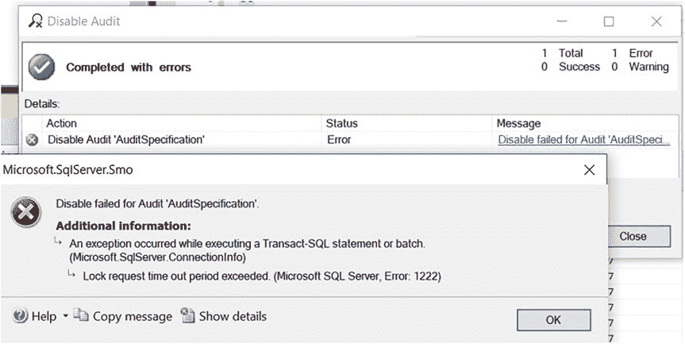
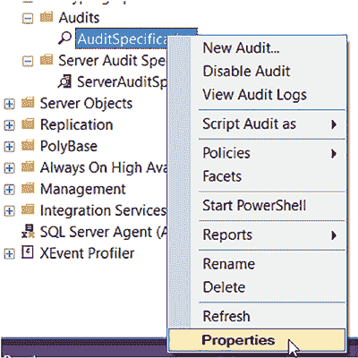
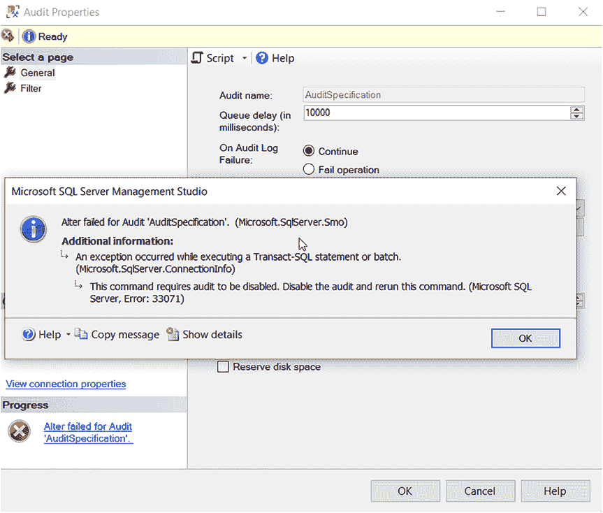
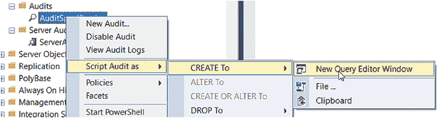

# 第 4 章 通过图形用户界面实现 SQL Server 审计

你能够禁用任何审计，但审计可能需要一些时间来完成当前的审核操作，然后才能自行禁用。

因为当审计正在审核操作时你无法将其禁用，所以请务必谨慎考虑如何以及什么内容需要被 `审计`。你可能会使生产服务器过载或冻结。我就遇到过这种情况。我曾认为不可能因为一次 `审计` 而使生产服务器崩溃。我以为我可以在审计操作的间隙停止 `审计`。即使禁用你的 `审计` 并不困难，但如果它审计的内容过多，要梳理所有数据也会很困难。那就像大海捞针，你还不如干脆不去 `审计`。我遵循的是 `审计` 的“少即是多”原则。

我的 `审计` 禁用惊魂事件发生在我试图停止一个非常繁忙的生产服务器上的 `审计` 时，结果它锁死了。`审计` 无法禁用，接着，突然之间，查询无法完成，然后我甚至无法通过 `SSMS` 连接到服务器。我不得不重启服务，导致了一次生产中断。谢天谢地，中断时间非常短。不过从技术上讲，这本来是不应该发生的。

## 注意

务必在 `SQL Server` 中启用专用管理员连接（`DAC`）。这样，如果遇到连接问题，你始终可以通过 `DAC` 进行连接。要了解更多信息，请访问 [`docs.microsoft.com/en-us/sql/database-engine/configure-windows/diagnostic-connection-for-database-administrators?view=sql-server-ver15#connecting-with-dac`](https://docs.microsoft.com/en-us/sql/database-engine/configure-windows/diagnostic-connection-for-database-administrators?view=sql-server-ver15#connecting-with-dac)。

你应该会收到一个 `锁请求超时期限已过` 的错误，如图 4-27 所示。

**图 4-27.** 禁用审计时出错

我无法在 `SQL Server 2019` 中重现崩溃，因为我无法模拟那种负载。`审计` 不关心长时间运行的语句，因为它会捕获语句并等待下一个。问题在于当你 `审计` 的语句接连不断地出现，而 `审计` 在语句间隙根本没有机会被禁用时。我的惊魂事件发生在 `SQL Server 2014` 上，所以这可能是我当时使用的版本特性或服务器繁忙程度所致。而且我有非常具体的 `PCI` `审计` 要求，因此我无法像本章所示那样最小化 `审计` 范围。

#### 修改审计

一旦创建了 `审计`，你可以通过右键单击它并选择 `属性` 来修改，如图 4-28 所示。

**图 4-28.** 修改审计

当它处于启用状态时，你无法修改它，如图 4-29 中的错误所示。

**图 4-29.** 在审计启用时尝试修改导致的错误

唯一不能修改的是名称。你必须删除它并重新创建才能更改名称。

在下一章中，你将学习如何通过为你想要部署在服务器上的 `审计` 编写脚本，从而让你的工作更轻松。这比所有这些点击和右键操作要简单得多。

