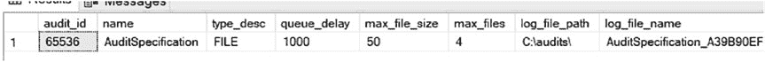
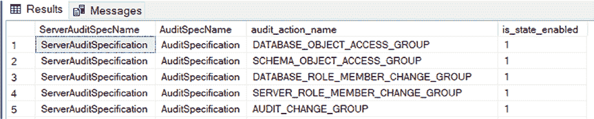
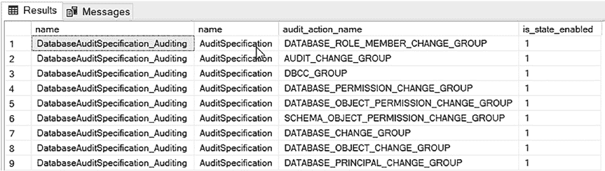
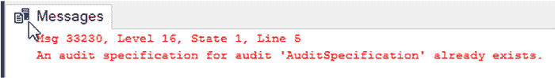
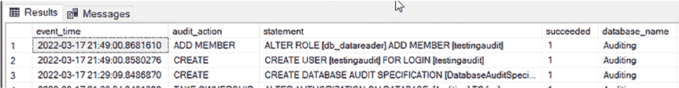
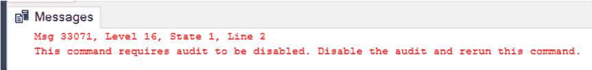
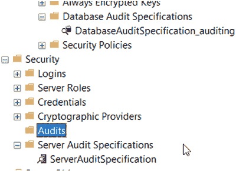

# 第 5 章 通过 SQL 脚本实现 SQL Server 审计

#### 查询系统视图

您可以查询系统视图来查看审计的设置。这样可以更轻松地查看审计设置，而无需通过图形用户界面（GUI）进入。

清单 5-8 提供了用于获取审计及其设置列表的查询语句。

***清单 5-8.*** 查询系统视图以列出审计

```
USE master;
SELECT * FROM sys.server_file_audits;
```

图 5-4 展示了 `sys.server_file_audits` 视图查询结果的一个横截面。





***图 5-4.** 列出审计的系统视图结果*

**提示** 要获取 `sys.server_file_audits` 表中所有列的描述，[请访问 https://docs.microsoft.com/en-us/sql/relational-databases/system-catalog-views/sys-server-file-audits-transact-sql?view=sql-server-ver15](https://docs.microsoft.com/en-us/sql/relational-databases/system-catalog-views/sys-server-file-audits-transact-sql?view=sql-server-ver15)。

清单 5-9 提供了用于获取服务器审计规范及其设置列表的查询语句。

***清单 5-9.*** 查询系统视图以列出服务器审计规范

```
USE master;
SELECT
    sas.name as ServerAuditSpecName,
    sfa.name as AuditSpecName,
    sasd.audit_action_name,
```


[sas.is_state_enabled]

`FROM sys.server_audit_specifications sas`

`LEFT JOIN sys.server_audit_specification_details sasd`

`ON sas.server_specification_id = sasd.server_specification_id`

`LEFT JOIN sys.server_file_audits sfa`

`ON sas.audit_guid = sfa.audit_guid;`

图 5-5 显示了清单 5-9 中查询结果的横截面视图。

**图 5-5.** 列出服务器审核规范的系统视图结果



第 5 章 通过 SQL 脚本实现 SQL 服务器审核

**提示** 要获取服务器审核系统视图中所有列的描述，请访问：

- <https://docs.microsoft.com/en-us/sql/relational-databases/system-catalog-views/sys-server-audit-specifications-transact-sql?view=sql-server-ver15>
- <https://docs.microsoft.com/en-us/sql/relational-databases/system-catalog-views/sys-server-audit-specification-details-transact-sql?view=sql-server-ver15>

清单 5-10 给出了用于获取数据库审核规范及其设置的查询。

**清单 5-10.** 查询系统视图以列出数据库审核规范

```sql
USE dbname;

SELECT
    das.name,
    sfa.name,
    dasd.audit_action_name,
    das.is_state_enabled
FROM sys.server_file_audits sfa
LEFT JOIN sys.database_audit_specifications das
    ON sfa.audit_guid = das.audit_guid
LEFT JOIN sys.database_audit_specification_details dasd
    ON das.database_specification_id = dasd.database_specification_id;
```

图 5-6 显示了清单 5-10 中查询结果的横截面视图。

**图 5-6.** 列出数据库审核规范的系统视图结果



第 5 章 通过 SQL 脚本实现 SQL 服务器审核

**提示** 要获取数据库审核系统视图中所有列的描述，请访问：

- <https://docs.microsoft.com/en-us/sql/relational-databases/system-catalog-views/sys-database-audit-specifications-transact-sql?view=sql-server-ver15>
- <https://docs.microsoft.com/en-us/sql/relational-databases/system-catalog-views/sys-database-audit-specification-details-transact-sql?view=sql-server-ver15>

## 添加多个审核


如果你尝试向已包含服务器审计的现有审计中添加另一个服务器审计，操作将会失败，并显示错误提示该审计已存在，如图 5-7 所示。这意味着你无法为其添加另一个服务器审计。

**图 5-7.** 尝试向审计中添加第二个服务器审计规范时出现的错误

这并不妨碍你拥有多个服务器和数据库审计，因为你可以设置多个审计。第 3 章“什么是 SQL Server 审计？”中有一节专门讨论多审计设置，并提供了一些你可以参考的示例场景。

## SQL Server 审计中可用的列

审计中提供了许多列。这些列可在你查询或筛选审计时使用。不同版本可用的列有所不同。以下列表包含了我最常用的一些列：

*   **SQL Server 2012/2014/2016**
    *   `event_time`
    *   `action_id`
    *   `succeeded`
    *   `server_principal_name`
    *   `server_instance_name`
    *   `database_name`
    *   `schema_name`
    *   `object_name`
    *   `statement`
    *   `file_name`
*   **SQL Server 2017 – 包含 2016 及更早版本的所有列，外加以下新增列**
    *   `client_ip`
    *   `application_name`
*   **SQL Server 2019 – 包含 2017 及更早版本的所有列，外加以下新增列**
    *   `host_name`

**请注意**，实际列远多于上述列表，并且每个版本都会增加新列。根据你选择存储审计数据的位置，以下链接提供了有关审计数据中可用列的更多信息：
*   [`docs.microsoft.com/en-us/sql/relational-databases/security/auditing/sql-server-audit-records?view=sql-server-ver15`](https://docs.microsoft.com/en-us/sql/relational-databases/security/auditing/sql-server-audit-records?view=sql-server-ver15)
*   [`docs.microsoft.com/en-us/sql/relational-databases/system-functions/sys-fn-get-audit-file-transact-sql?view=sql-server-ver15`](https://docs.microsoft.com/en-us/sql/relational-databases/system-functions/sys-fn-get-audit-file-transact-sql?view=sql-server-ver15)

#### 查询审计日志

你可以使用 SQL Server 系统函数 `sys.fn_get_audit_file` 来查询审计文件。该函数将返回关于审计及其关联元数据的大量不同信息。代码清单 5-11 提供了一个查询，用于获取过去四小时内审计中最相关的列。

**代码清单 5-11.** 查询审计日志

```sql
USE master;
SELECT DISTINCT
    event_time,
    aa.name as audit_action,
    statement,
    succeeded,
    database_name,
    server_instance_name,
    schema_name,
    session_server_principal_name,
    server_principal_name,
    object_Name,
    file_name,
    client_ip,
    application_name,
    host_name,
    file_name
FROM sys.fn_get_audit_file ('E:\audits\*.sqlaudit',default,default) af
INNER JOIN sys.dm_audit_actions aa
    ON aa.action_id = af.action_id
WHERE event_time > DATEADD(HOUR, -4, GETDATE())
ORDER BY event_time DESC;
```

图 5-8 展示了代码清单 5-11 中查询结果的一个横截面。



**图 5-8.** 审计查询结果

**提示** 通过访问以下链接了解更多关于 `sys.fn_get_audit_file` 的信息：[`docs.microsoft.com/en-us/sql/relational-databases/system-functions/sys-fn-get-audit-file-transact-sql?view=sql-server-ver15`](https://docs.microsoft.com/en-us/sql/relational-databases/system-functions/sys-fn-get-audit-file-transact-sql?view=sql-server-ver15)


#### 筛选 SQL Server 审计

您可以针对审计收集中可用的任何列进行筛选。这样，您就可以过滤掉诸如监控工具或服务账户之类的内容。SQL Server 有一个 `servername$` 账户，在后台执行各种操作。这类账户会迅速填满您的审计文件，导致难以找到您想要审计的内容。

进行筛选时，请使用列名，并指定您不希望它等于的值或您希望它等于的值。例如，如果您只想审计 `sa`，可以在此处进行筛选。这类似于 SQL 语句中的 `WHERE` 子句，因此您可以使用审计中可用的列，执行任何可以在 `WHERE` 子句中完成的操作。

清单 5-12 使用 `WHERE` 子句为审计添加了一个筛选器。

***清单 5-12.*** 添加 `WHERE` 子句以筛选审计
```
USE [master];

CREATE SERVER AUDIT [Audit_AuditingUser]
TO FILE
(   FILEPATH = N'E:\sqlaudit\auditinguser\'
    ,MAXSIZE = 100 MB
    ,MAX_FILES = 4
    ,RESERVE_DISK_SPACE = OFF
) WITH (QUEUE_DELAY = 1000, ON_FAILURE = CONTINUE)
WHERE ([server_principal_name]='auditing'
    AND [schema_name]<>'sys')

ALTER SERVER AUDIT [Audit_AuditingUser] WITH (STATE = ON);
```

在清单 5-12 中，`WHERE` 子句将进行筛选，使得只审计 auditing 数据库，并且会排除 `sys` 架构。

`提示` 如果您想在某个 SQL Server 版本上进行审计，但该版本没有您需要的列（如 `client_ip` 或 `host_name`），您可以尝试改用扩展事件来实现。第 7 章“通过 GUI 实现扩展事件”涵盖了这方面的信息。

#### 删除审计

要删除审计，您可以执行清单 5-13 中的查询。






