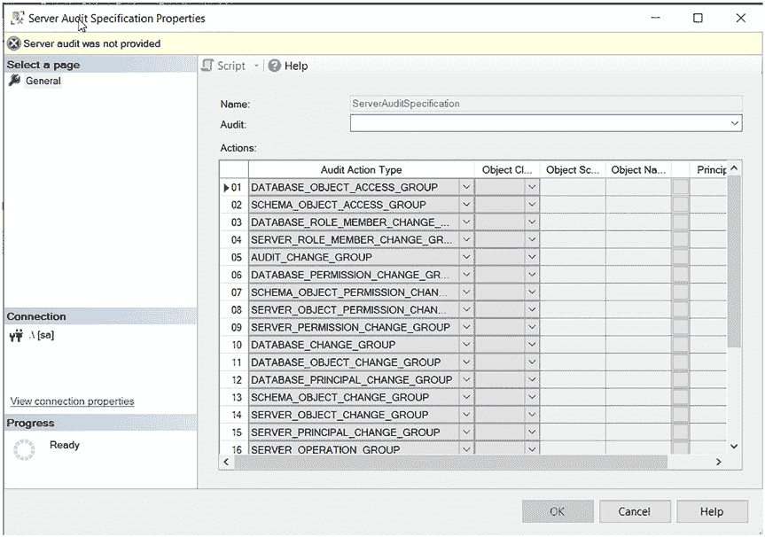
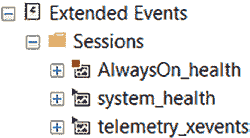

# 第 5 章 通过 SQL 脚本实施 SQL Server 审计

## 清单 5-13. 删除审计

```sql
USE [master];

DROP SERVER AUDIT [AuditSpecification];
```

如果审计未事先禁用，`清单 5-13` 中的查询将产生错误，如`图 5-9`所示。

## 图 5-9. 在审计启用时尝试删除审计导致的错误

当你删除审计时，文件仍保留在磁盘上。我曾删除审计并以为文件也一并消失了。不，文件仍然存在。这是为了方便你日后可能出于审计目的需要这些文件。你必须手动去删除它们。

删除审计时，你可能会使你的服务器和数据库审计成为孤立项。服务器和数据库审计会保持原状且看似正常，但由于审计已不存在，将不会收集任何数据。`图 5-10`向你展示了即使没有审计，服务器和数据库审计似乎仍然存在。

## 图 5-10. 审计已消失，但服务器和数据库审计看似正常

如果你通过 GUI 进入服务器或数据库审计，它们将显示一个空白的审计，如`图 5-11`所示。



## 图 5-11. 服务器审计规范缺少审计

`图 5-11`的左上角有一条信息，告诉你“未提供服务器审计”，而收集数据需要这个审计。

即使你用相同的名称重新创建审计，服务器和数据库审计也不会自动关联到新的审计。服务器和数据库审计依赖于审计的 GUID。有一种方法可以用相同的 GUID 重新创建审计，如`清单 5-14`所示。

## 清单 5-14. 使用相同的 GUID 重新创建审计

```sql
USE [master];

CREATE SERVER AUDIT [AuditSpecification]
TO FILE
( FILEPATH = N'C:\audits\'
,MAXSIZE = 50 MB
,MAX_FILES = 4
,RESERVE_DISK_SPACE = OFF
) WITH (QUEUE_DELAY = 1000, ON_FAILURE = CONTINUE,
AUDIT_GUID = 'a39b90ef-dc26-486b-b297-1571161dfda1')

ALTER SERVER AUDIT [AuditSpecification] WITH (STATE = ON);
```

你可以通过如本章前面讨论的，在 GUI 中将现有审计编写为脚本来获取 GUID。

删除服务器和数据库审计的语法略有不同。`清单 5-15`展示了这些脚本。

## 清单 5-15. 删除服务器和数据库审计

```sql
USE [master];

DROP SERVER AUDIT SPECIFICATION [ServerAuditSpecification];

USE [Auditing];

DROP DATABASE AUDIT SPECIFICATION [DatabaseAuditSpecification_Auditing];
```

如果规范未被禁用，`清单 5-15`中的脚本也会产生错误，如本节前面的`图 5-9`所示。

#### 禁用审计

你可以通过脚本禁用审计，如`清单 5-16`所示。

## 清单 5-16. 禁用审计

```sql
USE master;

ALTER SERVER AUDIT AuditSpecification
WITH (STATE = OFF);

USE master;

ALTER SERVER AUDIT SPECIFICATION [ServerAuditSpecification]
WITH (STATE = OFF);

USE Auditing;

ALTER DATABASE AUDIT SPECIFICATION [DatabaseAuditSpecification_Auditing]
WITH (STATE = OFF);
```

`清单 5-16`展示了禁用服务器和数据库审计规范的不同变体。

**注意：** 如果你想禁用审计，它不会立即禁用，而是要等到它完成对当前操作的审计。如果你正在审计大量操作，这可能很困难。从技术上讲，你能够禁用任何审计，但审计可能需要一段时间才能完成审计操作，然后才能禁用自身。

#### 修改审计

审计创建后，你可以通过对其执行 `ALTER` 语句来修改它。你需要先将其禁用。唯一不能更改的是审计的名称。要更改名称，你需要删除并重新创建它。`清单 5-17`展示了可用于修改审计的脚本。

## 清单 5-17. 修改审计


USE [master];

ALTER SERVER AUDIT [AuditSpecification] WITH (STATE = OFF);

ALTER SERVER AUDIT [AuditSpecification]
TO FILE
( MAXSIZE = 25 MB
,MAX_FILES = 3
);

ALTER SERVER AUDIT [AuditSpecification] WITH (STATE = ON);

你同样可以修改服务器和数据库审计，但它们的语法略有不同。清单 5-18 展示了这种语法。与审计本身一样，在进行修改前，你需要先禁用审计，修改完成后再重新启用它。

### 清单 5-18. 修改服务器或数据库审计

```sql
USE Auditing;

ALTER DATABASE AUDIT SPECIFICATION [DatabaseAuditSpecification_Auditing]
WITH (STATE = OFF);

ALTER DATABASE AUDIT SPECIFICATION [DatabaseAuditSpecification_Auditing]
ADD (TRANSACTION_GROUP),
ADD (SUCCESSFUL_DATABASE_AUTHENTICATION_GROUP);

ALTER DATABASE AUDIT SPECIFICATION [DatabaseAuditSpecification_Auditing]
WITH (STATE = ON);

USE master;

ALTER SERVER AUDIT SPECIFICATION [ServerAuditSpecification]
WITH (STATE = OFF);

ALTER SERVER AUDIT SPECIFICATION [ServerAuditSpecification]
ADD (LOGOUT_GROUP),
ADD (FULLTEXT_GROUP);

ALTER SERVER AUDIT SPECIFICATION [ServerAuditSpecification]
WITH (STATE = ON);
```

在下一章中，你将学习扩展事件以及如何使用它们来审核 SQL Server 上的操作。



