# 第六章

## 什么是扩展事件？

扩展事件，简称 `XEvents`，是一项内置的审核和监视功能，可通过 `SSMS` 图形界面或 `SQL` 脚本使用。你可以设置并配置它来捕获 SQL Server 上发生的几乎所有事件。它非常灵活，且相当容易设置。

扩展事件旨在替代 `SQL Server Profiler`，而 `Profiler` 预计将在未来某个 SQL Server 版本中被弃用。`Profiler` 是一种创建跟踪以捕获 SQL Server 上所有活动的方式。

扩展事件最早在 SQL Server 2008 中引入。在 SQL Server 2012 中，为了便于使用，增加了图形界面。它在 SQL Server 的每个版本中都可用。与 `SQL Server Audit` 不同，它没有基于版本的限制。

#### 扩展事件默认会话

当你在 `SSMS` 中查看扩展事件时，你会看到其中已存在一些会话。这些是 SQL Server 默认自带的，并且 SQL Server 引擎会使用它们。根据你使用的 SQL Server 版本，可能会看到不同的默认会话。图 6-1 展示了你可能看到的默认会话示例。

#### 图 6-1. 默认扩展事件会话

`system_health` 使用环形缓冲区存储收集的信息，并使用事件文件。关于扩展事件存储位置的更多信息将在[第七章“通过图形界面实现扩展事件”](https://doi.org/10.1007/978-1-4842-8634-0_7)中介绍。`AlwaysOn_health` 默认是禁用的，除非你正在使用 SQL Server 中配置的可用性组。`system_health` 和（在 2016 版本及更高版本中的）`telemetry_xevents` 主要收集有关错误、死锁和等待的信息。请勿禁用或更改这些扩展事件，它们是 SQL Server 所需的。我曾读到，即使你删除了 `telemetry_xevents`，Microsoft 也有机制在 60 秒内将其恢复。如果它们收集的正是你需要的数据，查询它们并不会受到限制。我不会介绍如何查询这些默认会话，因为它们收集的不是审计数据。我将在[第七章“通过图形界面实现扩展事件”](https://doi.org/10.1007/978-1-4842-8634-0_7)中展示如何收集数据。

#### 扩展事件组件

要使扩展事件工作，你需要配置一个会话。这个会话将收集你想要审计的信息。

### 注意

您需要具备系统管理员权限才能通过 SSMS GUI 设置扩展事件。如果通过脚本创建，则需要 `ALTER ANY EVENT` 权限。

如果只需要查询它们，则需要 `VIEW SERVER STATE`。

以下是配置会话时需要使用的组件。

#### 扩展事件模板

扩展事件附带了许多不同的模板可供选择。这使得配置更加容易，特别是当您不习惯使用或不确切知道需要配置什么来收集事件数据时。图 6-2 显示了默认情况下可用的模板列表。

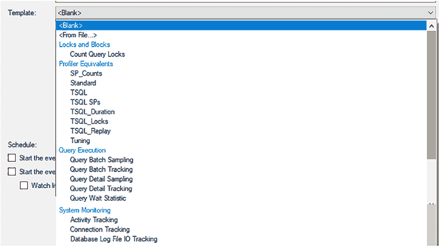
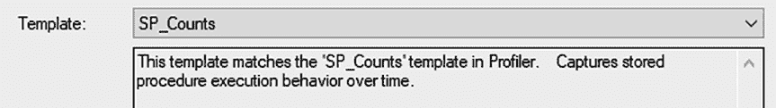

**图 6-2.** 扩展事件附带的默认模板

当您在 GUI 中创建扩展事件并选择模板时，您将获得每个模板功能的描述，如图 6-3 所示。

**图 6-3.** 默认模板描述

对于使用扩展事件进行审计，我们不会使用这些模板，但它们对于理解如何捕获事件很有用。

您可以通过导出会话来创建自定义模板。如果您知道您将反复使用自定义的扩展事件会话，那么将其添加为模板可能是有意义的。您可以通过在 SSMS 中右键单击会话并选择“导出会话”来导出会话，如图 6-4 所示。

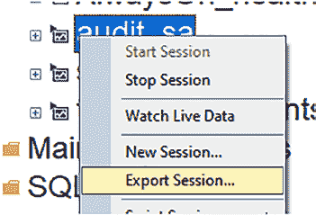
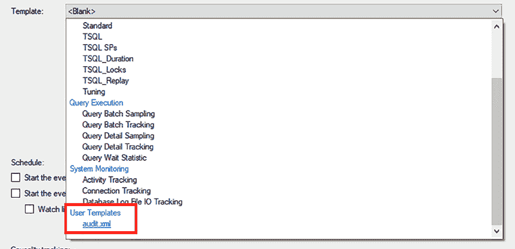

**图 6-4.** 导出扩展事件会话

只要您将模板 XML 文件存储在默认位置，类似于 `C:\Users\[user]\Documents\SQL Server Management Studio\Templates\XEventTemplates`，它就应该自动出现在模板列表中，如图 6-5 所示。

**图 6-5.** 用户创建的模板

如果您没有在“用户模板”下看到它，可以在“模板”下拉列表中选择 `<From File…>`，如图 6-6 所示。

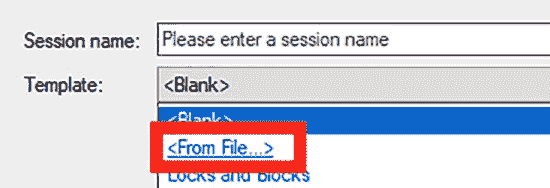
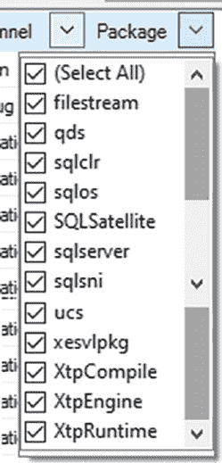

**图 6-6.** 导入模板

### 扩展事件库

扩展事件中的事件库非常广泛。它使您能够捕获 SQL Server 中发生的事件。

包是扩展事件对象的容器。有许多类型的包。包可以包括通道、类别和事件，所有这些都将在本节中介绍。图 6-7 显示了扩展事件中可用的包。

**图 6-7.** 扩展事件包下拉列表

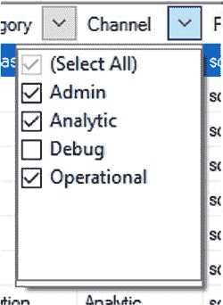

### 注意

有关包及其内容的更多信息，请访问：[`docs.microsoft.com/en-us/sql/relational-databases/extended-events/sql-server-extended-events-packages?view=sql-server-ver15`](https://docs.microsoft.com/en-us/sql/relational-databases/extended-events/sql-server-extended-events-packages?view=sql-server-ver15)

有四种事件通道有助于将事件组织成逻辑组。图 6-8 显示了作为扩展事件设置一部分的通道下拉列表。默认情况下，“调试”是未选中的。

**图 6-8.** 扩展事件通道下拉列表

这四种事件通道是：
- **管理** – 主要针对最终用户、管理员和支持人员
- **操作** – 用于分析和诊断问题或事件
- **分析** – 描述程序操作，通常用于性能调查
- **调试** – 仅供开发人员用于诊断和调试问题

事件有许多类别。图 6-9 展示了扩展事件库中可用类别的一个横截面。

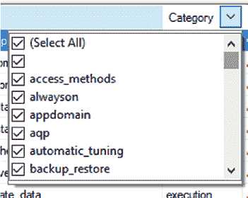

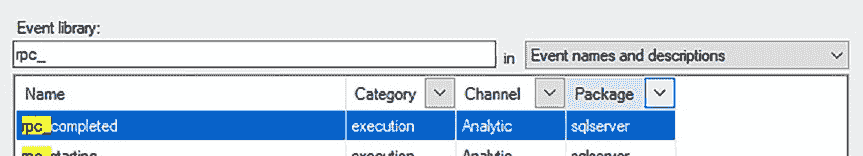

## 第 6 章 什么是扩展事件？

*图 6-9. 扩展事件类别下拉列表*

下面列出的事件是我推荐用于审核用户操作的事件。你也可以选择使用其他事件，但以下这些事件是我总是在扩展事件审核中使用的：

* `rpc_completed`
* `sql_batch_completed`

你无需筛选类别、通道或包下拉列表来使用这些事件。你可以在如图 6-10 所示的搜索框中搜索它们。事件将在"名称"下列出。

*图 6-10. 在事件库中搜索事件*

### 扩展事件的全局字段与谓词

对于你选择的每个事件，你都需要选择全局字段来捕获事件数据。全局事件也称为操作。当你首次选择一个事件包含到扩展事件会话中时，默认会显示 0 个全局字段，如图 6-11 所示。但这并不意味着它不会捕获任何信息，因为有些字段是默认捕获的。全局字段让你能更好地控制你要捕获的内容。

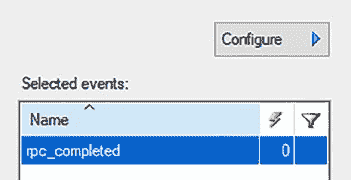

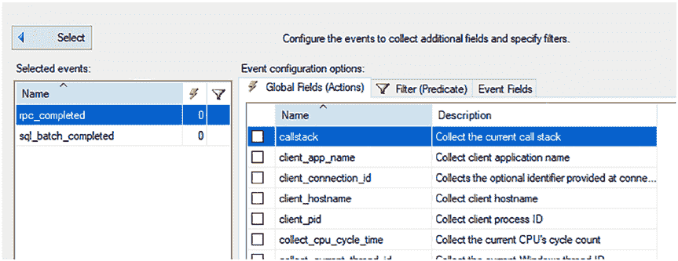

## 第 6 章 什么是扩展事件？

*图 6-11. 未选择任何全局字段的已选扩展事件*

你需要点击配置按钮来查看所选事件的全局字段，如图 6-11 所示。

点击配置后，你将进入一个配置屏幕，在那里可以选择你的全局字段。图 6-12 向你展示了 `rpc_completed` 及其相关的全局字段。

*图 6-12. 未选择任何全局字段的扩展事件 `rpc_completed`*

我推荐使用这些全局字段来捕获你的事件所需的信息：

* `client_app_name`
* `client_hostname`
* `database_name`
* `server_instance_name`
* `server_principal_name`
* `sql_text`

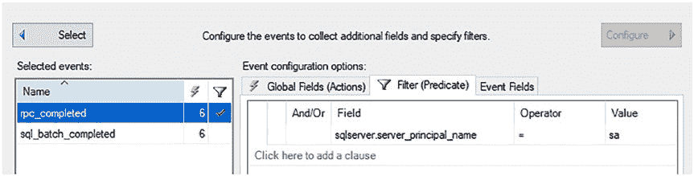

## 第 6 章 什么是扩展事件？

同时请注意图 6-12 中有一个筛选器选项卡。筛选器也称为谓词。在这里，你可以筛选你的扩展事件，仅捕获特定的用户、数据库、架构、对象等等。一旦你为所选事件设置了筛选器，它会在筛选器符号下显示一个勾选标记，如图 6-13 所示。你还会看到闪电图标下显示数字 6，因为我为每个事件选择了六个全局字段。

*图 6-13. 带有筛选器的扩展事件 `rpc_completed`*

你还需要将此筛选器添加到 `sql_batch_completed` 事件中，以确保你在所有事件中应用相同的筛选器。你可以基于许多不同的字段进行筛选。如何设置带有这些设置的扩展事件将在第 7 章"通过 GUI 实现扩展事件"中介绍。

#### 扩展事件目标

你需要为你的扩展事件选择一个目标。此目标类型将存储你的会话数据。这可以在"数据存储"页面下设置，如图 6-14 所示。

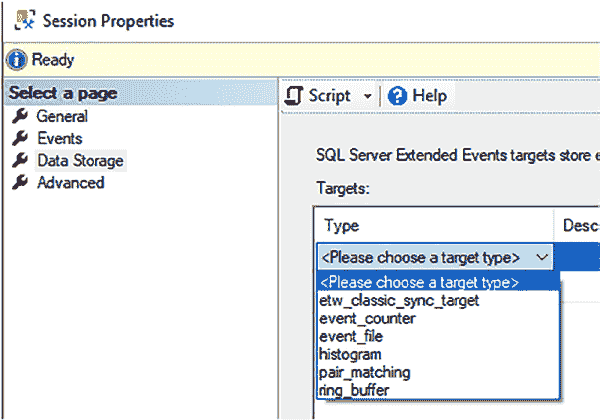

## 第 6 章 什么是扩展事件？

*图 6-14. 扩展事件的目标选项*

存储位置有多个选择。这些位置会根据你的 SQL Server 版本而有所不同。

* **`etw_classic_sync_target`** – 与 Windows 事件跟踪(ETW)协同工作以监控系统活动。
* **`event_counter`** – 统计每个指定事件发生的次数。
* **`event_file`** – 将事件会话输出从缓冲区写入磁盘文件。
* **`histogram`** – 比 `event_counter` 目标更高级。
* **`pair_matching`** – 检测没有相应结束事件的开始事件。
* **`ring_buffer`** – 适用于快速简单的事件测试。将数据保存在

以内存先进先出的方式进行。当您停止事件会话时，存储的输出将被丢弃。

`注意` 有关目标的更多信息，请访问 [`docs.microsoft.com/en-us/sql/relational-databases/extended-events/targets-for-extended-events-in-sql-server?view=sql-server-ver15`](https://docs.microsoft.com/en-us/sql/relational-databases/extended-events/targets-for-extended-events-in-sql-server?view=sql-server-ver15)

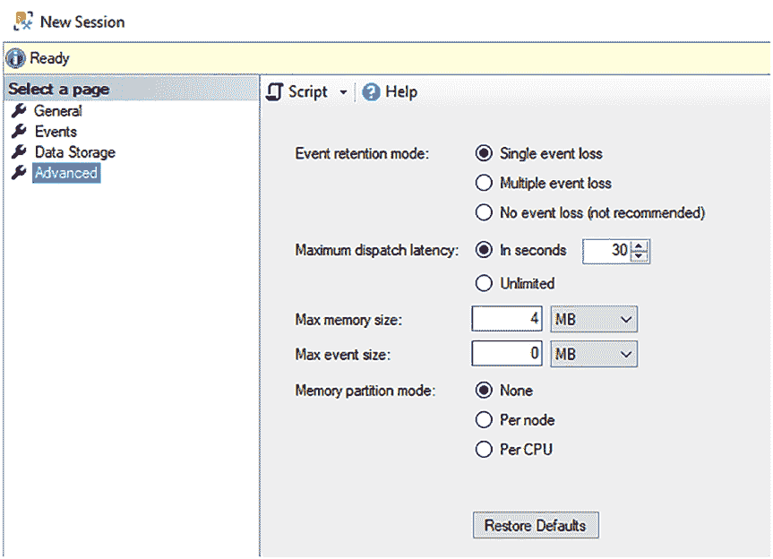

## 第 6 章 什么是扩展事件？

如何使用 `event_file` 目标设置扩展事件将在[第 7 章](https://doi.org/10.1007/978-1-4842-8634-0_7) "通过 GUI 实现扩展事件"中介绍。

#### 扩展事件高级设置

在扩展事件会话设置的 `高级` 页面上有一些附加设置。这些设置只能在您首次设置扩展事件时更改，之后无法修改。如果您以后需要更改它们，则必须删除并重新创建扩展事件。我从不更改这些设置。如果您决定更改这些设置，请务必非常小心，因为不同的设置可能会导致您的 SQL Server 出现性能问题。

图 6-15 显示了 `高级` 页面中的设置。这些是默认设置。

***图 6-15.** 扩展事件的高级选项*

您有几个高级选项。最好保留这些选项的默认值，但以下是一些描述，以帮助您理解每个选项的含义。

- `事件保留模式` – 这将决定 SQL Server 如何处理事件丢失。如果系统非常繁忙，这会告诉它是否可以接受丢失部分或全部事件数据。
  - `单个事件丢失` – 这意味着如果系统当时过于繁忙而无法使用扩展事件进行审计，SQL Server 将丢失一个事件。
  - `多个事件丢失` – 这意味着如果系统当时过于繁忙而无法使用扩展事件进行审计，SQL Server 将丢失多个事件。
  - `无事件丢失（不推荐）` – 这不会丢失任何事件，但可能会使您的系统过载，尤其是在繁忙时。这就是它不被推荐的原因。
- `最大分发延迟` – 这会按照指定的间隔将内存刷新到目标。
  - `以秒为单位` – 将按照指定的秒数间隔刷新内存。
  - `无限制` – 仅在缓冲区满时才刷新内存。
- `最大内存大小` – 最好将其保留为默认的 4 MB。最大值不能超过 2 GB，但不建议将其设置在 GB 范围。
- `最大事件大小` – 最好保留其默认值 0。指定事件允许的最大大小。
- `内存分区模式` – 指定创建事件缓冲区的位置。

`注意` 有关高级设置的更多信息，[请访问 https://docs.microsoft.com/en-us/sql/t-sql/statements/create-event-session-transact-sql?view=sql-server-ver15#with--event_session_options--n-](https://docs.microsoft.com/en-us/sql/t-sql/statements/create-event-session-transact-sql?view=sql-server-ver15#with--event_session_options--n-)

再次强调，最好将这些高级设置保留为默认值，以避免出现问题。

