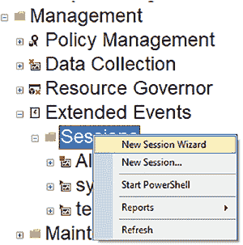
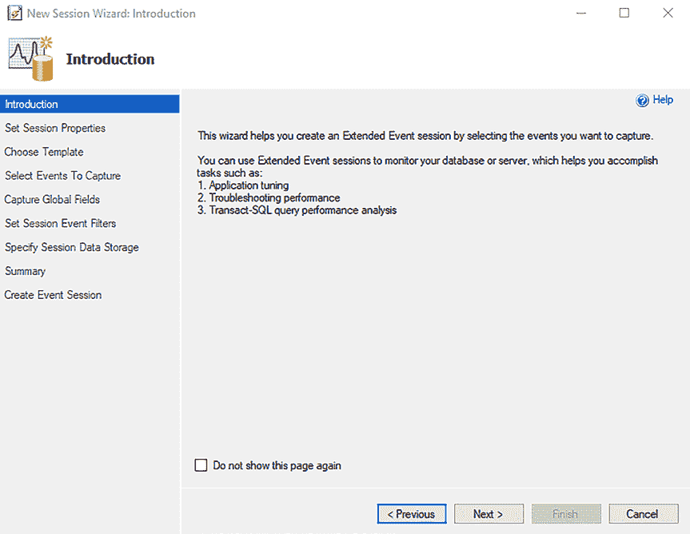

# 第 7 章 通过图形用户界面实现扩展事件

要使扩展事件工作，你需要设置一个会话。第 6 章“什么是扩展事件？”涵盖了构成会话的各个部分。在本章中，你将学习如何在 SQL Server Management Studio (`SSMS`) 中设置一个扩展事件。

**注意** 仅仅因为你可以审计一切，并不意味着你应该这样做。如果你审计所有任何事情，你将很难从海量数据中梳理出有用信息，并且可能会导致系统出现性能问题。

## 使用“新建会话向导”选项设置扩展事件

`新建会话向导` 将帮助你逐步完成扩展事件的设置。图 7-1 展示了如何在 `SSMS` 中创建扩展事件：在“管理”部分下的“扩展事件”中，右键单击“会话”。在此设置过程中，你将学习如何使用扩展事件审计一个用户。

© Josephine Bush 2022
J. Bush, *Microsoft SQL Server 和 Azure SQL 实用数据库审计指南*, [`doi.org/10.1007/978-1-4842-8634-0_7`](https://doi.org/10.1007/978-1-4842-8634-0_7#DOI)

***图 7-1.** 使用新建会话向导创建扩展事件*

**注意** 并非所有扩展事件选项都在 `新建会话向导` 中可用；大部分都有，但并非全部。如果你想查看所有可用选项，请改用 `新建会话` 选项。

选择 `新建会话向导` 后，你将看到一个对话框，它会引导你逐步填写扩展事件的详细信息和选项，如图 7-2 所示。

***图 7-2.** 新建会话向导介绍屏幕*

`介绍` 屏幕为你概述了如何使用扩展事件。单击 `下一步` 将带你进入第一个配置屏幕，即 `设置会话属性`。

