# 第 7 章：通过 GUI 实现扩展事件

本章介绍如何使用图形用户界面（GUI）来配置扩展事件。

如图 7-3 所示，此屏幕要求您为扩展事件会话命名。您还可以选择是否希望在服务器启动时启动该会话。我建议您勾选此框；否则，您的扩展事件将在重启时停止，您必须手动启动它。

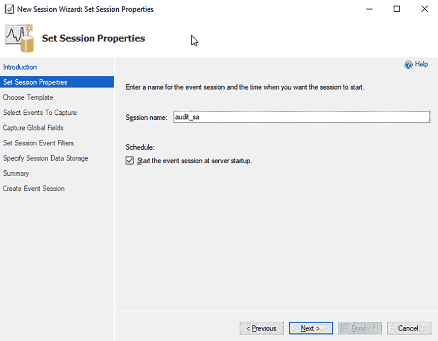

***图 7-3.** 新建会话向导 - 设置会话属性屏幕*

## 设置会话属性

在**设置会话属性**屏幕上点击**下一步**后，您将看到**选择模板**屏幕，如图 7-4 所示。我选择了**不使用模板**，因为我希望捕获来自一个用户的所有活动，而这些模板大多无法实现这一点。第 6 章“什么是扩展事件？”更详细地介绍了一些模板。

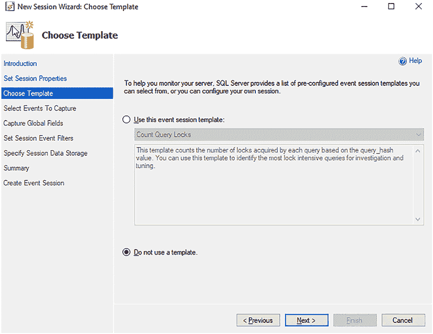

***图 7-4.** 新建会话向导 - 选择模板屏幕*

## 选择模板

在**选择模板**屏幕上点击**下一步**后，您将看到**选择要捕获的事件**屏幕，如图 7-5 所示。在此屏幕上，您将选择 `rpc_completed` 和 `sql_batch_completed`。这些事件在第 6 章“什么是扩展事件？”中有更详细的介绍。您可以在 `事件库` 文本框中搜索每个事件。选中它们，然后点击右箭头（`>`）将它们移动到 **选定的事件** 面板。

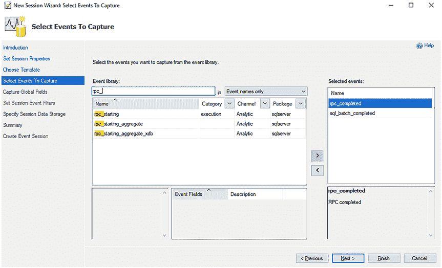

***图 7-5.** 新建会话向导 - 选择要捕获的事件屏幕*

## 选择要捕获的事件

在**选择要捕获的事件**屏幕上点击**下一步**后，您将看到**捕获全局字段**屏幕，如图 7-6 所示。当您首次进入此屏幕时，没有任何选项被勾选。此时，您必须选择要为每个选定事件收集的全局字段。

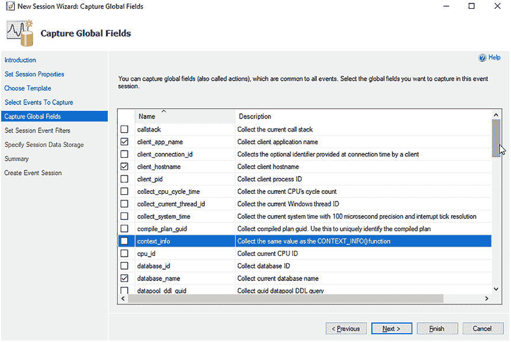

***图 7-6.** 新建会话向导 - 捕获全局字段屏幕*

## 捕获全局字段

我建议使用以下全局字段来捕获您事件所需的信息：
*   `client_app_name`
*   `client_hostname`
*   `database_name`
*   `server_instance_name`
*   `server_principal_name`
*   `sql_text`

这些全局字段在第 6 章“什么是扩展事件？”中有更详细的介绍。

如果您不选择任何全局字段，您的扩展事件仍然会收集事件数据，但可能不包含您希望看到的与该事件相关联的所有信息。这就是我喜欢选择特定全局字段的原因，以确保我获取到所需的全局字段。

## 设置会话事件筛选器

在**捕获全局字段**屏幕上点击**下一步**后，您将看到**设置会话事件筛选器**屏幕，如图 7-7 所示。此屏幕加载时，将不设置任何筛选器。您可以在此处筛选扩展事件，以仅捕获特定的用户、数据库、对象等等。我已经设置了一个 `sqlserver.session_server_principal = sa` 的筛选器。这将确保只审核由 `sa` 执行的操作。当然，您可能希望或需要审核不同的用户或对象。您也可以通过在此屏幕上添加另一行来添加多个筛选器，如图 7-7 所示。

***图 7-7.** 新建会话向导 - 设置会话事件筛选器屏幕*

如果您需要不同于等于（`=`）的操作符，可以点击 **操作符** 下拉菜单查看所有不同的选择，如图 7-8 所示。您可以将其视作 SQL 查询中的 `WHERE` 子句。

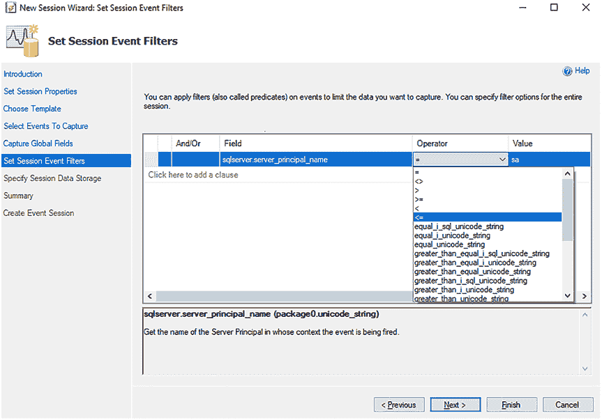

***图 7-8.** 新建会话向导 - 设置会话事件筛选器操作符下拉菜单*

您可以有多个筛选器。例如，您可以添加另一个关于 `sqlserver.session_server_principal` 的筛选器。

### 通过 GUI 实现扩展事件

`database_name = master`。这样，你只审计 `sa` 在 `master` 数据库上执行的操作。此示例如图 7-9 所示。

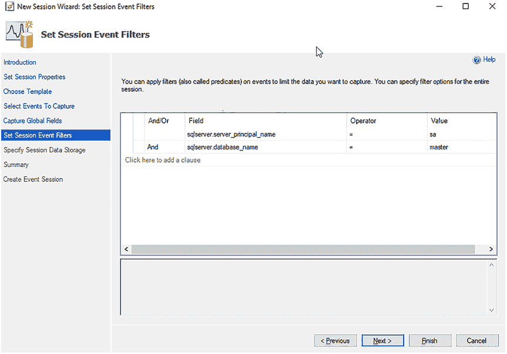

`图 7-9. 新会话向导设置会话事件筛选器（多个筛选器）`

如果需要添加或删除子句，可以右键单击它们并从弹出菜单中选择选项，如图 7-10 所示。

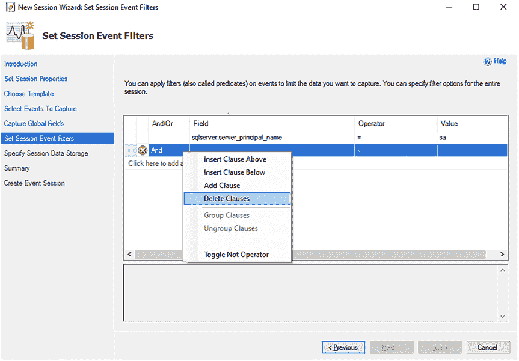

`图 7-10. 新会话向导设置会话事件筛选器（修改筛选器）`

如果选择“切换 NOT 运算符”，你设置的筛选器将变为相反的条件。例如，如果你添加了 `sqlserver.database_name = master`，但随后选择了“切换 NOT 运算符”，它将捕获除 `master` 之外的所有数据库，如图 7-11 所示。感叹号 (`!`) 表示此筛选器已切换为“非”模式。

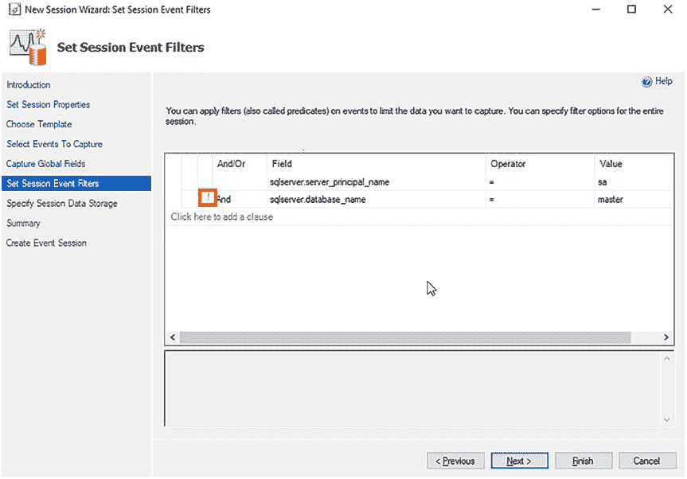

`图 7-11. 新会话向导设置会话事件筛选器（切换 NOT 运算符）`

你还可以通过选择多行并选择“分组子句”来将子句分组在一起。这些行随后将用方括号 (``) 连接，如图 7-12 所示。

![`图 7-12. 新会话向导设置会话事件筛选器（分组子句）`在“设置会话事件筛选器”屏幕上单击“下一步”后，你将看到“指定会话数据存储”屏幕。你将在此处设置存储选项。这是新会话向导比新建会话对话框设置更有限的地方。本章后面将介绍“新建会话”选项。新会话向导只有两种存储选项：文件和环形缓冲区，如图 7-13 所示。我倾向于将事件存储在文件中，因此选择了该选项。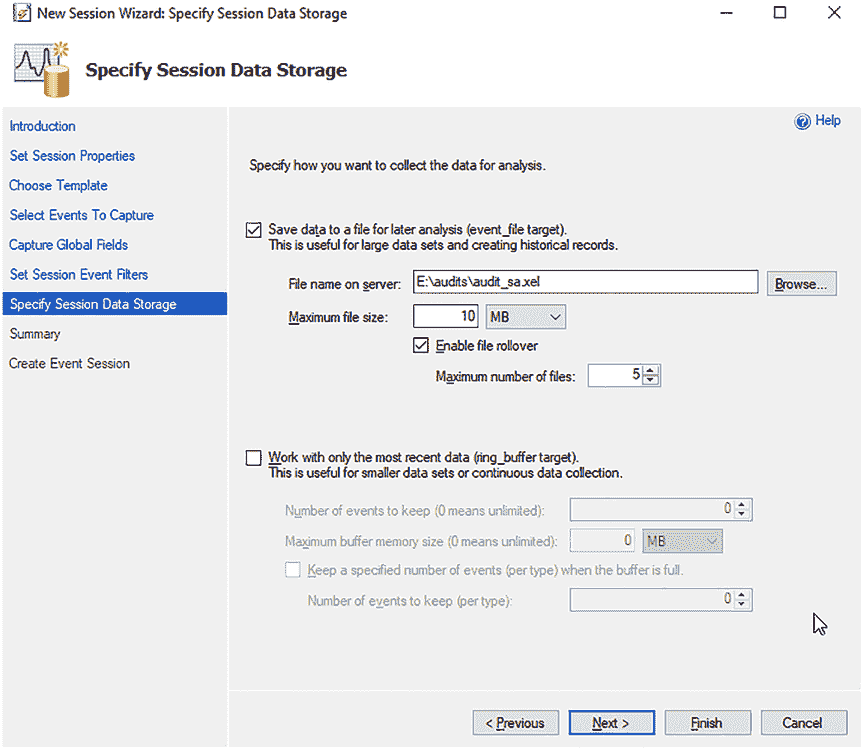

`图 7-13. 新会话向导（指定会话数据存储屏幕）`

以下是一些关于文件存储的建议：
*   不要将文件存储在 C 盘或其他 SQL Server 用于数据和日志文件的驱动器上。
*   将最大文件大小设置为较小的值，例如 10 MB，并启用 5-10 个文件的文件滚动。如果设置了较大的文件大小和许多滚动文件，它们将几乎无法查询。

你还可以将数据存储在环形缓冲区中，或仅使用环形缓冲区。环形缓冲区更难查询，因为它以 XML 格式存储。使用文件，你可以更好地控制数据保留时间，而使用环形缓冲区，你可能会在意识到之前就丢失数据，因为环形缓冲区只存储一定数量的事件，并且这些事件可能来自你正在设置的此扩展事件之外的其他事件。

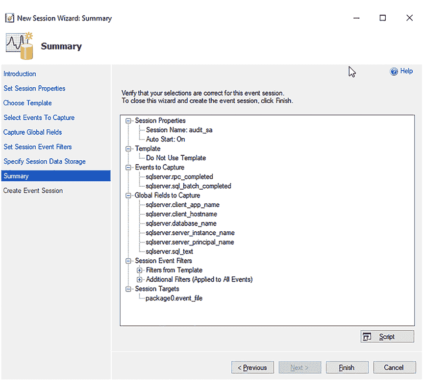

在“指定会话数据存储”屏幕上单击“下一步”后，你将看到“摘要”屏幕。这将概述你选择的所有设置。此屏幕还有一个“脚本”按钮，因此你可以将所有设置编写为脚本。图 7-14 显示了摘要的展开视图。

`图 7-14. 新会话向导（摘要）`

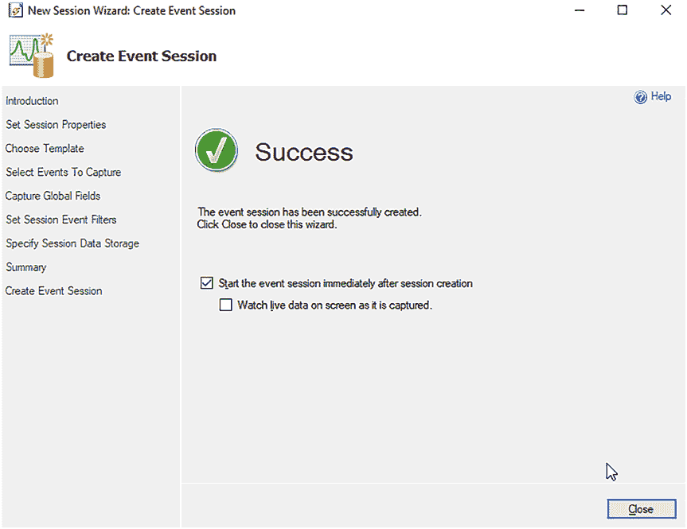

要创建扩展事件，请单击“完成”。扩展事件将被设置，你将获得在创建后启动它的选项，并可以在屏幕上实时查看数据，如图 7-15 所示。

`图 7-15. 新会话向导（创建事件会话屏幕）`

图 7-15 中的这些选项默认情况下均未选中。最佳实践是在创建后启动会话。这不是必需的，但如果会话停止，则不会收集任何事件数据。此外，此时你可以实时在屏幕上查看数据，也可以稍后查看该数据，本章后面将对此进行介绍。

