# 第 7 章 通过图形界面实现扩展事件

你可以通过查看扩展事件上的图标来确定其是否已启用。如果是绿色箭头，则表示已启用；如果是红色方框，则表示已禁用。图 7-16 展示了这两种状态。

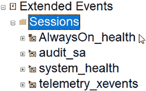

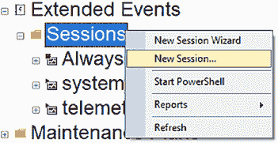

**图 7-16。** 扩展事件状态

在图 7-16 中，`AlwaysOn_health` 是禁用的，其余扩展事件是启用的。

#### 通过“新建会话”选项设置扩展事件

“新建会话”对话框将帮助你设置扩展事件。图 7-17 展示了如何在 SSMS 中创建扩展事件：在“管理”部分下的“扩展事件”节点上右键单击，然后选择“新建会话”。此选项允许你配置全套扩展事件选项。它类似于向导，但不会逐步引导你完成配置，而是将所有配置页面集中在一个易于访问的对话框中，并在左侧列出页面。在这个设置过程中，你将学习如何使用扩展事件来审核一个用户。

**图 7-17。** 使用“新建会话”对话框创建扩展事件

选择“新建会话”后，你将看到一个对话框，其屏幕与“新建会话向导”类似。如图 7-18 所示，在“常规”页面上，你将：

*   为其命名
*   选择一个模板（在此例中，我们将其留空）
*   决定启动计划
*   选择是否在创建后监视实时数据
*   选择是否启用因果关系跟踪

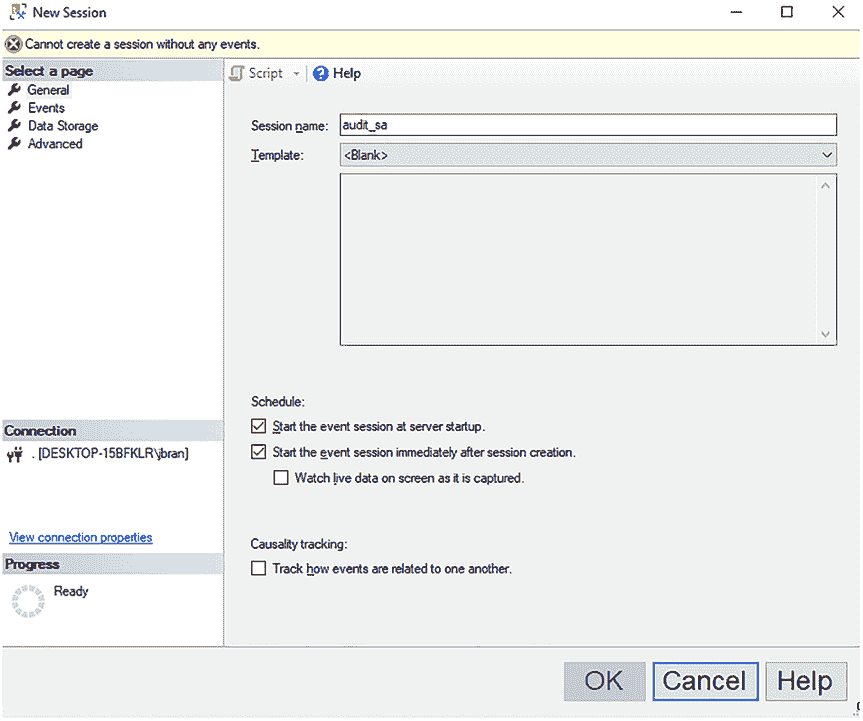

**图 7-18。** 新建会话“常规”页

我不使用模板。我总是选择“在服务器启动时启动会话”和“创建后启动事件会话”。我从不监视实时捕获的数据，因为稍后可以查看，本章稍后会介绍。我不使用因果关系跟踪，但它可以帮助你确定与查询关联的所有事件。

配置好“常规”页面后，你可以单击“事件”页面。在这里，你将选择事件，如 `rpc_completed` 和 `sql_batch_completed`，这些在第 6 章“什么是扩展事件？”中有更详细的介绍，如图 7-19 所示。

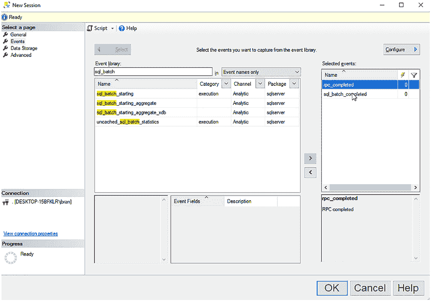

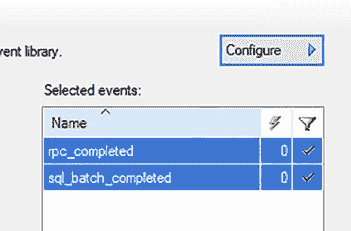

**图 7-19。** 新建会话“事件”页

一旦将事件添加到“选定的事件”中，这些事件尚未配置任何全局字段（也称为操作）。你可以在闪电图标下看到显示为 0。要配置它们，你必须单击“配置”。

由于我建议为两个事件捕获相同的字段，因此在单击“配置”之前同时选中它们，如图 7-20 所示。

**图 7-20。** 同时选择两个事件以进行相同配置

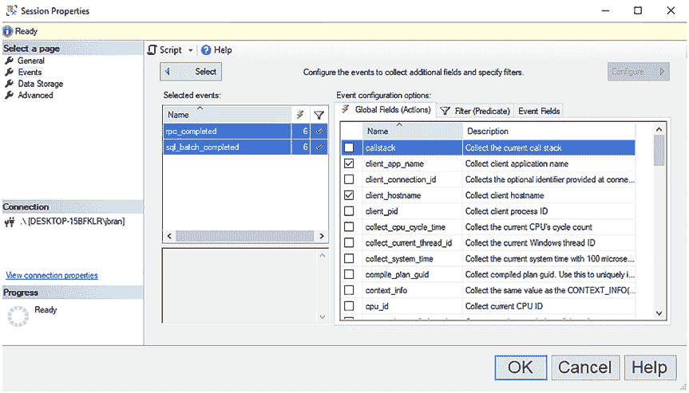

单击“配置”后，你将进入一个带有全局字段的配置页面。每个事件都包含默认字段，但我建议使用这些全局字段来捕获你事件所需的信息：

*   `client_app_name`
*   `client_hostname`
*   `database_name`
*   `server_instance_name`
*   `server_principal_name`
*   `sql_text`

这些全局字段在第 6 章“什么是扩展事件？”中有更详细的介绍。

图 7-21 向你展示了在选择了我前面列出的字段后，事件和字段的显示方式。

**图 7-21。** 新建会话“事件”页 - 配置全局字段

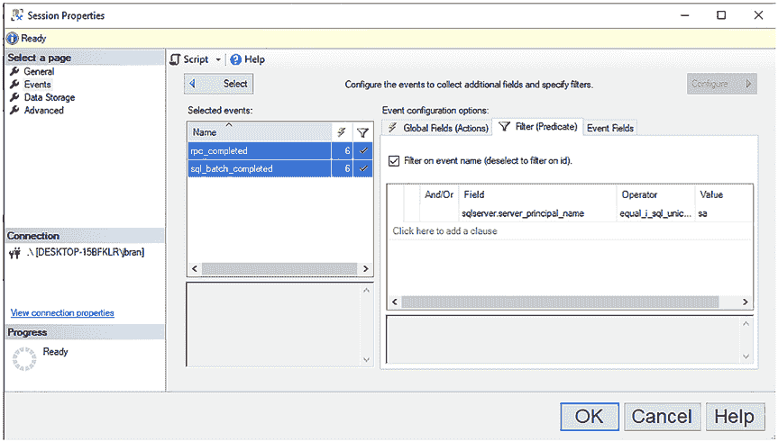

在图 7-21 中，你可以看到 `rpc_completed` 和 `sql_batch_completed` 都具有六个全局字段。

有一个名为“筛选器”（Filter，也称作谓词 Predicate）的选项卡。图 7-22 展示了设置筛选器后的样子。我设置了一个筛选器，条件是 `sqlserver.server_principal_name = sa`。与全局字段一样，建议为每个事件保持筛选器设置相同。

**图 7-22.** “新建会话”事件页面筛选器

如果需要在已选事件中添加更多事件，可以点击图 7-22 中所示的“选择”按钮。这将带你返回到事件库。如果你对所选事件及其全局字段和筛选器感到满意，可以点击“数据存储”页面。这将带你到一个可以配置存储选项的页面。

这里的存储选项比“新建会话向导”中的更多。这些选项在第 6 章“什么是扩展事件？”中有更详细的介绍。图 7-23 展示了我如何为扩展事件配置存储。

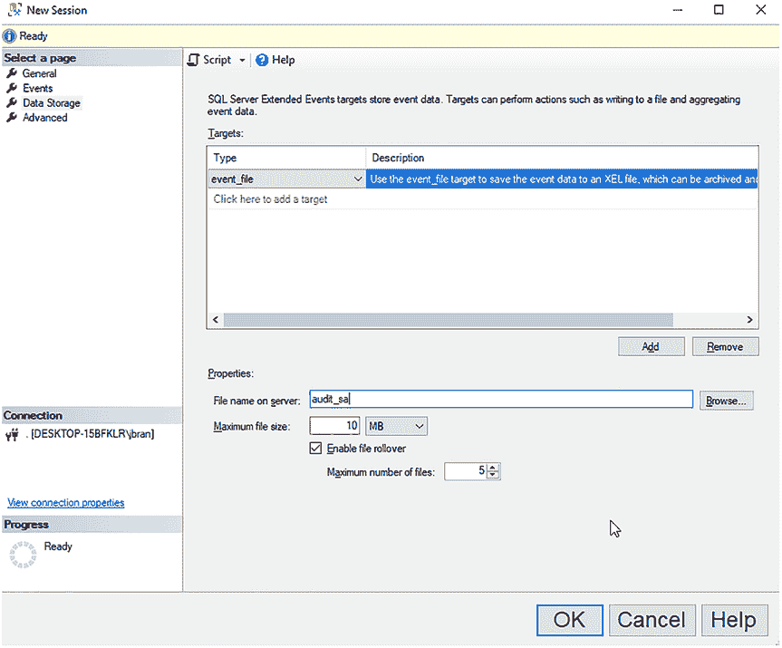

第 7 章 通过 GUI 实现扩展事件

**图 7-23.** “新建会话数据存储”页面

以下是一些关于文件存储的建议：

*   不要将文件存储在 C 盘或 SQL Server 用于数据和日志文件的其他驱动器上。
*   将最大文件大小设置为较小的值，例如 10 MB，并启用文件滚动更新，设置为 5-10 个文件。如果设置了较大的文件大小和很多滚动文件，将来查询这些文件会变得几乎不可能。

还有一个“高级”页面。我建议保持原样。关于这些选项的更多解释在第 6 章“什么是扩展事件？”中。

当你对会话配置满意后，点击图 7-23 所示的“确定”按钮，会话就会创建。

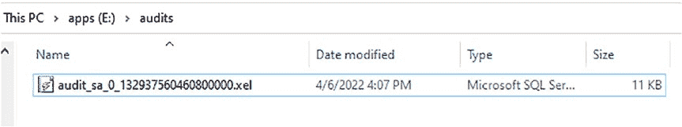

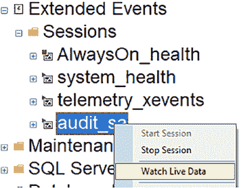

第 7 章 通过 GUI 实现扩展事件

**扩展事件文件**

如果你为扩展事件选择了文件目标，那么在启用扩展事件后，`.xel` 文件将被放置在磁盘上，如图 7-24 所示。事件数据将存储在这里。

**图 7-24.** 磁盘上的扩展事件文件

随着数据收集，该文件会增长到扩展事件中指定的大小。然后，它将创建另一个文件，最多创建配置中指定的文件数量。一旦最后一个文件被写满，它将删除最旧的文件并创建另一个新文件。你需要了解文件写满的速度有多快，这样才不会在数据被删除前错过收集它们。

**查询扩展事件数据**

你可以通过 SSMS 右键点击扩展事件会话来查询扩展事件数据，如图 7-25 所示。

**图 7-25.** 查看扩展事件数据

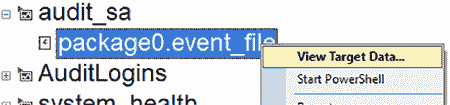

第 7 章 通过 GUI 实现扩展事件

SSMS 查询窗口区域会打开一个新的选项卡，如图 7-26 所示。“监视实时数据”最初总是空的。它只显示从此刻起发生的事件，不显示过去的事件。

列表可能为空，因为尚未发生任何可审计的事件。也可能有大量的审计数据，因为发生了很多你并未意识到正在发生的事情。

你还可以展开扩展事件，查看其中的文件，如图 7-26 所示。这将为你提供与“监视实时数据”相同的视图，但仅针对这个特定的文件。

**图 7-26.** 查看目标数据

图 7-27 展示了事件数据的默认视图，但这可能不是查看数据的最佳方式。

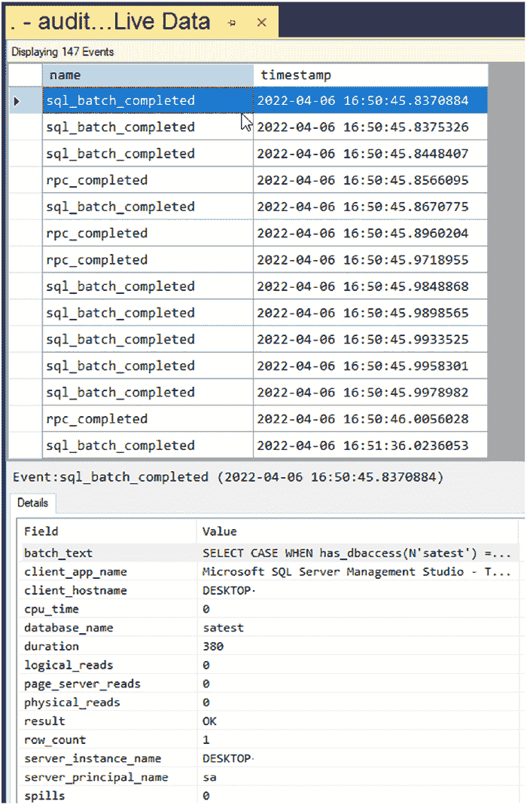

第 7 章 通过 GUI 实现扩展事件

**图 7-27.** “监视实时数据”结果

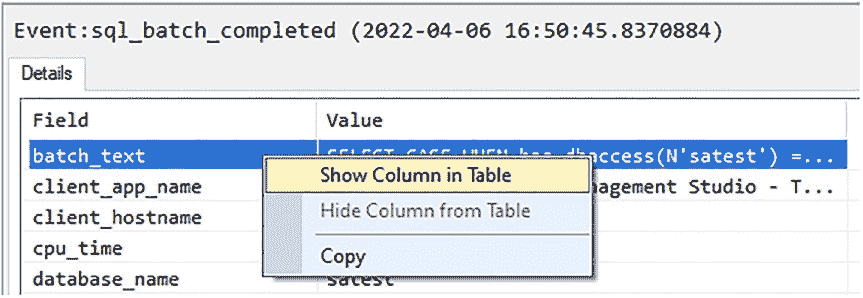

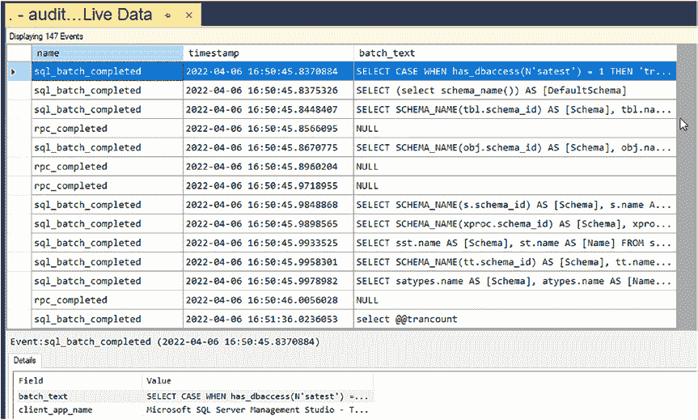

第 7 章 通过 GUI 实现扩展事件

你可以在顶部面板中添加额外的列，以便更轻松地查看每个事件捕获的内容，而无需点击每个事件来查看其详细信息。

